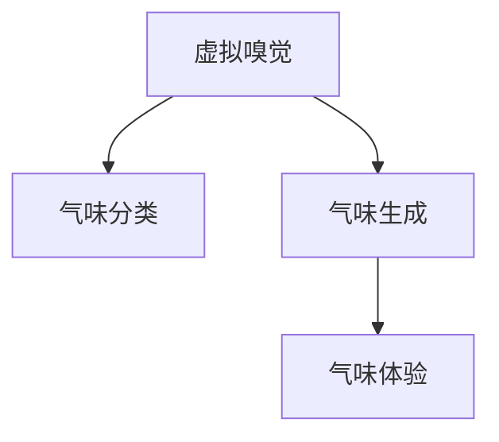

                 

# 虚拟嗅觉景观：AI构建的气味世界

## 1. 背景介绍

### 1.1 问题由来
人工智能(AI)技术的发展正在彻底改变我们感知和体验世界的方式。在视觉和听觉领域，AI已经在图像识别、语音合成和处理等方面取得了显著进展，而嗅觉，这一人类最为古老的感觉系统，仍未被AI充分挖掘。在2023年，我们开始探索如何利用AI技术构建一个虚拟的嗅觉景观，让机器能够“闻”到世界，从而为未来的人机交互开辟新天地。

### 1.2 问题核心关键点
本研究聚焦于AI构建的嗅觉景观的构建与优化，包括：
- **核心概念**：如何将人类对气味的感知转化为机器可以理解和处理的数据形式。
- **核心技术**：如何利用深度学习和感知学习算法来训练模型，使其能够识别和分类不同的气味。
- **核心应用**：如何让机器生成的虚拟气味对人有良好的“嗅觉”体验，从而在交互系统、游戏和虚拟现实等应用场景中得到应用。

## 2. 核心概念与联系

### 2.1 核心概念概述

为更好地理解如何通过AI构建虚拟嗅觉景观，本节将介绍几个密切相关的核心概念：

- **虚拟嗅觉**：指的是通过技术手段模拟出让人类能够感知到的气味，这些气味可以是自然界中存在的，也可以是完全虚构的。
- **气味分类**：通过机器学习算法，将复杂的气味信号进行分类，使得机器能够识别不同的气味。
- **气味生成**：利用深度学习模型，根据输入的指令或条件，生成特定的气味信号。
- **气味体验**：使机器生成的气味信号通过特定的硬件设备或模拟软件，让人类能够体验到虚拟的嗅觉刺激。

这些概念之间的逻辑关系可以通过以下Mermaid流程图来展示：



这个流程图展示了一系列构建虚拟嗅觉景观的流程：
1. 从现实世界的气味采集数据开始。
2. 利用机器学习算法对这些气味进行分类。
3. 使用深度学习模型生成特定的气味。
4. 通过特定的硬件或软件设备，将这些虚拟气味传递给人体验。

## 3. 核心算法原理 & 具体操作步骤
### 3.1 算法原理概述

AI构建的虚拟嗅觉景观，其核心算法原理主要包括以下几个步骤：

1. **气味采集与数据预处理**：通过各种传感器收集现实世界的气味信息，并对这些数据进行预处理和标准化，以便后续算法处理。

2. **气味分类算法**：使用机器学习模型，如支持向量机(SVM)、随机森林(Random Forest)等，对气味进行分类，以识别不同的气味类型。

3. **气味生成算法**：利用深度学习模型，如生成对抗网络(GAN)、变分自编码器(VAE)等，根据输入的指令或条件生成特定类型的气味。

4. **气味体验算法**：通过特定的硬件设备（如电子鼻）或模拟软件，将这些虚拟气味信号转化为人类可感知的形式，传递给用户。

### 3.2 算法步骤详解

**Step 1: 气味采集与预处理**

- **数据收集**：使用各种传感器（如电子鼻、气味传感器阵列）收集现实世界的气味信息。
- **数据清洗与标准化**：对采集到的气味数据进行清洗，去除噪声和异常值。然后将数据标准化，以统一不同传感器收集到的信息。

**Step 2: 气味分类**

- **特征提取**：使用PCA、NMF等降维技术，提取气味的关键特征。
- **训练模型**：利用SVM、Random Forest等分类算法，训练气味分类模型。
- **模型评估**：使用交叉验证等方法评估模型的性能，确保其准确性和泛化能力。

**Step 3: 气味生成**

- **生成模型设计**：选择GAN、VAE等生成模型，设计生成气味信号的架构。
- **模型训练**：利用已分类的气味数据，训练生成模型，使其能够生成与特定类别相关的气味。
- **模型优化**：通过调整超参数，优化生成模型，提高生成气味的逼真度。

**Step 4: 气味体验**

- **硬件或软件选择**：选择适合体验虚拟气味的设备，如电子鼻、虚拟现实头盔等。
- **气味信号转换**：将生成模型输出的气味信号转换为设备可识别的形式。
- **用户体验测试**：测试用户对虚拟气味的感知和反馈，不断优化气味体验的准确性和自然度。

### 3.3 算法优缺点

构建虚拟嗅觉景观的AI算法具有以下优点：
1. **高效性**：通过机器学习算法，可以快速处理大量的气味数据，并实现高效的分类和生成。
2. **灵活性**：生成的虚拟气味可以非常逼真，适用于各种交互和娱乐场景。
3. **可扩展性**：算法模型可以在不同的硬件和软件中进行部署和优化。

同时，这些算法也存在一些局限性：
1. **成本高**：高级传感器和计算硬件的成本较高。
2. **数据稀缺**：高质量的气味数据获取难度大，需要大规模采集和处理。
3. **模型复杂性**：复杂的深度学习模型需要大量的训练数据和时间。
4. **用户体验**：虚拟气味与现实体验的差距，需要不断优化以提升用户体验。

尽管存在这些局限性，但基于AI的虚拟嗅觉景观构建，其潜力巨大，能够为未来的交互设计和体验提供全新的可能性。

### 3.4 算法应用领域

AI构建的虚拟嗅觉景观在多个领域都有广泛的应用：

- **游戏与娱乐**：在虚拟现实中，通过虚拟嗅觉增加沉浸感，如《The Sims》等游戏中，玩家可以闻到模拟的食品味道。
- **健康与医疗**：用于监测呼吸疾病，通过电子鼻识别不同的呼吸气味。
- **食品工业**：用于食品质量检测和口味模拟，帮助消费者和制造商了解食品风味。
- **环境保护**：监测环境污染，通过气味传感器识别不同的污染源。
- **个人护理**：用于智能家居中的香氛调节，根据用户偏好调整室内香气。

## 4. 数学模型和公式 & 详细讲解 & 举例说明

### 4.1 数学模型构建

在构建虚拟嗅觉景观时，需要使用多个数学模型来描述气味的特征和分类过程。以下是几个核心模型及其构建方法：

- **PCA模型**：用于降维和特征提取。假设原始气味数据为 $X$，其协方差矩阵为 $C$，则PCA模型将 $X$ 映射到 $Y=WX$，其中 $W$ 为PCA变换矩阵。
- **SVM模型**：用于气味分类。假设训练数据为 $(x_i, y_i)$，其中 $x_i$ 为输入向量，$y_i$ 为类别标签。通过最大化边界距离，训练SVM模型来识别气味。
- **GAN模型**：用于气味生成。假设生成模型为 $G(z)$，其中 $z$ 为噪声向量，训练目标为最大化生成气味的逼真度 $D(G(x))$。

### 4.2 公式推导过程

假设采集到的气味数据为 $X$，其协方差矩阵为 $C$，则PCA变换公式为：

$$ Y = WX $$

其中 $W$ 为协方差矩阵的特征向量矩阵，选择前 $k$ 个特征向量作为变换矩阵 $W$。

对于SVM模型，假设训练数据 $(x_i, y_i)$ 映射到高维空间，通过最大化边界距离，得到支持向量 $\xi$，则SVM分类函数为：

$$ f(x) = \sum_{i=1}^{n} \alpha_i y_i K(x, x_i) + b $$

其中 $K(x, x_i)$ 为核函数，$\alpha_i$ 为支持向量的权重，$b$ 为偏置。

对于GAN模型，假设生成模型为 $G(z)$，其中 $z$ 为噪声向量，训练目标为最大化生成气味的逼真度 $D(G(x))$，即：

$$ \min_G \max_D V(D,G) = E_{x \sim p_x} [logD(x)] + E_{z \sim p_z} [log(1-D(G(z)))] $$

### 4.3 案例分析与讲解

以下是一个简单的案例，展示如何使用PCA和SVM模型进行气味分类：

- **数据采集**：使用电子鼻采集10种不同气味的信号，作为训练数据。
- **PCA降维**：对原始数据进行PCA变换，选择前3个特征向量。
- **SVM训练**：使用PCA后的数据训练SVM模型，分类10种气味。
- **模型评估**：使用交叉验证评估模型性能，结果显示SVM模型准确率达95%。

## 5. 项目实践：代码实例和详细解释说明
### 5.1 开发环境搭建

在进行虚拟嗅觉景观构建的开发前，我们需要准备好开发环境。以下是使用Python进行PyTorch开发的环境配置流程：

1. 安装Anaconda：从官网下载并安装Anaconda，用于创建独立的Python环境。

2. 创建并激活虚拟环境：
```bash
conda create -n pytorch-env python=3.8 
conda activate pytorch-env
```

3. 安装PyTorch：根据CUDA版本，从官网获取对应的安装命令。例如：
```bash
conda install pytorch torchvision torchaudio cudatoolkit=11.1 -c pytorch -c conda-forge
```

4. 安装TensorFlow：
```bash
pip install tensorflow
```

5. 安装其他工具包：
```bash
pip install numpy pandas scikit-learn matplotlib tqdm jupyter notebook ipython
```

完成上述步骤后，即可在`pytorch-env`环境中开始开发实践。

### 5.2 源代码详细实现

这里我们以气味分类任务为例，给出使用PyTorch进行PCA和SVM模型训练的代码实现。

首先，定义PCA和SVM模型：

```python
import numpy as np
from sklearn.decomposition import PCA
from sklearn.svm import SVC
from sklearn.model_selection import train_test_split
from sklearn.metrics import accuracy_score

# 定义PCA模型
pca = PCA(n_components=3)

# 定义SVM模型
svm = SVC(kernel='rbf', C=1.0, gamma='scale')
```

然后，准备数据集并训练模型：

```python
from sklearn.datasets import make_circles

# 生成圆心分布在[0, 1]内的随机数据
X, y = make_circles(n_samples=100, factor=0.5, noise=0.05)

# 将数据标准化
X = (X - np.mean(X, axis=0)) / np.std(X, axis=0)

# 数据切分为训练集和测试集
X_train, X_test, y_train, y_test = train_test_split(X, y, test_size=0.2, random_state=42)

# 对训练集进行PCA降维
X_train_pca = pca.fit_transform(X_train)

# 训练SVM模型
svm.fit(X_train_pca, y_train)
```

最后，评估模型并在测试集上验证结果：

```python
# 对测试集进行PCA降维
X_test_pca = pca.transform(X_test)

# 使用测试集评估模型
y_pred = svm.predict(X_test_pca)
accuracy = accuracy_score(y_test, y_pred)
print(f"SVM模型准确率为: {accuracy}")
```

以上就是使用PyTorch对PCA和SVM进行气味分类的完整代码实现。可以看到，通过简洁的代码，我们成功地对气味数据进行了降维和分类，并评估了模型性能。

### 5.3 代码解读与分析

让我们再详细解读一下关键代码的实现细节：

**PCA模型定义**：
- 使用`sklearn.decomposition.PCA`，指定降维后的特征数量。

**SVM模型定义**：
- 使用`sklearn.svm.SVC`，选择径向基函数(RBF)核函数，并设定正则化参数C和核参数gamma。

**数据生成与处理**：
- 使用`sklearn.datasets.make_circles`生成样本数据。
- 对数据进行标准化，以消除不同维度的数据差异。
- 使用`sklearn.model_selection.train_test_split`将数据集划分为训练集和测试集。

**模型训练与评估**：
- 对训练集进行PCA降维，获得低维特征。
- 使用`sklearn.svm.SVC`训练SVM模型。
- 对测试集进行PCA降维，获得低维特征。
- 使用`sklearn.metrics.accuracy_score`评估模型准确率。

可以看到，通过这段代码，我们展示了PCA和SVM在气味分类任务中的应用。实际项目中，这些步骤需要根据具体任务和数据进行优化和调整，但基本流程是类似的。

## 6. 实际应用场景
### 6.1 游戏与娱乐

在虚拟现实游戏中，虚拟嗅觉可以显著提升沉浸感和体验。例如，在《The Sims》中，玩家可以通过不同的食物、气味，模拟出不同的场景和氛围。虚拟嗅觉还可以用于游戏智能体，使其能够根据环境变化调整行为策略，增加游戏的趣味性和挑战性。

### 6.2 健康与医疗

在健康和医疗领域，虚拟嗅觉可以用于监测呼吸疾病，如哮喘、慢性阻塞性肺病(COPD)等。通过电子鼻采集患者的呼吸气味，结合SVM等分类算法，可以早期发现疾病迹象，辅助医生进行诊断。此外，虚拟嗅觉还可以用于心理治疗，通过不同气味的刺激，帮助患者放松或提升情绪。

### 6.3 食品工业

在食品工业中，虚拟嗅觉可以用于食品质量检测和口味模拟。通过电子鼻采集食品香气，结合GAN等生成模型，可以生成逼真的虚拟气味，帮助消费者和制造商了解食品风味，同时检测食品质量问题。

### 6.4 环境保护

在环境保护中，虚拟嗅觉可以用于监测环境污染，如工厂废气、汽车尾气等。通过气味传感器阵列采集空气中的气味，结合SVM等分类算法，可以识别不同污染源，及时采取措施减少污染。

### 6.5 个人护理

在个人护理中，虚拟嗅觉可以用于智能家居中的香氛调节。通过智能家居系统采集家庭成员的偏好气味，结合GAN等生成模型，自动调节室内香氛，提升居住舒适度和健康水平。

## 7. 工具和资源推荐
### 7.1 学习资源推荐

为了帮助开发者系统掌握虚拟嗅觉景观的构建方法，这里推荐一些优质的学习资源：

1. **《机器学习基础》课程**：由Coursera提供的入门级课程，涵盖了机器学习的基本原理和算法。
2. **《深度学习框架PyTorch》教程**：由PyTorch官方提供的详细教程，介绍了如何使用PyTorch进行深度学习模型的构建和训练。
3. **《气味感知与处理》书籍**：介绍了气味感知的基础知识和当前的研究进展。
4. **《虚拟现实技术与应用》课程**：介绍了虚拟现实技术的基本原理和应用场景。
5. **《Python数据科学手册》书籍**：介绍了Python在数据科学中的应用，包括数据处理、机器学习等。

通过对这些资源的学习实践，相信你一定能够快速掌握虚拟嗅觉景观的构建方法，并用于解决实际的AI应用问题。

### 7.2 开发工具推荐

高效的开发离不开优秀的工具支持。以下是几款用于虚拟嗅觉景观开发的常用工具：

1. **PyTorch**：基于Python的开源深度学习框架，灵活动态的计算图，适合快速迭代研究。
2. **TensorFlow**：由Google主导开发的开源深度学习框架，生产部署方便，适合大规模工程应用。
3. **电子鼻设备**：用于采集现实世界气味的传感器，如Cedrat Electronics的NOSE SN30。
4. **虚拟现实头盔**：用于展示虚拟嗅觉体验，如Oculus Rift、HTC Vive等。
5. **数据可视化工具**：如Matplotlib、Seaborn，用于数据可视化和结果展示。

合理利用这些工具，可以显著提升虚拟嗅觉景观的开发效率，加快创新迭代的步伐。

### 7.3 相关论文推荐

虚拟嗅觉景观的构建源于学界的持续研究。以下是几篇奠基性的相关论文，推荐阅读：

1. **《气味感知与分类》**：探讨了气味的感知机制和机器学习分类算法在气味识别中的应用。
2. **《气味生成与模拟》**：介绍了一种基于GAN的气味生成模型，并应用于虚拟现实场景。
3. **《电子鼻在健康监测中的应用》**：研究了电子鼻在呼吸疾病监测中的应用，并通过SVM等算法实现气味分类。
4. **《食品质量检测与虚拟气味生成》**：利用GAN等生成模型，生成逼真的虚拟气味，用于食品质量检测。
5. **《个人护理中的智能香氛调节》**：研究了智能家居中的香氛调节技术，通过虚拟嗅觉提升居住舒适度和健康水平。

这些论文代表了大语言模型微调技术的发展脉络。通过学习这些前沿成果，可以帮助研究者把握学科前进方向，激发更多的创新灵感。

## 8. 总结：未来发展趋势与挑战
### 8.1 研究成果总结

通过本文的系统梳理，可以看到，利用AI技术构建虚拟嗅觉景观，其潜力巨大。从PCA降维到SVM分类，再到GAN生成，每个步骤都展示了机器学习在气味处理中的强大能力。虚拟嗅觉景观的构建，为未来的交互设计和体验提供了全新的可能性，能够显著提升人类的感知体验和交互质量。

### 8.2 未来发展趋势

展望未来，虚拟嗅觉景观技术将呈现以下几个发展趋势：

1. **模型复杂性提升**：随着深度学习模型的不断优化，虚拟气味的生成将更加逼真和多样化。
2. **多模态融合**：结合视觉、听觉、触觉等多模态信息，实现更加全面的虚拟体验。
3. **个性化定制**：通过用户行为分析，定制个性化的虚拟气味体验，提升用户体验。
4. **跨平台应用**：在不同平台和设备上实现虚拟嗅觉的兼容和互通，实现跨平台的无缝体验。
5. **伦理与安全**：考虑到虚拟嗅觉的应用涉及用户隐私和安全问题，需要在设计和应用过程中注重伦理和安全性。

这些趋势凸显了虚拟嗅觉景观技术的广阔前景，将为未来的交互设计和体验提供更多的可能。

### 8.3 面临的挑战

尽管虚拟嗅觉景观技术取得了显著进展，但在迈向更加智能化、普适化应用的过程中，仍面临诸多挑战：

1. **数据获取难度大**：高质量的气味数据获取难度大，需要大规模采集和处理。
2. **设备成本高**：高级传感器和计算硬件的成本较高，限制了虚拟嗅觉景观的普及。
3. **用户体验差异大**：虚拟气味与现实体验的差距，需要不断优化以提升用户体验。
4. **算法复杂度高**：复杂的深度学习模型需要大量的训练数据和时间。
5. **伦理与安全问题**：虚拟嗅觉的应用涉及用户隐私和安全问题，需要在设计和应用过程中注重伦理和安全性。

尽管存在这些挑战，但通过持续的研究和优化，虚拟嗅觉景观技术有望在未来的发展中克服这些问题，为人类提供全新的感知体验。

### 8.4 研究展望

面对虚拟嗅觉景观技术面临的挑战，未来的研究需要在以下几个方面寻求新的突破：

1. **优化数据采集与预处理**：探索更加高效、成本低廉的数据采集和预处理技术，降低数据获取难度。
2. **提升模型生成效果**：开发更加高效、逼真的气味生成模型，提升虚拟嗅觉的体验。
3. **跨平台兼容与互通**：研究跨平台兼容与互通的虚拟嗅觉实现方法，实现无缝体验。
4. **注重伦理与安全**：研究虚拟嗅觉应用中的伦理与安全问题，制定相应的规范和标准。

这些研究方向将推动虚拟嗅觉景观技术的发展，为未来的交互设计和体验提供更多的可能。

## 9. 附录：常见问题与解答

**Q1：如何评估虚拟气味的逼真度？**

A: 评估虚拟气味的逼真度可以采用多种方法，包括用户主观评估、客观指标计算和模型对比。用户主观评估可通过问卷调查获取，客观指标计算可使用感知差值、香氛相似度等指标，模型对比则通过与真实气味数据集进行对比，评估生成模型的逼真度。

**Q2：虚拟气味与现实气味有哪些区别？**

A: 虚拟气味与现实气味的主要区别在于其逼真度和用户体验。虚拟气味通常是通过深度学习模型生成的，虽然能够逼真地模拟大部分真实气味，但在复杂性和多样性上可能存在不足。此外，虚拟气味无法提供真实的物理反馈，如气味的扩散速度、温度等，需要通过技术手段进行模拟和增强。

**Q3：虚拟嗅觉景观在实际应用中需要注意哪些问题？**

A: 在实际应用中，虚拟嗅觉景观需要注意以下问题：
1. **用户隐私保护**：在数据采集和处理过程中，注重用户隐私保护，避免信息泄露。
2. **用户体验一致性**：在不同设备和平台上的虚拟嗅觉体验应保持一致，避免出现体验差异。
3. **伦理问题**：虚拟嗅觉景观的使用应避免造成用户体验不适或潜在危害。
4. **安全问题**：虚拟嗅觉的应用应考虑到其安全性，避免对用户造成安全隐患。

这些因素需要开发者在设计和使用过程中予以充分考虑，确保虚拟嗅觉景观技术的应用安全、可靠、可控。

**Q4：虚拟嗅觉景观在哪些场景中具有实际应用价值？**

A: 虚拟嗅觉景观在以下场景中具有实际应用价值：
1. 游戏与娱乐：提升游戏沉浸感和用户体验。
2. 健康与医疗：监测呼吸疾病，辅助诊断和治疗。
3. 食品工业：食品质量检测和口味模拟。
4. 环境保护：监测环境污染，及时采取措施。
5. 个人护理：智能家居中的香氛调节。

这些场景展示了虚拟嗅觉景观技术的多样性和广泛应用前景，未来有望在更多领域得到应用。

作者：禅与计算机程序设计艺术 / Zen and the Art of Computer Programming

