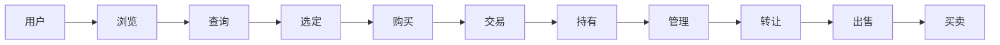

                 

# 虚拟房地产：元宇宙中的资产新概念

## 1. 背景介绍

在过去的几年里，元宇宙这一概念已经从科幻小说逐渐变成了现实。随着虚拟现实（VR）、增强现实（AR）、区块链和云计算等技术的融合，以及大公司的积极投资，元宇宙正在以惊人的速度发展，正在逐渐成为人们日常生活、工作和社交的新空间。

元宇宙不仅仅是数字世界的扩展，更是一个可感知的、连贯的虚拟环境，其中包含了无数的虚拟空间和资产，例如虚拟房地产（VR Real Estate）。VR 房地产不仅仅是游戏领域的热门话题，它在医疗、教育、商业等多个领域都展现出了广阔的应用前景。

虚拟房地产的发展不仅为人们提供了一个全新的生活和工作环境，也带来了全新的经济机遇。然而，这种新的经济模式面临着诸多挑战，如何定义、管理、交易虚拟房地产，成为了亟待解决的问题。

## 2. 核心概念与联系

### 2.1 核心概念概述

为了更好地理解虚拟房地产这一概念，我们需要首先了解几个关键的核心概念：

- **虚拟现实房地产（VR Real Estate）**：是指在虚拟现实环境中购买的房产，可以是住宅、商业用地等。
- **元宇宙**：是一个可感知、连贯的虚拟世界，其中包含了各种应用和交互。
- **区块链**：一种去中心化的分布式账本技术，支持了虚拟房地产的交易和管理。
- **NFT（非同质化代币）**：一种代表特定资产的数字证书，用于标识和交易虚拟物品。
- **去中心化自治组织（DAO）**：一种去中心化的组织形式，通过智能合约来管理虚拟资产。

这些概念通过相互作用，共同构成了虚拟房地产的管理和交易框架。

### 2.2 核心概念原理和架构的 Mermaid 流程图



这个流程图展示了用户从浏览虚拟房产到出售房产的全过程，包括：

- **浏览**：用户通过浏览虚拟房产来选择合适的房产。
- **查询**：用户查询房产的具体信息，如价格、位置、面积等。
- **选定**：用户选定所需的虚拟房产。
- **购买**：用户购买所选的虚拟房产，并通过区块链进行交易。
- **持有**：用户持有所购买的虚拟房产。
- **管理**：用户可以管理、维护其持有的虚拟房产。
- **转让**：用户可以将房产转让给他人。
- **出售**：用户出售所持有的虚拟房产。
- **买卖**：用户可以在虚拟市场买卖虚拟房产。

### 2.3 核心概念之间的关系

这些核心概念之间的关系可以通过以下逻辑关系来概括：

1. **虚拟房地产是元宇宙的基础资产**：在元宇宙中，虚拟房地产是用户可以拥有和交易的核心资产。
2. **区块链保证了交易的透明性和安全性**：通过区块链技术，可以确保虚拟房地产交易的透明性、安全性以及不可篡改性。
3. **NFT 提供了虚拟资产的唯一性和所有权证明**：通过NFT，虚拟房地产可以被唯一标识，并且所有权可以被证明和转让。
4. **DAO 提供了虚拟房地产的管理和治理机制**：DAO通过智能合约来管理虚拟房地产的创建、交易、转让等，确保系统的公平、透明和高效。

## 3. 核心算法原理 & 具体操作步骤

### 3.1 算法原理概述

在虚拟房地产的管理和交易过程中，涉及到了以下几个关键的算法和操作：

- **查询算法**：用于查询虚拟房产的具体信息，如位置、面积、价格等。
- **交易算法**：用于完成虚拟房产的交易过程，包括支付、验证等。
- **管理算法**：用于管理和维护虚拟房产，包括更新、维护、修复等。
- **转让算法**：用于虚拟房产的转让过程，包括转让、接受等。

### 3.2 算法步骤详解

**查询算法**：

1. 用户通过搜索功能查询虚拟房地产的详细信息，如位置、面积、价格等。
2. 搜索算法根据用户的输入条件匹配合适的虚拟房地产。
3. 查询结果展示给用户，用户可以选择适合的房产。

**交易算法**：

1. 用户选择虚拟房产后，需要进行支付。
2. 支付算法验证用户的支付方式和金额。
3. 交易算法通过区块链验证交易的合法性，并将交易记录添加到区块链中。
4. 交易完成后，虚拟房产的所有权从原持有人转移到新持有人。

**管理算法**：

1. 用户可以对虚拟房产进行更新、维护和修复等操作。
2. 管理算法根据用户的指令对虚拟房产进行相应的操作。
3. 管理结果在元宇宙中展示给用户。

**转让算法**：

1. 用户可以将虚拟房产转让给他人。
2. 转让算法验证转让请求的合法性。
3. 交易记录添加到区块链中，虚拟房产的所有权从原持有人转移到新持有人。

### 3.3 算法优缺点

**优点**：

1. **透明性**：区块链技术保证了虚拟房地产交易的透明性，用户可以实时查询交易记录。
2. **安全性**：区块链的不可篡改性确保了虚拟房地产交易的安全性。
3. **去中心化**：DAO和智能合约使得虚拟房地产的管理和交易去中心化，避免了单一中心节点的风险。

**缺点**：

1. **交易成本高**：由于需要验证交易记录并将其添加到区块链中，交易成本相对较高。
2. **复杂性高**：虚拟房地产的管理和交易涉及多个环节，操作复杂。
3. **技术门槛高**：虚拟房地产的交易和管理需要一定的技术基础，如对区块链、智能合约的了解。

### 3.4 算法应用领域

虚拟房地产的应用领域非常广泛，主要包括：

- **虚拟房地产销售平台**：提供一个虚拟房产的展示和交易平台。
- **虚拟房地产管理平台**：提供虚拟房产的创建、管理、维护和转让功能。
- **虚拟房地产租赁平台**：提供虚拟房产的短期租赁服务。
- **虚拟房地产投资平台**：提供虚拟房产的投资、交易和管理服务。
- **虚拟房地产教育平台**：提供虚拟房产的交易、管理和投资教育服务。

## 4. 数学模型和公式 & 详细讲解 & 举例说明

### 4.1 数学模型构建

为了构建虚拟房地产的管理和交易模型，我们需要设计一个基本框架。以下是一个简化版的虚拟房地产管理系统的数学模型：

1. **虚拟房地产表**：记录虚拟房地产的基本信息，如位置、面积、价格等。
2. **用户表**：记录用户的基本信息，如姓名、地址等。
3. **交易表**：记录虚拟房地产的交易记录，如交易时间、金额、交易双方等。
4. **维护表**：记录虚拟房地产的维护记录，如维护时间、维护内容等。
5. **转让表**：记录虚拟房地产的转让记录，如转让时间、转让双方等。

### 4.2 公式推导过程

假设有一个虚拟房地产管理系统，包括虚拟房地产表和用户表，我们需要设计一个查询算法，用于根据用户输入的条件查询虚拟房地产的信息。查询算法的基本流程如下：

1. 输入查询条件，如位置、面积等。
2. 在虚拟房地产表中查找符合查询条件的房产。
3. 返回符合条件的虚拟房地产的信息。

查询算法的公式表示如下：

$$
\text{result} = \text{VirtualProperty} \text{ WHERE } \text{condition}
$$

其中，$\text{VirtualProperty}$ 表示虚拟房地产表，$\text{condition}$ 表示查询条件。

### 4.3 案例分析与讲解

假设我们要查询一个位置在“北京”、面积在100平方米以上的虚拟房产。查询算法的执行过程如下：

1. 输入查询条件“北京”和“100平方米以上”。
2. 在虚拟房地产表中查找符合条件的虚拟房产。
3. 返回符合条件的虚拟房产的信息，如位置、面积、价格等。

查询结果可能包括多个虚拟房产，用户需要进一步选择适合的房产。

## 5. 项目实践：代码实例和详细解释说明

### 5.1 开发环境搭建

在进行虚拟房地产的开发之前，我们需要搭建开发环境。以下是一个基本的开发环境搭建流程：

1. **安装Python**：Python是虚拟房地产开发的主要编程语言。
2. **安装虚拟环境**：使用虚拟环境管理工具，如virtualenv，创建一个虚拟环境。
3. **安装依赖包**：安装必要的Python依赖包，如Django、Flask、Blockchain等。
4. **配置开发环境**：设置开发环境的参数，如数据库、服务器等。

### 5.2 源代码详细实现

以下是一个基本的虚拟房地产管理系统，包括虚拟房地产的查询、交易、管理和转让功能。

**查询功能**：

```python
from django.shortcuts import render, redirect
from .models import VirtualProperty

def virtual_property_list(request):
    if request.method == 'GET':
        query = request.GET.get('query', '')
        properties = VirtualProperty.objects.filter(location__icontains=query)
        return render(request, 'virtual_property_list.html', {'properties': properties})
    return redirect('/')
```

**交易功能**：

```python
from django.shortcuts import render, redirect
from .models import VirtualProperty, Transaction

def virtual_property_buy(request, property_id):
    property = VirtualProperty.objects.get(id=property_id)
    transaction = Transaction.objects.create(property=property, buyer=request.user)
    return redirect('virtual_property_detail', property_id=property_id)
```

**管理功能**：

```python
from django.shortcuts import render, redirect
from .models import VirtualProperty, Maintenance

def virtual_property_maintenance(request, property_id):
    property = VirtualProperty.objects.get(id=property_id)
    maintenance = Maintenance.objects.create(property=property, content=request.POST.get('content'))
    return redirect('virtual_property_detail', property_id=property_id)
```

**转让功能**：

```python
from django.shortcuts import render, redirect
from .models import VirtualProperty, Transfer

def virtual_property_transfer(request, property_id):
    property = VirtualProperty.objects.get(id=property_id)
    transfer = Transfer.objects.create(property=property, seller=request.user)
    return redirect('virtual_property_detail', property_id=property_id)
```

### 5.3 代码解读与分析

**虚拟房地产表**：

在Django框架中，使用`models`模块定义虚拟房地产表，并添加必要的信息字段。

```python
from django.db import models

class VirtualProperty(models.Model):
    name = models.CharField(max_length=200)
    location = models.CharField(max_length=200)
    area = models.IntegerField()
    price = models.DecimalField(max_digits=10, decimal_places=2)
```

**用户表**：

使用`models`模块定义用户表，并添加必要的信息字段。

```python
from django.db import models

class User(models.Model):
    name = models.CharField(max_length=200)
    address = models.CharField(max_length=200)
```

**交易表**：

使用`models`模块定义交易表，并添加必要的信息字段。

```python
from django.db import models

class Transaction(models.Model):
    property = models.ForeignKey(VirtualProperty, on_delete=models.CASCADE)
    buyer = models.ForeignKey(User, on_delete=models.CASCADE)
    price = models.DecimalField(max_digits=10, decimal_places=2)
    date = models.DateField(auto_now=True)
```

**维护表**：

使用`models`模块定义维护表，并添加必要的信息字段。

```python
from django.db import models

class Maintenance(models.Model):
    property = models.ForeignKey(VirtualProperty, on_delete=models.CASCADE)
    content = models.TextField()
    date = models.DateField(auto_now=True)
```

**转让表**：

使用`models`模块定义转让表，并添加必要的信息字段。

```python
from django.db import models

class Transfer(models.Model):
    property = models.ForeignKey(VirtualProperty, on_delete=models.CASCADE)
    seller = models.ForeignKey(User, on_delete=models.CASCADE)
    date = models.DateField(auto_now=True)
```

## 6. 实际应用场景

### 6.4 未来应用展望

虚拟房地产将在未来有更广泛的应用场景，包括：

- **商业地产交易**：商业地产商可以利用虚拟房地产平台，展示和管理商业地产，吸引更多的买家。
- **旅游地产销售**：旅游地产商可以利用虚拟房地产平台，展示和管理旅游地产，吸引更多的买家。
- **度假村管理**：度假村可以使用虚拟房地产平台，管理度假村的房产，并提供虚拟体验。
- **虚拟旅游体验**：用户可以在虚拟房地产平台上体验虚拟旅游，并进行虚拟交易。

## 7. 工具和资源推荐

### 7.1 学习资源推荐

为了帮助开发者系统掌握虚拟房地产的开发技术，以下是一些优质的学习资源：

1. **Django官方文档**：Django是一个流行的Python框架，用于开发Web应用程序。Django官方文档提供了丰富的教程和示例，适合初学者入门。
2. **Blockchain 101**：一本关于区块链技术的入门书籍，适合初学者了解区块链的基本概念和应用。
3. **NFT艺术平台**：如Rarible、Foundation等，提供了NFT艺术品的展示和交易平台，可以了解NFT艺术品的交易和管理。
4. **DAO介绍**：如Aragon、MakerDAO等，提供了DAO的介绍和示例，可以了解DAO的基本概念和应用。
5. **VR平台**：如Oculus、HTC Vive等，提供了VR设备的介绍和示例，可以了解VR技术的基本概念和应用。

通过学习这些资源，可以全面掌握虚拟房地产的开发技术，并将其应用到实际项目中。

### 7.2 开发工具推荐

以下几款工具可以帮助开发者更高效地开发虚拟房地产项目：

1. **Django**：一个流行的Python Web框架，用于开发Web应用程序。
2. **Flask**：一个轻量级的Python Web框架，适用于小型Web应用程序。
3. **Django REST Framework**：一个用于构建RESTful Web服务的Django扩展。
4. **Blockchain工具**：如Ethereum、Solana等，提供了区块链开发的工具和API。
5. **VR平台**：如Oculus、HTC Vive等，提供了VR设备的开发和测试平台。

### 7.3 相关论文推荐

以下是几篇奠基性的虚拟房地产论文，推荐阅读：

1. **Blockchain in Real Estate**：一篇关于区块链在房地产中的应用论文，介绍了区块链如何应用于虚拟房地产的管理和交易。
2. **Virtual Property Market**：一篇关于虚拟房地产市场的分析论文，介绍了虚拟房地产市场的现状和未来发展方向。
3. **NFT in Art**：一篇关于NFT在艺术品中的应用论文，介绍了NFT如何应用于虚拟艺术品的管理和交易。
4. **DAO Governance**：一篇关于DAO的治理机制的论文，介绍了DAO的基本概念和应用。
5. **Virtual Real Estate Technologies**：一篇关于虚拟房地产技术的综述论文，介绍了虚拟房地产技术的现状和未来发展方向。

这些论文代表了虚拟房地产技术的发展脉络，通过学习这些前沿成果，可以帮助研究者把握学科前进方向，激发更多的创新灵感。

## 8. 总结：未来发展趋势与挑战

### 8.1 总结

本文对虚拟房地产这一概念进行了全面系统的介绍。首先阐述了虚拟房地产的背景和发展趋势，明确了虚拟房地产在元宇宙中的重要地位。其次，从原理到实践，详细讲解了虚拟房地产的管理和交易算法，并给出了详细的代码实现。同时，本文还广泛探讨了虚拟房地产在多个行业领域的应用前景，展示了虚拟房地产的巨大潜力。最后，本文精选了虚拟房地产的各类学习资源，力求为读者提供全方位的技术指引。

通过本文的系统梳理，可以看到，虚拟房地产技术正在成为元宇宙领域的重要范式，极大地拓展了元宇宙的应用边界，催生了更多的落地场景。受益于区块链、NFT、DAO等前沿技术的支持，虚拟房地产必将在未来迎来更广泛的应用，为元宇宙的构建和演化注入新的动力。

### 8.2 未来发展趋势

展望未来，虚拟房地产技术将呈现以下几个发展趋势：

1. **技术融合**：虚拟房地产将与区块链、NFT、DAO等前沿技术进行深度融合，形成更加完善的技术体系。
2. **应用场景多样化**：虚拟房地产将拓展到商业地产、旅游地产、度假村管理等多个领域，带来更多的商业机会。
3. **虚拟体验提升**：随着VR、AR等技术的进步，虚拟房地产的体验将更加丰富和逼真。
4. **智能合约普及**：智能合约将广泛应用于虚拟房地产的管理和交易，提高系统的透明度和效率。
5. **生态系统完善**：虚拟房地产将形成一个完整的生态系统，包括开发、交易、管理等多个环节。

### 8.3 面临的挑战

尽管虚拟房地产技术已经取得了显著的进展，但在迈向更加智能化、普适化应用的过程中，它仍面临着诸多挑战：

1. **技术门槛高**：虚拟房地产的开发和管理需要较高的技术门槛，需要开发人员具备区块链、NFT、DAO等技术知识。
2. **交易成本高**：虚拟房地产的交易需要验证和记录到区块链中，交易成本较高。
3. **法律和监管**：虚拟房地产的法律和监管环境尚不完善，存在一定的法律风险。
4. **用户体验差**：虚拟房地产的体验和操作界面仍需进一步优化，用户体验有待提升。
5. **安全问题**：虚拟房地产的安全问题也需要关注，如虚拟资产被盗、交易欺诈等。

### 8.4 研究展望

面向未来，虚拟房地产技术需要在以下几个方面寻求新的突破：

1. **降低技术门槛**：开发简单易用的工具和平台，降低虚拟房地产的开发和管理门槛。
2. **降低交易成本**：通过技术优化，降低虚拟房地产的交易成本，提高系统的可操作性。
3. **完善法律和监管**：加强虚拟房地产的法律和监管研究，确保系统的合法性和安全性。
4. **提升用户体验**：优化虚拟房地产的体验和操作界面，提高用户的满意度和体验感。
5. **解决安全问题**：开发更加安全、可靠的虚拟房地产管理系统，保障用户资产的安全。

这些研究方向和探索将推动虚拟房地产技术走向成熟，为元宇宙的构建和演化提供新的动力。

## 9. 附录：常见问题与解答

**Q1：虚拟房地产交易需要验证哪些信息？**

A: 虚拟房地产交易需要验证以下信息：

1. 虚拟房产的基本信息，如位置、面积、价格等。
2. 用户的身份信息，如姓名、地址等。
3. 交易金额和支付方式。
4. 交易时间。

这些信息需要通过区块链验证，确保交易的透明性和安全性。

**Q2：虚拟房地产如何展示和管理？**

A: 虚拟房地产可以通过以下方式展示和管理：

1. 通过虚拟现实平台展示虚拟房地产，如Oculus、HTC Vive等。
2. 通过Django等Web框架，将虚拟房地产展示在网页上，方便用户查询和选择。
3. 通过智能合约管理虚拟房地产，如Aragon等DAO平台提供的智能合约。

这些方式可以结合使用，为用户提供全面的虚拟房地产管理体验。

**Q3：虚拟房地产如何确保安全？**

A: 虚拟房地产的安全问题可以通过以下方式解决：

1. 通过区块链验证交易的合法性，确保交易的透明性和安全性。
2. 通过智能合约管理虚拟房地产，避免单点故障和数据篡改。
3. 通过去中心化自治组织（DAO）管理虚拟房地产，确保系统的公平和透明。

这些方式可以结合使用，提高虚拟房地产的安全性和可靠性。

---

作者：禅与计算机程序设计艺术 / Zen and the Art of Computer Programming

