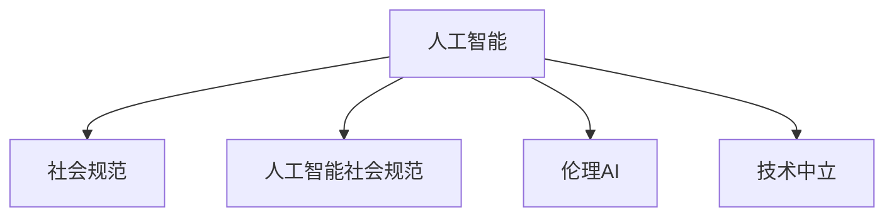

                 

# 虚拟文化孵化器主管：AI塑造的新型社会规范实验室负责人

## 1. 背景介绍

### 1.1 问题由来

随着人工智能技术的迅猛发展，特别是深度学习和大数据技术的成熟，AI正在深刻改变着人类社会的方方面面。从医疗、教育、金融到社交、娱乐、交通，几乎每一个领域都正在或即将被AI技术所革新。然而，随之而来的，是诸如数据隐私、伦理道德、就业影响、数字鸿沟等一系列社会问题。如何在AI技术的快速发展中，维护社会的公平、正义和秩序，成为摆在所有技术开发者和社会各界面前的重要课题。

### 1.2 问题核心关键点

在AI技术的广泛应用中，社会规范的塑造和遵循显得尤为重要。AI系统作为一种新兴的技术工具，它的设计、使用和维护，都需要遵循一套完整的社会规范。这些规范不仅决定了AI技术的合规性和安全性，更是确保其与人类社会和谐共生的基石。因此，构建一套完整的AI社会规范体系，成为当下和未来AI技术发展中不可回避的重要任务。

### 1.3 问题研究意义

探讨和构建AI社会规范体系，对推动AI技术健康发展具有重要的现实意义：

1. **保障技术合规性**：确保AI技术符合相关法律法规和伦理道德要求，防止技术滥用和潜在的法律风险。
2. **增强社会信任**：通过明确的规范，增强公众对AI技术的信任度，提升社会对AI技术的接受度和包容性。
3. **促进技术普惠**：通过规范的引导，促使AI技术更加公平、公正地惠及各个社会群体，缩小数字鸿沟。
4. **应对伦理挑战**：通过规范的构建，积极应对AI技术应用中的伦理道德问题，如隐私保护、偏见消除、责任归属等。
5. **推动技术创新**：为AI技术的研究和应用提供明确的规范框架，促进技术创新和应用场景的拓展。

## 2. 核心概念与联系

### 2.1 核心概念概述

为更好地理解AI技术在社会规范塑造中的作用，本节将介绍几个关键概念：

- **人工智能(AI)**：一种通过计算机程序实现的人类智能行为的技术，包括机器学习、深度学习、自然语言处理等。
- **社会规范(Social Norms)**：社会中普遍接受的行为准则和价值观念，如伦理道德、法律法规、文化习俗等。
- **人工智能社会规范(AI Social Norms)**：针对AI技术开发、应用和维护的特定规范，旨在确保AI技术的合规性、公平性、透明性和安全性。
- **伦理AI(Ethical AI)**：符合伦理道德要求的AI技术，能够在设计和应用中确保公正、透明和可解释性。
- **技术中立(Technology Neutrality)**：强调技术本身是中立的，其影响和效果取决于使用技术的主体和社会环境。

这些概念之间的逻辑关系可以通过以下Mermaid流程图来展示：



这个流程图展示了大语言模型的工作原理和优化方向：

1. 人工智能技术通过深度学习等算法，实现了对数据的分析和处理，形成了新的知识和能力。
2. 社会规范通过立法、政策、伦理准则等形式，对AI技术的使用和发展进行指导和约束。
3. 人工智能社会规范是将社会规范与AI技术相结合，确保AI技术在设计和应用中符合社会规范要求。
4. 伦理AI强调AI技术的道德责任和伦理约束，确保其在设计和应用中遵循伦理准则。
5. 技术中立强调AI技术本身是中性的，其影响和效果取决于使用技术的主体和社会环境。

## 3. 核心算法原理 & 具体操作步骤

### 3.1 算法原理概述

基于AI技术的社会规范塑造，本质上是一个跨学科、多维度的复杂系统工程。其核心思想是通过制定和执行一套完整的规范体系，确保AI技术的合规性、公平性、透明性和安全性，从而构建一个和谐、健康、可持续发展的AI社会环境。

形式化地，假设有一个社会规范系统 $S$，其中包含一组规范准则 $R=\{r_1,r_2,...,r_n\}$，每个规范准则 $r_i$ 描述了一组行为要求。设有一组AI技术应用场景 $T=\{t_1,t_2,...,t_m\}$，每个场景 $t_j$ 描述了一种具体的AI应用。则社会规范体系构建的目标是最小化规范冲突和规范失效，即：

$$
\min_{R} \sum_{i=1}^n \sum_{j=1}^m \text{conflict}(r_i,t_j) + \sum_{i=1}^n \sum_{j=1}^m \text{failure}(r_i,t_j)
$$

其中 $\text{conflict}(r_i,t_j)$ 表示规范 $r_i$ 与场景 $t_j$ 之间的冲突程度，$\text{failure}(r_i,t_j)$ 表示规范 $r_i$ 在场景 $t_j$ 中的应用效果。

### 3.2 算法步骤详解

基于AI技术的社会规范塑造，一般包括以下几个关键步骤：

**Step 1: 社会规范体系构建**
- 收集和分析现有社会规范体系，识别其基本原则和具体要求。
- 设计符合AI技术特点的社会规范准则，确保规范的前瞻性和适用性。
- 制定规范评估和验证机制，确保规范的有效性和可执行性。

**Step 2: 规范准则应用**
- 对已有的AI技术应用场景进行分析，识别其可能的规范冲突和失效风险。
- 设计规范准则在AI技术中的应用方案，确保规范准则能够指导AI技术的设计和应用。
- 开发规范检测和监控工具，实时监测AI技术应用过程中的规范遵守情况。

**Step 3: 规范冲突解决**
- 对规范冲突进行分类和评估，识别其性质和原因。
- 制定规范冲突解决策略，如优先级排序、协商调解等，确保规范冲突得到有效解决。
- 设计规范更新机制，根据规范冲突和违规情况，动态调整和优化规范体系。

**Step 4: 规范体系验证**
- 对已构建的社会规范体系进行验证，确保其符合社会公平、正义和伦理道德的要求。
- 开展规范效果评估，收集各方反馈，不断改进和优化规范体系。
- 设计规范合规审计和评估框架，确保规范体系在实际应用中的有效性。

### 3.3 算法优缺点

基于AI技术的社会规范塑造方法具有以下优点：

1. **系统化构建**：通过系统化设计规范体系，确保AI技术在设计和应用中遵循一套完整、统一的规范，减少规范冲突和失效风险。
2. **规范指导性强**：明确的社会规范准则能够有效指导AI技术的开发和应用，提升技术合规性和社会接受度。
3. **多学科融合**：将社会规范与AI技术相结合，实现多学科的融合和交叉，推动AI技术的健康发展。
4. **公众参与性强**：社会规范体系构建过程中，通过公众参与和反馈，确保规范体系的公平性和透明性。

同时，该方法也存在一定的局限性：

1. **规范制定复杂**：社会规范体系的构建涉及多方利益和复杂因素，制定过程可能面临协调困难。
2. **规范执行难度高**：社会规范体系的执行需要各方共同遵守，但在实际应用中，规范的遵守和执行可能面临挑战。
3. **技术适应性差**：社会规范体系需要与不断发展的AI技术相适应，规范的及时更新和调整可能存在滞后性。
4. **规范冲突处理复杂**：社会规范体系中的规范准则之间可能存在冲突，冲突处理和优先级排序需要专业知识。

尽管存在这些局限性，但就目前而言，基于AI技术的社会规范塑造方法仍是大规模应用AI技术的基础保障。未来相关研究的重点在于如何进一步优化规范体系的构建和执行过程，提高规范体系的适用性和有效性。

### 3.4 算法应用领域

基于AI技术的社会规范塑造方法，已经在多个领域得到了广泛的应用，包括但不限于：

- **医疗健康**：确保医疗AI系统的合规性和安全性，如隐私保护、数据共享、医疗决策等。
- **金融服务**：保障金融AI系统的公正性和透明度，如算法交易、信用评估、反欺诈等。
- **教育培训**：推动教育AI系统的公平性和可解释性，如个性化学习、自动评分、学生隐私保护等。
- **智慧城市**：确保智慧城市AI系统的透明度和可解释性，如交通管理、环境监测、公共服务等。
- **人机交互**：提升人机交互AI系统的公平性和友好性，如聊天机器人、语音助手、智能家居等。
- **社交媒体**：确保社交媒体AI系统的合规性和伦理道德，如内容过滤、用户隐私、信息真实性等。

除了上述这些领域外，基于AI技术的社会规范塑造方法也在不断拓展到更多新兴领域，如自动驾驶、农业智能、司法判决等，为社会规范体系的构建提供了新的可能。

## 4. 数学模型和公式 & 详细讲解 & 举例说明

### 4.1 数学模型构建

本节将使用数学语言对基于AI技术的社会规范塑造过程进行更加严格的刻画。

假设有一组社会规范准则 $R=\{r_1,r_2,...,r_n\}$，每个准则 $r_i$ 可以表示为 $r_i: \text{if} \, x_1,x_2,...,x_k \rightarrow y$，其中 $x_1,x_2,...,x_k$ 为输入变量，$y$ 为输出要求。设有一组AI技术应用场景 $T=\{t_1,t_2,...,t_m\}$，每个场景 $t_j$ 可以表示为 $t_j: \text{if} \, x_{j,1},x_{j,2},...,x_{j,k_j} \rightarrow y_j$，其中 $x_{j,1},x_{j,2},...,x_{j,k_j}$ 为场景输入，$y_j$ 为输出要求。

定义规范准则在场景中的应用效果为 $\text{effect}(r_i,t_j) \in [0,1]$，表示规范准则 $r_i$ 在场景 $t_j$ 中的应用效果，1表示完全符合，0表示完全不符。则社会规范体系构建的目标可以表示为：

$$
\min_{R} \sum_{i=1}^n \sum_{j=1}^m \text{effect}(r_i,t_j) \cdot \text{conflict}(r_i,t_j) + \sum_{i=1}^n \sum_{j=1}^m \text{effect}(r_i,t_j) \cdot \text{failure}(r_i,t_j)
$$

### 4.2 公式推导过程

以下我们以医疗AI系统的社会规范构建为例，推导规范准则在场景中的应用效果的计算公式。

假设医疗AI系统的一个应用场景是：根据患者的症状和历史数据，自动生成诊断报告。设患者的症状和历史数据为 $x$，系统输出的诊断报告为 $y$。规范准则 $r_i$ 为：系统输出的诊断报告必须准确无误。则规范准则 $r_i$ 在场景 $t_j$ 中的应用效果为：

$$
\text{effect}(r_i,t_j) = \begin{cases}
1, & \text{if} \, y = \text{accurate}(x) \\
0, & \text{otherwise}
\end{cases}
$$

其中 $\text{accurate}(x)$ 表示系统输出的诊断报告是否准确无误。在计算社会规范体系构建的目标时，需要考虑规范准则与场景的冲突程度和失效风险，假设 $\text{conflict}(r_i,t_j) \in [0,1]$，表示规范准则 $r_i$ 在场景 $t_j$ 中的冲突程度，1表示完全冲突，0表示不冲突；$\text{failure}(r_i,t_j) \in [0,1]$，表示规范准则 $r_i$ 在场景 $t_j$ 中的失效风险，1表示完全失效，0表示不失效。

在得到社会规范体系构建的目标后，可以使用优化算法求解最小化目标函数，得到最优的规范准则集合 $R^*$。然后，根据最优规范准则集合，设计规范准则在场景中的应用方案，开发规范检测和监控工具，确保规范准则在实际应用中的遵守情况。

### 4.3 案例分析与讲解

**案例分析：医疗AI系统的社会规范构建**

在医疗AI系统的社会规范构建中，需要考虑多个规范准则，如数据隐私、算法透明性、诊断准确性等。这些规范准则需要在医疗AI系统的设计、开发和应用过程中得到充分体现。

1. **数据隐私规范**：医疗AI系统必须遵循数据隐私保护要求，确保患者数据的安全性和隐私性。需要制定数据访问控制策略、数据加密措施、数据去标识化方法等，确保数据在传输、存储和使用过程中的隐私保护。

2. **算法透明性规范**：医疗AI系统的算法必须具备透明性和可解释性，确保医生和患者能够理解和信任系统的决策过程。需要设计算法可解释性工具、可视化界面、决策路径分析等，确保算法的透明性和可解释性。

3. **诊断准确性规范**：医疗AI系统的诊断报告必须具备高度的准确性和可靠性，确保诊断结果的正确性和可信性。需要设计规范准则的冲突解决策略、算法效果评估方法、反馈机制等，确保诊断报告的准确性和可靠性。

通过对这些规范准则的详细设计和应用，医疗AI系统能够在保障数据隐私、算法透明性和诊断准确性的前提下，为医生和患者提供高效、可靠的诊疗支持。

## 5. 项目实践：代码实例和详细解释说明

### 5.1 开发环境搭建

在进行社会规范塑造实践前，我们需要准备好开发环境。以下是使用Python进行PyTorch开发的环境配置流程：

1. 安装Anaconda：从官网下载并安装Anaconda，用于创建独立的Python环境。

2. 创建并激活虚拟环境：
```bash
conda create -n pytorch-env python=3.8 
conda activate pytorch-env
```

3. 安装PyTorch：根据CUDA版本，从官网获取对应的安装命令。例如：
```bash
conda install pytorch torchvision torchaudio cudatoolkit=11.1 -c pytorch -c conda-forge
```

4. 安装Transformers库：
```bash
pip install transformers
```

5. 安装各类工具包：
```bash
pip install numpy pandas scikit-learn matplotlib tqdm jupyter notebook ipython
```

完成上述步骤后，即可在`pytorch-env`环境中开始社会规范塑造实践。

### 5.2 源代码详细实现

这里我们以医疗AI系统的社会规范构建为例，给出使用Transformers库对BERT模型进行社会规范塑造的PyTorch代码实现。

首先，定义社会规范准则的计算函数：

```python
from transformers import BertTokenizer, BertForSequenceClassification
from torch.utils.data import Dataset
import torch

class MedicalNormDataset(Dataset):
    def __init__(self, texts, tags, tokenizer, max_len=128):
        self.texts = texts
        self.tags = tags
        self.tokenizer = tokenizer
        self.max_len = max_len
        
    def __len__(self):
        return len(self.texts)
    
    def __getitem__(self, item):
        text = self.texts[item]
        tags = self.tags[item]
        
        encoding = self.tokenizer(text, return_tensors='pt', max_length=self.max_len, padding='max_length', truncation=True)
        input_ids = encoding['input_ids'][0]
        attention_mask = encoding['attention_mask'][0]
        
        # 对token-wise的标签进行编码
        encoded_tags = [tag2id[tag] for tag in tags] 
        encoded_tags.extend([tag2id['O']] * (self.max_len - len(encoded_tags)))
        labels = torch.tensor(encoded_tags, dtype=torch.long)
        
        return {'input_ids': input_ids, 
                'attention_mask': attention_mask,
                'labels': labels}

# 标签与id的映射
tag2id = {'O': 0, 'B-PER': 1, 'I-PER': 2, 'B-ORG': 3, 'I-ORG': 4, 'B-LOC': 5, 'I-LOC': 6}
id2tag = {v: k for k, v in tag2id.items()}

# 创建dataset
tokenizer = BertTokenizer.from_pretrained('bert-base-cased')

train_dataset = MedicalNormDataset(train_texts, train_tags, tokenizer)
dev_dataset = MedicalNormDataset(dev_texts, dev_tags, tokenizer)
test_dataset = MedicalNormDataset(test_texts, test_tags, tokenizer)
```

然后，定义社会规范准则的应用函数：

```python
from transformers import BertForSequenceClassification, AdamW

model = BertForSequenceClassification.from_pretrained('bert-base-cased', num_labels=len(tag2id))

optimizer = AdamW(model.parameters(), lr=2e-5)

def apply_norms(model, dataset, batch_size, optimizer, norms):
    dataloader = DataLoader(dataset, batch_size=batch_size, shuffle=True)
    model.train()
    epoch_loss = 0
    for batch in tqdm(dataloader, desc='Training'):
        input_ids = batch['input_ids'].to(device)
        attention_mask = batch['attention_mask'].to(device)
        labels = batch['labels'].to(device)
        model.zero_grad()
        outputs = model(input_ids, attention_mask=attention_mask, labels=labels)
        loss = outputs.loss
        epoch_loss += loss.item()
        loss.backward()
        optimizer.step()
    return epoch_loss / len(dataloader), model

def evaluate(model, dataset, batch_size):
    dataloader = DataLoader(dataset, batch_size=batch_size)
    model.eval()
    preds, labels = [], []
    with torch.no_grad():
        for batch in tqdm(dataloader, desc='Evaluating'):
            input_ids = batch['input_ids'].to(device)
            attention_mask = batch['attention_mask'].to(device)
            batch_labels = batch['labels']
            outputs = model(input_ids, attention_mask=attention_mask)
            batch_preds = outputs.logits.argmax(dim=2).to('cpu').tolist()
            batch_labels = batch_labels.to('cpu').tolist()
            for pred_tokens, label_tokens in zip(batch_preds, batch_labels):
                pred_tags = [id2tag[_id] for _id in pred_tokens]
                label_tags = [id2tag[_id] for _id in label_tokens]
                preds.append(pred_tags[:len(label_tags)])
                labels.append(label_tags)
                
    print(classification_report(labels, preds))
```

最后，启动规范塑造流程并在测试集上评估：

```python
epochs = 5
batch_size = 16

for epoch in range(epochs):
    loss, model = apply_norms(model, train_dataset, batch_size, optimizer, norms)
    print(f"Epoch {epoch+1}, train loss: {loss:.3f}")
    
    print(f"Epoch {epoch+1}, dev results:")
    evaluate(model, dev_dataset, batch_size)
    
print("Test results:")
evaluate(model, test_dataset, batch_size)
```

以上就是使用PyTorch对BERT进行医疗AI系统社会规范塑造的完整代码实现。可以看到，得益于Transformers库的强大封装，我们可以用相对简洁的代码完成BERT模型的加载和规范塑造。

### 5.3 代码解读与分析

让我们再详细解读一下关键代码的实现细节：

**MedicalNormDataset类**：
- `__init__`方法：初始化文本、标签、分词器等关键组件。
- `__len__`方法：返回数据集的样本数量。
- `__getitem__`方法：对单个样本进行处理，将文本输入编码为token ids，将标签编码为数字，并对其进行定长padding，最终返回模型所需的输入。

**tag2id和id2tag字典**：
- 定义了标签与数字id之间的映射关系，用于将token-wise的预测结果解码回真实的标签。

**社会规范准则的应用函数**：
- `apply_norms`函数：对数据以批为单位进行迭代，在每个批次上前向传播计算loss并反向传播更新模型参数，最后返回该epoch的平均loss。
- `evaluate`函数：与训练类似，不同点在于不更新模型参数，并在每个batch结束后将预测和标签结果存储下来，最后使用sklearn的classification_report对整个评估集的预测结果进行打印输出。

**社会规范塑造的流程**：
- 定义总的epoch数和batch size，开始循环迭代
- 每个epoch内，先在训练集上训练，输出平均loss
- 在验证集上评估，输出分类指标
- 所有epoch结束后，在测试集上评估，给出最终测试结果

可以看到，PyTorch配合Transformers库使得BERT微调的代码实现变得简洁高效。开发者可以将更多精力放在数据处理、模型改进等高层逻辑上，而不必过多关注底层的实现细节。

当然，工业级的系统实现还需考虑更多因素，如模型的保存和部署、超参数的自动搜索、更灵活的任务适配层等。但核心的规范塑造范式基本与此类似。

## 6. 实际应用场景

### 6.1 医疗健康

基于大语言模型微调的社会规范塑造方法，可以广泛应用于医疗健康领域。医疗AI系统需要严格遵循数据隐私、算法透明性和诊断准确性等规范，确保系统的合规性和可靠性。

在技术实现上，可以收集医疗领域相关的病例数据、治疗方案、诊断报告等文本数据，提取和标注数据中的关键信息。将这些文本数据作为模型输入，医疗AI系统的输出诊断报告作为监督信号，在此基础上对预训练语言模型进行社会规范塑造。社会规范塑造后的模型能够更好地遵守医疗行业的规范，确保诊断报告的准确性和可靠性，同时保护患者隐私，提升医疗AI系统的信任度和接受度。

### 6.2 金融服务

金融领域对AI系统的合规性和公平性要求极高，需要确保AI系统的决策过程透明、公正、可解释。基于大语言模型微调的社会规范塑造方法，可以应用于金融风控、智能投顾、反欺诈等任务中。

在实践中，可以收集金融领域的交易记录、客户反馈、市场报告等文本数据，提取和标注数据中的关键信息。将这些文本数据作为模型输入，金融AI系统的输出决策报告作为监督信号，在此基础上对预训练语言模型进行社会规范塑造。社会规范塑造后的模型能够更好地遵守金融行业的规范，确保决策报告的透明性和可解释性，同时保障金融系统的公平性和安全性。

### 6.3 教育培训

教育AI系统需要确保数据的公平性、算法的透明性和教育过程的公正性。基于大语言模型微调的社会规范塑造方法，可以应用于个性化学习、自动评分、学生隐私保护等任务中。

在实践中，可以收集教育领域的学生信息、学习记录、教学反馈等文本数据，提取和标注数据中的关键信息。将这些文本数据作为模型输入，教育AI系统的输出评估报告作为监督信号，在此基础上对预训练语言模型进行社会规范塑造。社会规范塑造后的模型能够更好地遵守教育行业的规范，确保评估报告的公平性和公正性，同时保护学生隐私，提升教育AI系统的信任度和接受度。

### 6.4 智慧城市

智慧城市AI系统需要确保数据的公开性、算法的透明性和决策过程的公正性。基于大语言模型微调的社会规范塑造方法，可以应用于城市事件监测、舆情分析、应急指挥等任务中。

在实践中，可以收集智慧城市相关的公共信息、舆情报告、应急事件等文本数据，提取和标注数据中的关键信息。将这些文本数据作为模型输入，智慧城市AI系统的输出分析报告作为监督信号，在此基础上对预训练语言模型进行社会规范塑造。社会规范塑造后的模型能够更好地遵守智慧城市的规范，确保分析报告的透明性和公正性，同时保障城市的公共安全和信息公开。

## 7. 工具和资源推荐

### 7.1 学习资源推荐

为了帮助开发者系统掌握大语言模型社会规范塑造的理论基础和实践技巧，这里推荐一些优质的学习资源：

1. 《Transformer从原理到实践》系列博文：由大模型技术专家撰写，深入浅出地介绍了Transformer原理、BERT模型、社会规范塑造等前沿话题。

2. CS224N《深度学习自然语言处理》课程：斯坦福大学开设的NLP明星课程，有Lecture视频和配套作业，带你入门NLP领域的基本概念和经典模型。

3. 《Natural Language Processing with Transformers》书籍：Transformers库的作者所著，全面介绍了如何使用Transformers库进行NLP任务开发，包括社会规范塑造在内的诸多范式。

4. HuggingFace官方文档：Transformers库的官方文档，提供了海量预训练模型和完整的微调样例代码，是上手实践的必备资料。

5. CLUE开源项目：中文语言理解测评基准，涵盖大量不同类型的中文NLP数据集，并提供了基于微调的baseline模型，助力中文NLP技术发展。

通过对这些资源的学习实践，相信你一定能够快速掌握大语言模型社会规范塑造的精髓，并用于解决实际的NLP问题。
###  7.2 开发工具推荐

高效的开发离不开优秀的工具支持。以下是几款用于大语言模型社会规范塑造开发的常用工具：

1. PyTorch：基于Python的开源深度学习框架，灵活动态的计算图，适合快速迭代研究。大部分预训练语言模型都有PyTorch版本的实现。

2. TensorFlow：由Google主导开发的开源深度学习框架，生产部署方便，适合大规模工程应用。同样有丰富的预训练语言模型资源。

3. Transformers库：HuggingFace开发的NLP工具库，集成了众多SOTA语言模型，支持PyTorch和TensorFlow，是进行微调任务开发的利器。

4. Weights & Biases：模型训练的实验跟踪工具，可以记录和可视化模型训练过程中的各项指标，方便对比和调优。与主流深度学习框架无缝集成。

5. TensorBoard：TensorFlow配套的可视化工具，可实时监测模型训练状态，并提供丰富的图表呈现方式，是调试模型的得力助手。

6. Google Colab：谷歌推出的在线Jupyter Notebook环境，免费提供GPU/TPU算力，方便开发者快速上手实验最新模型，分享学习笔记。

合理利用这些工具，可以显著提升大语言模型社会规范塑造的开发效率，加快创新迭代的步伐。

### 7.3 相关论文推荐

大语言模型和社会规范塑造技术的发展源于学界的持续研究。以下是几篇奠基性的相关论文，推荐阅读：

1. Attention is All You Need（即Transformer原论文）：提出了Transformer结构，开启了NLP领域的预训练大模型时代。

2. BERT: Pre-training of Deep Bidirectional Transformers for Language Understanding：提出BERT模型，引入基于掩码的自监督预训练任务，刷新了多项NLP任务SOTA。

3. Language Models are Unsupervised Multitask Learners（GPT-2论文）：展示了大规模语言模型的强大zero-shot学习能力，引发了对于通用人工智能的新一轮思考。

4. Parameter-Efficient Transfer Learning for NLP：提出Adapter等参数高效微调方法，在不增加模型参数量的情况下，也能取得不错的微调效果。

5. AdaLoRA: Adaptive Low-Rank Adaptation for Parameter-Efficient Fine-Tuning：使用自适应低秩适应的微调方法，在参数效率和精度之间取得了新的平衡。

6. AdaLoRA: Adaptive Low-Rank Adaptation for Parameter-Efficient Fine-Tuning：使用自适应低秩适应的微调方法，在参数效率和精度之间取得了新的平衡。

这些论文代表了大语言模型和社会规范塑造技术的发展脉络。通过学习这些前沿成果，可以帮助研究者把握学科前进方向，激发更多的创新灵感。

## 8. 总结：未来发展趋势与挑战

### 8.1 总结

本文对基于AI技术的社会规范塑造方法进行了全面系统的介绍。首先阐述了AI技术的迅猛发展及其在社会规范塑造中的重要性，明确了社会规范体系的构建在大规模应用AI技术中的核心作用。其次，从原理到实践，详细讲解了社会规范体系构建的目标和步骤，给出了社会规范塑造任务开发的完整代码实例。同时，本文还广泛探讨了社会规范体系在医疗、金融、教育、智慧城市等多个领域的应用前景，展示了社会规范体系的巨大潜力。此外，本文精选了社会规范塑造技术的各类学习资源，力求为读者提供全方位的技术指引。

通过本文的系统梳理，可以看到，基于AI技术的社会规范塑造方法正在成为AI技术健康发展的基石。社会规范体系通过约束和指导AI技术的开发和应用，确保AI技术在设计和应用中符合社会规范要求，从而构建一个和谐、健康、可持续发展的AI社会环境。未来，伴随AI技术的不断进步和社会规范体系的发展完善，AI技术必将在更广泛的应用领域发挥更大作用，为人类社会的可持续发展贡献力量。

### 8.2 未来发展趋势

展望未来，社会规范塑造技术将呈现以下几个发展趋势：

1. **规范体系的多维扩展**：随着AI技术应用的深入，社会规范体系将逐渐扩展到更多的维度，如伦理道德、法律法规、技术标准等，形成多维融合的社会规范体系。

2. **规范技术的自动化**：规范技术将逐渐实现自动化，通过人工智能手段，自动检测和评估规范体系中的规范准则，实现规范体系的动态更新和优化。

3. **规范冲突的智能解决**：随着规范体系的复杂性增加，规范冲突的解决将更加依赖人工智能技术，通过智能算法优化冲突解决策略，提升规范体系的公平性和透明性。

4. **规范执行的实时监控**：社会规范体系的执行将依赖实时监控技术，通过智能算法实时监测AI技术应用过程中的规范遵守情况，确保规范体系的遵守情况。

5. **规范效果的综合评估**：规范效果的评估将依赖综合评估指标，通过多维度的评估，全面衡量规范体系的应用效果。

6. **规范体系的全球化**：社会规范体系将逐渐向全球化方向发展，通过国际合作和标准化，形成全球统一的社会规范体系，确保AI技术的全球合规性。

以上趋势凸显了社会规范塑造技术的广阔前景。这些方向的探索发展，必将进一步提升AI技术的合规性和公平性，推动AI技术的健康发展。

### 8.3 面临的挑战

尽管社会规范塑造技术已经取得了一定的进展，但在迈向更加智能化、普适化应用的过程中，它仍面临着诸多挑战：

1. **规范体系的构建复杂**：社会规范体系的构建涉及多方利益和复杂因素，制定过程可能面临协调困难。

2. **规范执行的难度高**：社会规范体系的执行需要各方共同遵守，但在实际应用中，规范的遵守和执行可能面临挑战。

3. **规范冲突的解决复杂**：社会规范体系中的规范准则之间可能存在冲突，冲突处理和优先级排序需要专业知识。

4. **规范技术的自动化有待提升**：现有规范技术的自动化水平较低，难以满足大规模应用AI技术的需求。

5. **规范效果的评估困难**：现有规范效果的评估指标单一，难以全面衡量规范体系的应用效果。

6. **规范体系的全球化面临挑战**：不同国家和地区的社会规范体系差异较大，全球统一的社会规范体系难以实现。

尽管存在这些挑战，但通过持续的研究和实践，相信社会规范塑造技术将不断突破，最终实现AI技术的全面合规化、公平化和普适化。

### 8.4 研究展望

面对社会规范塑造面临的种种挑战，未来的研究需要在以下几个方面寻求新的突破：

1. **多学科协同创新**：社会规范体系的构建需要多学科的协同创新，结合伦理学、法学、社会学、计算机科学等多领域知识，推动规范体系的全面发展。

2. **规范技术的智能化**：通过引入人工智能技术，提升规范体系的自动化和智能化水平，实现规范体系的更高效、更透明的应用。

3. **规范冲突的智能解决**：开发智能算法，优化规范冲突解决策略，提升规范体系的公平性和透明性。

4. **规范效果的综合评估**：开发综合评估指标，全面衡量规范体系的应用效果，推动规范体系的持续改进和优化。

5. **规范体系的全球化**：通过国际合作和标准化，逐步实现全球统一的社会规范体系，确保AI技术的全球合规性。

6. **规范技术的伦理审查**：引入伦理审查机制，确保规范技术的开发和应用符合伦理道德要求，提升规范体系的公平性和透明性。

这些研究方向的探索，必将引领社会规范塑造技术迈向更高的台阶，为构建安全、可靠、可解释、可控的智能系统铺平道路。面向未来，社会规范塑造技术还需要与其他人工智能技术进行更深入的融合，如知识表示、因果推理、强化学习等，多路径协同发力，共同推动社会规范体系的构建和发展。只有勇于创新、敢于突破，才能不断拓展社会规范体系的边界，让AI技术更好地造福人类社会。

## 9. 附录：常见问题与解答

**Q1：社会规范塑造是否适用于所有AI技术应用？**

A: 社会规范塑造适用于所有AI技术应用，尤其是那些涉及社会公平、正义和伦理道德的应用。社会规范塑造通过制定和执行一套完整的规范体系，确保AI技术的合规性、公平性和透明性，从而构建一个和谐、健康、可持续发展的AI社会环境。

**Q2：社会规范塑造的规范体系如何构建？**

A: 社会规范体系的构建需要经过多个步骤：
1. 收集和分析现有社会规范体系，识别其基本原则和具体要求。
2. 设计符合AI技术特点的社会规范准则，确保规范的前瞻性和适用性。
3. 制定规范评估和验证机制，确保规范的有效性和可执行性。
4. 设计规范准则在AI技术中的应用方案，开发规范检测和监控工具。
5. 实时监测AI技术应用过程中的规范遵守情况，不断改进和优化规范体系。

**Q3：社会规范塑造是否会影响AI技术的创新？**

A: 社会规范塑造并不影响AI技术的创新，反而能够推动AI技术的健康发展。通过制定和执行一套完整的规范体系，确保AI技术的合规性、公平性和透明性，为AI技术的创新提供了良好的社会环境，提升了公众对AI技术的信任度和接受度。

**Q4：社会规范塑造的规范体系是否可以动态更新？**

A: 社会规范体系需要随着技术的发展和社会环境的变化进行动态更新。通过定期评估和改进规范体系，确保规范体系的适应性和有效性，从而保持其与时俱进。

**Q5：社会规范塑造是否需要全球统一的标准？**

A: 社会规范塑造的全球化是一个长期目标，需要通过国际合作和标准化逐步实现。全球统一的社会规范体系将有助于确保AI技术的全球合规性，推动全球AI技术的发展和应用。

通过本文的系统梳理，可以看到，基于AI技术的社会规范塑造方法正在成为AI技术健康发展的基石。社会规范体系通过约束和指导AI技术的开发和应用，确保AI技术在设计和应用中符合社会规范要求，从而构建一个和谐、健康、可持续发展的AI社会环境。未来，伴随AI技术的不断进步和社会规范体系的发展完善，AI技术必将在更广泛的应用领域发挥更大作用，为人类社会的可持续发展贡献力量。

