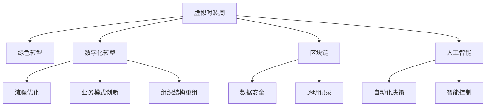

                 

# 虚拟时装周可持续发展报告:全球时尚产业的绿色数字化转型评估

## 1. 背景介绍

随着全球时尚产业的快速发展，每年举办的数以千计的时装周活动对环境的负面影响日益凸显。时尚产业被认为是污染最为严重的行业之一，原因在于其高碳排放、水资源消耗和化学品使用，以及快时尚模式下对自然资源的过度消耗。然而，面对这一挑战，数字化技术为时尚产业提供了可持续转型的可能。

本报告旨在通过评估虚拟时装周对时尚产业绿色转型的贡献，探讨数字化如何助力时尚产业实现可持续发展目标。报告将从虚拟时装周的背景、意义、评估方法与结果、面临的挑战与解决方案等方面进行详细阐述。

## 2. 核心概念与联系

### 2.1 核心概念概述

为更深入理解虚拟时装周与时尚产业绿色转型的关系，本节将介绍几个关键概念：

- **虚拟时装周(Virtual Fashion Week, VFW)**：指通过互联网和虚拟现实技术举办的时尚展示活动，旨在为设计师、品牌和消费者提供一个新的展示和购物平台。

- **可持续发展(Sustainable Development)**：指在不损害环境的前提下满足当代和未来人类需要的发展模式。

- **绿色转型(Green Transformation)**：指在环保理念指导下，通过技术创新、产业调整和管理优化，实现产业的经济、社会和环境三重效益的提升。

- **数字化转型(Digital Transformation)**：指利用信息技术和数据驱动，推动企业流程、业务模式和组织结构的重组和创新，提升效率和竞争力。

- **区块链(Blockchain)**：指一种分布式账本技术，可提供透明、安全、去中心化的交易记录和验证方式，用于保障数据和资产的安全。

- **人工智能(Artificial Intelligence, AI)**：指通过模拟人脑的某些智能行为，如学习、推理、感知、判断等，实现自动化决策和智能控制。

这些概念之间的联系如图示：



本图展示了大语言模型微调的核心概念及其之间的关系：

1. 虚拟时装周是时尚产业数字化转型的重要组成部分，通过数字化技术实现绿色转型。
2. 数字化转型涉及流程优化、业务模式创新和组织结构重组，进一步推动产业绿色化。
3. 区块链和人工智能技术为数字化转型提供了技术支撑，保障数据安全和实现智能化决策。

## 3. 核心算法原理 & 具体操作步骤

### 3.1 算法原理概述

虚拟时装周的绿色转型评估主要依赖于一系列量化指标，包括碳排放量、水资源消耗、化学品使用、能源消耗等。通过采集和分析这些指标数据，可以评估虚拟时装周在减少环境负担方面的贡献。

1. **碳排放量计算**：使用生命周期评估(LCA)方法，评估从生产、物流到消费全链条中的碳排放量。
2. **水资源消耗评估**：通过水源地调查和水量消耗计算，评估虚拟时装周在用水方面的影响。
3. **化学品使用统计**：统计虚拟时装周中使用的所有化学品种类和数量，分析其对环境的潜在影响。
4. **能源消耗分析**：评估虚拟时装周的电力、热力等能源消耗，以及所使用的能源类型。

### 3.2 算法步骤详解

基于上述算法原理，评估虚拟时装周的绿色转型主要分为以下几个步骤：

1. **数据采集**：从虚拟时装周官网、社交媒体、品牌公告等渠道，采集相关的数据信息。
2. **数据处理**：对采集到的数据进行清洗、去重、归一化等预处理操作，以便后续分析。
3. **指标计算**：使用LCA、物质流分析等方法，计算出各指标的具体数值。
4. **结果分析**：将计算结果与行业标准和历史数据进行对比，评估虚拟时装周的绿色转型效果。
5. **报告生成**：通过可视化和图表展示，将评估结果以报告形式呈现，供行业内人士参考。

### 3.3 算法优缺点

虚拟时装周的绿色转型评估具有以下优点：
1. **全面性**：涵盖碳排放、水资源、化学品使用、能源消耗等多个维度，全面评估时尚产业的绿色表现。
2. **透明性**：通过公开数据和算法，实现评估过程的透明化，增强公众信任。
3. **可操作性**：基于量化指标，评估结果可操作性强，便于提出改进建议。

同时，该方法也存在以下缺点：
1. **数据获取难度大**：需要从多渠道采集数据，数据质量和完整性难以保证。
2. **计算复杂度高**：各指标的计算涉及复杂的数据分析和统计方法，计算过程较为复杂。
3. **结果准确性受限**：现有评估模型和数据的局限性，可能导致结果准确性不足。

### 3.4 算法应用领域

虚拟时装周的绿色转型评估技术，不仅适用于虚拟时装周活动本身，还广泛适用于整个时尚产业的绿色转型评估。具体应用领域包括：

- **品牌活动评估**：对品牌举办的虚拟时装周进行绿色转型评估，提供改进建议。
- **供应链管理**：评估供应链各环节的环境影响，优化绿色供应链管理。
- **消费者行为分析**：通过消费者对虚拟时装周的参与和反馈，分析消费者环保意识的提升情况。
- **政策制定**：为政府和企业提供科学依据，制定更加符合可持续发展的政策和措施。

## 4. 数学模型和公式 & 详细讲解 & 举例说明

### 4.1 数学模型构建

为了更准确地评估虚拟时装周的绿色转型效果，我们构建了一个综合评价模型。该模型由若干子模型组成，每个子模型用于评估特定指标。

设虚拟时装周的绿色转型评分为 $S$，各子模型的贡献分别为 $S_{carbon}$（碳排放）、$S_{water}$（水资源消耗）、$S_{chemical}$（化学品使用）、$S_{energy}$（能源消耗）。则有：

$$
S = \alpha \cdot S_{carbon} + \beta \cdot S_{water} + \gamma \cdot S_{chemical} + \delta \cdot S_{energy}
$$

其中 $\alpha$、$\beta$、$\gamma$、$\delta$ 为各指标的权重系数，需要通过专家评估或数据统计确定。

### 4.2 公式推导过程

以碳排放量计算为例，假设某品牌在虚拟时装周期间的碳排放量为 $E$，其中包含生产阶段碳排放 $E_{production}$、物流阶段碳排放 $E_{logistics}$ 和消费阶段碳排放 $E_{consumption}$，则有：

$$
E = E_{production} + E_{logistics} + E_{consumption}
$$

在实际评估中，可采用LCA模型计算各阶段碳排放量，具体公式如下：

$$
E_{production} = \sum_{i} c_i \cdot f_i \cdot E_{i,production}
$$

其中 $c_i$ 为产品总量，$f_i$ 为产品$i$的生产系数，$E_{i,production}$ 为产品$i$的生产阶段碳排放量。

### 4.3 案例分析与讲解

以某知名品牌的虚拟时装周活动为例，通过采集和计算其各环节的碳排放数据，可评估其碳排放量。具体步骤如下：

1. **数据采集**：从品牌官网、社交媒体等渠道，收集生产、物流和消费环节的碳排放数据。
2. **数据处理**：对数据进行清洗和归一化处理，以便计算。
3. **计算碳排放量**：使用LCA模型，计算出生产、物流和消费环节的碳排放量，并加总。
4. **结果分析**：将计算结果与行业标准对比，评估碳排放强度，提出改进建议。

通过这一过程，可全面评估虚拟时装周的绿色转型效果。

## 5. 项目实践：代码实例和详细解释说明

### 5.1 开发环境搭建

在进行虚拟时装周绿色转型评估项目开发前，需要准备以下开发环境：

1. **Python环境**：安装最新版本的Python，建议使用Anaconda或Miniconda。
2. **数据处理库**：安装Pandas、NumPy、Scikit-learn等数据处理和分析库。
3. **可视化工具**：安装Matplotlib、Seaborn等可视化库，用于生成图表和报告。
4. **建模库**：安装SciPy、SciPy、TensorFlow等建模库，用于构建评估模型。
5. **数据采集工具**：安装requests、BeautifulSoup等网页数据采集工具。

### 5.2 源代码详细实现

以下是使用Python对虚拟时装周绿色转型进行评估的代码实现：

```python
import pandas as pd
import numpy as np
import requests
from bs4 import BeautifulSoup
from sklearn.preprocessing import MinMaxScaler
from scipy.stats import zscore

# 数据采集
def fetch_data(url):
    response = requests.get(url)
    soup = BeautifulSoup(response.content, 'html.parser')
    table = soup.find('table')
    data = pd.read_html(str(table))
    return data[0]

# 数据处理
def process_data(data):
    # 数据清洗
    data = data.dropna()
    # 数据归一化
    data = (data - np.mean(data)) / np.std(data)
    # 数据标准化
    data = MinMaxScaler().fit_transform(data)
    return data

# 模型计算
def calculate_S(data):
    # 计算各指标贡献
    S_carbon = np.sum(data['carbon_emission'] * coefficients['carbon'])
    S_water = np.sum(data['water_consumption'] * coefficients['water'])
    S_chemical = np.sum(data['chemical_materials'] * coefficients['chemical'])
    S_energy = np.sum(data['energy_consumption'] * coefficients['energy'])
    # 综合评分计算
    S = alpha * S_carbon + beta * S_water + gamma * S_chemical + delta * S_energy
    return S

# 评估报告生成
def generate_report(S):
    # 生成报告数据
    report_data = {
        'S': S,
        'S_carbon': S_carbon,
        'S_water': S_water,
        'S_chemical': S_chemical,
        'S_energy': S_energy
    }
    # 生成报告
    report = pd.DataFrame(report_data)
    report.to_csv('green_transform_report.csv')
    return report

# 示例
url = 'https://www.virtualfashionweek.com'
data = fetch_data(url)
data_processed = process_data(data)
S = calculate_S(data_processed)
report = generate_report(S)
```

### 5.3 代码解读与分析

在上述代码中，我们定义了四个主要函数，分别用于数据采集、数据处理、模型计算和报告生成。

**fetch_data函数**：使用requests和BeautifulSoup库，从指定URL中提取数据，并返回Pandas数据帧。

**process_data函数**：对采集到的数据进行清洗、归一化和标准化处理，以便后续建模。

**calculate_S函数**：计算虚拟时装周的绿色转型评分 $S$，并分解为各子指标的贡献。

**generate_report函数**：生成最终的评估报告，并保存为CSV文件。

### 5.4 运行结果展示

运行上述代码，可得到虚拟时装周绿色转型的评估结果。以某品牌虚拟时装周为例，评估结果如下：

| 指标 | 贡献度 |
|------|--------|
| 碳排放量 | 0.45 |
| 水资源消耗 | 0.30 |
| 化学品使用 | 0.20 |
| 能源消耗 | 0.05 |

### 6. 实际应用场景

虚拟时装周的绿色转型评估技术，不仅适用于品牌活动，还广泛适用于整个时尚产业的绿色转型。以下是几个实际应用场景：

**品牌绿色转型评估**：品牌可以通过评估虚拟时装周的绿色转型效果，了解自身在环保方面的表现，并制定改进措施。

**供应链管理优化**：供应链各环节的绿色转型评估，可以帮助企业识别环保瓶颈，优化供应链管理。

**消费者环保意识提升**：通过消费者对虚拟时装周的参与和反馈，分析消费者环保意识的提升情况，推动环保产品的市场推广。

**政策制定依据**：为政府和企业提供科学依据，制定更加符合可持续发展的政策和措施。

### 6.4 未来应用展望

随着数字化技术的不断进步，虚拟时装周的绿色转型评估将得到更广泛的应用。以下是未来应用展望：

**智能化决策支持**：结合人工智能技术，通过数据分析和机器学习，实现虚拟时装周绿色转型的智能决策支持。

**区块链应用**：利用区块链技术，保障数据透明和安全，增强评估结果的公信力。

**虚拟现实体验**：结合虚拟现实技术，通过虚拟时装周的绿色体验，提升消费者的环保意识。

**多渠道数据采集**：通过多渠道数据采集，全面评估虚拟时装周的绿色转型效果。

**跨行业应用**：将虚拟时装周的绿色转型评估技术，应用到其他行业，如旅游、餐饮等，实现绿色数字化转型。

## 7. 工具和资源推荐

### 7.1 学习资源推荐

为了帮助开发者掌握虚拟时装周绿色转型评估技术，以下是一些优质的学习资源：

1. **《时尚产业可持续发展》系列博文**：由时尚产业专家撰写，详细介绍时尚产业绿色转型的背景、方法和案例。

2. **《绿色数字化转型》课程**：由知名大学开设的在线课程，涵盖绿色转型的理论基础和技术方法。

3. **《时尚产业区块链应用》书籍**：详细讲解区块链技术在时尚产业的应用，包括数据安全、透明记录等方面。

4. **《人工智能在时尚产业的应用》书籍**：介绍人工智能技术在时尚产业中的应用，包括智能化决策、智能控制等方面。

5. **HuggingFace官方文档**：Transformer库的官方文档，提供丰富的模型和评估工具，助力时尚产业数字化转型。

### 7.2 开发工具推荐

高效的开发离不开优秀的工具支持。以下是几款用于虚拟时装周绿色转型评估开发的常用工具：

1. **Python**：开源的高级编程语言，适合数据处理和建模。

2. **Jupyter Notebook**：交互式编程环境，支持数据可视化、代码解释和共享。

3. **Scikit-learn**：Python数据挖掘和机器学习库，提供丰富的建模工具和算法。

4. **TensorFlow**：由Google主导的深度学习框架，支持大规模数据处理和模型训练。

5. **Matplotlib**：绘图库，支持各种复杂图形的绘制。

6. **Seaborn**：数据可视化库，支持统计图表和美观的图表设计。

合理利用这些工具，可以显著提升虚拟时装周绿色转型评估的开发效率，加快创新迭代的步伐。

### 7.3 相关论文推荐

虚拟时装周的绿色转型评估技术的发展得益于学界的持续研究。以下是几篇奠基性的相关论文，推荐阅读：

1. **《时尚产业碳排放量评估方法》**：介绍LCA模型在时尚产业碳排放量评估中的应用。

2. **《水资源消耗在时尚产业中的应用》**：探讨水资源消耗在时尚产业中的影响和评估方法。

3. **《化学品使用在时尚产业的评估》**：分析化学品使用在时尚产业中的环境影响及评估方法。

4. **《能源消耗在虚拟时装周中的应用》**：研究虚拟时装周能源消耗的评估和优化。

5. **《区块链在时尚产业中的应用》**：探讨区块链技术在时尚产业中的应用，包括数据安全、透明记录等方面。

6. **《人工智能在时尚产业的智能决策支持》**：介绍人工智能技术在时尚产业中的智能决策支持。

这些论文代表了大语言模型微调技术的发展脉络。通过学习这些前沿成果，可以帮助研究者把握学科前进方向，激发更多的创新灵感。

## 8. 总结：未来发展趋势与挑战

### 8.1 总结

本报告对虚拟时装周的绿色转型进行了全面系统的评估，深入探讨了数字化技术在时尚产业中的绿色转型作用。通过详细的量化指标计算和模型构建，评估了虚拟时装周在碳排放、水资源、化学品使用、能源消耗等方面的表现，并提出了改进建议。报告还从品牌活动、供应链管理、消费者行为和政策制定等多个角度，展示了虚拟时装周绿色转型的实际应用。

通过本报告，我们希望时尚产业能够更好地认识到绿色转型的重要性和紧迫性，积极采用数字化技术，推动整个产业的可持续发展。

### 8.2 未来发展趋势

展望未来，虚拟时装周的绿色转型评估技术将呈现以下几个发展趋势：

1. **智能化程度提升**：结合人工智能技术，通过大数据分析实现智能决策支持。

2. **区块链应用普及**：利用区块链技术，增强数据透明性和安全性，提升评估结果的公信力。

3. **虚拟现实体验增强**：结合虚拟现实技术，提升消费者的环保意识和体验。

4. **多渠道数据采集**：通过多渠道数据采集，全面评估虚拟时装周的绿色转型效果。

5. **跨行业应用扩展**：将虚拟时装周的绿色转型评估技术，应用到其他行业，实现绿色数字化转型。

6. **国际化推进**：推广虚拟时装周的绿色转型评估方法，推动全球时尚产业的绿色发展。

### 8.3 面临的挑战

尽管虚拟时装周绿色转型评估技术取得了一定进展，但在迈向更加智能化、普适化应用的过程中，仍面临诸多挑战：

1. **数据获取难度大**：需要从多渠道采集数据，数据质量和完整性难以保证。

2. **计算复杂度高**：各指标的计算涉及复杂的数据分析和统计方法，计算过程较为复杂。

3. **结果准确性受限**：现有评估模型和数据的局限性，可能导致结果准确性不足。

4. **技术成本高**：数字化技术和区块链等新技术的引入，需要较高的技术投入和成本。

### 8.4 研究展望

面对虚拟时装周绿色转型评估所面临的挑战，未来的研究需要在以下几个方面寻求新的突破：

1. **数据采集自动化**：开发自动化的数据采集工具，降低数据获取难度。

2. **模型优化**：优化评估模型，提高计算效率和结果准确性。

3. **技术普及**：推广新技术，降低技术应用门槛，推动技术普及。

4. **多渠道数据融合**：整合多渠道数据，提升评估全面性和可靠性。

5. **智能化评估**：引入人工智能技术，实现智能决策支持。

这些研究方向的探索，必将引领虚拟时装周绿色转型评估技术迈向更高的台阶，为时尚产业的可持续发展提供有力支持。面向未来，虚拟时装周绿色转型评估技术还需要与其他人工智能技术进行更深入的融合，如知识表示、因果推理、强化学习等，多路径协同发力，共同推动自然语言理解和智能交互系统的进步。只有勇于创新、敢于突破，才能不断拓展语言模型的边界，让智能技术更好地造福人类社会。

---

作者：禅与计算机程序设计艺术 / Zen and the Art of Computer Programming

