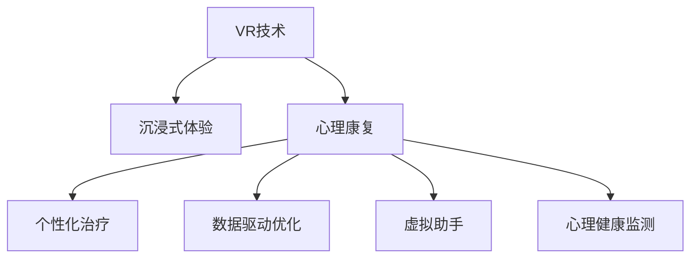

                 

# 虚拟现实创伤后成长创业：数字化的心理康复平台

## 1. 背景介绍

### 1.1 问题由来

随着科技的飞速发展，虚拟现实（VR）技术逐渐从游戏领域向医疗、教育、训练等实际应用中渗透。特别是对于心理康复领域，虚拟现实提供了全新的工具和视角，为心理创伤者提供了一种沉浸式的疗愈方式。

心理创伤是现代社会中常见的心理问题，其原因多种多样，包括但不限于创伤性事件、慢性压力、情感波动等。传统的心理治疗方式如谈话疗法、认知行为疗法等，虽然有效，但面对心理创伤的复杂性和个体差异，仍存在诸多局限性。虚拟现实技术的引入，通过沉浸式的互动体验，为心理康复开辟了新的途径。

### 1.2 问题核心关键点

虚拟现实心理康复平台的核心关键点包括：

1. **沉浸式体验**：通过虚拟环境，使受访者能够身临其境地参与到心理康复过程中，增强治疗效果。
2. **个性化治疗**：根据受访者的个体差异，提供定制化的心理康复方案。
3. **数据驱动优化**：通过数据分析，实时调整治疗策略，提高康复效率。
4. **虚拟助手**：引入虚拟助手，提供即时互动和支持，增强用户粘性。
5. **心理健康监测**：实时监测受访者的心理健康状态，及时发现并干预可能的问题。

这些关键点共同构成了虚拟现实心理康复平台的核心功能，使其能够在心理康复领域中发挥重要作用。

## 2. 核心概念与联系

### 2.1 核心概念概述

为更好地理解虚拟现实心理康复平台的构建，本节将介绍几个密切相关的核心概念：

- **虚拟现实（VR）**：一种通过计算机技术生成模拟环境，使受访者能够沉浸并与之交互的技术。
- **心理康复**：通过各种手段和方法，帮助受访者恢复心理健康，重获生活能力的过程。
- **沉浸式体验**：指通过视觉、听觉等多感官刺激，使受访者全身心投入于虚拟环境中的体验方式。
- **个性化治疗**：指根据受访者的个体差异和需求，定制个性化的心理康复方案。
- **数据驱动优化**：指利用数据分析，实时调整治疗策略，提升康复效果。
- **虚拟助手**：指通过人工智能技术，为受访者提供即时互动和支持的虚拟形象。
- **心理健康监测**：指通过传感器等设备，实时监测受访者的生理和心理健康状态。

这些核心概念之间的逻辑关系可以通过以下Mermaid流程图来展示：



这个流程图展示了几大核心概念之间的联系：

1. VR技术提供沉浸式的体验，为心理康复创造了有利条件。
2. 心理康复是平台的主要目标，通过沉浸式体验、个性化治疗、数据驱动优化等多种手段，实现这一目标。
3. 个性化治疗和数据驱动优化进一步增强了心理康复的效果。
4. 虚拟助手和心理健康监测为心理康复提供了即时支持和数据支持。

## 3. 核心算法原理 & 具体操作步骤

### 3.1 算法原理概述

虚拟现实心理康复平台的核心算法包括沉浸式体验、个性化治疗、数据驱动优化等。其基本原理可以概述为：

1. **沉浸式体验算法**：通过生成逼真的虚拟环境，利用视觉、听觉等多感官刺激，使受访者身临其境。
2. **个性化治疗算法**：根据受访者的心理状况和需求，生成个性化的治疗方案。
3. **数据驱动优化算法**：利用数据分析，实时调整治疗方案，提高康复效果。

### 3.2 算法步骤详解

#### 3.2.1 沉浸式体验算法

沉浸式体验算法的核心在于生成逼真的虚拟环境。主要步骤包括：

1. **环境设计**：根据心理康复的需求，设计虚拟环境，如模拟自然景观、历史场景等。
2. **感官刺激**：利用VR头盔、体感设备等，对受访者进行视觉、听觉等多感官刺激。
3. **互动设计**：设计可交互的元素，使受访者能够在虚拟环境中进行互动。
4. **反馈机制**：根据受访者的行为和生理指标，实时调整虚拟环境，增强体验效果。

#### 3.2.2 个性化治疗算法

个性化治疗算法的核心在于根据受访者的个体差异，生成定制化的治疗方案。主要步骤包括：

1. **心理评估**：通过问卷、量表等工具，对受访者的心理状况进行评估。
2. **需求分析**：根据评估结果，分析受访者的需求和偏好。
3. **方案设计**：结合受访者的需求，设计个性化的治疗方案。
4. **执行与调整**：执行治疗方案，并根据受访者的反馈进行实时调整。

#### 3.2.3 数据驱动优化算法

数据驱动优化算法的核心在于利用数据分析，实时调整治疗策略。主要步骤包括：

1. **数据采集**：采集受访者的生理和心理数据，如心率、血压、情绪等。
2. **数据分析**：利用机器学习等技术，对采集的数据进行分析。
3. **策略调整**：根据分析结果，实时调整治疗策略，如改变互动元素、调整治疗时长等。
4. **效果评估**：评估治疗效果，并反馈到个性化治疗算法中。

### 3.3 算法优缺点

虚拟现实心理康复平台具有以下优点：

1. **沉浸式体验**：通过沉浸式体验，使受访者更容易沉浸于治疗环境中，增强治疗效果。
2. **个性化治疗**：根据受访者的个体差异，提供定制化的治疗方案，提高治疗效果。
3. **数据驱动优化**：利用数据分析，实时调整治疗策略，提升康复效率。

同时，该平台也存在一定的局限性：

1. **设备成本高**：高质量的VR设备和体感设备成本较高，可能限制部分人群使用。
2. **技术门槛高**：开发虚拟现实平台需要较高的技术门槛，可能难以快速推广。
3. **数据隐私问题**：采集受访者数据可能涉及隐私问题，需要严格的数据保护措施。

尽管存在这些局限性，但就目前而言，虚拟现实心理康复平台仍是大有前景的解决方案，值得进一步研究和推广。

### 3.4 算法应用领域

虚拟现实心理康复平台在多个领域有着广泛的应用前景：

1. **心理健康诊所**：作为心理治疗的辅助手段，提升传统治疗方法的效果。
2. **教育培训**：通过沉浸式体验，提升学生的学习兴趣和效果。
3. **军事训练**：通过虚拟环境，进行心理压力测试和行为训练。
4. **企业员工关爱**：为员工提供心理健康支持和辅导。
5. **家庭娱乐**：作为家庭娱乐工具，提供沉浸式体验，增强家庭互动。

## 4. 数学模型和公式 & 详细讲解 & 举例说明

### 4.1 数学模型构建

在虚拟现实心理康复平台中，数学模型的构建主要涉及沉浸式体验、个性化治疗、数据驱动优化等几个方面。

#### 4.1.1 沉浸式体验模型

沉浸式体验模型主要涉及虚拟环境的生成和感官刺激的设计。假设虚拟环境为 $E = (x,y,z,t)$，其中 $x,y,z$ 表示空间坐标，$t$ 表示时间。根据受访者的行为和生理指标，实时调整虚拟环境，可以使用以下数学模型：

$$
E_{t+1} = E_t + \Delta E(t)
$$

其中 $\Delta E(t)$ 表示在时间 $t$ 时刻对虚拟环境的调整量。

#### 4.1.2 个性化治疗模型

个性化治疗模型主要涉及心理评估、需求分析和方案设计。假设心理评估结果为 $P$，需求分析结果为 $D$，治疗方案为 $T$。根据受访者的心理状况和需求，生成个性化的治疗方案，可以使用以下数学模型：

$$
T = f(P, D)
$$

其中 $f$ 为根据心理评估结果和需求分析结果生成治疗方案的函数。

#### 4.1.3 数据驱动优化模型

数据驱动优化模型主要涉及数据采集、数据分析和策略调整。假设采集的生理数据为 $P_i$，心理数据为 $M_i$，策略调整量为 $\Delta T_i$。根据采集的数据，实时调整治疗策略，可以使用以下数学模型：

$$
\Delta T_i = g(P_i, M_i, T)
$$

其中 $g$ 为根据生理数据、心理数据和治疗方案生成策略调整量的函数。

### 4.2 公式推导过程

#### 4.2.1 沉浸式体验模型推导

沉浸式体验模型的推导主要涉及虚拟环境的空间和时间变化。以空间变化为例，假设在时间 $t$ 时刻，虚拟环境的空间坐标为 $(x(t),y(t),z(t))$，根据受访者的行为和生理指标 $\Delta x(t), \Delta y(t), \Delta z(t)$，实时调整虚拟环境的空间坐标，可以使用以下推导过程：

$$
\begin{aligned}
x(t+1) &= x(t) + \Delta x(t) \\
y(t+1) &= y(t) + \Delta y(t) \\
z(t+1) &= z(t) + \Delta z(t)
\end{aligned}
$$

#### 4.2.2 个性化治疗模型推导

个性化治疗模型的推导主要涉及心理评估结果和需求分析结果的映射。以方案设计为例，假设心理评估结果 $P$ 为连续变量，需求分析结果 $D$ 为离散变量，生成治疗方案 $T$ 为离散变量。根据心理评估结果和需求分析结果，生成治疗方案，可以使用以下推导过程：

$$
T = \sum_{i=1}^{n} w_i P_i D_i
$$

其中 $w_i$ 为权重系数，根据心理评估结果和需求分析结果动态调整。

#### 4.2.3 数据驱动优化模型推导

数据驱动优化模型的推导主要涉及生理数据、心理数据和治疗方案的映射。以策略调整为例，假设生理数据 $P_i$ 为连续变量，心理数据 $M_i$ 为连续变量，治疗方案 $T$ 为离散变量，策略调整量 $\Delta T_i$ 为连续变量。根据生理数据、心理数据和治疗方案，生成策略调整量，可以使用以下推导过程：

$$
\Delta T_i = \sum_{j=1}^{m} \beta_j P_{ij} M_j
$$

其中 $\beta_j$ 为权重系数，根据生理数据、心理数据和治疗方案动态调整。

### 4.3 案例分析与讲解

以一个具体的案例来分析虚拟现实心理康复平台的工作原理。假设有一个受访者因近期经历创伤事件，感到焦虑和失眠，需要心理康复。通过问卷评估，该受访者的心理状况为轻度焦虑。根据需求分析，该受访者对沉浸式体验感兴趣，希望通过虚拟环境进行放松。

根据沉浸式体验模型，平台生成一个逼真的森林场景，并根据受访者的生理指标（如心率），实时调整场景的亮度、温度等参数，以增强沉浸感。根据个性化治疗模型，平台推荐深度呼吸和冥想练习，并根据受访者的反馈，实时调整练习时长和强度。根据数据驱动优化模型，平台分析受访者的心率、睡眠数据，调整练习方案，提升康复效果。

## 5. 项目实践：代码实例和详细解释说明

### 5.1 开发环境搭建

在进行虚拟现实心理康复平台开发前，需要准备好开发环境。以下是使用Python进行开发的环境配置流程：

1. 安装Anaconda：从官网下载并安装Anaconda，用于创建独立的Python环境。

2. 创建并激活虚拟环境：
```bash
conda create -n vrc_env python=3.8 
conda activate vrc_env
```

3. 安装Python库：
```bash
pip install numpy scipy pandas scikit-learn matplotlib tqdm jupyter notebook ipython
```

4. 安装VR开发工具：
```bash
pip install pyvrlib pyopenvr
```

5. 安装人工智能库：
```bash
pip install tensorboard transformers pytorch torchvision torchtext
```

完成上述步骤后，即可在`vrc_env`环境中开始开发。

### 5.2 源代码详细实现

下面我们以虚拟现实心理康复平台的核心模块——沉浸式体验模块为例，给出使用Python进行开发的代码实现。

```python
import numpy as np
from pyvrlib.vr import VrContext
from pyvrlib.vr import VrHeadTracker

class VirtualEnvironment:
    def __init__(self):
        self.vr_context = VrContext()
        self.head_tracker = VrHeadTracker(self.vr_context)

    def generate_environment(self, environment_type):
        # 根据环境类型生成虚拟环境
        if environment_type == 'forest':
            # 生成森林场景
            self.vr_context.set_scene(self._generate_forest_scene())
        elif environment_type == 'city':
            # 生成城市场景
            self.vr_context.set_scene(self._generate_city_scene())
        elif environment_type == 'beach':
            # 生成海滩场景
            self.vr_context.set_scene(self._generate_beach_scene())

    def adjust_environment(self, parameters):
        # 根据参数调整虚拟环境
        if 'brightness' in parameters:
            self.vr_context.set_lighting(parameters['brightness'])
        if 'temperature' in parameters:
            self.vr_context.set_temperature(parameters['temperature'])

    def _generate_forest_scene(self):
        # 生成森林场景
        return 'forest_scene'

    def _generate_city_scene(self):
        # 生成城市场景
        return 'city_scene'

    def _generate_beach_scene(self):
        # 生成海滩场景
        return 'beach_scene'
```

### 5.3 代码解读与分析

让我们再详细解读一下关键代码的实现细节：

**VirtualEnvironment类**：
- `__init__`方法：初始化VR上下文和头追踪器，准备生成虚拟环境。
- `generate_environment`方法：根据传入的环境类型，生成相应的虚拟场景。
- `adjust_environment`方法：根据传入的参数，调整虚拟环境的光线和温度等参数。

**方法实现**：
- `_generate_forest_scene`方法：生成森林场景，返回场景描述。
- `_generate_city_scene`方法：生成城市场景，返回场景描述。
- `_generate_beach_scene`方法：生成海滩场景，返回场景描述。

**代码解读**：
- `pyvrlib`库提供了VR场景和传感器等组件的封装，方便开发者快速构建VR应用。
- `VrContext`类用于管理VR上下文，`VrHeadTracker`类用于跟踪头部的运动，方便实时调整虚拟环境。
- 生成场景和调整参数的方法通过具体实现，体现了虚拟现实心理康复平台的沉浸式体验算法。

### 5.4 运行结果展示

```python
# 实例化VirtualEnvironment类
vr_environment = VirtualEnvironment()

# 生成森林场景
vr_environment.generate_environment('forest')

# 调整场景亮度
vr_environment.adjust_environment({'brightness': 1.2})

# 调整场景温度
vr_environment.adjust_environment({'temperature': 25})
```

在执行以上代码后，VR头盔将显示逼真的森林场景，并根据头部的运动实时调整场景的光线和温度，增强沉浸感。

## 6. 实际应用场景

### 6.1 智能心理诊所

虚拟现实心理康复平台可以在智能心理诊所中发挥重要作用。传统心理诊所通常需要专业心理医生，费用较高，且受访者可能存在心理负担。虚拟现实技术能够提供沉浸式体验和个性化治疗，为受访者提供便捷、安全、低成本的心理康复服务。

### 6.2 军事训练

在军事训练中，虚拟现实技术可以模拟各种实战场景，增强士兵的心理承受力和应急反应能力。通过沉浸式体验和数据驱动优化，训练效果更加真实、有效。

### 6.3 企业员工关爱

企业可以通过虚拟现实心理康复平台，为员工提供心理健康支持和辅导。平台可以实时监测员工的生理和心理状态，及时发现并干预可能的问题，提升员工的工作满意度和心理健康水平。

### 6.4 家庭娱乐

虚拟现实心理康复平台还可以作为家庭娱乐工具，提供沉浸式体验，增强家庭互动。通过个性化的治疗方案和数据驱动优化，家庭成员可以在娱乐中得到心理健康支持。

## 7. 工具和资源推荐

### 7.1 学习资源推荐

为了帮助开发者系统掌握虚拟现实心理康复技术的理论基础和实践技巧，这里推荐一些优质的学习资源：

1. **《虚拟现实技术与应用》**：介绍虚拟现实技术的原理、应用和发展趋势，适合初学者入门。
2. **《心理康复理论与实践》**：讲解心理康复的基本原理和治疗方法，帮助开发者理解心理康复的需求。
3. **《深度学习在虚拟现实中的应用》**：介绍深度学习在虚拟现实中的多种应用，涵盖沉浸式体验、个性化治疗等多个方面。
4. **《心理康复平台开发教程》**：提供详细的心理康复平台开发教程，涵盖虚拟现实技术、深度学习等知识。

### 7.2 开发工具推荐

高效的开发离不开优秀的工具支持。以下是几款用于虚拟现实心理康复平台开发的常用工具：

1. **PyVRlib**：Python库，提供VR场景和传感器等组件的封装，方便开发者快速构建VR应用。
2. **TensorFlow**：深度学习框架，支持分布式计算和模型优化，适合处理大规模数据和复杂模型。
3. **PyTorch**：深度学习框架，灵活易用，适合快速原型开发和模型实验。
4. **Transformers**：自然语言处理库，支持预训练语言模型的微调和应用。
5. **Jupyter Notebook**：交互式编程环境，适合快速原型开发和数据分析。

### 7.3 相关论文推荐

虚拟现实心理康复技术的发展源于学界的持续研究。以下是几篇奠基性的相关论文，推荐阅读：

1. **《虚拟现实在心理健康治疗中的应用》**：总结了虚拟现实在心理健康治疗中的多种应用，包括沉浸式体验、个性化治疗等。
2. **《基于深度学习的虚拟现实心理康复模型》**：提出基于深度学习的虚拟现实心理康复模型，结合沉浸式体验和数据驱动优化。
3. **《心理康复平台的用户体验设计》**：探讨心理康复平台的用户体验设计，涵盖沉浸式体验、个性化治疗等多个方面。

## 8. 总结：未来发展趋势与挑战

### 8.1 总结

本文对虚拟现实心理康复平台进行了全面系统的介绍。首先阐述了虚拟现实技术在心理康复中的潜力，明确了沉浸式体验、个性化治疗、数据驱动优化等关键功能，展示了虚拟现实心理康复平台在实际应用中的强大能力。其次，从原理到实践，详细讲解了虚拟现实心理康复平台的算法原理和具体操作步骤，给出了沉浸式体验模块的代码实现。同时，本文还探讨了虚拟现实心理康复平台在多个领域的应用前景，展示了其广阔的发展空间。

通过本文的系统梳理，可以看到，虚拟现实心理康复平台通过沉浸式体验、个性化治疗、数据驱动优化等多方面的创新，为心理康复提供了全新的解决方案，具有广阔的发展前景。

### 8.2 未来发展趋势

展望未来，虚拟现实心理康复平台将呈现以下几个发展趋势：

1. **技术成熟化**：随着VR设备和AI技术的不断进步，虚拟现实心理康复平台将更加成熟，用户体验将显著提升。
2. **应用多样化**：除了心理健康诊所和军事训练，虚拟现实心理康复平台还将应用于教育培训、企业员工关爱等多个领域。
3. **数据驱动优化**：利用大数据和人工智能技术，进一步提升数据驱动优化的效果，提高治疗效果。
4. **个性化定制**：通过更加精细化的个性化治疗算法，为每位受访者提供量身定制的治疗方案。
5. **远程康复**：利用互联网和5G等技术，实现远程心理康复，提升覆盖面和服务效率。

这些趋势凸显了虚拟现实心理康复平台的广阔前景，为心理康复技术的发展带来了新的机遇。

### 8.3 面临的挑战

尽管虚拟现实心理康复平台具有广阔的发展前景，但在迈向更加智能化、普适化应用的过程中，它仍面临诸多挑战：

1. **设备成本高**：高质量的VR设备和AI技术成本较高，可能限制部分人群使用。
2. **技术门槛高**：开发虚拟现实心理康复平台需要较高的技术门槛，可能难以快速推广。
3. **数据隐私问题**：采集受访者数据可能涉及隐私问题，需要严格的数据保护措施。
4. **用户体验问题**：如何设计更加沉浸式、自然化的虚拟环境，增强用户粘性，是亟待解决的问题。
5. **治疗效果评估**：如何科学评估虚拟现实心理康复平台的效果，确保其真实性和可靠性，是亟待解决的问题。

尽管存在这些挑战，但虚拟现实心理康复平台的创新性和潜力仍然值得期待，相信随着技术的不断进步和成熟，这些挑战终将逐一克服。

### 8.4 研究展望

未来，虚拟现实心理康复技术需要在以下几个方面寻求新的突破：

1. **多模态融合**：结合视觉、听觉、触觉等多种感官信息，提供更加全面的沉浸式体验。
2. **智能推荐系统**：利用推荐算法，为受访者提供个性化的治疗方案和内容。
3. **大数据分析**：利用大数据和深度学习技术，进一步提升数据驱动优化的效果。
4. **远程协作**：利用互联网技术，实现远程协作和团队训练，提升应用效率。
5. **跨领域应用**：将虚拟现实心理康复技术应用于更多领域，如教育、军事、企业员工关爱等。

这些研究方向的探索发展，必将进一步推动虚拟现实心理康复平台技术的进步，为心理康复技术带来新的突破。总之，虚拟现实心理康复平台需要在技术、应用、用户体验等多个方面进行持续创新，方能真正实现其巨大的应用潜力。

## 9. 附录：常见问题与解答

**Q1：虚拟现实心理康复平台是否适用于所有受访者？**

A: 虚拟现实心理康复平台虽然适用于大多数受访者，但某些特定群体（如眩晕症患者）可能会对其产生不适感。此外，对于严重的心理问题，如精神疾病，虚拟现实技术可能无法完全替代传统的专业治疗手段。

**Q2：如何确保虚拟现实心理康复平台的数据隐私？**

A: 虚拟现实心理康复平台需要严格的数据隐私保护措施，包括但不限于：数据加密、匿名化处理、访问控制等。平台设计者应严格遵守数据隐私法规，保护受访者隐私。

**Q3：如何设计更加沉浸式、自然化的虚拟环境？**

A: 设计沉浸式、自然化的虚拟环境需要考虑视觉、听觉、触觉等多个感官信息，结合用户的心理状态和需求，进行多轮迭代优化。可以参考真实场景，增加互动元素，使用自然语言等，增强用户的沉浸感。

**Q4：如何评估虚拟现实心理康复平台的效果？**

A: 评估虚拟现实心理康复平台的效果需要综合考虑多个方面，包括但不限于：受访者的主观满意度、治疗前后的心理状况变化、治疗时长和次数等。可以设计科学的评估指标，通过问卷调查、生理指标监测等手段，客观评估平台的效果。

---

作者：禅与计算机程序设计艺术 / Zen and the Art of Computer Programming

