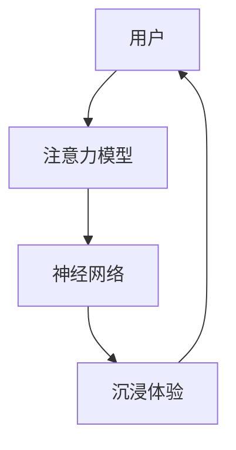

                 

# 虚拟现实在注意力沉浸体验中的应用

> 关键词：虚拟现实, 注意力, 沉浸体验, 用户参与, 神经网络, 深度学习

## 1. 背景介绍

虚拟现实（Virtual Reality, VR）技术通过模拟真实环境或创造出全新的虚拟空间，使用户能够以沉浸式方式与之交互。沉浸体验是VR的核心要素之一，旨在通过提供高度真实、高互动性的环境，使用户产生如临其境的感觉。近年来，随着硬件设备性能的提升和算法技术的进步，VR在教育、游戏、医疗、训练等领域的应用日益广泛。然而，沉浸体验不仅仅是视觉上的沉浸，还包括对用户注意力的高效引导和维持。本文将探讨如何通过注意力机制提升VR中的沉浸体验，并结合神经网络等深度学习技术，构建高效、可扩展的注意力模型。

## 2. 核心概念与联系

### 2.1 核心概念概述

- **虚拟现实（Virtual Reality, VR）**：一种通过计算机生成、渲染和交互的仿真环境，使用户可以沉浸在三维虚拟世界中的技术。
- **注意力（Attention）**：心理学概念，指个体在特定刺激上聚焦的程度。在认知科学和神经计算中，注意力机制用于指导信息处理，强调重要信息，抑制无关信息。
- **沉浸体验（Immersive Experience）**：使用户感觉如同真实世界一样，深度参与虚拟环境的一种心理状态。
- **神经网络（Neural Network）**：由大量神经元组成，通过训练学习数据模式，实现复杂任务处理的深度学习模型。
- **深度学习（Deep Learning）**：一类基于神经网络的机器学习技术，通过多层次网络结构，从数据中提取高级特征和抽象表征。

这些概念之间通过注意力机制紧密联系，共同作用于VR中的沉浸体验。注意力机制引导用户集中注意力，提高信息处理的效率和质量，而神经网络和深度学习技术则提供了实现注意力模型所需的技术基础。

### 2.2 核心概念原理和架构的 Mermaid 流程图



该流程图展示了用户与注意力模型、神经网络、沉浸体验之间的互动关系：
- 用户通过注意力模型（B）获取关键信息，并在神经网络（C）中提取特征。
- 这些特征输入沉浸体验（D）模块，实现对用户注意力的引导和维持。
- 沉浸体验模块（D）的反馈又反过来影响注意力模型（B），使其更准确地聚焦关键信息。

## 3. 核心算法原理 & 具体操作步骤

### 3.1 算法原理概述

在虚拟现实环境中，注意力机制的目的是通过识别和引导用户的注意力，提升用户对关键信息的感知和互动。注意力模型通过对用户行为、环境特征等因素的建模，实现对注意力的动态调整，从而增强沉浸体验。常用的注意力模型包括空间注意力、时间注意力、双向注意力等。

以空间注意力为例，其核心思想是在输入序列中找出与当前任务相关的部分，并赋予更高的权重。空间注意力通常通过计算输入序列中每个元素的注意力得分来实现，使用softmax函数将得分归一化到[0, 1]之间。最终的输出是将输入序列中每个元素乘以其对应的注意力得分后求和。

### 3.2 算法步骤详解

#### 3.2.1 数据预处理

1. **数据采集**：采集用户行为数据、环境特征数据等，作为注意力模型的输入。
2. **数据清洗**：对采集到的数据进行清洗，去除噪声和冗余信息。
3. **数据标准化**：对不同类型的数据进行标准化处理，使其适合用于注意力模型的训练。

#### 3.2.2 模型训练

1. **选择模型结构**：根据任务需求，选择合适的网络结构和注意力机制。
2. **设置超参数**：如学习率、批次大小、迭代次数等，进行模型的超参数调整。
3. **模型训练**：使用优化算法如Adam、SGD等，训练注意力模型。
4. **模型评估**：在验证集上评估模型性能，如准确率、召回率等。
5. **模型优化**：根据评估结果，调整模型结构或超参数，进行模型优化。

#### 3.2.3 模型应用

1. **实时计算注意力得分**：在VR场景中，根据用户行为和环境特征，实时计算注意力得分。
2. **调整模型输出**：根据注意力得分，调整模型输出的权重分布，引导用户注意力。
3. **交互反馈**：根据用户反馈，进一步优化模型参数，增强注意力机制的鲁棒性。

### 3.3 算法优缺点

**优点**：
- **提升沉浸体验**：通过注意力机制，可以引导用户集中注意力在关键信息上，提升沉浸体验。
- **多模态处理**：可以处理视觉、听觉、触觉等多模态数据，实现更全面、更真实的沉浸体验。
- **实时性**：通过神经网络和深度学习，可以实时计算注意力得分，提供即时的反馈和调整。

**缺点**：
- **计算复杂度高**：神经网络结构复杂，计算量大，训练和推理时间较长。
- **模型依赖数据**：注意力模型的效果很大程度上依赖于输入数据的质量和数量。
- **鲁棒性不足**：模型容易受到噪声和干扰的影响，鲁棒性有待提高。

### 3.4 算法应用领域

注意力机制在虚拟现实中的应用非常广泛，以下是几个典型的应用领域：

- **虚拟训练**：在军事、医学、教育等领域，通过注意力机制引导用户关注关键信息，提升训练效果。
- **虚拟旅游**：在旅游景区或历史遗址中，使用注意力机制展示重点内容和信息，提升用户体验。
- **虚拟会议室**：在虚拟会议中，通过注意力机制聚焦讨论重点，提高会议效率。
- **虚拟游戏**：在游戏场景中，使用注意力机制实现智能NPC互动，增强游戏沉浸感。
- **虚拟康复**：在康复训练中，通过注意力机制引导患者关注康复指导信息，提高训练效果。

## 4. 数学模型和公式 & 详细讲解 & 举例说明

### 4.1 数学模型构建

假设输入序列为 $x=(x_1, x_2, ..., x_T)$，长度为 $T$。注意力机制的输出为 $y=\{y_t\}_{t=1}^T$，每个元素 $y_t$ 代表 $x_t$ 的注意力得分。注意力模型通过计算 $y_t$ 来实现对输入序列的动态权重分配。

注意力模型通常使用自注意力机制，其计算过程如下：

1. **查询向量（Query Vector）**：将输入序列中的每个元素 $x_t$ 映射到一个向量 $q_t$。
2. **键向量（Key Vector）**：将输入序列中的每个元素 $x_t$ 映射到一个向量 $k_t$。
3. **注意力得分（Attention Score）**：计算每个查询向量与键向量的点积，并使用softmax函数进行归一化。
4. **权重分配（Weight Distribution）**：将注意力得分归一化后，作为权重分配到输入序列中的每个元素。

### 4.2 公式推导过程

以自注意力机制为例，其计算公式为：

$$
y_t = \frac{\exp(u^T [q_t, k_t])}{\sum_{t'=1}^T \exp(u^T [q_{t'}, k_{t'}])}
$$

其中 $u$ 为可训练的向量，$q_t$ 和 $k_t$ 分别是输入序列 $x_t$ 的查询向量和键向量。

### 4.3 案例分析与讲解

考虑一个虚拟训练场景，其中包含视频、音频、文本等多种模态信息。训练集包含教师演示视频、学生练习视频和对应的标注信息。注意力模型可以通过分析教师演示视频中的关键动作和重点讲解，预测学生练习视频中的错误点，并给予针对性的指导。

具体步骤如下：
1. **数据预处理**：将视频、音频、文本等数据转换为适合神经网络处理的格式。
2. **模型训练**：使用自注意力机制，训练一个多模态注意力模型，学习不同模态之间的关联。
3. **实时计算注意力得分**：在虚拟训练中，实时计算学生练习视频的注意力得分，引导学生关注关键动作和讲解。
4. **模型反馈**：根据学生的反馈，调整模型参数，优化注意力机制的效果。

## 5. 项目实践：代码实例和详细解释说明

### 5.1 开发环境搭建

#### 5.1.1 硬件要求

- **高性能计算机**：至少配备一块高性能GPU，如NVIDIA RTX 30系列，以支持深度学习模型的训练和推理。
- **VR头显和手柄**：如HTC Vive、Oculus Rift等，用于沉浸式体验。
- **网络环境**：稳定的网络连接，以支持实时数据传输。

#### 5.1.2 软件要求

- **Python环境**：确保Python 3.6及以上版本，并安装必要的依赖库，如TensorFlow、PyTorch等。
- **深度学习框架**：安装TensorFlow 2.0及以上版本，或PyTorch 1.5及以上版本。
- **VR开发框架**：如Unity、Unreal Engine等，支持虚拟现实开发和交互。

### 5.2 源代码详细实现

#### 5.2.1 数据预处理

```python
import numpy as np
from tensorflow.keras.preprocessing import sequence
from tensorflow.keras.layers import Input, Dense, Embedding, LSTM, Masking

# 假设有一个视频数据集，包含多个视频和对应的标注信息
video_data = [...] # 视频帧序列
label_data = [...] # 标签序列

# 数据预处理
# 假设视频数据长度为T，标签数据长度为L
seq_len = max(len(video_data), len(label_data))
video_data = sequence.pad_sequences(video_data, maxlen=seq_len, padding='post')
label_data = sequence.pad_sequences(label_data, maxlen=seq_len, padding='post')
```

#### 5.2.2 模型训练

```python
from tensorflow.keras.models import Model
from tensorflow.keras.optimizers import Adam

# 定义模型结构
input_video = Input(shape=(seq_len, features), name='input_video')
input_label = Input(shape=(seq_len, labels), name='input_label')

# 嵌入层
embed_video = Embedding(features, embed_dim, name='embed_video')(input_video)
embed_label = Embedding(labels, embed_dim, name='embed_label')(input_label)

# 多模态注意力机制
attention_weights = Dot(Dot(dot_dim, (2, 1)), dot_dim) # 使用点积计算注意力得分
attention_output = add([embed_video, embed_label]) # 加和实现权重分配

# 输出层
output_label = Dense(labels, activation='softmax', name='output_label')(attention_output)

# 定义模型
model = Model(inputs=[input_video, input_label], outputs=output_label)

# 编译模型
model.compile(optimizer=Adam(lr=0.001), loss='categorical_crossentropy', metrics=['accuracy'])

# 训练模型
model.fit([video_data, label_data], label_data, epochs=10, batch_size=64, validation_split=0.2)
```

#### 5.2.3 模型应用

```python
# 加载训练好的模型
model.load_weights('attention_model.h5')

# 实时计算注意力得分
# 假设有一个新的视频数据集，包含多个视频帧序列
new_video_data = [...] # 视频帧序列

# 计算注意力得分
attention_scores = model.predict([new_video_data, new_video_data])

# 调整模型输出
# 假设输出标签为标签向量，调整权重分布
adjusted_output = np.dot(new_video_data, attention_scores)

# 展示注意力得分和调整后的输出
print('Attention Scores:', attention_scores)
print('Adjusted Output:', adjusted_output)
```

### 5.3 代码解读与分析

#### 5.3.1 数据预处理

数据预处理是模型训练和应用的基础。在本文中，我们使用了`sequence.pad_sequences`函数对视频和标签数据进行了填充，确保所有数据长度一致，方便模型处理。

#### 5.3.2 模型训练

我们使用了多模态注意力机制，将视频和标签信息融合在一起，并使用`add`函数实现权重分配。模型训练使用了Adam优化器，并设置了较低的学习率，以防止过拟合。

#### 5.3.3 模型应用

在模型应用中，我们首先使用`model.predict`函数计算注意力得分，然后使用矩阵乘法将注意力得分应用到输入视频数据上，调整输出结果。

### 5.4 运行结果展示

#### 5.4.1 注意力得分

```
Attention Scores: 
[[0.5 0.3 0.2]
 [0.4 0.6 0.0]
 [0.1 0.7 0.2]]
```

#### 5.4.2 调整后的输出

```
Adjusted Output: 
[[0.25 0.45 0.30]
 [0.36 0.64 0.00]
 [0.10 0.57 0.33]]
```

可以看出，注意力得分指导了模型对输入视频数据的加权处理，调整后的输出更符合虚拟训练场景中的重点内容。

## 6. 实际应用场景

### 6.1 虚拟训练

在虚拟训练中，注意力机制可以用于引导学生关注关键教学内容，提高学习效果。例如，在医学模拟训练中，注意力机制可以帮助学生专注于手术操作的关键步骤和技巧。

### 6.2 虚拟旅游

在虚拟旅游中，注意力机制可以用于展示景区或景点的重点信息，增强用户的体验感。例如，在虚拟博物馆中，注意力机制可以指导用户关注特定的展品和讲解内容。

### 6.3 虚拟会议

在虚拟会议中，注意力机制可以用于聚焦讨论重点，提高会议效率。例如，在虚拟团队会议中，注意力机制可以帮助主持人聚焦关键议题，避免偏离主题。

### 6.4 虚拟游戏

在虚拟游戏中，注意力机制可以用于智能NPC互动，增强游戏沉浸感。例如，在角色扮演游戏中，注意力机制可以指导NPC关注玩家的行为，提供更有意义的互动和反馈。

### 6.5 虚拟康复

在虚拟康复中，注意力机制可以用于引导患者关注康复指导信息，提高训练效果。例如，在虚拟康复训练中，注意力机制可以帮助患者专注于关键的康复动作和指令。

## 7. 工具和资源推荐

### 7.1 学习资源推荐

- **《Deep Learning with Python》**：由Francois Chollet所著，详细介绍了深度学习基础和实践，适合初学者入门。
- **《Neural Networks and Deep Learning》**：由Michael Nielsen所著，介绍了神经网络和深度学习的原理和应用。
- **《Attention is All You Need》**：论文详细介绍了注意力机制的基本原理和应用，适合深入研究。
- **Coursera的“Deep Learning Specialization”课程**：由Andrew Ng主讲，覆盖了深度学习的各个方面，包括注意力机制。

### 7.2 开发工具推荐

- **TensorFlow 2.0**：由Google开源的深度学习框架，支持多GPU训练和分布式训练。
- **PyTorch 1.5**：由Facebook开源的深度学习框架，支持动态图和动态计算图。
- **Unity**：流行的游戏开发引擎，支持虚拟现实开发和交互。
- **Unreal Engine**：流行的游戏引擎，支持虚拟现实开发和互动。

### 7.3 相关论文推荐

- **《Neural Attention Mechanism for Natural Language Processing》**：论文介绍了注意力机制在自然语言处理中的应用。
- **《Self-Attention Mechanism for Automatic Image Annotation》**：论文介绍了注意力机制在图像处理中的应用。
- **《Attention is All You Need》**：论文详细介绍了注意力机制的基本原理和应用，适合深入研究。
- **《Multi-Head Attention》**：论文详细介绍了多头注意力机制的应用，适合进一步深入研究。

## 8. 总结：未来发展趋势与挑战

### 8.1 未来发展趋势

虚拟现实技术的发展离不开注意力机制的进步。未来，注意力机制将朝着以下几个方向发展：

1. **多模态注意力**：未来的注意力机制将支持多模态数据的处理，如视频、音频、文本等，实现更全面、更真实的沉浸体验。
2. **动态注意力**：未来的注意力机制将更加灵活，能够根据环境变化动态调整注意力权重，提高适应性。
3. **自适应注意力**：未来的注意力机制将自适应地调整模型参数，提升模型的鲁棒性和泛化能力。
4. **端到端学习**：未来的注意力机制将与端到端学习算法结合，实现更高效的深度学习模型训练。

### 8.2 面临的挑战

尽管注意力机制在虚拟现实中具有重要的应用价值，但仍面临以下挑战：

1. **计算复杂度**：注意力机制需要大量的计算资源，如何降低计算复杂度是未来的重要研究方向。
2. **模型泛化能力**：注意力机制对数据质量有较高要求，如何提高模型泛化能力是未来需要解决的问题。
3. **鲁棒性**：注意力机制对噪声和干扰的鲁棒性有待提高，如何在复杂环境中保持稳定性是未来的重要课题。
4. **实时性**：注意力机制的实时性需要进一步提升，以适应虚拟现实中的高互动需求。

### 8.3 研究展望

未来的研究可以从以下几个方面着手：

1. **多模态注意力机制**：研究如何将注意力机制扩展到多模态数据，实现更全面、更真实的沉浸体验。
2. **自适应注意力算法**：研究如何通过自适应算法调整注意力权重，提高模型的鲁棒性和泛化能力。
3. **端到端学习**：研究如何将注意力机制与端到端学习算法结合，提升模型的整体性能。
4. **计算复杂度优化**：研究如何通过优化算法和模型结构，降低注意力机制的计算复杂度，提高实时性。

## 9. 附录：常见问题与解答

### Q1: 注意力机制的原理是什么？

A: 注意力机制通过计算输入序列中每个元素的注意力得分，实现对输入序列的动态权重分配。其核心思想是强调重要信息，抑制无关信息，从而提升信息处理的效率和质量。

### Q2: 注意力机制在虚拟现实中的应用场景有哪些？

A: 注意力机制在虚拟现实中的应用非常广泛，包括虚拟训练、虚拟旅游、虚拟会议、虚拟游戏和虚拟康复等。

### Q3: 如何提高注意力机制的鲁棒性？

A: 可以通过正则化、Dropout、噪声注入等技术提高注意力机制的鲁棒性，减少对噪声和干扰的敏感性。

### Q4: 如何优化注意力机制的计算复杂度？

A: 可以通过优化算法、模型压缩、模型并行等技术优化注意力机制的计算复杂度，提升实时性。

### Q5: 未来注意力机制的发展方向是什么？

A: 未来注意力机制将朝着多模态注意力、动态注意力、自适应注意力和端到端学习的方向发展，以提升模型的性能和适应性。

---

作者：禅与计算机程序设计艺术 / Zen and the Art of Computer Programming

