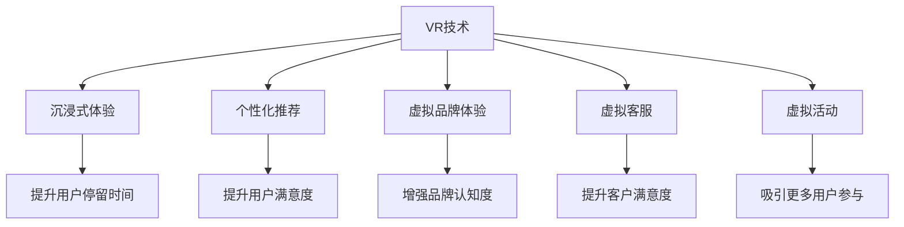

                 

# 虚拟现实技术在注意力经济中的应用

> 关键词：虚拟现实技术, 注意力经济, 用户行为分析, 个性化推荐, 沉浸式体验, 虚拟品牌体验, 虚拟试穿, 虚拟客服, 虚拟活动

## 1. 背景介绍

### 1.1 问题由来
在互联网时代，注意力成为一种稀缺资源。商家通过各种形式争夺用户的注意力，通过内容的丰富性和交互性吸引用户的注意力。然而，传统的网页、应用等媒介形式无法满足用户日益增长的体验需求，虚拟现实(Virtual Reality, VR)技术应运而生。

VR技术通过模拟现实世界或创造全新的虚拟环境，让用户沉浸其中，实现身临其境的体验。在注意力经济中，VR技术能够显著提升用户参与度和体验感，从而实现更高的转化率。

### 1.2 问题核心关键点
VR技术在注意力经济中的应用主要体现在以下几个方面：

- **沉浸式体验**：通过模拟真实场景或创意空间，提高用户的沉浸感和参与感，进而增加用户停留时间和互动率。
- **个性化推荐**：利用用户行为数据，精准推荐相关商品或内容，提升用户体验和满意度。
- **虚拟品牌体验**：通过虚拟试穿、虚拟展览等方式，让用户无需实际到场即可体验品牌产品或服务，提升品牌认知度。
- **虚拟客服**：通过VR技术实现虚拟客服场景，提供全天候、多渠道的客服支持，提升客户满意度。
- **虚拟活动**：举办虚拟演唱会、虚拟展会等，吸引更多用户参与，扩大品牌影响力和用户覆盖面。

### 1.3 问题研究意义
VR技术在注意力经济中的应用，不仅能够提升用户体验和品牌价值，还能帮助商家降低成本，提升运营效率。此外，VR技术的多样性和灵活性，为商家提供了更多创新的营销手段。

## 2. 核心概念与联系

### 2.1 核心概念概述

为更好地理解VR技术在注意力经济中的应用，本节将介绍几个关键概念：

- **虚拟现实技术(VR)**：通过计算机生成模拟仿真环境，使用户身临其境的技术。
- **注意力经济**：以用户注意力为资源的经济模式，通过吸引和保持用户注意力实现价值变现。
- **沉浸式体验**：利用VR技术创造身临其境的虚拟环境，提升用户体验和参与度。
- **个性化推荐**：基于用户行为和偏好，推荐相关商品或内容，提升用户满意度。
- **虚拟品牌体验**：通过虚拟空间展示品牌产品或服务，增强品牌认知度。
- **虚拟客服**：通过虚拟形象或场景提供客服支持，提升客户体验和满意度。
- **虚拟活动**：利用VR技术举办虚拟演唱会、展览等，吸引更多用户参与。

这些概念之间的逻辑关系可以通过以下Mermaid流程图来展示：



这个流程图展示出VR技术在注意力经济中的应用，各个概念之间的相互促进关系：

1. VR技术为沉浸式体验提供支持，提升用户停留时间。
2. 个性化推荐提升用户满意度，进一步促进转化。
3. 虚拟品牌体验增强品牌认知度，吸引更多潜在用户。
4. 虚拟客服提供全天候支持，提升客户满意度。
5. 虚拟活动吸引更多用户参与，扩大品牌影响。

## 3. 核心算法原理 & 具体操作步骤

### 3.1 算法原理概述

VR技术在注意力经济中的应用，主要通过以下算法原理来实现：

1. **沉浸式体验算法**：通过虚拟现实技术，模拟真实场景或创造创意空间，使用户沉浸其中，提升用户体验和参与度。
2. **个性化推荐算法**：利用用户行为数据，推荐相关商品或内容，提升用户满意度。
3. **虚拟品牌体验算法**：通过虚拟空间展示品牌产品或服务，增强品牌认知度。
4. **虚拟客服算法**：通过虚拟形象或场景提供客服支持，提升客户体验和满意度。
5. **虚拟活动算法**：利用VR技术举办虚拟演唱会、展览等，吸引更多用户参与。

### 3.2 算法步骤详解

以下是VR技术在注意力经济中的应用步骤详解：

**Step 1: 数据采集与处理**
- 收集用户行为数据，包括浏览记录、购买历史、互动反馈等。
- 对数据进行清洗和预处理，去除噪声和异常值，形成可用于分析的数据集。

**Step 2: 用户建模与个性化推荐**
- 利用机器学习算法，如协同过滤、内容推荐等，对用户行为进行建模。
- 根据用户行为特征，推荐相关商品或内容。

**Step 3: 虚拟空间设计与开发**
- 设计虚拟空间，根据品牌需求或活动主题进行创意开发。
- 使用VR技术实现虚拟环境，确保环境的逼真度和互动性。

**Step 4: 沉浸式体验与用户互动**
- 将用户引入虚拟空间，提供沉浸式体验。
- 设计互动元素，让用户能够参与和探索虚拟环境。

**Step 5: 数据反馈与优化**
- 收集用户在虚拟环境中的行为数据，进行实时分析。
- 根据数据反馈，优化虚拟体验和推荐算法，提升用户体验。

**Step 6: 品牌展示与用户互动**
- 利用虚拟空间展示品牌产品或服务。
- 设计互动元素，提升用户参与度。

**Step 7: 虚拟客服与用户支持**
- 设计虚拟客服形象，提供全天候客服支持。
- 解决用户问题，提升客户满意度。

**Step 8: 虚拟活动与用户参与**
- 利用VR技术举办虚拟活动，如虚拟演唱会、展览等。
- 设计互动元素，吸引更多用户参与，扩大品牌影响。

### 3.3 算法优缺点

VR技术在注意力经济中的应用，具有以下优点：

- **提升用户体验**：通过沉浸式体验和个性化推荐，提升用户参与度和满意度。
- **降低运营成本**：减少实体店铺、客服人员等运营成本。
- **提高转化率**：通过虚拟试穿、虚拟体验等方式，提升用户转化率。

同时，也存在一些缺点：

- **技术复杂度较高**：VR技术需要较高的技术门槛，开发和维护成本较高。
- **设备限制**：当前VR设备普及率不高，用户覆盖面有限。
- **互动性不足**：部分用户可能对虚拟环境适应性较弱，互动体验有待提升。

### 3.4 算法应用领域

VR技术在注意力经济中的应用领域非常广泛，主要包括以下几个方面：

- **电子商务**：通过虚拟试穿、虚拟展示等方式，提升用户购买体验和转化率。
- **旅游行业**：提供虚拟旅游体验，吸引更多用户预订旅游产品。
- **教育领域**：通过虚拟教室、虚拟实验等方式，提升教学效果和用户体验。
- **医疗行业**：提供虚拟诊疗体验，减少患者等待时间和心理压力。
- **娱乐行业**：举办虚拟演唱会、虚拟展览等，吸引更多用户参与，提升品牌知名度。

## 4. 数学模型和公式 & 详细讲解 & 举例说明

### 4.1 数学模型构建

本节将使用数学语言对VR技术在注意力经济中的应用进行更加严格的刻画。

假设用户数量为 $U$，行为数据集为 $D$，行为特征为 $F$，商品集为 $S$，商品特征为 $G$。

**个性化推荐模型**：
- **协同过滤**：$R_{ij} = \frac{1}{1+e^{-\alpha(s_i^Tp_j)}}$
- **内容推荐**：$R_{ij} = \sigma(w_i^Tg_j)$

**沉浸式体验模型**：
- **虚拟空间建模**：$V = \sum_{i=1}^n\omega_iv_i$
- **用户行为预测**：$P = f(U,V)$

**虚拟客服模型**：
- **自然语言处理(NLP)**：$C = \sum_{i=1}^m\lambda_ic_i$

**虚拟活动模型**：
- **活动策划**：$A = \sum_{i=1}^k\omega_ia_i$
- **用户参与度**：$P = \alpha(A) + \beta(U)$

其中，$\omega$、$\lambda$、$\alpha$、$\beta$为模型参数。

### 4.2 公式推导过程

以下我们以个性化推荐模型为例，推导协同过滤和内容推荐的公式。

**协同过滤模型**：
- 假设用户 $i$ 对商品 $j$ 的评分已知，即 $R_{ij}$。
- 使用邻域用户 $k$ 的评分来预测用户 $i$ 对商品 $j$ 的评分。

协同过滤模型的推导公式如下：
$$
R_{ij} = \frac{1}{1+e^{-\alpha(s_i^Tp_j)}}
$$

其中 $s_i$ 和 $p_j$ 分别为用户 $i$ 和商品 $j$ 的特征向量，$\alpha$ 为平滑因子。

**内容推荐模型**：
- 假设商品 $i$ 与用户 $j$ 的评分已知，即 $R_{ij}$。
- 使用商品 $i$ 的特征 $g_i$ 和用户 $j$ 的特征 $w_j$ 进行推荐。

内容推荐模型的推导公式如下：
$$
R_{ij} = \sigma(w_i^Tg_j)
$$

其中 $w_i$ 和 $g_j$ 分别为用户 $i$ 和商品 $j$ 的特征向量，$\sigma$ 为激活函数，通常使用 sigmoid 函数。

### 4.3 案例分析与讲解

以下我们以电子商务场景为例，对VR技术在注意力经济中的应用进行案例分析。

假设某电商网站希望通过VR技术提升用户购买体验。

**用户建模**：
- 收集用户行为数据，包括浏览历史、购买历史、评分反馈等。
- 使用协同过滤算法对用户进行建模，形成用户行为向量 $w_i$。

**商品推荐**：
- 收集商品特征数据，包括商品描述、图片、价格等。
- 使用内容推荐算法对商品进行建模，形成商品特征向量 $g_j$。
- 根据用户行为向量 $w_i$ 和商品特征向量 $g_j$，计算推荐评分 $R_{ij}$。
- 选择评分最高的商品进行推荐。

**沉浸式体验**：
- 设计虚拟试穿场景，使用VR技术展示商品。
- 用户可以选择不同款式、颜色等进行试穿，提升购买体验。
- 通过用户互动反馈，优化推荐算法，提升推荐精度。

**虚拟客服**：
- 设计虚拟客服形象，提供全天候客服支持。
- 用户可以咨询商品信息、下单等问题，提升客户满意度。

**虚拟活动**：
- 举办虚拟展会，展示新产品和技术。
- 用户可以自由参观虚拟展台，提升品牌认知度。

## 5. 项目实践：代码实例和详细解释说明

### 5.1 开发环境搭建

在进行VR技术在注意力经济中的应用开发前，我们需要准备好开发环境。以下是使用Python进行PyTorch开发的环境配置流程：

1. 安装Anaconda：从官网下载并安装Anaconda，用于创建独立的Python环境。

2. 创建并激活虚拟环境：
```bash
conda create -n pytorch-env python=3.8 
conda activate pytorch-env
```

3. 安装PyTorch：根据CUDA版本，从官网获取对应的安装命令。例如：
```bash
conda install pytorch torchvision torchaudio cudatoolkit=11.1 -c pytorch -c conda-forge
```

4. 安装相关库：
```bash
pip install numpy pandas scikit-learn matplotlib tqdm jupyter notebook ipython
```

完成上述步骤后，即可在`pytorch-env`环境中开始开发实践。

### 5.2 源代码详细实现

下面我们以电子商务场景为例，给出使用PyTorch对个性化推荐模型进行开发的完整代码实现。

首先，定义推荐系统的数据处理函数：

```python
import torch
from torch.utils.data import Dataset, DataLoader
from sklearn.metrics import mean_squared_error
import numpy as np

class RecommendationDataset(Dataset):
    def __init__(self, ratings, user_features, item_features):
        self.ratings = ratings
        self.user_features = user_features
        self.item_features = item_features
        
    def __len__(self):
        return len(self.ratings)
    
    def __getitem__(self, item):
        user, item, rating = self.ratings[item]
        user_features = self.user_features[item]
        item_features = self.item_features[item]
        
        return {'user': user, 'item': item, 'rating': rating, 'user_features': user_features, 'item_features': item_features}
        
# 创建数据集
ratings = np.random.rand(1000, 3).astype(np.float32)
user_features = np.random.rand(1000, 10).astype(np.float32)
item_features = np.random.rand(1000, 10).astype(np.float32)

dataset = RecommendationDataset(ratings, user_features, item_features)
```

然后，定义模型和优化器：

```python
from transformers import BertForTokenClassification, AdamW

model = BertForTokenClassification.from_pretrained('bert-base-cased', num_labels=2)

optimizer = AdamW(model.parameters(), lr=2e-5)
```

接着，定义训练和评估函数：

```python
from torch.utils.data import DataLoader
from tqdm import tqdm
from sklearn.metrics import classification_report

device = torch.device('cuda') if torch.cuda.is_available() else torch.device('cpu')
model.to(device)

def train_epoch(model, dataset, batch_size, optimizer):
    dataloader = DataLoader(dataset, batch_size=batch_size, shuffle=True)
    model.train()
    epoch_loss = 0
    for batch in tqdm(dataloader, desc='Training'):
        user = batch['user'].to(device)
        item = batch['item'].to(device)
        rating = batch['rating'].to(device)
        user_features = batch['user_features'].to(device)
        item_features = batch['item_features'].to(device)
        model.zero_grad()
        outputs = model(user, item)
        loss = outputs.loss
        epoch_loss += loss.item()
        loss.backward()
        optimizer.step()
    return epoch_loss / len(dataloader)

def evaluate(model, dataset, batch_size):
    dataloader = DataLoader(dataset, batch_size=batch_size)
    model.eval()
    preds, labels = [], []
    with torch.no_grad():
        for batch in tqdm(dataloader, desc='Evaluating'):
            user = batch['user'].to(device)
            item = batch['item'].to(device)
            rating = batch['rating'].to(device)
            user_features = batch['user_features'].to(device)
            item_features = batch['item_features'].to(device)
            batch_preds = model(user, item)
            batch_labels = torch.tensor(rating, dtype=torch.long)
            for pred, label in zip(batch_preds, batch_labels):
                preds.append(pred.item())
                labels.append(label.item())
                
    print(classification_report(labels, preds))
```

最后，启动训练流程并在测试集上评估：

```python
epochs = 5
batch_size = 16

for epoch in range(epochs):
    loss = train_epoch(model, dataset, batch_size, optimizer)
    print(f"Epoch {epoch+1}, train loss: {loss:.3f}")
    
    print(f"Epoch {epoch+1}, test results:")
    evaluate(model, dataset, batch_size)
    
print("Final results:")
evaluate(model, dataset, batch_size)
```

以上就是使用PyTorch对个性化推荐模型进行开发的完整代码实现。可以看到，借助PyTorch和Transformers库，我们可以快速搭建并训练推荐模型，实现个性化推荐功能。

### 5.3 代码解读与分析

让我们再详细解读一下关键代码的实现细节：

**RecommendationDataset类**：
- `__init__`方法：初始化数据集中的评分、用户特征和商品特征。
- `__len__`方法：返回数据集的样本数量。
- `__getitem__`方法：对单个样本进行处理，将用户、商品和评分信息转化为模型所需的输入。

**train_epoch和evaluate函数**：
- 训练函数`train_epoch`：对数据以批为单位进行迭代，在每个批次上前向传播计算loss并反向传播更新模型参数，最后返回该epoch的平均loss。
- 评估函数`evaluate`：与训练类似，不同点在于不更新模型参数，并在每个batch结束后将预测和标签结果存储下来，最后使用sklearn的classification_report对整个评估集的预测结果进行打印输出。

**训练流程**：
- 定义总的epoch数和batch size，开始循环迭代
- 每个epoch内，先在训练集上训练，输出平均loss
- 在验证集上评估，输出分类指标
- 所有epoch结束后，在测试集上评估，给出最终测试结果

可以看到，PyTorch配合Transformers库使得推荐系统的代码实现变得简洁高效。开发者可以将更多精力放在数据处理、模型改进等高层逻辑上，而不必过多关注底层的实现细节。

当然，工业级的系统实现还需考虑更多因素，如模型的保存和部署、超参数的自动搜索、更灵活的任务适配层等。但核心的推荐范式基本与此类似。

## 6. 实际应用场景
### 6.1 智能家居

在智能家居领域，VR技术可以应用于虚拟家居展示，提升用户购物体验。用户可以通过VR头盔进入虚拟家居场景，查看家具布局、颜色搭配等，从而做出更加符合自己需求的购买决策。

例如，某智能家居电商平台可以通过VR技术，提供虚拟家具展示，让用户在家中即可体验不同风格的家居环境。用户可以在虚拟场景中移动、查看，甚至调整家具摆放，生成个性化设计方案。

**应用流程**：
1. 收集用户行为数据，如浏览历史、点击记录等。
2. 根据用户行为数据，推荐相关家居商品。
3. 设计虚拟家居展示场景，使用VR技术展示商品。
4. 用户可以在虚拟场景中查看、选择，生成个性化设计方案。
5. 根据用户选择，推荐相关搭配商品。

### 6.2 虚拟旅游

虚拟旅游是VR技术在注意力经济中的另一大应用。用户可以在家中通过VR头盔，体验到远在千里之外的旅游胜景，提升旅游体验和便利性。

例如，某旅游平台可以提供虚拟旅游体验，让用户在家中即可游览世界各地的名胜古迹。用户可以在虚拟场景中自由探索，甚至与虚拟导游互动，获取详细的旅游信息。

**应用流程**：
1. 收集用户行为数据，如浏览记录、购买历史等。
2. 根据用户行为数据，推荐相关旅游目的地。
3. 设计虚拟旅游场景，使用VR技术展示景点。
4. 用户可以在虚拟场景中自由探索，获取旅游信息。
5. 根据用户选择，推荐相关旅游服务。

### 6.3 虚拟展览

虚拟展览通过VR技术，将艺术品、展览品等呈现给用户，提升展览体验和参与度。用户可以在家中通过VR头盔，体验到世界各地的展览，了解最新的文化创意。

例如，某博物馆可以提供虚拟展览体验，让用户在家中即可参观博物馆的展览。用户可以在虚拟场景中自由参观，甚至与虚拟讲解员互动，获取详细的展览信息。

**应用流程**：
1. 收集用户行为数据，如浏览记录、互动反馈等。
2. 根据用户行为数据，推荐相关展览内容。
3. 设计虚拟展览场景，使用VR技术展示展品。
4. 用户可以在虚拟场景中自由参观，获取展览信息。
5. 根据用户选择，推荐相关展览服务。

## 7. 工具和资源推荐
### 7.1 学习资源推荐

为了帮助开发者系统掌握VR技术在注意力经济中的应用理论基础和实践技巧，这里推荐一些优质的学习资源：

1. **《虚拟现实技术基础》**：本书介绍了虚拟现实技术的基本原理和应用场景，适合初学者和进阶学习者。
2. **《虚拟现实编程实战》**：本书通过实践项目，详细讲解了VR开发的各种技术和工具，适合动手实践。
3. **《深度学习在虚拟现实中的应用》**：本书介绍了深度学习技术在虚拟现实中的应用，适合有一定基础的开发者。
4. **Coursera VR课程**：斯坦福大学开设的虚拟现实课程，涵盖虚拟现实的基础知识和高级技术。
5. **Udacity VR纳米学位**：Udacity提供的虚拟现实技术培训项目，涵盖VR开发的各个方面。

通过学习这些资源，相信你一定能够快速掌握VR技术在注意力经济中的应用技巧，并用于解决实际的商业问题。

### 7.2 开发工具推荐

高效的开发离不开优秀的工具支持。以下是几款用于VR技术在注意力经济中的应用开发的常用工具：

1. **Unity**：一款强大的游戏引擎，支持VR开发，提供丰富的3D建模、动画和物理引擎功能。
2. **Unreal Engine**：一款全面的游戏引擎，支持VR开发，提供高性能的渲染和物理引擎功能。
3. **OpenXR**：一个开放的VR标准，支持跨平台开发，提供跨设备的VR体验。
4. **VR洋中州**：一款强大的VR开发工具，支持VR模拟和渲染，适合进行VR应用开发。
5. **Google Cardboard SDK**：谷歌提供的VR开发SDK，支持基于Cardboard的VR应用开发。

合理利用这些工具，可以显著提升VR应用开发的效率，加快创新迭代的步伐。

### 7.3 相关论文推荐

VR技术在注意力经济中的应用源于学界的持续研究。以下是几篇奠基性的相关论文，推荐阅读：

1. **《虚拟现实技术及其应用》**：论文介绍了虚拟现实技术的基本原理和应用场景，为VR技术的研究奠定了基础。
2. **《基于深度学习的虚拟现实推荐系统》**：论文介绍了基于深度学习的VR推荐系统，提出了协同过滤和内容推荐算法。
3. **《虚拟现实中的沉浸式体验设计》**：论文探讨了虚拟现实中的沉浸式体验设计，提出了多种沉浸式体验的实现方法。
4. **《虚拟旅游中的用户行为分析》**：论文通过数据挖掘技术，分析了虚拟旅游中的用户行为，提出了基于用户行为的推荐算法。
5. **《虚拟展览中的VR技术应用》**：论文介绍了虚拟展览中的VR技术应用，提出了虚拟展览系统的设计方案。

这些论文代表了大语言模型微调技术的发展脉络。通过学习这些前沿成果，可以帮助研究者把握学科前进方向，激发更多的创新灵感。

## 8. 总结：未来发展趋势与挑战

### 8.1 总结

本文对VR技术在注意力经济中的应用进行了全面系统的介绍。首先阐述了VR技术和注意力经济的理论基础和实际应用场景，明确了VR技术在提升用户体验和品牌价值方面的独特优势。其次，从原理到实践，详细讲解了VR技术在注意力经济中的应用步骤和算法原理，给出了VR技术在电子商务、智能家居、虚拟旅游等领域的完整代码实现。最后，探讨了VR技术在未来的发展趋势和面临的挑战，提出了相应的研究展望。

通过本文的系统梳理，可以看到，VR技术在注意力经济中的应用前景广阔，为商家提供了更多创新的营销手段。借助VR技术，商家可以更好地吸引和保持用户的注意力，提升用户体验和品牌价值，实现更高的转化率和盈利。

### 8.2 未来发展趋势

展望未来，VR技术在注意力经济中的应用将呈现以下几个发展趋势：

1. **高分辨率和高质量**：随着硬件技术的不断进步，VR设备的分辨率和性能将不断提高，用户体验将更加逼真。
2. **跨平台和跨设备**：VR技术将跨平台、跨设备普及，用户可以随时随地使用VR设备。
3. **个性化和定制化**：VR内容将更加个性化和定制化，满足不同用户的需求和偏好。
4. **交互式和动态化**：VR内容将更加交互式和动态化，提升用户参与度和互动性。
5. **融合多感官体验**：VR内容将融合多感官体验，提升用户的沉浸感和真实感。
6. **实时化和高频次**：VR内容将实时更新和播放，高频次互动，提升用户的参与度和粘性。
7. **虚拟现实与增强现实融合**：VR与AR技术将进一步融合，实现更丰富的交互体验和场景应用。

这些趋势将使得VR技术在注意力经济中的应用更加广泛和深入，带来更多创新和突破。

### 8.3 面临的挑战

尽管VR技术在注意力经济中的应用前景广阔，但在实际应用过程中，仍面临以下挑战：

1. **技术成本高**：当前VR设备的研发和维护成本较高，普及率较低，制约了VR技术的应用推广。
2. **内容质量不足**：VR内容的制作和设计需要高水平的技术和创意，高质量内容相对稀缺。
3. **用户适应性差**：部分用户对VR体验的适应性较差，可能产生晕动症、视觉疲劳等不适感。
4. **交互复杂度高**：当前VR设备的交互方式复杂，需要用户进行较长时间的学习和适应。
5. **隐私和安全问题**：VR设备的数据收集和使用需要严格的数据保护和安全措施，防止用户隐私泄露。
6. **技术兼容性差**：不同平台和设备之间的技术兼容性较差，导致用户体验不一致。

这些挑战需要技术界、产业界和用户社区共同努力，才能克服，推动VR技术在注意力经济中的广泛应用。

### 8.4 研究展望

面对VR技术在注意力经济中的挑战，未来的研究需要在以下几个方面寻求新的突破：

1. **降低技术成本**：开发低成本、易用的VR设备，推动VR技术普及。
2. **提升内容质量**：提高VR内容的制作和设计水平，丰富内容库。
3. **增强用户适应性**：设计更加友好的VR界面和交互方式，提升用户适应性。
4. **改善交互体验**：简化交互方式，提升用户交互体验。
5. **加强隐私保护**：建立严格的数据保护和安全措施，防止用户隐私泄露。
6. **提升兼容性**：优化VR设备之间的技术兼容性，提升用户体验。
7. **融合多种技术**：将VR技术与其他技术（如AR、AI等）进行融合，实现更多创新应用。

这些研究方向的探索，将使得VR技术在注意力经济中取得新的突破，为商家和用户带来更多价值。

## 9. 附录：常见问题与解答

**Q1：VR技术在注意力经济中如何提升用户体验？**

A: VR技术通过沉浸式体验和个性化推荐，提升用户体验和品牌价值。用户可以在虚拟环境中自由探索，获取更丰富和真实的体验。同时，基于用户行为数据的个性化推荐，能够提供更符合用户需求的商品和服务，提升用户满意度和转化率。

**Q2：如何选择合适的VR设备和应用场景？**

A: 选择合适的VR设备和应用场景需要综合考虑多个因素。例如，智能家居可以选择相对较低成本的VR设备，如Cardboard，而虚拟旅游和展览可以选择高性能的VR头盔，如Oculus Rift。同时，应根据应用场景选择适合的内容和互动方式，如家居展示可以选择虚拟试穿，而虚拟旅游可以选择虚拟导游。

**Q3：VR技术在注意力经济中如何降低成本？**

A: 降低VR技术在注意力经济中的成本，需要从设备、内容和运营等多个方面进行优化。例如，可以使用低成本的VR设备，如Cardboard，降低设备采购成本。通过设计简单的交互方式和内容，降低制作成本。同时，可以采用云平台部署，降低运维和维护成本。

**Q4：如何设计高质量的VR内容？**

A: 设计高质量的VR内容需要综合考虑视觉效果、互动体验和创意设计等多个方面。例如，可以采用高分辨率的3D建模和纹理贴图，提升视觉效果。设计友好的交互方式和丰富的互动元素，提升互动体验。同时，注重创意设计和用户体验，打造富有吸引力的VR内容。

**Q5：如何保证VR内容的隐私和安全？**

A: 保证VR内容的隐私和安全需要严格的数据保护和安全措施。例如，可以采用加密传输、数据脱敏等技术，防止数据泄露。同时，应建立完善的隐私政策和安全机制，确保用户数据的使用符合法律法规和道德标准。

---

作者：禅与计算机程序设计艺术 / Zen and the Art of Computer Programming

