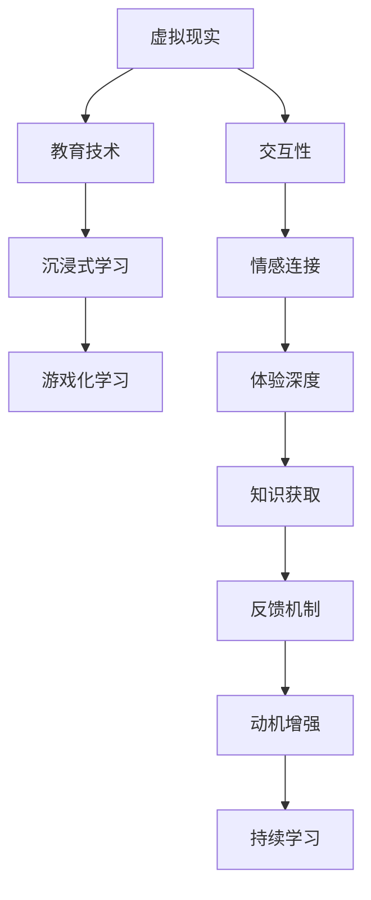

                 

# 虚拟现实教育创业：沉浸式学习体验

## 1. 背景介绍

在数字化教育的浪潮中，虚拟现实(VR)技术以其沉浸式、交互性强、真实感高等特点，成为教育领域的重要创新方向。VR教育创业正逐渐成为全球教育产业的新焦点。本文将深入探讨VR教育创业的现状、核心概念、关键技术，以及面临的挑战与未来发展方向。

## 2. 核心概念与联系

### 2.1 核心概念概述

VR教育创业涉及一系列核心概念，包括虚拟现实、教育技术、沉浸式学习、游戏化学习等。

- **虚拟现实**：通过计算机生成逼真的三维环境，使用户能够身临其境地体验到虚拟世界。

- **教育技术**：利用信息技术手段，优化教育过程、提升教育效果。

- **沉浸式学习**：通过构建身临其境的学习环境，让学生在真实情境中主动探索和构建知识。

- **游戏化学习**：利用游戏化元素，如积分、奖励、竞争等，增强学习的趣味性和参与度。

这些概念之间存在密切联系，共同构建了VR教育创业的技术框架。

### 2.2 核心概念原理和架构的 Mermaid 流程图



这个流程图展示了虚拟现实、教育技术、沉浸式学习、游戏化学习等概念之间的联系与互动。

## 3. 核心算法原理 & 具体操作步骤

### 3.1 算法原理概述

VR教育创业的核心算法原理主要包括以下几个方面：

- **虚拟现实技术**：通过计算机图形学、三维建模、动态仿真等技术，构建逼真的虚拟环境。

- **交互技术**：利用手势识别、空间定位、触觉反馈等技术，实现用户与虚拟环境的互动。

- **沉浸式学习模型**：设计合适的学习情境和任务，引导学生在虚拟环境中自主学习。

- **游戏化设计**：引入游戏元素，激发学生学习兴趣，提升学习动力。

### 3.2 算法步骤详解

VR教育创业的具体操作步骤如下：

1. **需求分析**：明确教育目标、学习内容、用户群体等，设计教育场景和任务。

2. **环境构建**：使用三维建模工具，构建虚拟教育环境，包括教室、实验室、图书馆等。

3. **内容开发**：开发教育内容，如课程讲解、实验模拟、案例分析等，并融入互动和游戏化元素。

4. **技术实现**：实现虚拟现实体验，包括三维渲染、空间定位、手势识别等技术。

5. **用户体验优化**：通过用户反馈，不断优化虚拟环境的体验效果。

6. **平台部署**：将教育应用部署到VR头盔、PC、移动设备等平台上，提供多渠道的体验。

### 3.3 算法优缺点

**优点**：

- 沉浸式学习体验，能够激发学生的主动探索和深度思考。
- 多感官互动，提升学习的趣味性和参与度。
- 虚拟实验、模拟场景等，能够提供安全、高效的教学环境。

**缺点**：

- 技术门槛高，需要专业技术和设备支持。
- 用户群体有限，缺乏广泛的应用基础。
- 设备成本高，推广应用存在经济障碍。

### 3.4 算法应用领域

VR教育创业主要应用于以下领域：

- **基础教育**：如虚拟实验室、语言学习、数学教学等。

- **高等教育**：如虚拟实习、远程教育、专业技能训练等。

- **职业培训**：如虚拟仿真、安全培训、模拟实战等。

- **成人教育**：如职业提升、技能再教育、终身学习等。

## 4. 数学模型和公式 & 详细讲解 & 举例说明

### 4.1 数学模型构建

VR教育创业的数学模型主要涉及虚拟现实环境的建模和用户行为建模。

**虚拟现实环境建模**：
假设虚拟环境由三维坐标系$(x, y, z)$表示，每个点的位置由$(x, y, z)$和颜色$(c_x, c_y, c_z)$确定。

**用户行为建模**：
用户的位置和姿态由三维坐标系$(x, y, z)$和角度$(\theta_x, \theta_y, \theta_z)$描述，其行为可以被建模为一系列的姿态变化序列。

### 4.2 公式推导过程

**虚拟环境建模公式**：
$$
(x_i, y_i, z_i) = (x_0 + \Delta_x, y_0 + \Delta_y, z_0 + \Delta_z)
$$
其中，$(x_0, y_0, z_0)$为起始位置，$(\Delta_x, \Delta_y, \Delta_z)$为位移。

**用户行为建模公式**：
$$
\theta_i = \theta_0 + \Delta\theta_i
$$
其中，$\theta_0$为起始角度，$\Delta\theta_i$为姿态变化角度。

### 4.3 案例分析与讲解

以虚拟实验室为例，分析其数学模型和公式：

**虚拟环境建模**：
- 实验室由多个设备组成，每个设备的位置和颜色可以表示为$(x, y, z, c_x, c_y, c_z)$。

**用户行为建模**：
- 用户进行实验操作，其姿态变化可以表示为一系列角度变化，如拿起设备、操作设备、放下设备等。

## 5. 项目实践：代码实例和详细解释说明

### 5.1 开发环境搭建

搭建VR教育创业项目开发环境主要涉及以下几个步骤：

1. **硬件设备**：选择适合的VR头盔、手柄等硬件设备。

2. **软件开发环境**：安装VR软件开发工具，如Unity、Unreal Engine等。

3. **编程语言**：选择C#、C++等适合VR开发的编程语言。

4. **开发平台**：选择Unity、Unreal Engine等开发平台，进行场景搭建和内容开发。

### 5.2 源代码详细实现

以下是Unity平台下VR教育创业项目开发的代码实现示例：

**场景搭建**：
```csharp
using UnityEngine;

public class SceneLoader : MonoBehaviour
{
    public GameObject[] scenes;

    void Start()
    {
        Random.Range(0, scenes.Length);
        scenes[Random.Range(0, scenes.Length)].transform.position = transform.position;
    }
}
```

**用户交互**：
```csharp
using UnityEngine;

public class UserInteractions : MonoBehaviour
{
    public GameObject[] objects;

    void Update()
    {
        float x = Input.GetAxis("Horizontal");
        float y = Input.GetAxis("Vertical");

        Vector3 move = new Vector3(x, 0, y);
        transform.position += move;

        foreach (var obj in objects)
        {
            obj.transform.Rotate(new Vector3(0, 90, 0) * Time.deltaTime);
        }
    }
}
```

**内容开发**：
```csharp
using UnityEngine;

public class ContentManager : MonoBehaviour
{
    public GameObject[] contents;

    void Update()
    {
        foreach (var content in contents)
        {
            content.SetActive(Time.deltaTime > 0);
        }
    }
}
```

### 5.3 代码解读与分析

- **场景搭建**：通过Unity的`SceneLoader`脚本，实现随机加载场景功能。

- **用户交互**：通过`UserInteractions`脚本，实现用户自由移动和对象旋转功能。

- **内容开发**：通过`ContentManager`脚本，实现内容的动态切换。

### 5.4 运行结果展示

运行上述代码后，可以在Unity编辑器中查看场景加载、用户交互和内容切换的实时效果。

## 6. 实际应用场景

### 6.1 教育实验

VR教育创业在教育实验中的应用非常广泛，如虚拟实验室、虚拟博物馆、虚拟考古等。这些实验不仅能够提供安全、高效的学习环境，还能激发学生的兴趣和主动性。

### 6.2 职业培训

在职业培训领域，VR教育创业可以提供虚拟仿真、模拟实战等场景，帮助学员掌握专业技能。例如，医疗行业的手术模拟、航空行业的飞行模拟器等。

### 6.3 成人教育

成人教育是VR教育创业的重要方向之一，通过虚拟课堂、虚拟图书馆、虚拟演讲厅等，提供灵活、自主的学习环境，满足不同人群的学习需求。

## 7. 工具和资源推荐

### 7.1 学习资源推荐

- **Unity官方文档**：Unity官网提供了详尽的文档和教程，帮助开发者掌握Unity的开发技能。

- **Unreal Engine官方文档**：Unreal Engine官网提供了详细的开发文档和教程，涵盖VR开发所需的各类技能。

- **VR教育创业课程**：如Coursera上的《Virtual Reality Development with Unity》等课程，深入浅出地介绍了VR教育创业的核心技术。

### 7.2 开发工具推荐

- **Unity**：广泛使用的VR开发引擎，提供丰富的开发工具和资源。

- **Unreal Engine**：强大的VR开发引擎，支持高性能渲染和物理仿真。

- **Vuforia**：增强现实引擎，与VR开发结合使用，可以实现更丰富的互动体验。

### 7.3 相关论文推荐

- **《虚拟现实在教育中的应用》**：探讨了VR在教育中的潜在价值和应用策略。

- **《虚拟现实技术的发展与应用》**：总结了VR技术的最新进展及其在教育中的实际应用案例。

- **《游戏化学习理论》**：分析了游戏化学习的基本原理和实现方法。

## 8. 总结：未来发展趋势与挑战

### 8.1 研究成果总结

VR教育创业在教育技术、沉浸式学习、游戏化学习等领域取得了显著成果。通过VR技术，学生能够更加生动地体验和理解知识，提升学习效果。

### 8.2 未来发展趋势

未来，VR教育创业将呈现以下发展趋势：

- **技术融合**：VR技术与人工智能、物联网等技术的深度融合，将提升教育体验和效果。

- **内容丰富**：教育内容的不断丰富和更新，将满足更多教育场景的需求。

- **个性化学习**：通过数据分析和机器学习，实现个性化教育方案，提高学习效果。

### 8.3 面临的挑战

VR教育创业面临的挑战主要包括：

- **技术门槛高**：VR开发需要较高的技术门槛，需要具备三维建模、交互设计、渲染技术等技能。

- **设备成本高**：VR设备成本较高，限制了VR教育的普及。

- **内容制作复杂**：高质量的教育内容制作难度大，需要耗费大量时间和资源。

### 8.4 研究展望

未来，VR教育创业需要在技术、内容、市场等方面进行更多的探索和创新：

- **技术创新**：开发更高效、更沉浸的VR技术，降低设备成本，提高用户体验。

- **内容创新**：设计更多创新的教育内容，满足不同教育场景的需求。

- **市场推广**：通过多渠道营销和合作，扩大VR教育的应用范围。

总之，VR教育创业正处于快速发展期，面对诸多挑战，需要学界、业界共同努力，推动其在教育领域的应用和发展。

## 9. 附录：常见问题与解答

**Q1：VR教育创业的开发难度如何？**

A: VR教育创业的开发难度较高，需要具备三维建模、交互设计、渲染技术等技能。但是随着技术的成熟和开源工具的普及，开发门槛正在逐渐降低。

**Q2：VR教育创业的推广策略有哪些？**

A: VR教育创业的推广策略包括：

- **教育机构合作**：与学校、培训机构等教育机构合作，推广VR教育产品。

- **市场渠道拓展**：通过线上线下渠道，如App Store、Steam等平台，推广VR教育应用。

- **用户社区建设**：建立用户社区，吸引用户参与，提升产品知名度和用户黏性。

**Q3：VR教育创业的前景如何？**

A: VR教育创业前景广阔，但需要克服技术、市场、成本等多重挑战。随着技术的进步和市场的成熟，VR教育将逐步普及，为教育带来深刻变革。

---

作者：禅与计算机程序设计艺术 / Zen and the Art of Computer Programming

