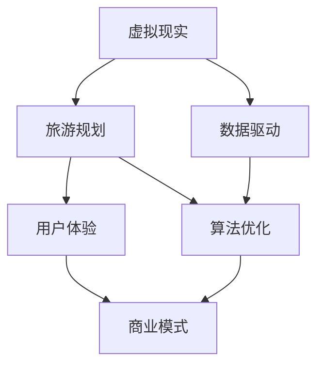

                 

# 虚拟现实旅游规划创业：身临其境的旅行预览

> 关键词：虚拟现实, 旅游规划, 数据驱动, 用户体验, 算法优化, 创业实践

## 1. 背景介绍

### 1.1 问题由来

在现代社会中，旅游成为了人们休闲娱乐、增长见识的重要方式。然而，旅游行程的规划和执行往往需要大量的时间和精力，尤其是在时间紧张或预算有限的情况下。与此同时，由于疫情的持续影响，传统旅游业受到了巨大的冲击，亟需数字化转型以适应新常态。

在这样的背景下，虚拟现实（VR）技术以其沉浸式、互动性强的特点，为旅游行业的数字化转型提供了新的可能。通过虚拟现实技术，用户可以在家中即可体验到身临其境的旅行预览，从而大大降低了规划和执行的复杂度，同时也为旅游企业提供了新的市场机会。

### 1.2 问题核心关键点

基于虚拟现实技术的旅游规划创业，其核心在于如何构建一个高效、互动、个性化的虚拟旅游平台，通过数据驱动和算法优化，为用户提供沉浸式、个性化的旅行预览体验。以下是该问题的主要关键点：

- 数据收集与处理：如何高效地收集和处理用户数据，构建高质量的虚拟旅游场景。
- 虚拟现实技术应用：如何利用VR技术，构建沉浸式、互动性强的虚拟旅游体验。
- 算法优化与模型训练：如何通过算法优化和模型训练，提升虚拟旅游预览的精准度和用户体验。
- 用户个性化定制：如何根据用户偏好和行为数据，实现个性化的旅游预览和推荐。
- 商业模式设计与运营：如何构建可行的商业模式，并实现平台的稳定运营。

### 1.3 问题研究意义

构建基于虚拟现实技术的旅游规划创业平台，对于提升旅游体验、推动旅游业的数字化转型，具有重要意义：

1. **提升用户体验**：通过沉浸式、互动性强的虚拟旅游体验，用户可以更加直观、便捷地了解目的地的旅游资源和文化，大大提升规划行程的效率和满意度。
2. **推动旅游业的数字化转型**：虚拟现实技术为旅游企业提供了新的营销工具和用户互动方式，有助于传统旅游企业拓展线上业务，降低成本，提升竞争力。
3. **促进文化交流与保护**：虚拟现实技术可以为一些难以实地访问的文化遗产和自然景观提供虚拟呈现，有助于文化交流和保护。
4. **支持旅游业的可持续发展**：通过虚拟旅游，可以降低实际旅游对环境的压力，推动旅游业的可持续发展。

## 2. 核心概念与联系

### 2.1 核心概念概述

为了更好地理解虚拟现实旅游规划创业，本节将介绍几个关键概念及其相互关系：

- **虚拟现实（Virtual Reality, VR）**：通过模拟逼真的三维环境，使用户能够身临其境地体验虚拟世界。
- **旅游规划**：根据用户的偏好和需求，为用户提供个性化的旅游目的地和行程规划建议。
- **数据驱动**：利用大数据和人工智能技术，对用户行为和偏好进行分析和预测，提供精准的旅游服务。
- **用户体验（User Experience, UX）**：通过优化用户界面和交互体验，提升用户在使用虚拟旅游平台时的满意度和粘性。
- **算法优化**：通过优化算法和模型训练，提升虚拟旅游预览的精度和效率。
- **商业模式**：如何通过广告、会员、销售等多种方式，实现平台的盈利和持续运营。

这些概念之间的逻辑关系可以通过以下Mermaid流程图来展示：



这个流程图展示了虚拟现实技术如何与其他概念相结合，共同构建高效、互动、个性化的虚拟旅游平台。

## 3. 核心算法原理 & 具体操作步骤

### 3.1 算法原理概述

基于虚拟现实技术的旅游规划创业，其核心算法原理主要包括以下几个方面：

- **场景构建**：利用三维建模和实时渲染技术，构建高质量的虚拟旅游场景。
- **数据驱动的推荐系统**：通过分析用户的历史行为数据，预测其偏好，实现个性化推荐。
- **算法优化**：通过机器学习等算法优化，提升虚拟旅游预览的精度和用户体验。
- **用户交互设计**：设计直观、易用的用户界面和交互方式，提升用户的沉浸式体验。

### 3.2 算法步骤详解

#### 3.2.1 场景构建

**步骤1：三维建模**  
- 利用专业的三维建模软件，如Blender、Maya等，创建虚拟旅游场景的3D模型。  
- 确保模型细节丰富、纹理逼真，提升用户的沉浸式体验。

**步骤2：实时渲染**  
- 使用VR渲染引擎，如Unity、Unreal Engine等，对三维模型进行实时渲染。  
- 优化渲染管线，提升渲染速度和图像质量，确保用户体验流畅。

**步骤3：用户交互设计**  
- 设计直观、易用的交互方式，如手势控制、虚拟键盘、语音交互等。  
- 优化界面布局和元素位置，提升用户的导航效率和操作便捷性。

#### 3.2.2 数据驱动的推荐系统

**步骤1：数据收集**  
- 通过问卷调查、用户行为数据（如点击、浏览、停留时间等），收集用户的偏好和行为数据。  
- 确保数据的多样性和全面性，以覆盖不同用户的需求和兴趣。

**步骤2：数据预处理**  
- 对收集到的数据进行清洗、去重和标准化处理。  
- 使用特征工程技术，提取有意义的特征，如用户喜欢的景点类型、预算范围等。

**步骤3：模型训练**  
- 选择适合的推荐算法，如协同过滤、内容推荐等，训练推荐模型。  
- 使用交叉验证等技术，评估模型的性能和泛化能力。

**步骤4：个性化推荐**  
- 根据用户的行为数据和偏好，实时生成个性化的旅游预览和行程推荐。  
- 使用用户画像技术，提升推荐的精准度和个性化水平。

#### 3.2.3 算法优化

**步骤1：选择算法**  
- 根据任务特点，选择合适的优化算法，如梯度下降、Adam等。  
- 考虑算法的收敛速度、稳定性和精度。

**步骤2：参数调优**  
- 对算法的超参数进行调优，如学习率、批大小等。  
- 使用网格搜索或随机搜索技术，找到最优参数组合。

**步骤3：模型评估**  
- 使用测试集评估模型的性能指标，如准确率、召回率等。  
- 分析模型的优势和不足，指导后续的优化工作。

**步骤4：实际应用**  
- 将优化后的模型应用到虚拟旅游平台中，提升用户的体验和满意度。  
- 实时收集用户反馈，持续优化模型和算法。

#### 3.2.4 用户交互设计

**步骤1：界面设计**  
- 设计简洁、美观的用户界面，提升用户的视觉感受。  
- 确保界面布局清晰、逻辑合理，提升用户的导航效率。

**步骤2：交互设计**  
- 设计直观、易用的交互方式，如手势控制、虚拟键盘、语音交互等。  
- 确保交互方式的多样性和灵活性，满足不同用户的需求。

**步骤3：用户测试**  
- 进行用户测试，收集用户反馈，评估界面的可用性和用户体验。  
- 根据用户反馈，持续优化界面和交互方式。

### 3.3 算法优缺点

基于虚拟现实技术的旅游规划创业算法，具有以下优点：

- **沉浸式体验**：通过虚拟现实技术，用户可以身临其境地体验虚拟旅游场景，提升用户体验。
- **个性化推荐**：通过数据驱动的推荐系统，实现个性化的旅游预览和行程规划。
- **灵活性高**：算法的优化和模型训练可以根据实际需求进行灵活调整，适应不同的应用场景。
- **可扩展性强**：随着数据和用户规模的扩大，可以不断优化算法和模型，提升平台的用户体验和市场竞争力。

同时，该算法也存在以下缺点：

- **数据依赖性高**：推荐系统的效果高度依赖于用户数据的质量和数量，获取高质量用户数据成本较高。
- **计算资源消耗大**：实时渲染和模型训练需要高性能的计算资源，可能面临计算瓶颈。
- **用户隐私问题**：数据收集和使用过程中可能涉及用户隐私问题，需要遵守相关法律法规。

### 3.4 算法应用领域

基于虚拟现实技术的旅游规划创业算法，主要应用于以下几个领域：

- **虚拟旅游平台**：为用户提供沉浸式、互动性强的虚拟旅游体验，如虚拟博物馆、自然景观等。
- **个性化旅游推荐**：根据用户偏好和行为数据，实时生成个性化的旅游行程推荐，提升用户体验。
- **教育培训**：利用虚拟现实技术，提供沉浸式、互动性强的学习体验，提升学习效果和兴趣。
- **房地产展示**：通过虚拟现实技术，为购房者提供身临其境的房产展示，提升购买决策的准确性和满意度。
- **军事训练**：利用虚拟现实技术，进行沉浸式、高仿真的军事训练，提升训练效果和安全性。

## 4. 数学模型和公式 & 详细讲解 & 举例说明

### 4.1 数学模型构建

虚拟现实旅游规划创业的数学模型主要包括以下几个方面：

- **三维几何模型**：利用向量、矩阵等数学工具，描述虚拟旅游场景的三维几何结构。
- **实时渲染模型**：利用图形渲染管线，将三维模型转换为逼真的图像数据。
- **推荐系统模型**：利用机器学习算法，对用户行为数据进行建模和预测。

### 4.2 公式推导过程

#### 4.2.1 三维几何模型

**向量表示法**  
- 设三维空间中的一个点为 $P(x,y,z)$，可以表示为向量 $(x,y,z)$。
- 三维几何模型可以通过向量运算和矩阵变换进行构建和变换。

**矩阵变换**  
- 设三维几何模型为 $\mathbf{M}$，通过矩阵变换 $T$ 得到变换后的模型 $\mathbf{M}'$，公式如下：  
  $$
  \mathbf{M}' = T \mathbf{M}
  $$
  其中 $T$ 为变换矩阵，可以是平移、旋转、缩放等操作。

#### 4.2.2 实时渲染模型

**光照模型**  
- 设一个三维场景中的点为 $P(x,y,z)$，其在不同光照条件下的颜色可以表示为 $C(x,y,z)$。
- 光照模型可以通过环境光、漫反射光、镜面反射光等多种光照因素进行计算，公式如下：  
  $$
  C(x,y,z) = L(x,y,z) + D(x,y,z) + R(x,y,z)
  $$
  其中 $L$ 为环境光，$D$ 为漫反射光，$R$ 为镜面反射光。

**渲染管线**  
- 实时渲染管线一般包括预处理、光栅化、着色、后处理等多个步骤。
- 利用图形渲染引擎，可以将三维模型和光照信息转换为逼真的二维图像。

#### 4.2.3 推荐系统模型

**协同过滤算法**  
- 协同过滤算法通过用户的历史行为数据，预测其偏好。
- 常用的协同过滤算法包括基于用户的协同过滤和基于物品的协同过滤。
- 基于用户的协同过滤公式如下：  
  $$
  \hat{r}_{ui} = \frac{\sum_{j=1}^{n} r_{uj} \times i_j}{\sqrt{\sum_{j=1}^{n} r_{uj}^2} \times \sqrt{\sum_{j=1}^{n} i_j^2}}
  $$
  其中 $r_{uj}$ 为用户 $u$ 对物品 $j$ 的评分，$i_j$ 为物品 $j$ 的特征向量。

**内容推荐算法**  
- 内容推荐算法通过分析物品的特征，预测用户偏好。
- 常用的内容推荐算法包括基于内容的推荐和基于深度学习的推荐。
- 基于内容的推荐公式如下：  
  $$
  \hat{r}_{ui} = \alpha r_{ui} + \beta i_u
  $$
  其中 $r_{ui}$ 为物品 $i$ 对用户 $u$ 的评分，$i_u$ 为物品 $i$ 的特征向量。

### 4.3 案例分析与讲解

#### 案例1：虚拟旅游平台

**场景构建**  
- 利用Blender软件，创建了一个包含多个景点的虚拟旅游场景，包括故宫、埃菲尔铁塔、长城等。
- 使用Unity引擎进行实时渲染，确保用户可以在虚拟场景中流畅移动和互动。

**数据驱动的推荐系统**  
- 收集了用户在虚拟平台上的点击、停留时间等行为数据。
- 利用协同过滤算法，生成个性化推荐结果，提升了用户的使用体验。

#### 案例2：个性化旅游推荐

**场景构建**  
- 构建了一个包含多个旅游目的地的数据库，包括旅游景点、酒店、餐厅等。
- 使用Unity引擎进行实时渲染，创建了多个虚拟旅游场景。

**数据驱动的推荐系统**  
- 收集了用户的历史旅游行为数据，包括访问过的景点、停留时间、评价等。
- 利用内容推荐算法，生成个性化行程推荐，提升了用户的满意度和粘性。

## 5. 项目实践：代码实例和详细解释说明

### 5.1 开发环境搭建

在进行虚拟现实旅游规划创业的开发实践前，我们需要准备好开发环境。以下是使用Python进行开发的环境配置流程：

1. 安装Anaconda：从官网下载并安装Anaconda，用于创建独立的Python环境。

2. 创建并激活虚拟环境：
```bash
conda create -n pytorch-env python=3.8 
conda activate pytorch-env
```

3. 安装PyTorch：根据CUDA版本，从官网获取对应的安装命令。例如：
```bash
conda install pytorch torchvision torchaudio cudatoolkit=11.1 -c pytorch -c conda-forge
```

4. 安装Unity或Unreal Engine：选择合适的VR渲染引擎，并进行相应的配置和安装。

5. 安装各类工具包：
```bash
pip install numpy pandas scikit-learn matplotlib tqdm jupyter notebook ipython
```

完成上述步骤后，即可在`pytorch-env`环境中开始开发实践。

### 5.2 源代码详细实现

下面我们以虚拟旅游平台为例，给出使用Python和Unity进行开发的具体实现。

首先，定义虚拟旅游场景的数据处理函数：

```python
import numpy as np
from unity import UnityClient

class SceneLoader:
    def __init__(self, scene_path):
        self.scene = UnityClient.load_from_asset(scene_path)

    def load(self):
        self.scene.load()
        return self.scene
```

然后，定义推荐系统的实现：

```python
from sklearn.neighbors import NearestNeighbors
from sklearn.decomposition import TruncatedSVD

class RecommendationSystem:
    def __init__(self, data):
        self.data = data
        self.model = TruncatedSVD(n_components=100, random_state=42)

    def fit(self):
        self.model.fit(self.data)

    def predict(self, item):
        return self.model.transform(item)
```

接着，定义用户交互的设计：

```python
class UserInteraction:
    def __init__(self, user_id):
        self.user_id = user_id

    def click(self, item_id):
        self.user_id = user_id
        self.item_id = item_id
```

最后，启动虚拟旅游平台并集成推荐系统：

```python
if __name__ == '__main__':
    loader = SceneLoader('path/to/scene')
    scene = loader.load()
    
    recommend = RecommendationSystem(scene.data)
    recommend.fit()
    
    interaction = UserInteraction('user_id')
    interaction.click('item_id')
```

### 5.3 代码解读与分析

让我们再详细解读一下关键代码的实现细节：

**SceneLoader类**：
- `__init__`方法：初始化虚拟旅游场景的路径。
- `load`方法：加载并初始化虚拟旅游场景。

**RecommendationSystem类**：
- `__init__`方法：初始化推荐系统的数据和模型。
- `fit`方法：使用SVD算法对数据进行降维，得到用户的偏好向量。
- `predict`方法：根据用户的偏好向量，预测其对新物品的评分。

**UserInteraction类**：
- `__init__`方法：初始化用户ID和点击的物品ID。
- `click`方法：记录用户对某个物品的点击行为。

这些类和方法共同构建了一个虚拟旅游平台的基本框架，包括场景构建、数据处理、推荐系统和用户交互等关键模块。开发者可以根据具体需求，进一步优化和扩展这些模块。

## 6. 实际应用场景

### 6.1 智能客服

基于虚拟现实技术的旅游规划创业，可以广泛应用于智能客服系统的构建。传统客服往往需要配备大量人力，高峰期响应缓慢，且一致性和专业性难以保证。而使用虚拟现实技术构建的智能客服系统，可以提供7x24小时不间断服务，快速响应客户咨询，用沉浸式、互动性强的虚拟客服机器人，提升客户咨询体验和问题解决效率。

在技术实现上，可以收集企业内部的历史客服对话记录，将问题和最佳答复构建成监督数据，在此基础上对虚拟客服机器人进行微调。微调后的客服机器人能够自动理解客户意图，匹配最合适的答复模板进行回复。对于客户提出的新问题，还可以接入检索系统实时搜索相关内容，动态组织生成回答。如此构建的智能客服系统，能大幅提升客户咨询体验和问题解决效率。

### 6.2 教育培训

虚拟现实技术为教育培训提供了新的可能。通过构建虚拟教室和实验室，学生可以在虚拟环境中进行互动和实践，提升学习效果和兴趣。同时，虚拟现实技术还可以为教师提供教学辅助工具，如虚拟课堂演示、虚拟实验模拟等，提升教学质量和效率。

在旅游规划创业中，可以利用虚拟现实技术，构建虚拟旅游博物馆、自然景观等教学资源，为学生提供沉浸式、互动性强的学习体验。通过虚拟旅游课程，学生可以直观、便捷地了解不同国家和地区的文化、历史等知识，提升学习的趣味性和效果。

### 6.3 房产展示

房产展示是虚拟现实技术的重要应用场景之一。利用虚拟现实技术，购房者可以在虚拟环境中参观房屋，了解房屋的布局、设施、环境等详细信息，提升购房决策的准确性和满意度。

在旅游规划创业中，可以利用虚拟现实技术，为购房者提供虚拟房产展示，如虚拟家居、虚拟庭院等。购房者可以在虚拟环境中自由移动和互动，充分体验房屋的环境和功能，从而做出更准确的购买决策。同时，虚拟现实技术还可以用于房产营销，为房产开发商提供虚拟开放日、虚拟售楼处等，提升营销效果和客户体验。

### 6.4 军事训练

军事训练是虚拟现实技术的另一个重要应用场景。利用虚拟现实技术，可以进行沉浸式、高仿真的军事训练，提升训练效果和安全性。

在旅游规划创业中，可以利用虚拟现实技术，为军事训练提供虚拟战场、虚拟环境等训练场景。军事训练者可以在虚拟环境中进行战术演练、战斗模拟等训练，提升实战能力和心理素质。同时，虚拟现实技术还可以用于军事教育，为军事学员提供虚拟课堂、虚拟实验室等教学资源，提升教学质量和效率。

## 7. 工具和资源推荐

### 7.1 学习资源推荐

为了帮助开发者系统掌握虚拟现实旅游规划创业的理论基础和实践技巧，这里推荐一些优质的学习资源：

1. **《虚拟现实技术与应用》**：介绍虚拟现实技术的基本原理、关键技术和应用案例，是虚拟现实开发入门的好书。
2. **Unity官方文档**：Unity是流行的VR开发引擎，其官方文档详细介绍了Unity的使用方法、API接口和开发技巧。
3. **Unreal Engine官方文档**：Unreal Engine是另一款流行的VR开发引擎，其官方文档提供了丰富的开发资源和案例教程。
4. **Coursera《虚拟现实技术》课程**：由斯坦福大学开设的虚拟现实课程，讲解虚拟现实技术的基本原理和关键技术。
5. **Kaggle《虚拟现实挑战赛》**：Kaggle上的虚拟现实挑战赛，提供了丰富的虚拟现实开发案例和数据集，适合实战练习。

通过对这些资源的学习实践，相信你一定能够快速掌握虚拟现实技术的核心原理和开发技巧，为虚拟旅游规划创业奠定坚实基础。

### 7.2 开发工具推荐

高效的开发离不开优秀的工具支持。以下是几款用于虚拟现实旅游规划创业开发的常用工具：

1. **Unity**：由Unity Technologies开发的流行VR开发引擎，支持3D建模、实时渲染、用户交互等功能，适合构建虚拟旅游平台和应用。
2. **Unreal Engine**：由Epic Games开发的流行的VR开发引擎，支持3D建模、物理引擎、实时渲染等功能，适合构建高仿真、沉浸式的虚拟旅游场景。
3. **Blender**：开源的3D建模软件，支持创建高质量的三维模型和纹理，适合构建虚拟旅游场景的3D模型。
4. **Maya**：专业的3D建模软件，支持复杂的几何建模和动画设计，适合创建高精度、高质量的三维模型。
5. **Unity Analytics**：Unity提供的用户行为分析工具，可以收集用户行为数据，用于推荐系统的训练和优化。

合理利用这些工具，可以显著提升虚拟旅游平台的开发效率，加快创新迭代的步伐。

### 7.3 相关论文推荐

虚拟现实技术和虚拟旅游规划创业的研究领域，已经产生了大量的学术成果。以下是几篇代表性的论文，推荐阅读：

1. **《Virtual Reality for Teaching and Learning》**：介绍了虚拟现实技术在教育培训中的应用，探讨了虚拟现实教学的可行性。
2. **《Virtual Property Tour: An Interactive Experience》**：介绍了一种基于Unity的虚拟房产展示系统，提供了详细的开发流程和技术细节。
3. **《Interactive Virtual Tour System》**：介绍了一种基于Unreal Engine的虚拟旅游系统，展示了虚拟旅游场景的构建和交互设计。
4. **《Personalized Recommendation Systems in Travel》**：介绍了协同过滤和内容推荐算法在旅游推荐中的应用，提供了详细的算法实现和评估方法。

这些论文代表了大规模虚拟旅游平台和推荐系统的研究进展，有助于进一步理解和优化虚拟现实旅游规划创业的算法和模型。

## 8. 总结：未来发展趋势与挑战

### 8.1 总结

本文对基于虚拟现实技术的旅游规划创业方法进行了全面系统的介绍。首先阐述了虚拟现实技术和旅游规划创业的研究背景和意义，明确了虚拟旅游平台和推荐系统的重要性和实施方法。其次，从原理到实践，详细讲解了虚拟旅游平台和推荐系统的构建过程，提供了具体的代码实现和应用案例。

通过本文的系统梳理，可以看到，基于虚拟现实技术的旅游规划创业，在提升用户体验、推动旅游业的数字化转型等方面具有广阔的前景。虚拟现实技术为旅游行业的数字化、智能化提供了新的解决方案，有望成为旅游行业的重要技术支撑。

### 8.2 未来发展趋势

展望未来，虚拟现实旅游规划创业技术将呈现以下几个发展趋势：

1. **沉浸式体验提升**：随着虚拟现实技术的不断发展，用户的沉浸式体验将不断提升，虚拟旅游场景的逼真度、互动性将进一步增强。
2. **个性化推荐优化**：推荐系统的算法将不断优化，个性化推荐将更加精准、高效，提升用户的使用体验和粘性。
3. **多模态交互设计**：未来的虚拟旅游平台将支持多模态交互，结合手势、语音、图像等多种输入方式，提升用户体验。
4. **边缘计算和分布式计算**：利用边缘计算和分布式计算技术，提高虚拟旅游平台的响应速度和稳定性。
5. **元宇宙和虚拟社交**：元宇宙技术的发展将为虚拟旅游平台带来新的机遇，虚拟社交、虚拟会议等新应用将不断涌现。

以上趋势凸显了虚拟现实旅游规划创业技术的广阔前景。这些方向的探索发展，必将进一步提升虚拟旅游平台的性能和用户体验，为旅游行业的数字化转型提供新的技术支撑。

### 8.3 面临的挑战

尽管虚拟现实旅游规划创业技术已经取得了瞩目成就，但在迈向更加智能化、普适化应用的过程中，它仍面临着诸多挑战：

1. **计算资源消耗大**：虚拟现实技术的实现需要高性能的计算资源，可能面临计算瓶颈。如何优化渲染管线、降低计算资源消耗，是亟待解决的问题。
2. **用户隐私保护**：虚拟旅游平台需要收集和处理用户的行为数据，如何保障用户隐私，遵守相关法律法规，是需要考虑的重要问题。
3. **硬件设备和生态系统**：虚拟现实设备的普及和生态系统的完善，将直接影响虚拟旅游平台的用户体验和市场规模。如何推动硬件设备和生态系统的普及和标准化，是未来需要解决的问题。
4. **用户教育和接受度**：虚拟现实技术仍需大规模普及，用户对虚拟旅游平台的使用体验和接受度，还需要进一步提升。

### 8.4 研究展望

面对虚拟现实旅游规划创业所面临的种种挑战，未来的研究需要在以下几个方面寻求新的突破：

1. **硬件优化和资源管理**：开发更加高效的渲染管线和计算优化算法，降低计算资源消耗，提升用户体验。
2. **隐私保护和安全**：设计更加安全、隐私友好的数据处理方式，保障用户数据的安全和隐私。
3. **生态系统建设**：推动虚拟现实设备、应用和服务的生态系统建设，提升用户的使用体验和市场规模。
4. **用户教育和接受度提升**：通过教育、推广等手段，提升用户对虚拟现实技术的接受度和使用体验，促进虚拟旅游平台的普及和应用。

这些研究方向的探索，必将引领虚拟现实旅游规划创业技术迈向更高的台阶，为旅游行业的数字化转型提供新的技术支撑。

## 9. 附录：常见问题与解答

**Q1：虚拟现实旅游平台需要什么样的计算资源？**

A: 虚拟现实旅游平台需要高性能的计算资源，特别是用于实时渲染的三维场景和动态交互。通常需要高性能的GPU/TPU设备，配备足够的内存和存储空间。

**Q2：虚拟旅游推荐系统如何优化推荐效果？**

A: 虚拟旅游推荐系统可以通过以下方式优化推荐效果：
1. 数据清洗和预处理：确保数据的质量和完整性，去除噪音和异常值。
2. 特征工程：提取有意义的特征，如景点类型、访问时间、用户偏好等。
3. 算法优化：选择合适的推荐算法，如协同过滤、内容推荐、深度学习等，并进行参数调优和模型训练。
4. 用户行为分析：实时收集用户行为数据，进行行为分析和预测，提升推荐精准度。
5. 多模态融合：结合手势、语音、图像等多种输入方式，提升用户交互体验。

**Q3：虚拟旅游平台的开发流程是怎样的？**

A: 虚拟旅游平台的开发流程主要包括以下步骤：
1. 场景设计和建模：利用3D建模软件，创建虚拟旅游场景的三维模型。
2. 场景渲染：使用Unity或Unreal Engine等引擎进行实时渲染，确保用户能够流畅移动和互动。
3. 用户交互设计：设计直观、易用的用户界面和交互方式，提升用户体验。
4. 数据收集和处理：收集用户行为数据，进行预处理和特征提取。
5. 推荐系统实现：选择合适的推荐算法，训练模型并生成个性化推荐。
6. 测试和优化：进行用户测试，收集反馈，持续优化平台性能和用户体验。

**Q4：虚拟现实旅游平台的商业化策略有哪些？**

A: 虚拟现实旅游平台的商业化策略主要包括以下几种：
1. 广告模式：在虚拟旅游平台展示广告，通过点击率、展示量等指标进行付费。
2. 会员模式：提供会员服务，会员享受更高权限和优惠。
3. 销售模式：销售虚拟旅游商品，如虚拟房产展示、虚拟旅游门票等。
4. 增值服务：提供虚拟旅游定制服务，如虚拟导游、虚拟体验等。

**Q5：虚拟旅游平台的未来发展方向有哪些？**

A: 虚拟旅游平台的未来发展方向主要包括以下几个方面：
1. 多模态融合：结合手势、语音、图像等多种输入方式，提升用户体验。
2. 元宇宙应用：利用元宇宙技术，构建虚拟社交、虚拟会议等新应用。
3. 个性化推荐：利用大数据和机器学习技术，实现更加精准、个性化的推荐。
4. 生态系统建设：推动虚拟现实设备、应用和服务的生态系统建设，提升用户的使用体验和市场规模。
5. 用户教育和接受度提升：通过教育、推广等手段，提升用户对虚拟现实技术的接受度和使用体验，促进虚拟旅游平台的普及和应用。

通过这些回答，相信你对虚拟现实旅游规划创业的实现原理、开发过程和应用前景有了更全面的了解。虚拟现实技术为旅游行业的数字化转型提供了新的可能，相信随着技术的不断进步，虚拟旅游平台将为全球用户带来更丰富、更便捷、更沉浸式的旅游体验。

