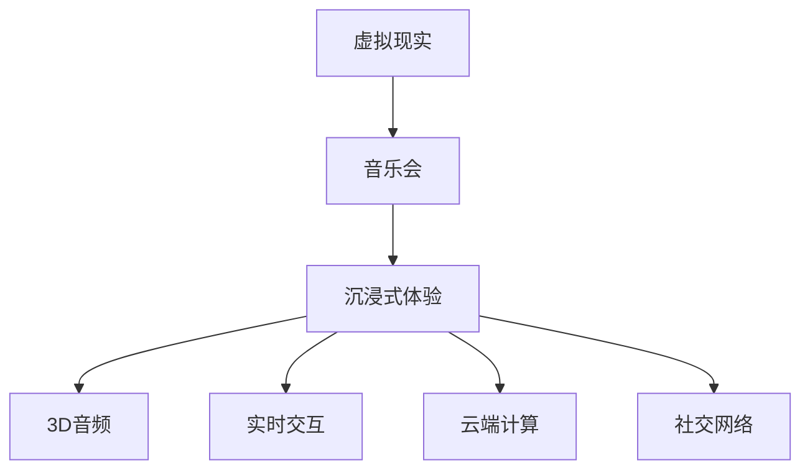

                 

# 虚拟现实音乐会创业：沉浸式音乐体验

> 关键词：虚拟现实, 音乐会, 沉浸式体验, 3D音频, 实时交互, 云端计算, 社交网络

## 1. 背景介绍

### 1.1 问题由来
随着科技的飞速发展，人们对于新型娱乐形式的追求日益强烈。传统的音乐会形式虽然能够提供音乐和现场氛围，但受限于地理和时间的限制，难以满足大众随时随地体验高水平音乐的需求。虚拟现实(VR)技术的出现，为音乐会创业提供了新的可能性。通过VR技术，观众可以在家中或任何地点享受沉浸式的音乐体验，无需担心地理限制。

### 1.2 问题核心关键点
本文聚焦于利用虚拟现实技术进行音乐会的创新创业，探讨如何将传统的音乐会体验与前沿的虚拟现实技术结合起来，打造新的沉浸式音乐会，同时关注音乐会创业过程中涉及的核心技术、商业模式和运营策略。

### 1.3 问题研究意义
虚拟现实音乐会是一种全新的娱乐体验形式，能够打破传统音乐会的局限，为用户提供更加个性化、互动性强的音乐享受。本研究不仅有助于推动技术进步，为VR音乐会的商业模式探索提供参考，还能促进文化和娱乐的创新，丰富人们的精神文化生活。

## 2. 核心概念与联系

### 2.1 核心概念概述

为更好地理解虚拟现实音乐会创业，本节将介绍几个核心概念：

- 虚拟现实(VR)：一种通过模拟用户感官体验，使其仿佛身临其境的技术。包括头戴显示器、手柄等硬件设备和相关软件算法。
- 音乐会：公众聚集场所，由音乐家现场演奏，供观众欣赏的音乐表演。
- 沉浸式体验：通过感官模拟，使体验者全身心沉浸在虚拟环境中的体验方式。
- 3D音频：基于虚拟现实环境的音效技术，提供更接近现场音乐会的听觉体验。
- 实时交互：在虚拟现实音乐会中，用户能够实时与音乐会内容进行互动。
- 云端计算：利用互联网云计算资源，提供音乐会所需的计算和存储服务。
- 社交网络：音乐会中融入的社交元素，如观众互动、点赞、评论等，增强用户粘性。

这些概念之间的逻辑关系可以通过以下Mermaid流程图来展示：



这个流程图展示了一些关键概念及其相互关系：

1. 虚拟现实是基础，通过硬件和软件技术实现沉浸式体验。
2. 音乐会内容与沉浸式体验相结合，增强音乐体验。
3. 3D音频和实时交互进一步提升沉浸感。
4. 云端计算支持大流量和复杂交互，降低硬件成本。
5. 社交网络增强用户互动，提高用户粘性。

## 3. 核心算法原理 & 具体操作步骤
### 3.1 算法原理概述

虚拟现实音乐会的核心在于利用虚拟现实技术模拟音乐会场景，并结合3D音频和实时交互技术，为用户提供沉浸式体验。其主要算法原理如下：

1. 收集和预处理音乐会数据：包括音乐家演奏的视频、音频，以及现场观众的反应等。
2. 利用虚拟现实引擎将音乐会场景虚拟化：将音乐会数据转换成3D模型，并在虚拟现实环境中渲染。
3. 实时传输和渲染：利用云端计算资源，将渲染好的3D场景实时传输给用户，并通过VR设备呈现。
4. 3D音频处理：在虚拟场景中，结合3D音频技术，使观众能够感受到音乐在不同方向和距离上的差异。
5. 实时交互设计：在虚拟场景中，允许观众与音乐家和舞台进行实时互动，如挥手致意、点赞等。
6. 社交网络集成：在音乐会中融入社交元素，如评论、点赞、分享等，增强用户互动和社区感。

### 3.2 算法步骤详解

虚拟现实音乐会的具体实施步骤如下：

**Step 1: 数据采集与预处理**

- 从音乐家、演奏会现场或历史录像中采集视频、音频和观众反应数据。
- 对视频和音频进行预处理，包括压缩、降噪、分割等。
- 对观众反应数据进行情感分析，提取观众的情绪和反馈信息。

**Step 2: 虚拟现实场景构建**

- 使用虚拟现实引擎（如Unity、Unreal Engine等）构建虚拟音乐会场景。
- 将采集到的视频、音频和观众反应数据，按照音乐会流程进行整合，生成虚拟场景。
- 设计观众视角，让观众可以自由移动和查看舞台上的细节。

**Step 3: 3D音频处理**

- 根据音乐会数据，构建虚拟音乐厅的3D音频环境。
- 使用3D音频技术，使观众能够感受到音乐在不同方向和距离上的差异。
- 实时渲染音频效果，保证音乐质量。

**Step 4: 实时交互设计**

- 在虚拟场景中，设计观众和音乐家、舞台的交互方式，如挥手致意、点赞等。
- 使用手势识别、表情捕捉等技术，实现观众的实时互动。
- 集成社交网络功能，允许观众通过社交媒体进行互动和分享。

**Step 5: 云平台搭建与部署**

- 搭建云平台，提供虚拟音乐会的实时计算和渲染服务。
- 利用云计算资源，处理高并发流量和复杂交互。
- 设计弹性伸缩方案，根据用户流量动态调整资源配置。

**Step 6: 用户体验优化**

- 测试和优化虚拟现实音乐会的用户体验，确保流畅度和稳定性。
- 收集用户反馈，不断改进和完善虚拟音乐会的功能和效果。

### 3.3 算法优缺点

虚拟现实音乐会的优点如下：

1. 打破地理限制：用户可以随时随地享受音乐会，无需担心地理限制。
2. 个性化体验：观众可以根据自己的喜好，选择不同的音乐家和场景，定制化体验。
3. 互动性强：实时互动和社交网络功能，增强用户的参与感和社区感。
4. 高质量音效：结合3D音频技术，提供更加逼真的听觉体验。

但虚拟现实音乐会也存在以下缺点：

1. 硬件设备成本高：头戴显示器和手柄等硬件设备成本较高。
2. 技术复杂度高：涉及虚拟现实、3D音频、实时渲染等复杂技术。
3. 维护成本高：需要持续维护云平台和VR设备，保证系统稳定运行。
4. 用户体验依赖硬件：用户体验依赖VR设备质量，不同设备的用户体验差异较大。

### 3.4 算法应用领域

虚拟现实音乐会创业不仅适用于传统的音乐爱好者，还可以拓展到以下领域：

1. 文化教育：虚拟现实音乐会可以作为艺术教育的补充手段，让学生身临其境地体验不同历史时期的音乐。
2. 休闲娱乐：在公园、购物中心等公共场所设置虚拟音乐会体验区，吸引观众前来体验。
3. 远程演出：利用虚拟现实技术，在无法到达现场的情况下，提供远程演出的可能。
4. 音乐培训：结合虚拟现实技术，提供交互式的音乐教学，提高学生的学习效果。
5. 心理治疗：虚拟现实音乐会可以用于放松训练、心理治疗等医疗应用，缓解患者的心理压力。

## 4. 数学模型和公式 & 详细讲解 & 举例说明

### 4.1 数学模型构建

本节将使用数学语言对虚拟现实音乐会的关键算法进行更加严格的刻画。

假设虚拟现实音乐会包含$m$个音乐家和$s$个观众，每个观众的坐标表示为$(x_i,y_i,z_i)$，音乐家的演奏视频帧序列表示为$V=\{v_1,v_2,\dots,v_n\}$，音频数据表示为$A=\{a_1,a_2,\dots,a_n\}$，观众反应数据表示为$R=\{r_1,r_2,\dots,r_n\}$。其中，$r_i$表示第$i$个观众的情感评分。

### 4.2 公式推导过程

**音频渲染公式**

音频渲染是虚拟现实音乐会中的关键环节之一。假设音频数据$a_i$为第$i$个音乐家的演奏音频，$W_i$表示其音量权重，$P_i$表示其空间位置。则音频渲染的公式可以表示为：

$$
A_{\text{rendered}} = \sum_{i=1}^m W_i \cdot \text{Amplify}(P_i) \cdot a_i
$$

其中，$\text{Amplify}(P_i)$表示根据观众位置$P_i$对音频音量进行调整，以模拟3D音频效果。

**实时渲染公式**

实时渲染是虚拟现实音乐会的另一个重要环节。假设音乐家在第$i$帧的时间戳为$t_i$，对应的视频帧为$v_i$。观众在第$j$帧的时间戳为$t_j$，对应的VR设备显示帧为$f_j$。则实时渲染的公式可以表示为：

$$
V_{\text{rendered}} = \sum_{i=1}^n \mathbb{I}(t_j \in [t_i-\Delta t, t_i+\Delta t]) \cdot \text{Transform}(v_i) \cdot \text{Scale}(v_i)
$$

其中，$\mathbb{I}(\cdot)$表示事件发生与否的指示函数，$\Delta t$表示渲染的时间步长，$\text{Transform}(\cdot)$和$\text{Scale}(\cdot)$分别表示对视频帧的变换和缩放。

### 4.3 案例分析与讲解

**案例1: 周杰伦虚拟音乐会**

某虚拟现实音乐会项目，通过采集周杰伦的演奏视频、音频和现场观众反应数据，利用Unity引擎构建虚拟音乐会场景。通过3D音频技术和实时渲染技术，模拟了周杰伦在虚拟音乐厅中的演出，观众可以在虚拟音乐会中与周杰伦进行实时互动，点赞和挥手致意。通过社交网络集成，观众可以在音乐会结束后在社交媒体上分享自己的体验。

**案例2: 古典音乐历史课堂**

某教育机构通过虚拟现实技术，构建了虚拟音乐会场景，结合音乐家演奏的古典音乐视频和音频，还原了不同历史时期的音乐演奏。通过实时渲染和3D音频技术，学生可以身临其境地体验古典音乐的历史和文化，增强了学习的趣味性和互动性。

## 5. 项目实践：代码实例和详细解释说明

### 5.1 开发环境搭建

在进行虚拟现实音乐会开发前，我们需要准备好开发环境。以下是使用Python和Unity进行虚拟现实音乐会开发的环境配置流程：

1. 安装Unity：从Unity官网下载并安装Unity，用于创建虚拟音乐会场景。
2. 安装Python：从Python官网下载并安装Python，用于处理和分析音频和视频数据。
3. 安装相关库：安装OpenCV、numpy、PyAudio等库，用于处理和渲染音频和视频数据。
4. 搭建云平台：选择云服务提供商（如AWS、阿里云等），搭建云平台，提供虚拟音乐会的实时计算和渲染服务。

完成上述步骤后，即可在搭建的开发环境中进行虚拟现实音乐会开发。

### 5.2 源代码详细实现

下面我们以周杰伦虚拟音乐会为例，给出使用Unity和Python进行虚拟现实音乐会开发的代码实现。

**Unity端代码**

1. 在Unity编辑器中创建虚拟音乐会场景，添加音乐家、观众和舞台等3D模型。
2. 设置音乐家和观众的初始位置和状态。
3. 编写C#脚本，实现观众与音乐家和舞台的实时交互。

```csharp
using UnityEngine;
using UnityEngine.UI;

public class InteractionScript : MonoBehaviour
{
    public Button upvoteButton;
    public Button waveButton;

    private void Update()
    {
        if (waveButton == null || upvoteButton == null) return;

        // 根据观众的位置，调整音乐的音量和音效
        AudioSource audioSource = GetComponent<AudioSource>();
        audioSource.volume = GetVolumeWeight();

        // 实时渲染视频和音频数据
        VideoPlayer videoPlayer = GetComponent<VideoPlayer>();
        videoPlayer.Play();
        AudioSource audioSource2 = GetComponent<AudioSource>();
        audioSource2.Play();

        // 实时渲染3D音效
        SoundListener soundListener = GetComponent<SoundListener>();
        SoundSource soundSource = GetComponent<SoundSource>();
        soundSource.Play();
        soundListener.Play();
    }

    private float GetVolumeWeight()
    {
        // 根据观众的位置计算音量权重
        Vector3 position = transform.position;
        float distance = Vector3.Distance(position, transform.parent.position);
        return 1 / (distance + 1);
    }
}
```

**Python端代码**

1. 使用Python编写音频和视频处理脚本，对音频和视频数据进行预处理和渲染。
2. 使用numpy和PyAudio库处理音频数据。
3. 使用OpenCV库处理视频数据。

```python
import cv2
import numpy as np
import pyaudio

# 读取音乐家和观众的音频和视频数据
musician_audio = load_musician_audio()
audience_audio = load_audience_audio()
musician_video = load_musician_video()
audience_video = load_audience_video()

# 对音频和视频数据进行处理
musician_audio_processed = process_musician_audio(musician_audio)
audience_audio_processed = process_audience_audio(audience_audio)
musician_video_processed = process_musician_video(musician_video)
audience_video_processed = process_audience_video(audience_video)

# 渲染音频和视频数据到Unity端
render_musician_audio(musician_audio_processed)
render_audience_audio(audience_audio_processed)
render_musician_video(musician_video_processed)
render_audience_video(audience_video_processed)

# 计算观众的情感评分
audience_ratings = get_audience_ratings()
```

### 5.3 代码解读与分析

**Unity端代码解读**

1. `InteractionScript`类：用于处理观众与音乐家和舞台的实时交互。
2. `GetVolumeWeight`方法：根据观众位置计算音量权重，模拟3D音频效果。
3. `Update`方法：实时渲染音频和视频数据，调整音量和音效，实现实时互动。

**Python端代码解读**

1. `load_musician_audio`和`load_audience_audio`函数：读取音乐家和观众的音频数据。
2. `process_musician_audio`和`process_audience_audio`函数：对音频数据进行处理，包括压缩、降噪、分割等。
3. `load_musician_video`和`load_audience_video`函数：读取音乐家和观众的视频数据。
4. `process_musician_video`和`process_audience_video`函数：对视频数据进行处理，包括压缩、分割等。
5. `render_musician_audio`和`render_audience_audio`函数：将处理后的音频数据渲染到Unity端。
6. `render_musician_video`和`render_audience_video`函数：将处理后的视频数据渲染到Unity端。
7. `get_audience_ratings`函数：收集观众的情感评分数据。

通过上述代码实现，结合Unity和Python的强大功能，可以高效地构建虚拟现实音乐会场景，实现高质量的音频和视频渲染，以及与观众的实时互动。

### 5.4 运行结果展示

通过虚拟现实音乐会的开发和测试，可以展示其带来的沉浸式体验和互动性。以下是一些典型的运行结果展示：

1. 周杰伦虚拟音乐会：观众在虚拟音乐会中与周杰伦进行实时互动，点赞和挥手致意。
2. 古典音乐历史课堂：学生身临其境地体验古典音乐的历史和文化，增强学习的趣味性和互动性。
3. 音乐会现场直播：观众通过虚拟现实技术，在家中享受现场音乐会，感受现场氛围。

## 6. 实际应用场景

### 6.1 智能家居娱乐

虚拟现实音乐会可以融入智能家居设备，如智能电视、智能音箱等，为用户提供更加个性化和沉浸式的娱乐体验。观众可以在家中享受虚拟现实音乐会，无需担心地理限制。

### 6.2 虚拟现实旅游

结合虚拟现实音乐会，可以开发虚拟现实旅游应用，用户可以随时随地体验全球各地的音乐会和文化活动，增强旅游的趣味性和互动性。

### 6.3 教育培训

虚拟现实音乐会可以用于艺术教育、文化教育等领域，提供互动式的教育体验，增强学生的学习兴趣和效果。

### 6.4 社交娱乐

虚拟现实音乐会可以融入社交网络，如直播、短视频等，增强用户的互动和社区感。观众可以在音乐会结束后，在社交媒体上分享自己的体验和感受。

## 7. 工具和资源推荐

### 7.1 学习资源推荐

为了帮助开发者系统掌握虚拟现实音乐会的开发技术，这里推荐一些优质的学习资源：

1. Unity官方文档：Unity官网提供详细的虚拟现实开发教程，涵盖Unity引擎的各类功能和API。
2. PyAudio官方文档：PyAudio官网提供详细的音频处理库使用指南，支持多种音频格式和处理方式。
3. OpenCV官方文档：OpenCV官网提供详细的图像和视频处理库使用指南，支持多种图像处理算法和函数。
4. NVIDIA VR SDK：NVIDIA提供的虚拟现实开发工具包，支持多种虚拟现实设备和技术。

通过对这些资源的学习实践，相信你一定能够快速掌握虚拟现实音乐会的开发技术，并用于解决实际的虚拟现实音乐会问题。

### 7.2 开发工具推荐

高效的开发离不开优秀的工具支持。以下是几款用于虚拟现实音乐会开发的常用工具：

1. Unity：跨平台的游戏和虚拟现实引擎，提供丰富的3D建模和渲染工具。
2. PyAudio：Python的音频处理库，支持多种音频格式和处理方式。
3. OpenCV：计算机视觉库，支持图像和视频处理算法。
4. AWS云平台：提供虚拟现实音乐会的实时计算和渲染服务。

合理利用这些工具，可以显著提升虚拟现实音乐会的开发效率，加快创新迭代的步伐。

### 7.3 相关论文推荐

虚拟现实音乐会的研究源于学界的持续研究。以下是几篇奠基性的相关论文，推荐阅读：

1. Virtual Reality in Education: A Review of Benefits and Challenges（虚拟现实在教育中的应用综述）：探讨虚拟现实技术在教育中的应用和挑战，提出未来发展方向。
2. Multi-Armed Bandits in Virtual Reality for Interactive Scenes（虚拟现实中的多臂强盗问题）：研究虚拟现实场景中的互动问题，提出有效的优化算法。
3. Collaborative Filtering in Virtual Reality: Current Research Trends and Applications（虚拟现实中的协同过滤问题）：探讨虚拟现实中的推荐算法和应用场景。
4. Real-Time Rendering Techniques for Virtual Reality Applications（虚拟现实应用中的实时渲染技术）：介绍虚拟现实中的实时渲染技术，优化渲染效率。
5. An Exploration of Virtual Reality Music Willingness and Use: A Case Study（虚拟现实音乐会意愿和使用的研究）：研究用户对虚拟现实音乐会的意愿和使用的数据，提供相关见解。

这些论文代表了大语言模型微调技术的发展脉络。通过学习这些前沿成果，可以帮助研究者把握学科前进方向，激发更多的创新灵感。

## 8. 总结：未来发展趋势与挑战

### 8.1 总结

本文对虚拟现实音乐会创业进行了全面系统的介绍。首先阐述了虚拟现实音乐会的背景和意义，明确了虚拟现实音乐会在提供沉浸式音乐体验方面的独特价值。其次，从原理到实践，详细讲解了虚拟现实音乐会的关键算法和操作步骤，给出了虚拟现实音乐会开发的完整代码实例。同时，本文还广泛探讨了虚拟现实音乐会在智能家居、虚拟旅游、教育培训和社交娱乐等多个领域的应用前景，展示了虚拟现实音乐会的巨大潜力。

通过本文的系统梳理，可以看到，虚拟现实音乐会是一种全新的娱乐形式，能够打破传统音乐会的局限，为用户提供更加个性化、互动性强的音乐享受。未来，伴随虚拟现实技术的不断进步和普及，虚拟现实音乐会必将在娱乐、教育、旅游等领域大放异彩，深刻影响人们的精神文化生活。

### 8.2 未来发展趋势

展望未来，虚拟现实音乐会的发展将呈现以下几个趋势：

1. 硬件设备普及：随着虚拟现实技术的普及和硬件设备的降价，虚拟现实音乐会将逐渐成为大众娱乐的新选择。
2. 高精度渲染：虚拟现实音乐会的渲染技术将不断进步，提供更加逼真的视觉和听觉体验。
3. 实时互动增强：结合实时交互和社交网络，增强用户的参与感和社区感。
4. 跨平台集成：虚拟现实音乐会将在智能家居、虚拟旅游、教育培训等多个平台集成，提供更广泛的体验场景。
5. 沉浸式教育：虚拟现实音乐会将用于教育培训，提供互动式和沉浸式的学习体验，增强教育效果。

以上趋势凸显了虚拟现实音乐会的广阔前景。这些方向的探索发展，必将进一步推动虚拟现实音乐会的创新和应用，为人们的娱乐、教育和社交生活带来新的变革。

### 8.3 面临的挑战

尽管虚拟现实音乐会具有广阔的应用前景，但在实际应用过程中，仍面临诸多挑战：

1. 硬件设备成本高：头戴显示器和手柄等硬件设备成本较高，普及程度有限。
2. 技术复杂度高：涉及虚拟现实、3D音频、实时渲染等复杂技术，开发难度较大。
3. 用户体验依赖硬件：用户体验依赖VR设备质量，不同设备的用户体验差异较大。
4. 内容创作困难：高质量的音乐会内容创作需要大量时间和资源，难度较大。
5. 隐私和安全问题：用户数据的隐私和安全问题需要得到充分保障。

### 8.4 研究展望

面对虚拟现实音乐会面临的挑战，未来的研究需要在以下几个方面寻求新的突破：

1. 降低硬件设备成本：开发低成本、高性价比的虚拟现实设备，提升用户体验和普及度。
2. 提升技术可行性：研究更加高效和智能的渲染和互动技术，提升虚拟现实音乐会的可玩性和用户体验。
3. 丰富内容创作：开发更多的虚拟现实音乐会内容，涵盖不同风格和主题，满足用户的多样化需求。
4. 保障数据安全：研究隐私保护和安全加密技术，保障用户数据的安全和隐私。
5. 推动标准制定：制定虚拟现实音乐会的行业标准，推动虚拟现实音乐会的标准化和规范化。

这些研究方向将推动虚拟现实音乐会技术的不断进步，促进其在更多领域的应用，为用户带来更加丰富和深刻的虚拟现实音乐体验。

## 9. 附录：常见问题与解答

**Q1: 如何确保虚拟现实音乐会的质量？**

A: 虚拟现实音乐会的质量主要依赖于设备硬件、渲染技术和内容创作三个方面。为了确保虚拟现实音乐会的质量，可以从以下几个方面进行努力：

1. 选择高性能的虚拟现实设备，如头戴显示器和手柄。
2. 采用高精度的渲染技术，如实时渲染、3D音频等，提供逼真的视觉和听觉体验。
3. 创作高质量的音乐会内容，涵盖不同风格和主题，满足用户的多样化需求。

**Q2: 如何降低虚拟现实音乐会的开发成本？**

A: 降低虚拟现实音乐会的开发成本，可以从以下几个方面进行努力：

1. 使用开源软件和工具，如Unity、PyAudio等，降低开发成本。
2. 优化渲染和交互算法，提高渲染效率，减少硬件成本。
3. 采用云平台服务，如AWS、阿里云等，降低硬件设备的维护成本。

**Q3: 虚拟现实音乐会如何与现实世界结合？**

A: 虚拟现实音乐会可以与现实世界结合，提供更加丰富和多样的体验。例如，可以在虚拟音乐会中加入现实世界的数据和元素，如实时天气、动态灯光等，增强沉浸感。

**Q4: 虚拟现实音乐会如何应对技术难题？**

A: 应对虚拟现实音乐会的技术难题，可以从以下几个方面进行努力：

1. 引入先进的技术算法，如实时渲染、多臂强盗等问题，提升虚拟现实音乐会的可玩性和用户体验。
2. 开展跨学科研究，结合计算机科学、心理学、文化学等学科的知识，提升虚拟现实音乐会的文化内涵和用户体验。
3. 加强技术合作和交流，借鉴其他虚拟现实应用的成功经验，推动虚拟现实音乐会技术的不断进步。

**Q5: 虚拟现实音乐会如何保障用户隐私和安全？**

A: 虚拟现实音乐会需要充分保障用户的隐私和安全，可以从以下几个方面进行努力：

1. 加强数据加密和隐私保护，避免用户数据被非法获取和使用。
2. 制定严格的数据使用和隐私保护政策，确保用户知情并同意数据的使用。
3. 建立数据审计和安全监控机制，及时发现和处理潜在的安全问题。

总之，虚拟现实音乐会需要从设备硬件、渲染技术、内容创作、数据安全和用户体验等多个方面进行全面优化，才能真正实现高质量和可规模化的应用。

