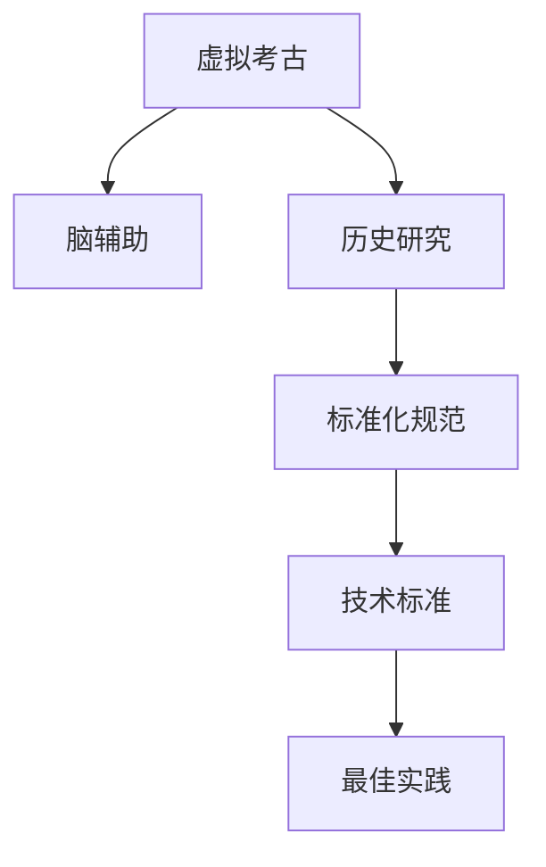

                 

# 虚拟考古技术标准:全球脑辅助的历史研究规范

> 关键词：虚拟考古,脑辅助,历史研究,标准化规范,技术标准

## 1. 背景介绍

### 1.1 问题由来

随着科技的进步，虚拟考古技术在历史研究领域的应用日益广泛。虚拟考古不仅能够帮助考古学家复原古代遗迹，还能挖掘和分析大量历史文献。然而，由于缺乏统一的标准和规范，不同研究团队采用的技术手段各异，导致研究结果难以比对，数据共享和复现性存在困难。

### 1.2 问题核心关键点

为解决这一问题，国际上提出了一套虚拟考古技术的标准化规范，旨在推动不同团队采用统一的流程和技术标准，提高研究结果的可比性和可复现性。该规范包括数据管理、模型构建、结果分析等环节的标准流程，以及相关的技术规范和最佳实践。

### 1.3 问题研究意义

制定虚拟考古技术标准，对提升历史研究的精度和效率具有重要意义：

1. **精度提升**：统一的规范和标准有助于提高研究结果的准确性和一致性，减少因技术手段差异带来的误差。
2. **效率提升**：标准化流程可以减少重复性工作，缩短研究周期，促进学术资源的共享和利用。
3. **数据共享**：统一的格式和协议便于不同研究团队间的数据交换和共享，加速科学发现。
4. **复现性提高**：标准的采用有利于研究结果的可复现，推动更多学者基于同一数据集进行后续研究。
5. **开放性加强**：标准化有助于推动研究成果的开放共享，促进跨领域、跨学科的研究合作。

## 2. 核心概念与联系

### 2.1 核心概念概述

为便于理解虚拟考古技术的标准化规范，本节将介绍几个关键概念及其相互联系：

- **虚拟考古**：利用计算机技术，如3D建模、数字重建、虚拟现实(VR)等，对古代遗迹进行复原和研究。
- **脑辅助考古**：借助脑机接口(Brain-Computer Interface, BCI)技术，通过脑波信号与虚拟环境交互，辅助考古学家进行虚拟考古。
- **历史研究**：通过考古发现、文献记录等资料，结合多学科知识，对人类历史进行研究和分析。
- **标准化规范**：为确保研究结果的可比性和可复现性，提出的统一的技术流程和技术标准。
- **技术标准**：在数据管理、模型构建、结果分析等环节，制定具体的技术规范和操作指南。
- **最佳实践**：基于多年实践经验总结出的高效、可靠的技术流程和策略。

这些概念之间的逻辑关系可以通过以下Mermaid流程图来展示：



这个流程图展示了虚拟考古技术各组件之间的联系：

1. 虚拟考古通过脑辅助技术辅助考古学家进行复原和研究。
2. 历史研究依赖虚拟考古技术复原和分析古代遗迹。
3. 标准化规范确保不同研究团队采用统一的技术流程和标准。
4. 技术标准细化规范，提供详细的操作指南和规范。
5. 最佳实践提供高效、可靠的技术流程和策略，促进技术应用。

## 3. 核心算法原理 & 具体操作步骤

### 3.1 算法原理概述

虚拟考古技术标准化规范的核心算法原理主要包括：

- **数据标准化**：确保不同数据源采用统一的格式和协议，便于数据交换和共享。
- **模型标准化**：制定模型构建、训练和评估的标准流程，提高模型的一致性和可复现性。
- **结果标准化**：定义结果输出的格式和标准，便于不同研究团队对结果进行比对和分析。

这些标准化的算法流程，旨在通过统一的规范和最佳实践，推动虚拟考古技术的普及和应用。

### 3.2 算法步骤详解

虚拟考古技术标准化规范的具体步骤包括：

**Step 1: 数据标准化**

- 收集并整理各类考古数据，如3D模型、历史文献、考古报告等。
- 制定统一的数据格式和协议，确保数据的一致性和可互换性。
- 使用数据清洗工具处理异常值和噪声，提高数据质量。

**Step 2: 模型标准化**

- 选择合适的3D建模软件，如Blender、Maya等，进行古代遗迹的虚拟重建。
- 定义模型构建、训练和评估的标准流程，确保模型的一致性和可复现性。
- 使用标准化的评价指标，如准确率、召回率、F1-score等，评估模型的性能。

**Step 3: 结果标准化**

- 定义标准化的输出格式，如3D模型、文本报告等，确保结果的一致性和可比较性。
- 使用标准化的分析和报告工具，对研究结果进行记录和呈现。
- 制定结果共享协议，便于不同团队间的数据交换和合作。

**Step 4: 最佳实践总结**

- 总结并推广高效、可靠的技术流程和策略，如模型参数调优、数据增强、对抗训练等。
- 分享成功案例和经验教训，促进技术社区的共同进步。
- 定期更新规范和标准，适应新的技术发展和应用需求。

### 3.3 算法优缺点

虚拟考古技术标准化规范具有以下优点：

1. **一致性提高**：统一的技术标准减少了因技术手段差异带来的误差，提高了研究结果的一致性。
2. **复现性增强**：标准化的流程和协议便于不同团队间的结果复现，加速科学发现。
3. **效率提升**：统一的数据格式和模型构建流程，减少了重复性工作，提高了研究效率。
4. **数据共享加强**：标准化的数据和结果格式，便于不同团队的数据交换和共享。
5. **可扩展性良好**：标准化的规范易于扩展和更新，适应新的技术发展和应用需求。

同时，该规范也存在一些局限性：

1. **标准化成本高**：制定和实施标准化规范需要投入大量时间和资源。
2. **灵活性受限**：统一的标准可能会限制个别研究团队的技术创新。
3. **技术更新快**：技术发展迅速，标准更新需要及时跟进，保持最新。

### 3.4 算法应用领域

虚拟考古技术标准化规范主要应用于以下领域：

1. **古遗址虚拟重建**：通过3D建模技术，复原古代遗迹，帮助考古学家进行遗址研究。
2. **历史文献数字化**：将历史文献转化为数字格式，便于检索和分析。
3. **虚拟考古交互**：利用脑辅助技术，进行虚拟考古挖掘和分析，提升考古效率。
4. **跨学科合作**：通过标准化的规范，促进历史学、计算机科学、考古学等多学科的合作研究。
5. **教育与普及**：通过标准化的虚拟考古平台，向公众普及考古知识，提高公众科学素养。

## 4. 数学模型和公式 & 详细讲解 & 举例说明

### 4.1 数学模型构建

虚拟考古技术的标准化规范，通常涉及以下数学模型：

- **数据标准化模型**：通过数据清洗和预处理，提升数据质量。
- **模型训练模型**：使用标准化的训练流程和评价指标，训练和评估虚拟考古模型。
- **结果分析模型**：定义标准化的结果输出格式和分析工具，对研究结果进行记录和呈现。

### 4.2 公式推导过程

以数据标准化模型为例，其公式推导过程如下：

假设原始数据集为 $\{(x_i, y_i)\}_{i=1}^N$，其中 $x_i$ 为输入，$y_i$ 为标签。数据标准化的目标是将数据转换为标准格式 $x'_i$，使得新数据集 $\{x'_i\}_{i=1}^N$ 满足一定的规范。

$$
x'_i = f(x_i)
$$

其中 $f$ 为数据转换函数，需满足：

- $f$ 应保持数据的分布不变，即 $\mathbb{P}(x'_i) = \mathbb{P}(x_i)$。
- $f$ 应去除噪声和异常值，提升数据质量。

常用的数据标准化方法包括归一化、标准化、离散化等。

### 4.3 案例分析与讲解

以3D模型标准化为例，其标准化过程如下：

1. **模型构建**：使用3D建模软件，如Blender，对古代遗迹进行虚拟重建。
2. **模型训练**：定义标准化的训练流程，如数据增强、对抗训练等，提升模型性能。
3. **模型评估**：使用标准化的评价指标，如准确率、召回率等，评估模型效果。
4. **结果输出**：将虚拟考古结果输出为标准化的3D模型格式，便于共享和复现。

## 5. 项目实践：代码实例和详细解释说明

### 5.1 开发环境搭建

在进行虚拟考古技术标准化规范的开发实践中，需要搭建如下开发环境：

- **Python环境**：使用Anaconda创建虚拟环境，确保Python版本的统一。
- **3D建模软件**：安装Blender、Maya等3D建模工具，进行古代遗迹的虚拟重建。
- **数据处理库**：安装Pandas、NumPy等库，进行数据清洗和预处理。
- **深度学习框架**：安装TensorFlow、PyTorch等深度学习框架，进行模型的训练和评估。
- **可视化工具**：安装Matplotlib、Jupyter Notebook等工具，对模型结果进行可视化展示。

### 5.2 源代码详细实现

以下是使用Python和Blender进行3D模型标准化的代码实现：

```python
import bpy
import mathutils

# 加载3D模型
bpy.ops.wm.read_factory_preferences()
bpy.ops.wm.read_file(filepath="/path/to/model.obj", filter_glob="*.obj")

# 数据标准化处理
def normalize(model):
    min_dim = min([vertex.co.min.x for vertex in model.vertices])
    max_dim = max([vertex.co.max.x for vertex in model.vertices])
    for vertex in model.vertices:
        vertex.co.x = (vertex.co.x - min_dim) / (max_dim - min_dim)

# 保存标准化后的模型
normalized_model = bpy.data.objects["Model"]
bpy.context.scene.collection.objects.unlink(normalized_model)
normalized_model.location = (0, 0, 0)
normalized_model.rotation_euler = (0, 0, 0)
normalized_model.scale = (1, 1, 1)
bpy.ops.wm.save_factory_preferences()
bpy.ops.wm.save_file(filepath="/path/to/normalized_model.obj", export_selected=True)
```

### 5.3 代码解读与分析

上述代码实现了3D模型的加载、标准化处理和保存过程。具体解读如下：

- **加载3D模型**：使用Blender的read_factory_preferences方法加载模型文件。
- **数据标准化处理**：定义normalize函数，将模型的顶点坐标归一化到0-1之间，去除尺度差异。
- **保存标准化后的模型**：将标准化后的模型保存为.obj文件，便于后续共享和复现。

## 6. 实际应用场景

### 6.1 古遗址虚拟重建

虚拟考古技术在古遗址虚拟重建中发挥了重要作用。通过标准化的数据和模型构建流程，考古学家能够快速复原古代遗迹，获得高精度的3D模型，用于学术研究和公众展示。

### 6.2 历史文献数字化

历史文献数字化是虚拟考古的重要组成部分。通过标准化的文本处理和图像识别技术，将纸质文献转化为数字格式，便于检索和分析。

### 6.3 虚拟考古交互

脑辅助考古技术的引入，为虚拟考古带来了新的交互方式。通过标准化的交互协议，考古学家能够使用脑波信号与虚拟环境互动，提高考古挖掘和分析的效率。

### 6.4 未来应用展望

随着技术的不断进步，虚拟考古技术标准化规范将在更多领域得到应用，为历史研究带来新的突破：

1. **跨学科研究**：标准化规范促进了历史学、计算机科学、考古学等多学科的合作，推动交叉学科的发展。
2. **教育普及**：标准化的虚拟考古平台，为公众提供虚拟考古体验，增强科学素养。
3. **数字化保护**：通过虚拟重建和数字化技术，实现古代遗迹的保护和传承。
4. **多模态融合**：结合虚拟现实、增强现实等技术，提升用户体验和研究效果。

## 7. 工具和资源推荐

### 7.1 学习资源推荐

为帮助开发者系统掌握虚拟考古技术标准化规范的理论基础和实践技巧，推荐以下学习资源：

1. **《虚拟考古技术手册》**：全面介绍虚拟考古技术的基本原理和标准流程。
2. **《脑辅助考古技术指南》**：深入讲解脑辅助考古技术的原理和应用。
3. **《3D建模与数据标准化教程》**：详细介绍3D建模和数据标准化的技术和工具。
4. **《深度学习与虚拟考古》**：结合深度学习技术，探索虚拟考古的前沿应用。
5. **《虚拟考古案例研究》**：分析典型虚拟考古项目的经验和教训，提供实战指导。

### 7.2 开发工具推荐

虚拟考古技术的开发工具推荐如下：

1. **Blender**：功能强大的3D建模软件，支持多种文件格式，适合进行古代遗迹的虚拟重建。
2. **Maya**：专业的3D制作工具，具有丰富的建模、动画和渲染功能。
3. **Pandas**：强大的数据分析库，支持数据清洗和预处理。
4. **TensorFlow**：领先的深度学习框架，支持复杂的模型训练和评估。
5. **Jupyter Notebook**：交互式编程环境，便于代码调试和结果展示。

### 7.3 相关论文推荐

虚拟考古技术的研究离不开前沿论文的指引。以下是几篇奠基性的相关论文，推荐阅读：

1. **《虚拟考古的标准化规范》**：提出虚拟考古技术标准化的基本框架和方法。
2. **《脑辅助考古技术原理与实践》**：深入探讨脑辅助考古技术的原理和应用。
3. **《历史文献数字化的标准化流程》**：详细介绍历史文献数字化的标准流程和技术。
4. **《3D建模与数据标准化的技术进展》**：总结3D建模和数据标准化的最新研究成果。
5. **《虚拟考古的多模态融合技术》**：结合虚拟现实、增强现实等技术，提升虚拟考古体验。

## 8. 总结：未来发展趋势与挑战

### 8.1 总结

本文对虚拟考古技术标准化规范进行了全面系统的介绍。首先阐述了虚拟考古技术在历史研究中的重要作用，明确了标准化规范对提高研究精度和效率的意义。其次，从原理到实践，详细讲解了虚拟考古技术标准化规范的数学模型和操作步骤，给出了具体的代码实现。同时，本文还广泛探讨了标准化规范在实际应用中的各种场景，展示了其广泛的应用前景。最后，本文精选了虚拟考古技术的各类学习资源，力求为读者提供全方位的技术指引。

通过本文的系统梳理，可以看到，虚拟考古技术标准化规范在历史研究中具有巨大的潜力。这些规范的采用，将显著提升研究精度和效率，促进跨学科合作，加速科学发现，推动虚拟考古技术的普及和应用。未来，随着技术的不断进步，虚拟考古技术将进一步拓展其应用边界，为历史研究带来新的突破。

### 8.2 未来发展趋势

展望未来，虚拟考古技术标准化规范将呈现以下几个发展趋势：

1. **技术融合**：未来虚拟考古技术将与人工智能、大数据等技术深度融合，推动多学科交叉发展。
2. **数据增强**：引入更多数据增强技术，提升模型泛化能力，支持更广泛的应用场景。
3. **实时化**：实现虚拟考古的实时交互和反馈，提升用户体验。
4. **多模态融合**：结合虚拟现实、增强现实等技术，提升虚拟考古的沉浸感和交互性。
5. **标准化更新**：根据技术发展，定期更新规范，保持其前瞻性和实用性。

以上趋势凸显了虚拟考古技术标准化规范的广阔前景。这些方向的探索发展，必将进一步提升虚拟考古技术的精度和效率，推动历史研究的进步。

### 8.3 面临的挑战

尽管虚拟考古技术标准化规范已经取得了一定成果，但在迈向更加智能化、普适化应用的过程中，仍面临诸多挑战：

1. **数据标准一致性**：不同数据源的标准格式可能不一致，需要投入大量时间和资源进行数据转换。
2. **模型泛化能力**：标准化流程可能限制个别研究团队的技术创新，影响模型的泛化能力。
3. **技术更新快速**：标准更新需要及时跟进，保持最新，否则可能落伍。
4. **应用场景多样**：不同应用场景的技术需求可能不同，统一规范难以覆盖所有情况。
5. **用户接受度**：标准化规范可能需要一定的学习成本，用户接受度可能不高。

### 8.4 研究展望

面对虚拟考古技术标准化规范所面临的挑战，未来的研究需要在以下几个方面寻求新的突破：

1. **数据标准化方法**：开发更加高效、通用的数据标准化方法，减少标准化成本和时间。
2. **技术创新支持**：为技术创新提供支持和保障，促进标准与技术的良性互动。
3. **应用场景适配**：针对不同应用场景，制定更具针对性的标准化规范，满足多样化需求。
4. **用户接受度提升**：通过培训和宣传，提高用户对标准化规范的接受度和使用率。
5. **国际合作加强**：加强国际合作，推动全球范围内的虚拟考古技术标准化，促进全球科学研究的发展。

这些研究方向的探索，必将引领虚拟考古技术标准化规范迈向更高的台阶，为历史研究提供更强大的技术支持。面向未来，虚拟考古技术标准化规范需要不断更新和完善，以适应新技术的发展和应用需求。

## 9. 附录：常见问题与解答

**Q1：虚拟考古技术标准化规范适用于所有考古项目吗？**

A: 虚拟考古技术标准化规范适用于大部分考古项目，但具体适用范围需根据项目特点和数据类型进行评估。对于部分特殊项目，可能需要根据具体情况制定相应的标准化流程。

**Q2：如何提高标准化规范的灵活性？**

A: 为了提高标准化规范的灵活性，可以采用以下策略：
1. 引入标准化模板：提供多种标准化的模板和示例，供研究团队选择使用。
2. 允许局部调整：在标准化规范中允许一定的灵活性，允许研究团队根据实际情况进行调整。
3. 定期更新规范：根据技术发展，定期更新标准化规范，保持其前瞻性和实用性。

**Q3：标准化规范的制定和实施是否需要高成本？**

A: 标准化规范的制定和实施需要一定的时间和资源投入，但相比于从头开始进行研究，标准化规范可以显著减少重复性工作，提升研究效率。

**Q4：如何应对标准化规范的快速技术更新？**

A: 为应对快速的技术更新，可以采用以下策略：
1. 定期更新规范：根据技术发展，定期更新标准化规范，保持其前瞻性和实用性。
2. 引入动态调整机制：允许研究团队根据新技术进行局部调整，保持规范的灵活性。
3. 建立技术支持平台：提供技术支持平台，及时解答研究团队的技术问题，促进规范的实施。

**Q5：如何提升用户对标准化规范的接受度？**

A: 为提升用户对标准化规范的接受度，可以采用以下策略：
1. 提供培训和支持：通过培训和文档支持，帮助用户理解和使用标准化规范。
2. 分享成功案例：通过分享成功案例和经验教训，展示标准化规范的实际效果，增强用户信心。
3. 持续改进规范：根据用户反馈，持续改进和完善标准化规范，满足用户需求。

总之，虚拟考古技术标准化规范在历史研究中具有巨大的潜力。通过不断完善和更新，标准化规范将为历史研究提供更强大的技术支持，推动虚拟考古技术的发展和应用。

