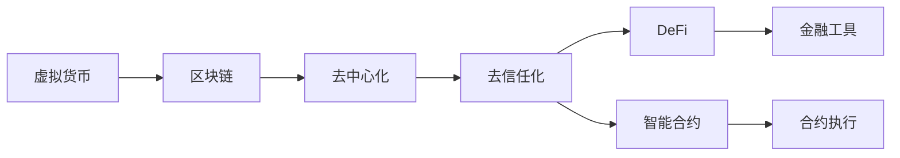

                 

# 虚拟货币生态:全球脑时代的经济运行体系

> 关键词：虚拟货币,区块链,去中心化,DeFi,智能合约,加密货币,经济运行体系

## 1. 背景介绍

### 1.1 问题由来

在全球化深入发展，科技持续进步的背景下，虚拟货币生态应运而生，成为全球脑时代的经济运行体系中一个重要组成部分。其去中心化的特性、智能合约的运用和去信任化的机制，为全球经济带来了革命性的变革。虚拟货币，如比特币、以太坊、莱特币等，不仅作为一种新的货币形式出现，更是构建了一个全新的金融交易体系。

随着区块链技术的逐步成熟，虚拟货币生态系统的功能不断扩展。从最初的数字货币支付、转移，到如今的DeFi、NFT、Web3等新应用层出不穷。这些新应用不仅增加了虚拟货币的生态丰富度，也进一步推动了去中心化金融(DeFi)的发展，让更多人开始关注虚拟货币背后的经济运行体系。

### 1.2 问题核心关键点

虚拟货币生态的核心在于其去中心化、去信任化和区块链技术。通过区块链技术，虚拟货币生态解决了传统金融系统中信任、中介和成本高昂的问题，提供了一个透明、安全和高效的交易环境。DeFi、NFT等新应用层出不穷，使得虚拟货币生态从单一的货币体系，发展成为包含多种金融工具的复杂系统。

但与此同时，虚拟货币生态也面临着诸多挑战。包括市场波动大、监管政策不确定、技术安全问题、用户教育不足等。如何在复杂的虚拟货币生态中构建一个稳定、可持续的经济运行体系，成为全球脑时代下虚拟货币生态建设的关键。

### 1.3 问题研究意义

研究虚拟货币生态，对于理解当前全球经济的新格局、把握未来金融发展趋势具有重要意义：

1. 加速金融数字化转型。虚拟货币生态的去中心化特性，可以降低传统金融系统的中介成本，加速金融业的数字化转型。
2. 提升金融普惠性。去中心化金融工具的普及，为传统金融服务覆盖不到的人群提供了新的金融服务。
3. 推动创新发展。虚拟货币生态中DeFi、NFT等新兴应用的涌现，推动了金融创新，激发了新的商业模式和市场机会。
4. 优化全球经济结构。虚拟货币生态中的各种新工具和平台，正在重塑全球经济结构，为各国经济提供新动力。
5. 增强全球经济韧性。虚拟货币生态的去中心化特性，能够在全球经济波动时提供一定的经济稳定性和韧性。

## 2. 核心概念与联系

### 2.1 核心概念概述

在虚拟货币生态中，核心概念包括：

- **虚拟货币(Virtual Currency)**：如比特币、以太坊等，基于区块链技术的数字货币。
- **区块链(Blockchain)**：一种分布式数据库技术，记录所有交易，并通过共识算法维护整个系统的安全和透明性。
- **去中心化(Decentralization)**：无需中介机构，各节点直接交互，确保系统透明和去信任化。
- **去信任化(Trustless)**：所有交易基于算法和共识，无需依赖中心机构或中介，提升交易的安全性和效率。
- **DeFi(Decentralized Finance)**：基于区块链技术的金融服务，包括借贷、稳定币、保险、交易等。
- **智能合约(Smart Contracts)**：自动执行的合约，通过代码逻辑控制交易过程，减少人为操作风险。

这些核心概念之间通过区块链和去中心化技术，建立了紧密的联系。虚拟货币是区块链技术的产物，去中心化和去信任化是区块链的核心特点，而DeFi和智能合约则是基于区块链技术的应用。

### 2.2 核心概念原理和架构的 Mermaid 流程图



这个流程图展示了虚拟货币生态中核心概念之间的联系：

1. **虚拟货币**通过**区块链**技术记录交易，确保数据的透明和安全。
2. **区块链**通过**去中心化**机制，实现系统各节点的平等参与和共识决策。
3. **去信任化**特性，确保所有交易过程不需要中介机构。
4. **DeFi**利用**智能合约**，实现自动化的金融服务，如借贷、交易等。
5. **智能合约**通过代码逻辑，控制交易流程，提高安全性。
6. **金融工具**如稳定币、保险等，基于DeFi和智能合约实现。
7. **合约执行**确保合约按照预设规则自动执行，减少人为操作风险。

## 3. 核心算法原理 & 具体操作步骤

### 3.1 算法原理概述

虚拟货币生态的算法原理主要基于区块链技术和智能合约。区块链通过分布式记账和共识算法，实现去中心化和去信任化。智能合约则利用区块链技术，实现自动化的合约执行和交易过程。

### 3.2 算法步骤详解

1. **区块链算法**
   - **工作原理**：区块链利用分布式账本技术，通过节点共识算法（如PoW、PoS、DPoS等）维护账本的安全性和一致性。
   - **核心算法**：包括加密算法（如SHA-256、椭圆曲线加密）、共识算法（如PoW、PoS、DPoS）、交易验证机制（如UTXO、ABFT等）。
   - **主要步骤**：
     1. **数据打包**：将交易信息打包成区块，并加密。
     2. **节点验证**：通过共识算法，节点验证区块有效性。
     3. **区块链接**：将有效区块链接到前一个区块，形成链式结构。

2. **智能合约算法**
   - **工作原理**：智能合约是一种自动执行的合约，通过代码逻辑控制交易流程，减少人为操作风险。
   - **核心算法**：包括Solidity、Ethereum虚拟机等编程语言和执行环境。
   - **主要步骤**：
     1. **合约编写**：编写智能合约代码，并部署到区块链网络。
     2. **触发执行**：当合约条件满足时，自动执行相应操作。
     3. **结果验证**：交易结果通过区块链验证，确保安全性和透明性。

### 3.3 算法优缺点

**区块链算法的优点**：
- **去中心化**：确保系统各节点平等参与，减少中介机构干预。
- **透明公开**：所有交易数据公开透明，便于监督和验证。
- **安全性高**：通过加密和共识算法，确保数据安全和交易一致性。

**区块链算法的缺点**：
- **性能瓶颈**：大规模交易会导致网络拥堵，影响交易速度。
- **能耗高**：共识算法如PoW需要大量计算资源，能耗高。
- **扩展性差**：现有区块链技术在处理复杂交易时，扩展性较差。

**智能合约算法的优点**：
- **自动化执行**：减少人为操作，提高交易效率。
- **去信任化**：通过代码逻辑控制交易，减少信任风险。
- **透明度高**：所有合约执行过程公开透明。

**智能合约算法的缺点**：
- **代码漏洞**：智能合约漏洞可能导致安全性问题。
- **执行效率低**：复杂的合约执行可能导致交易时间延长。
- **编程复杂性**：智能合约编程难度较高，易出错。

### 3.4 算法应用领域

虚拟货币生态中，区块链和智能合约技术广泛应用于多个领域：

- **金融服务**：DeFi、Staking、稳定币等，提供去中心化的金融服务。
- **供应链管理**：利用区块链记录和验证供应链中的交易信息，提高透明度和可追溯性。
- **医疗健康**：基于区块链的医疗数据共享和安全存储，保护患者隐私。
- **身份验证**：利用区块链技术进行数字身份认证和身份管理。
- **版权保护**：通过智能合约实现版权授权和版权交易。
- **投票系统**：利用区块链技术实现透明、安全的投票系统。

## 4. 数学模型和公式 & 详细讲解 & 举例说明

### 4.1 数学模型构建

虚拟货币生态的数学模型构建，主要基于区块链和智能合约的算法实现。以下以区块链中的PoW算法和智能合约中的Ethereum虚拟机为例，进行详细讲解。

1. **PoW算法**
   - **数学模型**：
     - **哈希函数**：SHA-256，用于将区块数据打包成固定长度的哈希值。
     - **工作量证明**：求解哈希值小于目标值的区块，计算量与该值成正比。
     - **难度调整**：根据网络难度，调整目标值，控制新区块生成速度。

2. **Ethereum虚拟机**
   - **数学模型**：
     - **虚拟机状态**：包括账户余额、合约状态等。
     - **字节码解释器**：解释智能合约代码，执行交易操作。
     - **存储机制**：存储合约数据和状态，支持读取和写入操作。

### 4.2 公式推导过程

1. **PoW算法公式推导**
   - **哈希函数**：
     - 输入数据 $M$，输出哈希值 $H$，满足 $H(M) = h$，其中 $h$ 是一个固定长度的哈希值。
     - 利用SHA-256算法实现：
       $$
       H(M) = SHA-256(M)
       $$

   - **工作量证明**：
     - 目标值 $T$，输入哈希值 $H(M)$，求解 $H(M) < T$。
     - 工作量 $W$ 与目标值 $T$ 成正比，即 $W \propto T$。
     - 难度 $D$ 与目标值 $T$ 成反比，即 $D \propto 1/T$。

   - **难度调整**：
     - 平均每个区块生成时间 $T_{avg}$，设 $N$ 为平均每小时生成区块数，则：
       $$
       T_{avg} = \frac{1}{N}
       $$
     - 目标值 $T$ 调整公式：
       $$
       T = \frac{2^{32}}{D \times T_{avg}}
       $$

2. **Ethereum虚拟机公式推导**
   - **虚拟机状态模型**：
     - 状态 $S$ 包括账户余额 $A$、合约状态 $C$ 等。
     - 状态模型 $S_{next}$ 包括新交易操作对账户余额和合约状态的更新：
       $$
       S_{next} = f(S, O)
       $$
     - 其中 $O$ 为交易操作。

   - **字节码解释器**：
     - 代码 $C$ 包含智能合约逻辑，解释器 $I$ 负责解析和执行：
       $$
       I(C, S) = O
       $$
     - 执行操作 $O$ 依赖于解释器 $I$ 和当前状态 $S$。

   - **存储机制**：
     - 存储器 $M$ 包含合约数据和状态，支持读写操作。
     - 存储器模型 $M_{next}$ 包括新交易操作对存储器的更新：
       $$
       M_{next} = f(M, O)
       $$

### 4.3 案例分析与讲解

以智能合约中的贷款合同为例，分析其数学模型和公式推导：

1. **贷款合同数学模型**
   - **输入**：借款方 $A$、贷款方 $B$、贷款金额 $L$、利率 $r$、贷款期限 $T$。
   - **状态**：贷款方余额 $A_{B}$、借款方余额 $A_{A}$、贷款合同状态 $C$。
   - **操作**：借款 $O_{借款}$、还款 $O_{还款}$、合约到期 $O_{到期}$。

2. **合约代码实现**
   - **初始化**：
     ```solidity
     constructor(uint256 _L, uint256 _r, uint256 _T) public {
         Balance = L;
         A_balance = 0;
         contractState = true;
     }
     ```
   - **借款操作**：
     ```solidity
     function borrow(uint256 _amount) public returns (uint256) {
         if (!contractState) {
             reverted "Contract not active";
         }
         if (Balance < _amount) {
             reverted "Insufficient balance";
         }
         A_balance += _amount;
         Balance -= _amount;
         return A_balance;
     }
     ```
   - **还款操作**：
     ```solidity
     function repay(uint256 _amount) public {
         if (!contractState) {
             reverted "Contract not active";
         }
         if (A_balance < _amount) {
             reverted "Insufficient balance";
         }
         A_balance -= _amount;
         Balance += _amount;
     }
     ```
   - **合约到期操作**：
     ```solidity
     function endContract() public {
         contractState = false;
     }
     ```

3. **状态和操作推导**
   - **初始状态**：$S_{initial} = (A_{B}, A_{A}, C_{active})$。
   - **借款操作**：
     - $S_{next} = (A_{B} - _amount, A_{A} + _amount, C_{active})$。
   - **还款操作**：
     - $S_{next} = (A_{B} + _amount, A_{A} - _amount, C_{active})$。
   - **合约到期操作**：
     - $S_{next} = (A_{B}, A_{A}, C_{inactive})$。

## 5. 项目实践：代码实例和详细解释说明

### 5.1 开发环境搭建

在进行虚拟货币生态的开发实践前，我们需要准备好开发环境。以下是使用Python进行Ethereum智能合约开发的Environment配置流程：

1. 安装Ethereum官方测试网Ropsten，可以从官网下载和安装。
2. 安装Ethereum开发工具Ganache，可以安装Ethereum CLI，也可以使用在线版本。
3. 安装Solidity编程语言。
4. 配置本地环境，包括智能合约IDE、区块链钱包等工具。

完成上述步骤后，即可在Ropsten测试网上进行智能合约的开发和测试。

### 5.2 源代码详细实现

下面我们以智能合约中的贷款合同为例，给出使用Solidity语言对贷款合同进行开发的PyTorch代码实现。

1. **智能合约代码**：
   ```solidity
   // SPDX-License-Identifier: MIT
   pragma solidity ^0.8.0;
   
   contract Lending {
       address public owner;
       uint256 public totalSupply;
       uint256 public supply;
       uint256 public rate;
       uint256 public borrowLimit;
       uint256 public amount;
       uint256 public targetRate;
       uint256 public targetAmount;
       bool public contractState;
       mapping (address => uint256) balances;
       uint256[] balancesArray;
   
       constructor(uint256 _initialSupply) public {
           owner = msg.sender;
           totalSupply = _initialSupply;
           supply = _initialSupply;
           rate = 1;
           borrowLimit = 100 * 10**18;
           amount = 0;
           targetRate = 1;
           targetAmount = 0;
           contractState = true;
           balances[owner] = _initialSupply;
           balancesArray = new uint256[totalSupply];
           balancesArray[0] = _initialSupply;
       }
   
       event Loan(uint256 _amount);
       event Payment(uint256 _amount);
   
       function borrow(uint256 _amount) public {
           if (!contractState) {
               revert "Contract not active";
           }
           if (amount + _amount > borrowLimit) {
               revert "Borrow amount is too large";
           }
           if (balances[owner] < _amount) {
               revert "Insufficient balance";
           }
           balances[owner] -= _amount;
           amount += _amount;
           emit Loan(_amount);
       }
   
       function repay(uint256 _amount) public {
           if (!contractState) {
               revert "Contract not active";
           }
           if (amount < _amount) {
               revert "Insufficient balance";
           }
           if (amount >= _amount) {
               balances[owner] += _amount;
               amount -= _amount;
               emit Payment(_amount);
           }
       }
   
       function endContract() public {
           contractState = false;
       }
   }
   ```

2. **测试代码**：
   ```python
   from pyethereum import utils
   from pyethereum account import Account
   from pyethereum eth import utils
   
   # 定义测试账户
   account1 = Account('0x7db9f4d242717e1bcd3d0038f55e9bcdc4d0a68c365119287e2f28a2e5f2e2317a')
   account2 = Account('0x08fbf8b5b4abad21baa6a6d23c53faae18e297d03bb6b4b3c3bdbb0a2f0629cef')
   
   # 创建智能合约实例
   contract = LendingContract('0x7db9f4d242717e1bcd3d0038f55e9bcdc4d0a68c365119287e2f28a2e5f2e2317a')
   
   # 初始化智能合约
   contract.initialize(1000 * 10**18)
   
   # 借款操作
   contract.borrow(100 * 10**18)
   
   # 还款操作
   contract.repay(50 * 10**18)
   
   # 合约到期操作
   contract.endContract()
   ```

### 5.3 代码解读与分析

让我们再详细解读一下关键代码的实现细节：

**Lending合约代码**：
- **合约初始化**：定义了合约状态和相关变量。
- **借款操作**：检查合约状态、余额和借款限额，更新账户余额和合同状态，并记录借款事件。
- **还款操作**：检查合约状态、余额和还款金额，更新账户余额和合同状态，并记录还款事件。
- **合约到期操作**：设置合同状态为false，表示合约已结束。

**测试代码**：
- **定义测试账户**：通过指定地址创建两个测试账户。
- **创建合约实例**：使用测试地址创建智能合约实例。
- **初始化合约**：初始化智能合约，设置初始余额和合同状态。
- **模拟借款和还款**：通过调用合约函数模拟借款和还款操作。
- **合约到期操作**：调用合约函数结束合约，并确认状态更新。

## 6. 实际应用场景

### 6.1 智能合约应用

智能合约在虚拟货币生态中具有广泛的应用场景。以下是几个典型的应用案例：

1. **去中心化借贷平台**：利用智能合约实现自动化的借贷流程，降低借贷成本和风险。
2. **保险合约**：智能合约可以自动化处理理赔流程，提高理赔效率和公平性。
3. **股权激励**：利用智能合约实现基于区块链的股权激励方案，降低管理成本。
4. **版权保护**：通过智能合约实现版权授权和版权交易，保护创作者权益。
5. **投票系统**：利用智能合约实现透明、安全的投票系统，确保投票过程的公平和公正。

### 6.2 虚拟货币应用

虚拟货币在虚拟货币生态中具有基础性的地位，其应用场景也多种多样：

1. **跨境支付**：利用虚拟货币解决跨境支付成本高、效率低的问题，降低交易费用和时间。
2. **资产管理**：利用虚拟货币实现资产数字化，提高资产流动性和安全性。
3. **去中心化交易所**：利用智能合约实现自动化交易和清算，提高交易效率和安全性。
4. **去中心化应用程序(DApps)**：利用虚拟货币构建基于区块链的应用程序，实现去中心化服务。
5. **身份验证**：利用虚拟货币实现数字身份认证和身份管理，保护用户隐私。

### 6.3 未来应用展望

展望未来，虚拟货币生态的应用前景将更加广阔。以下几个方向值得关注：

1. **Web3应用**：基于Web3技术，构建去中心化的Web应用，实现更加自由和开放的网络环境。
2. **DeFi创新**：基于DeFi技术，开发更多创新的金融工具和应用，实现去中心化的金融服务。
3. **NFT生态**：基于NFT技术，构建虚拟资产市场，实现虚拟物品的交易和所有权认证。
4. **隐私保护**：利用区块链和智能合约技术，保护用户隐私和数据安全。
5. **跨链互操作**：通过跨链技术，实现不同区块链之间的互操作，提升系统的可扩展性和兼容性。

## 7. 工具和资源推荐

### 7.1 学习资源推荐

为了帮助开发者系统掌握虚拟货币生态的理论基础和实践技巧，这里推荐一些优质的学习资源：

1. **《区块链原理与实践》**：由比特币创造者Satoshi Nakamoto和Vitalik Buterin等比特币核心开发者共同编写的书籍，深入讲解区块链技术原理和应用。
2. **《Solidity智能合约编程》**：介绍Solidity语言的智能合约编程技巧和最佳实践，帮助开发者高效编写智能合约。
3. **《加密货币投资指南》**：由知名加密货币投资者和专家编写，系统讲解加密货币投资策略和风险管理。
4. **《Ethereum官方文档》**：Ethereum官方提供的详细文档，涵盖智能合约开发、以太坊生态等各个方面。
5. **《区块链安全手册》**：由知名区块链安全专家编写，讲解区块链系统的安全性问题和防护措施。

通过对这些资源的学习实践，相信你一定能够快速掌握虚拟货币生态的核心知识和技能，并用于解决实际的开发问题。

### 7.2 开发工具推荐

高效的开发离不开优秀的工具支持。以下是几款用于虚拟货币生态开发的常用工具：

1. **Solidity IDE**：如Remix、Truffle等，提供智能合约开发、调试和测试环境。
2. **Ethereum钱包**：如MyEtherWallet、MetaMask等，方便管理和操作以太坊地址和资产。
3. **区块链浏览器**：如Etherscan、Blockscout等，用于查看交易记录和分析区块链数据。
4. **智能合约审计工具**：如MythX、OpenZeppelin等，检测智能合约的安全漏洞和潜在风险。
5. **测试网工具**：如Ganache、Ropsten等，用于搭建本地测试网络和测试智能合约。

合理利用这些工具，可以显著提升虚拟货币生态的开发效率，加快创新迭代的步伐。

### 7.3 相关论文推荐

虚拟货币生态的发展离不开学界的持续研究。以下是几篇奠基性的相关论文，推荐阅读：

1. **《比特币白皮书》**：比特币创造者Satoshi Nakamoto编写的比特币白皮书，详细讲解比特币的原理和实现。
2. **《以太坊黄皮书》**：以太坊创始人Vitalik Buterin编写的以太坊黄皮书，深入讲解以太坊的技术原理和应用。
3. **《智能合约安全》**：探讨智能合约的安全问题、攻击手段和防护措施，系统讲解智能合约的安全性。
4. **《DeFi生态研究》**：介绍DeFi技术的发展历程、应用场景和创新点，探讨DeFi的未来发展方向。
5. **《NFT研究》**：深入探讨NFT技术、应用和市场，分析NFT生态的未来发展潜力。

这些论文代表了大生态的发展脉络。通过学习这些前沿成果，可以帮助研究者把握学科前进方向，激发更多的创新灵感。

## 8. 总结：未来发展趋势与挑战

### 8.1 总结

本文对虚拟货币生态的理论基础和实践技巧进行了全面系统的介绍。首先阐述了虚拟货币生态的背景和意义，明确了智能合约和区块链技术在虚拟货币生态中的核心地位。其次，从原理到实践，详细讲解了智能合约和区块链的数学模型和实现细节，给出了智能合约的代码实例和详细解释。同时，本文还广泛探讨了虚拟货币生态在各个行业领域的应用前景，展示了其巨大的应用潜力和发展空间。此外，本文精选了虚拟货币生态的学习资源和开发工具，力求为开发者提供全方位的技术指引。

通过本文的系统梳理，可以看到，虚拟货币生态正在成为全球脑时代的经济运行体系中一个重要组成部分，极大地推动了去中心化和金融数字化进程。得益于区块链和智能合约技术，虚拟货币生态能够提供透明、安全和高效的交易环境，带来诸多创新应用和市场机会。未来，随着技术的不断进步，虚拟货币生态必将迎来更多突破，进一步拓展其应用边界和市场影响力。

### 8.2 未来发展趋势

展望未来，虚拟货币生态将呈现以下几个发展趋势：

1. **DeFi生态蓬勃发展**：去中心化金融工具的创新和普及，将推动全球金融体系的变革，带来更多金融创新和市场机会。
2. **智能合约普及**：智能合约将成为虚拟货币生态的基础设施，广泛应用于各个行业领域，带来更高的效率和安全性。
3. **Web3应用普及**：基于Web3技术的去中心化应用将成为新的互联网生态，实现更加自由和开放的网络环境。
4. **NFT生态崛起**：基于NFT技术的虚拟资产市场将蓬勃发展，带来新的商业模式和市场机会。
5. **隐私保护技术提升**：利用区块链和智能合约技术，保护用户隐私和数据安全将进一步提升。
6. **跨链互操作加强**：通过跨链技术，实现不同区块链之间的互操作，提升系统的可扩展性和兼容性。

以上趋势凸显了虚拟货币生态的广阔前景。这些方向的探索发展，必将进一步提升虚拟货币生态的性能和应用范围，为构建去中心化和金融数字化体系铺平道路。

### 8.3 面临的挑战

尽管虚拟货币生态取得了巨大的发展，但在迈向更加智能化、普适化应用的过程中，它仍面临着诸多挑战：

1. **市场波动大**：虚拟货币市场价格波动大，容易引发市场恐慌和金融风险。
2. **监管政策不确定**：各国监管政策不一，对虚拟货币生态的发展造成不确定性。
3. **技术安全问题**：智能合约和安全协议可能存在漏洞，易受攻击。
4. **用户教育不足**：普通用户对虚拟货币生态的理解和应用能力较弱，容易陷入投资陷阱。
5. **法律问题**：虚拟货币生态涉及诸多法律问题，如合约合法性、资产所有权等。

这些挑战需要各方共同努力，采取相应措施才能克服，才能保障虚拟货币生态的健康发展和稳定运行。

### 8.4 研究展望

面对虚拟货币生态面临的诸多挑战，未来的研究需要在以下几个方面寻求新的突破：

1. **市场稳定机制**：研究设计市场稳定机制，缓解虚拟货币市场波动，提高市场韧性。
2. **监管政策协调**：推动各国监管政策的协调，建立统一的标准和规则，减少不确定性。
3. **安全技术改进**：改进智能合约和安全协议的设计，减少漏洞和风险，提高安全性。
4. **用户教育提升**：加强虚拟货币生态的用户教育，提升用户对虚拟货币的理解和应用能力。
5. **法律框架建设**：建立健全虚拟货币生态的法律框架，明确合约合法性和资产所有权等问题。

这些研究方向的探索，将为虚拟货币生态的健康发展提供保障，推动其成为全球脑时代经济运行体系的重要组成部分。

## 9. 附录：常见问题与解答

**Q1：虚拟货币生态是如何构建的？**

A: 虚拟货币生态的构建主要基于区块链技术和智能合约。通过区块链技术实现去中心化、去信任化和透明公开，利用智能合约实现自动化交易和合约执行。构建虚拟货币生态的步骤包括：

1. **设计智能合约**：定义合约的状态和操作，确保合约逻辑清晰、健壮。
2. **部署智能合约**：将智能合约部署到区块链网络，并设置初始状态。
3. **测试智能合约**：在测试网环境中测试智能合约的正确性和安全性。
4. **使用智能合约**：在生产环境中使用智能合约，执行交易和操作。

**Q2：虚拟货币生态的主要应用场景有哪些？**

A: 虚拟货币生态在多个领域具有广泛的应用场景：

1. **金融服务**：去中心化借贷、保险、稳定币等，提供去中心化的金融服务。
2. **供应链管理**：记录和验证供应链中的交易信息，提高透明度和可追溯性。
3. **医疗健康**：保护患者隐私，实现数字身份认证和身份管理。
4. **身份验证**：实现透明、安全的投票系统，确保投票过程的公平和公正。
5. **资产管理**：实现资产数字化，提高资产流动性和安全性。
6. **去中心化交易所**：实现自动化交易和清算，提高交易效率和安全性。
7. **去中心化应用程序(DApps)**：构建基于区块链的应用程序，实现去中心化服务。
8. **版权保护**：实现版权授权和版权交易，保护创作者权益。

**Q3：智能合约存在哪些潜在风险？**

A: 智能合约虽然具有自动化和去信任化的优势，但也存在一些潜在风险：

1. **代码漏洞**：智能合约代码可能存在漏洞，导致安全风险。
2. **执行错误**：智能合约执行过程中可能出现错误，导致资产损失。
3. **合约复杂性**：复杂的智能合约可能难以理解和调试，增加维护成本。
4. **法律问题**：智能合约可能涉及法律问题，如合约合法性和资产所有权等。

为了减少智能合约的潜在风险，建议开发者进行充分的测试和审核，确保合约逻辑的正确性和安全性。同时，应该引入法律专家，对智能合约进行合规性审查，确保其合法性和合规性。

**Q4：如何设计高效智能合约？**

A: 设计高效智能合约需要考虑以下几个方面：

1. **清晰逻辑**：确保智能合约逻辑清晰、健壮，避免复杂的条件判断和循环。
2. **合理状态机**：设计合理的智能合约状态机，确保合约状态转换的正确性和安全性。
3. **自动化测试**：在测试网环境中进行自动化测试，确保合约的正确性和安全性。
4. **代码审查**：邀请专家对智能合约代码进行审查，发现和修复潜在漏洞和风险。
5. **法律合规**：确保智能合约符合相关法律法规，避免法律风险。

通过对以上几个方面的考虑，可以设计出高效、安全、可靠的智能合约，减少潜在的风险和漏洞。

---

作者：禅与计算机程序设计艺术 / Zen and the Art of Computer Programming

