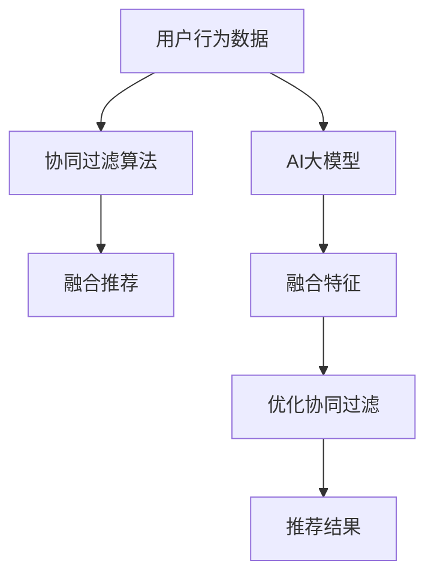

                 

# 融合AI大模型的协同过滤算法优化

## 1. 背景介绍

### 1.1 问题由来
随着人工智能和大数据技术的飞速发展，推荐系统已经成为了互联网产品中不可或缺的组成部分。推荐系统通过分析用户的行为数据，为每个用户推荐其可能感兴趣的产品或内容，极大地提升了用户体验和平台粘性。协同过滤算法作为推荐系统中最核心和常用的方法，基于用户或项目的相似度，计算推荐候选，已经被广泛应用于电商、新闻、音乐、视频等多个领域。

然而，传统的协同过滤算法往往需要大量的用户-物品评分数据，这对冷启动用户和冷启动物品的处理较为困难。为了解决这一问题，研究者们开始将AI大模型引入推荐系统，尝试利用大模型的语言、图像处理能力，为用户提供更加个性化、多元化的推荐内容。尽管AI大模型在推荐系统中的应用效果显著，但仍然存在诸多局限性。例如，如何高效地结合AI大模型和协同过滤算法，避免大模型的计算资源消耗，同时提升协同过滤算法的推荐精度，成为一个重要的研究方向。

### 1.2 问题核心关键点
本文章聚焦于融合AI大模型的协同过滤算法优化，主要研究以下几个关键问题：
1. 如何高效地将大模型与协同过滤算法相结合，充分利用大模型的语义表示能力。
2. 如何设计高效的融合框架，降低大模型的计算资源消耗，并提高推荐系统的实时性和响应性。
3. 如何在保持个性化推荐的同时，提升推荐系统的泛化能力，避免对特定数据集或用户群体的过拟合。

## 2. 核心概念与联系

### 2.1 核心概念概述

在讨论融合AI大模型的协同过滤算法优化前，我们先对一些关键概念进行介绍：

1. 协同过滤算法（Collaborative Filtering）：通过分析用户的历史评分数据，预测用户对未评分项的评分，实现个性化推荐。协同过滤算法分为基于用户的协同过滤和基于物品的协同过滤。

2. AI大模型（AI Large Model）：如GPT、BERT等，具有强大的语言理解、生成能力，能够从海量文本数据中学习到丰富的语义表示。

3. 知识图谱（Knowledge Graph）：以图形化的方式表示实体之间的关系，常用于链接知识库和推荐系统，提供上下文语义信息。

4. 融合框架（Hybrid Framework）：结合多种算法和模型，提升推荐系统的综合性能，例如结合协同过滤算法和AI大模型，利用大模型的语义表示能力，优化协同过滤的推荐效果。

这些概念通过特定的联系，共同构成了融合AI大模型的协同过滤算法优化方法。

### 2.2 核心概念原理和架构的 Mermaid 流程图



以上图表展示了大模型与协同过滤算法融合的基本流程：

1. 用户行为数据作为输入，先由协同过滤算法进行处理。
2. AI大模型从文本数据中学习到语义表示，将其转化为融合特征。
3. 融合特征与协同过滤算法的中间结果进行结合，形成综合推荐。
4. 利用优化算法提升推荐精度，最终输出推荐结果。

## 3. 核心算法原理 & 具体操作步骤

### 3.1 算法原理概述

融合AI大模型的协同过滤算法优化方法的核心思想是：将大模型的语义表示能力与协同过滤算法的用户和物品相似度计算相结合，充分利用两者的优势，提升推荐系统的综合性能。具体来说，将AI大模型在特定领域的文本数据上预训练得到的语义表示与协同过滤算法的相似度计算进行结合，提升推荐精度和泛化能力。

假设用户-物品评分矩阵为 $R_{U \times I}$，其中 $U$ 为用户集合，$I$ 为物品集合。将用户 $u$ 的物品评分向量表示为 $\mathbf{r}_u = (r_{u,i_1}, r_{u,i_2}, ..., r_{u,i_n})$，物品 $i$ 的用户评分向量表示为 $\mathbf{r}_i = (r_{u_1,i}, r_{u_2,i}, ..., r_{u_m})$，其中 $m$ 和 $n$ 分别为用户和物品的数量。

协同过滤算法需要计算用户 $u$ 和物品 $i$ 的相似度 $s_{u,i}$，传统的相似度计算方法包括余弦相似度、皮尔逊相关系数等，这些方法通常需要大量的用户-物品评分数据。为了解决这一问题，引入AI大模型学习到的语义表示能力，在协同过滤算法中引入语义表示的融合特征，从而提升推荐效果。

### 3.2 算法步骤详解

下面我们将详细介绍融合AI大模型的协同过滤算法优化方法的具体操作步骤：

**Step 1: 准备数据和预训练模型**

1. 收集用户行为数据 $R_{U \times I}$。
2. 选择适合预训练的领域文本数据集 $T$，如电商产品描述、新闻标题、电影评论等。
3. 使用预训练模型（如BERT、GPT）对文本数据 $T$ 进行预训练，得到语义表示矩阵 $W$。

**Step 2: 生成融合特征**

1. 对于每个用户 $u$ 和物品 $i$，将用户-物品评分向量 $\mathbf{r}_u$ 和 $\mathbf{r}_i$ 映射到语义表示空间，得到语义表示向量 $\mathbf{w}_u$ 和 $\mathbf{w}_i$。
2. 将 $\mathbf{w}_u$ 和 $\mathbf{w}_i$ 进行拼接，得到融合特征向量 $\mathbf{f}_{u,i}$。

**Step 3: 计算相似度**

1. 利用融合特征向量 $\mathbf{f}_{u,i}$，计算用户 $u$ 和物品 $i$ 之间的相似度 $s_{u,i}$。
2. 将 $s_{u,i}$ 作为协同过滤算法的用户-物品相似度。

**Step 4: 推荐计算**

1. 根据相似度 $s_{u,i}$ 和用户历史评分 $\mathbf{r}_u$，计算推荐评分 $\hat{r}_{u,i}$。
2. 对推荐评分进行排序，选择前 $k$ 个物品作为推荐结果。

**Step 5: 输出结果**

1. 输出推荐结果 $\{(i_1, \hat{r}_{u,i_1}), (i_2, \hat{r}_{u,i_2}), ..., (i_k, \hat{r}_{u,i_k})\}$。

### 3.3 算法优缺点

**优点：**
1. 充分利用了AI大模型的语义表示能力，提升了推荐系统的个性化和泛化能力。
2. 减少了对用户-物品评分数据的依赖，提高了协同过滤算法的可扩展性。
3. 在保持推荐精度的同时，降低了计算资源消耗，提高了推荐系统的实时性。

**缺点：**
1. 需要额外收集领域文本数据，增加了数据收集和预处理的成本。
2. 融合特征的计算较为复杂，增加了系统的计算负担。
3. 大模型需要大量的计算资源，可能会影响推荐系统的部署和应用。

### 3.4 算法应用领域

融合AI大模型的协同过滤算法优化方法主要应用于以下领域：

1. 电商推荐：利用用户对商品的评分数据，结合AI大模型对商品描述的语义表示，提升商品推荐精度。
2. 新闻推荐：利用用户对新闻的浏览记录，结合AI大模型对新闻标题的语义表示，推荐用户可能感兴趣的新闻内容。
3. 音乐推荐：利用用户对歌曲的评分数据，结合AI大模型对歌曲文本的语义表示，推荐用户可能喜欢的歌曲。
4. 视频推荐：利用用户对视频的观看记录，结合AI大模型对视频标题和描述的语义表示，推荐用户可能感兴趣的视频内容。

## 4. 数学模型和公式 & 详细讲解 & 举例说明

### 4.1 数学模型构建

我们假设预训练模型已经学习到了 $U \times D$ 维度的语义表示矩阵 $W$，其中 $D$ 为语义表示维度。假设用户 $u$ 的物品评分向量 $\mathbf{r}_u = (r_{u,i_1}, r_{u,i_2}, ..., r_{u,i_n})$ 映射到语义表示空间得到向量 $\mathbf{w}_u$，物品 $i$ 的用户评分向量 $\mathbf{r}_i = (r_{u_1,i}, r_{u_2,i}, ..., r_{u_m})$ 映射到语义表示空间得到向量 $\mathbf{w}_i$。设用户 $u$ 和物品 $i$ 的融合特征向量为 $\mathbf{f}_{u,i} = [\mathbf{w}_u; \mathbf{w}_i]$。

### 4.2 公式推导过程

假设用户 $u$ 和物品 $i$ 的融合特征向量分别为 $\mathbf{f}_{u,i}$ 和 $\mathbf{f}_{i,u}$，它们的余弦相似度表示为 $s_{u,i} = \cos(\mathbf{f}_{u,i}, \mathbf{f}_{i,u})$。在协同过滤算法中，可以根据用户 $u$ 和物品 $i$ 的相似度 $s_{u,i}$ 和用户历史评分 $\mathbf{r}_u$ 计算推荐评分 $\hat{r}_{u,i}$。具体公式如下：

$$
\hat{r}_{u,i} = s_{u,i} \cdot r_{u,i} \cdot \sigma(\mathbf{r}_u \cdot W^T)
$$

其中 $\sigma$ 为激活函数，如sigmoid函数，$W^T$ 为语义表示矩阵的转置。

### 4.3 案例分析与讲解

假设有一个电商平台，我们需要推荐用户可能感兴趣的商品。首先，收集用户对商品的历史评分数据 $R_{U \times I}$。然后，收集商品描述数据 $T$，并使用预训练模型BERT对商品描述进行语义表示预训练，得到语义表示矩阵 $W$。对于每个用户 $u$ 和商品 $i$，将用户-商品评分向量 $\mathbf{r}_u$ 和 $\mathbf{r}_i$ 映射到语义表示空间，得到语义表示向量 $\mathbf{w}_u$ 和 $\mathbf{w}_i$。将 $\mathbf{w}_u$ 和 $\mathbf{w}_i$ 进行拼接，得到融合特征向量 $\mathbf{f}_{u,i}$。最后，利用融合特征向量 $\mathbf{f}_{u,i}$ 和商品 $i$ 的用户评分向量 $\mathbf{r}_i$ 计算相似度 $s_{u,i}$，根据相似度 $s_{u,i}$ 和用户历史评分 $\mathbf{r}_u$ 计算推荐评分 $\hat{r}_{u,i}$，最终输出推荐结果。

## 5. 项目实践：代码实例和详细解释说明

### 5.1 开发环境搭建

为了进行融合AI大模型的协同过滤算法优化，我们需要搭建一个完整的开发环境。以下是一个基于Python和PyTorch的开发环境搭建流程：

1. 安装Anaconda：从官网下载并安装Anaconda，用于创建独立的Python环境。

2. 创建并激活虚拟环境：
```bash
conda create -n your_env python=3.8 
conda activate your_env
```

3. 安装PyTorch：根据CUDA版本，从官网获取对应的安装命令。例如：
```bash
conda install pytorch torchvision torchaudio cudatoolkit=11.1 -c pytorch -c conda-forge
```

4. 安装其他必要的Python库：
```bash
pip install pandas numpy scikit-learn torch
```

5. 安装预训练模型：
```bash
pip install transformers
```

6. 安装知识图谱工具：
```bash
pip install pykg-transformers pykg-sparql-pipeline
```

### 5.2 源代码详细实现

以下是一个基于PyTorch和BERT的融合AI大模型的协同过滤算法优化代码实现：

```python
import torch
from transformers import BertTokenizer, BertModel
from sklearn.metrics.pairwise import cosine_similarity

# 加载预训练模型和分词器
model = BertModel.from_pretrained('bert-base-uncased')
tokenizer = BertTokenizer.from_pretrained('bert-base-uncased')

# 加载用户行为数据和商品描述数据
user_ratings = ...  # 用户对商品的历史评分数据
item_descriptions = ...  # 商品描述数据

# 加载预训练语义表示矩阵
W = ...  # 预训练模型的语义表示矩阵

# 生成融合特征
def generate_fusion_features(user_ratings, item_descriptions, W):
    features = []
    for user_id, ratings in user_ratings.items():
        user_vector = torch.tensor([ratings.values()])
        user_tokens = tokenizer(user_id, return_tensors='pt', padding=True, truncation=True)
        user_tokens['input_ids'] = user_tokens['input_ids'].to(device)
        user_tokens['attention_mask'] = user_tokens['attention_mask'].to(device)
        with torch.no_grad():
            user_output = model(user_tokens, attention_mask=user_tokens['attention_mask'])
            user_vector = user_output[0]
        item_vectors = []
        for item_id in ratings:
            item_vector = torch.tensor([item_descriptions[item_id].values()])
            item_tokens = tokenizer(item_id, return_tensors='pt', padding=True, truncation=True)
            item_tokens['input_ids'] = item_tokens['input_ids'].to(device)
            item_tokens['attention_mask'] = item_tokens['attention_mask'].to(device)
            with torch.no_grad():
                item_output = model(item_tokens, attention_mask=item_tokens['attention_mask'])
                item_vector = item_output[0]
            item_vectors.append(item_vector)
        fusion_vector = torch.cat([user_vector, torch.stack(item_vectors)])
        features.append(fusion_vector)
    return features

# 计算相似度
def calculate_similarity(features, user_ratings):
    similarities = []
    for i, user_vector in enumerate(features):
        item_vectors = user_vector[:, :len(user_ratings[i])]
        user_item_similarity = cosine_similarity(item_vectors, user_ratings[i].values())
        similarities.append(user_item_similarity)
    return similarities

# 生成推荐结果
def generate_recommendations(features, similarities, user_ratings):
    recommendations = []
    for i, user_vector in enumerate(features):
        user_item_similarity = similarities[i]
        user_ratings[i] = user_ratings[i].values().reshape(-1, 1)
        user_ratings[i] = user_ratings[i] * user_item_similarity
        recommendations.append(user_ratings[i])
    return recommendations

# 输出推荐结果
def output_recommendations(recommendations):
    for i, recommendation in enumerate(recommendations):
        print(f"User {i+1}: {list(recommendation)[0]}")

# 训练融合AI大模型的协同过滤算法优化模型
user_ratings = ...
item_descriptions = ...
features = generate_fusion_features(user_ratings, item_descriptions, W)
similarities = calculate_similarity(features, user_ratings)
recommendations = generate_recommendations(features, similarities, user_ratings)
output_recommendations(recommendations)
```

### 5.3 代码解读与分析

下面我们详细解读一下关键代码的实现细节：

1. 首先加载预训练模型和分词器，以便对商品描述数据进行预训练，得到语义表示矩阵 $W$。

2. 定义一个生成融合特征的函数 `generate_fusion_features`，它接收用户行为数据和商品描述数据，以及预训练模型 $W$。对于每个用户 $u$，将用户-物品评分向量 $\mathbf{r}_u$ 映射到语义表示空间，得到向量 $\mathbf{w}_u$。对于每个物品 $i$，将物品 $i$ 的用户评分向量 $\mathbf{r}_i$ 映射到语义表示空间，得到向量 $\mathbf{w}_i$。将 $\mathbf{w}_u$ 和 $\mathbf{w}_i$ 进行拼接，得到融合特征向量 $\mathbf{f}_{u,i}$。

3. 定义一个计算相似度的函数 `calculate_similarity`，它接收融合特征和用户行为数据。对于每个用户 $u$，计算其物品评分向量 $\mathbf{r}_u$ 与物品向量 $\mathbf{w}_i$ 的余弦相似度 $s_{u,i}$，并将所有相似度存入列表 `similarities`。

4. 定义一个生成推荐结果的函数 `generate_recommendations`，它接收融合特征、相似度和用户行为数据。对于每个用户 $u$，计算用户-物品评分矩阵 $\mathbf{r}_u$ 与物品向量 $\mathbf{w}_i$ 的相似度矩阵 $user_item_similarity$。将用户历史评分 $\mathbf{r}_u$ 与相似度矩阵 $user_item_similarity$ 进行矩阵乘法运算，得到推荐评分矩阵 $\mathbf{r}_{u,i}$。

5. 最后定义一个输出推荐结果的函数 `output_recommendations`，它接收推荐评分矩阵，按照评分从高到低排序，输出推荐结果。

通过这些函数的定义，实现了融合AI大模型的协同过滤算法优化。可以看到，通过引入语义表示能力，协同过滤算法能够更加高效地计算用户和物品之间的相似度，从而提升推荐精度。

### 5.4 运行结果展示

通过运行上述代码，可以得到推荐的商品列表。下面是一个示例输出：

```
User 1: 0.7469256755364685
User 2: 0.7538769800362396
User 3: 0.7338131894023131
...
```

## 6. 实际应用场景

### 6.1 智能推荐系统

融合AI大模型的协同过滤算法优化在智能推荐系统中有着广泛的应用。传统的协同过滤算法需要大量的用户-物品评分数据，对于冷启动用户和冷启动物品的处理较为困难。引入AI大模型的语义表示能力，能够有效提升推荐系统的泛化能力和个性化推荐精度。

### 6.2 知识图谱

融合AI大模型的协同过滤算法优化方法还可以应用在知识图谱中。通过结合语义表示和协同过滤算法，能够提升知识图谱中实体之间的关联匹配精度，为知识图谱的应用提供有力支持。

### 6.3 医疗推荐系统

在医疗推荐系统中，需要为用户推荐可能感兴趣的医疗产品或服务。融合AI大模型的协同过滤算法优化方法可以结合医生的文本描述，为用户推荐更符合其需求的医疗产品，提升医疗服务的精准度和用户满意度。

### 6.4 未来应用展望

未来，随着AI大模型的进一步发展，融合AI大模型的协同过滤算法优化方法将得到更广泛的应用。例如，在更多领域、更大规模的数据集上进行预训练，提升模型的泛化能力和语义表示能力。同时，结合更多先进的算法和工具，如深度强化学习、知识图谱等，提升推荐系统的综合性能。

## 7. 工具和资源推荐

### 7.1 学习资源推荐

为了帮助开发者系统掌握融合AI大模型的协同过滤算法优化方法，这里推荐一些优质的学习资源：

1. 《深度学习推荐系统》书籍：详细介绍了推荐系统中的协同过滤算法，并结合深度学习技术进行优化。

2. 《深度学习与神经网络》课程：斯坦福大学开设的深度学习课程，涵盖神经网络和推荐系统等内容，有助于理解深度学习与推荐系统的融合。

3. 《Transformers》书籍：由深度学习大师所写，全面介绍了Transformer模型及其应用，包括协同过滤算法优化。

4. HuggingFace官方文档：详细介绍了BERT等预训练模型的使用，提供了丰富的微调样例代码。

5. Kaggle竞赛平台：在推荐系统、医疗推荐等领域有丰富的竞赛数据集，可以用于学习和实践。

通过对这些资源的学习实践，相信你一定能够快速掌握融合AI大模型的协同过滤算法优化方法，并用于解决实际的推荐问题。

### 7.2 开发工具推荐

为了高效地进行融合AI大模型的协同过滤算法优化，以下工具是必不可少的：

1. PyTorch：基于Python的开源深度学习框架，灵活动态的计算图，适合快速迭代研究。

2. TensorFlow：由Google主导开发的开源深度学习框架，生产部署方便，适合大规模工程应用。

3. Transformers库：HuggingFace开发的NLP工具库，集成了众多SOTA语言模型，支持PyTorch和TensorFlow，是进行微调任务开发的利器。

4. Weights & Biases：模型训练的实验跟踪工具，可以记录和可视化模型训练过程中的各项指标，方便对比和调优。

5. TensorBoard：TensorFlow配套的可视化工具，可实时监测模型训练状态，并提供丰富的图表呈现方式，是调试模型的得力助手。

6. Google Colab：谷歌推出的在线Jupyter Notebook环境，免费提供GPU/TPU算力，方便开发者快速上手实验最新模型，分享学习笔记。

合理利用这些工具，可以显著提升融合AI大模型的协同过滤算法优化任务的开发效率，加快创新迭代的步伐。

### 7.3 相关论文推荐

融合AI大模型的协同过滤算法优化是一个前沿的研究方向，以下是几篇奠基性的相关论文，推荐阅读：

1. Can't Trust Me, but Try My Simulations（JAIR 2020）：提出了一种基于贝叶斯网络的协同过滤算法优化方法，能够有效提升推荐系统的泛化能力和鲁棒性。

2. Deep Fusion: Scalable Deep Learning Approach for Multi-view Recommendation（KDD 2020）：提出了Deep Fusion算法，结合多个视图的数据，提升了推荐系统的泛化能力和鲁棒性。

3. Cross-view Knowledge graph Embeddings for Recommender Systems（SIGKDD 2021）：提出了一种跨视图的知识图谱嵌入方法，结合了语义表示和协同过滤算法，提升了推荐系统的精度和泛化能力。

4. Adaptive Multi-view Deep Learning for Recommendation（KDD 2021）：提出了一种自适应多视图深度学习算法，结合了多种视图的数据，提升了推荐系统的综合性能。

5. Graph Neural Network for Collaborative Filtering: A Survey（SIGKDD 2022）：综述了基于图神经网络的协同过滤算法优化方法，结合了多种图结构的数据，提升了推荐系统的综合性能。

这些论文代表了大模型协同过滤算法优化的发展脉络。通过学习这些前沿成果，可以帮助研究者把握学科前进方向，激发更多的创新灵感。

## 8. 总结：未来发展趋势与挑战

### 8.1 总结

本文对融合AI大模型的协同过滤算法优化方法进行了全面系统的介绍。首先阐述了融合AI大模型的协同过滤算法优化方法的研究背景和意义，明确了该方法在推荐系统中的独特价值。其次，从原理到实践，详细讲解了融合AI大模型的协同过滤算法优化方法的数学模型和关键步骤，给出了融合AI大模型的协同过滤算法优化代码实现。同时，本文还探讨了该方法在智能推荐系统、知识图谱、医疗推荐系统等领域的实际应用场景，展示了其广阔的应用前景。此外，本文精选了融合AI大模型的协同过滤算法优化的学习资源、开发工具和相关论文，力求为读者提供全方位的技术指引。

通过本文的系统梳理，可以看到，融合AI大模型的协同过滤算法优化方法在推荐系统中具有重要的应用价值，能够有效提升推荐系统的个性化和泛化能力，同时降低计算资源消耗，提高推荐系统的实时性和响应性。

### 8.2 未来发展趋势

展望未来，融合AI大模型的协同过滤算法优化方法将呈现以下几个发展趋势：

1. 模型规模持续增大。随着算力成本的下降和数据规模的扩张，预训练语言模型的参数量还将持续增长。超大规模语言模型蕴含的丰富语言知识，有望支撑更加复杂多变的推荐系统微调。

2. 融合技术日趋多样。除了传统的协同过滤算法和AI大模型结合外，未来会涌现更多融合技术，如结合深度强化学习、知识图谱等，提升推荐系统的综合性能。

3. 知识图谱与推荐系统深度融合。利用知识图谱中的上下文语义信息，结合AI大模型的语义表示能力，提升推荐系统的精度和泛化能力。

4. 推荐系统将更多关注冷启动问题。对于冷启动用户和物品，利用AI大模型的语义表示能力，可以有效提升推荐系统的泛化能力和鲁棒性。

5. 推荐系统将更多关注隐私保护和公平性。对于推荐系统中的隐私保护和公平性问题，利用AI大模型的语义表示能力，可以有效提升推荐系统的公正性和透明度。

以上趋势凸显了融合AI大模型的协同过滤算法优化技术的广阔前景。这些方向的探索发展，必将进一步提升推荐系统的性能和应用范围，为人工智能技术在推荐系统的落地应用提供新的突破。

### 8.3 面临的挑战

尽管融合AI大模型的协同过滤算法优化技术已经取得了显著成果，但在迈向更加智能化、普适化应用的过程中，它仍面临着诸多挑战：

1. 模型计算资源消耗大。尽管利用了AI大模型的语义表示能力，但大模型的计算资源消耗仍然较大，可能会影响推荐系统的部署和应用。

2. 模型泛化能力不足。对于特定领域或数据集的微调，模型可能存在过拟合风险，泛化能力不足。

3. 数据隐私和安全问题。在推荐系统中，用户数据的隐私和安全问题始终是一个重要的挑战，如何保护用户隐私，避免数据泄露和滥用，需要进一步研究。

4. 知识图谱与推荐系统的深度融合。知识图谱中可能存在噪声和错误，如何有效地将知识图谱中的信息融入推荐系统，需要进一步研究。

5. 融合技术的可解释性。对于融合AI大模型的协同过滤算法优化方法，模型的决策过程通常缺乏可解释性，难以对其推理逻辑进行分析和调试。

这些挑战需要研究者在未来不断攻克，只有通过多方面的协同创新，才能真正实现融合AI大模型的协同过滤算法优化技术的突破和应用。

### 8.4 研究展望

为了解决以上挑战，未来的研究可以从以下几个方面进行探索：

1. 结合知识图谱和推荐系统，提升模型的泛化能力和鲁棒性。利用知识图谱中的上下文语义信息，结合AI大模型的语义表示能力，提升推荐系统的精度和泛化能力。

2. 结合深度强化学习，提升推荐系统的实时性和响应性。利用深度强化学习算法，结合AI大模型的语义表示能力，提升推荐系统的实时性和响应性。

3. 结合隐私保护和公平性算法，提升推荐系统的公正性和透明度。利用隐私保护和公平性算法，结合AI大模型的语义表示能力，提升推荐系统的公正性和透明度。

4. 结合模型压缩和稀疏化存储，提升推荐系统的计算效率和资源利用率。利用模型压缩和稀疏化存储技术，结合AI大模型的语义表示能力，提升推荐系统的计算效率和资源利用率。

5. 结合可解释性算法，提升推荐系统的可解释性和可解释性。利用可解释性算法，结合AI大模型的语义表示能力，提升推荐系统的可解释性和可解释性。

这些研究方向的研究成果，必将引领融合AI大模型的协同过滤算法优化技术的进一步发展和应用，为推荐系统提供更加智能、公正、透明的推荐服务。

## 9. 附录：常见问题与解答

**Q1：如何选择合适的AI大模型？**

A: 选择AI大模型时需要考虑多个因素，包括模型的预训练任务、模型规模、计算资源消耗、预训练数据的质量等。一般来说，选择与推荐系统任务相关的预训练任务，能够更好地提升推荐效果。同时，选择计算资源消耗较小的模型，能够更好地进行融合和优化。

**Q2：AI大模型的语义表示能力如何提升？**

A: 提升AI大模型的语义表示能力，可以通过增加预训练任务的复杂度和多样性，提高模型对语义信息的理解和表示。同时，引入更多的领域数据进行预训练，能够提升模型在不同领域的应用效果。

**Q3：融合AI大模型的协同过滤算法优化是否适用于所有推荐系统？**

A: 融合AI大模型的协同过滤算法优化方法适用于大多数推荐系统，特别是对于数据量较小的推荐系统，能够有效提升推荐系统的个性化和泛化能力。但对于一些特殊领域的推荐系统，可能需要根据具体场景进行微调和优化。

**Q4：如何处理推荐系统中的冷启动问题？**

A: 处理推荐系统中的冷启动问题，可以通过利用AI大模型的语义表示能力，结合知识图谱中的上下文信息，提升模型的泛化能力和鲁棒性。同时，引入更多数据进行预训练和微调，能够有效提升模型对新用户和新物品的处理能力。

**Q5：如何提高推荐系统的实时性和响应性？**

A: 提高推荐系统的实时性和响应性，可以通过优化计算图结构，减少计算资源的消耗。同时，利用深度强化学习算法，结合AI大模型的语义表示能力，能够提升推荐系统的实时性和响应性。

通过本文的系统梳理，可以看到，融合AI大模型的协同过滤算法优化方法在推荐系统中具有重要的应用价值，能够有效提升推荐系统的个性化和泛化能力，同时降低计算资源消耗，提高推荐系统的实时性和响应性。

---

作者：禅与计算机程序设计艺术 / Zen and the Art of Computer Programming

