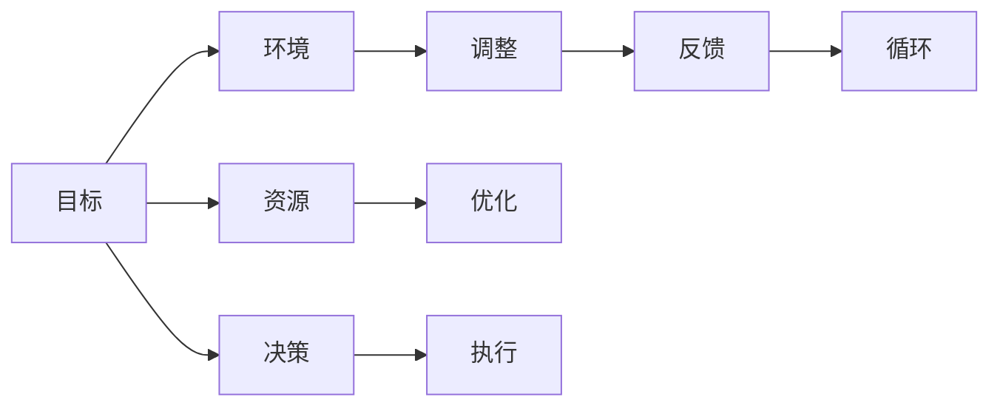

                 

# 行动体系：决定管理者的天花板

## 1. 背景介绍

在当前快速变化的商业环境中，管理者的角色越来越复杂。他们不仅要制定战略、做出决策，还需要有效地管理资源、优化团队。然而，很多管理者常常感到力不从心，因为缺乏一个系统化的框架来指导他们的行动。本文将探讨一个决定管理者天线的体系——行动体系，通过深入分析其原理和应用，帮助管理者提升绩效，实现高效的决策和团队管理。

### 1.1 问题由来

随着企业规模的扩大和市场竞争的加剧，管理者面临的决策压力越来越大。他们需要平衡短期和长期目标，协调各方利益，同时应对市场的突发变化。但许多管理者缺乏一套系统化的决策方法，导致决策效率低下，甚至出现重大失误。行动体系提供了一套系统化的框架，帮助管理者更好地理解和管理决策过程。

### 1.2 问题核心关键点

行动体系的核心在于行动的三个维度——目标、环境和资源。管理者需要在目标、环境和资源之间找到最佳匹配，才能做出正确的决策。该体系认为，管理者的决策过程应该是系统的、动态的，需要不断调整以应对环境的变化。

## 2. 核心概念与联系

### 2.1 核心概念概述

行动体系包括三个核心概念：目标（Goal）、环境（Environment）和资源（Resource）。每个概念都有其独立的作用，但更关键的是三者之间的联系。

- **目标**：管理者所期望达到的长期和短期目标。
- **环境**：影响管理者决策的外部因素，包括市场、技术、法规等。
- **资源**：管理者可利用的内部资源，包括人力、资金、技术等。

行动体系认为，管理者需要根据环境变化，灵活调整目标和资源配置，才能最大化实现目标。这一体系通过系统化的分析和决策过程，帮助管理者高效地应对复杂多变的环境。

### 2.2 核心概念原理和架构的 Mermaid 流程图



这个流程图展示了行动体系的动态循环过程：

1. **目标设定**：管理者根据长期愿景设定具体目标。
2. **环境分析**：分析外部环境，确定目标的可行性。
3. **资源配置**：根据目标和环境配置资源。
4. **调整决策**：根据环境变化调整目标和资源配置。
5. **执行优化**：执行决策并不断优化。
6. **反馈循环**：根据执行结果反馈调整目标和资源。

## 3. 核心算法原理 & 具体操作步骤

### 3.1 算法原理概述

行动体系的算法原理主要基于系统动力学（System Dynamics）和控制理论（Control Theory）。管理者可以通过分析目标、环境和资源的动态变化，找到最优的行动策略。该体系采用模型化的方法，将目标、环境和资源的关系转化为数学模型，通过仿真和优化算法找到最优解。

### 3.2 算法步骤详解

行动体系的具体操作步骤如下：

1. **目标设定**：明确管理者需要实现的具体目标，包括短期和长期目标。
2. **环境分析**：分析影响目标实现的外部环境因素，包括市场、法规、技术等。
3. **资源配置**：根据目标和环境，配置管理者可利用的内部资源，如人力、资金、技术等。
4. **模型建立**：建立目标、环境和资源的数学模型，分析它们之间的动态关系。
5. **仿真和优化**：使用仿真和优化算法，找出最优的行动策略。
6. **执行和反馈**：执行决策，并根据反馈调整目标和资源配置。

### 3.3 算法优缺点

行动体系的主要优点包括：

- **系统性**：将目标、环境和资源纳入一个系统化的框架，避免了孤立的思考。
- **动态性**：考虑到环境变化对目标和资源配置的影响，实现了动态调整。
- **优化性**：通过仿真和优化算法，找到最优的行动策略。

但该体系也存在一些缺点：

- **复杂性**：需要建立复杂的数学模型，且需要仿真和优化算法支持，对于非技术管理者来说可能过于复杂。
- **数据需求**：需要大量的数据来建立模型和进行仿真，数据的准确性和完备性对结果有很大影响。
- **时间和成本**：建立和维护模型的过程较为耗时，且需要一定的技术和资源投入。

### 3.4 算法应用领域

行动体系在各种管理场景中都有广泛应用，包括但不限于：

- **战略规划**：帮助企业制定长期战略，调整目标和资源配置。
- **项目管理和执行**：优化项目计划，调整资源分配，确保项目按时按质完成。
- **组织变革**：通过分析内部资源和外部环境，制定变革策略，提升组织效能。
- **风险管理**：评估环境变化对目标实现的影响，制定风险应对策略。

## 4. 数学模型和公式 & 详细讲解 & 举例说明

### 4.1 数学模型构建

行动体系的数学模型主要基于目标、环境和资源之间的关系。假设目标为 $T$，环境为 $E$，资源为 $R$，行动策略为 $A$，则目标、环境和资源之间的关系可以表示为：

$$
T = f(E, R, A)
$$

其中 $f$ 为目标实现函数，描述了目标与环境、资源和行动策略的关系。

### 4.2 公式推导过程

以战略规划为例，假设目标为 $T$，环境为 $M$（市场）、$R$（法规）、$T$（技术），资源为 $H$（人力）、$F$（资金）、$T$（技术），行动策略为 $A$（市场进入策略、法规遵守策略、技术创新策略），则目标实现函数可以表示为：

$$
T = g(M, R, T, H, F, T, A)
$$

其中 $g$ 为战略规划函数，描述了目标与环境、资源和行动策略的关系。

### 4.3 案例分析与讲解

假设某公司希望进入新的市场 $M$，面临的市场环境 $E$ 包括市场需求、竞争对手、政策法规等。公司可利用的资源 $R$ 包括人力、资金和技术，行动策略 $A$ 包括市场调研、品牌营销、产品开发等。公司的目标 $T$ 是进入市场并实现盈利。

管理者首先需要对市场环境进行详细分析，确定目标的可行性。然后根据目标和环境配置资源，并选择合适的行动策略。最后，通过仿真和优化算法，找到最优的市场进入策略，确保目标的实现。

## 5. 项目实践：代码实例和详细解释说明

### 5.1 开发环境搭建

为了实现行动体系，需要一个包含数据建模和优化算法的开发环境。以下是一个简单的Python开发环境搭建步骤：

1. 安装Python和必要的库：
   ```bash
   conda create -n action-system python=3.8
   conda activate action-system
   pip install numpy pandas scikit-learn scipy
   ```

2. 设置数据文件和模型文件目录：
   ```bash
   mkdir data models
   ```

### 5.2 源代码详细实现

以下是一个简化的行动体系实现示例，使用Pandas和SciPy库进行数据处理和模型仿真：

```python
import pandas as pd
from scipy.optimize import minimize

# 定义目标实现函数
def objective_function(x):
    # 目标函数，根据环境、资源和行动策略计算目标实现程度
    pass

# 定义目标优化函数
def target_optimization():
    # 使用优化算法寻找最优的行动策略
    pass

# 加载数据
data = pd.read_csv('data.csv')

# 优化目标
result = target_optimization()

# 输出优化结果
print(result)
```

### 5.3 代码解读与分析

**数据文件**：包含目标、环境、资源和行动策略的数据，如市场需求、竞争对手、资金投入、技术水平等。

**目标实现函数**：根据环境、资源和行动策略计算目标实现程度的函数。

**目标优化函数**：使用优化算法寻找最优的行动策略的函数。

**优化结果**：返回最优的行动策略，如市场进入策略、技术创新策略等。

## 6. 实际应用场景

### 6.1 智能制造

在智能制造领域，管理者需要平衡生产效率、产品质量和成本。行动体系可以帮助管理者设定生产目标，分析市场需求、技术水平和资源配置，优化生产策略。例如，通过仿真分析，管理者可以确定最优的生产计划和资源配置，提升生产效率和产品质量。

### 6.2 金融风险管理

在金融领域，管理者需要应对市场波动和信用风险。行动体系可以帮助管理者设定风险管理目标，分析市场环境、信用评级和资本配置，优化风险管理策略。例如，通过仿真和优化，管理者可以制定最优的风险控制策略，降低市场波动对公司的影响。

### 6.3 医疗资源配置

在医疗领域，管理者需要合理配置医疗资源，提升患者治疗效果和资源利用率。行动体系可以帮助管理者设定资源配置目标，分析患者需求、医院设备和人力资源，优化资源配置策略。例如，通过仿真和优化，管理者可以确定最优的资源配置方案，提升医院的运营效率和服务质量。

### 6.4 未来应用展望

未来，行动体系将在更多领域得到应用，为管理者的决策和行动提供有力支持。例如：

- **智慧城市管理**：帮助城市管理者优化交通、能源和公共设施的配置，提升城市运行效率。
- **环境保护**：帮助环保管理者设定环保目标，分析环境变化和资源配置，优化环保策略。
- **教育资源配置**：帮助教育管理者优化教育资源配置，提升教育质量和公平性。

## 7. 工具和资源推荐

### 7.1 学习资源推荐

为了帮助管理者掌握行动体系，以下是一些优质的学习资源：

1. **系统动力学教材**：如John Kay的《System Dynamics: A Handbook for Modeling Complex Phenomena》，介绍了系统动力学的基本原理和应用。
2. **控制理论教材**：如Morton S. crushed的《Control Systems Engineering》，介绍了控制理论的基本原理和应用。
3. **管理信息系统教材**：如William F. Louchart和James G. March的《Management Information Systems: Concepts and Structures》，介绍了管理信息系统的基本原理和应用。

### 7.2 开发工具推荐

为了实现行动体系，以下是一些推荐的开发工具：

1. **Python**：Python具有丰富的数据处理和建模库，如Pandas、NumPy、SciPy等，适合开发行动体系。
2. **MATLAB**：MATLAB具有强大的数值计算和仿真能力，适合建模和优化。
3. **Simulink**：Simulink是MATLAB的仿真工具，适合建立和管理动态系统模型。

### 7.3 相关论文推荐

以下是几篇关于行动体系的经典论文，推荐阅读：

1. **系统动力学论文**：John Kay的《Dynamic Interaction in Systems of Strategic Choice》，介绍了系统动力学的基本原理和应用。
2. **控制理论论文**：Morton S. crushed的《Optimal Control》，介绍了控制理论的基本原理和应用。
3. **行动体系论文**：Thomas F. Hutton的《Decision Making in Organizations: The Action System》，介绍了行动体系的基本原理和应用。

## 8. 总结：未来发展趋势与挑战

### 8.1 研究成果总结

行动体系为管理者的决策和行动提供了一个系统化的框架，帮助管理者更高效地实现目标。该体系通过系统分析和仿真优化，解决了传统决策方法中存在的问题，如孤立思考、静态决策等。行动体系在智能制造、金融风险管理、医疗资源配置等多个领域展示了其巨大的潜力。

### 8.2 未来发展趋势

未来，行动体系将在以下方向进一步发展：

1. **智能分析**：引入AI和大数据分析技术，提升决策的准确性和自动化水平。
2. **多目标优化**：支持多目标优化，帮助管理者同时实现多个目标。
3. **分布式决策**：支持分布式决策，提高大企业中各层级管理者的决策协同。
4. **实时优化**：支持实时优化，根据环境变化动态调整目标和资源配置。

### 8.3 面临的挑战

尽管行动体系在许多场景中表现出色，但在实际应用中仍面临一些挑战：

1. **数据获取**：行动体系需要大量的数据来建立模型和进行仿真，数据的获取和处理可能较为复杂。
2. **模型复杂性**：行动体系的模型较为复杂，需要一定的技术基础才能实现。
3. **决策速度**：在动态环境中，需要快速做出决策，行动体系的计算过程可能较为耗时。

### 8.4 研究展望

未来的研究需要在以下几个方面寻求新的突破：

1. **大数据融合**：将大数据技术引入行动体系，提升数据获取和处理能力。
2. **多智能体协同**：支持多智能体协同决策，提高组织决策的效率和质量。
3. **自适应优化**：开发自适应优化算法，提升决策过程的灵活性和效率。
4. **交互式决策**：开发交互式决策工具，支持管理者在决策过程中进行实时反馈和调整。

通过以上研究，行动体系将在未来进一步提升管理者的决策能力，帮助他们更好地应对复杂多变的环境，实现高效的管理和运营。

## 9. 附录：常见问题与解答

**Q1: 行动体系的核心思想是什么？**

A: 行动体系的核心思想是系统分析和动态优化。通过将目标、环境和资源纳入一个系统化的框架，帮助管理者更好地理解和管理决策过程。该体系认为，管理者需要根据环境变化，灵活调整目标和资源配置，才能做出正确的决策。

**Q2: 如何构建行动体系的目标实现函数？**

A: 构建目标实现函数需要根据具体的管理场景和目标，分析目标与环境、资源和行动策略之间的关系。例如，在战略规划中，目标实现函数可以表示为市场份额、收益增长、投资回报等。

**Q3: 行动体系在实际应用中面临哪些挑战？**

A: 行动体系在实际应用中面临数据获取、模型复杂性和决策速度等挑战。需要通过引入大数据技术和自适应优化算法，提升决策的效率和准确性。

**Q4: 如何优化行动体系的仿真过程？**

A: 优化行动体系的仿真过程需要引入高效的数值计算方法和分布式计算技术。例如，可以使用GPU加速计算，优化模型的数值稳定性，提升仿真速度。

**Q5: 行动体系在智能制造中的应用场景有哪些？**

A: 行动体系在智能制造中的应用场景包括生产计划优化、供应链管理、质量控制等。通过优化生产策略和资源配置，提升制造效率和产品质量。

---

作者：禅与计算机程序设计艺术 / Zen and the Art of Computer Programming

