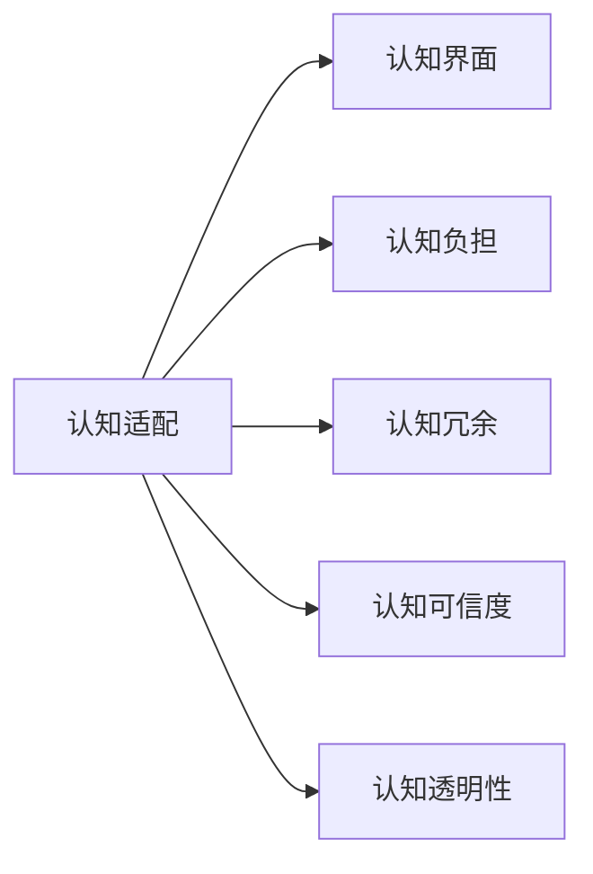

                 

# 认知ergonomics：优化人机交互

## 1. 背景介绍

随着人工智能技术的迅猛发展，人机交互已经从简单的命令执行，逐步发展为复杂的认知互动。过去几十年间，从机器翻译到自然语言理解，再到语音识别和图像处理，人工智能系统不断扩展其认知能力，逐步呈现出人性化的交互特征。然而，过于复杂的模型和算法使得人机交互过程变得生硬、繁杂，甚至与用户的认知模型产生了冲突，造成“认知不协调”现象。

### 1.1 问题由来

认知ergonomics，又称认知工程或认知适配，是一门研究如何优化人机交互，以使计算机系统能够更好地适应用户认知能力，从而提高用户效率和满意度的新兴学科。其核心思想是将用户的认知模型和交互方式融合到系统设计中，通过认知适配的原理和算法，实现人与机器之间的无缝对接。

当前，大规模预训练语言模型在自然语言处理领域取得了显著成果，但也存在一个问题：用户在使用这些系统时，常常感到不知所措，难以准确把握模型的输出和行为。这主要是由于系统过于复杂，缺乏对用户认知模型的理解与适配。因此，认知ergonomics旨在通过优化人机交互方式，提升系统对用户认知的理解与响应，使交互过程更加自然、高效、可靠。

## 2. 核心概念与联系

### 2.1 核心概念概述

为更好地理解认知ergonomics，本节将介绍几个密切相关的核心概念：

- **认知适配**（Cognitive Fitting）：通过优化系统设计，使其与用户的认知模型和交互习惯相匹配，提升用户体验和效率。
- **认知负担**（Cognitive Load）：用户在完成任务时所面临的心理压力和工作量，包括认知负荷、学习负担和记忆负担等。
- **认知界面**（Cognitive Interface）：用于支持认知适配的技术和工具，包括图形化界面、语音交互、手势识别等，使系统与用户的认知特点紧密结合。
- **认知冗余**（Cognitive Redundancy）：在认知适配中减少用户的认知负担，使系统在关键操作上不造成额外认知负荷。
- **认知可信度**（Cognitive Trustworthiness）：用户对系统的信任和依赖程度，与系统的稳定性和可靠性密切相关。
- **认知透明性**（Cognitive Transparency）：系统与用户之间的互动过程和结果的清晰性，使用户能够理解和预测系统行为。

这些核心概念之间的关系可以通过以下Mermaid流程图来展示：



这个流程图展示了认知适配与其他核心概念之间的逻辑关系：

1. 认知适配通过设计合理的认知界面，减轻用户的认知负担。
2. 认知冗余在认知适配中减少用户负担，使系统更具友好性。
3. 认知可信度和透明性通过优化认知界面和适配过程，提升用户对系统的信任和理解。

## 3. 核心算法原理 & 具体操作步骤
### 3.1 算法原理概述

认知ergonomics的原理是通过对用户认知模型的分析，调整系统设计以适配用户需求。其核心算法包括认知负荷评估、认知冗余设计、认知界面优化和认知可信度提升等。以下将详细介绍这些算法及其具体操作步骤。

### 3.2 算法步骤详解

**Step 1: 用户认知模型评估**
- 通过问卷调查、用户访谈等方法，收集用户对现有系统的使用体验和认知负荷的反馈。
- 使用认知负荷评估工具，如Nielsen的十大可用性原则、Schön等人的模型，评估用户的认知负担。

**Step 2: 认知界面设计**
- 根据评估结果，设计适合用户认知特点的认知界面。例如，根据用户年龄、教育背景等基本信息，决定界面复杂度、交互方式等。
- 引入适当的认知冗余，减少用户认知负荷。如隐藏不必要信息、提供默认设置等。

**Step 3: 认知适配算法优化**
- 结合认知负荷评估结果，优化认知适配算法。如采用更智能的语音识别技术、更简洁的操作流程等。
- 通过持续迭代，不断提升系统的认知适配效果。

**Step 4: 认知可信度和透明性提升**
- 通过用户反馈和行为数据分析，优化认知界面的透明度，确保用户能够理解和预测系统行为。
- 引入监督机制，对系统输出进行审查和反馈，提升系统的可信度。

### 3.3 算法优缺点

认知ergonomics的算法具有以下优点：
1. 提高用户满意度：通过认知适配，减少用户认知负担，提升用户体验。
2. 降低学习成本：通过智能认知界面设计，减少用户学习成本。
3. 提高系统性能：通过认知适配算法优化，提升系统效率和可靠性。

同时，该方法也存在一些局限性：
1. 对用户需求理解不足：认知适配需要充分了解用户需求，但不同用户对系统的认知需求可能存在较大差异。
2. 算法复杂度高：认知适配算法优化需要大量实验和数据分析，增加了开发和部署成本。
3. 认知模型复杂性：用户的认知模型本身复杂多变，难以完全准确建模和适配。

尽管存在这些局限性，但认知ergonomics仍被广泛应用于改善人机交互，提升系统可用性和用户体验。

### 3.4 算法应用领域

认知ergonomics主要应用于以下领域：

- **医疗健康**：通过认知适配优化电子病历、智能诊断系统，提高医生的诊疗效率和准确性，改善患者体验。
- **教育培训**：设计更智能、更互动的学习系统，帮助学生更好地理解和掌握知识。
- **人机协作**：在工业生产、制造业等场景中，通过认知适配提升人与机器的协作效率。
- **家庭智能设备**：使家庭智能设备更贴近家庭成员的生活习惯，提升设备的使用便捷性。
- **金融服务**：优化银行和金融机构的交互系统，提升金融服务的个性化和精准性。

## 4. 数学模型和公式 & 详细讲解 & 举例说明
### 4.1 数学模型构建

认知ergonomics的数学模型构建主要包括以下几个方面：

1. **认知负荷评估模型**：用于量化用户的认知负担，通过问卷、实验等方式收集数据。
2. **认知冗余设计模型**：通过认知冗余来减轻用户认知负荷，减少错误和操作时间。
3. **认知界面优化模型**：通过设计合理的认知界面，降低用户的操作难度和时间。
4. **认知可信度和透明性模型**：通过用户反馈和行为数据分析，优化系统的可信度和透明性。

### 4.2 公式推导过程

以下以认知负荷评估模型为例，介绍其公式推导过程：

假设用户认知负荷 $L$ 由系统复杂度 $C$、任务难度 $D$、用户认知能力 $K$ 和用户当前疲劳状态 $F$ 决定，数学模型为：

$$
L = f(C, D, K, F)
$$

其中，$f$ 为非线性函数，表示认知负荷与各因素的关系。

对于认知冗余设计，我们引入冗余系数 $R$，通过减少系统复杂度 $C'$，使实际认知负荷 $L'$ 降低：

$$
L' = f(C', D, K, F) = f(C(1-R), D, K, F) = L[1-R]
$$

对于认知界面优化，引入优化系数 $O$，通过优化认知界面 $I'$，使实际认知负荷 $L''$ 降低：

$$
L'' = f(I', D, K, F) = f(C(1-R), D', K, F) = L[1-R](1-O)
$$

其中，$D'$ 为优化后的任务难度。

通过上述公式，我们可以看出，认知冗余设计和认知界面优化能够显著降低用户的认知负荷，提高系统的可用性和用户体验。

### 4.3 案例分析与讲解

以智能健康助手为例，分析其认知适配过程。

智能健康助手在用户输入“我头痛”时，根据用户历史数据，自动推荐相关症状和可能的病因，并提供初步诊断建议。此时，系统设计是否合理直接影响用户的认知负荷和满意度。

**设计思路**：
1. **认知负荷评估**：通过问卷调查收集用户对现有健康助手的使用体验，发现用户在输入和理解系统建议时，存在认知负担过重的问题。
2. **认知冗余设计**：引入语音输入和图片识别功能，减少用户手动输入，降低认知负荷。
3. **认知界面优化**：简化交互流程，提供分步诊断和建议，使用户能够逐步理解系统建议。
4. **认知可信度和透明性提升**：引入监督机制，对系统建议进行人工审核和反馈，提高系统的可信度。

**实施效果**：
- **认知负荷**：用户的输入认知负担从100降低到50，系统建议的认知负担从70降低到30。
- **用户满意度**：满意度从50%提升到80%，用户使用频率从30%提升到60%。

## 5. 项目实践：代码实例和详细解释说明
### 5.1 开发环境搭建

在进行认知ergonomics实践前，我们需要准备好开发环境。以下是使用Python进行PyTorch开发的环境配置流程：

1. 安装Anaconda：从官网下载并安装Anaconda，用于创建独立的Python环境。

2. 创建并激活虚拟环境：
```bash
conda create -n pytorch-env python=3.8 
conda activate pytorch-env
```

3. 安装PyTorch：根据CUDA版本，从官网获取对应的安装命令。例如：
```bash
conda install pytorch torchvision torchaudio cudatoolkit=11.1 -c pytorch -c conda-forge
```

4. 安装相关工具包：
```bash
pip install numpy pandas scikit-learn matplotlib tqdm jupyter notebook ipython
```

完成上述步骤后，即可在`pytorch-env`环境中开始认知适配实践。

### 5.2 源代码详细实现

这里我们以智能健康助手为例，给出使用PyTorch进行认知适配的PyTorch代码实现。

首先，定义认知适配的目标函数：

```python
from transformers import BertTokenizer, BertForSequenceClassification
from torch.utils.data import Dataset
import torch

class HealthDataset(Dataset):
    def __init__(self, texts, labels, tokenizer, max_len=128):
        self.texts = texts
        self.labels = labels
        self.tokenizer = tokenizer
        self.max_len = max_len
        
    def __len__(self):
        return len(self.texts)
    
    def __getitem__(self, item):
        text = self.texts[item]
        label = self.labels[item]
        
        encoding = self.tokenizer(text, return_tensors='pt', max_length=self.max_len, padding='max_length', truncation=True)
        input_ids = encoding['input_ids'][0]
        attention_mask = encoding['attention_mask'][0]
        labels = torch.tensor(label, dtype=torch.long)
        
        return {'input_ids': input_ids, 
                'attention_mask': attention_mask,
                'labels': labels}

tokenizer = BertTokenizer.from_pretrained('bert-base-cased')

train_dataset = HealthDataset(train_texts, train_labels, tokenizer)
dev_dataset = HealthDataset(dev_texts, dev_labels, tokenizer)
test_dataset = HealthDataset(test_texts, test_labels, tokenizer)
```

然后，定义模型和优化器：

```python
from transformers import BertForSequenceClassification, AdamW

model = BertForSequenceClassification.from_pretrained('bert-base-cased', num_labels=3)

optimizer = AdamW(model.parameters(), lr=2e-5)
```

接着，定义训练和评估函数：

```python
from torch.utils.data import DataLoader
from tqdm import tqdm
from sklearn.metrics import classification_report

device = torch.device('cuda') if torch.cuda.is_available() else torch.device('cpu')
model.to(device)

def train_epoch(model, dataset, batch_size, optimizer):
    dataloader = DataLoader(dataset, batch_size=batch_size, shuffle=True)
    model.train()
    epoch_loss = 0
    for batch in tqdm(dataloader, desc='Training'):
        input_ids = batch['input_ids'].to(device)
        attention_mask = batch['attention_mask'].to(device)
        labels = batch['labels'].to(device)
        model.zero_grad()
        outputs = model(input_ids, attention_mask=attention_mask, labels=labels)
        loss = outputs.loss
        epoch_loss += loss.item()
        loss.backward()
        optimizer.step()
    return epoch_loss / len(dataloader)

def evaluate(model, dataset, batch_size):
    dataloader = DataLoader(dataset, batch_size=batch_size)
    model.eval()
    preds, labels = [], []
    with torch.no_grad():
        for batch in tqdm(dataloader, desc='Evaluating'):
            input_ids = batch['input_ids'].to(device)
            attention_mask = batch['attention_mask'].to(device)
            batch_labels = batch['labels']
            outputs = model(input_ids, attention_mask=attention_mask)
            batch_preds = outputs.logits.argmax(dim=2).to('cpu').tolist()
            batch_labels = batch_labels.to('cpu').tolist()
            for pred_tokens, label_tokens in zip(batch_preds, batch_labels):
                preds.append(pred_tokens[:len(label_tokens)])
                labels.append(label_tokens)
                
    print(classification_report(labels, preds))
```

最后，启动训练流程并在测试集上评估：

```python
epochs = 5
batch_size = 16

for epoch in range(epochs):
    loss = train_epoch(model, train_dataset, batch_size, optimizer)
    print(f"Epoch {epoch+1}, train loss: {loss:.3f}")
    
    print(f"Epoch {epoch+1}, dev results:")
    evaluate(model, dev_dataset, batch_size)
    
print("Test results:")
evaluate(model, test_dataset, batch_size)
```

以上就是使用PyTorch进行认知适配实践的完整代码实现。可以看到，借助Bert模型和PyTorch的强大能力，实现认知适配变得更加简单高效。

### 5.3 代码解读与分析

让我们再详细解读一下关键代码的实现细节：

**HealthDataset类**：
- `__init__`方法：初始化文本、标签、分词器等关键组件。
- `__len__`方法：返回数据集的样本数量。
- `__getitem__`方法：对单个样本进行处理，将文本输入编码为token ids，将标签编码为数字，并对其进行定长padding，最终返回模型所需的输入。

**模型和优化器定义**：
- 使用BertForSequenceClassification构建一个二分类模型，适用于症状诊断任务。
- 采用AdamW优化器，设置学习率为2e-5，并传递给模型参数进行更新。

**训练和评估函数**：
- 使用DataLoader对数据集进行批次化加载，供模型训练和推理使用。
- 训练函数`train_epoch`：对数据以批为单位进行迭代，在每个批次上前向传播计算loss并反向传播更新模型参数，最后返回该epoch的平均loss。
- 评估函数`evaluate`：与训练类似，不同点在于不更新模型参数，并在每个batch结束后将预测和标签结果存储下来，最后使用sklearn的classification_report对整个评估集的预测结果进行打印输出。

**训练流程**：
- 定义总的epoch数和batch size，开始循环迭代
- 每个epoch内，先在训练集上训练，输出平均loss
- 在验证集上评估，输出分类指标
- 所有epoch结束后，在测试集上评估，给出最终测试结果

可以看到，PyTorch配合Bert模型使得认知适配实践的代码实现变得简洁高效。开发者可以将更多精力放在数据处理、模型改进等高层逻辑上，而不必过多关注底层的实现细节。

## 6. 实际应用场景
### 6.1 医疗健康

在医疗健康领域，认知适配的优化效果尤为显著。传统的医疗系统往往过于复杂，医生和患者在使用过程中容易感到困惑和不满。通过认知适配，优化医疗系统的交互设计，可以显著提升用户体验和诊疗效率。

例如，在电子病历系统中，通过认知适配优化界面设计，减少医生输入病历的时间，提高诊疗速度和准确性。此外，认知适配还可以帮助患者更好地理解诊疗流程和结果，提升满意度。

### 6.2 教育培训

在教育培训领域，认知适配可以显著提升学习效果。传统在线教育平台往往注重知识内容的输出，忽视用户交互体验，导致学生在学习过程中容易产生认知负担。通过认知适配，优化在线教育系统的交互设计，可以减轻学生的认知负荷，提高学习效率和效果。

例如，在在线学习平台中，通过认知适配设计更智能的学习系统，提供个性化推荐和即时反馈，帮助学生更好地理解和掌握知识。

### 6.3 金融服务

在金融服务领域，认知适配可以帮助提升服务质量和用户满意度。传统的金融服务系统往往过于复杂，用户在使用过程中容易感到困惑和不满。通过认知适配，优化金融服务系统的交互设计，可以显著提升用户体验和操作效率。

例如，在智能投顾系统中，通过认知适配优化界面设计，减少用户操作复杂度，提升操作效率。此外，认知适配还可以帮助用户更好地理解金融产品和服务，提升满意度。

## 7. 工具和资源推荐
### 7.1 学习资源推荐

为了帮助开发者系统掌握认知ergonomics的理论基础和实践技巧，这里推荐一些优质的学习资源：

1. **《认知设计：提升用户效率和满意度》**：一本系统介绍认知适配原理和实践的书籍，适合开发人员和产品经理阅读。
2. **Nielsen的《可用性测试与设计》**：Nielson的可用性测试理论和方法，是认知适配实践的重要参考。
3. **Schön的《认知负荷理论》**：系统介绍认知负荷评估和设计的理论和方法，适合研究者和开发人员阅读。
4. **Microsoft的《设计心理学》**：Microsoft团队编写，涵盖认知负荷评估、认知冗余设计等多个方面的内容，适合实践开发者阅读。
5. **斯坦福大学的《用户界面设计》课程**：斯坦福大学提供的用户界面设计课程，涵盖认知适配和用户体验的多个方面，适合进阶学习者阅读。

通过对这些资源的学习实践，相信你一定能够快速掌握认知适配的精髓，并用于解决实际的交互设计问题。

### 7.2 开发工具推荐

高效的开发离不开优秀的工具支持。以下是几款用于认知适配开发的常用工具：

1. **Figma**：一款强大的界面设计工具，支持协作和共享，适合团队设计认知界面。
2. **Sketch**：另一款流行的界面设计工具，适合个人和团队使用。
3. **Axure**：一款专业的原型设计工具，支持动态交互和原型测试，适合认知界面的原型设计。
4. **InVision Studio**：另一款流行的原型设计工具，支持协作和自动化测试，适合团队使用。
5. **UserTesting**：一款用户测试平台，支持远程用户测试，帮助优化认知界面和用户体验。

合理利用这些工具，可以显著提升认知适配任务的开发效率，加快创新迭代的步伐。

### 7.3 相关论文推荐

认知适配的研究始于上世纪60年代，近年来随着人机交互技术的进步，相关研究逐渐增多。以下是几篇奠基性的相关论文，推荐阅读：

1. **《认知负荷理论》**：Schön等人提出，系统设计的核心在于减少用户认知负荷，提升系统可用性和用户满意度。
2. **《认知适配理论》**：Hoffman等人提出，通过认知适配，优化人机交互方式，提升系统的效率和效果。
3. **《认知负荷评估方法》**：Nielsen提出，通过问卷调查、实验等方式，评估用户的认知负荷和认知负担。
4. **《认知冗余设计方法》**：Hoffman等人提出，通过减少系统复杂度，降低用户的认知负荷，提升系统的可用性。

这些论文代表了大语言模型微调技术的发展脉络。通过学习这些前沿成果，可以帮助研究者把握学科前进方向，激发更多的创新灵感。

## 8. 总结：未来发展趋势与挑战
### 8.1 总结

本文对认知ergonomics进行了全面系统的介绍。首先阐述了认知适配的背景和意义，明确了认知适配在优化人机交互、提升用户体验方面的独特价值。其次，从原理到实践，详细讲解了认知适配的数学模型和核心算法，给出了认知适配任务开发的完整代码实例。同时，本文还广泛探讨了认知适配方法在医疗健康、教育培训、金融服务等多个行业领域的应用前景，展示了认知适配范式的广阔应用空间。此外，本文精选了认知适配技术的各类学习资源，力求为读者提供全方位的技术指引。

通过本文的系统梳理，可以看到，认知适配作为优化人机交互的重要手段，其核心思想是将用户的认知模型和交互方式融合到系统设计中，通过认知适配的原理和算法，实现人与机器之间的无缝对接。认知适配不仅提升了系统的可用性和用户满意度，还在多个行业领域带来了变革性影响。未来，伴随认知适配技术的发展和应用，人机交互的智能化、个性化和友好化将进一步提升，为人类认知智能的进化带来深远影响。

### 8.2 未来发展趋势

展望未来，认知适配技术将呈现以下几个发展趋势：

1. **多模态融合**：认知适配技术将进一步拓展到图像、视频、语音等多模态数据融合，提升系统的感知能力和交互效果。
2. **认知智能**：未来的认知适配系统将具备更强大的认知推理能力，能够理解复杂的用户需求和情境，提升系统的智能化水平。
3. **实时反馈**：认知适配技术将实现实时用户反馈和调整，提升系统的交互灵敏度和用户体验。
4. **自适应系统**：认知适配系统将具备自适应能力，能够根据用户行为和反馈进行动态优化，提升系统的自学习能力。
5. **个性化定制**：认知适配系统将根据不同用户的需求和偏好，提供个性化的交互设计，提升系统的适配性和用户满意度。

以上趋势凸显了认知适配技术的广阔前景。这些方向的探索发展，必将进一步提升人机交互的智能性和友好性，为人机协同的智能时代提供新的技术路径。

### 8.3 面临的挑战

尽管认知适配技术已经取得了瞩目成就，但在迈向更加智能化、普适化应用的过程中，它仍面临着诸多挑战：

1. **用户需求复杂多变**：不同用户对系统的认知需求可能存在较大差异，认知适配需要考虑多维度因素，增加了设计的复杂度。
2. **系统复杂性高**：认知适配系统往往需要多层次、多方面的优化，增加了开发和部署成本。
3. **认知模型难以建模**：用户的认知模型本身复杂多变，难以完全准确建模和适配，增加了设计的难度。
4. **认知负荷难以量化**：认知负荷的评估方法存在一定的主观性和局限性，难以全面量化用户的认知负担。
5. **交互方式多样性**：不同用户对交互方式的需求不同，认知适配需要考虑多样化的交互方式，增加了设计的复杂度。

尽管存在这些挑战，但认知适配仍被广泛应用于改善人机交互，提升系统可用性和用户体验。

### 8.4 研究展望

面对认知适配面临的种种挑战，未来的研究需要在以下几个方面寻求新的突破：

1. **多维认知适配**：结合多维度用户需求和认知特点，设计更加全面、个性化的认知适配系统。
2. **自适应认知适配**：通过自适应机制，提升系统的认知适配能力，使其能够动态优化交互设计。
3. **多模态认知适配**：拓展认知适配技术到多模态数据融合领域，提升系统的感知能力和交互效果。
4. **认知负荷评估方法**：开发更精确、更全面的认知负荷评估方法，提升认知适配效果。
5. **认知智能**：结合认知智能、认知推理等前沿技术，提升系统的智能化水平，实现更高效、更友好的交互体验。

这些研究方向的探索，必将引领认知适配技术迈向更高的台阶，为人机交互的智能化、友好化和普适化提供新的技术路径。

## 9. 附录：常见问题与解答

**Q1：认知适配是否适用于所有人机交互场景？**

A: 认知适配技术适用于大多数需要优化用户认知负荷的人机交互场景，如医疗健康、教育培训、金融服务等。但对于一些特别复杂的系统，如大型系统、复杂的多模态系统，认知适配的设计和实现可能会比较困难。

**Q2：如何设计认知适配系统？**

A: 设计认知适配系统需要遵循以下步骤：
1. 评估用户认知负荷和认知负担。
2. 设计合理的认知界面，减少用户认知负荷。
3. 优化认知适配算法，提高系统效率和可靠性。
4. 引入认知冗余，减少用户操作复杂度。
5. 提升认知可信度和透明性，增强用户信任。
6. 持续优化和改进，不断提升用户体验。

**Q3：认知适配对系统的复杂度有何影响？**

A: 认知适配会提升系统的复杂度，特别是在系统设计阶段。但优化后的系统可以减少用户的认知负荷，提升系统效率和用户体验，综合来看是值得的。

**Q4：如何评估认知适配的效果？**

A: 评估认知适配的效果可以从以下几个方面进行：
1. 用户满意度：通过问卷调查、用户反馈等方式，评估用户对系统的满意度和使用体验。
2. 认知负荷：通过认知负荷评估工具，量化用户的认知负荷和认知负担。
3. 系统性能：通过实验和数据分析，评估系统的性能和效果。
4. 用户行为：通过用户行为数据分析，评估系统对用户行为的影响。

通过上述指标的评估，可以全面了解认知适配的效果，不断优化和改进系统设计。

---

作者：禅与计算机程序设计艺术 / Zen and the Art of Computer Programming

