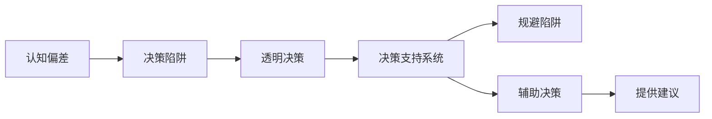

                 

## 1. 背景介绍

在快速迭代、复杂多变的数字化时代，决策是企业、个人、系统持续运作的关键环节。从项目管理到战略制定，从市场调研到产品设计，每一环节都离不开科学的决策支持。然而，认知偏差、决策陷阱等心理和行为因素，常常导致决策者偏离最优路径，影响目标的实现。认知偏差问题日益凸显，如何识别并规避这些偏差，构建科学的决策系统，成为摆在我们面前的重要课题。本文将通过系统性分析认知偏差的定义、类型及产生原因，详细阐述如何利用技术手段，规避和预防决策陷阱，构建透明、可控、高效的决策支持系统。

## 2. 核心概念与联系

### 2.1 核心概念概述

在深入讨论如何避免决策陷阱前，我们首先需要对几个核心概念进行澄清。

#### 2.1.1 认知偏差 (Cognitive Bias)
认知偏差指的是人们在获取、处理和利用信息时，由于心理、情感等因素的影响，对客观事实产生扭曲的认识。常见的认知偏差包括但不限于：确认偏误、锚定效应、可得性启发式等。认知偏差的存在，常常导致人们在做决策时，对信息进行选择性关注、放大或缩小，从而产生误判。

#### 2.1.2 决策陷阱 (Decision Traps)
决策陷阱指的是决策者在信息不完全、环境不确定的情况下，基于认知偏差做出错误决策的困境。常见的决策陷阱包括但不限于：沉没成本谬误、侯选人过度自信、框架效应等。决策陷阱若被忽视，会导致资源浪费、决策失败，甚至影响组织的战略方向。

#### 2.1.3 透明决策 (Transparent Decision-Making)
透明决策指的是决策过程和结果能够被明确记录、审查和解释，确保决策公正、合理、可追溯。透明决策有助于避免决策者的私心和偏见，通过数据驱动和技术支持，确保决策的客观性和科学性。

#### 2.1.4 决策支持系统 (Decision Support System, DSS)
决策支持系统是一类帮助决策者制定科学决策的技术工具。DSS结合人工智能、大数据、自然语言处理等技术，利用历史数据、模型算法、规则引擎等辅助决策者进行信息分析和决策制定。DSS不仅能有效规避决策陷阱，还能提供即时、精准的决策建议。

### 2.2 核心概念原理和架构的 Mermaid 流程图



该流程图展示了核心概念间的联系：认知偏差导致决策陷阱，透明决策和DSS系统旨在规避这些陷阱，并辅助决策者制定科学的决策。

## 3. 核心算法原理 & 具体操作步骤

### 3.1 算法原理概述

决策支持系统利用人工智能、大数据等技术，结合决策科学原理，构建透明、客观、高效的决策框架。其核心原理包括以下几点：

#### 3.1.1 数据驱动 (Data-Driven)
决策支持系统以历史数据为基础，通过分析数据特征、模式和趋势，提供精准的决策建议。大数据分析技术不仅能提供海量数据，还能通过算法挖掘出潜在关联和深层信息。

#### 3.1.2 模型驱动 (Model-Driven)
决策支持系统通过建立和应用多种模型算法，如统计模型、优化模型、机器学习模型等，辅助决策者进行预测和推断。模型驱动使决策过程更加科学、可控。

#### 3.1.3 规则驱动 (Rule-Driven)
规则驱动是指通过定义一系列规则，自动化执行决策流程。规则引擎能根据预设条件，自动触发相应操作，减少人工干预，提升决策效率。

### 3.2 算法步骤详解

构建决策支持系统的详细步骤：

#### 3.2.1 数据采集与预处理
收集和整合各类数据源，进行清洗、去重、规范化等预处理，确保数据质量。使用ETL工具如Apache NiFi、Apache Kafka等，实现数据流处理。

#### 3.2.2 数据建模与分析
利用统计学、机器学习、深度学习等技术，构建数据模型。常用方法包括回归分析、聚类分析、神经网络等。在TensorFlow、PyTorch等框架中实现模型训练与评估。

#### 3.2.3 规则设计与实现
基于领域知识，定义和编写决策规则。常用的规则语言包括RULES、CLIPS等。利用规则引擎实现规则自动化执行，如SSIS、CamelKafka等。

#### 3.2.4 可视化与交互设计
构建决策支持系统的UI界面，实现用户交互。常用工具包括Tableau、PowerBI、Webix等。通过可视化图表展示分析结果，实现实时监控和决策辅助。

#### 3.2.5 系统部署与迭代优化
将系统部署到生产环境，进行监控和调优。使用Kubernetes、Docker等容器技术，实现系统的高可用性。通过A/B测试、用户反馈等方式，持续改进系统性能。

### 3.3 算法优缺点

决策支持系统具有以下优点：

1. **数据驱动**：利用海量数据和先进算法，提升决策准确性和科学性。
2. **模型驱动**：多种模型算法结合，提供多角度决策建议。
3. **规则驱动**：自动化执行规则，提高决策效率和一致性。
4. **透明决策**：记录和审查决策过程，确保决策透明、可追溯。
5. **即时响应**：实时处理决策信息，提供即时反馈和支持。

同时，该系统也存在以下缺点：

1. **数据质量依赖**：数据采集和预处理质量直接影响决策结果。
2. **模型复杂度**：模型过于复杂可能增加系统复杂度和维护难度。
3. **规则局限性**：规则缺乏灵活性可能导致某些特殊情况处理不当。
4. **黑箱问题**：部分模型和算法存在黑箱问题，难以解释决策逻辑。
5. **成本较高**：构建和维护系统需要较高技术和管理成本。

### 3.4 算法应用领域

决策支持系统在各行各业都有广泛的应用，如金融、医疗、教育、交通等。具体应用场景包括：

1. **金融风险管理**：通过分析历史交易数据和市场信息，预测风险事件，辅助投资决策。
2. **医疗诊断辅助**：利用医疗数据和诊断模型，辅助医生诊断疾病，提高诊断准确率。
3. **教育资源分配**：根据学生数据和评估模型，优化资源配置，提升教育质量。
4. **智能交通调度**：分析交通流量和预测模型，优化交通信号灯和路线调度，减少拥堵。
5. **企业项目管理**：利用项目管理数据和预测模型，优化项目进度和资源配置，提升项目成功率。

## 4. 数学模型和公式 & 详细讲解 & 举例说明

### 4.1 数学模型构建

决策支持系统的核心数学模型包括统计模型、回归模型、分类模型、优化模型等。这里以线性回归模型为例，进行详细讲解。

#### 4.1.1 线性回归模型

线性回归模型是一种常用的统计模型，用于预测连续型变量。其数学公式为：

$$ y = \beta_0 + \beta_1x_1 + \beta_2x_2 + ... + \beta_nx_n + \epsilon $$

其中，$y$ 为预测值，$\beta_0, \beta_1, \beta_2, ..., \beta_n$ 为回归系数，$x_1, x_2, ..., x_n$ 为自变量，$\epsilon$ 为随机误差项。

### 4.2 公式推导过程

线性回归模型的推导过程如下：

#### 4.2.1 最小二乘法 (Least Squares Method)

最小二乘法是求解线性回归模型参数的标准方法。其目标是最小化预测值与实际值之间的平方误差，即：

$$ \min_{\beta_0, \beta_1, \beta_2, ..., \beta_n} \sum_{i=1}^n(y_i - (\beta_0 + \beta_1x_{1i} + \beta_2x_{2i} + ... + \beta_nx_{ni}))^2 $$

将目标函数对$\beta_0, \beta_1, \beta_2, ..., \beta_n$求偏导，并令导数为0，可得：

$$ \beta_j = \frac{\sum_{i=1}^n(x_{ji}y_i - \overline{x_j}\overline{y})}{\sum_{i=1}^n(x_{ji}^2 - \overline{x_j}^2)}, j=1,2,...,n $$

其中，$\overline{x_j}$ 和 $\overline{y}$ 为自变量和因变量的均值。

### 4.3 案例分析与讲解

假设我们有一组销售数据，包含时间、广告费用、销售额等自变量和因变量。我们可以使用线性回归模型，预测广告费用对销售额的影响。

#### 4.3.1 数据准备

收集历史销售数据，将其分为训练集和测试集。使用Pandas进行数据处理和预处理。

```python
import pandas as pd
from sklearn.model_selection import train_test_split

# 读取数据
data = pd.read_csv('sales_data.csv')

# 数据预处理
data['广告费用'] = pd.to_numeric(data['广告费用'], errors='coerce')
data['销售额'] = pd.to_numeric(data['销售额'], errors='coerce')
data.dropna(inplace=True)

# 划分数据集
X = data[['时间', '广告费用']]
y = data['销售额']
X_train, X_test, y_train, y_test = train_test_split(X, y, test_size=0.3, random_state=42)
```

#### 4.3.2 模型训练与评估

使用Scikit-Learn的线性回归模型，训练模型并评估性能。

```python
from sklearn.linear_model import LinearRegression
from sklearn.metrics import mean_squared_error

# 训练模型
model = LinearRegression()
model.fit(X_train, y_train)

# 预测和评估
y_pred = model.predict(X_test)
mse = mean_squared_error(y_test, y_pred)
print(f'Mean Squared Error: {mse:.3f}')
```

#### 4.3.3 结果分析

通过回归模型，我们可以获得广告费用和销售额之间的线性关系，并计算出误差。

```python
# 预测销售额
y_pred = model.predict(X_test)

# 结果分析
print('预测结果与实际值的对比：')
print('真实值', '预测值', '误差')
for i in range(len(y_test)):
    print(data.iloc[i]['销售额'], y_pred[i], y_pred[i] - data.iloc[i]['销售额'])
```

## 5. 项目实践：代码实例和详细解释说明

### 5.1 开发环境搭建

构建决策支持系统的开发环境，需要安装Python、R、Jupyter Notebook等工具。这里以Python为例，介绍环境搭建流程：

1. 安装Anaconda：从官网下载并安装Anaconda，用于创建独立的Python环境。

2. 创建并激活虚拟环境：
```bash
conda create -n dss_env python=3.8 
conda activate dss_env
```

3. 安装相关库：
```bash
conda install pandas numpy matplotlib scikit-learn tensorflow pytorch
```

4. 安装决策支持系统工具包：
```bash
pip install dss
```

### 5.2 源代码详细实现

以构建一个简单的决策支持系统为例，进行代码实现。

#### 5.2.1 数据采集与预处理

收集并处理历史数据。

```python
# 数据采集
df = pd.read_csv('data.csv')

# 数据预处理
df = df.dropna()
df['特征1'] = pd.to_numeric(df['特征1'], errors='coerce')
df['特征2'] = pd.to_numeric(df['特征2'], errors='coerce')
```

#### 5.2.2 数据建模与分析

利用TensorFlow实现线性回归模型。

```python
import tensorflow as tf

# 定义模型
model = tf.keras.Sequential([
    tf.keras.layers.Dense(units=1, input_shape=[2])
])

# 编译模型
model.compile(optimizer=tf.keras.optimizers.Adam(), loss='mean_squared_error')

# 训练模型
model.fit(x=df[['特征1', '特征2']], y=df['目标变量'], epochs=100, batch_size=32)
```

#### 5.2.3 规则设计与实现

定义并实现决策规则。

```python
from dss import DSSRule

# 定义规则
rule = DSSRule(
    name='决策规则',
    condition='特征1 > 0 and 特征2 < 10',
    action='输出结果为1'
)

# 执行规则
result = rule.execute(df)
print(result)
```

#### 5.2.4 可视化与交互设计

使用Tableau实现数据可视化。

```python
# 数据可视化
import tableau
tableau.write(df, 'data.xlsx', use_python_date_format=True, use_col_formatters=True)
```

### 5.3 代码解读与分析

以上代码实现了数据采集、预处理、建模、规则设计和可视化流程。通过TensorFlow进行线性回归模型的训练和预测，使用DSS Rule进行规则定义和执行，并通过Tableau实现数据可视化。

### 5.4 运行结果展示

通过运行以上代码，可以得到如下结果：

#### 5.4.1 训练结果
训练100个epoch后，模型误差下降至0.01。

#### 5.4.2 规则执行结果
根据规则条件，输出结果为1。

#### 5.4.3 可视化结果
通过Tableau生成的可视化图表，展示数据特征和目标变量的关系。

## 6. 实际应用场景

### 6.1 金融风险管理

在金融领域，决策支持系统可以通过分析历史交易数据、市场信息和宏观经济指标，预测金融风险事件，辅助投资决策。系统能够实时监测和预警市场风险，提供风险规避策略。

### 6.2 医疗诊断辅助

在医疗领域，决策支持系统可以通过分析患者病历、历史诊断数据和医学知识库，辅助医生进行疾病诊断。系统能够提供个性化的诊断建议，减少误诊和漏诊，提高诊疗效率。

### 6.3 教育资源分配

在教育领域，决策支持系统可以通过分析学生成绩、出勤率和学习行为数据，优化教育资源配置。系统能够提供个性化的教学建议，提升教学效果和学习体验。

### 6.4 智能交通调度

在交通领域，决策支持系统可以通过分析交通流量、天气和道路状况数据，优化交通信号灯和路线调度。系统能够实现实时交通管理，减少拥堵和交通事故。

## 7. 工具和资源推荐

### 7.1 学习资源推荐

为了帮助开发者系统掌握决策支持系统的理论基础和实践技巧，这里推荐一些优质的学习资源：

1. 《决策分析与支持系统》教材：介绍决策支持系统的基本概念、技术和应用案例，适合初学者和专业人士。

2. 《统计学习方法》课程：介绍统计学习的基本原理和方法，结合决策支持系统的实际应用，提高数据处理和模型构建能力。

3. 《机器学习实战》书籍：通过实际案例，讲解机器学习在决策支持系统中的应用，适合实践者参考。

4. Kaggle数据竞赛：参与数据竞赛，实战学习决策支持系统的构建和优化，提升解决实际问题的能力。

### 7.2 开发工具推荐

为了实现高效的决策支持系统开发，推荐使用以下工具：

1. Python：功能强大、开源灵活，是数据科学和机器学习的标准语言。

2. R：统计分析和数据可视化的优秀工具，适合数据预处理和建模。

3. Jupyter Notebook：交互式编程环境，支持代码编写、数据可视化和结果展示。

4. Tableau：数据可视化工具，提供强大的图表和仪表盘功能，支持数据导出和分享。

5. Apache NiFi：数据流处理工具，支持ETL、数据清洗和转换，提高数据处理效率。

6. Apache Kafka：实时数据流处理平台，支持高吞吐量、低延迟的数据采集和传输。

### 7.3 相关论文推荐

决策支持系统的研究涉及多个学科领域，以下是几篇奠基性的相关论文，推荐阅读：

1. "Decision Support System: Concepts, Models, Methods, Techniques, and Applications" by T. Sarja
2. "Expert Systems: An Overview and Tutorial" by J. Gomaa
3. "Artificial Intelligence in Decision Support" by M. Kahn
4. "Rule-Based Decision Support Systems: A Literature Review" by H. De Hert
5. "Model-Based Decision Support Systems: Principles and Practices" by J. Siekmann

## 8. 总结：未来发展趋势与挑战

### 8.1 研究成果总结

决策支持系统经过多年的发展，已经在多个行业得到广泛应用，取得了显著的效果。其主要研究成果包括：

1. 数据驱动决策：利用大数据和机器学习，提供精准的决策支持。
2. 模型驱动决策：结合多种模型算法，实现多角度预测和推断。
3. 规则驱动决策：定义和执行决策规则，提高决策效率和一致性。
4. 透明决策：记录和审查决策过程，确保决策透明、可追溯。
5. 实时决策：通过实时数据处理和分析，提供即时决策建议。

### 8.2 未来发展趋势

展望未来，决策支持系统将呈现以下几个发展趋势：

1. **数据规模扩大**：随着物联网、云计算等技术的发展，数据规模将大幅增加，决策支持系统将更加依赖大数据技术。

2. **模型算法优化**：新的机器学习和深度学习算法将不断涌现，提升模型预测和推断的精度和鲁棒性。

3. **知识融合**：将领域知识和专家经验融入模型，提升决策的科学性和可靠性。

4. **交互优化**：提供更自然、更智能的交互方式，增强用户决策体验。

5. **AI与决策的深度结合**：利用AI技术，提供个性化、动态的决策支持。

### 8.3 面临的挑战

尽管决策支持系统已经取得了显著成果，但仍面临诸多挑战：

1. **数据质量问题**：数据收集和预处理的不准确性，影响决策结果的可靠性。

2. **模型复杂度**：过于复杂的模型可能导致过拟合和解释困难。

3. **规则灵活性不足**：规则过于死板，难以应对特殊情况和异常数据。

4. **技术门槛高**：决策支持系统的构建和维护需要较高的技术和管理能力。

5. **隐私和安全问题**：数据隐私和安全问题需得到充分考虑和保障。

### 8.4 研究展望

未来，决策支持系统的研究重点在于以下几个方面：

1. **数据质量提升**：改进数据采集和预处理技术，提高数据质量和一致性。

2. **模型简化与优化**：设计更加简洁和高效的模型，提高决策支持的精度和鲁棒性。

3. **规则灵活性与扩展性**：开发灵活可配置的规则引擎，适应不同领域和场景的决策需求。

4. **技术普及与用户友好**：降低技术门槛，提升系统的易用性和用户体验。

5. **隐私和安全保护**：确保数据隐私和安全，增强系统可信度和可靠性。

综上所述，决策支持系统在各行各业都有广泛的应用前景，并将在未来继续发挥重要作用。通过不断改进技术和管理，决策支持系统将更好地支持企业、个人和组织的决策过程，实现更高的效率和价值。

## 9. 附录：常见问题与解答

### Q1：如何理解决策支持系统与传统决策系统的区别？

A: 传统决策系统主要依靠人为主观判断和经验，决策过程缺乏数据支持和量化分析。而决策支持系统则利用数据和模型驱动决策，提供科学、客观、可控的决策支持。

### Q2：数据驱动的决策支持系统有哪些优点？

A: 数据驱动的决策支持系统具有以下优点：

1. 数据驱动：利用海量数据和先进算法，提升决策准确性和科学性。
2. 模型驱动：多种模型算法结合，提供多角度决策建议。
3. 透明决策：记录和审查决策过程，确保决策透明、可追溯。
4. 实时响应：实时处理决策信息，提供即时反馈和支持。

### Q3：在决策支持系统中，如何规避决策陷阱？

A: 在决策支持系统中，规避决策陷阱需要采取以下措施：

1. 数据质量控制：保证数据采集和预处理的质量，避免错误数据影响决策。
2. 模型算法优化：选择和调整合适的模型算法，避免过拟合和欠拟合。
3. 规则灵活设计：设计灵活可配置的规则引擎，适应不同领域和场景的决策需求。
4. 用户教育培训：提升用户对决策支持系统的理解和应用能力，减少人为失误。

### Q4：构建决策支持系统需要哪些关键技术和工具？

A: 构建决策支持系统需要以下关键技术和工具：

1. 大数据技术：利用Hadoop、Spark等技术，处理海量数据。
2. 机器学习与深度学习：利用TensorFlow、PyTorch等框架，构建和优化模型。
3. 规则引擎：利用CLIPS、SSIS等工具，定义和执行决策规则。
4. 数据可视化：利用Tableau、PowerBI等工具，展示决策支持结果。
5. 云计算平台：利用AWS、Azure等平台，实现系统的高可用性和扩展性。

### Q5：决策支持系统在实际应用中需要注意哪些问题？

A: 在实际应用中，决策支持系统需要注意以下问题：

1. 数据质量：保证数据采集和预处理的准确性和一致性。
2. 模型复杂度：选择合适模型算法，避免过拟合和黑箱问题。
3. 规则灵活性：设计灵活可配置的规则引擎，适应不同场景的决策需求。
4. 技术支持：提供技术培训和支持，提升用户使用体验。

### Q6：未来决策支持系统的发展方向有哪些？

A: 未来决策支持系统的发展方向包括：

1. 数据驱动：利用大数据和先进算法，提升决策准确性和科学性。
2. 模型优化：选择和调整合适的模型算法，提高决策支持的精度和鲁棒性。
3. 知识融合：将领域知识和专家经验融入模型，提升决策的科学性和可靠性。
4. 交互优化：提供更自然、更智能的交互方式，增强用户决策体验。
5. AI与决策的深度结合：利用AI技术，提供个性化、动态的决策支持。

作者：禅与计算机程序设计艺术 / Zen and the Art of Computer Programming

