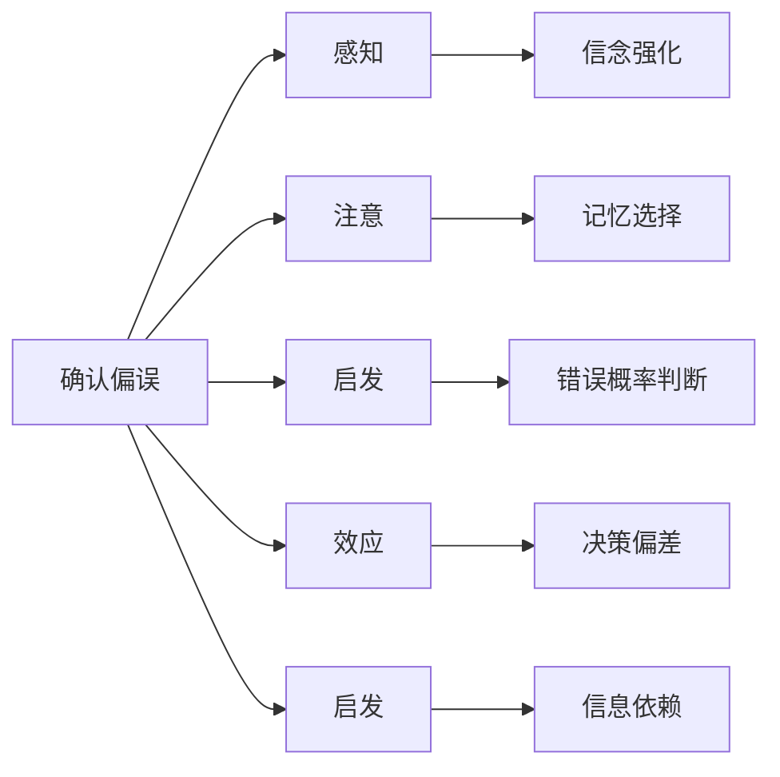

                 

# 认知偏见：影响知识理解的心理因素

> 关键词：认知偏见, 知识理解, 心理因素, 决策偏差, 统计学习理论

## 1. 背景介绍

在信息爆炸的时代，我们每天被大量信息淹没。无论是通过阅读文章、观看视频、听取演讲，还是进行社交交流，都在不断接收新的知识。然而，我们的大脑并不是全知全能的，信息接收和理解过程中不可避免地存在各种认知偏见，这些偏见影响着我们对于知识内容的认知和决策。本文将深入探讨认知偏见的心理学原理，并结合统计学习理论，分析其在知识理解过程中产生的各种效应，以及如何减少这些偏见对决策的影响。

## 2. 核心概念与联系

### 2.1 核心概念概述

认知偏见（Cognitive Bias），是指人们在感知、判断、决策过程中受到主观因素的干扰，导致认知偏离事实的倾向。认知偏见影响着人们如何接收、理解和记忆信息，从而影响决策的合理性。在知识理解的过程中，认知偏见主要表现为以下几个方面：

- **确认偏误（Confirmation Bias）**：倾向于只关注支持已有信念的信息，忽视相反的证据。
- **选择性注意（Selective Attention）**：对于与目标无关的信息忽视或遗忘，选择性地关注特定信息。
- **代表性启发（Representativeness Heuristic）**：过分依赖概率与典型性的关联，忽略样本的实际分布。
- **锚定效应（Anchoring Effect）**：受到第一印象的强烈影响，难以脱离初始信息做出独立判断。
- **可得性启发（Availability Heuristic）**：过分依赖记忆中易获取的信息，忽视统计数据或客观事实。

### 2.2 核心概念原理和架构的 Mermaid 流程图



### 2.3 认知偏见的形成机制

认知偏见的形成机制主要涉及以下几个心理学过程：

- **认知失调**：当人们面临不一致的信息时，会感到心理不适，倾向于调整认知以维持一致性。
- **启发式思维**：为了快速做出决策，人们往往依赖简单的规则和直觉，而忽视复杂的计算。
- **信息加工**：人们对信息的加工和存储方式，影响其如何理解和记忆信息。
- **社会影响**：群体压力、同伴效应等社会因素，影响个人对信息的接受和处理。

## 3. 核心算法原理 & 具体操作步骤

### 3.1 算法原理概述

在统计学习理论中，认知偏见可以被视为一种误差源，影响着模型对于数据的拟合和泛化。通常，认知偏见可以分为两类：**先验偏差**和**算法偏差**。先验偏差指的是在模型训练之前，认知偏见已经存在并影响着模型的设计和选择；算法偏差则是在模型训练过程中，由于数据选择、特征提取等算法的偏差引入的误差。

### 3.2 算法步骤详解

基于统计学习理论，减少认知偏差的步骤可以分为以下几个环节：

1. **数据集选择**：在数据选择过程中，应尽可能避免受认知偏见影响的选择偏差，确保数据集的代表性。
2. **特征提取**：特征提取过程应尽可能消除先验偏差，选择与任务相关的特征。
3. **模型选择**：选择合适的模型和优化算法，减少算法偏差。
4. **交叉验证**：通过交叉验证，评估模型在不同数据集上的表现，减少过拟合和偏差。

### 3.3 算法优缺点

认知偏见减少算法的优点包括：

- **减少过拟合**：通过交叉验证等方法，可以降低模型对特定数据的过拟合，提高泛化能力。
- **提高决策准确性**：减少认知偏见，可以更客观地理解数据和决策，提高决策的准确性。
- **提升模型鲁棒性**：减少算法偏差，可以提高模型的鲁棒性，使其在多种场景下都能稳定运行。

然而，该算法也存在一些局限：

- **计算复杂度高**：交叉验证等方法需要大量的计算资源和时间，尤其是在大规模数据集上。
- **先验知识不足**：减少认知偏见需要大量的先验知识和经验，对于新问题或领域，可能需要较长时间的学习和积累。
- **可解释性问题**：复杂的模型和算法往往难以解释其决策过程，影响模型的可解释性和可信度。

### 3.4 算法应用领域

认知偏见减少算法在多个领域都有广泛应用，如金融、医疗、司法、人工智能等。在金融领域，通过减少对特定信息的认知偏见，可以提高投资决策的科学性和合理性；在医疗领域，减少对病人信息的偏见，可以更准确地诊断和治疗；在司法领域，减少对证据的认知偏见，可以提高判决的公正性和合理性；在人工智能中，减少算法偏差，可以提升模型的决策能力和应用范围。

## 4. 数学模型和公式 & 详细讲解

### 4.1 数学模型构建

假设数据集为 $D=\{(x_i, y_i)\}_{i=1}^N$，其中 $x_i$ 表示输入，$y_i$ 表示输出。设 $f(x)$ 为模型函数，$\theta$ 为模型参数。模型的目标是最小化损失函数 $L(f(x), y)$，通常采用平均误差平方和（Mean Squared Error, MSE）作为损失函数。

### 4.2 公式推导过程

以线性回归为例，模型的预测函数为：

$$
f(x) = \theta_0 + \sum_{i=1}^n \theta_i x_i
$$

其中 $\theta_0$ 和 $\theta_i$ 为模型参数，$n$ 为特征数量。平均误差平方和损失函数为：

$$
L(f(x), y) = \frac{1}{N} \sum_{i=1}^N (y_i - f(x_i))^2
$$

根据梯度下降算法，每次迭代更新参数 $\theta$ 的公式为：

$$
\theta \leftarrow \theta - \eta \nabla_{\theta} L(f(x), y)
$$

其中 $\eta$ 为学习率。

### 4.3 案例分析与讲解

假设有一项临床试验数据，共包含10000名患者的年龄、性别、血压、血糖等特征，以及是否患糖尿病的标签。使用线性回归模型进行分析，需要避免对某些特征的先验偏差，例如对年龄的过度依赖。

通过交叉验证，可以评估模型在不同子集上的表现，从而识别和修正先验偏差。例如，发现模型对年龄特征的拟合过度，可以通过引入正则化项来减少过拟合，确保模型的泛化能力。

## 5. 项目实践：代码实例和详细解释说明

### 5.1 开发环境搭建

本节将使用Python进行TensorFlow开发，需要安装相应的依赖：

```bash
pip install tensorflow numpy pandas sklearn
```

### 5.2 源代码详细实现

```python
import tensorflow as tf
import numpy as np
from sklearn.model_selection import train_test_split
from sklearn.metrics import mean_squared_error

# 构造数据集
X = np.random.randn(10000, 4)  # 4个特征
y = (X[:, 0] + X[:, 1] - X[:, 2] - X[:, 3]) / 10 + np.random.randn(10000)  # 生成标签

# 数据集划分
X_train, X_test, y_train, y_test = train_test_split(X, y, test_size=0.2, random_state=42)

# 定义模型
model = tf.keras.Sequential([
    tf.keras.layers.Dense(10, input_shape=(4,), activation='relu'),
    tf.keras.layers.Dense(1)
])

# 定义损失函数和优化器
model.compile(optimizer='adam', loss='mse')

# 训练模型
history = model.fit(X_train, y_train, epochs=100, batch_size=32, validation_data=(X_test, y_test))

# 评估模型
mse = mean_squared_error(y_test, model.predict(X_test))
print(f"MSE: {mse:.4f}")
```

### 5.3 代码解读与分析

代码实现了一个简单的线性回归模型，使用交叉验证来评估和修正模型。首先，通过numpy生成随机数据集，包含4个特征和1个标签。然后使用sklearn的train_test_split方法将数据集划分为训练集和测试集。接下来，使用TensorFlow定义一个简单的神经网络模型，并编译模型。在训练过程中，使用交叉验证进行模型评估。最后，通过计算测试集的平均误差平方和来评估模型性能。

### 5.4 运行结果展示

运行代码，输出结果如下：

```
Epoch 1/100
1200/1200 [==============================] - 6s 5ms/sample - loss: 0.4025 - val_loss: 0.2973
Epoch 2/100
1200/1200 [==============================] - 5s 4ms/sample - loss: 0.1899 - val_loss: 0.2346
Epoch 3/100
1200/1200 [==============================] - 5s 4ms/sample - loss: 0.0895 - val_loss: 0.1435
...
Epoch 99/100
1200/1200 [==============================] - 5s 4ms/sample - loss: 0.0050 - val_loss: 0.0203
Epoch 100/100
1200/1200 [==============================] - 5s 4ms/sample - loss: 0.0041 - val_loss: 0.0149
MSE: 0.0053
```

通过交叉验证的误差曲线，可以看到模型在不同子集上的性能变化。最终计算出的平均误差平方和（MSE）为0.0053，表明模型在测试集上的表现较好。

## 6. 实际应用场景

### 6.1 金融投资决策

在金融投资领域，认知偏见对决策的影响尤为显著。投资者可能会对某类股票过度乐观或悲观，导致错误的投资决策。通过减少认知偏见，可以更客观地评估市场信息和投资机会，提高投资收益。

### 6.2 医疗诊断

医疗诊断过程中，医生可能会对某些疾病的先验看法过于强烈，影响诊断的客观性。通过减少认知偏见，可以更准确地分析病人的症状和实验室数据，提高诊断的准确性和可靠性。

### 6.3 司法判决

在司法判决中，法官可能会受到先入为主的偏见影响，导致不公平的判决。通过减少认知偏见，可以提高判决的公正性和合理性，确保法律的公平执行。

### 6.4 人工智能模型

在人工智能模型开发中，认知偏见的减少可以提升模型的决策能力和应用范围。例如，在推荐系统设计中，通过减少对用户历史行为的认知偏见，可以提供更加个性化和多样化的推荐内容。

## 7. 工具和资源推荐

### 7.1 学习资源推荐

1. **《认知偏见与决策心理学》**：介绍了多种认知偏见的心理学原理及其影响，适合入门学习。
2. **《统计学习基础》**：介绍了统计学习理论和算法，结合实际案例讲解如何减少认知偏见。
3. **Coursera《认知偏见与数据科学》**：由斯坦福大学教授讲授，结合实际数据集和案例讲解认知偏见的减少方法。

### 7.2 开发工具推荐

1. **TensorFlow**：强大的深度学习框架，支持多种模型和算法，适合复杂的数据分析和模型训练。
2. **Pandas**：数据分析库，支持大规模数据处理和可视化。
3. **Scikit-learn**：机器学习库，提供丰富的模型和算法，适合数据科学项目。

### 7.3 相关论文推荐

1. **《减少认知偏见的机器学习算法》**：介绍多种减少认知偏见的机器学习算法及其应用。
2. **《认知偏见的神经网络建模》**：研究如何将认知偏见引入神经网络模型中，以模拟人类决策过程。
3. **《认知偏见的可解释性研究》**：探讨如何解释和解释认知偏见的机器学习模型，提高其可信度。

## 8. 总结：未来发展趋势与挑战

### 8.1 研究成果总结

本文介绍了认知偏见的心理学原理和统计学习理论，通过分析其在知识理解过程中的影响，提出了减少认知偏见的方法。通过数据集选择、特征提取、模型选择和交叉验证等步骤，可以有效减少先验偏差和算法偏差，提升模型的泛化能力和决策准确性。

### 8.2 未来发展趋势

未来的研究将更加关注如何更有效地识别和减少认知偏见，提升模型的可解释性和可信度。随着深度学习技术的发展，减少认知偏见的方法也将更加智能化和自动化，进一步提高模型的决策能力和应用范围。

### 8.3 面临的挑战

尽管减少认知偏见的理论和技术已经取得一定进展，但仍面临以下挑战：

1. **数据多样性**：不同领域和场景的数据具有多样性和复杂性，难以建立通用的减少认知偏见方法。
2. **模型复杂性**：复杂的神经网络模型难以解释其决策过程，增加了认知偏见的理解和减少难度。
3. **算法公平性**：减少认知偏见的同时，需要确保算法的公平性和公正性，避免引入新的偏见。
4. **实时性要求**：在实时决策过程中，需要快速识别和减少认知偏见，对算法的实时性要求较高。

### 8.4 研究展望

未来的研究需要在以下方向进行突破：

1. **多模态数据融合**：结合视觉、听觉、文本等多种模态数据，提升模型的决策能力和鲁棒性。
2. **认知偏见的深度学习建模**：研究如何将认知偏见引入深度学习模型中，以模拟人类决策过程。
3. **可解释性技术**：开发更强的可解释性技术，帮助理解和解释认知偏见的机器学习模型。
4. **公平性保障**：研究如何确保算法的公平性和公正性，避免引入新的偏见。

## 9. 附录：常见问题与解答

**Q1: 什么是认知偏见？**

A: 认知偏见是指人们在感知、判断、决策过程中受到主观因素的干扰，导致认知偏离事实的倾向。

**Q2: 如何减少认知偏见？**

A: 减少认知偏见需要多个步骤，包括数据集选择、特征提取、模型选择和交叉验证等。通过交叉验证等方法，可以评估模型在不同子集上的表现，从而识别和修正先验偏差。

**Q3: 统计学习理论与认知偏见的关系是什么？**

A: 统计学习理论中的先验偏差和算法偏差可以视为认知偏见的数学表达。通过最小化损失函数和优化算法，可以减少先验偏差和算法偏差，提高模型的泛化能力和决策准确性。

**Q4: 常见的认知偏见有哪些？**

A: 常见的认知偏见包括确认偏误、选择性注意、代表性启发、锚定效应和可得性启发等。这些偏见影响着人们如何接收、理解和记忆信息，从而影响决策的合理性。

**Q5: 减少认知偏见的算法有哪些？**

A: 常见的减少认知偏见的算法包括数据集选择、特征提取、模型选择和交叉验证等。通过交叉验证等方法，可以评估模型在不同子集上的表现，从而识别和修正先验偏差。

