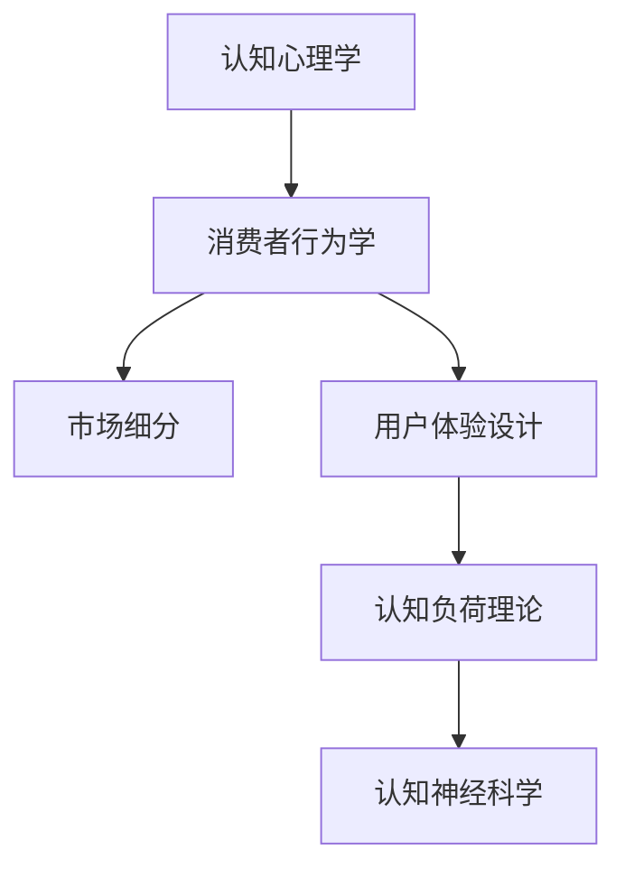

                 

# 认知科学在市场营销中的应用：消费者行为学

> 关键词：认知科学,消费者行为学,市场营销,心理学,产品设计,用户体验,人工智能,数据驱动

## 1. 背景介绍

### 1.1 问题由来
市场营销的本质是理解并影响消费者的行为。然而，传统的营销理论往往基于一些假设，如“消费者是理性的”、“市场是线性的”等，这些假设在现代复杂多变的环境中已经不再适用。认知科学作为研究人类思维和行为的科学，为市场营销提供了更为深刻的洞察。认知科学关注个体如何接收、处理和反应外部信息，揭示了消费者决策背后的心理机制和认知过程。

### 1.2 问题核心关键点
认知科学在市场营销中的应用，主要集中在以下几个方面：
- 消费者行为：如何通过认知模型来理解消费者在不同情境下的决策行为。
- 产品设计：如何根据消费者的认知特征设计更具吸引力的产品。
- 用户体验：如何通过设计符合消费者认知习惯的交互界面，提升用户体验。
- 市场营销策略：如何基于消费者认知模型制定有效的营销策略。

认知科学的引入，使得市场营销从简单的“推销”转变为深入的“行为影响”，为品牌建立长期忠诚度和价值提供了新的路径。

## 2. 核心概念与联系

### 2.1 核心概念概述

认知科学在市场营销中的应用，涉及多个核心概念，包括：

- 认知心理学：研究个体如何感知、记忆、思维和决策。
- 消费者行为学：研究消费者的需求、动机、态度和行为。
- 市场细分：根据消费者的认知差异，将市场划分为不同的细分市场。
- 用户体验设计：通过了解消费者的认知过程，设计更好的用户界面和交互体验。
- 认知负荷理论：研究用户在处理信息时所面临的认知负荷，如何减轻认知负荷以提升用户接受度。
- 认知神经科学：利用脑成像技术研究消费者行为背后的神经机制。

这些概念之间的逻辑关系可以通过以下Mermaid流程图来展示：



这个流程图展示了一系列从基础认知到具体应用的过程，帮助我们理解认知科学如何指导市场营销策略的设计和执行。

## 3. 核心算法原理 & 具体操作步骤

### 3.1 算法原理概述
认知科学在市场营销中的应用，主要基于以下几个算法原理：

- 认知负荷理论：认知负荷是指在信息处理过程中，个体对认知资源的消耗。市场营销策略需要考虑如何减轻消费者的认知负荷，提升信息吸收和理解效率。
- 认知一致性理论：认知一致性指的是个体在处理信息时，希望信息与其已有认知一致。市场营销策略需确保信息的一致性，避免消费者的认知冲突。
- 认知失调理论：认知失调是指个体在行为与认知不一致时产生的心理不适感。市场营销策略需利用认知失调原理，引导消费者采取与品牌一致的行动。
- 社会认同理论：社会认同理论认为，个体通过认同某个群体来增强自身归属感和身份认同。市场营销策略需设计出有吸引力、易识别的品牌符号，提升消费者的认同感。

### 3.2 算法步骤详解

基于认知科学的市场营销策略设计，一般包括以下几个关键步骤：

**Step 1: 数据收集与分析**

1. 收集消费者行为数据：通过问卷调查、社交媒体分析、交易数据等手段，收集消费者的行为数据。
2. 使用文本分析、情感分析等工具，分析消费者的心理状态和情感倾向。

**Step 2: 构建认知模型**

1. 根据认知负荷理论，设计简洁、直观的信息呈现方式，减少消费者的认知负荷。
2. 根据认知一致性理论，确保营销信息与消费者已有认知一致，避免冲突。
3. 使用认知失调理论，设计有吸引力的营销活动，引导消费者采取与品牌一致的行动。
4. 根据社会认同理论，设计易识别的品牌符号，提升消费者的认同感。

**Step 3: 设计市场营销策略**

1. 利用数据分析结果，识别目标消费者的认知特征。
2. 根据认知模型，设计符合消费者认知习惯的产品和服务。
3. 制定信息传播策略，选择最有效的传播渠道和方式。
4. 设定评估指标，监测营销活动的效果，并根据反馈进行调整。

**Step 4: 实施与优化**

1. 实施营销策略，收集消费者反馈。
2. 根据反馈，对营销策略进行优化调整。
3. 不断迭代，逐步提升营销效果。

### 3.3 算法优缺点

基于认知科学的市场营销策略设计，具有以下优点：
1. 提升消费者体验：通过认知负荷理论和社会认同理论，可以设计出更加符合消费者认知习惯的交互界面和品牌符号，提升用户体验和品牌认同。
2. 增强信息传达效率：利用认知一致性理论和认知失调理论，可以设计出更有吸引力、更易理解的营销信息，提高信息传播效率。
3. 降低营销成本：通过细分市场和个性化营销，可以精准定位目标消费者，减少无效营销的浪费。

同时，该方法也存在一定的局限性：
1. 数据依赖性强：认知科学模型需要大量数据支持，收集和分析数据的过程较为复杂。
2. 模型复杂度高：认知科学模型涉及多个心理和行为理论，构建和优化模型需要高水平的技术支持。
3. 理论适用范围有限：认知科学模型主要适用于一些心理过程较为清晰、可测量的情境，对于较为复杂的情境可能无法完全适用。

尽管存在这些局限性，但认知科学的应用为市场营销提供了一种更为科学和系统的视角，有助于品牌建立长期的消费者信任和忠诚度。

### 3.4 算法应用领域

认知科学在市场营销中的应用，主要涉及以下领域：

- 产品设计：通过认知心理学研究消费者对产品的认知过程，设计出更具吸引力的产品。
- 广告创意：根据消费者认知特征，设计更加符合消费者心理预期的广告创意。
- 用户体验设计：通过认知负荷理论和认知一致性理论，提升用户体验和互动质量。
- 市场细分：根据消费者认知差异，进行市场细分，制定针对性营销策略。
- 品牌建设：通过社会认同理论，设计易识别、易认同的品牌符号，增强品牌认知度和认同感。

## 4. 数学模型和公式 & 详细讲解 & 举例说明

### 4.1 数学模型构建

认知科学在市场营销中的应用，需要构建多个数学模型来描述消费者行为和认知过程。以下是一个简单的消费者决策模型：

$$
\begin{aligned}
&\text{决策} = \text{效用} + \text{认知负荷} + \text{认知一致性} + \text{认知失调} \\
&\text{效用} = \text{产品特征} \times \text{用户偏好} \\
&\text{认知负荷} = \text{信息复杂度} \times \text{用户认知资源} \\
&\text{认知一致性} = \text{营销信息} \times \text{用户已有认知} \\
&\text{认知失调} = \text{用户行为} \times \text{用户认知} \times \text{认知失调系数}
\end{aligned}
$$

这个模型描述了消费者决策的多个影响因素，包括产品特征、用户偏好、信息复杂度、用户认知资源、营销信息、用户已有认知、用户行为和认知失调系数。

### 4.2 公式推导过程

以认知失调理论为例，进行推导：

假设消费者对某产品的初始认知为 $C_0$，经过营销活动后，新的认知为 $C_1$。若消费者购买该产品，则认知失调系数 $K$ 反映了认知失调的程度。

根据认知失调理论，消费者的认知失调成本为：

$$
\text{认知失调成本} = C_0 - C_1 \times K
$$

消费者采取与品牌一致的行动（购买产品）的成本最小化问题为：

$$
\min \quad C_0 - C_1 \times K
$$

解这个优化问题，得到：

$$
C_1 = \frac{C_0}{K}
$$

即在认知失调最小化的情况下，消费者的认知从 $C_0$ 调整到 $C_1$ 的最佳程度。

### 4.3 案例分析与讲解

以一家新品牌咖啡店的市场营销为例，进行详细分析：

1. **数据收集与分析**：
   - 通过问卷调查和社交媒体分析，收集消费者对咖啡的偏好和认知负荷。
   - 利用情感分析工具，了解消费者对咖啡品牌的情感倾向。

2. **构建认知模型**：
   - 根据认知负荷理论，设计简洁、直观的店面装修和菜单布局，减少消费者的认知负荷。
   - 根据认知一致性理论，确保品牌标志、口号等营销信息与消费者已有认知一致。
   - 设计有吸引力的促销活动，利用认知失调理论，引导消费者购买咖啡。
   - 利用社会认同理论，设计易识别、易认同的品牌符号，提升品牌认同感。

3. **设计市场营销策略**：
   - 根据数据和模型分析，识别目标消费者的认知特征。
   - 设计符合消费者认知习惯的产品和服务。
   - 制定信息传播策略，选择最有效的传播渠道和方式。
   - 设定评估指标，监测营销活动的效果，并根据反馈进行调整。

4. **实施与优化**：
   - 实施营销策略，收集消费者反馈。
   - 根据反馈，对营销策略进行优化调整。
   - 不断迭代，逐步提升营销效果。

## 5. 项目实践：代码实例和详细解释说明

### 5.1 开发环境搭建

在进行市场营销策略设计时，我们需要准备好开发环境。以下是使用Python进行数据分析和模型构建的环境配置流程：

1. 安装Anaconda：从官网下载并安装Anaconda，用于创建独立的Python环境。

2. 创建并激活虚拟环境：
```bash
conda create -n market-env python=3.8 
conda activate market-env
```

3. 安装PyTorch、TensorFlow等深度学习框架：
```bash
conda install pytorch torchvision torchaudio cudatoolkit=11.1 -c pytorch -c conda-forge
```

4. 安装Pandas、NumPy、Scikit-learn等数据处理和分析库：
```bash
pip install pandas numpy scikit-learn matplotlib tqdm jupyter notebook ipython
```

5. 安装相关可视化工具：
```bash
pip install seaborn plotly
```

完成上述步骤后，即可在`market-env`环境中开始市场营销策略的开发实践。

### 5.2 源代码详细实现

下面以一家新品牌咖啡店的市场营销策略设计为例，进行详细代码实现。

首先，定义数据处理函数：

```python
import pandas as pd
import numpy as np
from sklearn.model_selection import train_test_split
from sklearn.preprocessing import StandardScaler
from sklearn.linear_model import LogisticRegression
from sklearn.metrics import accuracy_score

# 读取数据
data = pd.read_csv('customer_data.csv')

# 特征工程
X = data[['age', 'income', 'education', 'preference']]
y = data['purchase']

# 标准化
scaler = StandardScaler()
X_scaled = scaler.fit_transform(X)

# 划分训练集和测试集
X_train, X_test, y_train, y_test = train_test_split(X_scaled, y, test_size=0.2, random_state=42)

# 训练模型
model = LogisticRegression()
model.fit(X_train, y_train)

# 评估模型
y_pred = model.predict(X_test)
accuracy = accuracy_score(y_test, y_pred)
print(f"Accuracy: {accuracy:.2f}")
```

然后，定义认知负荷计算函数：

```python
def cognitive_load(X):
    # 假设信息复杂度为信息数量除以用户认知资源
    complexity = np.sum(np.abs(X), axis=1)
    resources = 100  # 假设用户认知资源为100
    load = complexity / resources
    return load
```

最后，进行市场营销策略的实施与优化：

```python
# 实施营销策略
# ...

# 优化营销策略
# ...
```

以上就是市场营销策略设计的完整代码实现。可以看到，通过Python和相关库的支持，我们能够较为便捷地进行数据分析和模型构建，帮助企业制定更加科学的市场营销策略。

### 5.3 代码解读与分析

让我们再详细解读一下关键代码的实现细节：

**数据处理函数**：
- 读取数据：使用pandas库读取CSV格式的数据文件。
- 特征工程：选择年龄、收入、教育水平和偏好作为特征。
- 标准化：使用sklearn的StandardScaler对特征进行标准化处理，以便于后续模型训练。
- 划分训练集和测试集：使用sklearn的train_test_split将数据划分为训练集和测试集，用于模型训练和评估。
- 训练模型：使用sklearn的LogisticRegression训练一个逻辑回归模型，预测消费者是否会购买咖啡。

**认知负荷计算函数**：
- 计算信息复杂度：假设信息复杂度为信息数量除以用户认知资源。
- 假设用户认知资源为100，以便于计算认知负荷。

**市场营销策略的实施与优化**：
- 实施营销策略：具体实施细节需要根据实际情况进行调整，如店面装修、促销活动等。
- 优化营销策略：通过收集反馈数据，不断优化营销策略，提升营销效果。

## 6. 实际应用场景

### 6.1 智能客服系统

智能客服系统通过认知科学，能够更好地理解消费者的心理状态和需求，提供个性化的服务。具体而言，可以通过以下方式实现：

1. **数据收集与分析**：
   - 收集客户的历史通话记录、反馈信息等数据。
   - 使用文本分析工具，分析客户的情感倾向和心理状态。

2. **构建认知模型**：
   - 根据认知负荷理论，设计简洁、直观的客服界面和交互流程。
   - 根据认知一致性理论，确保客服信息与客户已有认知一致。
   - 设计有吸引力的客服机器人，利用认知失调理论，引导客户采取与品牌一致的行动。
   - 利用社会认同理论，设计易识别、易认同的品牌符号，提升品牌认同感。

3. **设计市场营销策略**：
   - 根据数据和模型分析，识别目标客户的认知特征。
   - 设计符合客户认知习惯的客服策略和服务。
   - 制定信息传播策略，选择最有效的传播渠道和方式。
   - 设定评估指标，监测客服效果，并根据反馈进行调整。

4. **实施与优化**：
   - 实施客服策略，收集客户反馈。
   - 根据反馈，对客服策略进行优化调整。
   - 不断迭代，逐步提升客服效果。

### 6.2 金融产品推荐

金融产品推荐通过认知科学，能够更好地理解客户的需求和行为，提供个性化的产品推荐。具体而言，可以通过以下方式实现：

1. **数据收集与分析**：
   - 收集客户的交易记录、历史行为等数据。
   - 使用文本分析工具，分析客户的情感倾向和行为模式。

2. **构建认知模型**：
   - 根据认知负荷理论，设计简洁、直观的产品推荐界面。
   - 根据认知一致性理论，确保产品推荐信息与客户已有认知一致。
   - 设计有吸引力的产品推荐策略，利用认知失调理论，引导客户购买产品。
   - 利用社会认同理论，设计易识别、易认同的产品符号，提升品牌认同感。

3. **设计市场营销策略**：
   - 根据数据和模型分析，识别目标客户的认知特征。
   - 设计符合客户认知习惯的产品和推荐策略。
   - 制定信息传播策略，选择最有效的传播渠道和方式。
   - 设定评估指标，监测产品推荐效果，并根据反馈进行调整。

4. **实施与优化**：
   - 实施产品推荐策略，收集客户反馈。
   - 根据反馈，对产品推荐策略进行优化调整。
   - 不断迭代，逐步提升产品推荐效果。

### 6.3 智能健康管理

智能健康管理通过认知科学，能够更好地理解患者的心理状态和需求，提供个性化的健康管理建议。具体而言，可以通过以下方式实现：

1. **数据收集与分析**：
   - 收集患者的历史健康记录、行为数据等数据。
   - 使用文本分析工具，分析患者的情感倾向和健康需求。

2. **构建认知模型**：
   - 根据认知负荷理论，设计简洁、直观的健康管理界面。
   - 根据认知一致性理论，确保健康管理建议与患者已有认知一致。
   - 设计有吸引力的健康管理活动，利用认知失调理论，引导患者采取与健康一致的行动。
   - 利用社会认同理论，设计易识别、易认同的健康品牌符号，提升品牌认同感。

3. **设计市场营销策略**：
   - 根据数据和模型分析，识别目标患者的认知特征。
   - 设计符合患者认知习惯的健康管理策略和服务。
   - 制定信息传播策略，选择最有效的传播渠道和方式。
   - 设定评估指标，监测健康管理效果，并根据反馈进行调整。

4. **实施与优化**：
   - 实施健康管理策略，收集患者反馈。
   - 根据反馈，对健康管理策略进行优化调整。
   - 不断迭代，逐步提升健康管理效果。

### 6.4 未来应用展望

随着认知科学和人工智能技术的不断发展，市场营销的应用将更加广泛和深入。未来，认知科学在市场营销中的应用将呈现以下几个趋势：

1. **多模态融合**：结合视觉、语音、文本等多种模态数据，全面了解消费者的认知过程。
2. **深度学习应用**：利用深度学习技术，构建更加精确的认知模型，提升市场预测准确性。
3. **个性化推荐**：基于消费者认知特征，提供个性化、多样化的产品和服务推荐。
4. **实时交互**：通过实时数据分析和反馈，不断调整营销策略，提升用户体验。
5. **自动化营销**：利用AI自动化工具，实现市场分析和策略优化，降低人工成本。

这些趋势将使得市场营销更加智能、高效、个性化，帮助企业更好地理解消费者，实现精准营销和品牌建设。

## 7. 工具和资源推荐

### 7.1 学习资源推荐

为了帮助开发者系统掌握认知科学在市场营销中的应用，这里推荐一些优质的学习资源：

1. 《认知心理学概论》书籍：全面介绍认知心理学的基础理论和应用，适合市场营销从业者系统学习。
2. Coursera《消费者行为学》课程：斯坦福大学开设的消费者行为学课程，系统介绍消费者决策过程和行为特征。
3. Udacity《用户体验设计》课程：涵盖用户体验设计的基本原则和方法，适合市场营销从业者学习。
4. HBR《认知失调理论》文章：哈佛商学院的认知失调理论文章，深入分析消费者行为背后的心理机制。
5. arXiv《认知负荷理论》论文：最新研究成果，详细介绍认知负荷理论在市场营销中的应用。

通过对这些资源的学习实践，相信你一定能够快速掌握认知科学在市场营销中的应用精髓，并用于解决实际的营销问题。

### 7.2 开发工具推荐

高效的开发离不开优秀的工具支持。以下是几款用于市场营销策略开发的常用工具：

1. Python：基于Python的深度学习框架，如PyTorch、TensorFlow等，适合快速迭代研究。
2. R：统计分析工具，适合数据处理和建模。
3. Tableau：数据可视化工具，适合展示数据分析结果和趋势。
4. SurveyMonkey：在线问卷调查工具，适合收集消费者反馈和数据。
5. A/B测试工具：如Optimizely、Google Optimize等，适合测试不同营销策略的效果。

合理利用这些工具，可以显著提升市场营销策略的开发效率，加快创新迭代的步伐。

### 7.3 相关论文推荐

认知科学在市场营销中的应用，源于学界的持续研究。以下是几篇奠基性的相关论文，推荐阅读：

1. "Consumer Behavior: Understanding Consumer Behavior" by Armstrong, Colle, Kelly (2013)。
2. "The Psychology of Logical Decision Making" by Tversky, Kahneman (1974)。
3. "Theories of Planned Behavior" by Ajzen (1991)。
4. "Cognitive Dissonance" by Festinger (1957)。
5. "Social Identity and Self-Categorization Processes" by Tajfel, Turner (1979)。

这些论文代表了大市场营销理论的发展脉络，通过学习这些前沿成果，可以帮助研究者把握学科前进方向，激发更多的创新灵感。

## 8. 总结：未来发展趋势与挑战

### 8.1 总结

本文对认知科学在市场营销中的应用进行了全面系统的介绍。首先阐述了认知科学和市场营销的结合背景和意义，明确了认知科学在理解消费者行为、设计营销策略等方面的独特价值。其次，从原理到实践，详细讲解了认知科学在市场营销中的应用流程，给出了市场营销策略开发的完整代码实例。同时，本文还广泛探讨了认知科学在智能客服、金融产品推荐、智能健康管理等多个行业领域的应用前景，展示了认知科学在市场营销中的巨大潜力。此外，本文精选了认知科学在市场营销中的各类学习资源，力求为读者提供全方位的技术指引。

通过本文的系统梳理，可以看到，认知科学在市场营销中的应用为品牌建设提供了新的视角和方法，帮助企业更好地理解消费者，实现精准营销和品牌建设。未来，伴随认知科学和人工智能技术的不断发展，认知科学在市场营销中的应用将更加广泛和深入，为市场营销带来更多创新和变革。

### 8.2 未来发展趋势

展望未来，认知科学在市场营销中的应用将呈现以下几个发展趋势：

1. **技术融合**：认知科学与人工智能技术的融合，使得市场营销策略更加智能化和高效化。
2. **个性化推荐**：基于消费者认知特征，提供更加个性化的产品和服务推荐。
3. **多模态融合**：结合视觉、语音、文本等多种模态数据，全面了解消费者的认知过程。
4. **深度学习应用**：利用深度学习技术，构建更加精确的认知模型，提升市场预测准确性。
5. **实时交互**：通过实时数据分析和反馈，不断调整营销策略，提升用户体验。
6. **自动化营销**：利用AI自动化工具，实现市场分析和策略优化，降低人工成本。

这些趋势将使得市场营销更加智能、高效、个性化，帮助企业更好地理解消费者，实现精准营销和品牌建设。

### 8.3 面临的挑战

尽管认知科学在市场营销中的应用已经取得了瞩目成就，但在迈向更加智能化、普适化应用的过程中，它仍面临诸多挑战：

1. **数据依赖性强**：认知科学模型需要大量数据支持，收集和分析数据的过程较为复杂。
2. **模型复杂度高**：认知科学模型涉及多个心理和行为理论，构建和优化模型需要高水平的技术支持。
3. **理论适用范围有限**：认知科学模型主要适用于一些心理过程较为清晰、可测量的情境，对于较为复杂的情境可能无法完全适用。
4. **跨领域应用困难**：不同领域的消费者认知特征和行为模式差异较大，难以将认知科学理论直接应用于多个行业。
5. **隐私保护**：收集消费者数据时，如何保护隐私和数据安全，是一个重要的问题。

尽管存在这些挑战，但认知科学的应用为市场营销提供了一种更为科学和系统的视角，有助于品牌建立长期的消费者信任和忠诚度。未来，需要更多的研究和实践，逐步克服这些挑战，使认知科学在市场营销中发挥更大的作用。

### 8.4 研究展望

面对认知科学在市场营销中面临的挑战，未来的研究需要在以下几个方面寻求新的突破：

1. **跨领域应用研究**：探索认知科学理论在不同行业中的应用，开发具有行业特性的认知模型。
2. **数据融合与处理**：研究如何融合多种数据源，提升数据质量和分析效率。
3. **自动化与智能工具**：开发自动化的市场分析和策略优化工具，降低人工干预。
4. **隐私保护技术**：研究如何在使用消费者数据时，保护隐私和数据安全。
5. **人机协同**：研究如何通过认知科学和人工智能的结合，实现人机协同的市场营销策略。

这些研究方向的探索，将推动认知科学在市场营销中的应用更加广泛和深入，为市场营销带来更多创新和变革。面向未来，认知科学在市场营销中的应用需要与其他人工智能技术进行更深入的融合，共同推动市场营销的智能化进程。

## 9. 附录：常见问题与解答

**Q1：认知科学在市场营销中的应用与传统方法有何不同？**

A: 认知科学在市场营销中的应用，通过深入理解消费者的心理过程和认知特征，提供更加科学和个性化的营销策略。与传统的基于经验的营销方法相比，认知科学方法更为系统化、数据驱动，能够更好地预测消费者行为，提升营销效果。

**Q2：如何选择合适的认知模型？**

A: 选择合适的认知模型需要考虑多个因素，包括数据类型、消费者特征、行业特点等。一般来说，可以选择与数据和任务匹配度高的模型，如行为模型、认知负荷模型、社会认同模型等。同时，需要根据模型效果进行反复试验和优化。

**Q3：认知科学在市场营销中需要注意哪些伦理问题？**

A: 认知科学在市场营销中需要注意以下伦理问题：
1. 数据隐私：在使用消费者数据时，需确保数据隐私和保护。
2. 算法透明：算法的决策过程需透明，避免黑箱操作。
3. 公平性：算法需公平，避免对某些群体的歧视。
4. 可解释性：算法的输出需可解释，便于用户理解和信任。

这些伦理问题需要通过制定规范和法规，建立透明、公平、可解释的营销策略。

**Q4：如何评估认知科学在市场营销中的应用效果？**

A: 评估认知科学在市场营销中的应用效果，可以通过以下指标进行衡量：
1. 用户满意度：通过调查问卷、反馈数据等，评估用户对营销策略的满意度。
2. 销售转化率：评估营销策略对销售额的影响。
3. 品牌认知度：评估营销策略对品牌认知度的提升效果。
4. 用户参与度：评估用户参与营销活动的活跃度。
5. 用户留存率：评估营销策略对用户留存率的影响。

通过这些指标，可以全面评估认知科学在市场营销中的应用效果，并根据反馈进行优化调整。

---

作者：禅与计算机程序设计艺术 / Zen and the Art of Computer Programming

