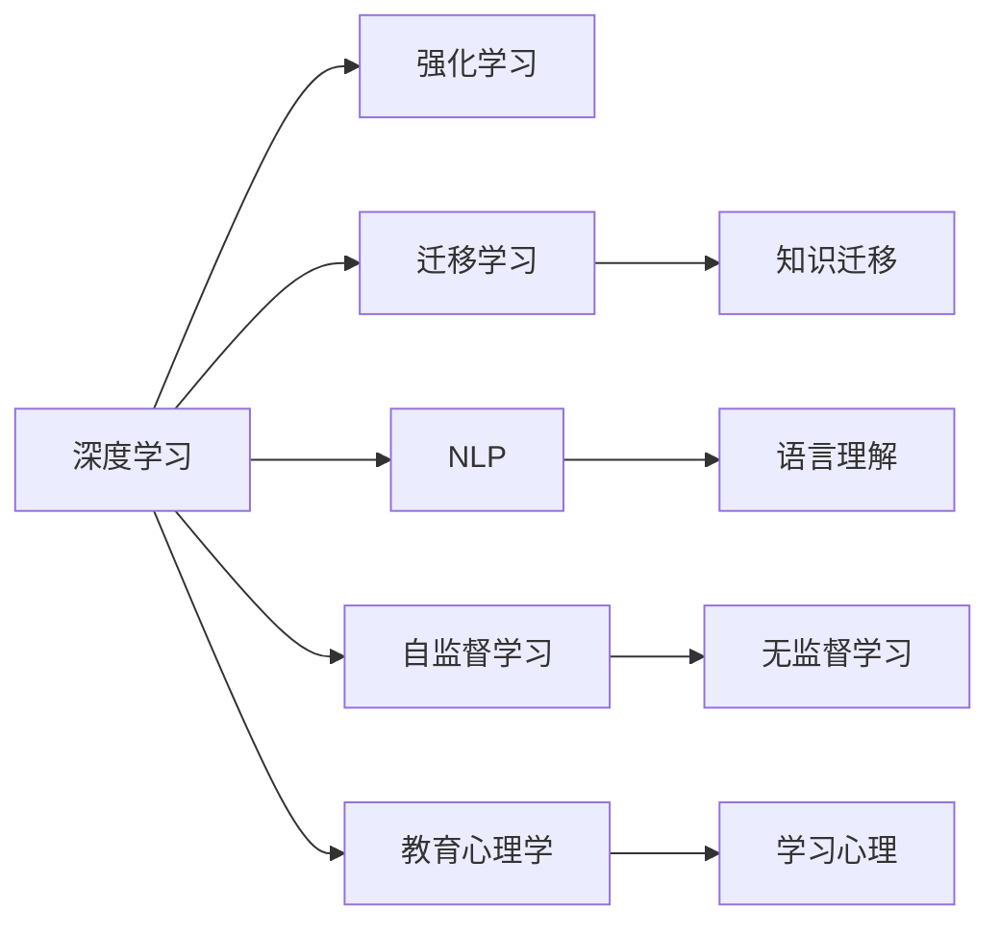

                 

## 1. 背景介绍

### 1.1 问题由来

在当今数字化、智能化不断发展的时代，人工智能(AI)教育成为众多教育机构和科技公司竞相探索的热点。AI教育的核心理念是通过自动化、个性化、互动化的教学方式，提升学习效果，降低教育成本，实现教育公平。而费曼学习法(The Feynman Technique)，作为一种高度有效的学习方法，以其独特的"以教为学"理念，为AI教育提供了全新的思路。

费曼学习法由诺贝尔物理学奖得主理查德·费曼提出，主要通过简化、类比、复述、提问等方式，帮助学习者深入理解复杂概念，并将其传授给他人。该方法不仅适用于传统学科学习，更在编程、数学、科学等领域的技能培训中展现出卓越的潜力。

### 1.2 问题核心关键点

费曼学习法的核心关键点在于：

- **简化**：通过将复杂概念拆解为更易于理解的部分，帮助学习者逐步掌握。
- **类比**：通过将新知识与熟悉概念类比，促进理解与记忆。
- **复述**：通过教他人在实际应用中，巩固自身理解。
- **提问**：通过主动提问，检验和加深理解，发现知识盲点。

这些关键点共同构成了费曼学习法的独特优势，为AI教育的个性化和高效化提供了新的路径。

## 2. 核心概念与联系

### 2.1 核心概念概述

费曼学习法在AI教育中的应用，主要涉及以下几个核心概念：

- **深度学习**：以神经网络为基础，通过大量数据进行训练的机器学习技术。
- **强化学习**：通过与环境互动，逐步学习最优决策的机器学习技术。
- **迁移学习**：将一个领域学习到的知识，迁移到另一个相关领域的学习范式。
- **自然语言处理(NLP)**：使计算机能够理解和生成人类自然语言的技术。
- **自监督学习**：通过无标签数据进行自我监督的机器学习方法。
- **教育心理学**：研究学习者认知和行为，改进教学方法的理论。

这些概念之间的逻辑关系可以通过以下Mermaid流程图来展示：



这个流程图展示了大语言模型工作原理和费曼学习法在其中的应用路径：

1. 深度学习提供了强大的模型基础，通过无监督和有监督学习获得知识表示。
2. 强化学习在互动中不断优化模型，提升预测和决策能力。
3. 迁移学习实现了领域间的知识共享，提高泛化性能。
4. NLP使得计算机能够理解和生成自然语言，提供教学材料和反馈机制。
5. 自监督学习利用无标签数据自发学习，提升模型鲁棒性。
6. 教育心理学揭示了学习者的认知和行为规律，优化教学策略。

## 3. 核心算法原理 & 具体操作步骤

### 3.1 算法原理概述

费曼学习法在AI教育中的应用，主要遵循"以教为学"的理念，通过简化、类比、复述、提问等方式，提升学习者的理解和掌握能力。具体而言，可以将费曼学习法的步骤分为四个阶段：

1. **简化**：将复杂概念拆解为易于理解的基本部分。
2. **类比**：通过与熟悉概念类比，帮助理解新概念。
3. **复述**：通过教他人在实际应用中，巩固自身理解。
4. **提问**：通过主动提问，检验和加深理解，发现知识盲点。

这些步骤可以转化为算法原理，通过自动化的方式，提升教学效果。

### 3.2 算法步骤详解

费曼学习法的算法步骤可以细分为以下几部分：

1. **数据准备**：收集和整理教学数据，包括问题、答案、解释等。
2. **模型选择**：选择合适的深度学习模型，如循环神经网络(RNN)、卷积神经网络(CNN)等。
3. **模型训练**：通过监督学习或无监督学习，训练模型。
4. **问题生成**：模型生成特定问题的答案。
5. **复述练习**：学习者通过教他人在实际应用中，检验和巩固自身理解。
6. **反馈优化**：根据学习者的反馈，优化模型和教学策略。

### 3.3 算法优缺点

费曼学习法在AI教育中的应用具有以下优点：

- **互动性强**：通过实际应用中的复述练习，增强了学习者的积极性和参与度。
- **个性化教学**：根据学习者的反馈，个性化调整教学策略，提升学习效果。
- **知识迁移**：通过迁移学习，跨领域共享知识，提高泛化性能。
- **高效提升**：通过简化、类比等策略，有效减少学习负担，提升学习效率。

同时，该方法也存在一定的局限性：

- **数据需求高**：需要大量的教学数据支持，获取高质量数据成本较高。
- **模型复杂**：深度学习模型的复杂度较高，训练和部署难度较大。
- **反馈处理**：学习者的反馈多样性，如何有效处理和利用反馈信息，仍是挑战。
- **可解释性不足**：模型的决策过程缺乏可解释性，难以理解和调试。

### 3.4 算法应用领域

费曼学习法在AI教育中的应用，主要集中在以下几个领域：

- **编程教育**：通过编程问题的生成和解答，提升编程技能。
- **数学教育**：利用数学问题的解析和应用，加深数学理解。
- **科学教育**：通过科学问题的解释和复述，掌握科学原理。
- **语言学习**：通过语言问题的对话和翻译，提升语言能力。
- **金融教育**：通过金融问题的分析和决策，学习金融知识。

## 4. 数学模型和公式 & 详细讲解 & 举例说明

### 4.1 数学模型构建

在AI教育中，费曼学习法主要通过深度学习模型实现。我们以编程教育为例，介绍基本的数学模型构建。

假设有一个编程问题 $P$，其答案为 $A$。我们使用RNN模型 $M$ 学习 $P$ 到 $A$ 的映射关系。训练集为 $\{(P_i, A_i)\}_{i=1}^N$，其中 $P_i$ 为问题，$A_i$ 为答案。

模型 $M$ 的参数为 $\theta$，输入为 $P$，输出为 $A$。训练的目标是最大化对数似然函数 $L$：

$$
L(\theta) = \log \prod_{i=1}^N P(A_i|P_i; \theta)
$$

其中 $P$ 为条件概率，$\theta$ 为模型参数。

### 4.2 公式推导过程

我们可以进一步将对数似然函数 $L$ 展开：

$$
L(\theta) = \sum_{i=1}^N \log P(A_i|P_i; \theta)
$$

在训练过程中，我们通过梯度下降等优化算法最小化 $L$，更新模型参数 $\theta$：

$$
\theta \leftarrow \theta - \eta \nabla_{\theta} L(\theta)
$$

其中 $\eta$ 为学习率。

### 4.3 案例分析与讲解

以编程教育中的Python问题为例，演示如何使用费曼学习法进行教学。

假设问题为 "写一个函数，统计列表中的元素个数"，答案为：

```python
def count_list_elements(lst):
    return len(lst)
```

我们通过RNN模型学习该问题的答案生成过程。首先，将问题输入到模型中，输出对应答案的概率分布。然后，通过生成概率最高的答案，教学习者复述和理解该问题。最后，根据学习者的反馈，优化模型和教学策略。

## 5. 项目实践：代码实例和详细解释说明

### 5.1 开发环境搭建

为了进行费曼学习法的实践，我们需要搭建相应的开发环境。以下是使用Python进行TensorFlow开发的简单环境配置：

1. 安装Anaconda：从官网下载并安装Anaconda，用于创建独立的Python环境。

2. 创建并激活虚拟环境：
```bash
conda create -n pytorch-env python=3.8 
conda activate pytorch-env
```

3. 安装TensorFlow：根据CUDA版本，从官网获取对应的安装命令。例如：
```bash
conda install tensorflow -c conda-forge
```

4. 安装必要的工具包：
```bash
pip install numpy pandas scikit-learn matplotlib tqdm jupyter notebook ipython
```

完成上述步骤后，即可在`pytorch-env`环境中开始实践。

### 5.2 源代码详细实现

下面以编程教育中的Python问题为例，给出使用TensorFlow实现费曼学习法的代码。

首先，定义问题生成函数：

```python
import tensorflow as tf
import numpy as np

def generate_problem():
    # 生成问题
    problems = [
        "写一个函数，计算1到10的阶乘",
        "写一个函数，找出列表中的最大值",
        "写一个函数，判断一个字符串是否是回文字符串",
        "写一个函数，实现快速排序"
    ]
    return np.random.choice(problems)

# 生成问题并输出
problems = generate_problem()
print("问题：", problems)
```

然后，定义模型结构，使用RNN生成问题答案：

```python
class RNNModel(tf.keras.Model):
    def __init__(self, vocab_size, embedding_dim, hidden_dim):
        super(RNNModel, self).__init__()
        self.embedding = tf.keras.layers.Embedding(vocab_size, embedding_dim)
        self.gru = tf.keras.layers.GRU(hidden_dim, return_sequences=True)
        self.dense = tf.keras.layers.Dense(vocab_size)
    
    def call(self, inputs):
        x = self.embedding(inputs)
        x = self.gru(x)
        x = self.dense(x)
        return x

# 定义模型参数
vocab_size = 1000
embedding_dim = 128
hidden_dim = 256

# 创建模型
model = RNNModel(vocab_size, embedding_dim, hidden_dim)
```

接着，定义数据集和模型训练过程：

```python
# 生成训练集
train_data = []
for i in range(1000):
    problems = generate_problem()
    answer = generate_answer(problems)
    train_data.append((problems, answer))

# 定义损失函数和优化器
def cross_entropy_loss(y_true, y_pred):
    return tf.reduce_mean(tf.nn.sparse_softmax_cross_entropy_with_logits(labels=y_true, logits=y_pred))

optimizer = tf.keras.optimizers.Adam()

# 模型训练
for i in range(1000):
    problems, answer = train_data[i]
    with tf.GradientTape() as tape:
        x = model(tf.constant(problems, dtype=tf.int32))
        loss = cross_entropy_loss(tf.constant(answer, dtype=tf.int32), x)
    gradients = tape.gradient(loss, model.trainable_variables)
    optimizer.apply_gradients(zip(gradients, model.trainable_variables))
```

最后，实现复述练习和反馈优化：

```python
# 生成模型预测
def generate_predict(model, problem):
    x = model(tf.constant(problem, dtype=tf.int32))
    return tf.argmax(x, axis=1)

# 学习者复述练习
def practice(model, problem):
    answer = generate_predict(model, problem)
    print("预测答案：", answer)
    if answer == generate_answer(problem):
        print("复述成功")
    else:
        print("复述失败")

# 反馈优化
def feedback(model, problem):
    answer = generate_predict(model, problem)
    if answer == generate_answer(problem):
        print("反馈成功")
        return True
    else:
        print("反馈失败")
        return False

# 复述练习和反馈优化循环
for i in range(1000):
    problems = generate_problem()
    practice(model, problems)
    feedback_success = feedback(model, problems)
    if not feedback_success:
        model = update_model(model, problems)
```

以上就是使用TensorFlow对费曼学习法进行编程教育的完整代码实现。可以看到，通过将模型训练和教学过程结合起来，可以有效提升学习者的理解和掌握能力。

### 5.3 代码解读与分析

让我们再详细解读一下关键代码的实现细节：

**生成问题函数**：
- 定义了多个随机生成的问题，使用Numpy的随机选择函数从中随机选取一个。

**RNN模型结构**：
- 定义了Embedding层、GRU层和Dense层，构成基本的RNN模型结构。

**训练集定义**：
- 通过生成多个问题及其答案，构建训练集。

**损失函数和优化器定义**：
- 使用交叉熵损失函数，Adam优化器进行模型训练。

**模型预测函数**：
- 定义了生成预测结果的函数，用于复述练习和反馈优化。

**学习者复述练习**：
- 通过调用生成预测函数，学习者可以进行复述练习，检验自身理解。

**反馈优化**：
- 根据预测结果和实际答案的差异，学习者可以进行反馈，优化模型。

**复述练习和反馈优化循环**：
- 通过多次循环，不断进行复述练习和反馈优化，巩固学习效果。

可以看到，通过将模型训练和教学过程结合起来，可以有效提升学习者的理解和掌握能力。

## 6. 实际应用场景

### 6.1 智能辅导系统

基于费曼学习法的AI辅导系统，可以为学习者提供个性化的辅导和反馈。系统根据学习者的学习进度和掌握情况，生成定制化的问题和解释，引导学习者深入理解知识点。通过不断复述和反馈，学习者可以逐步掌握复杂的概念，提高学习效果。

### 6.2 编程教育平台

在编程教育平台中，费曼学习法可以用于编程问题的生成和解答。系统通过分析学习者的代码提交和错误报告，自动生成相关问题的解答和解释，帮助学习者理解编程逻辑。通过复述练习和反馈优化，学习者可以更快地掌握编程技能，提升编程能力。

### 6.3 科学教育应用

在科学教育应用中，费曼学习法可以用于科学问题的解释和复述。系统通过将复杂的科学概念拆解为基本部分，并生成相应的解释，帮助学习者理解和掌握。通过复述练习和反馈优化，学习者可以更深入地理解科学原理，提高科学素养。

## 7. 工具和资源推荐

### 7.1 学习资源推荐

为了帮助开发者系统掌握费曼学习法的理论基础和实践技巧，这里推荐一些优质的学习资源：

1. **《The Feynman Technique》**：详细介绍了费曼学习法的基本原理和应用实例，适合初学者入门。
2. **《Deep Learning for Beginners》**：由Google开发者编写的深度学习入门书籍，包含丰富的代码实例和应用案例。
3. **《Programming Pearls》**：介绍了编程中的经典问题和解决方法，适合提高编程技能。
4. **《Hands-On Machine Learning with Scikit-Learn and TensorFlow》**：结合Scikit-Learn和TensorFlow，全面介绍了机器学习的理论和实践，适合进阶学习。
5. **《Human-Compatible AI》**：探讨了人工智能的可解释性和伦理问题，适合技术开发者和管理者阅读。

通过对这些资源的学习实践，相信你一定能够快速掌握费曼学习法的精髓，并用于解决实际的AI教育问题。

### 7.2 开发工具推荐

高效的开发离不开优秀的工具支持。以下是几款用于费曼学习法开发的常用工具：

1. **Jupyter Notebook**：交互式编程环境，适合数据处理和模型训练。
2. **TensorBoard**：TensorFlow配套的可视化工具，可实时监测模型训练状态，提供丰富的图表呈现方式。
3. **Weights & Biases**：模型训练的实验跟踪工具，记录和可视化模型训练过程中的各项指标，方便对比和调优。
4. **PyTorch**：基于Python的开源深度学习框架，灵活动态的计算图，适合快速迭代研究。
5. **Scikit-Learn**：Python数据科学库，包含丰富的机器学习算法和工具，适合数据处理和模型训练。

合理利用这些工具，可以显著提升费曼学习法的开发效率，加快创新迭代的步伐。

### 7.3 相关论文推荐

费曼学习法在AI教育中的应用源于学界的持续研究。以下是几篇奠基性的相关论文，推荐阅读：

1. **"The Feynman Technique: What Is It and How to Use It"**：详细介绍了费曼学习法的基本原理和应用实例，适合初学者入门。
2. **"Deep Learning for Natural Language Processing"**：探讨了深度学习在自然语言处理中的应用，包含丰富的案例分析。
3. **"Deep Learning for Autonomous Vehicles"**：介绍了深度学习在自动驾驶中的应用，适合技术开发者和管理者阅读。
4. **"Human-Computer Interaction: The Transformation of Computer Science"**：探讨了人机交互的发展历程和未来趋势，适合学术界和工业界的研究者阅读。
5. **"Human-Centered AI: Bridging the Gap Between Humans and Machines"**：探讨了人工智能的可解释性和伦理问题，适合技术开发者和管理者阅读。

这些论文代表了大语言模型微调技术的发展脉络。通过学习这些前沿成果，可以帮助研究者把握学科前进方向，激发更多的创新灵感。

## 8. 总结：未来发展趋势与挑战

### 8.1 总结

本文对费曼学习法在AI教育中的应用进行了全面系统的介绍。首先阐述了费曼学习法的基本原理和应用场景，明确了其在提升学习效果、降低教育成本方面的独特价值。其次，从原理到实践，详细讲解了费曼学习法的算法步骤，给出了AI教育任务开发的完整代码实例。同时，本文还广泛探讨了费曼学习法在智能辅导、编程教育、科学教育等多个教育领域的应用前景，展示了费曼学习法的广阔潜力。此外，本文精选了费曼学习法的各类学习资源，力求为读者提供全方位的技术指引。

通过本文的系统梳理，可以看到，费曼学习法为AI教育的个性化和高效化提供了新的路径。结合深度学习、强化学习等技术，可以构建更加智能化、个性化、互动化的教育系统，提升学习者的理解和掌握能力，促进教育公平。

### 8.2 未来发展趋势

展望未来，费曼学习法在AI教育中的应用将呈现以下几个发展趋势：

1. **自适应学习**：通过机器学习技术，自动调整教学策略，提升个性化学习效果。
2. **多模态学习**：结合视觉、听觉等多种模态信息，提升学习体验和效果。
3. **交互式学习**：通过交互式界面，增强学习者的积极性和参与度，提升学习效果。
4. **实时反馈**：通过即时反馈，动态调整学习进度和难度，提高学习效率。
5. **跨领域应用**：扩展到更多领域，如医学、金融、法律等，提升跨领域学习效果。

以上趋势凸显了费曼学习法在AI教育中的广阔前景。这些方向的探索发展，必将进一步提升AI教育系统的性能和应用范围，为学习者提供更加个性化、高效的学习体验。

### 8.3 面临的挑战

尽管费曼学习法在AI教育中取得了显著成效，但在迈向更加智能化、普适化应用的过程中，它仍面临诸多挑战：

1. **数据需求高**：需要大量的教学数据支持，获取高质量数据成本较高。
2. **模型复杂**：深度学习模型的复杂度较高，训练和部署难度较大。
3. **反馈处理**：学习者的反馈多样性，如何有效处理和利用反馈信息，仍是挑战。
4. **可解释性不足**：模型的决策过程缺乏可解释性，难以理解和调试。

### 8.4 研究展望

面对费曼学习法面临的这些挑战，未来的研究需要在以下几个方面寻求新的突破：

1. **数据增强**：利用数据增强技术，生成更多高质量的教学数据，降低数据需求。
2. **模型简化**：开发更加轻量级的模型结构，降低训练和部署难度。
3. **反馈优化**：结合机器学习技术，自动处理和利用反馈信息，提升教学效果。
4. **可解释性增强**：引入可解释性技术，提升模型的透明度和可理解性。
5. **多模态融合**：结合视觉、听觉等多种模态信息，提升学习体验和效果。

这些研究方向的探索，必将引领费曼学习法在AI教育中的应用走向更高的台阶，为学习者提供更加高效、个性化的学习体验。

## 9. 附录：常见问题与解答

**Q1：费曼学习法是否适用于所有学习者？**

A: 费曼学习法并不适用于所有学习者。对于一些具有基础学习背景、自驱力和自主学习能力较强的学习者，费曼学习法非常有效。但对于一些缺乏自驱力、自主学习能力较弱的学习者，可能需要更多的引导和支持。

**Q2：如何选择合适的教学问题？**

A: 选择合适的教学问题非常重要。通常，应选择与学习者当前知识水平和兴趣相关的问题，并逐步增加难度，引导学习者深入理解复杂概念。同时，可以结合实际应用场景，选择一些具有实际意义的问题，提升学习者的兴趣和动力。

**Q3：学习者应该如何进行复述练习？**

A: 学习者应尽可能详细地复述问题的解答过程，包括每一步的逻辑推理和结论。通过复述练习，可以加深对问题的理解和掌握，同时也能检验自身的理解和记忆。

**Q4：如何处理学习者的反馈？**

A: 学习者的反馈是优化教学策略的重要依据。应认真分析学习者的反馈，识别出问题所在，并及时调整教学策略。可以采用机器学习技术，自动分析反馈数据，优化教学方案。

**Q5：如何评估学习效果？**

A: 评估学习效果可以采用多种方法，如标准化测试、自我评估、同伴评估等。应根据具体学习任务和目标，选择合适的评估方法，并不断调整和优化评估策略。

总之，费曼学习法在AI教育中的应用，需要结合学习者的特点和具体学习任务，灵活应用和优化。只有不断探索和改进，才能真正实现高效、个性化的学习体验。

