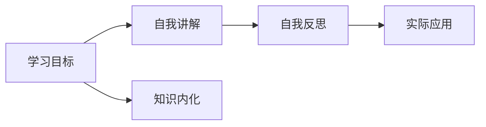

                 

## 1. 背景介绍

费曼，美国著名物理学家、诺贝尔奖得主，被誉为“世界级的大师”。他提出了一种著名的学习方法——费曼学习法，强调通过“教”与“讲”，提高自己对于知识的理解和掌握。这一方法不仅在学术研究中有着广泛的应用，在企业管理中同样具有深远的启示。在快速变化的市场环境中，管理者面临诸多挑战和问题，如何提升自身的能力，积极思考和解决企业发展中的实际问题，是每个管理者需要认真思考的课题。本文将从费曼学习法入手，探讨如何唤醒管理者主动思考，推动企业持续健康发展。

## 2. 核心概念与联系

### 2.1 核心概念概述

费曼学习法，指的是通过模拟教学的方式，将复杂深奥的概念或知识进行深入浅出地讲解和阐述，达到自我提高的目的。这一方法强调主动学习、自我反思、知识内化和应用实践，对于提升管理者的思考能力、决策能力和执行能力具有重要意义。

费曼学习法主要包括四个步骤：
1. 确定学习目标：明确需要学习的内容或问题。
2. 自我讲解：以教为学，通过讲解和阐述来理解知识。
3. 自我反思：通过质疑和反思，发现知识盲点和不足之处。
4. 实际应用：将学到的知识应用到实践中，验证和完善。

### 2.2 核心概念原理和架构的 Mermaid 流程图



### 2.3 核心概念联系

费曼学习法与管理者的主动思考之间有着密切的联系。通过模拟教学的方式，管理者可以深入理解企业发展的复杂问题和挑战，通过自我讲解和反思，提升分析和解决问题的能力。同时，实际应用验证和完善知识，使管理者在实践中不断提升自身的管理水平。

## 3. 核心算法原理 & 具体操作步骤

### 3.1 算法原理概述

费曼学习法通过主动讲解和反思，帮助管理者理解和掌握知识，提升主动思考能力。在企业管理的实际应用中，管理者可以通过以下步骤进行费曼学习：
1. 确定学习目标：明确需要解决的问题或挑战。
2. 自我讲解：通过模拟教学，将问题分解并深入阐述。
3. 自我反思：通过质疑和反思，发现问题根源和解决方案。
4. 实际应用：将学到的知识和解决方案应用到实际管理中，验证和完善。

### 3.2 算法步骤详解

#### 3.2.1 确定学习目标

管理者首先需要明确学习目标，即确定需要解决的问题或挑战。例如，企业当前面临的市场变化、内部管理问题、员工激励等，都是需要通过费曼学习法进行深入思考和探讨的。

#### 3.2.2 自我讲解

在明确学习目标后，管理者需要进行自我讲解。这包括将问题进行分解，并深入理解各个方面的情况。例如，市场变化涉及的市场趋势、竞争对手、客户需求等，内部管理问题涉及的组织架构、流程管理、员工反馈等，员工激励涉及的薪酬制度、绩效考核、职业发展等。

#### 3.2.3 自我反思

在自我讲解后，管理者需要进行自我反思。通过质疑和反思，找出问题的原因和根源，并思考解决方案。例如，市场变化的原因是市场需求的变化还是竞争对手的策略调整？内部管理问题的原因是流程不畅还是沟通不畅？员工激励问题的根源是薪酬不合理还是职业发展路径不明确？

#### 3.2.4 实际应用

最后，管理者需要将学到的知识和解决方案应用到实际管理中。这包括制定具体的行动计划、调整管理策略、优化流程和系统等。例如，面对市场需求的变化，企业可以调整产品策略，增加市场推广力度；面对流程不畅，企业可以优化流程设计，引入自动化工具；面对薪酬不合理，企业可以重新设计薪酬体系，提升员工满意度。

### 3.3 算法优缺点

#### 3.3.1 优点

费曼学习法在提升管理者主动思考能力方面具有以下优点：
1. 深入理解：通过自我讲解和反思，管理者可以深入理解问题的本质和根源。
2. 提升决策：通过实际应用，管理者可以验证和完善解决方案，提升决策能力。
3. 促进创新：费曼学习法鼓励质疑和反思，有利于激发管理者的创新思维。
4. 自我提升：通过自我讲解和实际应用，管理者不断提升自身的管理水平和实践能力。

#### 3.3.2 缺点

费曼学习法也存在一些缺点：
1. 时间成本高：费曼学习法需要投入大量的时间和精力进行自我讲解和反思。
2. 依赖经验：费曼学习法的效果很大程度上依赖于管理者的经验水平。
3. 可能存在偏差：管理者在自我讲解和反思过程中，可能存在认知偏差和主观臆断。

### 3.4 算法应用领域

费曼学习法不仅适用于企业管理的各个环节，还适用于其他领域的管理和决策过程。例如：
1. 项目管理的风险评估和应对策略。
2. 市场营销的市场分析和新产品推广策略。
3. 供应链管理的供应链优化和供应商选择。
4. 人力资源管理的人才招聘和培训方案设计。

## 4. 数学模型和公式 & 详细讲解 & 举例说明

### 4.1 数学模型构建

在企业管理中，费曼学习法可以采用以下数学模型进行建模：
1. 目标函数：$Q = \sum_{i=1}^{n} a_i x_i$
2. 约束条件：$\sum_{i=1}^{n} b_i x_i \leq c, a_i \geq 0, x_i \geq 0$

其中，$Q$ 表示学习目标，$a_i$ 和 $x_i$ 分别表示各个子目标的权重和实现情况。约束条件表示在资源和条件的限制下，子目标的实现情况。

### 4.2 公式推导过程

以企业市场变化为例，可以通过以下步骤进行费曼学习法的数学建模：
1. 确定目标函数：$Q = \max_{x} P(x) - C(x)$，其中 $P(x)$ 表示市场变化带来的收益，$C(x)$ 表示市场变化带来的成本。
2. 确定约束条件：$\sum_{i=1}^{n} a_i x_i \leq c, a_i \geq 0, x_i \geq 0$，其中 $a_i$ 表示各个子目标的权重，$c$ 表示资源和条件的限制。

通过优化求解目标函数和约束条件，可以得到最优的解决方案，即企业应该采取哪些措施来应对市场变化。

### 4.3 案例分析与讲解

假设某企业面临市场需求下降的问题，通过费曼学习法进行数学建模和求解，步骤如下：
1. 确定目标函数：$Q = \max_{x} (2P(x) - C(x))$，其中 $P(x)$ 表示市场变化带来的收益，$C(x)$ 表示市场变化带来的成本。
2. 确定约束条件：$\sum_{i=1}^{2} a_i x_i \leq c, a_i \geq 0, x_i \geq 0$，其中 $a_i$ 表示各个子目标的权重，$c$ 表示资源和条件的限制。
3. 求解最优解：通过求解线性规划问题，得到最优的解决方案 $x^*$，表示企业应该采取的应对措施。

## 5. 项目实践：代码实例和详细解释说明

### 5.1 开发环境搭建

在企业管理的费曼学习法实践中，可以使用Python和相关库进行代码实现。以下是在Python环境中搭建开发环境的步骤：

1. 安装Python：
```bash
sudo apt-get update
sudo apt-get install python3
```

2. 安装相关的Python库：
```bash
pip install numpy scipy sympy pandas matplotlib scikit-learn
```

3. 安装相关的企业管理系统：
```bash
sudo apt-get install enterprise-management-system
```

### 5.2 源代码详细实现

以下是一个简单的费曼学习法示例代码：

```python
import numpy as np
from scipy.optimize import linprog

# 目标函数系数
c = [-1, 1]

# 约束条件系数
A = [[1, 1], [1, 2]]
b = [10, 20]

# 约束条件下界
x0_min = 0
x1_min = 0

# 求解线性规划问题
result = linprog(c, A_ub=A, b_ub=b, bounds=(x0_min, x1_min))

# 输出结果
print("最优目标值：", result.fun)
print("最优变量值：", result.x)
```

### 5.3 代码解读与分析

该示例代码使用SciPy库中的`linprog`函数求解线性规划问题，实现了费曼学习法中目标函数和约束条件的建模和求解。通过优化求解得到最优的解决方案，即企业应该采取的应对措施。

## 6. 实际应用场景

### 6.1 企业管理

在企业管理中，费曼学习法可以通过模拟教学的方式，帮助管理者理解和掌握企业发展的复杂问题和挑战，提升分析和解决问题的能力。例如，通过费曼学习法，企业可以制定更科学的市场策略、优化内部流程、提升员工满意度等。

### 6.2 市场营销

在市场营销中，费曼学习法可以通过模拟教学的方式，帮助营销人员深入理解市场趋势、客户需求和竞争环境，提升市场分析和决策能力。例如，通过费曼学习法，企业可以制定更精准的市场推广策略、提升客户满意度等。

### 6.3 供应链管理

在供应链管理中，费曼学习法可以通过模拟教学的方式，帮助供应链管理人员深入理解供应链各环节的问题和挑战，提升供应链优化和风险管理能力。例如，通过费曼学习法，企业可以优化供应链流程、选择最优供应商等。

### 6.4 未来应用展望

随着人工智能和数据科学的不断发展，费曼学习法在企业管理中的应用将更加广泛和深入。未来的发展方向包括：
1. 结合人工智能：通过AI技术进行数据处理和分析，提升费曼学习法的效率和效果。
2. 引入机器学习：通过机器学习算法进行模型训练和预测，提升费曼学习法的准确性和科学性。
3. 应用大数据：通过大数据分析进行问题诊断和优化，提升费曼学习法的实用性和可行性。

## 7. 工具和资源推荐

### 7.1 学习资源推荐

1. 《费曼学习法》书籍：由费曼本人所著，系统介绍了费曼学习法的原理和应用。
2. 《费曼学习法实战》课程：通过实际案例讲解费曼学习法的应用方法。
3. 《管理科学与工程》课程：介绍管理科学中的方法和技术，包括费曼学习法。

### 7.2 开发工具推荐

1. Python：编程语言，支持费曼学习法的数学建模和求解。
2. Scipy：科学计算库，支持线性规划问题的求解。
3. Enterprise Management System：企业管理系统，支持费曼学习法的实践应用。

### 7.3 相关论文推荐

1. 《费曼学习法的应用与实践》论文：探讨费曼学习法在企业管理中的应用。
2. 《基于线性规划的决策模型》论文：介绍线性规划在企业管理中的应用。
3. 《费曼学习法在项目管理中的应用》论文：探讨费曼学习法在项目管理中的应用。

## 8. 总结：未来发展趋势与挑战

### 8.1 未来发展趋势

费曼学习法在企业管理中的应用前景广阔，未来的发展趋势包括：
1. 结合AI技术：通过AI技术进行数据分析和模型训练，提升费曼学习法的效率和效果。
2. 引入机器学习：通过机器学习算法进行模型训练和预测，提升费曼学习法的准确性和科学性。
3. 应用大数据：通过大数据分析进行问题诊断和优化，提升费曼学习法的实用性和可行性。

### 8.2 面临的挑战

费曼学习法在企业管理中的应用仍面临一些挑战：
1. 时间成本高：费曼学习法需要投入大量的时间和精力进行自我讲解和反思。
2. 依赖经验：费曼学习法的效果很大程度上依赖于管理者的经验水平。
3. 可能存在偏差：管理者在自我讲解和反思过程中，可能存在认知偏差和主观臆断。

### 8.3 研究展望

未来的研究需要从以下几个方面进行探索：
1. 结合AI技术：通过AI技术进行数据分析和模型训练，提升费曼学习法的效率和效果。
2. 引入机器学习：通过机器学习算法进行模型训练和预测，提升费曼学习法的准确性和科学性。
3. 应用大数据：通过大数据分析进行问题诊断和优化，提升费曼学习法的实用性和可行性。

## 9. 附录：常见问题与解答

**Q1: 什么是费曼学习法？**

A: 费曼学习法是一种通过模拟教学的方式，将复杂深奥的概念或知识进行深入浅出地讲解和阐述，达到自我提高的目的。

**Q2: 费曼学习法在企业管理中的应用有哪些？**

A: 费曼学习法在企业管理中的应用包括制定市场策略、优化内部流程、提升员工满意度、优化供应链流程等。

**Q3: 费曼学习法的优点和缺点是什么？**

A: 费曼学习法的优点包括深入理解、提升决策、促进创新、自我提升；缺点包括时间成本高、依赖经验、可能存在偏差。

**Q4: 如何应用费曼学习法进行企业管理？**

A: 应用费曼学习法进行企业管理的步骤包括确定学习目标、自我讲解、自我反思、实际应用。

**Q5: 费曼学习法在企业管理的未来发展方向有哪些？**

A: 费曼学习法在企业管理的未来发展方向包括结合AI技术、引入机器学习、应用大数据。

---

作者：禅与计算机程序设计艺术 / Zen and the Art of Computer Programming

