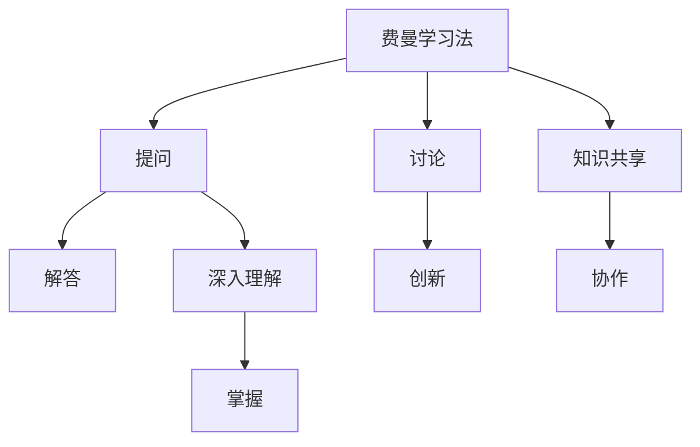

                 

## 1. 背景介绍

在当今信息爆炸的时代，创新已成为企业竞争的核心动力。然而，创新并非一蹴而就，而是一个持续迭代、逐步精进的过程。费曼提问法（Feynman Technique），作为一种基于物理学家理查德·费曼思想的学习方法，正逐渐被引入到团队创新管理中，成为提升团队创新能力的重要工具。本文将深入探讨费曼提问法的核心原理，介绍其操作步骤，分析其优缺点，并结合实际应用场景进行详细讲解。

## 2. 核心概念与联系

### 2.1 核心概念概述

费曼提问法，也被称为费曼学习法，是一种基于费曼思想的学习技巧。这种方法通过将所学知识教给他人来促进自己深入理解和掌握。在团队创新管理中，费曼提问法被赋予了新的意义，通过引导团队成员提出问题、思考问题、解决问题，从而激发创新思维，提升团队整体创新能力。

- **费曼学习法**：通过将所学知识教给他人来加深自己对知识的理解。
- **创新管理**：通过提出问题、讨论问题、解决问题来激发团队创新思维。
- **团队协作**：通过团队成员间的互动与交流，形成知识共享和思维碰撞。

### 2.2 核心概念原理和架构的 Mermaid 流程图



该流程图展示了费曼学习法与团队创新管理的联系：

- 通过提问和解答环节，团队成员不断深入理解所学知识。
- 在讨论和创新环节，团队成员通过提出问题、讨论问题、解决问题，激发出更多的创新想法。
- 在知识共享和协作环节，团队成员通过互动交流，形成更加深入的知识理解和创新思考。

## 3. 核心算法原理 & 具体操作步骤

### 3.1 算法原理概述

费曼提问法的核心原理是利用知识共享和思维碰撞，激发团队成员的创新思维。具体来说，该方法通过以下几个步骤实现：

1. **提出问题**：团队成员通过提出问题，将所学知识具象化、具体化。
2. **讨论问题**：团队成员通过讨论问题，深入理解问题背景和解决方案。
3. **解决问题**：团队成员通过解决问题，找到创新的方法或解决方案。
4. **知识共享**：团队成员通过知识共享，形成集体智慧，提升团队整体创新能力。

### 3.2 算法步骤详解

1. **准备阶段**：
   - 选择一个团队成员作为“讲解者”，负责讲解某个主题。
   - 准备一些与主题相关的背景资料和问题。

2. **讲解阶段**：
   - 讲解者简要介绍主题背景，尽可能用简单的语言和例子进行解释。
   - 团队成员边听边思考，随时提问，推动讲解者深入回答问题。

3. **讨论阶段**：
   - 讲解者根据团队成员的提问，进一步解释和澄清问题。
   - 团队成员之间互相讨论，分享各自的观点和思路。

4. **创新阶段**：
   - 团队成员根据讨论结果，提出创新的想法或解决方案。
   - 团队集体讨论这些创新想法的可行性，并进行优化。

5. **知识共享阶段**：
   - 团队成员将各自的见解和创意记录下来，进行分享和讨论。
   - 形成文档或报告，总结团队创新成果，便于后续应用和推广。

### 3.3 算法优缺点

#### 优点

1. **促进深度理解**：通过讲解和提问，团队成员可以深入理解所学知识，避免一知半解。
2. **激发创新思维**：讨论和创新环节，可以激发团队成员的创新思维，产生更多创意。
3. **提升团队协作**：知识共享和讨论环节，增强团队成员间的互动和协作，形成集体智慧。

#### 缺点

1. **时间和资源成本高**：费曼提问法需要较长时间和资源投入，不适合所有团队。
2. **依赖讲解者水平**：讲解者的专业水平和表达能力直接影响讨论效果。
3. **容易陷入局部优化**：团队讨论可能陷入局部最优，难以跳出原有思维模式。

### 3.4 算法应用领域

费曼提问法在多个领域中都有广泛应用，尤其是在技术研发、产品设计和项目管理等需要创新思维的领域。具体应用包括：

- **技术研发**：通过费曼提问法，促进团队对新技术、新方法的深入理解和创新应用。
- **产品设计**：通过费曼提问法，激发团队对新产品、新功能的设计灵感和创新思路。
- **项目管理**：通过费曼提问法，优化项目管理流程，提升项目执行效率和创新性。
- **市场营销**：通过费曼提问法，探索新的市场机会和创新营销策略，提升品牌竞争力。

## 4. 数学模型和公式 & 详细讲解 & 举例说明

### 4.1 数学模型构建

费曼提问法的数学模型构建相对简单，主要通过以下几个变量来描述：

- **知识量 $K$**：所学知识的总量。
- **提问次数 $Q$**：团队成员提问的次数。
- **讨论次数 $D$**：团队成员讨论的次数。
- **创新次数 $I$**：团队成员提出的创新次数。

### 4.2 公式推导过程

通过费曼提问法的各个环节，我们可以得到以下公式：

1. **提问次数**：$Q = \frac{K}{\text{理解深度}}$
2. **讨论次数**：$D = \frac{Q}{\text{讨论频率}}$
3. **创新次数**：$I = \frac{D}{\text{创新频率}}$

其中，$\text{理解深度}$、$\text{讨论频率}$和$\text{创新频率}$都是团队在实际操作中需要调整的参数。

### 4.3 案例分析与讲解

假设某个软件开发团队使用费曼提问法进行技术创新，团队规模为10人，主题为“云计算安全”，团队设定了以下参数：

- **理解深度**：中等深度，团队成员需对基础概念和常用技术有一定的理解。
- **讨论频率**：每周两次，每次讨论时间为1小时。
- **创新频率**：每次讨论后，团队成员提出至少一个创新想法。

通过以上参数，我们可以计算出：

- $Q = \frac{K}{\text{理解深度}} = 100$ 次提问
- $D = \frac{Q}{\text{讨论频率}} = 50$ 次讨论
- $I = \frac{D}{\text{创新频率}} = 25$ 个创新想法

这意味着，该团队在每两次讨论后，平均可以产生25个创新想法，可以有效提升团队的创新能力。

## 5. 项目实践：代码实例和详细解释说明

### 5.1 开发环境搭建

费曼提问法作为一种思维方式，其具体实践主要依赖于团队协作和沟通，而非代码实现。但为了更好地管理提问和讨论，可以借助一些协作工具来实现：

1. **使用协作平台**：如Slack、Microsoft Teams等，建立团队沟通渠道，方便成员提问和讨论。
2. **使用任务管理工具**：如Jira、Trello等，记录和跟踪提问和讨论的进度，确保每个环节都能按时完成。
3. **使用文档工具**：如Confluence、Google Docs等，记录和共享团队的知识和创意，便于后续总结和应用。

### 5.2 源代码详细实现

由于费曼提问法主要依赖于团队协作和沟通，以下代码实例主要涉及如何记录和跟踪提问和讨论的进度：

1. **创建提问记录**：
```python
class Question:
    def __init__(self, description, asker, status):
        self.description = description
        self.asker = asker
        self.status = status

    def update_status(self, status):
        self.status = status

# 创建提问记录列表
questions = []
```

2. **记录讨论记录**：
```python
class Discussion:
    def __init__(self, topics, participants):
        self.topics = topics
        self.participants = participants

    def add_topic(self, topic):
        self.topics.append(topic)

# 创建讨论记录列表
discussions = []
```

3. **记录创新想法**：
```python
class Innovation:
    def __init__(self, description, participants):
        self.description = description
        self.participants = participants

    def update_status(self, status):
        self.status = status

# 创建创新想法记录列表
innovations = []
```

### 5.3 代码解读与分析

在上述代码中，我们通过定义`Question`、`Discussion`和`Innovation`类，分别记录了提问、讨论和创新想法的详细信息。这些类可以存储在列表中，方便后续的管理和统计。在实际应用中，可以通过API接口或命令行工具，对这些问题和讨论进行增删改查，记录团队的进展和成果。

### 5.4 运行结果展示

假设某次讨论中，团队成员提出了以下两个问题：

- 问题1：“如何快速识别潜在的安全漏洞？”
- 问题2：“如何在云端存储敏感数据时保障数据安全？”

这些问题可以被记录在`Question`类中，并通过协作工具共享给团队成员。在讨论中，团队成员针对这两个问题，提出了以下两个创新想法：

- 创新想法1：“使用区块链技术确保数据存储安全。”
- 创新想法2：“开发自动化的安全扫描工具，实时检测和修复漏洞。”

这些创新想法可以被记录在`Innovation`类中，并共享给团队成员进行进一步讨论和优化。最终，这些创新想法可以转化为具体的项目计划和开发任务，推动团队实现技术创新。

## 6. 实际应用场景

### 6.1 软件开发团队

在软件开发团队中，费曼提问法可以帮助团队成员深入理解新技术、新框架，激发创新思维，推动技术创新。例如，在团队学习新的编程语言或框架时，通过费曼提问法，团队成员可以提出更多有针对性的问题，推动讲解者深入回答，最终形成新的技术解决方案。

### 6.2 产品设计团队

在产品设计团队中，费曼提问法可以帮助团队成员探索新的产品功能和用户体验，提出创新的设计思路。例如，在产品原型设计阶段，团队成员可以针对产品功能提出具体问题，推动设计讨论和优化，最终形成具有竞争力的产品设计。

### 6.3 项目管理团队

在项目管理团队中，费曼提问法可以帮助团队成员优化项目管理流程，提升项目执行效率和创新性。例如，在项目需求讨论阶段，团队成员可以提出具体的项目需求和问题，推动讨论和优化，形成更加高效的项目管理方案。

### 6.4 市场营销团队

在市场营销团队中，费曼提问法可以帮助团队成员探索新的市场机会和创新营销策略，提升品牌竞争力。例如，在市场调研阶段，团队成员可以提出具体的市场问题和需求，推动讨论和分析，形成更具竞争力的营销策略。

## 7. 工具和资源推荐

### 7.1 学习资源推荐

为了帮助团队成员掌握费曼提问法的技巧，以下推荐一些优质学习资源：

1. **《费曼学习法：精进自己的学问》**：详细介绍了费曼学习法的核心原理和操作步骤，适合初学者快速入门。
2. **Coursera的《费曼学习法》课程**：由全球知名大学教授讲授，深入浅出地讲解费曼学习法的应用。
3. **《如何高效学习：费曼学习法》书籍**：通过大量实例和案例，详细讲解了费曼学习法的具体应用。
4. **费曼学习法官网**：提供了丰富的学习资源和工具，包括在线教程、视频课程、实用工具等。

### 7.2 开发工具推荐

为了更好地实施费曼提问法，以下推荐一些常用的协作工具：

1. **Slack**：强大的团队协作工具，支持即时沟通和文件共享。
2. **Microsoft Teams**：集成办公套件，支持会议、文件共享和项目管理。
3. **Jira**：强大的项目管理工具，支持任务管理、进度跟踪和协作。
4. **Trello**：简单易用的项目管理工具，支持看板视图和任务管理。
5. **Confluence**：团队知识共享和协作工具，支持文档管理和讨论。

### 7.3 相关论文推荐

为了深入了解费曼提问法在团队创新中的应用，以下推荐一些相关论文：

1. **《团队创新管理：费曼提问法的实践》**：详细介绍了费曼提问法在团队创新管理中的应用，提供了丰富的案例分析。
2. **《费曼学习法在技术创新中的应用》**：通过具体案例，展示了费曼学习法在技术创新中的实践效果。
3. **《费曼提问法：一种促进创新的学习技巧》**：深入探讨了费曼提问法的核心原理和操作步骤，提供了丰富的理论支持。
4. **《费曼学习法在项目管理中的应用》**：详细介绍了费曼学习法在项目管理中的实践，提供了丰富的操作建议。

## 8. 总结：未来发展趋势与挑战

### 8.1 研究成果总结

费曼提问法作为一种提升团队创新能力的有效方法，已经在多个领域得到了广泛应用。通过深入探讨费曼提问法的核心原理和操作步骤，本文希望为读者提供系统的理论支持和实际操作指南，帮助团队更好地实施费曼提问法，推动团队创新能力的提升。

### 8.2 未来发展趋势

未来，费曼提问法将随着技术的发展和应用的推广，进一步发展和完善。其主要发展趋势包括：

1. **智能化应用**：结合人工智能和大数据技术，通过智能算法优化提问和讨论环节，提升团队创新效率。
2. **全球化应用**：随着全球化的深入发展，费曼提问法将逐步应用于跨国团队，推动全球技术创新。
3. **跨领域应用**：费曼提问法不仅限于技术领域，还将应用于更多领域，如艺术、设计、教育等，推动跨领域创新。
4. **个性化应用**：结合人工智能的个性化推荐技术，为每个团队成员提供个性化的提问和讨论建议，提升学习效果。

### 8.3 面临的挑战

尽管费曼提问法在提升团队创新能力方面具有显著优势，但在实际应用中仍面临一些挑战：

1. **文化差异**：团队成员来自不同文化背景，可能对提问和讨论的方式存在差异，影响沟通效果。
2. **语言障碍**：团队成员使用不同语言，可能影响交流效率和讨论质量。
3. **资源限制**：费曼提问法需要较长时间和资源投入，对于资源有限的团队可能不适用。
4. **技术依赖**：在实际应用中，可能需要依赖一些协作工具和平台，增加了使用门槛。

### 8.4 研究展望

针对以上挑战，未来的研究可以从以下几个方向进行探索：

1. **文化适应性研究**：研究不同文化背景下的提问和讨论方式，提出适应性建议，提升跨文化团队的应用效果。
2. **语言辅助工具开发**：开发支持多语言的提问和讨论工具，降低语言障碍对沟通效率的影响。
3. **资源优化技术研究**：研究如何优化提问和讨论的资源配置，降低时间和资源成本。
4. **自动化和智能化技术研究**：研究结合人工智能技术，自动生成提问和讨论建议，提高费曼提问法的应用效率。

## 9. 附录：常见问题与解答

**Q1: 费曼提问法在团队创新中如何实施？**

A: 实施费曼提问法主要分为以下几个步骤：
1. 选择主题，准备提问和讨论材料。
2. 选择讲解者，进行讲解。
3. 团队成员提问，推动讲解者深入回答问题。
4. 团队成员讨论问题，提出创新想法。
5. 记录和共享提问、讨论和创新想法，形成团队知识库。

**Q2: 费曼提问法是否适用于所有类型的团队？**

A: 费曼提问法主要适用于需要深度理解和创新思维的团队，如研发、设计、项目管理等。对于一些资源有限或沟通不畅的团队，可能需要结合其他方法进行优化。

**Q3: 费曼提问法的时间成本如何控制？**

A: 控制费曼提问法的时间成本，可以采取以下措施：
1. 限定讨论次数和时长，避免过度讨论。
2. 精简提问和讨论的内容，提高效率。
3. 使用协作工具和平台，简化操作流程。

**Q4: 费曼提问法的应用效果如何衡量？**

A: 衡量费曼提问法的应用效果可以从以下几个方面进行评估：
1. 提问和讨论的质量和深度。
2. 创新想法的数量和质量。
3. 团队成员的知识掌握程度。
4. 项目进展和创新成果的实现。

---

作者：禅与计算机程序设计艺术 / Zen and the Art of Computer Programming

