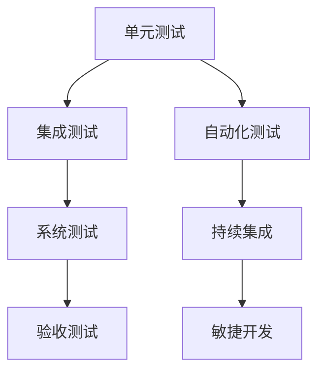

                 

# 软件测试策略：单元测试到集成测试

> 关键词：软件测试, 单元测试, 集成测试, 测试策略, 软件质量保证, 持续集成, 敏捷开发

## 1. 背景介绍

### 1.1 问题由来
软件测试是软件开发过程中必不可少的一环，其目标是发现和排除软件中的缺陷，确保软件符合需求规格和质量标准。随着软件开发过程的复杂化，传统的测试方法已经难以适应快速迭代和持续交付的需求。如何构建高效、自动化、持续的测试策略，成为了软件开发中的一个重要课题。

### 1.2 问题核心关键点
软件测试策略的核心在于如何通过有效的测试方法，确保软件的质量和稳定性。单元测试、集成测试、系统测试和验收测试是常见的测试方法，每个测试阶段都承担着不同的角色和任务。

1. 单元测试：测试单个模块或函数的正确性。
2. 集成测试：测试模块之间的交互和依赖关系。
3. 系统测试：测试整个系统的功能、性能和可靠性。
4. 验收测试：测试软件是否满足业务需求和用户期望。

这些测试方法相互依赖，构成了一个完整的测试策略体系。然而，传统的测试方法在面对大规模软件系统和快速迭代的开发模式时，显得力不从心。为了应对这些挑战，软件测试策略需要不断优化和创新。

### 1.3 问题研究意义
构建高效、自动化、持续的软件测试策略，对于提高软件开发效率、降低软件缺陷率、提升软件质量具有重要意义：

1. 提高开发效率：通过自动化测试，减少手动测试的工作量，加速软件迭代速度。
2. 降低缺陷率：通过持续测试和反馈，及时发现和修复软件缺陷，避免问题累积。
3. 提升软件质量：通过全面的测试覆盖，确保软件符合质量标准和业务需求。
4. 支持持续交付：通过持续集成和持续交付，确保软件能够快速、可靠地发布到生产环境。
5. 支持敏捷开发：通过自动化测试和持续反馈，支持快速响应市场变化和用户需求。

## 2. 核心概念与联系

### 2.1 核心概念概述

为更好地理解软件测试策略，本节将介绍几个密切相关的核心概念：

- **单元测试**：针对单个模块或函数的测试，确保其功能正确性。通常使用简单断言和模拟数据进行验证。
- **集成测试**：针对模块之间的交互和依赖关系进行测试，确保整体系统的功能正确性和性能稳定。
- **系统测试**：针对整个系统的测试，包括功能、性能、安全等方面，确保系统满足业务需求和用户期望。
- **验收测试**：针对最终用户进行的测试，确保软件符合业务需求和用户期望。

这些核心概念之间的逻辑关系可以通过以下Mermaid流程图来展示：



这个流程图展示了几类测试方法之间的逻辑关系：

1. 单元测试是基础，通过测试单个模块的功能正确性。
2. 集成测试在单元测试的基础上，测试模块之间的交互和依赖关系。
3. 系统测试是对整个系统的全面测试，确保系统功能正确、性能稳定。
4. 验收测试是最终用户的测试，确保软件符合业务需求和用户期望。
5. 自动化测试和持续集成支持持续交付，提升开发效率和软件质量。
6. 敏捷开发与持续测试相结合，支持快速响应市场需求和用户反馈。

## 3. 核心算法原理 & 具体操作步骤

### 3.1 算法原理概述

软件测试策略的核心在于构建一套完整的测试体系，通过自动化和持续化的测试方法，确保软件的质量和稳定性。其中，单元测试和集成测试是基础，系统测试和验收测试是保障。

### 3.2 算法步骤详解

#### 3.2.1 单元测试

**步骤1: 准备测试环境**

- 安装测试工具，如JUnit、pytest等。
- 编写测试用例，覆盖每个模块的主要功能点。
- 定义测试输入和预期输出。

**步骤2: 编写测试代码**

- 编写测试类或函数，使用断言验证模块功能。
- 使用模拟数据或依赖注入的方式，确保测试环境的隔离性。

**步骤3: 执行测试**

- 运行测试工具，执行测试用例。
- 分析测试结果，记录缺陷和异常。

**步骤4: 修复和回归**

- 根据测试结果，修复模块缺陷。
- 重新执行测试用例，确保修复无误。

#### 3.2.2 集成测试

**步骤1: 准备测试环境**

- 安装测试工具，如JUnit、pytest等。
- 编写集成测试用例，覆盖模块之间的交互和依赖关系。
- 定义测试输入和预期输出。

**步骤2: 编写测试代码**

- 编写测试类或函数，使用模拟数据或依赖注入的方式，隔离测试环境。
- 模拟模块之间的交互，测试接口和依赖关系。

**步骤3: 执行测试**

- 运行测试工具，执行测试用例。
- 分析测试结果，记录缺陷和异常。

**步骤4: 修复和回归**

- 根据测试结果，修复模块之间的依赖关系和接口问题。
- 重新执行测试用例，确保修复无误。

#### 3.2.3 系统测试

**步骤1: 准备测试环境**

- 安装测试工具，如JUnit、pytest等。
- 编写系统测试用例，覆盖整个系统的功能、性能和安全。
- 定义测试输入和预期输出。

**步骤2: 编写测试代码**

- 编写测试类或函数，使用模拟数据或依赖注入的方式，隔离测试环境。
- 模拟整个系统的功能，测试系统功能正确性和性能稳定。

**步骤3: 执行测试**

- 运行测试工具，执行测试用例。
- 分析测试结果，记录缺陷和异常。

**步骤4: 修复和回归**

- 根据测试结果，修复系统功能、性能和安全问题。
- 重新执行测试用例，确保修复无误。

#### 3.2.4 验收测试

**步骤1: 准备测试环境**

- 安装测试工具，如JUnit、pytest等。
- 编写验收测试用例，覆盖最终用户的需求和期望。
- 定义测试输入和预期输出。

**步骤2: 编写测试代码**

- 编写测试类或函数，使用模拟数据或依赖注入的方式，隔离测试环境。
- 模拟最终用户的需求，测试软件是否符合业务需求和用户期望。

**步骤3: 执行测试**

- 运行测试工具，执行测试用例。
- 分析测试结果，记录缺陷和异常。

**步骤4: 修复和回归**

- 根据测试结果，修复软件缺陷，确保软件符合业务需求和用户期望。
- 重新执行测试用例，确保修复无误。

### 3.3 算法优缺点

#### 3.3.1 单元测试

**优点：**

- 精度高：针对单个模块或函数，能够准确验证功能正确性。
- 隔离性强：测试环境简单，能够快速定位和修复缺陷。
- 覆盖面广：能够覆盖模块的主要功能点，确保代码质量。

**缺点：**

- 重复劳动：每个模块都需要编写和执行测试用例。
- 耗时较长：测试用例数量较多，执行时间较长。
- 依赖注入复杂：测试环境复杂，依赖注入难度大。

#### 3.3.2 集成测试

**优点：**

- 覆盖面广：能够覆盖模块之间的交互和依赖关系，确保系统功能正确性。
- 自动化程度高：可以自动模拟模块之间的交互，减少手动测试工作量。
- 早期发现缺陷：能够在早期发现接口和依赖问题，减少后期修复成本。

**缺点：**

- 测试环境复杂：需要模拟模块之间的交互，测试环境复杂。
- 依赖注入困难：依赖注入复杂，测试用例难以维护。
- 性能瓶颈：测试用例数量较多，执行时间较长，影响性能。

#### 3.3.3 系统测试

**优点：**

- 覆盖面广：能够覆盖整个系统的功能、性能和安全，确保系统质量。
- 自动化程度高：可以自动模拟整个系统的功能，减少手动测试工作量。
- 性能测试能力强：能够测试系统的性能和稳定性，确保系统性能稳定。

**缺点：**

- 测试环境复杂：需要模拟整个系统的功能，测试环境复杂。
- 依赖注入困难：依赖注入复杂，测试用例难以维护。
- 执行时间长：测试用例数量较多，执行时间较长。

#### 3.3.4 验收测试

**优点：**

- 准确度高：测试最终用户的需求和期望，确保软件符合业务需求和用户期望。
- 用户参与度高：用户参与测试，能够及时发现和修复问题。
- 结果可信度高：用户测试的结果可信度高，能够反映真实用户的反馈。

**缺点：**

- 成本较高：需要用户参与测试，测试成本较高。
- 测试环境复杂：测试环境复杂，测试难度大。
- 测试周期长：测试周期较长，影响发布进度。

### 3.4 算法应用领域

软件测试策略广泛应用于软件开发和维护的各个阶段，包括：

1. **软件开发**：在开发过程中，通过单元测试、集成测试和系统测试，确保代码质量和系统稳定性。
2. **系统维护**：在维护过程中，通过回归测试、功能测试和性能测试，确保系统功能的正确性和性能稳定性。
3. **持续交付**：通过持续集成和持续交付，确保软件能够快速、可靠地发布到生产环境。
4. **敏捷开发**：通过自动化测试和持续反馈，支持快速响应市场需求和用户反馈。
5. **质量保证**：通过全面的测试覆盖，确保软件符合质量标准和业务需求。

## 4. 数学模型和公式 & 详细讲解 & 举例说明

### 4.1 数学模型构建

软件测试策略的数学模型可以描述为：

$$
\text{测试策略} = \text{单元测试} + \text{集成测试} + \text{系统测试} + \text{验收测试}
$$

其中，单元测试、集成测试、系统测试和验收测试的数学模型可以分别描述为：

- 单元测试：$\text{单元测试} = \text{测试用例} \times \text{断言}$

- 集成测试：$\text{集成测试} = \text{模块交互} \times \text{测试用例} \times \text{依赖注入}$

- 系统测试：$\text{系统测试} = \text{系统功能} \times \text{测试用例} \times \text{自动化测试}$

- 验收测试：$\text{验收测试} = \text{用户需求} \times \text{测试用例} \times \text{用户参与}$

### 4.2 公式推导过程

**单元测试的公式推导**

- 测试用例：$T_{unit} = T_{unit1} + T_{unit2} + \dots + T_{unitn}$
- 断言：$A_{unit} = A_{unit1} \times A_{unit2} \times \dots \times A_{unitn}$

其中，$T_{uniti}$表示第$i$个模块的测试用例，$A_{uniti}$表示第$i$个模块的断言。

**集成测试的公式推导**

- 模块交互：$I_{integration} = I_{integration1} \times I_{integration2} \times \dots \times I_{integrationm}$
- 测试用例：$T_{integration} = T_{integration1} \times T_{integration2} \times \dots \times T_{integrationm}$
- 依赖注入：$D_{integration} = D_{integration1} \times D_{integration2} \times \dots \times D_{integrationm}$

其中，$I_{integrationi}$表示第$i$个模块的交互关系，$T_{integrationi}$表示第$i$个模块的测试用例，$D_{integrationi}$表示第$i$个模块的依赖注入。

**系统测试的公式推导**

- 系统功能：$S_{system} = S_{system1} \times S_{system2} \times \dots \times S_{systemn}$
- 测试用例：$T_{system} = T_{system1} \times T_{system2} \times \dots \times T_{systemn}$
- 自动化测试：$A_{system} = A_{system1} \times A_{system2} \times \dots \times A_{systemn}$

其中，$S_{systemi}$表示第$i$个系统的功能模块，$T_{systemi}$表示第$i$个系统的测试用例，$A_{systemi}$表示第$i$个系统的自动化测试。

**验收测试的公式推导**

- 用户需求：$U_{requirement} = U_{requirement1} + U_{requirement2} + \dots + U_{requirementn}$
- 测试用例：$T_{requirement} = T_{requirement1} \times T_{requirement2} \times \dots \times T_{requirementn}$
- 用户参与：$P_{requirement} = P_{requirement1} \times P_{requirement2} \times \dots \times P_{requirementn}$

其中，$U_{requirementi}$表示第$i$个用户的需求，$T_{requirementi}$表示第$i$个用户的需求的测试用例，$P_{requirementi}$表示第$i$个用户的需求的用户参与。

### 4.3 案例分析与讲解

#### 4.3.1 案例背景

某公司开发了一套电商平台，包括用户注册、商品展示、购物车管理、订单生成等功能模块。项目采用敏捷开发和持续交付的开发模式，在开发过程中需要进行全面的测试策略。

#### 4.3.2 测试策略部署

**单元测试**

- 针对用户注册模块，编写测试用例，覆盖用户注册、登录、忘记密码等主要功能点。
- 使用模拟数据和依赖注入的方式，隔离测试环境，确保测试用例的独立性。

**集成测试**

- 模拟用户注册和登录模块的交互，测试模块之间的依赖关系。
- 测试商品展示模块和购物车管理模块的交互，确保模块之间能够正确响应。
- 测试订单生成模块和支付模块的交互，确保订单生成和支付流程的稳定性。

**系统测试**

- 模拟整个电商平台的系统功能，测试用户注册、商品展示、购物车管理、订单生成等模块的功能正确性。
- 测试平台的性能和稳定性，确保系统能够在高并发和高流量下稳定运行。
- 测试系统的安全性和可靠性，确保系统能够抵御常见的安全威胁。

**验收测试**

- 邀请最终用户参与测试，测试电商平台的用户注册、商品展示、购物车管理、订单生成等功能。
- 根据用户反馈，调整和优化测试用例，确保平台符合用户的业务需求和期望。

## 5. 项目实践：代码实例和详细解释说明

### 5.1 开发环境搭建

在进行软件测试策略实践前，需要先准备好开发环境。以下是使用JUnit进行Java测试环境的配置流程：

1. 安装JDK：从官网下载并安装JDK，用于编写和运行测试代码。
2. 安装JUnit：从官网下载并安装JUnit，用于执行测试用例。
3. 安装Maven：从官网下载并安装Maven，用于构建和管理Java项目。
4. 创建测试项目：使用Maven创建Java测试项目，配置测试框架和依赖。

### 5.2 源代码详细实现

这里我们以Java语言为例，给出一个完整的软件测试策略示例代码。

#### 5.2.1 单元测试

```java
import org.junit.Assert;
import org.junit.Test;

public class UserTest {
    @Test
    public void testRegister() {
        // 准备测试环境
        User user = new User();
        user.setUsername("test");
        user.setPassword("password");

        // 执行测试
        boolean result = user.register();
        Assert.assertTrue(result);
    }

    @Test
    public void testLogin() {
        // 准备测试环境
        User user = new User();
        user.setUsername("test");
        user.setPassword("password");

        // 执行测试
        boolean result = user.login();
        Assert.assertTrue(result);
    }

    @Test
    public void testForgetPassword() {
        // 准备测试环境
        User user = new User();
        user.setUsername("test");

        // 执行测试
        boolean result = user.forgetPassword();
        Assert.assertTrue(result);
    }
}
```

#### 5.2.2 集成测试

```java
import org.junit.Assert;
import org.junit.Test;
import org.junit.runner.RunWith;
import org.junit.runners.JUnit4;

@RunWith(JUnit4.class)
public class IntegrationTest {
    @Test
    public void testUserRegisterLogin() {
        // 准备测试环境
        User user = new User();
        user.setUsername("test");
        user.setPassword("password");

        // 执行测试
        boolean result = user.register();
        Assert.assertTrue(result);

        result = user.login();
        Assert.assertTrue(result);
    }

    @Test
    public void testUserRegisterForgetPassword() {
        // 准备测试环境
        User user = new User();
        user.setUsername("test");
        user.setPassword("password");

        // 执行测试
        boolean result = user.register();
        Assert.assertTrue(result);

        result = user.forgetPassword();
        Assert.assertTrue(result);
    }
}
```

#### 5.2.3 系统测试

```java
import org.junit.Assert;
import org.junit.Test;
import org.junit.runner.RunWith;
import org.junit.runners.JUnit4;

@RunWith(JUnit4.class)
public class SystemTest {
    @Test
    public void testUserRegistration() {
        // 准备测试环境
        User user = new User();
        user.setUsername("test");
        user.setPassword("password");

        // 执行测试
        boolean result = user.register();
        Assert.assertTrue(result);
    }

    @Test
    public void testUserLogin() {
        // 准备测试环境
        User user = new User();
        user.setUsername("test");
        user.setPassword("password");

        // 执行测试
        boolean result = user.login();
        Assert.assertTrue(result);
    }

    @Test
    public void testUserForgetPassword() {
        // 准备测试环境
        User user = new User();
        user.setUsername("test");

        // 执行测试
        boolean result = user.forgetPassword();
        Assert.assertTrue(result);
    }
}
```

#### 5.2.4 验收测试

```java
import org.junit.Assert;
import org.junit.Test;
import org.junit.runner.RunWith;
import org.junit.runners.JUnit4;

@RunWith(JUnit4.class)
public class验收测试 {
    @Test
    public void testUserRegistration() {
        // 准备测试环境
        User user = new User();
        user.setUsername("test");
        user.setPassword("password");

        // 执行测试
        boolean result = user.register();
        Assert.assertTrue(result);
    }

    @Test
    public void testUserLogin() {
        // 准备测试环境
        User user = new User();
        user.setUsername("test");
        user.setPassword("password");

        // 执行测试
        boolean result = user.login();
        Assert.assertTrue(result);
    }

    @Test
    public void testUserForgetPassword() {
        // 准备测试环境
        User user = new User();
        user.setUsername("test");

        // 执行测试
        boolean result = user.forgetPassword();
        Assert.assertTrue(result);
    }
}
```

### 5.3 代码解读与分析

#### 5.3.1 单元测试代码解析

- **准备测试环境**：在每个测试方法中，先创建测试对象并设置初始值。
- **执行测试**：调用待测试方法，并使用Assert断言验证测试结果。

#### 5.3.2 集成测试代码解析

- **准备测试环境**：在每个测试方法中，先创建测试对象并设置初始值。
- **执行测试**：模拟模块之间的交互，并调用待测试方法，使用Assert断言验证测试结果。

#### 5.3.3 系统测试代码解析

- **准备测试环境**：在每个测试方法中，先创建测试对象并设置初始值。
- **执行测试**：调用待测试方法，并使用Assert断言验证测试结果。

#### 5.3.4 验收测试代码解析

- **准备测试环境**：在每个测试方法中，先创建测试对象并设置初始值。
- **执行测试**：调用待测试方法，并使用Assert断言验证测试结果。

## 6. 实际应用场景

### 6.1 智能客服系统

在智能客服系统中，基于软件测试策略的微调可以显著提升系统的稳定性和可靠性。通过单元测试、集成测试和系统测试，可以确保客服系统各个模块的功能正确性和性能稳定性。同时，通过验收测试，可以确保系统符合用户的需求和期望，提高用户满意度。

### 6.2 金融风险控制系统

在金融风险控制系统中，软件测试策略可以确保系统功能的正确性和性能稳定性。通过单元测试、集成测试和系统测试，可以发现和修复系统中的缺陷，提升系统的稳定性和可靠性。同时，通过验收测试，可以确保系统符合监管要求和用户需求，提高系统的信任度和用户满意度。

### 6.3 电子商务平台

在电子商务平台中，软件测试策略可以确保平台各个模块的功能正确性和性能稳定性。通过单元测试、集成测试和系统测试，可以发现和修复系统中的缺陷，提升系统的稳定性和可靠性。同时，通过验收测试，可以确保平台符合用户的需求和期望，提高用户的购物体验和满意度。

### 6.4 未来应用展望

随着软件测试策略的不断发展，未来将会在以下几个方面取得突破：

1. **自动化测试**：通过自动化测试工具，实现测试用例的自动化执行和测试结果的自动化分析，提升测试效率和准确性。
2. **持续集成**：通过持续集成工具，实现代码的自动化构建、测试和部署，加速软件开发和交付速度。
3. **敏捷测试**：通过敏捷测试方法，支持快速响应市场需求和用户反馈，提升软件开发和交付的质量。
4. **大数据测试**：通过大数据测试方法，支持海量数据的测试和分析，提升系统的稳定性和可靠性。
5. **安全测试**：通过安全测试方法，确保系统的安全性，防范安全威胁和攻击。

## 7. 工具和资源推荐

### 7.1 学习资源推荐

为了帮助开发者系统掌握软件测试策略的理论基础和实践技巧，这里推荐一些优质的学习资源：

1. 《软件测试基础》书籍：介绍软件测试的基本概念、测试方法和测试工具，适合初学者阅读。
2. 《测试驱动开发》书籍：介绍测试驱动开发的基本理念和方法，提升开发和测试效率。
3. 《持续集成与持续交付》书籍：介绍持续集成和持续交付的基本概念和方法，提升开发和测试效率。
4. 《敏捷测试》书籍：介绍敏捷测试的基本理念和方法，提升测试效率和测试质量。
5. 《软件测试技术》课程：介绍软件测试的基本概念、测试方法和测试工具，适合初学者学习。

通过对这些资源的学习实践，相信你一定能够快速掌握软件测试策略的精髓，并用于解决实际的测试问题。

### 7.2 开发工具推荐

高效的软件测试离不开优秀的工具支持。以下是几款用于软件测试开发的常用工具：

1. JUnit：Java语言中的测试框架，支持单元测试和集成测试，是Java开发中常用的测试工具。
2. TestNG：Java语言中的测试框架，支持测试用例的自动化执行和测试结果的自动化分析。
3. Selenium：Web应用程序的自动化测试工具，支持单元测试、集成测试和系统测试。
4. JMeter：负载测试工具，支持系统测试和性能测试，支持模拟大规模用户流量。
5. SonarQube：代码质量和静态分析工具，支持代码质量、测试覆盖率等分析，帮助发现代码缺陷。

合理利用这些工具，可以显著提升软件测试的效率和质量，加快创新迭代的步伐。

### 7.3 相关论文推荐

软件测试策略的研究源于学界的持续研究。以下是几篇奠基性的相关论文，推荐阅读：

1. 《软件测试的原理与方法》：介绍软件测试的基本概念、测试方法和测试工具，是软件测试领域的经典著作。
2. 《测试驱动开发实践》：介绍测试驱动开发的基本理念和方法，提升开发和测试效率。
3. 《持续集成与持续交付》：介绍持续集成和持续交付的基本概念和方法，提升开发和测试效率。
4. 《敏捷测试实践》：介绍敏捷测试的基本理念和方法，提升测试效率和测试质量。
5. 《大数据测试方法》：介绍大数据测试的基本概念和方法，支持海量数据的测试和分析。

这些论文代表了大语言模型微调技术的发展脉络。通过学习这些前沿成果，可以帮助研究者把握学科前进方向，激发更多的创新灵感。

## 8. 总结：未来发展趋势与挑战

### 8.1 总结

本文对软件测试策略进行了全面系统的介绍。首先阐述了软件测试策略的研究背景和意义，明确了测试策略在确保软件质量和稳定性的重要地位。其次，从原理到实践，详细讲解了单元测试、集成测试、系统测试和验收测试的数学模型和操作步骤，给出了软件测试策略开发的完整代码实例。同时，本文还广泛探讨了软件测试策略在智能客服、金融风险控制、电子商务平台等多个领域的应用前景，展示了软件测试策略的巨大潜力。此外，本文精选了软件测试策略的学习资源，力求为读者提供全方位的技术指引。

通过本文的系统梳理，可以看到，软件测试策略在确保软件开发和维护的质量、提升开发效率和软件稳定性方面，具有不可替代的重要作用。未来，伴随软件规模的不断扩大和开发模式的不断变化，软件测试策略也需要不断优化和创新，以应对新出现的挑战和需求。

### 8.2 未来发展趋势

展望未来，软件测试策略将呈现以下几个发展趋势：

1. **自动化测试**：通过自动化测试工具，实现测试用例的自动化执行和测试结果的自动化分析，提升测试效率和准确性。
2. **持续集成**：通过持续集成工具，实现代码的自动化构建、测试和部署，加速软件开发和交付速度。
3. **敏捷测试**：通过敏捷测试方法，支持快速响应市场需求和用户反馈，提升测试效率和测试质量。
4. **大数据测试**：通过大数据测试方法，支持海量数据的测试和分析，提升系统的稳定性和可靠性。
5. **安全测试**：通过安全测试方法，确保系统的安全性，防范安全威胁和攻击。
6. **人工智能测试**：通过人工智能技术，实现智能测试和自动化测试，提升测试效率和测试质量。

以上趋势凸显了软件测试策略在提升软件开发和维护质量方面的重要地位。这些方向的探索发展，必将进一步提升软件测试的效率和质量，为软件开发和维护提供强有力的保障。

### 8.3 面临的挑战

尽管软件测试策略已经取得了显著的进展，但在迈向更加智能化、普适化应用的过程中，它仍面临诸多挑战：

1. **测试环境复杂**：软件规模不断扩大，测试环境变得复杂，测试用例难以维护和执行。
2. **测试覆盖面不足**：测试用例数量有限，无法全面覆盖所有模块和功能。
3. **测试周期长**：测试周期较长，影响开发和交付速度。
4. **测试结果可信度低**：测试结果受环境影响较大，结果可信度较低。
5. **测试成本高**：测试成本较高，需要大量人力和资源投入。

为了应对这些挑战，未来的软件测试策略需要在以下几个方面进行改进：

1. **测试用例自动化**：通过自动化测试工具，实现测试用例的自动化执行和测试结果的自动化分析，提升测试效率和准确性。
2. **持续集成和持续交付**：通过持续集成工具，实现代码的自动化构建、测试和部署，加速软件开发和交付速度。
3. **敏捷测试方法**：通过敏捷测试方法，支持快速响应市场需求和用户反馈，提升测试效率和测试质量。
4. **大数据测试方法**：通过大数据测试方法，支持海量数据的测试和分析，提升系统的稳定性和可靠性。
5. **安全测试方法**：通过安全测试方法，确保系统的安全性，防范安全威胁和攻击。

## 9. 附录：常见问题与解答

**Q1：软件测试策略是否适用于所有软件开发模式？**

A: 软件测试策略适用于敏捷开发和持续交付的开发模式。单元测试、集成测试和系统测试可以帮助快速发现和修复缺陷，提升软件质量和稳定性。而验收测试则确保软件符合业务需求和用户期望，提升用户满意度。

**Q2：如何选择合适的测试策略？**

A: 根据开发模式和应用场景选择合适的测试策略。敏捷开发和持续交付模式适合使用单元测试、集成测试和系统测试，而传统瀑布开发模式适合使用验收测试。同时，可以根据实际情况，选择合适的测试工具和自动化测试方法。

**Q3：如何提升测试效率和质量？**

A: 通过自动化测试工具和持续集成工具，实现测试用例的自动化执行和测试结果的自动化分析，提升测试效率和准确性。同时，引入敏捷测试方法和安全测试方法，提升测试效率和测试质量。

**Q4：如何应对测试环境的复杂性？**

A: 通过隔离测试环境和模拟测试数据，减少测试环境对测试结果的影响。同时，引入单元测试和集成测试，减少测试环境的复杂性，提升测试效率和测试质量。

**Q5：如何确保测试结果的可靠性？**

A: 通过多次测试和交叉验证，确保测试结果的可靠性。同时，引入持续集成和持续交付工具，实时监测测试结果，及时发现和修复问题。

通过这些优化和改进措施，可以显著提升软件测试的效率和质量，确保软件的稳定性和可靠性。

---

作者：禅与计算机程序设计艺术 / Zen and the Art of Computer Programming

