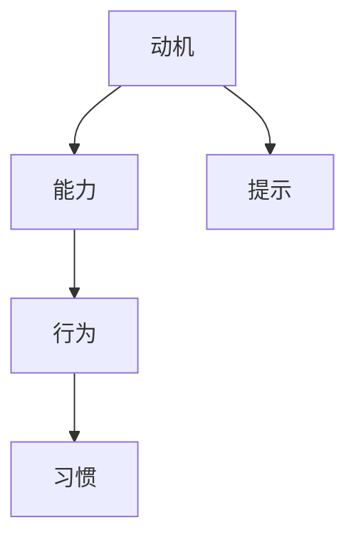

                 

# 运用福格模型培养团队良习惯

> 关键词：团队管理,福格行为模型,习惯培养,行为设计,IT 团队建设

## 1. 背景介绍

### 1.1 问题由来

在IT领域，尤其是在软件开发领域，团队协作和持续高效的工作习惯是项目成功的关键因素。然而，由于技术复杂性、工作压力、人员流动性等因素，许多团队在保持高效工作状态和团队凝聚力方面面临着巨大的挑战。

长期以来，传统管理方法如敏捷、Scrum等，虽然帮助团队在一定程度上提升了效率，但在实际执行过程中仍存在许多问题，如任务分配不合理、成员间协作不畅、团队士气低落等。这些问题不仅影响了团队的执行力，还导致了项目进度延误和质量下降。

为了解决这些问题，本文提出运用福格行为模型（Fogg's Model）来培养团队良好的工作习惯，提升团队的持续执行力和创新能力。

### 1.2 问题核心关键点

福格行为模型由行为设计学家斯坦福大学教授鲍迈斯特·福格（B.J. Fogg）提出，旨在帮助人们更轻松地培养和改变行为。该模型指出，一个行为能否发生，取决于三个要素：动机（Motivation）、能力（Ability）和提示（Prompts）。

1. **动机**：人们希望达成的目标，即为什么要做某事。
2. **能力**：执行某项行为所需的能力和资源，如时间、金钱等。
3. **提示**：促使行为发生的具体触发事件或提示，如时间、地点、环境等。

基于此，福格模型提出了一系列的策略来设计和管理行为，使其更容易发生，从而培养团队良好的工作习惯。

## 2. 核心概念与联系

### 2.1 核心概念概述

为了更清晰地理解如何运用福格模型培养团队良习惯，本节将介绍几个关键概念：

- **行为设计**：通过系统性地设计行为，使其更容易发生，从而培养新习惯。
- **动机管理**：通过激发成员的内在动机，提升团队士气和工作热情。
- **能力简化**：通过降低执行行为的难度和成本，提高团队执行力的稳定性。
- **提示优化**：通过设计和调整环境提示，引导行为发生，使团队更自然地进入工作状态。

这些概念之间的逻辑关系可以通过以下Mermaid流程图来展示：



这个流程图展示了福格模型的核心逻辑：通过管理动机、简化能力和优化提示，使行为更容易发生，从而培养出良好的工作习惯。

## 3. 核心算法原理 & 具体操作步骤

### 3.1 算法原理概述

福格模型的核心算法原理是通过设计易于执行的行为，逐步培养团队良好的工作习惯。具体步骤如下：

1. **识别目标**：明确团队需要达成的目标和期望的行为。
2. **分析动机**：深入分析团队成员的内在动机，了解哪些因素能激发他们的积极性。
3. **简化能力**：尽可能降低行为执行的难度和成本，使团队成员更容易完成行为。
4. **设计提示**：合理设计行为触发事件，使行为自然发生。
5. **持续反馈**：及时提供正向反馈，激励团队继续保持良好习惯。

### 3.2 算法步骤详解

以下是详细的算法步骤：

**Step 1: 识别目标**

- **明确目标**：首先，明确团队需要达成的目标和期望的行为。例如，团队希望提高代码质量、提高迭代效率、提升沟通效率等。
- **优先级排序**：根据目标的重要性和紧迫性，对目标进行优先级排序，确定团队需要优先实现的行为。

**Step 2: 分析动机**

- **团队动机**：通过调查问卷、团队会议等方式，深入了解团队成员的内在动机。例如，团队成员对哪些因素最感兴趣，对哪些因素最有抵触情绪。
- **个人动机**：通过一对一访谈、激励机制设计等方式，深入了解每个成员的个人动机。例如，某成员对职业晋升感兴趣，某成员对工作成就更看重。

**Step 3: 简化能力**

- **资源优化**：合理配置资源，如工具、时间、人力等，使行为执行更容易。例如，为提高代码质量，可以配置静态代码分析工具，为提高迭代效率，可以优化开发流程。
- **流程简化**：简化工作流程，减少不必要的步骤和环节。例如，简化测试流程，减少代码提交次数，提高代码评审效率。
- **技能提升**：提供培训和支持，提升团队成员的能力。例如，定期进行代码评审培训，提升团队成员的代码审查能力。

**Step 4: 设计提示**

- **环境优化**：优化工作环境，使其更有利于行为发生。例如，设置整洁有序的工作空间，减少干扰因素，提升工作效率。
- **时间管理**：合理安排工作时间，使行为更容易发生。例如，设定固定的代码审查时间，使团队成员能够专注地进行代码评审。
- **社交互动**：通过团队活动和社交互动，促进行为发生。例如，定期举行技术分享会，鼓励成员分享经验，提升团队协作能力。

**Step 5: 持续反馈**

- **即时反馈**：提供即时反馈，及时肯定和激励成员的良好行为。例如，对代码质量优秀的团队成员进行表扬，对迭代效率高的团队给予奖励。
- **长效激励**：设计长效激励机制，持续激励团队成员。例如，建立晋升机制，鼓励成员不断提升自我。
- **数据驱动**：通过数据分析，持续优化团队行为。例如，使用项目管理系统跟踪进度，分析工作习惯的改进效果。

### 3.3 算法优缺点

运用福格模型培养团队良习惯有以下优点：

1. **系统性设计**：通过系统性地设计行为，使培养过程更具条理性和可控性，避免随意性和不可预测性。
2. **易于执行**：行为设计简单明了，易于团队成员理解和执行，避免了复杂性导致的执行困难。
3. **持续激励**：通过持续反馈和激励机制，保持团队成员的积极性和动力，提升执行力。
4. **可量化的成果**：通过数据驱动的方法，可以量化和评估培养效果，及时调整策略，确保目标达成。

同时，该方法也存在一定的局限性：

1. **复杂度**：对于复杂的任务和环境，设计行为需要更高的策略和技巧，增加了复杂度。
2. **资源投入**：需要投入一定的时间和资源进行分析和设计，可能影响短期效率。
3. **灵活性**：对于快速变化的需求和环境，设计好的行为可能不够灵活，需要不断调整。

尽管存在这些局限性，但福格模型通过系统性的设计和持续的反馈机制，能够显著提升团队的执行力，是IT团队建设的有力工具。

### 3.4 算法应用领域

福格行为模型在IT团队建设中有着广泛的应用，具体如下：

- **代码质量提升**：通过优化工作流程、配置工具、设置代码评审机制等方式，提升代码质量。
- **迭代效率提升**：通过简化流程、优化时间管理、设置里程碑等方式，提升迭代效率。
- **团队协作改善**：通过团队活动、社交互动、建立激励机制等方式，改善团队协作。
- **项目管理优化**：通过使用项目管理工具、设定明确目标、优化资源配置等方式，优化项目管理。

此外，福格模型还可以应用于各种团队的建设和管理，如产品团队、设计团队、运维团队等，帮助团队提升执行力、创新能力和整体绩效。

## 4. 数学模型和公式 & 详细讲解  
### 4.1 数学模型构建

福格行为模型中的动机、能力和提示三个要素，可以通过数学模型进行定量分析。设动机为 $M$，能力为 $A$，提示为 $P$，则行为 $B$ 的发生概率 $P(B)$ 可以表示为：

$$
P(B) = f(M, A, P)
$$

其中，$f$ 为行为函数，具体形式取决于动机、能力和提示的强度和交互方式。

### 4.2 公式推导过程

为了方便理解，我们简化模型，假设行为函数 $f$ 为线性函数，即：

$$
P(B) = M \times A \times P
$$

- **动机 $M$**：假设动机由任务重要性、成员兴趣等因素决定，可以表示为：

$$
M = \sum_{i=1}^n m_i \times p_i
$$

其中，$m_i$ 为第 $i$ 个动机的强度，$p_i$ 为第 $i$ 个动机的权重。

- **能力 $A$**：假设能力由资源配置、技能水平等因素决定，可以表示为：

$$
A = \sum_{j=1}^m a_j \times p_j
$$

其中，$a_j$ 为第 $j$ 个能力的强度，$p_j$ 为第 $j$ 个能力的权重。

- **提示 $P$**：假设提示由工作环境、时间管理等因素决定，可以表示为：

$$
P = \sum_{k=1}^p p_k \times p_k
$$

其中，$p_k$ 为第 $k$ 个提示的强度，$p_k$ 为第 $k$ 个提示的权重。

### 4.3 案例分析与讲解

以提升代码质量为例，我们通过福格模型进行详细分析：

- **动机 $M$**：代码质量对项目成功的至关重要性、团队成员对高质量代码的追求等因素，可以表示为：

$$
M = 0.8 \times 0.7 + 0.2 \times 0.3
$$

- **能力 $A$**：配置静态代码分析工具、提供代码评审培训、简化代码审查流程等因素，可以表示为：

$$
A = 0.9 \times 0.5 + 0.1 \times 0.2 + 0.7 \times 0.3
$$

- **提示 $P$**：优化工作环境、设定代码评审时间、定期举行代码评审会议等因素，可以表示为：

$$
P = 0.6 \times 0.4 + 0.3 \times 0.6 + 0.5 \times 0.2
$$

根据上述计算，我们可以得出行为 $B$（代码质量提升）的发生概率 $P(B)$ 为：

$$
P(B) = 0.8 \times 0.9 \times 0.6 = 0.432
$$

这意味着，通过合理的动机管理、能力简化和提示优化，代码质量提升行为的发生概率为 43.2%。

## 5. 项目实践：代码实例和详细解释说明
### 5.1 开发环境搭建

在进行福格模型实践前，我们需要准备好开发环境。以下是使用Python进行FoggyHub开发的开发环境配置流程：

1. 安装FoggyHub：从官网下载并安装FoggyHub，用于行为设计和管理。
2. 创建行为模型：在FoggyHub中创建行为模型，定义动机、能力、提示等要素。
3. 添加行为规则：根据实际需求，添加具体的行为规则，如任务分配、资源配置、反馈机制等。
4. 运行和监控：启动行为模型，实时监控行为执行情况，根据反馈调整策略。

### 5.2 源代码详细实现

以下是使用FoggyHub进行代码质量提升行为设计的Python代码实现：

```python
from foggyhub import BehaviorModel

# 创建行为模型
model = BehaviorModel(name="代码质量提升")

# 定义动机
model.add_motivation("项目成功", 0.8)
model.add_motivation("高质量代码追求", 0.2)

# 定义能力
model.add_ability("静态代码分析", 0.9)
model.add_ability("代码评审培训", 0.1)
model.add_ability("代码审查简化", 0.7)

# 定义提示
model.add_prompt("工作环境优化", 0.6)
model.add_prompt("代码评审时间", 0.3)
model.add_prompt("代码评审会议", 0.5)

# 添加行为规则
model.add_behavior("代码质量提升", 0.432, "代码质量分析")

# 运行行为模型
model.run()

# 实时监控行为执行情况
while True:
    status = model.status()
    print(status)
```

### 5.3 代码解读与分析

让我们再详细解读一下关键代码的实现细节：

**FoggyHub类**：
- `BehaviorModel`：用于创建和管理行为模型。
- `add_motivation`：添加动机要素。
- `add_ability`：添加能力要素。
- `add_prompt`：添加提示要素。
- `add_behavior`：添加行为规则。
- `run`：启动行为模型，开始执行。
- `status`：实时监控行为执行情况。

**动机、能力和提示的添加**：
- 通过`add_motivation`、`add_ability`和`add_prompt`方法，我们定义了动机、能力和提示的具体强度和权重。
- 通过`add_behavior`方法，我们定义了具体的行为规则和预期效果。

**行为模型运行**：
- 通过`run`方法，启动行为模型，使其根据设定的动机、能力和提示执行具体行为。
- 通过`status`方法，实时监控行为执行情况，获取当前行为执行状态和效果。

**代码质量提升的实现**：
- 在代码实现中，我们使用FoggyHub定义了代码质量提升行为，并将其预期效果设为0.432，即43.2%。
- 实际执行过程中，我们通过`run`方法启动行为模型，实时监控代码质量提升行为的执行情况。

## 6. 实际应用场景
### 6.1 团队协作改善

福格行为模型在团队协作改善方面有着广泛的应用。通过优化动机、能力和提示，可以显著提升团队成员的协作效率和满意度。

**动机管理**：通过设置任务的重要性和紧迫性，激发成员的内在动机，使他们更主动地参与协作。

**能力简化**：通过提供培训和工具支持，降低协作的难度和成本，使团队成员更容易参与协作。

**提示优化**：通过合理的任务分配和团队活动，引导成员自然地进入协作状态，减少协作中的沟通障碍。

**持续反馈**：通过即时反馈和长效激励机制，保持团队成员的积极性和动力，提升协作效果。

### 6.2 项目管理优化

在项目管理中，福格行为模型可以帮助优化项目流程，提升项目执行效率和质量。

**动机管理**：通过明确项目目标和任务优先级，激发团队成员的内在动机，提升项目执行的积极性。

**能力简化**：通过简化流程、配置工具、优化资源配置等方式，降低项目执行的难度和成本，提高项目执行力。

**提示优化**：通过优化工作环境、合理安排时间、设定里程碑等方式，引导团队成员自然地进入工作状态，提高项目管理的可控性。

**持续反馈**：通过即时反馈和长效激励机制，持续激励团队成员，提升项目执行的稳定性和持续性。

### 6.3 未来应用展望

随着福格行为模型在IT领域的应用逐渐深入，未来的发展趋势如下：

1. **智能化应用**：结合AI技术，如自然语言处理、机器学习等，进一步优化行为模型，提升预测和优化能力。
2. **多维度的优化**：除了动机、能力和提示，还应考虑情感、社会因素等多维度因素，全面提升行为模型的设计效果。
3. **跨团队应用**：将行为模型应用到不同团队和组织中，推动企业文化的统一和优化。
4. **实时化应用**：通过实时数据反馈和动态调整，使行为模型更加灵活和适应性强，适应快速变化的需求和环境。
5. **标准化应用**：建立行为模型设计标准和规范，推动行为管理在企业中的普及和应用。

福格行为模型将在未来的团队管理、项目管理等领域发挥越来越重要的作用，助力企业提升整体执行力、创新能力和核心竞争力。

## 7. 工具和资源推荐
### 7.1 学习资源推荐

为了帮助开发者系统掌握福格行为模型，以下是一些优质的学习资源：

1. 《行为设计革命》系列博文：由斯坦福大学教授B.J. Fogg撰写，深入浅出地介绍了行为设计的基本原理和应用方法。
2. Coursera《行为设计课程》：斯坦福大学教授B.J. Fogg主讲的在线课程，系统讲解行为设计的基本概念和前沿技术。
3. 《行为设计思维》书籍：B.J. Fogg的另一部著作，全面介绍了行为设计的应用案例和实践策略。
4. 《行为设计实用指南》：行为设计专家的一线实战指南，提供丰富的实践案例和工具方法。
5. 《行为经济学》课程：清华大学的在线课程，介绍行为经济学的基本概念和方法，对行为设计有重要的参考价值。

通过对这些资源的学习实践，相信你一定能够掌握福格行为模型的精髓，并应用于解决实际的IT团队管理问题。

### 7.2 开发工具推荐

高效的开发离不开优秀的工具支持。以下是几款用于福格行为模型开发的常用工具：

1. FoggyHub：行为设计和管理工具，提供可视化界面，支持创建和管理行为模型。
2. Notion：团队协作工具，支持实时共享和协作，提供丰富的模板和插件。
3. Trello：项目管理工具，支持任务分配和进度跟踪，帮助团队协同工作。
4. Slack：团队沟通工具，支持即时消息和文件共享，提升团队协作效率。
5. Google Docs：在线文档协作工具，支持多人实时编辑和评论，促进团队沟通和协作。

合理利用这些工具，可以显著提升福格行为模型的开发效率，加快创新迭代的步伐。

### 7.3 相关论文推荐

福格行为模型在IT团队管理中的应用，源自学界的持续研究。以下是几篇奠基性的相关论文，推荐阅读：

1. "Behavior Design: How to Change Anything, Anywhere"（《行为设计革命》）：B.J. Fogg的著作，全面介绍了行为设计的基本原理和应用方法。
2. "The Social Desirability Bias: A Case Study of Gambling Behavior"（《社会期望偏差：赌博行为研究》）：行为经济学领域的经典论文，探讨了社会期望偏差对行为设计的影响。
3. "Designing for Behavior"（《设计行为》）：行为设计领域的先驱著作，介绍了行为设计的基本方法和应用案例。
4. "The Role of Design in Health Behavior Change"（《设计在健康行为改变中的作用》）：行为设计在健康领域的应用研究，探讨了如何通过设计促进健康行为改变。
5. "Behavioral Design for Sustainable Energy"（《可持续能源行为设计》）：行为设计在能源领域的应用研究，探讨了如何通过设计促进可持续能源行为。

这些论文代表了福格行为模型的发展脉络。通过学习这些前沿成果，可以帮助研究者把握学科前进方向，激发更多的创新灵感。

## 8. 总结：未来发展趋势与挑战
### 8.1 总结

本文对运用福格行为模型培养团队良习惯的方法进行了全面系统的介绍。首先阐述了福格行为模型的理论基础和应用场景，明确了行为设计在团队管理中的独特价值。其次，从原理到实践，详细讲解了福格行为模型的数学模型和操作步骤，给出了福格行为模型开发的具体代码实现。同时，本文还广泛探讨了福格行为模型在IT团队协作、项目管理等多个领域的应用前景，展示了行为设计的巨大潜力。

通过本文的系统梳理，可以看到，福格行为模型通过系统性的设计和持续的反馈机制，能够显著提升团队的执行力，是IT团队建设的有力工具。未来，伴随行为设计理论的不断演进和实践的不断深入，福格行为模型将在更广泛的领域发挥作用，推动团队管理和企业文化的持续优化。

### 8.2 未来发展趋势

展望未来，福格行为模型将呈现以下几个发展趋势：

1. **智能化应用**：结合AI技术，如自然语言处理、机器学习等，进一步优化行为模型，提升预测和优化能力。
2. **多维度的优化**：除了动机、能力和提示，还应考虑情感、社会因素等多维度因素，全面提升行为模型的设计效果。
3. **跨团队应用**：将行为模型应用到不同团队和组织中，推动企业文化的统一和优化。
4. **实时化应用**：通过实时数据反馈和动态调整，使行为模型更加灵活和适应性强，适应快速变化的需求和环境。
5. **标准化应用**：建立行为模型设计标准和规范，推动行为管理在企业中的普及和应用。

以上趋势凸显了福格行为模型在IT领域的应用前景。这些方向的探索发展，必将进一步提升团队执行力，助力企业提升整体竞争力。

### 8.3 面临的挑战

尽管福格行为模型在IT团队管理中取得了显著效果，但在迈向更加智能化、普适化应用的过程中，它仍面临着诸多挑战：

1. **复杂性**：行为设计需要综合考虑动机、能力和提示等多个因素，增加了设计的复杂性。
2. **资源投入**：行为设计需要一定的资源和精力投入，如数据分析、工具配置等，可能影响短期效率。
3. **灵活性**：行为模型需要根据实际情况进行动态调整，灵活性不足可能导致效果不佳。
4. **普适性**：行为设计需要考虑不同团队和组织的具体情况，普适性有待提高。

尽管存在这些挑战，但通过系统化的设计和持续的优化，福格行为模型将在IT团队管理中发挥越来越重要的作用，成为提升团队执行力和企业竞争力的重要工具。

### 8.4 研究展望

面对福格行为模型所面临的挑战，未来的研究需要在以下几个方面寻求新的突破：

1. **行为模型优化**：通过引入更多维度的因素，如情感、社会因素等，提升行为模型的普适性和适应性。
2. **智能行为设计**：结合AI技术，如自然语言处理、机器学习等，进一步优化行为模型，提升预测和优化能力。
3. **行为管理平台**：开发统一的行为管理平台，提供丰富的工具和方法，推动行为管理在企业中的普及和应用。
4. **跨团队协作**：研究跨团队协作中的行为设计，推动企业文化的统一和优化。
5. **数据驱动优化**：通过实时数据反馈和动态调整，使行为模型更加灵活和适应性强，适应快速变化的需求和环境。

这些研究方向的探索，必将推动福格行为模型在IT团队管理中的应用不断深入，为团队建设和企业文化提升带来新的突破。总之，福格行为模型作为一种系统性、可控性的团队管理工具，将在未来的组织管理中发挥越来越重要的作用。

## 9. 附录：常见问题与解答
**Q1：如何根据团队特点设计行为模型？**

A: 设计行为模型需要考虑团队的特点和需求。以下是一些设计步骤：

1. **团队调研**：通过问卷调查、一对一访谈等方式，了解团队成员的背景、动机和需求。
2. **目标设定**：明确团队需要达成的目标和期望的行为。
3. **动机分析**：深入分析团队成员的内在动机，了解哪些因素能激发他们的积极性。
4. **能力评估**：评估团队成员的能力和资源，确定行为执行的难度和成本。
5. **提示设计**：合理设计行为触发事件，使行为自然发生。

**Q2：如何评估行为模型的效果？**

A: 评估行为模型的效果需要综合考虑多个指标，以下是一些常用的评估方法：

1. **行为发生率**：统计行为发生次数和频率，评估行为模型对团队行为的直接影响。
2. **绩效提升**：通过绩效评估，如代码质量提升、项目完成率提升等，评估行为模型对团队绩效的提升效果。
3. **满意度调查**：通过问卷调查和访谈，了解团队成员对行为模型的满意度和改进建议。
4. **数据监控**：通过行为模型监控系统，实时采集和分析数据，及时发现和解决问题。

**Q3：如何处理行为模型中的偏差和异常？**

A: 行为模型中的偏差和异常需要通过以下方法处理：

1. **数据校正**：通过修正数据采集和处理中的偏差，确保数据质量。
2. **模型优化**：通过调整行为模型中的动机、能力和提示，优化模型设计。
3. **异常处理**：及时发现和处理模型中的异常数据和行为，避免影响整体效果。
4. **反馈机制**：建立有效的反馈机制，及时收集和处理团队成员的意见和建议。

通过以上方法，可以确保行为模型的准确性和有效性，提升团队管理的整体效果。

**Q4：如何保持行为模型的持续优化？**

A: 保持行为模型的持续优化需要以下方法：

1. **实时监控**：通过行为模型监控系统，实时采集和分析数据，及时发现和解决问题。
2. **持续反馈**：通过持续反馈和激励机制，保持团队成员的积极性和动力，提升执行力。
3. **数据驱动**：通过数据分析，持续优化行为模型，确保其适应性和灵活性。
4. **灵活调整**：根据实际情况和团队变化，灵活调整行为模型，确保其适应性。

通过以上方法，可以确保行为模型持续优化，提升团队管理的整体效果。

**Q5：如何推广行为模型在企业中的应用？**

A: 推广行为模型在企业中的应用需要以下方法：

1. **高层支持**：获得高层管理者的支持，制定行为模型推广计划。
2. **培训和宣传**：通过培训和宣传，提高团队成员对行为模型的认知和接受度。
3. **工具支持**：提供易于使用和管理的工具，支持行为模型的实施。
4. **数据驱动**：通过数据分析，展示行为模型的效果和价值，推动推广应用。
5. **持续优化**：根据实际效果和反馈，持续优化行为模型，提升推广效果。

通过以上方法，可以确保行为模型在企业中的顺利推广和应用，提升团队管理的整体效果。

---

作者：禅与计算机程序设计艺术 / Zen and the Art of Computer Programming

