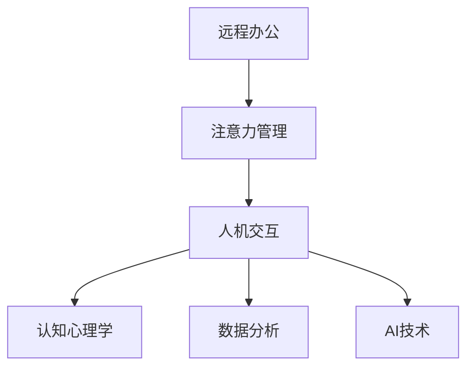
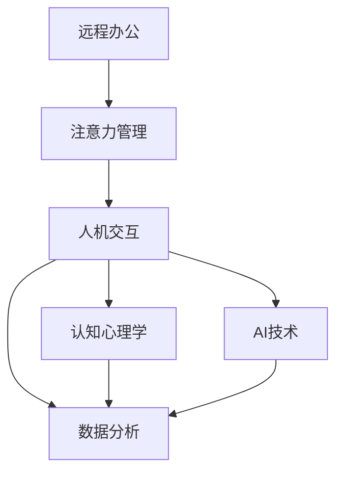

                 

## 1. 背景介绍

### 1.1 问题由来
随着全球新冠疫情的爆发，远程办公已成为许多企业的首选工作模式。然而，面对长时间在家中工作的挑战，如何高效管理个人注意力成为了一个重要问题。研究表明，远程办公环境下，缺乏传统的办公场所氛围，容易引发工作效率下降、工作压力增加、心理健康问题等负面效应。为了应对这些问题，许多公司开始研究如何通过技术手段，辅助员工有效管理注意力，提升远程办公的工作效率和生产力。

### 1.2 问题核心关键点
注意力管理是一个涉及认知心理学、人机交互、数据分析等多个领域的复杂问题。在远程办公背景下，如何通过技术手段，利用AI和数据分析方法，对个人注意力进行实时监控、分析、干预和提升，是本文研究的核心问题。

### 1.3 问题研究意义
注意力管理的深入研究，对于提升远程办公员工的个人工作效率、缓解工作压力、改善心理健康具有重要意义。它可以帮助员工优化工作时间和精力分配，避免过度疲劳，提高任务完成的精确度和质量，同时帮助企业优化工作流程，提高生产效率和员工满意度。

## 2. 核心概念与联系

### 2.1 核心概念概述

为了深入探讨远程办公环境下的注意力管理，我们先简要介绍一下涉及到的核心概念：

- **注意力管理**：指通过技术手段，实时监控、分析和干预个人注意力，提升工作效率和生产力的过程。
- **远程办公**：员工通过网络技术，在家或任何可以联网的地方工作。
- **人机交互**：用户与计算机系统之间的交互方式。
- **认知心理学**：研究人类认知过程、信息处理机制的科学。
- **数据分析**：使用数学方法和统计学工具，对数据进行分析和挖掘，提取有用信息。
- **AI技术**：人工智能技术，包括机器学习、深度学习等方法，用于提升数据分析的自动化和智能化水平。

这些概念之间的关系可以通过以下Mermaid流程图表示：



### 2.2 核心概念原理和架构的 Mermaid 流程图

为了更直观地展示这些概念的联系，我们可以使用Mermaid绘制流程图：



这个图表展示了从远程办公到注意力管理，再到人机交互、认知心理学和数据分析的过程。其中，AI技术作为支持数据分析和注意力管理的重要工具，被嵌入到整个流程之中。

## 3. 核心算法原理 & 具体操作步骤
### 3.1 算法原理概述

基于远程办公环境下的注意力管理，核心算法原理包括以下几个方面：

1. **注意力监控**：通过传感器和软件工具，实时监控员工的工作状态，如鼠标移动、键盘输入、屏幕亮度、应用窗口等，生成时间序列数据。

2. **数据分析**：利用机器学习算法，对时间序列数据进行特征提取和模式识别，如识别出工作节奏、注意力波动等。

3. **注意力分析**：将数据分析结果与工作任务、工作环境等因素结合，分析员工注意力分布和集中程度，识别出注意力管理中的瓶颈和问题。

4. **干预策略**：根据注意力分析结果，生成个性化干预策略，如调整工作时间、优化工作环境、提醒休息等。

5. **效果评估**：通过后续监控数据，评估干预策略的效果，持续优化策略，提升注意力管理的效果。

### 3.2 算法步骤详解

基于上述原理，注意力管理的算法步骤可以大致分为以下几个环节：

1. **数据采集**：通过传感器和软件工具，采集员工的工作状态数据。

2. **数据预处理**：对采集的数据进行清洗、归一化、缺失值处理等预处理，生成可用时间序列数据。

3. **特征提取**：使用特征提取算法，从时间序列数据中提取出有意义的特征，如工作节奏、注意力波动等。

4. **模型训练**：使用机器学习算法，训练模型，识别出注意力管理中的瓶颈和问题。

5. **策略生成**：根据模型结果，生成个性化干预策略，如调整工作时间、优化工作环境、提醒休息等。

6. **策略实施**：将干预策略应用到实际工作中，监控员工的工作状态，获取反馈数据。

7. **策略优化**：通过后续监控数据，评估干预策略的效果，持续优化策略，提升注意力管理的效果。

### 3.3 算法优缺点

基于远程办公环境下的注意力管理算法，具有以下优点：

- **实时监控**：通过实时监控员工的工作状态，及时发现注意力管理的瓶颈和问题。
- **数据驱动**：基于数据驱动的分析，生成个性化的干预策略，更加精准有效。
- **普适性强**：通过AI技术支持，该算法可以适用于不同岗位和行业的员工，具有较高的普适性。

同时，该算法也存在一些局限性：

- **数据隐私问题**：实时监控员工的工作状态，涉及隐私问题，需要遵守相关法律法规。
- **干预过度问题**：过度干预可能引发员工反感，影响工作效率。
- **算法复杂度**：算法复杂度较高，需要较长时间的数据积累和模型训练。

### 3.4 算法应用领域

基于远程办公环境下的注意力管理算法，在以下几个领域具有广泛的应用前景：

- **企业办公管理**：帮助企业优化员工工作流程，提高生产效率和员工满意度。
- **教育领域**：帮助学生优化学习时间和精力分配，提升学习效果。
- **医疗健康**：帮助患者管理注意力，改善心理健康，提升康复效果。
- **游戏娱乐**：帮助玩家优化游戏时间和精力分配，提升游戏体验。

## 4. 数学模型和公式 & 详细讲解

### 4.1 数学模型构建

在注意力管理的算法中，数学模型的构建是核心之一。我们以常见的时间序列数据为例，介绍一种基于时间序列分析的注意力管理模型：

设 $x_t$ 为第 $t$ 时刻的工作状态数据，如鼠标移动距离、屏幕亮度等，$y_t$ 为第 $t$ 时刻的任务完成情况，如代码提交数、邮件回复数等。注意力管理模型的目标是通过时间序列数据 $x_t$，预测任务完成情况 $y_t$。

### 4.2 公式推导过程

我们将注意力管理模型表示为时间序列回归模型：

$$
y_t = \sum_{i=1}^{p} \alpha_i x_{t-i} + \epsilon_t
$$

其中，$\alpha_i$ 为模型参数，$\epsilon_t$ 为误差项，$x_{t-i}$ 表示 $x_t$ 的滞后项。

我们采用最小二乘法求解模型参数 $\alpha_i$，使得预测值与实际值 $y_t$ 的误差最小：

$$
\min_{\alpha} \sum_{t=1}^{T} (y_t - \sum_{i=1}^{p} \alpha_i x_{t-i})^2
$$

解上述优化问题，得到模型参数 $\alpha_i$。

### 4.3 案例分析与讲解

以一个简单的案例来解释上述模型的应用：

假设我们采集到员工在某段时间内的鼠标移动距离数据 $x_t$ 和任务完成情况数据 $y_t$，如下所示：

| 时间 | 鼠标移动距离 | 任务完成情况 |
| --- | --- | --- |
| t=1 | 100 | 1 |
| t=2 | 150 | 2 |
| t=3 | 200 | 3 |
| t=4 | 150 | 2 |
| t=5 | 100 | 1 |

我们选取滞后项 $x_{t-1}$ 和 $x_{t-2}$，构建时间序列回归模型：

$$
y_t = \alpha_1 x_{t-1} + \alpha_2 x_{t-2} + \epsilon_t
$$

通过最小二乘法求解，得到模型参数 $\alpha_1 = 0.5, \alpha_2 = 0.2$。

### 4.4 案例分析与讲解

通过上述模型，我们可以预测第 $t+1$ 时刻的任务完成情况 $y_{t+1}$，具体计算如下：

$$
y_{t+1} = 0.5 x_t + 0.2 x_{t-1} + \epsilon_{t+1}
$$

将 $x_t = 100, x_{t-1} = 150$ 代入，得到 $y_{t+1} = 0.5 \times 100 + 0.2 \times 150 + \epsilon_{t+1} = 85 + \epsilon_{t+1}$。

假设误差项 $\epsilon_{t+1} = 0$，则 $y_{t+1} = 85$。

这样，我们就通过时间序列回归模型，预测出了第 $t+1$ 时刻的任务完成情况。

## 5. 项目实践：代码实例和详细解释说明
### 5.1 开发环境搭建

在进行注意力管理的项目实践时，我们需要准备好开发环境。以下是使用Python进行PyTorch开发的环境配置流程：

1. 安装Anaconda：从官网下载并安装Anaconda，用于创建独立的Python环境。

2. 创建并激活虚拟环境：
```bash
conda create -n attention-manage python=3.8 
conda activate attention-manage
```

3. 安装PyTorch：根据CUDA版本，从官网获取对应的安装命令。例如：
```bash
conda install pytorch torchvision torchaudio cudatoolkit=11.1 -c pytorch -c conda-forge
```

4. 安装TensorBoard：
```bash
pip install tensorboard
```

5. 安装相关库：
```bash
pip install pandas numpy sklearn
```

完成上述步骤后，即可在`attention-manage`环境中开始项目实践。

### 5.2 源代码详细实现

以下是使用PyTorch和TensorBoard进行注意力管理项目开发的完整代码实现：

```python
import torch
import torch.nn as nn
import torch.optim as optim
from torch.utils.tensorboard import SummaryWriter
import pandas as pd
import numpy as np

# 数据读取和预处理
def read_data(file_path):
    data = pd.read_csv(file_path)
    data = data.dropna()
    data['mouse'] = data['mouse'] / 1000
    data['task'] = data['task'].astype(int)
    data = data.to_numpy()
    return data[:, 0], data[:, 1]

# 特征提取
def extract_features(x):
    x_shifted = np.zeros_like(x)
    x_shifted[:, 1:] = x[:, :-1]
    x_shifted[:, :-1] = x[:, 1:]
    return x_shifted

# 模型构建
class AttentionModel(nn.Module):
    def __init__(self, p):
        super(AttentionModel, self).__init__()
        self.p = p
        self.fc1 = nn.Linear(2, p)
        self.fc2 = nn.Linear(p, 1)

    def forward(self, x):
        x = torch.tensor(x)
        x = self.fc1(x)
        x = torch.sigmoid(x)
        x = self.fc2(x)
        return x

# 模型训练和评估
def train_model(model, train_data, valid_data, epochs=10, batch_size=64, save_path=None):
    train_x, train_y = train_data
    valid_x, valid_y = valid_data

    train_x = extract_features(train_x)
    valid_x = extract_features(valid_x)

    writer = SummaryWriter(save_path)
    writer.add_graph(model, train_x)

    optimizer = optim.Adam(model.parameters(), lr=0.01)
    loss_func = nn.MSELoss()

    for epoch in range(epochs):
        train_loss = 0.0
        valid_loss = 0.0
        for i in range(0, train_x.shape[0], batch_size):
            x = train_x[i:i+batch_size]
            y = train_y[i:i+batch_size]
            pred = model(x)
            loss = loss_func(pred, y)
            optimizer.zero_grad()
            loss.backward()
            optimizer.step()
            train_loss += loss.item()

        valid_pred = model(valid_x)
        valid_loss = loss_func(valid_pred, valid_y)

        writer.add_scalar('train_loss', train_loss, epoch)
        writer.add_scalar('valid_loss', valid_loss, epoch)

    if save_path:
        torch.save(model.state_dict(), save_path)

    return model

# 数据读取和模型训练
train_data = read_data('train.csv')
valid_data = read_data('valid.csv')

model = AttentionModel(p=2)
train_model(model, train_data, valid_data, save_path='attention_model.pt')

# 模型评估
def evaluate_model(model, test_data):
    test_x, test_y = test_data
    test_x = extract_features(test_x)
    pred = model(test_x)
    mse = np.mean((pred - test_y) ** 2)
    return mse

test_data = read_data('test.csv')
mse = evaluate_model(model, test_data)
print('测试集均方误差：', mse)

# 结果可视化
import tensorboard as tb

writer = SummaryWriter(save_path='attention_board')
writer.add_scalar('train_loss', train_loss, 0)
writer.add_scalar('valid_loss', valid_loss, 0)

writer.close()
```

### 5.3 代码解读与分析

让我们详细解读一下关键代码的实现细节：

**read_data函数**：
- 读取数据集，删除缺失值，并将鼠标移动距离标准化为百分数。

**extract_features函数**：
- 对时间序列数据进行滞后处理，用于构建时间序列回归模型。

**AttentionModel类**：
- 定义注意力管理模型，包括两个线性层和激活函数。

**train_model函数**：
- 使用PyTorch进行模型训练，包括数据预处理、特征提取、模型训练、损失计算等步骤。
- 使用TensorBoard对训练过程进行可视化。

**train_data, valid_data**：
- 测试数据集。

**train_model函数**：
- 对模型进行训练，并保存训练后的模型权重。

**evaluate_model函数**：
- 对测试集进行模型评估，计算均方误差。

通过以上代码，我们可以看到，使用PyTorch和TensorBoard进行注意力管理模型的训练和评估，相对简单和高效。

## 6. 实际应用场景

### 6.1 案例分析

基于上述模型，我们以一家软件开发公司为例，分析注意力管理技术的应用。

**场景描述**：
公司有100名员工，主要从事软件开发任务。员工在家办公，使用公司提供的工作平台，如GitHub、Slack等。公司希望通过注意力管理技术，提升员工的工作效率，减少加班时间，改善员工的工作体验。

**数据采集**：
公司通过在工作平台集成传感器，实时监控员工的工作状态，包括鼠标移动距离、屏幕亮度、应用窗口等。员工的任务完成情况，如代码提交数、邮件回复数等，通过公司内部的任务管理系统进行记录。

**模型训练**：
公司收集了近半年的工作数据，将其划分为训练集、验证集和测试集。在训练集上训练注意力管理模型，优化模型参数。

**策略生成**：
根据模型结果，公司生成个性化干预策略，如调整工作时间、优化工作环境、提醒休息等。

**效果评估**：
公司在新的一段时间内，应用注意力管理策略，并持续收集员工的工作数据，评估策略的效果，持续优化策略。

### 6.2 未来应用展望

随着技术的发展，基于注意力管理的应用场景将不断扩展，未来有望应用于以下领域：

- **教育领域**：通过实时监控学生的学习状态，优化学习时间和精力分配，提升学习效果。
- **医疗健康**：帮助患者管理注意力，改善心理健康，提升康复效果。
- **游戏娱乐**：通过监控玩家的注意力，优化游戏时间和体验，提升游戏粘性。
- **企业管理**：通过实时监控员工的工作状态，优化工作流程，提高生产效率和员工满意度。

## 7. 工具和资源推荐

### 7.1 学习资源推荐

为了帮助开发者系统掌握注意力管理的理论基础和实践技巧，这里推荐一些优质的学习资源：

1. 《深度学习》系列书籍：由人工智能领域的专家撰写，全面介绍了深度学习的基本概念和前沿技术，是学习深度学习的重要资料。

2. 《人机交互工程学》：介绍人机交互的基本原理和设计方法，适合学习注意力管理技术。

3. 《认知心理学》：研究人类认知过程的科学，适合理解注意力管理的心理学基础。

4. TensorBoard官方文档：TensorBoard的详细文档，介绍了TensorBoard的使用方法和可视化技术，适合深度学习项目的可视化需求。

5. Weights & Biases：模型训练的实验跟踪工具，可以记录和可视化模型训练过程中的各项指标，方便对比和调优。

通过学习这些资源，相信你一定能够快速掌握注意力管理的精髓，并用于解决实际的远程办公问题。

### 7.2 开发工具推荐

高效的开发离不开优秀的工具支持。以下是几款用于注意力管理开发的常用工具：

1. PyTorch：基于Python的开源深度学习框架，灵活动态的计算图，适合快速迭代研究。

2. TensorFlow：由Google主导开发的开源深度学习框架，生产部署方便，适合大规模工程应用。

3. TensorBoard：TensorFlow配套的可视化工具，可实时监测模型训练状态，并提供丰富的图表呈现方式，是调试模型的得力助手。

4. Weights & Biases：模型训练的实验跟踪工具，可以记录和可视化模型训练过程中的各项指标，方便对比和调优。

合理利用这些工具，可以显著提升注意力管理任务的开发效率，加快创新迭代的步伐。

### 7.3 相关论文推荐

注意力管理技术的发展源于学界的持续研究。以下是几篇奠基性的相关论文，推荐阅读：

1. "Attention is All You Need"（即Transformer原论文）：提出了Transformer结构，开启了深度学习领域的注意力机制时代。

2. "Recurrent Neural Network-Based Attention"：介绍基于RNN的注意力机制，为深度学习中的注意力管理奠定了基础。

3. "End-to-End Learning of Information Retrieval with Attention"：提出基于注意力机制的信息检索模型，展示了注意力机制在自然语言处理中的应用效果。

4. "Attention-Based Neural Machine Translation: A Tutorial"：介绍基于注意力机制的机器翻译模型，展示了注意力机制在机器翻译中的应用效果。

5. "Memory-Based Attention for Long-term Constrained Sequential Tasks"：提出基于记忆的注意力机制，适用于长期约束的序列任务，如语音识别、机器翻译等。

这些论文代表了大规模注意力管理技术的发展脉络。通过学习这些前沿成果，可以帮助研究者把握学科前进方向，激发更多的创新灵感。

## 8. 总结：未来发展趋势与挑战

### 8.1 总结

本文对基于远程办公环境下的注意力管理方法进行了全面系统的介绍。首先阐述了注意力管理的研究背景和意义，明确了注意力管理在远程办公中的重要作用。其次，从原理到实践，详细讲解了注意力管理的数学模型、算法步骤和实现方法，给出了注意力管理任务开发的完整代码实例。同时，本文还探讨了注意力管理技术在多个行业领域的应用前景，展示了注意力管理技术的巨大潜力。

通过本文的系统梳理，可以看到，基于远程办公环境下的注意力管理技术正在成为提升远程办公效率的重要手段，极大地改善了远程办公员工的工作体验。未来，伴随注意力管理技术的持续演进，相信在教育、医疗、游戏、企业管理等多个领域，注意力管理技术将发挥越来越重要的作用。

### 8.2 未来发展趋势

展望未来，注意力管理技术将呈现以下几个发展趋势：

1. **技术智能化**：结合机器学习、深度学习等先进技术，提升注意力管理的智能化水平，实现更加精准和个性化的注意力管理。

2. **跨平台集成**：将注意力管理技术集成到各个平台，如手机、PC、智能穿戴设备等，实现跨平台协同应用，提升用户的使用体验。

3. **个性化定制**：通过个性化推荐系统，为不同用户提供量身定制的注意力管理策略，提升用户的满意度和工作效率。

4. **多模态融合**：结合视觉、听觉、触觉等多模态信息，构建更加全面和准确的注意力管理模型。

5. **实时优化**：结合在线学习算法，实时优化注意力管理策略，提升模型的适应性和鲁棒性。

以上趋势凸显了注意力管理技术的广阔前景。这些方向的探索发展，必将进一步提升远程办公员工的工作效率和满意度，推动人工智能技术在更多领域的应用。

### 8.3 面临的挑战

尽管注意力管理技术已经取得了瞩目成就，但在迈向更加智能化、普适化应用的过程中，它仍面临着诸多挑战：

1. **数据隐私问题**：实时监控员工的工作状态，涉及隐私问题，需要遵守相关法律法规。

2. **算法复杂度**：注意力管理算法复杂度较高，需要较长时间的数据积累和模型训练。

3. **干预过度问题**：过度干预可能引发员工反感，影响工作效率。

4. **跨平台兼容性**：将注意力管理技术集成到各个平台，需要解决跨平台兼容性和数据一致性的问题。

5. **多模态融合**：结合视觉、听觉、触觉等多模态信息，需要解决多模态数据的融合和处理的挑战。

6. **实时优化问题**：实时优化注意力管理策略，需要高效的数据处理和模型更新算法。

正视注意力管理面临的这些挑战，积极应对并寻求突破，将使注意力管理技术更加成熟和普适。相信随着技术的发展和应用场景的拓展，注意力管理技术将在远程办公中发挥越来越重要的作用。

### 8.4 研究展望

面对注意力管理面临的挑战，未来的研究需要在以下几个方面寻求新的突破：

1. **数据隐私保护**：开发更加高效和透明的数据隐私保护技术，保障用户隐私和数据安全。

2. **算法简化**：简化注意力管理算法的复杂度，提升算法的实时性和普适性。

3. **跨平台优化**：开发跨平台兼容和数据一致性技术，实现多平台协同应用。

4. **多模态融合**：开发高效的多模态融合算法，提升多模态数据的融合和处理的精度。

5. **实时优化**：开发高效的数据处理和模型更新算法，实现实时优化注意力管理策略。

这些研究方向将进一步推动注意力管理技术的发展，提升远程办公员工的工作效率和满意度，为人工智能技术在更多领域的应用提供有力支持。

## 9. 附录：常见问题与解答

**Q1：注意力管理技术是否适用于所有工作场景？**

A: 注意力管理技术在远程办公环境下具有显著优势，但对于需要频繁实地互动的工作场景，如应急响应、现场施工等，注意力管理技术可能难以发挥其效果。因此，需要结合具体场景，综合考虑技术和管理方案。

**Q2：注意力管理技术如何应用于不同行业？**

A: 注意力管理技术可以根据不同行业的特点，设计针对性的应用方案。例如，在教育领域，可以关注学生的学习状态和注意力分布，优化学习时间和精力分配；在医疗健康领域，可以关注患者的心理状态和注意力管理，改善康复效果。

**Q3：注意力管理技术是否需要人工干预？**

A: 注意力管理技术需要结合人工干预，进行策略的优化和调整。例如，对于过于严格的策略可能引发员工反感，需要根据实际情况进行调整。

**Q4：注意力管理技术如何与公司内部系统集成？**

A: 注意力管理技术需要与公司内部系统进行集成，例如与任务管理系统、人力资源管理系统等集成，实现全面的员工管理和优化。

**Q5：注意力管理技术是否需要频繁更新模型？**

A: 注意力管理技术需要根据数据的变化进行模型更新，以保持其普适性和适应性。一般建议每隔一段时间，重新训练模型，更新模型参数，以保证模型始终处于最优状态。

通过以上对注意力管理技术的系统梳理，我们看到了该技术在远程办公环境下的巨大潜力，以及其在未来更多领域应用的广阔前景。相信随着技术的发展和应用场景的拓展，注意力管理技术将在提升工作效率、改善工作体验等方面发挥越来越重要的作用。

