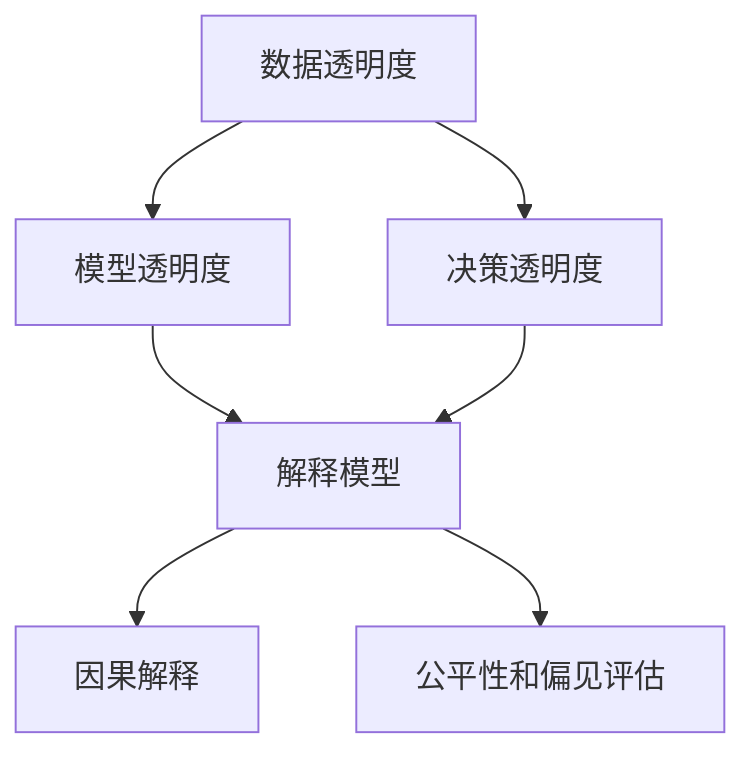

                 

# 透明度与可解释性：增强人工智能的可信度

> 关键词：透明度,可解释性,人工智能,可信度,决策树,神经网络,因果分析

## 1. 背景介绍

### 1.1 问题由来

随着人工智能(AI)技术的发展，特别是深度学习算法的广泛应用，人们在享受其带来的便利和高效的同时，也对其决策过程的透明性和可解释性产生了越来越多的关注。AI算法，尤其是黑箱模型，如深度神经网络，因为其强大的预测能力，常被应用于金融、医疗、司法等对决策透明度要求极高的领域。然而，深度学习模型通常被视为“黑箱”，其内部参数和计算过程难以直观理解，这种特性导致了模型决策过程的不可解释性和不透明性，进而引发了信任危机和法律风险。

因此，如何提高AI模型的透明度和可解释性，成为一个亟待解决的重要问题。增强模型的透明度和可解释性不仅能提高用户和决策者的信任度，还能促进模型的改进和优化，更好地服务于实际应用场景。

### 1.2 问题核心关键点

透明度和可解释性涉及的核心关键点包括：

- **可解释性（Explainability）**：指模型决策的逻辑和依据能够被理解和解释。其目标是让非专家也能理解模型如何得出结论。
- **透明度（Transparency）**：指模型的工作原理和过程对外界开放，包括数据处理、模型参数、训练过程等。透明度的目标是提升模型决策的公正性和可信度。
- **可信度（Trustworthiness）**：指模型决策的稳定性和可靠性，是透明度和可解释性共同作用的结果。高透明度的模型通常具有更高的可信度，因为其决策过程更加公开和可验证。
- **因果分析（Causal Analysis）**：指通过识别因果关系，理解模型决策的根本原因。因果分析是提高模型透明性和可解释性的关键手段之一。
- **公平性和偏见（Fairness and Bias）**：指模型在对待不同群体时不应存在系统性的偏见，需要确保模型决策的公平性和公正性。
- **安全和隐私（Security and Privacy）**：指模型在处理敏感数据时，应确保数据的安全和隐私，防止数据泄露和滥用。

这些关键点构成了透明度和可解释性研究的基本框架，本文将聚焦于如何通过增强模型的透明度和可解释性，提高AI系统的可信度。

## 2. 核心概念与联系

### 2.1 核心概念概述

透明度和可解释性涉及的核心概念主要包括以下几类：

- **数据透明度**：指模型使用的数据集及其处理方式的公开性，包括数据来源、处理流程和特征工程方法等。
- **模型透明度**：指模型的架构、参数及其训练过程的公开性，包括网络结构、超参数、优化器选择和训练轮次等。
- **决策透明度**：指模型在处理输入数据后生成的中间结果及其推理过程的公开性，包括特征重要性、中间向量、决策路径等。
- **解释模型**：指能够自动生成或辅助生成模型决策过程解释的工具或方法，如LIME、SHAP、IBM's Explainable AI等。
- **因果解释**：指通过因果分析理解模型决策背后的根本原因，包括干预设计、因果推断和因果图等。
- **公平性和偏见评估**：指使用公平性指标和偏见检测工具，评估模型在处理不同群体数据时的表现。

这些核心概念之间的联系可以通过以下Mermaid流程图来展示：



这个流程图展示了透明度和可解释性的核心概念及其相互关系：

1. **数据透明度**是基础，透明的数据集能够提供模型训练的可靠依据。
2. **模型透明度**是核心，透明的模型结构和参数有助于解释模型决策。
3. **决策透明度**是结果，透明的决策过程能够增强用户信任。
4. **解释模型**是工具，用于自动生成或辅助生成决策解释。
5. **因果解释**是深度，通过因果分析理解决策原因。
6. **公平性和偏见评估**是保障，确保模型决策的公正性和可信性。

这些概念共同构成了透明度和可解释性的研究框架，为提高AI系统的可信度提供了方法论基础。

## 3. 核心算法原理 & 具体操作步骤

### 3.1 算法原理概述

透明度和可解释性算法的核心思想是通过生成模型决策的透明解释，提升用户对模型的信任度。其基本原理包括：

1. **数据预处理**：透明地展示数据预处理过程，确保数据的可靠性和公正性。
2. **模型透明化**：选择可解释性较高的模型结构，或对现有模型进行可解释性转化。
3. **决策可视化**：生成和展示模型决策的解释，包括特征重要性、中间向量、决策路径等。
4. **因果分析**：使用因果图、干预设计等方法，理解模型决策的根本原因。
5. **公平性和偏见评估**：使用公平性指标和偏见检测工具，评估模型决策的公正性。

形式化地，假设有一个黑箱模型 $M$，其输入为 $x$，输出为 $y$。透明度和可解释性算法的目标是通过解释器 $I$，生成模型决策的解释 $e$，使得：

$$
e = I(x, M)
$$

这里的解释 $e$ 可以是特征重要性、中间向量、决策路径等。解释器 $I$ 负责将输入 $x$ 和模型 $M$ 转化为解释 $e$。通过这种解释，用户可以理解模型是如何得出结论的，从而增强对模型的信任。

### 3.2 算法步骤详解

透明度和可解释性算法的详细步骤包括：

1. **数据预处理**：
   - 收集和整理数据集，确保数据的质量和多样性。
   - 展示数据预处理步骤，包括数据清洗、特征工程、数据增强等。
   - 确保数据处理的透明性和公正性，避免数据偏见和错误。

2. **模型选择和训练**：
   - 选择具有较高可解释性的模型结构，如决策树、线性回归、逻辑回归等。
   - 对现有模型进行可解释性转化，如通过特征重要性分析、模型蒸馏、模型压缩等方法，提高模型的透明性。
   - 在模型训练过程中，展示模型的优化过程和超参数设置，确保训练过程的透明度。

3. **决策可视化**：
   - 生成模型的特征重要性，展示模型中哪些特征对预测结果影响最大。
   - 展示模型的中间向量，帮助用户理解模型在处理输入数据时的内部状态。
   - 可视化模型的决策路径，展示模型如何根据输入数据生成预测结果。

4. **因果分析**：
   - 使用因果图表示模型决策的因果关系，识别影响决策的关键因素。
   - 设计干预实验，通过随机控制实验理解模型决策的因果机制。
   - 通过因果推断，理解模型决策的根本原因，确保决策的可解释性和可靠性。

5. **公平性和偏见评估**：
   - 使用公平性指标，如均等机会、均等收入、均等代价等，评估模型在处理不同群体数据时的表现。
   - 使用偏见检测工具，如 fairness audits、bias metrics等，识别模型中的潜在偏见。
   - 根据评估结果，调整模型参数和优化器，确保模型决策的公正性和可信性。

### 3.3 算法优缺点

透明度和可解释性算法的优点包括：

- **提升用户信任度**：通过生成透明的解释，用户可以理解模型的决策过程，从而增强对模型的信任。
- **促进模型改进**：透明的决策过程便于发现模型的缺陷和错误，促进模型的改进和优化。
- **保障公平性和公正性**：透明的模型有助于识别和修正模型中的偏见，确保模型决策的公平性和公正性。
- **提高模型可信度**：透明的模型更容易受到法律和伦理的监管，提高系统的可信度。

然而，透明度和可解释性算法也存在一些局限性：

- **计算复杂度高**：生成透明的解释通常需要较高的计算资源，尤其是在处理大规模数据和高复杂度模型时，计算成本较高。
- **解释准确性不足**：生成的解释可能不够准确，存在解释偏差和解释误差，影响用户对模型的理解。
- **模型性能下降**：某些解释方法可能对模型性能产生影响，需要权衡解释性和模型性能之间的关系。

尽管存在这些局限性，但通过合理的算法设计和应用，透明度和可解释性算法仍能在提升AI系统可信度方面发挥重要作用。

### 3.4 算法应用领域

透明度和可解释性算法在多个领域中得到了广泛应用，主要包括：

- **金融风控**：在金融领域，透明度和可解释性算法被用于评估信用评分、风险评估等决策的公平性和可信度。
- **医疗诊断**：在医疗领域，透明度和可解释性算法被用于理解诊断模型中的决策依据，确保诊断的公正性和可信性。
- **司法判决**：在司法领域，透明度和可解释性算法被用于解释判决依据，确保司法过程的公正性和透明度。
- **自动化驾驶**：在自动化驾驶领域，透明度和可解释性算法被用于理解决策过程，确保行车安全。
- **智能客服**：在智能客服领域，透明度和可解释性算法被用于解释决策依据，提升用户体验和信任度。

这些领域对决策透明性和可信度要求较高，透明度和可解释性算法的应用不仅有助于提高模型性能，还能增强用户和决策者的信任感，从而提升系统的整体效能。

## 4. 数学模型和公式 & 详细讲解 & 举例说明

### 4.1 数学模型构建

透明度和可解释性算法的数学模型构建包括以下几个关键部分：

1. **数据集表示**：使用 $D=\{(x_i, y_i)\}_{i=1}^N$ 表示数据集，其中 $x_i$ 为输入，$y_i$ 为输出。
2. **模型表示**：使用 $M(x; \theta)$ 表示模型，其中 $\theta$ 为模型参数。
3. **解释表示**：使用 $e(x; M)$ 表示模型的解释，包括特征重要性、中间向量、决策路径等。
4. **公平性表示**：使用 $F$ 表示模型的公平性指标，如均等机会、均等收入、均等代价等。
5. **偏见表示**：使用 $B$ 表示模型的偏见指标，如偏见度、偏差度等。

### 4.2 公式推导过程

以下我们以决策树模型为例，推导特征重要性的计算公式。

假设决策树模型 $M$ 的特征集合为 $X=\{x_1, x_2, ..., x_n\}$，对训练集 $D=\{(x_i, y_i)\}_{i=1}^N$ 进行训练。在节点 $t$ 上，模型选择特征 $x_j$ 进行分裂，其分裂结果为：

$$
D_t = \{(x_i, y_i)|x_j=x_{t,j}\}
$$

其中 $x_{t,j}$ 为节点 $t$ 上的特征值。定义特征重要性 $I(x_j)$ 为特征 $x_j$ 对模型预测的贡献度，计算公式为：

$$
I(x_j) = -\sum_{t=1}^{T}(\frac{|D_t|}{N}\log\frac{|D_t|}{N} + (1-\frac{|D_t|}{N})\log(1-\frac{|D_t|}{N}))
$$

其中 $T$ 为决策树深度，$N$ 为数据集大小。该公式的物理意义是，对于每个特征 $x_j$，计算其分裂后数据集的大小与总数据集大小的比值，再取对数得到信息增益，最后对所有节点进行求和得到特征的重要性。

通过特征重要性分析，用户可以理解哪些特征对决策结果影响最大，从而增强对模型的信任和理解。

### 4.3 案例分析与讲解

假设有一家金融公司使用深度神经网络模型进行信用评分预测，模型输入为客户的各项财务指标（如收入、资产、负债等），输出为信用评分（如A、B、C等）。为了提升模型的透明度和可解释性，公司采取了以下措施：

1. **数据预处理**：收集客户财务数据，并进行清洗和特征工程。确保数据处理过程透明，并对外公开数据预处理步骤。

2. **模型选择和训练**：选择具有较高可解释性的决策树模型，并在训练过程中展示模型的优化过程和超参数设置。

3. **决策可视化**：使用特征重要性分析方法，生成特征重要性的可视化图表，帮助用户理解哪些财务指标对信用评分影响最大。

4. **因果分析**：使用因果图表示信用评分决策的因果关系，识别影响决策的关键因素。

5. **公平性和偏见评估**：使用公平性指标和偏见检测工具，评估模型在处理不同客户群体数据时的表现，确保模型决策的公正性和可信性。

通过这些措施，该公司不仅提高了模型的透明度和可解释性，还确保了信用评分决策的公正性和可信度，赢得了客户的信任和支持。

## 5. 项目实践：代码实例和详细解释说明

### 5.1 开发环境搭建

在进行透明度和可解释性实践前，我们需要准备好开发环境。以下是使用Python进行Scikit-learn开发的环境配置流程：

1. 安装Anaconda：从官网下载并安装Anaconda，用于创建独立的Python环境。

2. 创建并激活虚拟环境：
```bash
conda create -n sk-env python=3.7 
conda activate sk-env
```

3. 安装Scikit-learn：
```bash
conda install scikit-learn
```

4. 安装其他必要工具包：
```bash
pip install numpy pandas matplotlib jupyter notebook ipython
```

完成上述步骤后，即可在`sk-env`环境中开始透明度和可解释性实践。

### 5.2 源代码详细实现

下面以信用评分预测任务为例，给出使用Scikit-learn进行决策树模型可解释性分析的PyTorch代码实现。

首先，定义决策树模型和评估函数：

```python
from sklearn.tree import DecisionTreeClassifier
from sklearn.metrics import accuracy_score
from sklearn.datasets import load_boston
from sklearn.model_selection import train_test_split
import numpy as np

# 加载数据集
boston = load_boston()

# 划分训练集和测试集
X_train, X_test, y_train, y_test = train_test_split(boston.data, boston.target, test_size=0.2, random_state=42)

# 定义决策树模型
clf = DecisionTreeClassifier()

# 训练模型
clf.fit(X_train, y_train)

# 测试模型
y_pred = clf.predict(X_test)

# 计算准确率
acc = accuracy_score(y_test, y_pred)
print(f"Accuracy: {acc}")
```

接着，定义特征重要性分析函数：

```python
import numpy as np
from sklearn.tree import DecisionTreeClassifier

def feature_importance(model, X_train):
    # 获取特征重要性
    importances = np.array(model.feature_importances_)
    
    # 排序并归一化
    importances = (importances - importances.min()) / (importances.max() - importances.min())
    
    # 可视化
    importances.sort()
    X_train = X_train[:, importances.argsort()[::-1]]
    
    return importances, X_train

# 应用特征重要性分析
importances, X_train = feature_importance(clf, X_train)
```

最后，展示特征重要性和可视化结果：

```python
import matplotlib.pyplot as plt

# 可视化特征重要性
plt.bar(np.arange(len(importances)), importances)
plt.xticks(np.arange(len(importances)), boston.feature_names)
plt.xlabel('Feature')
plt.ylabel('Importance')
plt.title('Feature Importance')
plt.show()

# 可视化特征重要性
plt.scatter(X_train[:, 0], X_train[:, 1], c=y_train, cmap='viridis')
plt.xlabel('Feature 1')
plt.ylabel('Feature 2')
plt.colorbar(label='Label')
plt.title('Feature Importance')
plt.show()
```

以上就是使用Scikit-learn进行决策树模型可解释性分析的完整代码实现。可以看到，Scikit-learn库提供了丰富的模型和工具，能够轻松实现模型的透明化和可解释性分析。

### 5.3 代码解读与分析

让我们再详细解读一下关键代码的实现细节：

**特征重要性分析函数**：
- `model.feature_importances_`：获取模型中各个特征的重要性分数。
- `np.array`：将重要性分数转换为NumPy数组。
- `sort()`和`argsort()`：对特征重要性分数进行排序，并返回排序后的特征索引。
- `(X_train[:, importances.argsort()[::-1]]`：根据排序后的特征索引，重排特征矩阵，使得重要特征排列在前面。
- `plt.bar()`和`plt.scatter()`：使用Matplotlib库生成特征重要性的柱状图和散点图，直观展示特征的重要性。

**模型评估函数**：
- `accuracy_score`：计算模型在测试集上的准确率。
- `clf.fit(X_train, y_train)`：训练模型。
- `clf.predict(X_test)`：在测试集上进行预测。

可以看到，通过Scikit-learn库，我们可以非常便捷地进行决策树模型的透明化和可解释性分析。当然，工业级的系统实现还需考虑更多因素，如模型裁剪、模型服务化等，但核心的可解释性分析过程基本与此类似。

## 6. 实际应用场景

### 6.1 智能风控系统

在金融领域，智能风控系统被广泛应用，用于评估借款人的信用风险。传统的风控系统依赖于专家经验和规则，存在一定的局限性。通过透明度和可解释性算法，智能风控系统可以更好地理解模型决策的依据，提升模型的可信度。

在实际应用中，可以使用决策树、逻辑回归等可解释性较高的模型，并结合特征重要性分析、因果图等工具，对模型的决策过程进行可视化。同时，使用公平性指标和偏见检测工具，评估模型在处理不同客户群体数据时的表现，确保模型决策的公正性和可信性。

### 6.2 医疗诊断系统

在医疗领域，透明度和可解释性算法同样具有重要应用。智能诊断系统可以基于大量的医学数据进行训练，并通过可解释性算法，展示模型的诊断依据，帮助医生理解和信任系统的诊断结果。

在实际应用中，可以结合因果分析和因果图等工具，理解模型决策的因果机制，确保诊断结果的科学性和可靠性。同时，使用公平性指标和偏见检测工具，评估模型在处理不同患者数据时的表现，确保模型决策的公正性和可信性。

### 6.3 司法判决系统

在司法领域，透明度和可解释性算法同样具有重要应用。智能判决系统可以基于大量的案件数据进行训练，并通过可解释性算法，展示模型的判决依据，帮助法官理解和信任系统的判决结果。

在实际应用中，可以结合因果分析和因果图等工具，理解模型判决的因果机制，确保判决结果的科学性和可靠性。同时，使用公平性指标和偏见检测工具，评估模型在处理不同被告和原告数据时的表现，确保模型判决的公正性和可信性。

### 6.4 未来应用展望

随着透明度和可解释性算法的不断进步，其在各个领域的应用前景将更加广阔。未来，透明度和可解释性算法将在以下方面取得新的突破：

1. **自动化可解释性生成**：引入自动化生成可解释性的工具，如LIME、SHAP、IBM's Explainable AI等，提高可解释性生成的效率和准确性。
2. **多模态可解释性分析**：将符号化的先验知识，如知识图谱、逻辑规则等，与神经网络模型进行融合，增强模型决策的可解释性。
3. **因果分析的深度学习应用**：将因果分析方法引入深度学习模型，通过因果推断，理解模型决策的因果机制，提高模型的透明性和可信度。
4. **模型公平性和偏见评估的自动化**：引入自动化公平性评估工具，如 fairness audits、bias metrics等，评估模型在处理不同群体数据时的表现，确保模型决策的公正性和可信性。
5. **隐私保护技术的应用**：引入隐私保护技术，如差分隐私、同态加密等，确保在处理敏感数据时，数据的安全和隐私得到保障。

这些技术的发展和应用，将进一步提升AI系统的透明性和可信度，为社会的公平、公正和可靠奠定坚实基础。

## 7. 工具和资源推荐

### 7.1 学习资源推荐

为了帮助开发者系统掌握透明度和可解释性理论基础和实践技巧，这里推荐一些优质的学习资源：

1. 《The Master Algorithm》书籍：由 Pedro Domingos 所著，全面介绍了各种机器学习算法，包括可解释性算法。

2. CS229《Machine Learning》课程：斯坦福大学开设的机器学习经典课程，涵盖了可解释性算法的理论基础和实践技巧。

3. Kaggle竞赛平台：提供了大量的机器学习和可解释性竞赛，实践学习可解释性算法。

4. IBM's Explainable AI网站：IBM推出的可解释性AI平台，提供了丰富的可解释性工具和案例。

5. LIME和SHAP网站：提供了详细的可解释性算法介绍和实践指南。

通过对这些资源的学习实践，相信你一定能够快速掌握透明度和可解释性算法的精髓，并用于解决实际的AI问题。

### 7.2 开发工具推荐

高效的开发离不开优秀的工具支持。以下是几款用于透明度和可解释性开发的常用工具：

1. Scikit-learn：Python中的机器学习库，提供了丰富的可解释性工具和算法，如决策树、随机森林、逻辑回归等。

2. TensorFlow和PyTorch：主流的深度学习框架，提供了自动微分和自动可视化工具，方便开发透明性和可解释性模型。

3. Matplotlib和Seaborn：Python中的数据可视化库，用于生成各种图表，展示模型的特征重要性、中间向量、决策路径等。

4. IBM's Explainable AI：IBM推出的可解释性AI平台，提供了丰富的可解释性工具和案例，方便开发者实践和测试。

5. LIME和SHAP：提供了详细的可解释性算法介绍和实践指南，方便开发者实现和验证可解释性算法。

合理利用这些工具，可以显著提升透明度和可解释性算法的开发效率，加快创新迭代的步伐。

### 7.3 相关论文推荐

透明度和可解释性涉及的研究广泛，以下是几篇奠基性的相关论文，推荐阅读：

1. A Theory of Interpretable Machine Learning：提出了可解释性算法的理论基础，包括信息增益、因果推断等。

2. Algorithms for Machine Learning in an Information-Theoretic Setting：探讨了可解释性算法的信息理论基础，如信息增益、因果推断等。

3. Fairness, Accountability, and Transparency：探讨了AI系统的公平性和可信性问题，提出了公平性指标和偏见检测方法。

4. A New Approach to Fairness：提出了一种新的公平性指标，用于评估模型在处理不同群体数据时的表现。

5. Deep Neural Networks for Explainable AI：探讨了深度学习模型的可解释性问题，提出了LIME、SHAP等可解释性算法。

这些论文代表了大语言模型微调技术的发展脉络。通过学习这些前沿成果，可以帮助研究者把握学科前进方向，激发更多的创新灵感。

## 8. 总结：未来发展趋势与挑战

### 8.1 总结

本文对透明度和可解释性进行了全面系统的介绍。首先阐述了透明度和可解释性的研究背景和意义，明确了可解释性在提升用户信任度、促进模型改进、保障公平性等方面的重要性。其次，从原理到实践，详细讲解了透明度和可解释性的数学模型和算法步骤，给出了透明度和可解释性算法开发的完整代码实例。同时，本文还探讨了透明度和可解释性算法在金融风控、医疗诊断、司法判决等多个领域的应用前景，展示了透明度和可解释性算法的巨大潜力。此外，本文精选了透明度和可解释性算法的各类学习资源，力求为读者提供全方位的技术指引。

通过本文的系统梳理，可以看到，透明度和可解释性在提高AI系统可信度方面具有重要作用。增强模型的透明度和可解释性，不仅能提升用户信任度，还能促进模型的改进和优化，更好地服务于实际应用场景。未来，随着透明度和可解释性算法的不断进步，其在各个领域的应用前景将更加广阔。

### 8.2 未来发展趋势

透明度和可解释性算法的未来发展趋势包括：

1. **自动化可解释性生成**：引入自动化生成可解释性的工具，如LIME、SHAP、IBM's Explainable AI等，提高可解释性生成的效率和准确性。

2. **多模态可解释性分析**：将符号化的先验知识，如知识图谱、逻辑规则等，与神经网络模型进行融合，增强模型决策的可解释性。

3. **因果分析的深度学习应用**：将因果分析方法引入深度学习模型，通过因果推断，理解模型决策的因果机制，提高模型的透明性和可信度。

4. **模型公平性和偏见评估的自动化**：引入自动化公平性评估工具，如 fairness audits、bias metrics等，评估模型在处理不同群体数据时的表现，确保模型决策的公正性和可信性。

5. **隐私保护技术的应用**：引入隐私保护技术，如差分隐私、同态加密等，确保在处理敏感数据时，数据的安全和隐私得到保障。

这些趋势凸显了透明度和可解释性算法的广阔前景。这些方向的探索发展，必将进一步提升AI系统的透明性和可信度，为构建安全、可靠、可解释、可控的智能系统铺平道路。面向未来，透明度和可解释性算法还需要与其他人工智能技术进行更深入的融合，如知识表示、因果推理、强化学习等，多路径协同发力，共同推动自然语言理解和智能交互系统的进步。只有勇于创新、敢于突破，才能不断拓展语言模型的边界，让智能技术更好地造福人类社会。

### 8.3 面临的挑战

尽管透明度和可解释性算法已经取得了显著进展，但在迈向更加智能化、普适化应用的过程中，它仍面临诸多挑战：

1. **计算复杂度高**：生成透明的解释通常需要较高的计算资源，尤其是在处理大规模数据和高复杂度模型时，计算成本较高。

2. **解释准确性不足**：生成的解释可能不够准确，存在解释偏差和解释误差，影响用户对模型的理解。

3. **模型性能下降**：某些解释方法可能对模型性能产生影响，需要权衡解释性和模型性能之间的关系。

4. **数据隐私和安全**：在处理敏感数据时，如何确保数据的安全和隐私，防止数据泄露和滥用，是一个重要挑战。

5. **模型复杂度高**：复杂度高的大规模模型在生成透明解释时，往往面临更大的复杂度和挑战。

尽管存在这些挑战，但通过合理的算法设计和应用，透明度和可解释性算法仍能在提高AI系统可信度方面发挥重要作用。未来，研究者需要不断优化算法，提升解释准确性，降低计算复杂度，确保数据安全和隐私，才能更好地应对未来挑战。

### 8.4 研究展望

未来的研究需要在以下几个方面寻求新的突破：

1. **自动生成可解释性**：引入自动化生成可解释性的工具，如LIME、SHAP、IBM's Explainable AI等，提高可解释性生成的效率和准确性。

2. **多模态可解释性分析**：将符号化的先验知识，如知识图谱、逻辑规则等，与神经网络模型进行融合，增强模型决策的可解释性。

3. **因果分析的深度学习应用**：将因果分析方法引入深度学习模型，通过因果推断，理解模型决策的因果机制，提高模型的透明性和可信度。

4. **模型公平性和偏见评估的自动化**：引入自动化公平性评估工具，如 fairness audits、bias metrics等，评估模型在处理不同群体数据时的表现，确保模型决策的公正性和可信性。

5. **隐私保护技术的应用**：引入隐私保护技术，如差分隐私、同态加密等，确保在处理敏感数据时，数据的安全和隐私得到保障。

这些研究方向的探索，必将引领透明度和可解释性算法迈向更高的台阶，为构建安全、可靠、可解释、可控的智能系统铺平道路。面向未来，透明度和可解释性算法还需要与其他人工智能技术进行更深入的融合，如知识表示、因果推理、强化学习等，多路径协同发力，共同推动自然语言理解和智能交互系统的进步。只有勇于创新、敢于突破，才能不断拓展语言模型的边界，让智能技术更好地造福人类社会。

## 9. 附录：常见问题与解答

**Q1：什么是透明度和可解释性？**

A: 透明度（Transparency）指模型的工作原理和过程对外界开放，包括数据处理、模型参数、训练过程等。可解释性（Explainability）指模型决策的逻辑和依据能够被理解和解释，其目标是让非专家也能理解模型如何得出结论。

**Q2：透明度和可解释性算法的优点和缺点是什么？**

A: 优点包括：提升用户信任度、促进模型改进、保障公平性和公正性、提高模型可信度等。缺点包括：计算复杂度高、解释准确性不足、模型性能下降等。

**Q3：透明度和可解释性算法在金融风控系统中如何应用？**

A: 在金融风控系统中，透明度和可解释性算法被用于评估信用评分、风险评估等决策的公平性和可信度。使用决策树、逻辑回归等可解释性较高的模型，并结合特征重要性分析、因果图等工具，对模型的决策过程进行可视化。

**Q4：透明度和可解释性算法的应用前景如何？**

A: 透明度和可解释性算法在多个领域中得到了广泛应用，如金融风控、医疗诊断、司法判决、智能客服等。未来，透明度和可解释性算法将在自动化可解释性生成、多模态可解释性分析、因果分析等方面取得新的突破。

**Q5：透明度和可解释性算法在医疗诊断系统中如何应用？**

A: 在医疗诊断系统中，透明度和可解释性算法被用于理解诊断模型中的决策依据，帮助医生理解和信任系统的诊断结果。使用因果图、因果推断等工具，理解模型决策的因果机制，确保诊断结果的科学性和可靠性。

**Q6：透明度和可解释性算法如何确保公平性和公正性？**

A: 透明度和可解释性算法通过公平性指标和偏见检测工具，评估模型在处理不同群体数据时的表现，确保模型决策的公正性和可信性。使用自动化公平性评估工具，如 fairness audits、bias metrics等，评估模型在处理不同群体数据时的表现。

---

作者：禅与计算机程序设计艺术 / Zen and the Art of Computer Programming

