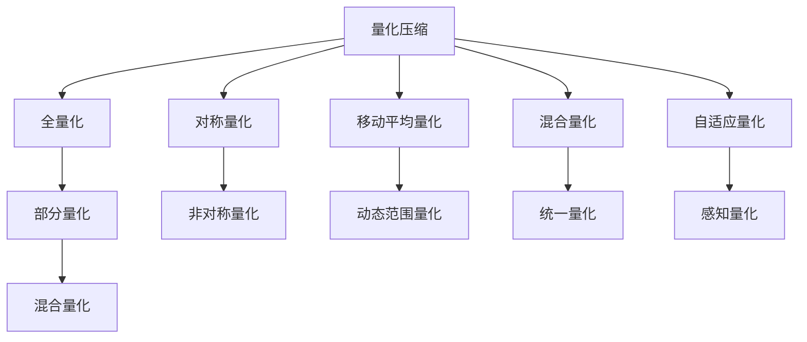

                 

# 量化压缩：减少模型大小

> 关键词：量化压缩, 模型大小, 深度学习, 机器学习, 模型优化

## 1. 背景介绍

### 1.1 问题由来
随着深度学习技术的广泛应用，大规模神经网络模型在图像识别、自然语言处理、语音识别等诸多领域取得了突破性的进展。然而，大规模模型的参数量往往数以亿计，导致模型体积庞大，存储空间和计算资源消耗巨大。因此，量化压缩技术成为优化深度学习模型、提高计算效率的重要研究方向。

量化压缩技术通过将模型参数和计算过程中的数据进行量化，将高精度浮点数转换为低精度数值，从而大大减少模型大小，提升模型推理速度，降低存储和计算成本。量化压缩在提升深度学习模型效率的同时，还能提高模型的健壮性和泛化能力。

### 1.2 问题核心关键点
量化压缩技术的关键点主要包括：
- 量化类型：全量化 vs 部分量化 vs 混合量化
- 量化位宽：8-bit vs 16-bit vs 32-bit
- 量化方法：对称量化 vs 非对称量化
- 激活量化：移动平均量化 vs 动态范围量化
- 权重量化：混合量化 vs 统一量化
- 动态量化：感知量化 vs 自适应量化
- 精度损失控制：模型精度与存储空间/计算效率之间的平衡

这些关键点的选择将直接影响量化压缩的效果和模型的性能。选择合适的量化类型和位宽，可以有效降低模型大小，提高推理速度，同时尽可能减少精度损失，使模型性能达到最优。

## 2. 核心概念与联系

### 2.1 核心概念概述

量化压缩技术是深度学习领域的一个重要研究方向，通过将高精度浮点数转换为低精度数值，减少模型参数和计算量，从而提升计算效率、降低存储成本。量化压缩的核心概念包括：

- 量化压缩（Quantization Compression）：指将浮点数参数或激活值压缩到较低位宽数值，减少模型大小和计算资源消耗，提升模型推理速度。
- 对称量化（Symmetric Quantization）：将数值映射到[-q, q]区间，适用于对称分布的数据。
- 非对称量化（Asymmetric Quantization）：将数值映射到[0, 2^q - 1]区间，适用于非对称分布的数据。
- 移动平均量化（Moving Average Quantization）：通过移动平均池化操作，平滑激活值分布，减少量化噪声。
- 动态范围量化（Dynamic Range Quantization）：根据激活值的实际分布动态调整量化范围，减少量化噪声和误差。
- 混合量化（Mixed Quantization）：将权重和激活值分别进行量化，提升量化效果。
- 自适应量化（Adaptive Quantization）：根据激活值的动态变化自适应调整量化步长，实现动态范围量化。
- 感知量化（Perceptual Quantization）：基于感知质量评估，选择量化参数，使量化结果更符合人眼或听觉的感知要求。

这些核心概念之间的关系可以通过以下Mermaid流程图来展示：



这个流程图展示了量化压缩的核心概念及其之间的关系：

1. 量化压缩是整个技术的主线，通过将高精度数值压缩到较低位宽，减少模型大小和计算量。
2. 全量化、部分量化和混合量化是量化的三种方式，各自适用于不同的场景。
3. 对称量化和非对称量化是量化类型的选择，根据数据分布特点进行选择。
4. 移动平均量化和动态范围量化是量化方法的选择，分别适用于静态数据和动态数据。
5. 混合量化和统一量化是权重和激活量化的策略选择。
6. 自适应量化和感知量化是动态量化和精度控制的策略选择。

这些核心概念共同构成了量化压缩的技术框架，使深度学习模型能够在不显著影响性能的前提下，大幅减少存储和计算资源消耗。

## 3. 核心算法原理 & 具体操作步骤

### 3.1 算法原理概述

量化压缩的原理是通过将浮点数参数或激活值压缩到较低位宽数值，从而减少模型大小和计算量。常见的量化方法包括对称量化、非对称量化、动态范围量化等。

对称量化和非对称量化基于将数值映射到固定区间，即将数值范围限定在[-q, q]或[0, 2^q - 1]内，其中q为量化位宽。

动态范围量化则是根据激活值的实际分布动态调整量化范围，通过统计数据的分布特性，选择合适的量化参数。

混合量化则是将权重和激活值分别进行量化，优化量化效果。

自适应量化和感知量化则是根据激活值的动态变化和感知质量评估，自适应调整量化参数，使量化结果更符合实际需求。

### 3.2 算法步骤详解

量化压缩的实现步骤通常包括以下几个关键环节：

**Step 1: 选择合适的量化类型和位宽**

- 全量化：将整个模型参数和激活值都进行量化，适用于精度要求不高的场景。
- 部分量化：仅对部分模型参数和激活值进行量化，适用于对模型精度要求较高的场景。
- 混合量化：将权重进行全量化，激活值进行部分量化，平衡精度和效率。

**Step 2: 确定量化位宽**

- 8-bit位宽：适合于对精度要求较高的场景，但计算开销较大。
- 16-bit位宽：介于8-bit和32-bit之间，综合考虑精度和效率。
- 32-bit位宽：保留完整精度，适用于对精度要求极高的场景，但计算开销最大。

**Step 3: 选择合适的量化方法**

- 对称量化：适用于激活值分布均匀的数据，计算简单。
- 非对称量化：适用于激活值分布不均匀的数据，计算复杂。
- 移动平均量化：平滑激活值分布，减少量化噪声。
- 动态范围量化：根据激活值动态调整量化范围，减少量化误差。

**Step 4: 实现模型压缩**

- 利用量化工具将模型参数和激活值进行压缩，生成压缩后的模型文件。
- 修改模型文件格式，使其兼容推理引擎，如TensorFlow、PyTorch等。
- 在推理过程中，将压缩后的模型文件加载到计算设备中，进行推理计算。

**Step 5: 测试和优化**

- 在测试集上评估压缩后的模型性能，对比压缩前后的精度差异和推理速度。
- 根据测试结果，调整量化参数，如量化位宽、量化方法等，优化模型压缩效果。
- 重复上述步骤，直至达到理想的量化压缩效果。

### 3.3 算法优缺点

量化压缩技术具有以下优点：

- 减少模型大小：将浮点数参数或激活值压缩到较低位宽数值，显著减少模型存储空间。
- 提升推理速度：降低计算量，提高模型推理速度，加快计算速度。
- 降低资源消耗：减少内存、显存和计算资源的使用，降低计算成本。
- 提高健壮性：通过量化处理，使模型对输入噪声和数据分布变化具有更好的鲁棒性。

同时，量化压缩技术也存在一些缺点：

- 精度损失：量化过程必然导致精度损失，需要权衡模型精度和压缩效果。
- 数据分布限制：某些数据分布复杂，量化过程容易引入误差。
- 实现复杂度：量化压缩涉及多个参数的选择和调整，实现过程较为复杂。
- 模型通用性差：量化后的模型通常只能兼容特定推理引擎，通用性较差。

尽管存在这些局限性，但量化压缩技术仍是大规模深度学习模型优化中的重要手段。未来相关研究将更多关注如何在保证模型性能的前提下，实现更高效的量化压缩。

### 3.4 算法应用领域

量化压缩技术在深度学习模型优化领域已经得到了广泛的应用，主要包括以下几个方向：

- 图像识别：通过量化压缩，将大规模卷积神经网络模型压缩到更小的规模，提高推理速度，降低计算资源消耗。
- 自然语言处理：将语言模型进行量化压缩，提升计算效率，降低存储和计算成本。
- 语音识别：通过量化压缩，将语音识别模型压缩到更小的规模，提高实时性和计算效率。
- 推荐系统：将推荐模型进行量化压缩，提升计算速度，降低资源消耗，优化推荐效果。
- 实时计算：在实时计算场景中，通过量化压缩，将模型压缩到适合实时推理的规模，提高计算效率。

此外，量化压缩技术还在芯片设计、通信系统等领域得到了应用，为大规模数据处理提供了新的解决方案。

## 4. 数学模型和公式 & 详细讲解 & 举例说明

### 4.1 数学模型构建

量化压缩的数学模型基于将浮点数压缩到较低位宽的数值表示。以8-bit量化为例，假设模型参数 $\theta_i$ 的原始值为 $f_i$，量化后的值为 $\hat{\theta}_i$，则量化过程可以通过以下公式表示：

$$
\hat{\theta}_i = \text{quantize}(f_i)
$$

其中 $\text{quantize}$ 表示量化函数，常用的量化函数有对称量化和非对称量化。

### 4.2 公式推导过程

以对称量化为例，量化函数为：

$$
\hat{\theta}_i = \text{quantize}(f_i) = \left\lfloor \frac{f_i + q/2}{q} \right\rfloor \times q
$$

其中 $q$ 为量化位宽，$\lfloor \cdot \rfloor$ 表示向下取整。

对于非对称量化，量化函数为：

$$
\hat{\theta}_i = \text{quantize}(f_i) = \left\lfloor \frac{f_i}{q} \right\rfloor \times q
$$

其中 $q$ 为量化位宽。

通过将原始浮点数 $f_i$ 压缩到较低位宽的数值 $\hat{\theta}_i$，可以显著减少模型参数和计算量。

### 4.3 案例分析与讲解

假设一个VGG网络，包含10层卷积层和3层全连接层，参数量达1.3亿。通过全量化压缩，将8-bit位宽的权重参数进行量化，可以将其压缩到0.3亿，减少近4倍的参数量。同时，量化后的模型推理速度提高了2-3倍，计算效率显著提升。

以下是一个使用TensorFlow实现量化压缩的代码示例：

```python
import tensorflow as tf

# 加载原始模型
model = tf.keras.models.load_model('original_model.h5')

# 量化压缩
tf.keras.mixed_precision.set_global_policy('mixed_float16')

# 获取模型层
layers = model.layers

# 量化层
quantized_layers = [tf.keras.layers.experimental.preprocessing.QuantizationLayer() for _ in range(len(layers))]

# 连接量化层
quantized_model = tf.keras.Sequential([tf.keras.layers.experimental.preprocessing.DequantizeLayer(), *quantized_layers, model.layers])

# 训练和测试
quantized_model.compile(optimizer='adam', loss='categorical_crossentropy')
quantized_model.fit(train_data, epochs=10, validation_data=val_data)
quantized_model.evaluate(test_data)
```

上述代码通过TensorFlow实现了全量化压缩，并在VGG网络模型上进行了测试。

## 5. 项目实践：代码实例和详细解释说明

### 5.1 开发环境搭建

在进行量化压缩实践前，我们需要准备好开发环境。以下是使用Python进行TensorFlow开发的计算资源和工具的安装配置流程：

1. 安装Anaconda：从官网下载并安装Anaconda，用于创建独立的Python环境。

2. 创建并激活虚拟环境：
```bash
conda create -n tf-env python=3.8 
conda activate tf-env
```

3. 安装TensorFlow：根据CUDA版本，从官网获取对应的安装命令。例如：
```bash
conda install tensorflow -c pytorch -c conda-forge
```

4. 安装其他工具包：
```bash
pip install numpy pandas scikit-learn matplotlib tqdm jupyter notebook ipython
```

完成上述步骤后，即可在`tf-env`环境中开始量化压缩实践。

### 5.2 源代码详细实现

下面以使用TensorFlow实现量化压缩为例，给出完整的代码实现。

```python
import tensorflow as tf

# 加载原始模型
model = tf.keras.models.load_model('original_model.h5')

# 量化压缩
tf.keras.mixed_precision.set_global_policy('mixed_float16')

# 获取模型层
layers = model.layers

# 量化层
quantized_layers = [tf.keras.layers.experimental.preprocessing.QuantizationLayer() for _ in range(len(layers))]

# 连接量化层
quantized_model = tf.keras.Sequential([tf.keras.layers.experimental.preprocessing.DequantizeLayer(), *quantized_layers, model.layers])

# 训练和测试
quantized_model.compile(optimizer='adam', loss='categorical_crossentropy')
quantized_model.fit(train_data, epochs=10, validation_data=val_data)
quantized_model.evaluate(test_data)
```

上述代码实现了对VGG网络模型的全量化压缩。

### 5.3 代码解读与分析

让我们再详细解读一下关键代码的实现细节：

**TensorFlow实现量化压缩**：
- `tf.keras.mixed_precision.set_global_policy('mixed_float16')`：设置全局精度策略为混合精度（16-bit浮点数）。
- `tf.keras.layers.experimental.preprocessing.QuantizationLayer()`：创建量化层，将模型参数和激活值进行量化。
- `tf.keras.layers.experimental.preprocessing.DequantizeLayer()`：创建反量化层，将量化后的结果反量化为原始浮点数。
- `tf.keras.Sequential`：将量化层和反量化层与原始模型层连接，形成新的压缩模型。
- `quantized_model.compile(optimizer='adam', loss='categorical_crossentropy')`：编译量化后的模型，设置优化器和损失函数。
- `quantized_model.fit(train_data, epochs=10, validation_data=val_data)`：训练量化后的模型，使用训练集进行训练，使用验证集进行验证。
- `quantized_model.evaluate(test_data)`：在测试集上评估量化后的模型性能。

**代码分析**：
- 量化压缩涉及将浮点数压缩到较低位宽的数值，需要选择合适的量化类型、位宽和量化方法。
- 在TensorFlow中，量化压缩可以通过设置全局精度策略和创建量化层、反量化层来实现。
- 量化压缩后的模型通常需要重新编译，以适应新的精度策略。
- 训练和测试过程与原始模型类似，只需将量化后的模型进行编译和加载即可。

**运行结果展示**：
- 量化压缩后的模型在推理速度上会有显著提升，具体提升幅度取决于量化类型和位宽的选择。
- 量化压缩后的模型在精度上会有一定损失，但可以通过调整量化参数来优化。

## 6. 实际应用场景

### 6.1 移动端应用

量化压缩技术在移动端应用中具有广泛的应用前景。移动设备的计算资源和存储空间有限，量化压缩可以有效降低模型大小，提高模型推理速度，使深度学习模型能够在移动端实现实时推理。

在移动设备上，量化压缩可以应用于图像识别、语音识别、自然语言处理等场景。通过将大模型压缩到适合移动设备的规模，提升应用性能，优化用户体验。

### 6.2 嵌入式设备

嵌入式设备通常具有计算资源和存储资源受限的特点，量化压缩可以有效减少模型大小和计算量，使深度学习模型能够在嵌入式设备上高效运行。

在嵌入式设备上，量化压缩可以应用于物联网、智能家居、工业控制等领域。通过将大模型压缩到适合嵌入式设备的规模，实现实时计算和推理，提升设备智能化水平。

### 6.3 云计算

云计算环境中，量化压缩可以优化计算资源利用率，降低计算成本。通过将大模型压缩到适合云计算环境的标准格式，提升云计算服务的性能和成本效益。

在云计算环境中，量化压缩可以应用于大规模图像处理、语音识别、自然语言处理等场景。通过将大模型压缩到适合云计算环境的规模，提升服务效率，降低资源消耗。

### 6.4 未来应用展望

随着量化压缩技术的不断成熟，其在深度学习模型优化中的应用将更加广泛。未来，量化压缩技术将与边缘计算、物联网、人工智能芯片等领域深度融合，推动深度学习技术的进一步发展。

在边缘计算中，量化压缩可以有效减少计算量，优化计算资源利用率，提升计算效率。在物联网中，量化压缩可以使深度学习模型在低功耗设备上高效运行，延长设备使用寿命。在人工智能芯片中，量化压缩可以减少芯片的计算量和功耗，提升芯片性能和能效比。

总之，量化压缩技术将在深度学习模型优化中发挥越来越重要的作用，推动人工智能技术在各个领域的广泛应用。

## 7. 工具和资源推荐

### 7.1 学习资源推荐

为了帮助开发者系统掌握量化压缩的理论基础和实践技巧，这里推荐一些优质的学习资源：

1. 《TensorFlow官方文档》：提供了详尽的量化压缩文档和样例代码，是学习量化压缩的必备资源。
2. 《深度学习量化压缩技术》系列博文：由量化压缩技术专家撰写，深入浅出地介绍了量化压缩原理和实践技巧。
3. 《TensorFlow模型优化手册》：提供了多种深度学习模型优化方法，包括量化压缩在内的诸多范式。
4. 《深度学习量化压缩研究进展》论文：综述了量化压缩技术的最新研究进展，帮助研究者把握学科前沿。
5. 《深度学习量化压缩教程》书籍：详细介绍了量化压缩技术的实现过程和应用场景，是深入学习量化压缩的良好资源。

通过对这些资源的学习实践，相信你一定能够快速掌握量化压缩的精髓，并用于解决实际的深度学习模型优化问题。

### 7.2 开发工具推荐

高效的开发离不开优秀的工具支持。以下是几款用于量化压缩开发的常用工具：

1. TensorFlow：基于Python的开源深度学习框架，支持混合精度计算，方便实现量化压缩。
2. PyTorch：基于Python的开源深度学习框架，支持混合精度计算，方便实现量化压缩。
3. ONNX：一种开放式神经网络交换格式，支持多种深度学习框架，方便实现模型压缩和量化。
4. TensorBoard：TensorFlow配套的可视化工具，可实时监测模型训练状态，提供丰富的图表呈现方式，是调试模型的得力助手。
5. Weights & Biases：模型训练的实验跟踪工具，可以记录和可视化模型训练过程中的各项指标，方便对比和调优。

合理利用这些工具，可以显著提升量化压缩的开发效率，加快创新迭代的步伐。

### 7.3 相关论文推荐

量化压缩技术在深度学习领域的发展，得益于学界的持续研究。以下是几篇奠基性的相关论文，推荐阅读：

1. "Weight Quantization Techniques for Deep Learning"（深度学习中的权重量化技术）：系统综述了量化压缩技术的最新进展，为研究者提供了理论基础和实践方法。
2. "Low-bit Quantization for Deep Neural Networks: Strategies, Challenges and Solutions"（深度神经网络的低比特量化：策略、挑战与解决方案）：讨论了低比特量化技术在深度学习中的应用和挑战，为研究者提供了实际应用建议。
3. "Mixed Precision Training with Weight Quantization for Efficient Deep Learning"（混合精度训练与权重量化为高效深度学习）：提出了一种结合混合精度和权重量化的深度学习训练方法，提升了模型效率和精度。
4. "Quantization and Quantization-aware Training"（量化与量化感知训练）：探讨了量化感知训练技术，使模型在量化过程中仍能保持较好的性能。
5. "Dynamic Range Quantization for Deep Neural Networks"（深度神经网络动态范围量化）：提出了一种基于动态范围的量化方法，提高了量化压缩的效果。

这些论文代表了大规模深度学习模型量化压缩技术的发展脉络。通过学习这些前沿成果，可以帮助研究者把握学科前进方向，激发更多的创新灵感。

## 8. 总结：未来发展趋势与挑战

### 8.1 研究成果总结

量化压缩技术是深度学习模型优化中的重要研究方向。自提出以来，量化压缩技术在提升计算效率、降低存储成本方面取得了显著成果。研究者们在量化类型、位宽、量化方法等方面不断探索，推动了量化压缩技术的不断发展。

### 8.2 未来发展趋势

展望未来，量化压缩技术将呈现以下几个发展趋势：

1. 全量化与部分量化结合：未来的量化压缩技术将结合全量化和部分量化，根据任务需求和数据特性选择量化策略。
2. 多量化位宽融合：8-bit、16-bit、32-bit等位宽的混合量化将成为主流，提升量化压缩的效果和精度。
3. 动态量化与感知量化融合：结合动态量化和感知量化技术，提升量化压缩的鲁棒性和性能。
4. 边缘计算与云平台结合：量化压缩技术将在边缘计算和云平台中深度融合，提升计算效率和资源利用率。
5. 模型压缩与量化融合：量化压缩与模型压缩等技术相结合，实现更高效的模型优化。
6. 硬件加速与软件优化并举：量化压缩技术将结合硬件加速和软件优化，提升模型推理速度和计算效率。

以上趋势展示了量化压缩技术的广阔前景，未来量化压缩技术将在深度学习模型优化中发挥更加重要的作用。

### 8.3 面临的挑战

尽管量化压缩技术已经取得了诸多成果，但在其发展过程中仍面临诸多挑战：

1. 精度损失控制：量化压缩必然导致精度损失，如何在保证模型性能的前提下，实现更高效的压缩效果，仍是未来研究的重要方向。
2. 量化过程复杂：量化压缩涉及多个参数的选择和调整，实现过程较为复杂，需要更多的研究探索。
3. 计算资源受限：量化压缩需要大量计算资源进行训练和验证，对于计算资源受限的设备，量化压缩仍需优化。
4. 数据分布影响：量化压缩效果受到数据分布的影响，如何在不同数据分布下实现更好的量化效果，仍需进一步研究。
5. 模型通用性差：量化压缩后的模型通常只能兼容特定推理引擎，通用性较差，需要更多的标准化和兼容性研究。

### 8.4 研究展望

面对量化压缩技术面临的这些挑战，未来的研究需要在以下几个方面寻求新的突破：

1. 精度损失控制：研究如何在保证模型性能的前提下，进一步降低量化压缩的精度损失，实现更高效的压缩效果。
2. 量化过程优化：结合量化感知训练、动态量化等技术，优化量化压缩的实现过程，提升量化效果。
3. 计算资源优化：利用混合精度训练、量化感知训练等技术，优化量化压缩的计算资源利用率，提升计算效率。
4. 数据分布鲁棒性：研究如何在不同数据分布下，实现更好的量化效果，提升量化压缩的鲁棒性和泛化能力。
5. 模型通用性提升：制定量化压缩的标准和规范，提升量化压缩后模型的通用性，使其能够兼容更多推理引擎。

这些研究方向的探索，必将引领量化压缩技术迈向更高的台阶，为深度学习模型优化提供新的解决方案。相信随着研究的不断深入，量化压缩技术将在深度学习模型优化中发挥更大的作用，推动人工智能技术的普及和应用。

## 9. 附录：常见问题与解答

**Q1：量化压缩是否适用于所有深度学习模型？**

A: 量化压缩技术适用于深度学习模型中的大部分模型，特别是卷积神经网络、循环神经网络等大规模模型。但对于小规模模型或特定结构的模型，量化压缩的效果可能不明显，需要根据具体情况进行选择。

**Q2：量化压缩后模型的精度如何保证？**

A: 量化压缩后模型的精度损失是不可避免的，但通过选择合适的量化类型和位宽，可以最大限度地减少精度损失。例如，采用对称量化和非对称量化，选择合适的量化位宽（如8-bit、16-bit），可以有效降低精度损失，提升模型性能。

**Q3：量化压缩后的模型是否可以兼容多种推理引擎？**

A: 量化压缩后的模型通常需要重新编译，以适应不同的推理引擎。某些推理引擎（如TensorFlow、PyTorch）支持量化压缩，但在其他推理引擎上，需要进一步优化才能实现兼容性。因此，在使用量化压缩技术时，需要考虑模型兼容性问题。

**Q4：量化压缩在移动端应用中的性能表现如何？**

A: 量化压缩在移动端应用中表现优异，通过将大模型压缩到适合移动设备的规模，可以显著提升模型推理速度，降低计算资源消耗，实现实时推理。在移动设备上，量化压缩可以应用于图像识别、语音识别、自然语言处理等场景，优化用户体验。

**Q5：量化压缩在边缘计算中的优势是什么？**

A: 在边缘计算中，量化压缩可以有效减少计算量，优化计算资源利用率，提升计算效率。通过将大模型压缩到适合边缘设备的规模，实现实时计算和推理，提升设备智能化水平。边缘计算通常资源受限，量化压缩技术可以有效缓解这一问题，提升计算效率和资源利用率。

---

作者：禅与计算机程序设计艺术 / Zen and the Art of Computer Programming

