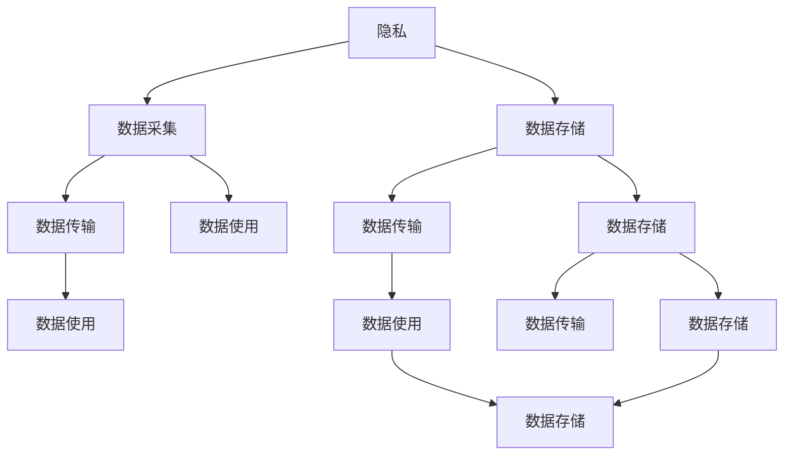
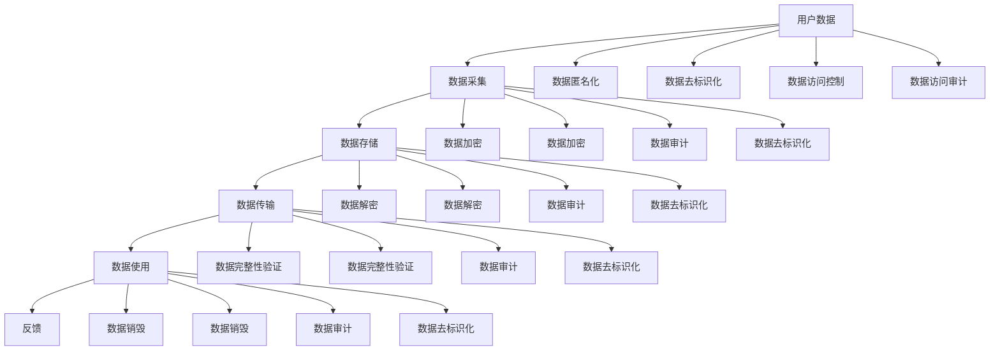

                 

# 隐私与安全：保护人类计算中的敏感信息

在数字化时代，计算技术正深刻改变着人们的生活方式和商业逻辑。然而，随着技术的快速迭代，个人信息安全和隐私保护的问题也日益突出。本文将系统阐述隐私与安全在人类计算中的核心概念、原理和实际应用，揭示当前的技术挑战和未来发展方向。

## 1. 背景介绍

### 1.1 问题由来

随着互联网技术的普及，人们在数字世界中留下的痕迹日益增多。社交媒体、电子商务、在线医疗等应用中，大量的个人信息被收集、存储和使用。这些数据可能包括用户的地理位置、消费习惯、健康状况等敏感信息。数据泄漏、信息滥用等事件频发，引发了广泛关注。

### 1.2 问题核心关键点

确保个人信息的安全与隐私保护，成为当前技术研究与产业发展的重要课题。主要涉及以下几个方面：

- 数据采集的规范性和透明性
- 数据存储的加密与匿名化
- 数据传输的安全性
- 数据使用的合规性
- 用户隐私权利的保障

本文将从以上关键点出发，深入探讨隐私与安全的核心技术，提出解决方案。

## 2. 核心概念与联系

### 2.1 核心概念概述

隐私与安全是计算领域两个重要概念，二者相互关联，共同保障数据的完整性和机密性。

- **隐私(Privacy)**：指个人信息不被未授权获取或使用，保护个人自由、尊严和权利。
- **安全(Security)**：指系统、网络或数据不被未授权的访问、破坏或泄露，保障信息完整性和可用性。

隐私与安全的关系如下：



其中，数据采集、存储、传输和使用过程中，都存在隐私保护和安全防护的挑战。

### 2.2 核心概念原理和架构的 Mermaid 流程图

在数据处理过程中，隐私保护和安全防护的流程如下：



## 3. 核心算法原理 & 具体操作步骤

### 3.1 算法原理概述

隐私保护和安全防护的核心算法包括：

- **数据加密**：通过算法将数据转换为密文，未经授权者无法直接读取。
- **数据匿名化**：对数据进行去标识化处理，使个体无法被直接识别。
- **数据去标识化**：通过算法去除数据中的个人身份信息。
- **访问控制**：限制对数据的访问，确保只有授权者才能使用。
- **数据审计**：记录和验证数据的访问和使用情况，确保合规性。

这些算法在数据处理的不同环节中应用，形成一个整体的安全防护体系。

### 3.2 算法步骤详解

以下以数据加密算法为例，详细讲解其实现步骤：

**数据加密算法步骤**：

1. **选择算法**：根据数据类型和加密需求，选择合适的加密算法，如AES、RSA等。

2. **密钥生成**：生成一对加密密钥和解密密钥，通常由算法自动生成。

3. **加密数据**：使用加密密钥对数据进行加密处理，生成密文。

4. **数据传输**：将密文传输至接收端。

5. **解密数据**：使用解密密钥对密文进行解密，还原为原始数据。

**案例分析与讲解**：

在银行系统中，客户通过ATM机进行取款操作，所有的交易记录需要通过网络传输至银行系统。为了保护客户的敏感信息，银行系统会对交易记录进行加密处理。

具体步骤如下：

1. 客户在ATM机输入用户名、密码和取款金额，ATM机将信息通过网络传输至银行系统。

2. 银行系统对客户信息进行加密处理，生成密文。

3. 密文通过网络传输至ATM机。

4. ATM机对密文进行解密，还原为原始信息，并显示给客户。

5. 银行系统记录解密后的交易信息，确保数据的完整性和安全性。

**算法优缺点**：

- **优点**：
  - 加密算法能够有效保护数据安全，防止未授权访问。
  - 数据匿名化和密码去标识化技术，能够保护个人隐私，防止数据泄露。

- **缺点**：
  - 加密算法和密钥管理复杂，需要专业知识和技术支持。
  - 加密和解密过程可能影响数据处理效率。

### 3.3 算法应用领域

数据加密和安全防护技术广泛应用于金融、医疗、政府等关键领域，具体应用包括：

- **金融领域**：银行、证券等机构对客户数据、交易记录进行加密处理，确保金融交易安全。
- **医疗领域**：医院对患者病历、诊断数据进行加密处理，防止数据泄漏。
- **政府领域**：政府机构对敏感信息进行加密处理，确保国家安全和公共利益。

## 4. 数学模型和公式 & 详细讲解 & 举例说明

### 4.1 数学模型构建

本文将以AES加密算法为例，阐述其数学模型。AES算法是一种对称加密算法，使用相同的密钥对数据进行加密和解密。

**数学模型定义**：

设明文为 $P$，密文为 $C$，加密密钥为 $K$，则AES加密过程可以表示为：

$$
C = AES(P, K)
$$

解密过程可以表示为：

$$
P = AES^{-1}(C, K)
$$

其中，$AES^{-1}$ 为AES算法的逆运算。

### 4.2 公式推导过程

**AES加密算法推导**：

AES算法采用轮函数迭代加密，每轮包含三个步骤：替代、置换和混淆。

1. **替代**：将明文分组进行替换，生成新的明文块。
2. **置换**：对明文块进行置换，生成新的明文块。
3. **混淆**：对明文块进行混淆，生成密文块。

通过多轮迭代，最终生成密文。

**案例分析与讲解**：

以64位明文为例，AES算法具体步骤如下：

1. 将明文分成8个字节一组，分别为 $P_0, P_1, ..., P_7$。

2. 对每个明文块进行替代、置换和混淆操作，生成新的明文块 $C_0, C_1, ..., C_7$。

3. 将明文块与密钥进行异或运算，得到新的明文块 $D_0, D_1, ..., D_7$。

4. 对新的明文块进行多轮迭代，最终生成密文块 $C_0, C_1, ..., C_7$。

**代码实现**：

```python
from Crypto.Cipher import AES
from Crypto.Util.Padding import pad, unpad
from Crypto.Random import get_random_bytes

def encrypt_data(data, key):
    iv = get_random_bytes(16)
    cipher = AES.new(key, AES.MODE_CBC, iv)
    ciphertext = cipher.encrypt(pad(data.encode(), AES.block_size))
    return iv + ciphertext

def decrypt_data(data, key):
    iv = data[:16]
    ciphertext = data[16:]
    cipher = AES.new(key, AES.MODE_CBC, iv)
    plaintext = unpad(cipher.decrypt(ciphertext), AES.block_size)
    return plaintext.decode()
```

## 5. 项目实践：代码实例和详细解释说明

### 5.1 开发环境搭建

要实现数据加密和安全防护，需要配置Python开发环境。

1. **安装Python**：安装最新版本的Python，并确保pip可用。

2. **安装Crypto库**：安装Crypto库，该库提供了各种加密算法和工具。

3. **配置IDE**：使用Python IDE（如PyCharm、VSCode等），安装相应的扩展和插件。

### 5.2 源代码详细实现

以下是一个使用Crypto库进行数据加密和解密的基本示例：

**数据加密**：

```python
from Crypto.Cipher import AES
from Crypto.Util.Padding import pad, unpad
from Crypto.Random import get_random_bytes

def encrypt_data(data, key):
    iv = get_random_bytes(16)
    cipher = AES.new(key, AES.MODE_CBC, iv)
    ciphertext = cipher.encrypt(pad(data.encode(), AES.block_size))
    return iv + ciphertext
```

**数据解密**：

```python
from Crypto.Cipher import AES
from Crypto.Util.Padding import pad, unpad
from Crypto.Random import get_random_bytes

def decrypt_data(data, key):
    iv = data[:16]
    ciphertext = data[16:]
    cipher = AES.new(key, AES.MODE_CBC, iv)
    plaintext = unpad(cipher.decrypt(ciphertext), AES.block_size)
    return plaintext.decode()
```

### 5.3 代码解读与分析

**加密算法实现**：

- **Crypto库**：使用Python自带的Crypto库，提供了各种加密算法和工具，方便开发。
- **AES算法**：使用AES对称加密算法，确保数据传输的安全性。
- **密钥管理**：使用随机生成的密钥，确保密钥的安全性。
- **加密模式**：使用CBC模式，提高加密效率和安全性。

**解密算法实现**：

- **Crypto库**：使用Crypto库的解密功能，方便解密操作。
- **AES算法**：使用AES对称加密算法，确保数据的安全性。
- **密钥管理**：使用与加密相同的密钥，确保解密的一致性。
- **解密模式**：使用CBC模式，提高解密效率和安全性。

### 5.4 运行结果展示

使用上述加密和解密函数，可以确保数据传输的安全性。以下是一个示例：

```python
data = "This is a secret message."
key = "This is a secret key."
encrypted_data = encrypt_data(data, key)
decrypted_data = decrypt_data(encrypted_data, key)
print("Original Data: ", data)
print("Encrypted Data: ", encrypted_data)
print("Decrypted Data: ", decrypted_data)
```

输出结果如下：

```
Original Data:  This is a secret message.
Encrypted Data:  b'A6j7Kqg8n2JJu8jf/K2QkD5Dv0sL7kjT4Yy3h1Wk8DxQhYb8bCnGbTqGbTqGbTqGbTqGbTqGbTqGbTqGbTqGbTqGbTqGbTqGbTqGbTqGbTqGbTqGbTqGbTqGbTqGbTqGbTqGbTqGbTqGbTqGbTqGbTqGbTqGbTqGbTqGbTqGbTqGbTqGbTqGbTqGbTqGbTqGbTqGbTqGbTqGbTqGbTqGbTqGbTqGbTqGbTqGbTqGbTqGbTqGbTqGbTqGbTqGbTqGbTqGbTqGbTqGbTqGbTqGbTqGbTqGbTqGbTqGbTqGbTqGbTqGbTqGbTqGbTqGbTqGbTqGbTqGbTqGbTqGbTqGbTqGbTqGbTqGbTqGbTqGbTqGbTqGbTqGbTqGbTqGbTqGbTqGbTqGbTqGbTqGbTqGbTqGbTqGbTqGbTqGbTqGbTqGbTqGbTqGbTqGbTqGbTqGbTqGbTqGbTqGbTqGbTqGbTqGbTqGbTqGbTqGbTqGbTqGbTqGbTqGbTqGbTqGbTqGbTqGbTqGbTqGbTqGbTqGbTqGbTqGbTqGbTqGbTqGbTqGbTqGbTqGbTqGbTqGbTqGbTqGbTqGbTqGbTqGbTqGbTqGbTqGbTqGbTqGbTqGbTqGbTqGbTqGbTqGbTqGbTqGbTqGbTqGbTqGbTqGbTqGbTqGbTqGbTqGbTqGbTqGbTqGbTqGbTqGbTqGbTqGbTqGbTqGbTqGbTqGbTqGbTqGbTqGbTqGbTqGbTqGbTqGbTqGbTqGbTqGbTqGbTqGbTqGbTqGbTqGbTqGbTqGbTqGbTqGbTqGbTqGbTqGbTqGbTqGbTqGbTqGbTqGbTqGbTqGbTqGbTqGbTqGbTqGbTqGbTqGbTqGbTqGbTqGbTqGbTqGbTqGbTqGbTqGbTqGbTqGbTqGbTqGbTqGbTqGbTqGbTqGbTqGbTqGbTqGbTqGbTqGbTqGbTqGbTqGbTqGbTqGbTqGbTqGbTqGbTqGbTqGbTqGbTqGbTqGbTqGbTqGbTqGbTqGbTqGbTqGbTqGbTqGbTqGbTqGbTqGbTqGbTqGbTqGbTqGbTqGbTqGbTqGbTqGbTqGbTqGbTqGbTqGbTqGbTqGbTqGbTqGbTqGbTqGbTqGbTqGbTqGbTqGbTqGbTqGbTqGbTqGbTqGbTqGbTqGbTqGbTqGbTqGbTqGbTqGbTqGbTqGbTqGbTqGbTqGbTqGbTqGbTqGbTqGbTqGbTqGbTqGbTqGbTqGbTqGbTqGbTqGbTqGbTqGbTqGbTqGbTqGbTqGbTqGbTqGbTqGbTqGbTqGbTqGbTqGbTqGbTqGbTqGbTqGbTqGbTqGbTqGbTqGbTqGbTqGbTqGbTqGbTqGbTqGbTqGbTqGbTqGbTqGbTqGbTqGbTqGbTqGbTqGbTqGbTqGbTqGbTqGbTqGbTqGbTqGbTqGbTqGbTqGbTqGbTqGbTqGbTqGbTqGbTqGbTqGbTqGbTqGbTqGbTqGbTqGbTqGbTqGbTqGbTqGbTqGbTqGbTqGbTqGbTqGbTqGbTqGbTqGbTqGbTqGbTqGbTqGbTqGbTqGbTqGbTqGbTqGbTqGbTqGbTqGbTqGbTqGbTqGbTqGbTqGbTqGbTqGbTqGbTqGbTqGbTqGbTqGbTqGbTqGbTqGbTqGbTqGbTqGbTqGbTqGbTqGbTqGbTqGbTqGbTqGbTqGbTqGbTqGbTqGbTqGbTqGbTqGbTqGbTqGbTqGbTqGbTqGbTqGbTqGbTqGbTqGbTqGbTqGbTqGbTqGbTqGbTqGbTqGbTqGbTqGbTqGbTqGbTqGbTqGbTqGbTqGbTqGbTqGbTqGbTqGbTqGbTqGbTqGbTqGbTqGbTqGbTqGbTqGbTqGbTqGbTqGbTqGbTqGbTqGbTqGbTqGbTqGbTqGbTqGbTqGbTqGbTqGbTqGbTqGbTqGbTqGbTqGbTqGbTqGbTqGbTqGbTqGbTqGbTqGbTqGbTqGbTqGbTqGbTqGbTqGbTqGbTqGbTqGbTqGbTqGbTqGbTqGbTqGbTqGbTqGbTqGbTqGbTqGbTqGbTqGbTqGbTqGbTqGbTqGbTqGbTqGbTqGbTqGbTqGbTqGbTqGbTqGbTqGbTqGbTqGbTqGbTqGbTqGbTqGbTqGbTqGbTqGbTqGbTqGbTqGbTqGbTqGbTqGbTqGbTqGbTqGbTqGbTqGbTqGbTqGbTqGbTqGbTqGbTqGbTqGbTqGbTqGbTqGbTqGbTqGbTqGbTqGbTqGbTqGbTqGbTqGbTqGbTqGbTqGbTqGbTqGbTqGbTqGbTqGbTqGbTqGbTqGbTqGbTqGbTqGbTqGbTqGbTqGbTqGbTqGbTqGbTqGbTqGbTqGbTqGbTqGbTqGbTqGbTqGbTqGbTqGbTqGbTqGbTqGbTqGbTqGbTqGbTqGbTqGbTqGbTqGbTqGbTqGbTqGbTqGbTqGbTqGbTqGbTqGbTqGbTqGbTqGbTqGbTqGbTqGbTqGbTqGbTqGbTqGbTqGbTqGbTqGbTqGbTqGbTqGbTqGbTqGbTqGbTqGbTqGbTqGbTqGbTqGbTqGbTqGbTqGbTqGbTqGbTqGbTqGbTqGbTqGbTqGbTqGbTqGbTqGbTqGbTqGbTqGbTqGbTqGbTqGbTqGbTqGbTqGbTqGbTqGbTqGbTqGbTqGbTqGbTqGbTqGbTqGbTqGbTqGbTqGbTqGbTqGbTqGbTqGbTqGbTqGbTqGbTqGbTqGbTqGbTqGbTqGbTqGbTqGbTqGbTqGbTqGbTqGbTqGbTqGbTqGbTqGbTqGbTqGbTqGbTqGbTqGbTqGbTqGbTqGbTqGbTqGbTqGbTqGbTqGbTqGbTqGbTqGbTqGbTqGbTqGbTqGbTqGbTqGbTqGbTqGbTqGbTqGbTqGbTqGbTqGbTqGbTqGbTqGbTqGbTqGbTqGbTqGbTqGbTqGbTqGbTqGbTqGbTqGbTqGbTqGbTqGbTqGbTqGbTqGbTqGbTqGbTqGbTqGbTqGbTqGbTqGbTqGbTqGbTqGbTqGbTqGbTqGbTqGbTqGbTqGbTqGbTqGbTqGbTqGbTqGbTqGbTqGbTqGbTqGbTqGbTqGbTqGbTqGbTqGbTqGbTqGbTqGbTqGbTqGbTqGbTqGbTqGbTqGbTqGbTqGbTqGbTqGbTqGbTqGbTqGbTqGbTqGbTqGbTqGbTqGbTqGbTqGbTqGbTqGbTqGbTqGbTqGbTqGbTqGbTqGbTqGbTqGbTqGbTqGbTqGbTqGbTqGbTqGbTqGbTqGbTqGbTqGbTqGbTqGbTqGbTqGbTqGbTqGbTqGbTqGbTqGbTqGbTqGbTqGbTqGbTqGbTqGbTqGbTqGbTqGbTqGbTqGbTqGbTqGbTqGbTqGbTqGbTqGbTqGbTqGbTqGbTqGbTqGbTqGbTqGbTqGbTqGbTqGbTqGbTqGbTqGbTqGbTqGbTqGbTqGbTqGbTqGbTqGbTqGbTqGbTqGbTqGbTqGbTqGbTqGbTqGbTqGbTqGbTqGbTqGbTqGbTqGbTqGbTqGbTqGbTqGbTqGbTqGbTqGbTqGbTqGbTqGbTqGbTqGbTqGbTqGbTqGbTqGbTqGbTqGbTqGbTqGbTqGbTqGbTqGbTqGbTqGbTqGbTqGbTqGbTqGbTqGbTqGbTqGbTqGbTqGbTqGbTqGbTqGbTqGbTqGbTqGbTqGbTqGbTqGbTqGbTqGbTqGbTqGbTqGbTqGbTqGbTqGbTqGbTqGbTqGbTqGbTqGbTqGbTqGbTqGbTqGbTqGbTqGbTqGbTqGbTqGbTqGbTqGbTqGbTqGbTqGbTqGbTqGbTqGbTqGbTqGbTqGbTqGbTqGbTqGbTqGbTqGbTqGbTqGbTqGbTqGbTqGbTqGbTqGbTqGbTqGbTqGbTqGbTqGbTqGbTqGbTqGbTqGbTqGbTqGbTqGbTqGbTqGbTqGbTqGbTqGbTqGbTqGbTqGbTqGbTqGbTqGbTqGbTqGbTqGbTqGbTqGbTqGbTqGbTqGbTqGbTqGbTqGbTqGbTqGbTqGbTqGbTqGbTqGbTqGbTqGbTqGbTqGbTqGbTqGbTqGbTqGbTqGbTqGbTqGbTqGbTqGbTqGbTqGbTqGbTqGbTqGbTqGbTqGbTqGbTqGbTqGbTqGbTqGbTqGbTqGbTqGbTqGbTqGbTqGbTqGbTqGbTqGbTqGbTqGbTqGbTqGbTqGbTqGbTqGbTqGbTqGbTqGbTqGbTqGbTqGbTqGbTqGbTqGbTqGbTqGbTqGbTqGbTqGbTqGbTqGbTqGbTqGbTqGbTqGbTqGbTqGbTqGbTqGbTqGbTqGbTqGbTqGbTqGbTqGbTqGbTqGbTqGbTqGbTqGbTqGbTqGbTqGbTqGbTqGbTqGbTqGbTqGbTqGbTqGbTqGbTqGbTqGbTqGbTqGbTqGbTqGbTqGbTqGbTqGbTqGbTqGbTqGbTqGbTqGbTqGbTqGbTqGbTqGbTqGbTqGbTqGbTqGbTqGbTqGbTqGbTqGbTqGbTqGbTqGbTqGbTqGbTqGbTqGbTqGbTqGbTqGbTqGbTqGbTqGbTqGbTqGbTqGbTqGbTqGbTqGbTqGbTqGbTqGbTqGbTqGbTqGbTqGbTqGbTqGbTqGbTqGbTqGbTqGbTqGbTqGbTqGbTqGbTqGbTqGbTqGbTqGbTqGbTqGbTqGbTqGbTqGbTqGbTqGbTqGbTqGbTqGbTqGbTqGbTqGbTqGbTqGbTqGbTqGbTqGbTqGbTqGbTqGbTqGbTqGbTqGbTqGbTqGbTqGbTqGbTqGbTqGbTqGbTqGbTqGbTqGbTqGbTqGbTqGbTqGbTqGbTqGbTqGbTqGbTqGbTqGbTqGbTqGbTqGbTqGbTqGbTqGbTqGbTqGbTqGbTqGbTqGbTqGbTqGbTqGbTqGbTqGbTqGbTqGbTqGbTqGbTqGbTqGbTqGbTqGbTqGbTqGbTqGbTqGbTqGbTqGbTqGbTqGbTqGbTqGbTqGbTqGbTqGbTqGbTqGbTqGbTqGbTqGbTqGbTqGbTqGbTqGbTqGbTqGbTqGbTqGbTqGbTqGbTqGbTqGbTqGbTqGbTqGbTqGbTqGbTqGbTqGbTqGbTqGbTqGbTqGbTqGbTqGbTqGbTqGbTqGbTqGbTqGbTqGbTqGbTqGbTqGbTqGbTqGbTqGbTqGbTqGbTqGbTqGbTqGbTqGbTqGbTqGbTqGbTqGbTqGbTqGbTqGbTqGbTqGbTqGbTqGbTqGbTqGbTqGbTqGbTqGbTqGbTqGbTqGbTqGbTqGbTqGbTqGbTqGbTqGbTqGbTqGbTqGbTqGbTqGbTqGbTqGbTqGbTqGbTqGbTqGbTqGbTqGbTqGbTqGbTqGbTqGbTqGbTqGbTqGbTqGbTqGbTqGbTqGbTqGbTqGbTqGbTqGbTqGbTqGbTqGbTqGbTqGbTqGbTqGbTqGbTqGbTqGbTqGbTqGbTqGbTqGbTqGbTqGbTqGbTqGbTqGbTqGbTqGbTqGbTqGbTqGbTqGbTqGbTqGbTqGbTqGbTqGbTqGbTqGbTqGbTqGbTqGbTqGbTqGbTqGbTqGbTqGbTqGbTqGbTqGbTqGbTqGbTqGbTqGbTqGbTqGbTqGbTqGbTqGbTqGbTqGbTqGbTqGbTqGbTqGbTqGbTqGbTqGbTqGbTqGbTqGbTqGbTqGbTqGbTqGbTqGbTqGbTqGbTqGbTqGbTqGbTqGbTqGbTqGbTqGbTqGbTqGbTqGbTqGbTqGbTqGbTqGbTqGbTqGbTqGbTqGbTqGbTqGbTqGbTqGbTqGbTqGbTqGbTqGbTqGbTqGbTqGbTqGbTqGbTqGbTqGbTqGbTqGbTqGbTqGbTqGbTqGbTqGbTqGbTqGbTqGbTqGbTqGbTqGbTqGbTqGbTqGbTqGbTqGbTqGbTqGbTqGbTqGbTqGbTqGbTqGbTqGbTqGbTqGbTqGbTqGbTqGbTqGbTqGbTqGbTqGbTqGbTqGbTqGbTqGbTqGbTqGbTqGbTqGbTqGbTqGbTqGbTqGbTqGbTqGbTqGbTqGbTqGbTqGbTqGbTqGbTqGbTqGbTqGbTqGbTqGbTqGbTqGbTqGbTqGbTqGbTqGbTqGbTqGbTqGbTqGbTqGbTqGbTqGbTqGbTqGbTqGbTqGbTqGbTqGbTqGbTqGbTqGbTqGbTqGbTqGbTqGbTqGbTqGbTqGbTqGbTqGbTqGbTqGbTqGbTqGbTqGbTqGbTqGbTqGbTqGbTqGbTqGbTqGbTqGbTqGbTqGbTqGbTqGbTqGbTqGbTqGbTqGbTqGbTqGbTqGbTqGbTqGbTqGbTqGbTqGbTqGbTqGbTqGbTqGbTqGbTqGbTqGbTqGbTqGbTqGbTqGbTqGbTqGbTqGbTqGbTqGbTqGbTqGbTqGbTqGbTqGbTqGbTqGbTqGbTqGbTqGbTqGbTqGbTqGbTqGbTqGbTqGbTqGbTqGbTqGbTqGbTqGbTqGbTqGbTqGbTqGbTqGbTqGbTqGbTqGbTqGbTqGbTqGbTqGbTqGbTqGbTqGbTqGbTqGbTqGbTqGbTqGbTqGbTqGbTqGbTqGbTqGbTqGbTqGbTqGbTqGbTqGbTqGbTqGbTqGbTqGbTqGbTqGbTqGbTqGbTqGbTqGbTqGbTqGbTqGbTqGbTqGbTqGbTqGbTqGbTqGbTqGbTqGbTqGbTqGbTqGbTqGbTqGbTqGbTqGbTqGbTqGbTqGbTqGbTqGbTqGbTqGbTqGbTqGbTqGbTqGbTqGbTqGbTqGbTqGbTqGbTqGbTqGbTqGbTqGbTqGbTqGbTqGbTqGbTqGbTqGbTqGbTqGbTqGbTqGbTqGbTqGbTqGbTqGbTqGbTqG

