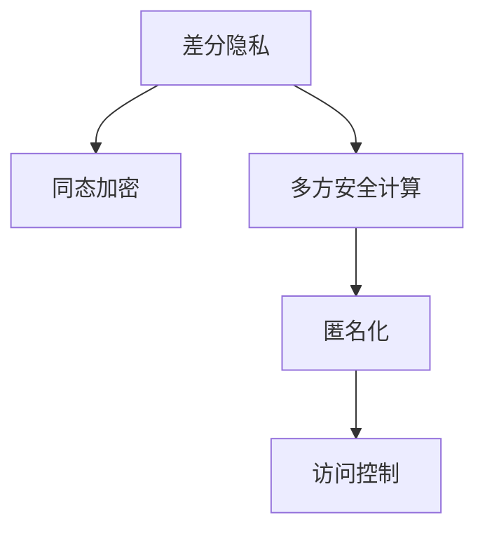

                 

# 隐私安全：为人类计算保驾护航

隐私和安全问题是当下最热门的话题之一，随着技术的进步和数据量的增加，隐私问题变得越来越重要。本篇博客将探讨隐私安全的核心概念、最新的隐私保护技术以及实际应用场景。

## 1. 背景介绍

### 1.1 问题由来
在当今数字化时代，大量的数据被收集、存储和使用，这些数据可能包括个人隐私信息、商业机密、国家安全信息等。数据泄露或滥用会给个人和社会带来极大的风险，如金融诈骗、身份盗窃、隐私曝光等。因此，如何保护数据隐私安全成为亟待解决的问题。

### 1.2 问题核心关键点
隐私保护的核心在于对数据的匿名化处理和加密存储，防止数据泄露和滥用。常用的隐私保护技术包括差分隐私、同态加密、多方安全计算等。这些技术可以从不同角度保障数据隐私，同时尽可能保证数据可用性。

## 2. 核心概念与联系

### 2.1 核心概念概述

隐私安全涉及多个关键概念，包括：

- **差分隐私(Differential Privacy)**：通过在数据处理过程中加入随机噪声，保证个体数据被删除或替换后，对统计结果的影响最小化，从而保护个体隐私。
- **同态加密(Homomorphic Encryption)**：允许在加密数据上直接执行计算，而无需解密，保障数据在传输和存储过程中的安全。
- **多方安全计算(Secure Multi-Party Computation, SMPC)**：多个参与方共同计算一个函数，而无需共享输入数据，防止数据泄露。
- **匿名化(Anonymization)**：通过去除或掩盖敏感信息，使数据无法直接关联到特定个体。
- **访问控制(Access Control)**：限制对数据的访问权限，确保只有授权用户可以访问敏感信息。

这些概念之间存在紧密联系，互为补充，共同构成隐私安全的理论基础和实践框架。

### 2.2 核心概念原理和架构的 Mermaid 流程图



这个流程图展示了隐私保护技术之间的逻辑关系：差分隐私通过噪声扰动保护数据隐私，同态加密直接保障数据计算安全，多方安全计算允许多参与方在不共享输入数据的情况下进行协作计算，匿名化通过去除标识信息保护个体隐私，访问控制通过权限管理限制数据访问。

## 3. 核心算法原理 & 具体操作步骤

### 3.1 算法原理概述

隐私保护算法可以分为两大类：基于数据加密的隐私保护算法和基于差分隐私的隐私保护算法。

- **基于加密的隐私保护算法**：通过加密技术，保护数据在传输和存储过程中的隐私。主要算法包括同态加密、零知识证明等。
- **基于差分隐私的隐私保护算法**：在数据分析过程中加入噪声，使个体数据对统计结果的影响最小化。主要算法包括Laplace机制、Gaussian机制等。

### 3.2 算法步骤详解

**基于差分隐私的算法步骤**：

1. 定义统计查询。例如，计算数据集中某一特征的平均值、最大值等。
2. 在数据集中加入随机噪声。噪声的强度由算法参数决定。
3. 执行统计查询，得到结果。
4. 输出结果。结果中包含噪声，无法反向推断原始数据。

**基于同态加密的算法步骤**：

1. 加密数据。将数据集中的每一项数据都加密，得到密文。
2. 执行计算。在密文上直接执行统计查询，得到结果。
3. 解密结果。解密结果得到原始数据，保障数据在计算过程中的安全。

### 3.3 算法优缺点

基于差分隐私的算法：

- **优点**：保护个体隐私，适用范围广，无需修改算法，只需调整噪声强度。
- **缺点**：引入噪声，可能影响统计结果的精度。

基于同态加密的算法：

- **优点**：保障数据计算过程中的安全，解密后的结果与明文结果一致。
- **缺点**：加密计算复杂度较高，仅适用于特定计算类型。

### 3.4 算法应用领域

隐私保护技术在多个领域都有重要应用：

- **金融领域**：防止金融数据泄露，保障个人隐私和交易安全。
- **医疗领域**：保护患者隐私，保障医疗数据安全。
- **政府和公共安全**：保护敏感信息，保障国家安全和公共安全。
- **云计算和分布式计算**：保障数据在存储和计算过程中的安全。
- **社交媒体和网络服务**：防止个人信息泄露，保障用户隐私。

## 4. 数学模型和公式 & 详细讲解 & 举例说明

### 4.1 数学模型构建

**差分隐私模型**：

设 $X$ 为数据集，$x$ 为数据集中的一项数据，$F$ 为统计查询函数，$D(x)$ 为在 $x$ 上执行 $F$ 的结果。差分隐私要求对任意相邻数据点 $x$ 和 $x'$，$D(x)$ 和 $D(x')$ 的分布相似度 $\epsilon$ 很小，即：

$$
\mathbb{P}[|D(x) - D(x')| \leq \epsilon] \geq 1 - \delta
$$

其中 $\epsilon$ 为隐私预算，$\delta$ 为误判概率。

**同态加密模型**：

同态加密分为全同态加密和部分同态加密。全同态加密允许在加密数据上执行任意计算，部分同态加密则限制在特定类型的计算。例如，GPSW算法实现了完全同态加密，能够对任意多项式进行加密计算，解密结果与明文结果相同。

### 4.2 公式推导过程

**差分隐私的Laplace机制**：

假设有 $n$ 项数据，$F(x)$ 为统计查询，$\sigma$ 为噪声标准差，则结果为：

$$
D(x) = \frac{1}{\sigma}\sum_{i=1}^n x_i + \frac{1}{\sigma}\sum_{i=1}^n \mathcal{L}(x_i, \sigma)
$$

其中 $\mathcal{L}(x_i, \sigma)$ 为Laplace噪声，$\mathcal{L}(x_i, \sigma) \sim \mathcal{L}(x_i)$，其中 $\mathcal{L}(x_i)$ 为标准Laplace分布。

**同态加密的GPSW算法**：

GPSW算法使用多项式模运算，将密文视为多项式系数，通过多项式求值算法得到密文结果。假设 $f(x)$ 为要计算的多项式，$x$ 为输入，$y$ 为密文，$y'$ 为密文结果，则有：

$$
y' = \sum_{i=1}^n f(x)_i y_i
$$

其中 $f(x)_i$ 为多项式 $f(x)$ 的系数。

### 4.3 案例分析与讲解

**案例：隐私保护的医疗数据**

某医院收集了大量病人的健康数据，包括年龄、性别、病历、检查结果等。医院希望使用这些数据进行医学研究，但需要保护病人隐私。使用差分隐私和同态加密，可以对这些数据进行如下处理：

1. 对病人数据进行匿名化，去除标识信息，例如去除姓名、身份证号等。
2. 对匿名化后的数据应用Laplace机制，加入噪声，保护个体隐私。
3. 将加密后的数据上传到云服务器，对数据进行统计查询，例如计算平均年龄、发病率等。
4. 解密结果，得到原始数据，保障数据安全。

## 5. 项目实践：代码实例和详细解释说明

### 5.1 开发环境搭建

以下是在Python中搭建基于差分隐私和同态加密的隐私保护项目环境：

```bash
# 安装差分隐私库
pip install differential-privacy
# 安装同态加密库
pip install pygpsw
```

### 5.2 源代码详细实现

以下是一个简单的差分隐私实现示例，使用Laplace机制：

```python
from differential_privacy import LaplaceMechanism

def differential_privacy_example():
    # 定义数据集
    data = [1, 2, 3, 4, 5]
    # 定义统计查询函数
    def query_func(data):
        return sum(data) / len(data)
    # 定义噪声参数
    epsilon = 0.1
    delta = 0.05
    # 应用Laplace机制
    mechanism = LaplaceMechanism(epsilon=epsilon, delta=delta)
    result = mechanism.apply(query_func, data)
    # 输出结果
    print(result)
```

### 5.3 代码解读与分析

该代码首先定义了一个简单的数据集，然后定义了统计查询函数，用于计算数据集的平均值。接着，使用Laplace机制应用噪声，保障数据隐私。最后，输出结果，可以看到结果中包含了噪声。

## 6. 实际应用场景

### 6.1 智能合约安全

智能合约是一个自动化执行的合约，旨在提高交易效率和安全性。但是，智能合约通常需要访问敏感数据，如财务数据、用户身份信息等。使用隐私保护技术，可以确保这些数据在智能合约执行过程中安全可控。

### 6.2 数据共享与协作

多个机构需要共享数据进行联合分析，但又不希望暴露各自的敏感数据。使用多方安全计算技术，可以在不共享输入数据的情况下，协同计算分析结果，保障数据隐私。

### 6.3 金融风控

金融机构需要分析客户数据，进行风险评估和信贷审批。使用隐私保护技术，可以在保障客户隐私的前提下，获取有用的数据，进行风控分析。

### 6.4 未来应用展望

未来，隐私保护技术将进一步发展，应用范围将更广，应用深度将更深。例如：

- **联邦学习**：在分布式环境中，多个机构共同训练模型，而不共享原始数据，保障数据隐私。
- **区块链隐私保护**：在区块链网络中，保护交易数据的隐私，防止数据泄露和篡改。
- **边缘计算隐私保护**：在边缘计算环境中，保护数据隐私，保障数据在传输和存储过程中的安全。

## 7. 工具和资源推荐

### 7.1 学习资源推荐

- **差分隐私教程**：Kaggle上的差分隐私教程，涵盖了差分隐私的原理和实现，适合初学者学习。
- **同态加密教程**：GPSW官方文档，详细介绍了GPSW算法的原理和使用方法。
- **多方安全计算教程**：MPC-on-Line上的多方安全计算教程，讲解了多方安全计算的基本概念和实现方法。

### 7.2 开发工具推荐

- **隐私保护工具**：Helix privacy提供了一个隐私保护工具箱，支持差分隐私、同态加密等技术。
- **区块链隐私保护工具**：Zcash提供了一个隐私保护的区块链平台，支持零知识证明等技术。
- **智能合约平台**：Ethereum和Blockchain等智能合约平台提供了隐私保护的智能合约开发工具。

### 7.3 相关论文推荐

- **差分隐私**：Differential Privacy: A Survey of Algorithms and Methods for Training Privacy-Preserving Machine Learning Models。
- **同态加密**：Homomorphic Encryption: Concepts and Applications。
- **多方安全计算**：Secure Multi-party Computation Protocols and Applications。

## 8. 总结：未来发展趋势与挑战

### 8.1 研究成果总结

隐私保护技术已经取得了诸多重要成果，包括差分隐私、同态加密、多方安全计算等，为数据隐私保护提供了强有力的保障。这些技术在不同领域得到了广泛应用，取得了显著效果。

### 8.2 未来发展趋势

未来，隐私保护技术将进一步发展，主要趋势包括：

- **联邦学习**：在分布式环境中保护数据隐私，减少数据泄露风险。
- **差分隐私**：通过更严格的差分隐私模型，保障个体数据隐私，提高隐私保护效果。
- **同态加密**：提高加密效率，支持更多类型的计算，保障数据计算过程中的安全。

### 8.3 面临的挑战

隐私保护技术面临的挑战包括：

- **性能问题**：差分隐私和同态加密在计算效率和空间占用上存在一定问题，需要进一步优化。
- **隐私保护与可用性之间的平衡**：如何在保障数据隐私的前提下，最大限度地利用数据，提高数据可用性，是一个重要的研究方向。
- **隐私保护与计算效率之间的平衡**：如何在保障数据隐私的前提下，提高计算效率，保障数据安全。

### 8.4 研究展望

未来的研究方向包括：

- **隐私保护与区块链结合**：利用区块链技术，实现数据隐私保护。
- **隐私保护与人工智能结合**：利用人工智能技术，提高隐私保护效果，减少隐私保护对计算资源的需求。
- **隐私保护与联邦学习结合**：在联邦学习过程中，保护数据隐私，提高数据共享效率。

## 9. 附录：常见问题与解答

**Q1: 差分隐私和同态加密的区别是什么？**

A: 差分隐私通过在统计查询过程中加入噪声，保护个体数据隐私，而同态加密则直接在加密数据上执行计算，保障数据计算过程中的安全。

**Q2: 差分隐私的噪声如何选取？**

A: 差分隐私的噪声强度由隐私预算 $\epsilon$ 和误判概率 $\delta$ 决定。通常使用Laplace分布或Gaussian分布生成噪声。

**Q3: 同态加密有哪些应用场景？**

A: 同态加密适用于需要在加密数据上执行计算的场景，例如数据共享、云计算、智能合约等。

**Q4: 隐私保护技术的实际应用中需要注意哪些问题？**

A: 实际应用中需要注意：

- **数据格式**：隐私保护技术通常只适用于数值型数据，需要预处理其他格式的数据。
- **隐私预算**：隐私预算需要根据实际情况调整，保障数据隐私的同时，确保数据可用性。
- **算法复杂度**：隐私保护算法的计算复杂度和空间占用可能较高，需要考虑实际应用场景的限制。

**Q5: 差分隐私和同态加密是否适用于所有数据类型？**

A: 差分隐私和同态加密适用于数值型和离散型数据，对于文本、图像等复杂数据，需要结合其他技术进行处理。

