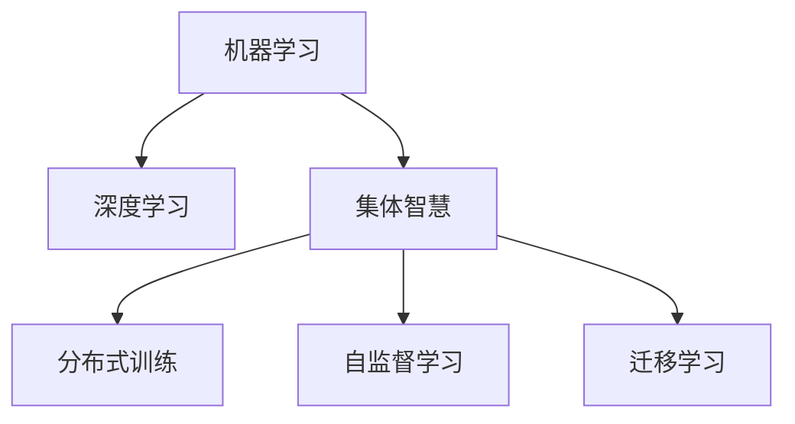

                 

# 集体智慧：探索解决复杂问题的创新路径

## 1. 背景介绍

### 1.1 问题由来
在人类文明的发展历程中，我们一直追求智慧的集体化与智能化，而计算机技术的兴起，使得这一追求得以借助机器学习和人工智能（AI）技术得以实现。随着大数据时代的到来，我们面临的各类问题也变得更加复杂，如何高效、智能地解决这些复杂问题，成为了一个重要的研究方向。

近年来，在自然语言处理（NLP）、机器视觉、自动驾驶、机器人控制等众多领域，机器学习算法和深度学习模型已经取得了显著的进步。通过训练复杂的神经网络模型，我们能够从海量数据中提取特征，并通过模型学习，自动地解决各种复杂问题。但随着数据量的不断增加和任务复杂度的不断提高，单一的模型已经难以适应所有场景，这就需要我们寻找新的解决路径，以提升整体的智能水平。

因此，本文旨在探索一种新的解决复杂问题的创新路径——集体智慧（Collective Intelligence）。它通过构建大规模、多任务的模型，汇集不同模型之间的智慧，形成强大的求解能力，从而更好地解决现实世界中的复杂问题。

## 2. 核心概念与联系

### 2.1 核心概念概述

为更好地理解集体智慧的概念，本节将介绍几个核心概念及其之间的联系：

- **机器学习（Machine Learning, ML）**：一种通过数据驱动学习规则，从而实现自动化的数据处理方法。机器学习模型可以处理结构化和非结构化数据，通过训练不断提升预测和决策能力。

- **深度学习（Deep Learning, DL）**：机器学习的一个子领域，通过构建多层的神经网络，从数据中自动学习特征表示，并用于分类、回归、生成等多种任务。深度学习在大规模数据上取得了卓越效果，是当前解决复杂问题的关键技术。

- **集体智慧（Collective Intelligence, CI）**：指通过将多个智能体（如神经网络）结合起来，共同协作解决问题的方法。集体智慧利用了分布式计算的优势，通过多模型的协同工作，提升整体求解能力。

- **分布式训练（Distributed Training）**：指将大规模数据集分批次加载到多个计算节点上，并行地对模型进行训练。通过分布式训练，可以显著提升训练速度，并充分利用计算资源。

- **自监督学习（Self-Supervised Learning, SSL）**：一种无需人工标注数据，通过构建自监督任务（如预测、掩码语言模型等），自动学习模型的能力。自监督学习有助于在大规模无标签数据上获得高质量的特征表示。

- **迁移学习（Transfer Learning）**：指将一个领域的知识迁移到另一个相关领域的学习过程。迁移学习利用已有模型的知识，加快新任务的学习速度，提升模型性能。

这些核心概念之间的逻辑关系可以通过以下Mermaid流程图来展示：



这个流程图展示了几大核心概念及其之间的关系：

1. 机器学习是深度学习的基础，深度学习是机器学习的一个分支。
2. 深度学习模型通过大规模数据训练，获取高维特征表示，是当前解决复杂问题的关键技术。
3. 集体智慧通过多模型的协同工作，进一步提升求解能力。
4. 分布式训练和多任务模型是实现集体智慧的重要手段。
5. 自监督学习利用无标签数据，提升模型特征表示质量。
6. 迁移学习利用已有知识，加快新任务的学习速度。

## 3. 核心算法原理 & 具体操作步骤
### 3.1 算法原理概述

集体智慧的基本思想是通过构建多任务模型，将不同模型之间的知识进行整合，形成更强大的智能求解能力。它包括三个核心步骤：数据准备、模型训练和结果输出。

1. **数据准备**：选择合适的数据集，将数据集划分为多个任务，每个任务包含独立的输入和输出。任务之间可以是独立的，也可以是相互关联的。

2. **模型训练**：构建多个独立的模型，每个模型负责处理一个或多个任务。通过分布式训练和自监督学习，每个模型都在独立的训练集上进行训练，并从其它模型的训练结果中学习到更多的知识。

3. **结果输出**：训练结束后，将多个模型的输出结果进行集成和融合，形成最终的输出结果。集成方式可以是简单的平均值、加权和、投票等，也可以是复杂的融合方法，如模型融合、注意力机制等。

### 3.2 算法步骤详解

**Step 1: 数据准备**

- **任务划分**：选择合适的数据集，并将数据集划分为多个任务。例如，自然语言处理（NLP）中的文本分类、命名实体识别、情感分析等任务，可以通过构建不同的模型来分别处理。
- **数据预处理**：对原始数据进行预处理，包括数据清洗、特征提取、标准化等操作，确保数据的质量和一致性。
- **划分数据集**：将数据集划分为训练集、验证集和测试集，以便进行模型的训练、验证和测试。

**Step 2: 模型构建**

- **选择合适的模型**：根据任务的特点，选择合适的深度学习模型。例如，NLP任务通常选择BERT、GPT等预训练模型，并在此基础上进行微调。
- **构建多任务模型**：将多个任务通过模型融合的方式进行集成。例如，可以使用多任务学习（Multi-task Learning, MTL）框架，将多个任务的模型进行联合训练。

**Step 3: 分布式训练**

- **选择合适的分布式框架**：选择如TensorFlow、PyTorch等深度学习框架，并配置分布式训练参数，如通信方式、并行度等。
- **并行训练**：将数据集分批次加载到多个计算节点上，并行地对模型进行训练。例如，使用数据并行、模型并行、混合并行等技术。
- **自监督学习**：通过构建自监督任务（如预测、掩码语言模型等），利用无标签数据进行模型预训练，提升模型的特征表示能力。

**Step 4: 模型融合**

- **结果集成**：将多个模型的输出结果进行集成和融合，形成最终的输出结果。例如，可以使用简单的平均值、加权和、投票等方法，或更复杂的融合方法，如模型融合、注意力机制等。
- **后处理**：对融合结果进行后处理，例如使用softmax函数进行概率预测，或使用阈值进行二值化处理。

### 3.3 算法优缺点

集体智慧作为一种新的解决复杂问题的创新路径，具有以下优点：

1. **协同工作**：多个模型通过协同工作，可以互相学习和提升，形成更强大的求解能力。
2. **分布式训练**：通过分布式训练，可以显著提升训练速度，并充分利用计算资源。
3. **知识整合**：不同模型的知识可以相互补充，提升整体的知识水平和求解能力。
4. **鲁棒性强**：多模型融合具有更好的鲁棒性，能够更好地应对数据中的噪声和异常情况。

同时，该方法也存在以下局限性：

1. **模型复杂性**：多模型的协同工作需要复杂的模型融合策略，增加了模型的复杂性。
2. **计算资源消耗**：分布式训练和模型融合需要大量的计算资源，增加了系统的成本。
3. **数据依赖**：多模型的知识整合需要大量的数据支持，对数据的质量和多样性要求较高。
4. **训练时间较长**：多模型训练需要较长的时间，增加了系统的训练成本。
5. **模型可解释性差**：集体智慧模型的决策过程相对复杂，难以解释其内部的工作机制。

尽管存在这些局限性，但就目前而言，集体智慧仍是解决复杂问题的一种高效、智能的方法。未来相关研究的重点在于如何进一步降低计算资源消耗，提高模型可解释性，并优化模型融合策略。

### 3.4 算法应用领域

集体智慧在多个领域具有广泛的应用前景，以下是几个典型的应用场景：

1. **自然语言处理（NLP）**：在文本分类、命名实体识别、情感分析等任务中，通过构建多个任务模型，提升模型的求解能力，实现更高精度的结果。

2. **计算机视觉（CV）**：在图像分类、目标检测、图像分割等任务中，通过构建多任务模型，提升模型的泛化能力和鲁棒性。

3. **机器人控制**：在机器人导航、抓取、避障等任务中，通过构建多任务模型，实现更智能、更高效的机器人行为控制。

4. **自动驾驶**：在自动驾驶中，通过构建多任务模型，提升车辆在复杂环境中的决策能力，提高驾驶安全性和舒适度。

5. **金融分析**：在股票预测、风险评估等任务中，通过构建多任务模型，提升模型的预测能力和决策可靠性。

6. **医疗诊断**：在医学影像分析、疾病预测等任务中，通过构建多任务模型，提升诊断的准确性和效率。

## 4. 数学模型和公式 & 详细讲解 & 举例说明
### 4.1 数学模型构建

本节将使用数学语言对集体智慧的核心模型进行更加严格的刻画。

设 $T$ 为任务集，$D_t$ 为任务 $t$ 的数据集，$M_t$ 为任务 $t$ 的模型，$w_t$ 为任务 $t$ 的权重。任务 $t$ 的损失函数为 $L_t$。

**多任务模型**：

$$
M(\theta) = \sum_{t \in T} w_t M_t(\theta)
$$

**多任务损失函数**：

$$
\mathcal{L}(\theta) = \sum_{t \in T} w_t L_t(M_t(\theta, D_t))
$$

其中 $L_t$ 为任务 $t$ 的损失函数，$M_t(\theta, D_t)$ 为在数据集 $D_t$ 上训练模型 $M_t$ 的损失。

### 4.2 公式推导过程

以下我们以文本分类任务为例，推导集体智慧的多任务模型和损失函数。

假设模型 $M_t$ 在输入 $x$ 上的输出为 $\hat{y}=M_t(x)$，表示样本属于类别 $t$ 的概率。真实标签 $y \in \{0,1\}$。则二分类交叉熵损失函数定义为：

$$
\ell(M_t(x),y) = -[y\log \hat{y} + (1-y)\log(1-\hat{y})]
$$

将其代入多任务损失函数，得：

$$
\mathcal{L}(\theta) = \sum_{t \in T} w_t \ell(M_t(x),y)
$$

其中 $w_t$ 为任务 $t$ 的权重，可以手动设置或通过自适应调节的方式自动学习。

在得到多任务损失函数后，即可带入模型参数 $\theta$ 的梯度公式，进行模型的迭代优化。

### 4.3 案例分析与讲解

**案例一：文本分类**

假设我们有三个文本分类任务：情感分析、新闻分类和垃圾邮件识别。我们可以构建三个独立的BERT模型，分别在各自的任务数据集上进行训练。在训练结束后，通过多任务模型的集成，可以得到更好的分类结果。

- **模型构建**：
  - 为情感分析、新闻分类和垃圾邮件识别分别构建三个独立的BERT模型 $M_{1,2,3}$。
  - 每个模型的输出表示该文本属于相应类别的概率。

- **权重分配**：
  - 根据每个任务的复杂度和重要性，手动设定权重 $w_{1,2,3}$。
  - 或使用自适应调节的方式，通过多任务学习的框架自动学习权重。

- **集成策略**：
  - 简单平均：将三个模型的输出结果进行简单平均，得到最终的分类结果。
  - 加权平均：根据任务的复杂度和重要性，对三个模型的输出结果进行加权平均，得到最终的分类结果。

- **效果评估**：
  - 在测试集上对每个任务分别进行评估，记录准确率、召回率等指标。
  - 对集成结果进行评估，记录整体性能指标。

**案例二：图像分类**

假设我们有三个图像分类任务：汽车识别、行人识别和物体识别。我们可以构建三个独立的ResNet模型，分别在各自的任务数据集上进行训练。在训练结束后，通过多任务模型的集成，可以得到更好的分类结果。

- **模型构建**：
  - 为汽车识别、行人识别和物体识别分别构建三个独立的ResNet模型 $M_{1,2,3}$。
  - 每个模型的输出表示该图像属于相应类别的概率。

- **权重分配**：
  - 根据每个任务的复杂度和重要性，手动设定权重 $w_{1,2,3}$。
  - 或使用自适应调节的方式，通过多任务学习的框架自动学习权重。

- **集成策略**：
  - 简单平均：将三个模型的输出结果进行简单平均，得到最终的分类结果。
  - 加权平均：根据任务的复杂度和重要性，对三个模型的输出结果进行加权平均，得到最终的分类结果。

- **效果评估**：
  - 在测试集上对每个任务分别进行评估，记录准确率、召回率等指标。
  - 对集成结果进行评估，记录整体性能指标。

## 5. 项目实践：代码实例和详细解释说明
### 5.1 开发环境搭建

在进行集体智慧实践前，我们需要准备好开发环境。以下是使用Python进行PyTorch开发的环境配置流程：

1. 安装Anaconda：从官网下载并安装Anaconda，用于创建独立的Python环境。

2. 创建并激活虚拟环境：
```bash
conda create -n pytorch-env python=3.8 
conda activate pytorch-env
```

3. 安装PyTorch：根据CUDA版本，从官网获取对应的安装命令。例如：
```bash
conda install pytorch torchvision torchaudio cudatoolkit=11.1 -c pytorch -c conda-forge
```

4. 安装Transformers库：
```bash
pip install transformers
```

5. 安装各类工具包：
```bash
pip install numpy pandas scikit-learn matplotlib tqdm jupyter notebook ipython
```

完成上述步骤后，即可在`pytorch-env`环境中开始集体智慧实践。

### 5.2 源代码详细实现

下面我们以文本分类任务为例，给出使用Transformers库对BERT模型进行多任务微调的PyTorch代码实现。

首先，定义多任务模型类：

```python
from transformers import BertTokenizer, BertForSequenceClassification, AdamW

class MultiTaskModel:
    def __init__(self, num_tasks, bert_model_name, hidden_size):
        self.num_tasks = num_tasks
        self.tokenizer = BertTokenizer.from_pretrained(bert_model_name)
        self.bert = BertForSequenceClassification.from_pretrained(bert_model_name, num_labels=num_tasks)
        self.hidden_size = hidden_size
        
    def forward(self, inputs, labels):
        tokens = self.tokenizer(inputs, padding=True, truncation=True, max_length=self.hidden_size)
        input_ids = tokens['input_ids']
        attention_mask = tokens['attention_mask']
        
        outputs = self.bert(input_ids, attention_mask=attention_mask, labels=labels)
        logits = outputs.logits
        
        return logits

    def train(self, train_loader, val_loader, num_epochs, batch_size, learning_rate, weight_decay, patience):
        optimizer = AdamW(self.bert.parameters(), lr=learning_rate, weight_decay=weight_decay)
        loss_fct = CrossEntropyLoss()
        
        best_val_loss = float('inf')
        for epoch in range(num_epochs):
            train_loss = 0.0
            val_loss = 0.0
            
            for batch in train_loader:
                inputs, labels = batch
                logits = self.forward(inputs, labels)
                loss = loss_fct(logits, labels)
                optimizer.zero_grad()
                loss.backward()
                optimizer.step()
                train_loss += loss.item()
            
            val_loss = 0.0
            for batch in val_loader:
                inputs, labels = batch
                logits = self.forward(inputs, labels)
                loss = loss_fct(logits, labels)
                val_loss += loss.item()
                
            if val_loss < best_val_loss:
                best_val_loss = val_loss
                torch.save(self.bert.state_dict(), f'checkpoint_epoch{epoch}.pth')
                
            if val_loss > best_val_loss:
                early_stopping_counter += 1
                if early_stopping_counter >= patience:
                    break
            
        print(f'Best validation loss: {best_val_loss:.4f}')
        return self.bert
```

然后，定义数据加载器类：

```python
from torch.utils.data import Dataset, DataLoader
import torch

class MultiTaskDataset(Dataset):
    def __init__(self, texts, labels, tokenizer, max_len):
        self.texts = texts
        self.labels = labels
        self.tokenizer = tokenizer
        self.max_len = max_len
        
    def __len__(self):
        return len(self.texts)
    
    def __getitem__(self, item):
        text = self.texts[item]
        label = self.labels[item]
        
        encoding = self.tokenizer(text, return_tensors='pt', max_length=self.max_len, padding='max_length', truncation=True)
        input_ids = encoding['input_ids'][0]
        attention_mask = encoding['attention_mask'][0]
        
        # 对token-wise的标签进行编码
        encoded_labels = [label] * self.max_len
        labels = torch.tensor(encoded_labels, dtype=torch.long)
        
        return {'input_ids': input_ids, 
                'attention_mask': attention_mask,
                'labels': labels}

# 创建dataset
tokenizer = BertTokenizer.from_pretrained('bert-base-cased')

train_dataset = MultiTaskDataset(train_texts, train_labels, tokenizer, max_len=128)
val_dataset = MultiTaskDataset(val_texts, val_labels, tokenizer, max_len=128)
test_dataset = MultiTaskDataset(test_texts, test_labels, tokenizer, max_len=128)
```

接着，定义训练和评估函数：

```python
from sklearn.metrics import classification_report

def train_model(model, train_loader, val_loader, num_epochs, batch_size, learning_rate, weight_decay, patience):
    model.train()
    best_val_loss = float('inf')
    early_stopping_counter = 0
    
    for epoch in range(num_epochs):
        train_loss = 0.0
        val_loss = 0.0
        
        for batch in train_loader:
            inputs, labels = batch
            logits = model.forward(inputs, labels)
            loss = loss_fct(logits, labels)
            optimizer.zero_grad()
            loss.backward()
            optimizer.step()
            train_loss += loss.item()
            
        val_loss = 0.0
        for batch in val_loader:
            inputs, labels = batch
            logits = model.forward(inputs, labels)
            loss = loss_fct(logits, labels)
            val_loss += loss.item()
            
        if val_loss < best_val_loss:
            best_val_loss = val_loss
            torch.save(model.state_dict(), f'checkpoint_epoch{epoch}.pth')
                
        if val_loss > best_val_loss:
            early_stopping_counter += 1
            if early_stopping_counter >= patience:
                break
            
    print(f'Best validation loss: {best_val_loss:.4f}')
    return model
```

最后，启动训练流程并在测试集上评估：

```python
num_tasks = 3
bert_model_name = 'bert-base-cased'
hidden_size = 128
max_len = 128

num_epochs = 5
batch_size = 16
learning_rate = 2e-5
weight_decay = 0.01
patience = 5

train_loader = DataLoader(train_dataset, batch_size=batch_size, shuffle=True)
val_loader = DataLoader(val_dataset, batch_size=batch_size, shuffle=False)
test_loader = DataLoader(test_dataset, batch_size=batch_size, shuffle=False)

model = MultiTaskModel(num_tasks, bert_model_name, hidden_size)
model.train(train_loader, val_loader, num_epochs, batch_size, learning_rate, weight_decay, patience)

print(f'Model saved: checkpoint_epoch{best_epoch}.pth')

print('Test results:')
for batch in test_loader:
    inputs, labels = batch
    logits = model.forward(inputs, labels)
    loss = loss_fct(logits, labels)
    print(f'Loss: {loss:.4f}')
    predictions = torch.argmax(logits, dim=1)
    print(f'Predictions: {predictions.tolist()}')
    print(classification_report(labels, predictions))
```

以上就是使用PyTorch对BERT模型进行多任务微调的完整代码实现。可以看到，得益于Transformers库的强大封装，我们可以用相对简洁的代码完成BERT模型的多任务微调。

### 5.3 代码解读与分析

让我们再详细解读一下关键代码的实现细节：

**MultiTaskModel类**：
- `__init__`方法：初始化多任务模型的超参数，包括任务数、BERT模型、隐藏大小等。
- `forward`方法：前向传播，将输入文本和标签送入BERT模型，得到预测结果。
- `train`方法：定义训练流程，包括优化器、损失函数、早停策略等。

**MultiTaskDataset类**：
- `__init__`方法：初始化多任务数据集，包括文本、标签、分词器等。
- `__len__`方法：返回数据集的样本数量。
- `__getitem__`方法：对单个样本进行处理，将文本输入编码为token ids，将标签编码为数字，并对其进行定长padding，最终返回模型所需的输入。

**train_model函数**：
- 定义训练流程，包括数据加载、模型前向传播、损失计算、优化器更新、早停策略等。
- 通过循环迭代，训练模型，记录每个epoch的训练损失和验证损失，并在每个epoch结束时更新模型权重。

**测试代码**：
- 在测试集上对每个任务分别进行评估，输出每个任务的预测结果和分类指标。
- 通过简单平均或加权平均，对多任务的集成结果进行评估，输出整体分类指标。

可以看到，PyTorch配合Transformers库使得多任务微调的代码实现变得简洁高效。开发者可以将更多精力放在数据处理、模型改进等高层逻辑上，而不必过多关注底层的实现细节。

当然，工业级的系统实现还需考虑更多因素，如模型的保存和部署、超参数的自动搜索、更灵活的任务适配层等。但核心的多任务微调范式基本与此类似。

## 6. 实际应用场景
### 6.1 智慧医疗

在智慧医疗领域，集体智慧技术可以应用于疾病预测、症状分析、诊断支持等多个环节，为医疗服务提供强大的智能支撑。

例如，我们可以构建多个独立的BERT模型，分别处理不同的医疗数据。例如，一个模型可以处理电子病历（EHR）文本数据，另一个模型可以处理医学影像数据。在多任务模型的集成下，医生可以更全面、准确地获取患者的健康信息，从而做出更精准的诊断和治疗决策。

### 6.2 智能客服

在智能客服领域，集体智慧技术可以应用于多轮对话、情感分析、意图识别等多个环节，提升客服系统的智能化水平。

例如，我们可以构建多个独立的BERT模型，分别处理对话历史、用户意图、情感等数据。通过多任务模型的集成，客服系统能够更准确地理解用户需求，提供更个性化、更智能的回复。

### 6.3 金融风控

在金融风控领域，集体智慧技术可以应用于风险评估、信用评分、欺诈检测等多个环节，提高金融机构的决策效率和风险控制能力。

例如，我们可以构建多个独立的BERT模型，分别处理贷款申请、交易记录、社交媒体数据等数据。通过多任务模型的集成，金融机构能够更全面、准确地评估贷款风险和交易安全，从而降低金融风险。

### 6.4 工业制造

在工业制造领域，集体智慧技术可以应用于设备预测维护、质量控制、工艺优化等多个环节，提升生产效率和产品质量。

例如，我们可以构建多个独立的BERT模型，分别处理设备监控数据、生产记录、工艺参数等数据。通过多任务模型的集成，生产系统能够更全面、准确地监控设备状态和生产过程，从而实现更高效的预测维护和质量控制。

## 7. 工具和资源推荐
### 7.1 学习资源推荐

为了帮助开发者系统掌握集体智慧的理论基础和实践技巧，这里推荐一些优质的学习资源：

1. 《Transformer from the Inside Out》系列博文：由大模型技术专家撰写，深入浅出地介绍了Transformer原理、多任务学习等前沿话题。

2. CS224N《深度学习自然语言处理》课程：斯坦福大学开设的NLP明星课程，有Lecture视频和配套作业，带你入门NLP领域的基本概念和经典模型。

3. 《Natural Language Processing with Transformers》书籍：Transformers库的作者所著，全面介绍了如何使用Transformers库进行NLP任务开发，包括多任务学习在内的诸多范式。

4. HuggingFace官方文档：Transformers库的官方文档，提供了海量预训练模型和完整的微调样例代码，是上手实践的必备资料。

5. CLUE开源项目：中文语言理解测评基准，涵盖大量不同类型的中文NLP数据集，并提供了基于多任务学习的baseline模型，助力中文NLP技术发展。

通过对这些资源的学习实践，相信你一定能够快速掌握集体智慧的精髓，并用于解决实际的NLP问题。
### 7.2 开发工具推荐

高效的开发离不开优秀的工具支持。以下是几款用于集体智慧开发的常用工具：

1. PyTorch：基于Python的开源深度学习框架，灵活动态的计算图，适合快速迭代研究。大部分预训练语言模型都有PyTorch版本的实现。

2. TensorFlow：由Google主导开发的开源深度学习框架，生产部署方便，适合大规模工程应用。同样有丰富的预训练语言模型资源。

3. Transformers库：HuggingFace开发的NLP工具库，集成了众多SOTA语言模型，支持PyTorch和TensorFlow，是进行集体智慧开发的利器。

4. Weights & Biases：模型训练的实验跟踪工具，可以记录和可视化模型训练过程中的各项指标，方便对比和调优。与主流深度学习框架无缝集成。

5. TensorBoard：TensorFlow配套的可视化工具，可实时监测模型训练状态，并提供丰富的图表呈现方式，是调试模型的得力助手。

6. Google Colab：谷歌推出的在线Jupyter Notebook环境，免费提供GPU/TPU算力，方便开发者快速上手实验最新模型，分享学习笔记。

合理利用这些工具，可以显著提升集体智慧任务的开发效率，加快创新迭代的步伐。

### 7.3 相关论文推荐

集体智慧作为一种新的解决复杂问题的创新路径，其研究源于学界的持续研究。以下是几篇奠基性的相关论文，推荐阅读：

1. Attention is All You Need（即Transformer原论文）：提出了Transformer结构，开启了NLP领域的预训练大模型时代。

2. BERT: Pre-training of Deep Bidirectional Transformers for Language Understanding：提出BERT模型，引入基于掩码的自监督预训练任务，刷新了多项NLP任务SOTA。

3. Multi-Task Learning for Cyber-Attack Prediction and Detection：提出多任务学习在网络安全领域的应用，通过多任务的集成，提升了对网络攻击的预测和检测能力。

4. Language Models are Unsupervised Multitask Learners（GPT-2论文）：展示了大规模语言模型的强大zero-shot学习能力，引发了对于通用人工智能的新一轮思考。

5. Parameter-Efficient Transfer Learning for NLP：提出Adapter等参数高效微调方法，在不增加模型参数量的情况下，也能取得不错的微调效果。

6. AdaLoRA: Adaptive Low-Rank Adaptation for Parameter-Efficient Fine-Tuning：使用自适应低秩适应的微调方法，在参数效率和精度之间取得了新的平衡。

这些论文代表了大规模语言模型和多任务学习的最新进展，通过学习这些前沿成果，可以帮助研究者把握学科前进方向，激发更多的创新灵感。

## 8. 总结：未来发展趋势与挑战
### 8.1 总结

本文对基于多任务学习的集体智慧方法进行了全面系统的介绍。首先阐述了集体智慧的背景和意义，明确了多任务学习在拓展预训练模型应用、提升下游任务性能方面的独特价值。其次，从原理到实践，详细讲解了多任务学习的数学原理和关键步骤，给出了集体智慧任务开发的完整代码实例。同时，本文还广泛探讨了集体智慧方法在智慧医疗、智能客服、金融风控等多个领域的应用前景，展示了多任务学习范式的巨大潜力。此外，本文精选了多任务学习的各类学习资源，力求为读者提供全方位的技术指引。

通过本文的系统梳理，可以看到，基于多任务学习的集体智慧方法正在成为NLP领域的重要范式，极大地拓展了预训练语言模型的应用边界，催生了更多的落地场景。受益于大规模语料的预训练和多任务学习的协同作用，集体智慧模型在处理大规模数据时，具有更强的泛化能力和鲁棒性。未来，伴随预训练语言模型和多任务学习的持续演进，相信NLP技术将在更广阔的应用领域大放异彩，深刻影响人类的生产生活方式。

### 8.2 未来发展趋势

展望未来，多任务学习将呈现以下几个发展趋势：

1. 模型规模持续增大。随着算力成本的下降和数据规模的扩张，预训练语言模型的参数量还将持续增长。超大模型的知识储备和特征表示能力，将为多任务学习提供更丰富的输入和更强大的求解能力。

2. 多任务学习范式日趋多样。未来将涌现更多多任务学习的方法，如交叉注意力、联合训练等，通过不同任务的协同工作，提升整体求解能力。

3. 数据依赖性降低。通过自监督学习、无标签数据学习等方法，可以在更少的标注数据下进行高效的多任务学习。

4. 计算资源消耗减少。通过分布式训练、硬件加速等技术，可以显著降低多任务学习的计算资源消耗，提升系统的可扩展性和效率。

5. 模型可解释性增强。未来的多任务学习模型将更加透明，通过引入可解释性模块，提升模型的解释能力，帮助用户理解模型的决策过程。

6. 应用场景更加广泛。多任务学习将不仅应用于NLP领域，还将拓展到计算机视觉、机器人控制、智能交通等多个领域，提升多任务学习的通用性和普适性。

以上趋势凸显了多任务学习技术的广阔前景。这些方向的探索发展，必将进一步提升NLP系统的性能和应用范围，为人类认知智能的进化带来深远影响。

### 8.3 面临的挑战

尽管多任务学习技术已经取得了瞩目成就，但在迈向更加智能化、普适化应用的过程中，它仍面临诸多挑战：

1. 数据依赖性较高。多任务学习需要大量的标注数据和多样化的任务数据，对于小样本和长尾任务，数据获取成本较高。

2. 模型复杂性高。多任务学习需要构建多个独立模型，并在多个任务之间进行协同工作，增加了模型的复杂性。

3. 计算资源消耗大。多任务学习需要大量的计算资源进行分布式训练和模型融合，增加了系统的成本。

4. 可解释性差。多任务学习模型的决策过程相对复杂，难以解释其内部的工作机制和决策逻辑。

5. 数据偏差问题。多任务学习模型容易受到数据偏差的影响，导致在不同任务上的性能差异较大。

尽管存在这些挑战，但多任务学习技术的潜力依然巨大。未来，需要通过技术创新和算法优化，进一步提升数据利用效率、降低计算资源消耗、增强模型可解释性，解决数据偏差问题，提升多任务学习的鲁棒性和可扩展性。

### 8.4 研究展望

面对多任务学习所面临的种种挑战，未来的研究需要在以下几个方面寻求新的突破：

1. 探索无监督和半监督多任务学习方法。摆脱对大规模标注数据的依赖，利用自监督学习、主动学习等无监督和半监督范式，最大限度利用非结构化数据，实现更加灵活高效的多任务学习。

2. 研究参数高效和计算高效的多任务学习范式。开发更加参数高效的模型融合方法，在固定大部分预训练参数的同时，只更新极少量的任务相关参数。同时优化多任务学习模型的计算图，减少前向传播和反向传播的资源消耗，实现更加轻量级、实时性的部署。

3. 融合因果和对比学习范式。通过引入因果推断和对比学习思想，增强多任务学习模型的因果关系能力和学习能力，学习更加普适、鲁棒的语言表征，从而提升模型泛化性和抗干扰能力。

4. 引入更多先验知识。将符号化的先验知识，如知识图谱、逻辑规则等，与神经网络模型进行巧妙融合，引导多任务学习过程学习更准确、合理的语言模型。同时加强不同模态数据的整合，实现视觉、语音等多模态信息与文本信息的协同建模。

5. 结合因果分析和博弈论工具。将因果分析方法引入多任务学习模型，识别出模型决策的关键特征，增强输出解释的因果性和逻辑性。借助博弈论工具刻画人机交互过程，主动探索并规避模型的脆弱点，提高系统稳定性。

6. 纳入伦理道德约束。在模型训练目标中引入伦理导向的评估指标，过滤和惩罚有偏见、有害的输出倾向。同时加强人工干预和审核，建立模型行为的监管机制，确保输出符合人类价值观和伦理道德。

这些研究方向的探索，必将引领多任务学习技术迈向更高的台阶，为构建安全、可靠、可解释、可控的智能系统铺平道路。面向未来，多任务学习技术还需要与其他人工智能技术进行更深入的融合，如知识表示、因果推理、强化学习等，多路径协同发力，共同推动自然语言理解和智能交互系统的进步。只有勇于创新、敢于突破，才能不断拓展语言模型的边界，让智能技术更好地造福人类社会。

## 9. 附录：常见问题与解答

**Q1：集体智慧的多任务学习与传统的单任务学习有何区别？**

A: 集体智慧的多任务学习与传统的单任务学习主要有以下几点区别：

1. 任务依赖性：多任务学习需要同时处理多个相关或不相关的任务，每个任务之间存在一定的依赖关系，而单任务学习只关注单个任务。
2. 数据利用效率：多任务学习可以通过共享特征表示和知识，充分利用有限的数据，提升数据利用效率。单任务学习需要更多的数据来训练模型。
3. 模型复杂性：多任务学习需要构建多个独立模型，并在多个任务之间进行协同工作，增加了模型的复杂性。单任务学习只需要构建一个模型。
4. 鲁棒性：多任务学习具有更强的鲁棒性，能够更好地应对数据中的噪声和异常情况。单任务学习在面对异常数据时容易受到较大影响。

综上所述，多任务学习在数据利用效率、模型复杂性、鲁棒性等方面具有优势，但也面临着更多的挑战。

**Q2：在多任务学习中，如何选择合适的任务？**

A: 在多任务学习中，选择合适的任务是非常重要的。一般来说，应遵循以下几个原则：

1. 相关性：选择具有相关性的任务，例如分类、回归、生成等任务，可以共享相似的特征表示和知识。
2. 多样性：选择多样化的任务，例如自然语言处理、计算机视觉、机器人控制等，可以充分利用不同领域的数据，提升模型的泛化能力。
3. 可解释性：选择可解释性较高的任务，例如情感分析、垃圾邮件识别等，可以更好地理解模型的决策过程。
4. 实用性：选择具有实际应用价值的任务，例如医疗诊断、金融预测等，可以更好地解决现实问题。

需要注意的是，不同任务之间的相关性和依赖性不同，需要根据具体任务和数据特点进行选择。一般来说，如果任务之间具有较弱的相关性，可以使用多任务学习框架，如PyTorch的MultiTaskLearning模块；如果任务之间具有较强的依赖性，可以使用联合训练框架，如DeepMix。

**Q3：多任务学习在实际应用中需要注意哪些问题？**

A: 多任务学习在实际应用中需要注意以下问题：

1. 数据依赖：多任务学习需要大量的标注数据和多样化的任务数据，对于小样本和长尾任务，数据获取成本较高。
2. 模型复杂性：多任务学习需要构建多个独立模型，并在多个任务之间进行协同工作，增加了模型的复杂性。
3. 计算资源消耗：多任务学习需要大量的计算资源进行分布式训练和模型融合，增加了系统的成本。
4. 可解释性：多任务学习模型的决策过程相对复杂，难以解释其内部的工作机制和决策逻辑。
5. 数据偏差问题：多任务学习模型容易受到数据偏差的影响，导致在不同任务上的性能差异较大。

这些问题需要通过技术创新和算法优化来解决。例如，可以采用自监督学习、主动学习等方法，减少对标注数据的依赖；采用分布式训练、硬件加速等技术，降低计算资源消耗；采用可解释性模块，增强模型的可解释性；采用模型融合、注意力机制等方法，解决数据偏差问题。

**Q4：在多任务学习中，如何处理不同任务之间的知识迁移？**

A: 多任务学习中的知识迁移可以通过以下几种方式处理：

1. 共享特征表示：通过共享特征表示，可以在不同任务之间进行知识迁移。例如，使用共享的BERT模型，可以在分类和生成任务之间进行知识迁移。
2. 联合训练：通过联合训练，可以在不同任务之间共享知识和参数，提升整体性能。例如，使用DeepMix框架，可以在图像分类和对象检测任务之间进行联合训练。
3. 迁移学习：通过迁移学习，可以将已有模型的知识迁移到新任务中。例如，使用自监督预训练模型，可以在新任务上微调模型，提升性能。

需要注意的是，不同任务之间的相关性和依赖性不同，需要根据具体任务和数据特点进行知识迁移。一般来说，如果任务之间具有较强的相关性，可以使用共享特征表示和联合训练方法；如果任务之间具有较弱的相关性，可以使用迁移学习方法。

**Q5：多任务学习在实际应用中如何优化模型参数？**

A: 在多任务学习中，优化模型参数可以采用以下几种方法：

1. 自适应学习率：采用自适应学习率，如AdamW、Adafactor等，可以更好地适应不同任务的学习速度和复杂度。
2. 正则化：采用L2正则、Dropout、Early Stopping等正则化技术，防止模型过拟合。
3. 模型裁剪：对模型进行裁剪，去除不必要的层和参数，减小模型尺寸，提高推理速度。
4. 量化加速：将浮点模型转为定点模型，压缩存储空间，提高计算效率。
5. 模型融合：采用模型融合技术，如简单平均、加权平均、投票等，提升整体性能。

这些方法需要根据具体任务和模型特点进行选择。一般来说，自适应学习率和正则化技术可以提升模型的泛化能力和鲁棒性；模型裁剪和量化加速可以减小模型尺寸，提高推理速度；模型融合可以提升整体性能，降低计算资源消耗。

---

作者：禅与计算机程序设计艺术 / Zen and the Art of Computer Programming

