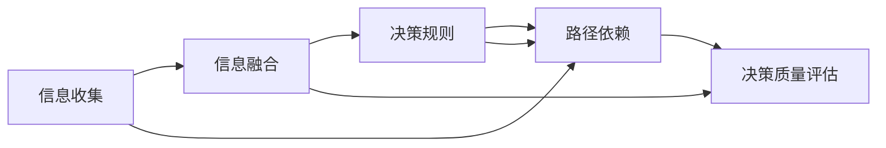

                 

# 集体智慧：群体决策的优势与陷阱

## 1. 背景介绍

### 1.1 问题由来
在信息化时代，大数据和互联网技术极大地提升了信息的收集和传播速度。决策者们有更多的机会从各种渠道获取相关信息，做出更为合理的决策。但是，与此同时，信息过载也使得决策过程变得复杂，决策者的认知负担加重，容易陷入“信息盲区”。

为了应对这一挑战，群体决策（Collective Decision Making）逐渐成为一种重要的决策方式。通过集合多方意见，利用集体智慧，可以更全面、更深刻地理解和解决问题。但同时，群体决策也面临着诸如信息冲突、决策路径依赖等问题。

### 1.2 问题核心关键点
群体决策的核心在于如何高效地收集和整合多方意见，通过科学的方法和工具，将不同的观点转化为统一的、可行的决策方案。主要包括以下几个方面：
1. 信息收集与整理：如何有效地从多方渠道获取高质量的信息。
2. 意见融合与统一：如何将多样化的观点整合为一致的决策。
3. 决策路径优化：如何设计合理的决策流程，防止路径依赖和信息误导。
4. 结果反馈与修正：如何对决策结果进行评估和修正，确保决策质量。

本文将围绕这些核心问题，详细探讨群体决策的优势与陷阱，并提供一些可行的解决方案。

## 2. 核心概念与联系

### 2.1 核心概念概述

群体决策是指多个决策者共同参与的决策过程。与个体决策不同，群体决策涉及多方的信息和观点，因此需要更复杂的流程和方法来确保决策的科学性和有效性。

**关键概念包括：**
- **信息收集**：获取来自不同渠道的高质量信息。
- **信息融合**：整合多方观点，形成统一的决策依据。
- **决策规则**：定义明确的决策流程和标准，确保决策的公正性和合理性。
- **路径依赖**：决策过程中存在的固定思维模式和行为模式，容易导致路径依赖和思维定势。
- **决策质量评估**：对决策结果进行评估和修正，确保决策的有效性和科学性。

**这些概念之间存在密切联系，并通过流程、规则和技术手段相互作用**。通过理解这些概念，可以更全面地认识群体决策的优势与陷阱，并采取相应措施加以优化。

### 2.2 核心概念原理和架构的 Mermaid 流程图



## 3. 核心算法原理 & 具体操作步骤

### 3.1 算法原理概述
群体决策的算法原理主要包括以下几个步骤：

1. **信息收集与整理**：利用数据收集技术，从不同渠道获取高质量的信息。
2. **信息融合与统一**：通过算法整合多样化的信息，形成统一的决策依据。
3. **决策规则定义**：根据决策问题，设计合理的决策流程和标准。
4. **路径依赖识别与规避**：识别决策过程中的固定思维模式，并采取措施进行规避。
5. **决策质量评估与修正**：对决策结果进行评估，并根据评估结果进行修正。

### 3.2 算法步骤详解

#### 3.2.1 信息收集与整理

信息收集与整理是群体决策的第一步，也是基础。信息收集的渠道包括互联网、文献资料、专家咨询等。

**具体步骤如下：**

1. **数据来源确定**：根据决策问题，确定信息来源，确保信息的准确性和可靠性。
2. **数据收集**：利用数据采集工具，从不同渠道获取信息。
3. **数据预处理**：对收集到的数据进行清洗和整理，去除噪声和冗余信息。

#### 3.2.2 信息融合与统一

信息融合的目的是将多样化的信息整合为一致的决策依据。常见的信息融合方法包括：

1. **统计分析**：利用统计方法，对信息进行归纳和总结，形成统一的结论。
2. **专家意见集成**：通过专家会议或问卷调查，收集不同专家的意见，并进行集成。
3. **权重分配**：对不同信息来源进行权重分配，确保信息的公平性和合理性。

#### 3.2.3 决策规则定义

决策规则是群体决策的重要组成部分，定义了决策流程和标准。常见的决策规则包括：

1. **多数投票**：根据多数人的意见进行决策。
2. **加权投票**：对不同意见进行加权，形成综合决策。
3. **层次分析法**：通过多层次分析和判断，形成决策方案。

#### 3.2.4 路径依赖识别与规避

路径依赖是指决策过程中存在的固定思维模式和行为模式，容易导致决策偏差。识别路径依赖的常用方法包括：

1. **反思性讨论**：通过讨论和反思，识别决策过程中的思维模式和行为模式。
2. **异质性引入**：引入不同背景和专业知识的决策者，打破固有思维模式。
3. **随机决策**：引入随机性，打破固定路径依赖。

#### 3.2.5 决策质量评估与修正

决策质量评估是对决策结果进行评估和修正，确保决策的有效性和科学性。常用的决策质量评估方法包括：

1. **后评估**：在决策结果实施后，进行效果评估和反馈。
2. **前评估**：在决策前进行预测和模拟，评估决策方案的可行性。
3. **多目标优化**：通过多目标优化方法，确保决策方案的全面性和合理性。

### 3.3 算法优缺点

**群体决策的优势：**

1. **信息全面性**：通过集合多方意见，可以获取更全面的信息，避免个体决策的信息盲区。
2. **决策科学性**：通过科学方法和工具，提高决策的合理性和科学性。
3. **决策多样性**：通过引入不同背景和专业知识的决策者，提高决策的全面性和多样性。

**群体决策的缺点：**

1. **信息冲突**：不同决策者可能存在信息冲突，影响决策质量。
2. **决策路径依赖**：决策过程中可能存在路径依赖，影响决策灵活性。
3. **决策效率低**：决策过程涉及多方意见，可能耗费大量时间和资源。
4. **责任不明确**：群体决策责任不明确，可能导致决策执行困难。

### 3.4 算法应用领域

群体决策在多个领域都有广泛的应用，如：

- **企业决策**：企业重大决策如投资、研发、市场拓展等，通过群体决策可以综合多方意见，提高决策的科学性和合理性。
- **政府决策**：政府重大决策如政策制定、法规修订等，通过群体决策可以综合多方利益，确保决策的公平性和公正性。
- **社会治理**：社会治理中的公共安全、环境保护等，通过群体决策可以集思广益，制定更有效的治理方案。

## 4. 数学模型和公式 & 详细讲解 & 举例说明

### 4.1 数学模型构建

群体决策的数学模型可以描述为：

$$
\begin{aligned}
    \text{决策结果} &= \text{决策规则} \cdot \text{信息融合结果} \\
    \text{信息融合结果} &= \text{信息收集结果} \cdot \text{信息融合算法} \\
    \text{信息收集结果} &= \text{信息源数据} \cdot \text{数据收集算法}
\end{aligned}
$$

### 4.2 公式推导过程

以多数投票为例，信息融合过程可以表示为：

$$
\text{多数投票结果} = \begin{cases}
    A & \text{if } \sum_{i=1}^{n} w_i \cdot v_i(A) > \sum_{i=1}^{n} w_i \cdot v_i(B) \\
    B & \text{otherwise}
\end{cases}
$$

其中，$v_i$ 表示决策者 $i$ 对选项 $A$ 和 $B$ 的投票结果，$w_i$ 表示决策者 $i$ 的权重。

### 4.3 案例分析与讲解

假设有一家企业在决定是否投资新的研发项目时，需要集合五名专家（决策者）的意见。每位专家提供以下信息：

| 专家 | 投票 | 权重 |
| --- | --- | --- |
| 专家1 | A | 0.3 |
| 专家2 | B | 0.2 |
| 专家3 | A | 0.2 |
| 专家4 | A | 0.1 |
| 专家5 | B | 0.2 |

使用多数投票规则，可以计算出最终的决策结果。具体过程如下：

1. **信息收集与整理**：
   - 信息源数据：$A: 1, 2, 3, 4$；$B: 2, 5$。
   - 数据收集算法：直接收集专家投票结果。
2. **信息融合与统一**：
   - 信息融合算法：多数投票。
   - 信息融合结果：$A: 1, 2, 3, 4$；$B: 2, 5$。
3. **决策规则定义**：
   - 多数投票。
4. **路径依赖识别与规避**：
   - 反思性讨论：发现专家1、2、3倾向于选择A，专家4、5倾向于选择B。
   - 异质性引入：引入不同背景和专业知识的决策者，打破固有思维模式。
   - 随机决策：引入随机性，打破固定路径依赖。
5. **决策质量评估与修正**：
   - 后评估：在决策结果实施后，进行效果评估和反馈。
   - 前评估：在决策前进行预测和模拟，评估决策方案的可行性。
   - 多目标优化：通过多目标优化方法，确保决策方案的全面性和合理性。

## 5. 项目实践：代码实例和详细解释说明

### 5.1 开发环境搭建

为了进行群体决策的实践，首先需要搭建好开发环境。以下是一个基本的项目环境搭建流程：

1. **选择编程语言**：Python是群体决策开发常用的语言，具有丰富的库和工具支持。
2. **安装必要的库**：安装 pandas、numpy、scikit-learn 等常用库，以及一些群体决策相关的库，如 Gurobi、CVXPY 等。
3. **搭建数据处理平台**：利用 Apache Spark、Hadoop 等大数据平台，搭建数据处理和存储环境。
4. **搭建决策分析平台**：利用 TensorFlow、PyTorch 等深度学习框架，搭建决策分析平台。
5. **搭建协同平台**：利用 Elasticsearch、Kibana 等协同平台，实现多方的意见协同和集成。

### 5.2 源代码详细实现

以下是一个简单的群体决策示例，使用 Python 和 pandas 库实现：

```python
import pandas as pd

# 创建数据表
data = pd.DataFrame({
    '专家': ['专家1', '专家2', '专家3', '专家4', '专家5'],
    '投票': ['A', 'B', 'A', 'A', 'B'],
    '权重': [0.3, 0.2, 0.2, 0.1, 0.2]
})

# 计算多数投票结果
majority_votes = data.groupby('专家')['投票'].value_counts()
majority_votes = majority_votes[majority_votes > 1]
result = majority_votes.index[0]

# 输出结果
print('多数投票结果为：', result)
```

### 5.3 代码解读与分析

**代码解读：**

1. **数据准备**：使用 pandas 库创建数据表，包含专家、投票和权重等字段。
2. **信息收集与整理**：通过 groupby 方法计算每位专家的投票结果，并筛选出多数投票。
3. **信息融合与统一**：使用多数投票方法，计算最终的决策结果。

**代码分析：**

- **数据表创建**：数据表的创建是群体决策的基础，使用 pandas 库可以方便地进行数据处理和分析。
- **多数投票计算**：通过 groupby 方法和 value_counts 方法，可以统计每位专家的投票结果，并筛选出多数投票。
- **决策结果输出**：多数投票结果直接输出，作为最终的决策结果。

## 6. 实际应用场景

### 6.1 企业决策

企业在进行重大决策时，需要集合多方意见，综合考虑各方面因素，以确保决策的科学性和合理性。例如：

- **投资决策**：企业决定是否投资新的研发项目，需要评估技术可行性、市场前景和投资回报率等。通过群体决策，可以综合技术专家、市场专家和财务专家的意见，形成更全面的决策依据。
- **战略规划**：企业制定中长期战略规划时，需要考虑市场环境、行业趋势和资源配置等因素。通过群体决策，可以集思广益，制定更科学、合理的战略规划。

### 6.2 政府决策

政府在进行重大决策时，需要综合考虑多方利益，确保决策的公平性和公正性。例如：

- **政策制定**：政府制定新的政策时，需要综合专家、公众和利益相关者的意见，确保政策的有效性和公平性。
- **法规修订**：政府修订现有法规时，需要综合法律专家、行业专家和公众意见，确保法规的合理性和可操作性。

### 6.3 社会治理

社会治理中的公共安全、环境保护等，需要集思广益，制定更有效的治理方案。例如：

- **公共安全**：在应对突发公共事件时，需要集合各方意见，制定最优应对策略。
- **环境保护**：在制定环保政策时，需要综合各方意见，确保政策的全面性和合理性。

## 7. 工具和资源推荐

### 7.1 学习资源推荐

为了深入理解群体决策，以下是一些优质的学习资源：

1. **《集体智慧：群体决策与科学管理》**：介绍群体决策的基本原理、方法和应用。
2. **《群体决策：理论与实践》**：系统讲解群体决策的理论基础和应用案例。
3. **《数据科学导论》**：介绍数据收集、处理和分析的基本方法，为群体决策提供数据支持。
4. **《机器学习》**：介绍机器学习的基本原理和应用，为群体决策提供算法支持。

### 7.2 开发工具推荐

为了提高群体决策的效率和精度，以下是一些常用的开发工具：

1. **Python**：Python 是群体决策开发常用的语言，具有丰富的库和工具支持。
2. **R语言**：R语言是数据科学常用的语言，具有强大的数据分析和统计功能。
3. **Jupyter Notebook**：Jupyter Notebook 是交互式编程环境，适合群体决策过程中的数据处理和分析。
4. **Elasticsearch**：Elasticsearch 是搜索引擎，适合群体决策中的协同和集成。

### 7.3 相关论文推荐

群体决策的研究涉及多个学科，以下是一些重要的相关论文：

1. **《群体决策理论与方法》**：介绍群体决策的基本理论和应用方法。
2. **《群体决策与智能技术》**：介绍群体决策与智能技术的应用案例。
3. **《群体决策与数据科学》**：介绍群体决策与数据科学的方法和技术。
4. **《群体决策与机器学习》**：介绍群体决策与机器学习的方法和技术。

## 8. 总结：未来发展趋势与挑战

### 8.1 研究成果总结

群体决策作为一种重要的决策方式，在多个领域都有广泛的应用。其主要优势在于信息全面性和决策科学性，但同时也面临信息冲突、决策路径依赖等挑战。

### 8.2 未来发展趋势

未来群体决策的发展趋势包括：

1. **技术融合**：群体决策与人工智能、大数据、区块链等技术进行深度融合，提高决策的效率和精度。
2. **多模态融合**：群体决策与多模态信息进行融合，提高决策的全面性和多样性。
3. **智能决策**：利用智能算法和模型，提高群体决策的科学性和合理性。

### 8.3 面临的挑战

群体决策面临的挑战包括：

1. **信息冲突**：不同决策者可能存在信息冲突，影响决策质量。
2. **决策路径依赖**：决策过程中可能存在路径依赖，影响决策灵活性。
3. **决策效率低**：决策过程涉及多方意见，可能耗费大量时间和资源。
4. **责任不明确**：群体决策责任不明确，可能导致决策执行困难。

### 8.4 研究展望

未来群体决策的研究方向包括：

1. **信息融合算法**：研究更高效的信息融合算法，提高群体决策的全面性和准确性。
2. **智能决策规则**：研究智能决策规则，提高群体决策的科学性和合理性。
3. **路径依赖规避**：研究路径依赖规避方法，提高群体决策的灵活性和适应性。
4. **决策质量评估**：研究决策质量评估方法，提高群体决策的有效性和科学性。

## 9. 附录：常见问题与解答

**Q1：群体决策中的信息冲突如何解决？**

A: 信息冲突可以通过以下方法解决：

1. **信息整合**：对不同信息进行整合，形成一致的决策依据。
2. **专家咨询**：通过专家咨询，解决信息冲突。
3. **权重分配**：对不同信息进行权重分配，确保信息的公平性和合理性。

**Q2：群体决策中的路径依赖如何规避？**

A: 路径依赖可以通过以下方法规避：

1. **反思性讨论**：通过讨论和反思，识别决策过程中的思维模式和行为模式。
2. **异质性引入**：引入不同背景和专业知识的决策者，打破固有思维模式。
3. **随机决策**：引入随机性，打破固定路径依赖。

**Q3：群体决策中的决策效率如何提高？**

A: 决策效率可以通过以下方法提高：

1. **数据预处理**：对数据进行预处理，去除噪声和冗余信息。
2. **并行计算**：利用并行计算技术，提高计算效率。
3. **决策工具**：利用决策工具，提高决策效率和精度。

**Q4：群体决策中的决策质量如何评估？**

A: 决策质量可以通过以下方法评估：

1. **后评估**：在决策结果实施后，进行效果评估和反馈。
2. **前评估**：在决策前进行预测和模拟，评估决策方案的可行性。
3. **多目标优化**：通过多目标优化方法，确保决策方案的全面性和合理性。

**Q5：群体决策中的责任如何明确？**

A: 责任明确可以通过以下方法实现：

1. **责任分配**：根据决策者的作用和贡献，明确责任分配。
2. **责任监督**：建立责任监督机制，确保决策执行的透明度和公正性。
3. **责任追究**：对决策过程中的错误和失误，进行责任追究和改进。

---

作者：禅与计算机程序设计艺术 / Zen and the Art of Computer Programming

