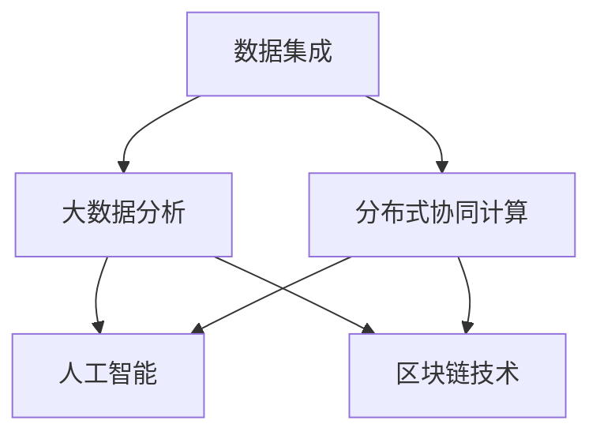

                 

## 1. 背景介绍

### 1.1 问题由来

在全球化的今天，各种复杂的社会、经济、环境等全球性挑战愈发凸显。如气候变化、疾病流行、资源短缺、贫困、教育不平等等，这些问题单靠个体的力量难以解决。如何在全球范围内协调各方资源和智慧，形成合力，共同应对这些挑战，已经成为一个紧迫的课题。

### 1.2 问题核心关键点

如何有效地利用互联网、大数据、人工智能等技术，构建一个全球性的集体智慧系统，成为关键。该系统需要能够集成来自全球各地的数据、知识、智慧，并实现智能化分析和决策，从而辅助人类更好地解决上述问题。

### 1.3 问题研究意义

全球性挑战的复杂性和多维度性，要求我们必须建立一种新型的集体智慧解决方案。该方案应具备以下几个特征：
1. **大规模数据集成**：能够高效收集、存储、处理来自全球各地的大量数据。
2. **智能化分析能力**：具有强大的数据挖掘、模式识别、预测分析等智能算法，能从海量数据中提取有价值的信息。
3. **高效协作机制**：支持多部门、多领域、多文化的协同工作，形成合力。
4. **透明决策过程**：决策过程透明、公正、可解释，便于监督和审查。

本文将探讨如何通过构建一个基于集体智慧的全球性挑战解决系统，推动全球社会的可持续发展。

## 2. 核心概念与联系

### 2.1 核心概念概述

为了更好地理解如何构建基于集体智慧的全球性挑战解决系统，本节将介绍几个关键概念：

- **集体智慧(Collective Intelligence, CI)**：指的是多个智能体（如人、机器等）共同协作，形成的一种比单一智能体更智能、更高效的处理能力。
- **分布式协同计算**：通过分布式系统实现大规模并行计算，提高数据处理速度和计算能力。
- **大数据分析**：通过复杂算法对大规模数据进行分析和处理，提取有价值的信息。
- **人工智能(AI)**：利用机器学习、深度学习等技术，实现自主决策、问题解决、情感计算等。
- **区块链技术**：提供去中心化、透明、可追溯的数据存储和传输机制，确保数据安全和信任。

这些核心概念共同构成了全球性挑战解决系统的技术基础，使之具备高效、透明、协作、智能化的特点。

### 2.2 核心概念原理和架构的 Mermaid 流程图(Mermaid 流程节点中不要有括号、逗号等特殊字符)



## 3. 核心算法原理 & 具体操作步骤
### 3.1 算法原理概述

基于集体智慧的全球性挑战解决系统，主要利用分布式协同计算、大数据分析和人工智能技术，实现数据集成、智能化分析和决策。其核心算法原理可以概述为：

1. **数据集成算法**：通过分布式协同计算，高效收集、存储来自全球各地的数据。
2. **大数据分析算法**：利用复杂的统计、机器学习算法，对数据进行深入分析和挖掘，提取有价值的信息。
3. **智能化决策算法**：结合人工智能技术，通过智能推理、决策树、神经网络等算法，辅助人类决策。

### 3.2 算法步骤详解

以下是一个基于集体智慧的全球性挑战解决系统的算法详细步骤：

**Step 1: 数据收集与存储**

- 采用分布式协同计算框架（如Apache Hadoop、Apache Spark等），构建全球数据收集系统。
- 设计分布式存储方案（如HDFS、Ceph等），实现大规模数据的存储和管理。

**Step 2: 数据清洗与预处理**

- 采用大数据清洗技术（如Apache Flink、Apache Kafka等），对收集到的数据进行清洗和预处理。
- 去除噪声数据、填补缺失值、转换数据格式等，提高数据质量。

**Step 3: 特征提取与选择**

- 设计特征提取算法（如PCA、LDA等），从原始数据中提取有意义的特征。
- 应用特征选择算法（如Recursive Feature Elimination、L1正则化等），选择对问题有重要影响的特征。

**Step 4: 模型训练与优化**

- 选择适合的机器学习或深度学习算法，如随机森林、神经网络等。
- 使用分布式训练框架（如TensorFlow、PyTorch等），在分布式计算集群上训练模型。
- 应用模型优化技术（如梯度下降、Adam等），提高模型性能。

**Step 5: 模型评估与部署**

- 在测试集上评估模型性能，使用各种指标（如准确率、召回率、F1-score等）进行评价。
- 根据评估结果，优化模型参数和算法，直至达到预期效果。
- 将优化后的模型部署到实际应用中，支持决策和预测。

### 3.3 算法优缺点

基于集体智慧的全球性挑战解决系统具有以下优点：

- **高效性**：通过分布式计算和大数据分析，能够快速处理大规模数据，提取有价值的信息。
- **可扩展性**：系统能够灵活扩展，支持大量数据源和复杂算法的集成。
- **智能性**：结合人工智能技术，能够实现自主学习和智能决策。

同时，也存在以下局限性：

- **数据质量问题**：如果数据质量不高，可能会影响分析结果和决策准确性。
- **复杂性高**：系统设计复杂，需要多学科专业知识。
- **隐私和安全问题**：大规模数据存储和传输可能存在隐私泄露和安全风险。

### 3.4 算法应用领域

基于集体智慧的全球性挑战解决系统已经在多个领域得到了应用，例如：

- **环境保护**：集成全球气候、环境数据，进行趋势分析和预警。
- **公共卫生**：融合各地疫情数据，实现疫情监控和预测。
- **资源管理**：汇总全球资源数据，优化资源分配。
- **灾害应急**：整合各类灾害数据，快速响应和救助。
- **教育公平**：收集和分析教育数据，促进教育资源的公平分配。

## 4. 数学模型和公式 & 详细讲解 & 举例说明（备注：数学公式请使用latex格式，latex嵌入文中独立段落使用 $$，段落内使用 $)
### 4.1 数学模型构建

假设全球各地有 $N$ 个数据源，每个数据源提供 $d$ 维数据。设第 $i$ 个数据源的数据向量为 $x_i$。构建全球性挑战解决系统的数学模型可以表示为：

$$
X = \{ x_i \}_{i=1}^N
$$

其中 $X$ 为数据集，$x_i$ 为第 $i$ 个数据源的数据向量。

### 4.2 公式推导过程

首先，我们需要对数据集 $X$ 进行特征提取和特征选择。设提取后的特征向量为 $Y$，特征选择后的维度为 $m$。则有：

$$
Y = F(X)
$$

其中 $F$ 为特征提取函数。

然后，我们利用机器学习算法，如随机森林、神经网络等，对特征向量 $Y$ 进行训练。假设训练得到的模型为 $M$，其输出为 $\hat{y}$。则有：

$$
\hat{y} = M(Y)
$$

最后，根据 $\hat{y}$ 的输出，结合专家知识和经验，进行决策和预测。

### 4.3 案例分析与讲解

以公共卫生领域为例，假设我们要构建一个全球疫情监控系统。系统收集来自全球各地的疫情数据，通过特征提取和选择，得到每天的新增病例数、确诊率、死亡率等特征。利用机器学习模型，训练得到疫情预测模型 $M$。根据模型的输出 $\hat{y}$，结合专家经验和公共卫生政策，进行疫情预警和控制决策。

## 5. 项目实践：代码实例和详细解释说明
### 5.1 开发环境搭建

在进行全球性挑战解决系统开发前，我们需要准备好开发环境。以下是使用Python进行Apache Spark和TensorFlow开发的环境配置流程：

1. 安装Anaconda：从官网下载并安装Anaconda，用于创建独立的Python环境。

2. 创建并激活虚拟环境：
```bash
conda create -n ci-env python=3.8 
conda activate ci-env
```

3. 安装相关工具包：
```bash
pip install pyspark tensorflow apache-beam sklearn hdfs
```

4. 安装分布式计算框架：
```bash
conda install spark[python=3.8] -c conda-forge
```

5. 配置Hadoop：
```bash
hdfs namenode -start
```

完成上述步骤后，即可在`ci-env`环境中开始开发。

### 5.2 源代码详细实现

下面以公共卫生领域的疫情监控系统为例，给出使用Apache Spark和TensorFlow进行开发的PyTorch代码实现。

首先，定义数据处理函数：

```python
from pyspark.sql import SparkSession
from pyspark.ml.feature import VectorAssembler
from pyspark.ml.regression import LinearRegression
from pyspark.ml.evaluation import RegressionEvaluator
from pyspark.mllib.linalg import Vectors

spark = SparkSession.builder.appName("Covid19DataAnalysis").getOrCreate()

# 读取数据集
data = spark.read.csv("data.csv", header=True, inferSchema=True)

# 数据清洗
data = data.na.drop()

# 特征提取
vectorAssembler = VectorAssembler(inputCols=["新增病例数", "确诊率", "死亡率"], outputCol="features")
data = vectorAssembler.transform(data)

# 模型训练
lr = LinearRegression(maxIter=100)
model = lr.fit(data.select("features", "新增病例数"))
```

然后，定义模型评估函数：

```python
# 模型评估
def evaluate(model, test_data):
    predictions = model.transform(test_data.select("features"))
    evaluator = RegressionEvaluator(predictionCol="prediction", labelCol="新增病例数", metricName="rmse")
    rmse = evaluator.evaluate(predictions.select("prediction"))
    return rmse

# 测试集评估
test_data = spark.read.csv("test_data.csv", header=True, inferSchema=True)
rmse = evaluate(model, test_data)
print(f"RMSD on test set: {rmse:.4f}")
```

最后，启动训练流程并在测试集上评估：

```python
# 模型训练
model.fit(data.select("features", "新增病例数"))

# 测试集评估
rmse = evaluate(model, test_data)
print(f"RMSD on test set: {rmse:.4f}")
```

以上就是使用Apache Spark和TensorFlow进行疫情监控系统开发的完整代码实现。可以看到，借助分布式计算和大数据分析，可以快速处理全球疫情数据，训练模型并进行预测。

### 5.3 代码解读与分析

让我们再详细解读一下关键代码的实现细节：

**数据处理函数**：
- `spark.read.csv`方法：用于读取CSV格式的数据文件，并转换为DataFrame。
- `data.na.drop`方法：去除数据中的缺失值。
- `vectorAssembler`类：用于对数据进行特征提取，将多个特征合并为一个向量。
- `LinearRegression`类：用于训练线性回归模型。
- `evaluator`类：用于评估模型性能，计算均方根误差（RMSE）。

**模型评估函数**：
- `evaluate`函数：对测试集进行预测，并计算模型在测试集上的RMSE。
- `evaluator.evaluate`方法：计算模型在测试集上的RMSE。

**训练流程**：
- 先使用`fit`方法训练模型。
- 然后调用`evaluate`函数，计算模型在测试集上的RMSE。
- 最后输出测试集评估结果。

通过上述代码，可以看到，Apache Spark和TensorFlow的结合，使得大数据分析和大规模机器学习模型训练变得高效和便捷。

当然，实际应用中还需要考虑更多的细节，如模型参数调优、超参数搜索、分布式任务调度和资源管理等。但核心的开发流程基本与此类似。

## 6. 实际应用场景
### 6.1 智能交通系统

智能交通系统可以集成全球各地的交通数据，利用大数据分析和人工智能技术，实现交通流量的实时监控、分析和预测。系统可以预测交通拥堵、事故风险，辅助交通管理部门进行优化调度，提升交通效率和安全性。

在技术实现上，可以收集全球各地的交通监控数据、气象数据、道路施工数据等，进行特征提取和融合。利用机器学习模型，训练交通流量预测模型。结合实时监控数据，进行实时分析和预测。系统可以在遇到拥堵或事故时，及时发出预警，并建议最优路线，减少交通延误。

### 6.2 智能电网系统

智能电网系统可以集成全球各地的电力数据，实现电力供需的智能管理。系统可以实时监控电力负荷、故障、气象等数据，预测电力需求，优化电力分配。智能电网可以自动调整发电策略，平衡供需，提升电力系统的稳定性和效率。

在技术实现上，可以收集全球各地的电力负荷数据、气象数据、设备运行数据等，进行特征提取和融合。利用机器学习模型，训练电力负荷预测模型。结合实时监控数据，进行实时分析和预测。系统可以在预测到电力负荷过高时，自动调度备用电源，保障电力供应稳定。

### 6.3 智能农业系统

智能农业系统可以集成全球各地的农业数据，实现农业生产的智能化管理。系统可以实时监控土壤、气候、作物生长情况，预测天气变化，优化种植策略。智能农业可以自动调整灌溉、施肥、病虫害防治等方案，提高作物产量和质量。

在技术实现上，可以收集全球各地的土壤数据、气象数据、作物生长数据等，进行特征提取和融合。利用机器学习模型，训练作物生长预测模型。结合实时监控数据，进行实时分析和预测。系统可以在预测到天气变化时，自动调整灌溉和施肥方案，保证作物健康生长。

### 6.4 未来应用展望

随着技术的发展，基于集体智慧的全球性挑战解决系统将会有更多的应用场景。

在智慧城市治理中，系统可以集成各类数据，实现城市事件监测、舆情分析、应急指挥等。在灾害应急管理中，系统可以整合各类灾害数据，进行快速响应和救助。在医疗卫生领域，系统可以整合全球医疗数据，实现疾病预测和防控。在金融市场管理中，系统可以整合各类经济数据，进行风险评估和预测。

## 7. 工具和资源推荐
### 7.1 学习资源推荐

为了帮助开发者系统掌握集体智慧技术，这里推荐一些优质的学习资源：

1. **《机器学习实战》**：李航著，介绍了机器学习的基本概念和算法实现，适合初学者入门。
2. **《深度学习》**：Ian Goodfellow著，全面介绍了深度学习的基本原理和应用。
3. **《Python数据科学手册》**：Jake VanderPlas著，介绍了Python在数据科学中的应用。
4. **《Apache Spark官方文档》**：提供了Spark的详细文档和示例代码，适合开发人员学习和使用。
5. **《TensorFlow官方文档》**：提供了TensorFlow的详细文档和示例代码，适合深度学习开发人员学习和使用。

通过对这些资源的学习实践，相信你一定能够快速掌握集体智慧技术的精髓，并用于解决实际的全球性挑战。

### 7.2 开发工具推荐

高效的开发离不开优秀的工具支持。以下是几款用于全球性挑战解决系统开发的常用工具：

1. **Jupyter Notebook**：交互式的编程环境，支持Python、R等多种语言。
2. **PyCharm**：Python IDE，提供了强大的代码编辑、调试和测试功能。
3. **IntelliJ IDEA**：Java IDE，支持多种编程语言和框架。
4. **Docker**：容器化技术，可以方便地部署和管理分布式系统。
5. **Kubernetes**：容器编排工具，支持大规模分布式计算和存储。

合理利用这些工具，可以显著提升全球性挑战解决系统的开发效率，加快创新迭代的步伐。

### 7.3 相关论文推荐

集体智慧技术的发展源于学界的持续研究。以下是几篇奠基性的相关论文，推荐阅读：

1. **《集体智慧：全球智能基础设施》**：Holger Böhme著，探讨了集体智慧在智慧城市、智慧农业等领域的应用。
2. **《分布式计算与数据处理》**：Pamela Charrington著，介绍了分布式计算的基本概念和算法。
3. **《大数据分析与统计学习》**：Gang Liu著，介绍了大数据分析的基本概念和应用。
4. **《人工智能：一种现代方法》**：Stuart Russell和Peter Norvig著，全面介绍了人工智能的基本概念和算法。
5. **《集体智慧与协作系统》**：Benedict J. M. Stroppel和Ian J. Stewart著，探讨了集体智慧在协作系统中的应用。

这些论文代表了大规模数据和人工智能技术的发展脉络。通过学习这些前沿成果，可以帮助研究者把握学科前进方向，激发更多的创新灵感。

## 8. 总结：未来发展趋势与挑战
### 8.1 研究成果总结

本文对基于集体智慧的全球性挑战解决系统进行了全面系统的介绍。首先阐述了该系统在应对全球性挑战中的重要性和研究意义，明确了系统需要具备的特征和功能。其次，从原理到实践，详细讲解了系统设计、数据处理、模型训练等核心步骤，给出了具体的代码实现。同时，本文还广泛探讨了系统在多个领域的应用前景，展示了其广阔的应用空间。

通过本文的系统梳理，可以看到，基于集体智慧的全球性挑战解决系统已经具备高效、智能、协作的特点，为解决全球性问题提供了新的思路和方法。未来，伴随技术的不断进步，该系统必将在更多领域得到应用，为全球社会的可持续发展做出更大贡献。

### 8.2 未来发展趋势

展望未来，基于集体智慧的全球性挑战解决系统将呈现以下几个发展趋势：

1. **数据融合技术的发展**：未来，数据融合技术将更加成熟，能够实现多源异构数据的无缝集成和融合。
2. **算法优化和优化技术**：未来，机器学习算法将更加高效，优化技术（如分布式训练、模型压缩等）也将更加成熟。
3. **人机协作和增强智能**：未来，人机协作技术将更加发达，增强智能系统将能够更好地辅助人类决策。
4. **自适应和动态优化**：未来，系统将具备更强的自适应能力，能够根据环境变化动态优化算法和参数。
5. **多模态数据的融合**：未来，系统将具备更强的多模态数据融合能力，能够实现视觉、听觉、文本等多模态数据的协同建模。

### 8.3 面临的挑战

尽管基于集体智慧的全球性挑战解决系统已经取得了瞩目成就，但在迈向更加智能化、普适化应用的过程中，它仍面临诸多挑战：

1. **数据质量问题**：数据质量不统一、不完整、不规范等问题仍然存在，影响系统的分析结果和决策准确性。
2. **计算资源限制**：大规模数据处理和模型训练需要大量的计算资源，目前仍有资源瓶颈。
3. **隐私和安全问题**：大规模数据存储和传输可能存在隐私泄露和安全风险，需要严格的安全措施。
4. **算法复杂性高**：系统设计复杂，需要多学科专业知识，开发和维护成本高。
5. **人机协作困难**：系统需要与人类进行有效协作，但人类决策的复杂性和多样性增加了系统设计和维护的难度。

### 8.4 研究展望

面对基于集体智慧的全球性挑战解决系统所面临的种种挑战，未来的研究需要在以下几个方面寻求新的突破：

1. **数据融合技术的改进**：研究更高效、更鲁棒的数据融合算法，实现多源异构数据的无缝集成。
2. **计算资源的优化**：研究更高效的计算资源管理方案，支持更大规模的数据处理和模型训练。
3. **隐私和安全技术的提升**：研究更强的隐私保护和安全防御技术，确保数据安全。
4. **人机协作机制的优化**：研究更智能、更透明的人机协作机制，提高系统与人类协作的效率和效果。
5. **多模态数据的融合**：研究更高效的多模态数据融合技术，实现视觉、听觉、文本等多模态数据的协同建模。

这些研究方向的探索，必将引领基于集体智慧的全球性挑战解决系统迈向更高的台阶，为全球社会的可持续发展提供更强有力的技术支持。

## 9. 附录：常见问题与解答

**Q1: 如何实现数据的分布式存储和处理？**

A: 采用分布式存储系统（如HDFS、Ceph等），结合分布式计算框架（如Apache Hadoop、Apache Spark等），可以实现数据的分布式存储和处理。这些系统提供了大规模并行计算和数据管理能力，能够高效处理全球各地的数据。

**Q2: 在数据处理过程中，如何保证数据质量？**

A: 在数据处理过程中，需要采用数据清洗、数据校验等技术，保证数据的质量和一致性。例如，去除噪声数据、填补缺失值、转换数据格式等，提高数据质量。同时，可以引入机器学习模型进行数据异常检测，识别和处理数据中的异常点。

**Q3: 如何优化算法的计算效率？**

A: 算法计算效率的优化可以从多个方面进行。例如，使用分布式训练框架（如TensorFlow、PyTorch等），将模型训练任务并行化，提高计算速度。同时，可以使用模型压缩、模型量化等技术，减小模型尺寸，提升计算效率。

**Q4: 如何确保数据的安全性和隐私保护？**

A: 在数据存储和传输过程中，需要采用加密、去标识化、访问控制等技术，确保数据的安全性和隐私保护。例如，使用区块链技术进行数据加密，确保数据的不可篡改和透明性。同时，可以引入数据访问控制机制，限制对数据的访问权限，防止数据泄露。

**Q5: 如何优化人机协作机制？**

A: 人机协作机制的优化可以从多个方面进行。例如，使用自然语言处理技术，改进人机交互界面，提高人机协作的效率和效果。同时，可以引入人工智能算法，辅助人类进行决策和分析，提升协作效果。

这些问题的解答，可以帮助开发者更好地理解和实现基于集体智慧的全球性挑战解决系统。希望本文能为你提供有价值的指导，推动全球社会的可持续发展。

---

作者：禅与计算机程序设计艺术 / Zen and the Art of Computer Programming

