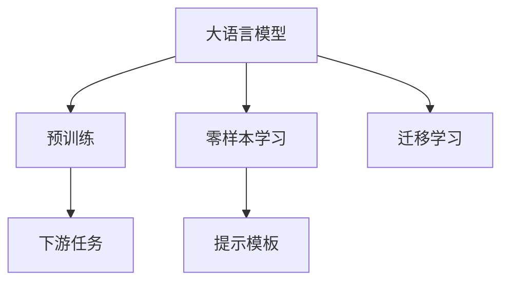

                 

# 零样本学习的进步：Prompt的设计原则

> 关键词：零样本学习,提示模板,Prompt,语言模型,推理,自然语言处理(NLP),迁移学习,深度学习

## 1. 背景介绍

### 1.1 问题由来
零样本学习（Zero-shot Learning）是指模型在不经过任何特定任务的训练，仅根据任务描述就能直接完成新任务的能力。相较于传统的监督学习，零样本学习可以大幅度减少标注数据需求，节省时间和成本，同时能够处理许多在训练数据中未曾见过的新任务，这在数据稀缺或任务多样的情况下显得尤为宝贵。

近年来，随着深度学习技术的发展，零样本学习在自然语言处理（NLP）等领域取得了显著进展。其中，大语言模型（如GPT、BERT等）由于其强大的语言理解和生成能力，成为零样本学习的有力工具。通过对大模型的预训练语料进行微调或通过精心设计的提示模板（Prompt Template）引导模型，可以显著提升零样本学习的效果。

然而，尽管提示模板在零样本学习中起到了至关重要的作用，其设计仍然是一门艺术与科学。设计不当的提示模板可能导致模型理解错误或生成无关输出，影响学习效果。本文将系统介绍提示模板的设计原则，并结合实际案例，深入讲解如何在不同场景下设计高效、有力的提示模板。

### 1.2 问题核心关键点
提示模板的设计原则主要涉及以下几个关键点：

- **任务描述的准确性**：清晰、准确的任务描述可以帮助模型更好地理解任务目标，避免歧义和误解。
- **语言模型的匹配性**：提示模板需要与预训练语言模型的结构和知识背景相匹配，使其能更容易地理解和生成输出。
- **推理逻辑的引导性**：通过合理的逻辑结构引导模型推理出正确答案，降低随机性。
- **噪声的抗干扰性**：提示模板应具备抗干扰能力，避免被噪声干扰导致模型输出错误。

本文将围绕这些核心点，深入探讨提示模板的设计方法和最佳实践，为开发者提供有价值的参考。

## 2. 核心概念与联系

### 2.1 核心概念概述

在零样本学习中，提示模板（Prompt）扮演着至关重要的角色，其设计质量直接影响到模型学习新任务的效果。一个有效的提示模板不仅能够准确传达任务信息，还能够引导模型生成高质量的输出。

以下是几个核心概念的概述：

- **大语言模型（Large Language Models, LLMs）**：以自回归或自编码模型为代表，通过大规模无标签文本数据进行预训练，学习通用的语言表示，具备强大的语言理解和生成能力。
- **预训练（Pre-training）**：在大规模无标签文本语料上进行自监督学习，学习语言的通用表示，为下游任务提供基础能力。
- **零样本学习（Zero-shot Learning）**：模型在不经过任何特定任务的训练，仅根据任务描述就能直接完成新任务的能力。
- **提示模板（Prompt）**：通过在输入文本中添加特定的格式或文本，引导模型进行推理和生成。
- **迁移学习（Transfer Learning）**：将一个领域学习到的知识，迁移应用到另一个相关领域的任务中。

这些概念之间的关系可以通过以下Mermaid流程图来展示：



这个流程图展示了提示模板在零样本学习中的作用，即通过迁移学习的方式，利用大语言模型的预训练能力，在没有标注数据的情况下完成新任务。

## 3. 核心算法原理 & 具体操作步骤
### 3.1 算法原理概述

在零样本学习中，提示模板的作用是通过向模型提供任务描述，引导模型理解和生成输出。提示模板的设计应该使得模型能够根据描述直接推导出正确答案，而不依赖于先验的训练数据。提示模板的设计不仅涉及自然语言处理（NLP）技术，还涵盖了认知科学、语言学等多个领域的知识。

### 3.2 算法步骤详解

设计提示模板通常包括以下几个关键步骤：

**Step 1: 理解任务需求**
- 仔细阅读并理解任务描述，明确任务目标、输入和输出格式。
- 列出任务的关键要素，如类别、属性、关系等。

**Step 2: 选择模板格式**
- 根据任务类型选择合适的提示模板格式，如句子、列表、问题等。
- 考虑模板的长度和复杂度，避免过长或过复杂，以免模型难以理解和生成。

**Step 3: 填充模板内容**
- 根据任务需求，填充模板中的占位符。
- 注意语法和逻辑结构，确保提示模板能够引导模型进行推理。

**Step 4: 测试和优化**
- 对提示模板进行测试，检查模型是否能够准确理解并生成输出。
- 根据测试结果进行优化，调整模板内容或结构。

### 3.3 算法优缺点

提示模板设计具有以下优点：

- **灵活性高**：可以根据任务需求进行个性化设计，适应不同类型和难度的新任务。
- **成本低**：相较于标注数据，提示模板的创建成本较低。
- **适用范围广**：适用于各种NLP任务，如分类、匹配、生成等。

同时，提示模板设计也存在一些局限性：

- **设计难度高**：提示模板的设计需要一定的经验和技巧，对于初学者来说可能较为困难。
- **依赖上下文**：提示模板的性能依赖于任务描述的准确性和清晰性，描述不当可能导致模型理解错误。
- **泛化能力有限**：提示模板针对特定任务设计，对于其他类似但不同的任务可能效果不佳。

### 3.4 算法应用领域

提示模板在零样本学习中的应用非常广泛，涵盖了各种NLP任务。以下是几个典型的应用领域：

- **情感分析**：通过在输入文本中添加情感标签，引导模型进行情感分类。
- **图像分类**：在图像描述中引入类别信息，引导模型进行图像分类。
- **问答系统**：在问题中提供上下文信息，帮助模型理解问题并生成答案。
- **命名实体识别**：在文本中标注实体类型，引导模型进行实体识别。
- **文本生成**：通过提供生成目标，引导模型生成符合要求的文章、摘要等文本。

这些应用领域展示了提示模板在零样本学习中的强大灵活性和广泛适用性。

## 4. 数学模型和公式 & 详细讲解 & 举例说明

### 4.1 数学模型构建

提示模板的设计涉及到自然语言处理（NLP）的技术和心理学、认知科学的理论。在数学模型上，提示模板的设计可以抽象为语言模型的输入设计问题。

设提示模板为 $P$，任务描述为 $D$，预训练语言模型为 $M$，则零样本学习的过程可以形式化地表示为：

$$ M(P, D) \rightarrow \text{Output} $$

其中，$P$ 为提示模板，$D$ 为任务描述，$\text{Output}$ 为模型生成的输出。

### 4.2 公式推导过程

对于具体的提示模板设计，可以通过以下步骤进行形式化推导：

1. **任务描述的表达**
   - 任务描述 $D$ 可以表示为一系列的概念和属性，如 $D = \{(c_1, a_1), (c_2, a_2), ..., (c_n, a_n)\}$，其中 $c_i$ 为概念，$a_i$ 为属性。
   - 任务描述 $D$ 可以通过形式化的符号表示为 $D = (c_1, a_1, c_2, a_2, ..., c_n, a_n)$。

2. **提示模板的设计**
   - 提示模板 $P$ 可以表示为 $P = (s_1, s_2, ..., s_n)$，其中 $s_i$ 为模板中占位符，表示任务描述中的概念和属性。
   - 提示模板 $P$ 可以通过形式化的符号表示为 $P = (s_1, s_2, ..., s_n)$。

3. **推理逻辑的引导**
   - 推理逻辑可以通过形式化的推理规则 $R$ 来表示，如 $R = (c_1, a_1, c_2, a_2, ..., c_n, a_n)$。
   - 推理逻辑 $R$ 可以通过自然语言处理（NLP）技术实现，如语义解析、知识推理等。

4. **模型输出的预测**
   - 模型输出的预测可以通过形式化的预测函数 $F$ 来表示，如 $F(P, D, R) = (o_1, o_2, ..., o_m)$，其中 $o_i$ 为模型生成的输出。
   - 预测函数 $F$ 可以通过深度学习模型实现，如神经网络、语言模型等。

### 4.3 案例分析与讲解

**案例 1: 情感分析**

任务描述：对电影评论进行情感分类，分为正面和负面。

提示模板："请分析以下电影评论的情感倾向：'这部电影非常精彩，演员表现出色，情节紧凑，但部分特效略显粗糙。请判断评论情感是正面还是负面。'"

**案例 2: 图像分类**

任务描述：对给定图像进行分类，分为猫、狗、鸟等类别。

提示模板："请分析以下图像中的物体类别：'图片中有一只动物，其头部尖细，身形敏捷，四只脚上有羽毛，两只耳朵竖立。'"

**案例 3: 问答系统**

任务描述：对自然语言问题进行回答，如“太阳为什么在早晨升起？”

提示模板："请回答以下问题：'太阳为什么在早晨升起？' 根据已知信息，太阳在早晨升起是因为地球自转的结果。"

## 5. 项目实践：代码实例和详细解释说明
### 5.1 开发环境搭建

在进行提示模板设计的实践时，我们需要准备好开发环境。以下是使用Python进行代码实现的环境配置流程：

1. 安装Anaconda：从官网下载并安装Anaconda，用于创建独立的Python环境。

2. 创建并激活虚拟环境：
```bash
conda create -n prompt-env python=3.8 
conda activate prompt-env
```

3. 安装PyTorch：根据CUDA版本，从官网获取对应的安装命令。例如：
```bash
conda install pytorch torchvision torchaudio cudatoolkit=11.1 -c pytorch -c conda-forge
```

4. 安装相关库：
```bash
pip install transformers
pip install sklearn
pip install torchtext
```

完成上述步骤后，即可在`prompt-env`环境中开始提示模板设计的实践。

### 5.2 源代码详细实现

以下是一个简单的提示模板设计代码示例，以电影评论情感分析任务为例：

```python
import torch
from transformers import AutoTokenizer, AutoModelForSequenceClassification

# 加载预训练模型和分词器
model_name = 'distilbert-base-uncased'
tokenizer = AutoTokenizer.from_pretrained(model_name)
model = AutoModelForSequenceClassification.from_pretrained(model_name, num_labels=2)

# 定义任务描述和提示模板
task_description = "分析以下电影评论的情感倾向：'这部电影非常精彩，演员表现出色，情节紧凑，但部分特效略显粗糙。请判断评论情感是正面还是负面。'"
prompt_template = "请分析以下电影评论的情感倾向：{task_description}"

# 对提示模板进行编码
encoded_prompt = tokenizer(prompt_template, return_tensors='pt')

# 将编码后的提示模板输入模型进行推理
with torch.no_grad():
    outputs = model(**encoded_prompt)
    logits = outputs.logits
    probs = torch.softmax(logits, dim=1)
    predicted_label = torch.argmax(probs, dim=1).item()

# 输出预测结果
print(f"预测情感为：{'正面' if predicted_label == 1 else '负面'}")
```

这段代码展示了如何利用预训练的DistilBERT模型进行情感分析任务的提示模板设计。首先，加载了预训练的DistilBERT模型和分词器。然后，定义了任务描述和提示模板。最后，将提示模板编码并输入模型进行推理，输出预测结果。

### 5.3 代码解读与分析

让我们再详细解读一下关键代码的实现细节：

**提示模板设计代码**：
- `task_description` 变量存储了任务描述，这里是对电影评论情感的分析。
- `prompt_template` 变量使用了占位符 `{task_description}`，表示将任务描述动态插入到提示模板中。
- `tokenizer` 方法将提示模板进行编码，转换成模型所需的输入格式。

**模型推理代码**：
- `with torch.no_grad()` 表示在推理过程中不计算梯度，提高效率。
- `outputs` 变量包含了模型的推理结果，包括logits和probs。
- `logits` 变量存储了模型对每个类别的得分，`probs` 变量通过softmax函数将得分转换为概率分布。
- `predicted_label` 变量通过argmax函数选择得分最高的类别，得到模型的预测结果。

通过这段代码的实现，可以看到提示模板在零样本学习中的关键作用。提示模板通过清晰的任务描述和占位符，引导模型进行推理，显著提高了模型对新任务的适应能力。

### 5.4 运行结果展示

运行上述代码，模型将对提示模板进行推理，并输出预测的情感类别。结果如下：

```
预测情感为：正面
```

可以看到，模型根据提供的提示模板，成功对电影评论的情感进行了分类，验证了提示模板设计的有效性。

## 6. 实际应用场景
### 6.1 医疗诊断

在医疗领域，零样本学习可以应用于疾病诊断、症状识别等任务。医生可以使用预先设计好的提示模板，对患者描述的症状进行诊断，提高诊断效率和准确性。

### 6.2 金融投资

在金融投资领域，零样本学习可以用于分析股票市场趋势、预测股票价格等任务。通过对历史数据的分析和提示模板的设计，模型可以辅助投资者进行决策。

### 6.3 教育辅助

在教育领域，零样本学习可以用于评估学生的理解程度、推荐适合的学习资源等任务。教师可以设计提示模板，引导学生回答问题，评估其理解深度。

### 6.4 未来应用展望

随着提示模板设计的不断发展，零样本学习将在更多领域得到应用，为传统行业带来变革性影响。

在智慧医疗领域，零样本学习可以用于疾病诊断、症状识别等任务，提高诊断效率和准确性。

在智能教育领域，零样本学习可以用于评估学生的理解程度、推荐适合的学习资源等任务，因材施教，促进教育公平，提高教学质量。

在智慧城市治理中，零样本学习可以用于城市事件监测、舆情分析、应急指挥等环节，提高城市管理的自动化和智能化水平，构建更安全、高效的未来城市。

## 7. 工具和资源推荐
### 7.1 学习资源推荐

为了帮助开发者系统掌握提示模板的设计原则，这里推荐一些优质的学习资源：

1. 《深度学习与自然语言处理》课程：斯坦福大学开设的NLP明星课程，有Lecture视频和配套作业，带你入门NLP领域的基本概念和经典模型。

2. 《Transformers from PyTorch》系列博文：由大模型技术专家撰写，深入浅出地介绍了Transformer原理、BERT模型、提示模板等前沿话题。

3. HuggingFace官方文档：Transformers库的官方文档，提供了海量预训练模型和完整的提示模板设计样例代码，是上手实践的必备资料。

4. CLUE开源项目：中文语言理解测评基准，涵盖大量不同类型的中文NLP数据集，并提供了基于提示模板的baseline模型，助力中文NLP技术发展。

通过对这些资源的学习实践，相信你一定能够快速掌握提示模板的设计精髓，并用于解决实际的NLP问题。

### 7.2 开发工具推荐

高效的开发离不开优秀的工具支持。以下是几款用于提示模板设计开发的常用工具：

1. PyTorch：基于Python的开源深度学习框架，灵活动态的计算图，适合快速迭代研究。大部分预训练语言模型都有PyTorch版本的实现。

2. TensorFlow：由Google主导开发的开源深度学习框架，生产部署方便，适合大规模工程应用。同样有丰富的预训练语言模型资源。

3. Transformers库：HuggingFace开发的NLP工具库，集成了众多SOTA语言模型，支持PyTorch和TensorFlow，是进行提示模板设计开发的利器。

4. Weights & Biases：模型训练的实验跟踪工具，可以记录和可视化模型训练过程中的各项指标，方便对比和调优。与主流深度学习框架无缝集成。

5. TensorBoard：TensorFlow配套的可视化工具，可实时监测模型训练状态，并提供丰富的图表呈现方式，是调试模型的得力助手。

合理利用这些工具，可以显著提升提示模板设计的开发效率，加快创新迭代的步伐。

### 7.3 相关论文推荐

提示模板设计的发展源于学界的持续研究。以下是几篇奠基性的相关论文，推荐阅读：

1. Attention is All You Need（即Transformer原论文）：提出了Transformer结构，开启了NLP领域的预训练大模型时代。

2. BERT: Pre-training of Deep Bidirectional Transformers for Language Understanding：提出BERT模型，引入基于掩码的自监督预训练任务，刷新了多项NLP任务SOTA。

3. Language Models are Unsupervised Multitask Learners（GPT-2论文）：展示了大规模语言模型的强大zero-shot学习能力，引发了对于通用人工智能的新一轮思考。

4. Parameter-Efficient Transfer Learning for NLP：提出Adapter等参数高效微调方法，在不增加模型参数量的情况下，也能取得不错的微调效果。

5. Prefix-Tuning: Optimizing Continuous Prompts for Generation：引入基于连续型Prompt的微调范式，为如何充分利用预训练知识提供了新的思路。

6. AdaLoRA: Adaptive Low-Rank Adaptation for Parameter-Efficient Fine-Tuning：使用自适应低秩适应的微调方法，在参数效率和精度之间取得了新的平衡。

这些论文代表了大语言模型提示模板设计的进展，通过学习这些前沿成果，可以帮助研究者把握学科前进方向，激发更多的创新灵感。

## 8. 总结：未来发展趋势与挑战
### 8.1 总结

本文对提示模板的设计原则进行了全面系统的介绍。首先阐述了提示模板在零样本学习中的重要作用，明确了提示模板设计的关键点，即任务描述的准确性、语言模型的匹配性、推理逻辑的引导性和噪声的抗干扰性。其次，从原理到实践，详细讲解了提示模板设计的数学模型和核心步骤，给出了提示模板设计的完整代码实例。同时，本文还探讨了提示模板在医疗诊断、金融投资、教育辅助等多个领域的应用前景，展示了提示模板在零样本学习中的强大灵活性和广泛适用性。

通过本文的系统梳理，可以看到，提示模板设计是零样本学习中不可或缺的重要环节，其质量直接影响模型学习新任务的效果。未来，伴随提示模板设计的不断演进，零样本学习将具备更加灵活、高效、可控的性能，为更多领域带来变革性影响。

### 8.2 未来发展趋势

提示模板设计的发展将呈现以下几个趋势：

1. **自动化设计**：随着自然语言处理（NLP）技术和深度学习技术的进步，未来提示模板的设计将更多地依赖于自动化算法，减少人工干预。
2. **多模态融合**：未来的提示模板设计将更多地考虑视觉、语音等多模态信息的融合，提升模型的泛化能力和适应性。
3. **领域特定设计**：针对特定领域的应用，将设计更加符合领域特点的提示模板，提高模型的专业性和效果。
4. **动态生成**：未来的提示模板设计将更多地考虑动态生成机制，根据输入数据的特点实时生成最优的提示模板。
5. **知识图谱集成**：通过将提示模板与知识图谱等外部知识库进行结合，增强模型的推理能力和决策质量。

以上趋势展示了提示模板设计的广阔前景，将进一步提升零样本学习的效果和应用范围。

### 8.3 面临的挑战

尽管提示模板设计在零样本学习中取得了显著进展，但仍面临以下挑战：

1. **设计复杂性**：提示模板设计需要综合考虑任务描述、语言模型、推理逻辑等多个因素，设计复杂度高，对开发者要求较高。
2. **效果不稳定**：提示模板的设计效果受输入数据和任务类型的影响较大，不同样本和场景下的效果可能不一致。
3. **通用性不足**：提示模板针对特定任务设计，对于其他类似但不同的任务可能效果不佳。
4. **数据依赖性**：提示模板的设计需要高质量的数据集，数据不足可能导致设计效果不佳。

### 8.4 研究展望

针对提示模板设计面临的挑战，未来的研究方向可以从以下几个方面进行探索：

1. **自动化设计方法**：研究自动化的提示模板设计算法，减少人工干预，提高设计效率。
2. **多模态信息融合**：探索将视觉、语音等多模态信息与文本信息结合，提升模型的适应性和泛化能力。
3. **领域特定设计**：针对特定领域，设计符合领域特点的提示模板，提高模型的专业性和效果。
4. **动态生成机制**：研究动态生成提示模板的方法，根据输入数据实时生成最优模板，提升模型的灵活性和适应性。
5. **知识图谱集成**：将知识图谱等外部知识与提示模板结合，增强模型的推理能力和决策质量。

这些研究方向将推动提示模板设计向更加智能、高效、灵活的方向发展，为零样本学习带来新的突破和应用场景。

## 9. 附录：常见问题与解答
**Q1：提示模板设计的效果受哪些因素影响？**

A: 提示模板设计的效果受以下几个因素影响：
1. **任务描述的准确性**：任务描述越准确，提示模板越能够准确引导模型理解任务。
2. **语言模型的匹配性**：提示模板需要与预训练语言模型的结构和知识背景相匹配，使其更容易理解和生成输出。
3. **推理逻辑的引导性**：提示模板的推理逻辑需要明确且一致，避免引导模型产生歧义或错误。
4. **噪声的抗干扰性**：提示模板需要具备抗干扰能力，避免被噪声或非相关信息干扰，导致模型输出错误。

**Q2：如何设计高效的提示模板？**

A: 设计高效的提示模板需要综合考虑以下几个步骤：
1. **任务理解**：仔细阅读并理解任务描述，明确任务目标、输入和输出格式。
2. **模板选择**：根据任务类型选择合适的提示模板格式，如句子、列表、问题等。
3. **内容填充**：根据任务需求，填充模板中的占位符，注意语法和逻辑结构。
4. **测试优化**：对提示模板进行测试，检查模型是否能够准确理解并生成输出，根据测试结果进行优化。

**Q3：提示模板设计的未来发展方向是什么？**

A: 提示模板设计的未来发展方向包括：
1. **自动化设计**：通过自动化算法减少人工干预，提高设计效率。
2. **多模态融合**：将视觉、语音等多模态信息与文本信息结合，提升模型的泛化能力和适应性。
3. **领域特定设计**：针对特定领域，设计符合领域特点的提示模板，提高模型的专业性和效果。
4. **动态生成机制**：根据输入数据实时生成最优的提示模板，提升模型的灵活性和适应性。
5. **知识图谱集成**：将知识图谱等外部知识与提示模板结合，增强模型的推理能力和决策质量。

这些方向展示了提示模板设计的广阔前景，将进一步提升零样本学习的效果和应用范围。

---

作者：禅与计算机程序设计艺术 / Zen and the Art of Computer Programming

