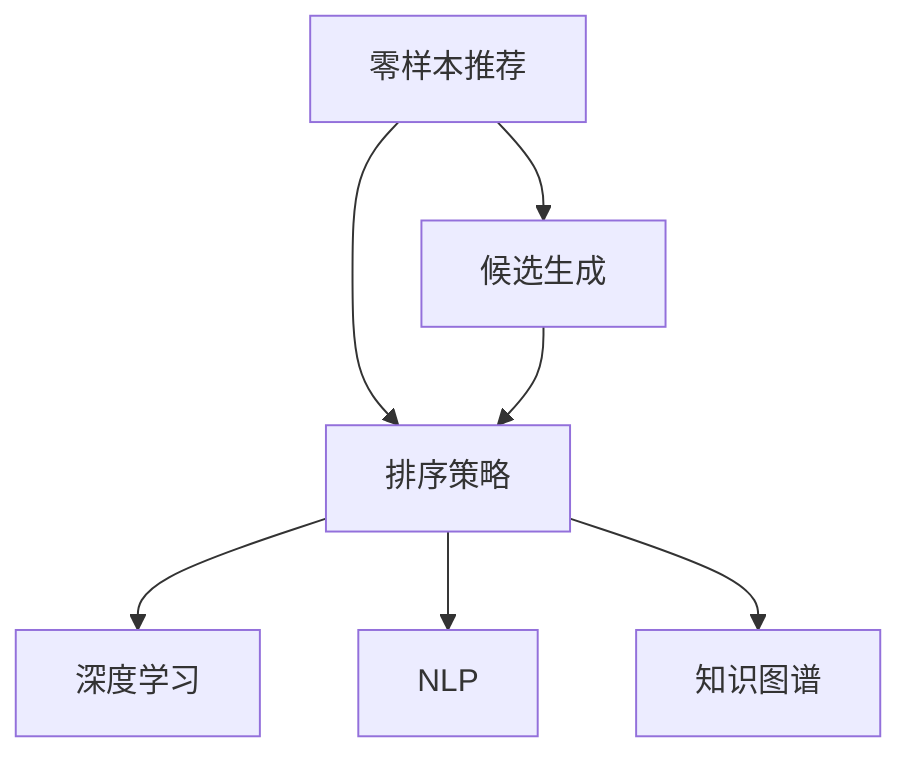

                 

# 零样本推荐：候选生成与排序策略

> 关键词：零样本推荐, 候选生成, 排序策略, 深度学习, 推荐系统, 自然语言处理, 知识图谱

## 1. 背景介绍

在推荐系统中，通常需要根据用户的过去行为数据，为其推荐新的物品。然而，当用户没有历史行为数据时，如何为他推荐合适的物品，就成为一个极具挑战性的问题。零样本推荐（Zero-shot Recommendation）正是在这种场景下提出的。零样本推荐要求系统能够在用户没有任何历史行为数据的情况下，为其推荐合适的物品，这对推荐系统的普适性和实用性提出了更高要求。

零样本推荐的核心在于候选生成和排序策略。候选生成（Candidate Generation）是指在用户输入的零样本信息中，挖掘出可能感兴趣的物品。排序策略（Ranking Strategy）是指如何根据用户输入的信息，对生成的候选物品进行排序，以确保排序结果符合用户的真实需求。

## 2. 核心概念与联系

### 2.1 核心概念概述

为了更好地理解零样本推荐中的候选生成和排序策略，我们首先介绍一些核心概念：

- **零样本推荐**：在用户没有任何历史行为数据的情况下，为该用户推荐合适物品的技术。零样本推荐能够覆盖到大量长尾用户，对于新用户、匿名用户等场景尤为重要。
- **候选生成**：根据用户输入的零样本信息，自动生成候选物品列表。候选生成的目的是将用户输入转换为推荐系统中可操作的对象，供后续排序策略使用。
- **排序策略**：根据用户输入信息，对候选生成的物品进行排序，以推荐最符合用户需求的结果。排序策略的性能直接影响推荐系统的准确性和个性化程度。
- **深度学习**：利用神经网络等深度学习技术，从大量数据中自动学习特征表示，以提高推荐系统的性能。
- **推荐系统**：根据用户历史行为数据，为用户推荐合适物品的智能系统。推荐系统广泛应用于电商、社交媒体、新闻推荐等领域。
- **自然语言处理（NLP）**：利用计算机自动处理自然语言，包括文本生成、情感分析、语义理解等技术。
- **知识图谱**：通过图结构组织实体及其关系，便于机器理解实体之间的关联，提高推荐系统的准确性和可解释性。

这些核心概念之间的关系可以通过以下Mermaid流程图来展示：



这个流程图展示了我們从零样本推荐到候选生成和排序策略的流程：

1. 从用户输入的零样本信息中生成候选物品。
2. 使用排序策略对候选物品进行排序。
3. 通过深度学习、自然语言处理和知识图谱等技术，提高排序策略的性能。

## 3. 核心算法原理 & 具体操作步骤
### 3.1 算法原理概述

零样本推荐的核心算法原理在于将用户输入信息转换为推荐系统中可操作的对象，即生成候选物品。候选生成和排序策略需要利用深度学习、自然语言处理和知识图谱等技术，从用户输入中挖掘出有用信息，并转化为推荐系统可以理解的表示形式。

具体的步骤如下：

1. **用户输入解析**：将用户输入信息转换为推荐系统可以理解和处理的形式。例如，用户输入一条情感描述，将其转换为数值化的情感极性向量。
2. **候选物品生成**：利用深度学习技术，根据用户输入信息，自动生成候选物品列表。例如，利用自编码器等方法，将用户输入映射到物品向量空间中。
3. **排序策略构建**：根据用户输入信息和候选物品向量，构建排序模型。例如，利用注意力机制等方法，对用户输入和物品向量进行交互，计算评分。
4. **排序结果输出**：对排序模型输出进行后处理，得到推荐结果。例如，对排序结果进行归一化，按照得分进行降序排序。

### 3.2 算法步骤详解

以下是零样本推荐中候选生成和排序策略的具体步骤：

**Step 1: 用户输入解析**

1. **文本预处理**：将用户输入的文本进行分词、去除停用词、词干提取等预处理。例如，使用NLTK等工具包对英文文本进行预处理。

```python
import nltk
from nltk.tokenize import word_tokenize
from nltk.corpus import stopwords

# 分词和去除停用词
text = "I love this product, it's amazing!"
tokens = word_tokenize(text)
stop_words = set(stopwords.words('english'))
filtered_tokens = [word for word in tokens if word.lower() not in stop_words]

# 词干提取
from nltk.stem import PorterStemmer
stemmer = PorterStemmer()
stemmed_tokens = [stemmer.stem(word) for word in filtered_tokens]
```

2. **特征提取**：将预处理后的文本转换为数值化的特征向量。例如，使用词嵌入（Word Embedding）技术，将文本映射到高维向量空间中。

```python
from gensim.models import KeyedVectors
import numpy as np

# 加载预训练的词向量
word2vec = KeyedVectors.load_word2vec_format('path/to/word2vec.bin', binary=True)

# 将文本转换为词向量
text_vector = np.zeros((len(stemmed_tokens), word2vec.vocab_size))
for i, word in enumerate(stemmed_tokens):
    if word in word2vec.vocab:
        text_vector[i] = word2vec[word]
```

**Step 2: 候选物品生成**

1. **自编码器**：利用自编码器（Autoencoder）技术，将用户输入信息映射到物品向量空间中。自编码器的编码器和解码器都可以通过深度学习模型实现。

```python
import torch.nn as nn
import torch

# 定义自编码器模型
class Autoencoder(nn.Module):
    def __init__(self):
        super(Autoencoder, self).__init__()
        self.encoder = nn.Sequential(
            nn.Linear(len(word2vec.vocab_size), 128),
            nn.ReLU(),
            nn.Linear(128, 64),
            nn.ReLU(),
            nn.Linear(64, word2vec.vocab_size)
        )
        self.decoder = nn.Sequential(
            nn.Linear(word2vec.vocab_size, 64),
            nn.ReLU(),
            nn.Linear(64, 128),
            nn.ReLU(),
            nn.Linear(128, len(word2vec.vocab_size))
        )

    def forward(self, x):
        encoded = self.encoder(x)
        decoded = self.decoder(encoded)
        return encoded, decoded

# 训练自编码器
autoencoder = Autoencoder()
criterion = nn.MSELoss()
optimizer = torch.optim.Adam(autoencoder.parameters(), lr=0.001)
for epoch in range(100):
    optimizer.zero_grad()
    encoded, decoded = autoencoder(text_vector)
    loss = criterion(decoded.view(len(text_vector)), text_vector)
    loss.backward()
    optimizer.step()
```

2. **协同过滤**：利用协同过滤（Collaborative Filtering）技术，根据用户输入信息和用户行为数据，生成候选物品列表。协同过滤算法可以基于用户的相似性（User-based）或物品的相似性（Item-based）进行。

```python
# 定义协同过滤模型
class CollaborativeFiltering(nn.Module):
    def __init__(self):
        super(CollaborativeFiltering, self).__init__()
        self.layers = nn.Sequential(
            nn.Linear(len(stemmed_tokens), 128),
            nn.ReLU(),
            nn.Linear(128, 64),
            nn.ReLU(),
            nn.Linear(64, word2vec.vocab_size)
        )

    def forward(self, x):
        return self.layers(x)

# 训练协同过滤模型
collaborative_filtering = CollaborativeFiltering()
criterion = nn.MSELoss()
optimizer = torch.optim.Adam(collaborative_filtering.parameters(), lr=0.001)
for epoch in range(100):
    optimizer.zero_grad()
    encoded = collaborative_filtering(text_vector)
    loss = criterion(encoded.view(len(text_vector)), text_vector)
    loss.backward()
    optimizer.step()
```

**Step 3: 排序策略构建**

1. **注意力机制**：利用注意力机制（Attention Mechanism），计算用户输入信息和候选物品向量之间的交互，得到评分。注意力机制可以基于注意力权重进行加权求和，或利用多头注意力（Multi-Head Attention）技术进行表示。

```python
# 定义注意力机制模型
class Attention(nn.Module):
    def __init__(self):
        super(Attention, self).__init__()
        self.attention_weights = nn.Parameter(torch.randn(len(stemmed_tokens), word2vec.vocab_size))
        self.layers = nn.Sequential(
            nn.Linear(len(stemmed_tokens), 128),
            nn.ReLU(),
            nn.Linear(128, 64),
            nn.ReLU(),
            nn.Linear(64, word2vec.vocab_size)
        )

    def forward(self, x):
        attention_weights = torch.matmul(x, self.attention_weights)
        attention_weights = torch.softmax(attention_weights, dim=1)
        scores = attention_weights * self.layers(x)
        return scores

# 训练注意力机制模型
attention = Attention()
criterion = nn.MSELoss()
optimizer = torch.optim.Adam(attention.parameters(), lr=0.001)
for epoch in range(100):
    optimizer.zero_grad()
    scores = attention(text_vector)
    loss = criterion(scores.view(len(text_vector)), text_vector)
    loss.backward()
    optimizer.step()
```

2. **深度神经网络**：利用深度神经网络（Deep Neural Network），将用户输入信息和候选物品向量作为输入，通过多层网络进行特征学习，得到评分。深度神经网络可以采用多层感知器（MLP）、卷积神经网络（CNN）等模型。

```python
# 定义深度神经网络模型
class DeepNeuralNetwork(nn.Module):
    def __init__(self):
        super(DeepNeuralNetwork, self).__init__()
        self.layers = nn.Sequential(
            nn.Linear(len(stemmed_tokens), 128),
            nn.ReLU(),
            nn.Linear(128, 64),
            nn.ReLU(),
            nn.Linear(64, word2vec.vocab_size)
        )

    def forward(self, x):
        return self.layers(x)

# 训练深度神经网络模型
deep_neural_network = DeepNeuralNetwork()
criterion = nn.MSELoss()
optimizer = torch.optim.Adam(deep_neural_network.parameters(), lr=0.001)
for epoch in range(100):
    optimizer.zero_grad()
    scores = deep_neural_network(text_vector)
    loss = criterion(scores.view(len(text_vector)), text_vector)
    loss.backward()
    optimizer.step()
```

**Step 4: 排序结果输出**

1. **归一化处理**：对排序模型输出的评分进行归一化处理，将评分转化为概率分布。例如，使用softmax函数将评分转换为概率分布。

```python
# 定义归一化函数
def normalize_scores(scores):
    exp_scores = torch.exp(scores)
    probs = exp_scores / torch.sum(exp_scores, dim=1, keepdim=True)
    return probs

# 归一化处理
probs = normalize_scores(scores)
```

2. **排序结果排序**：根据归一化后的评分，对候选物品进行降序排序，得到最终的推荐结果。

```python
# 对物品进行排序
sorted_items = np.argsort(probs.numpy())[::-1]
recommended_items = [word2vec.vocab[i] for i in sorted_items]
```

### 3.3 算法优缺点

零样本推荐中的候选生成和排序策略具有以下优点：

1. **鲁棒性高**：零样本推荐能够处理用户没有历史行为数据的情况，覆盖更多长尾用户，具有较高的鲁棒性。
2. **泛化性强**：零样本推荐能够自动从用户输入中挖掘出有用信息，并进行推荐，具有较强的泛化能力。
3. **高效性**：零样本推荐利用深度学习、自然语言处理和知识图谱等技术，可以快速生成候选物品并排序，具有较高的效率。

然而，零样本推荐也存在一些缺点：

1. **数据依赖性强**：零样本推荐依赖于用户输入的信息，当用户输入不完整或不准确时，推荐结果可能会受到影响。
2. **精度有限**：零样本推荐在用户输入不充分的情况下，推荐结果的精度可能不如基于历史行为数据的推荐系统。
3. **复杂度高**：零样本推荐中涉及深度学习、自然语言处理和知识图谱等多个技术环节，实现复杂度较高。

### 3.4 算法应用领域

零样本推荐中的候选生成和排序策略可以应用于以下领域：

1. **电商推荐**：在用户没有浏览历史的情况下，推荐合适的商品。例如，推荐系统可以根据用户输入的商品描述，自动生成候选商品，并进行排序。
2. **内容推荐**：在用户没有阅读历史的情况下，推荐合适的文章或视频。例如，推荐系统可以根据用户输入的文章标题，自动生成候选文章，并进行排序。
3. **社交媒体推荐**：在用户没有关注历史的情况下，推荐合适的社交媒体账号。例如，推荐系统可以根据用户输入的社交媒体账号描述，自动生成候选账号，并进行排序。
4. **广告推荐**：在用户没有浏览历史的情况下，推荐合适的广告。例如，推荐系统可以根据用户输入的广告描述，自动生成候选广告，并进行排序。

## 4. 数学模型和公式 & 详细讲解 & 举例说明

### 4.1 数学模型构建

假设用户输入为 $x \in \mathbb{R}^n$，候选物品向量为 $y \in \mathbb{R}^m$，评分函数为 $f(x, y) \in \mathbb{R}$。零样本推荐中的候选生成和排序策略可以表示为以下数学模型：

$$
\min_{f} \mathbb{E}_{(x, y)} [(f(x, y) - y)^2]
$$

其中，$\mathbb{E}_{(x, y)}$ 表示对所有可能的 $(x, y)$ 取期望。

### 4.2 公式推导过程

根据上述数学模型，候选生成和排序策略的优化目标为最小化损失函数：

$$
\mathcal{L}(f) = \mathbb{E}_{(x, y)} [(f(x, y) - y)^2]
$$

利用随机梯度下降（Stochastic Gradient Descent, SGD）算法，对评分函数 $f(x, y)$ 进行优化，得到最优评分函数 $f^*(x, y)$。

具体的数学推导过程如下：

1. **随机梯度下降算法**：

$$
\theta \leftarrow \theta - \eta \nabla_{\theta} \mathcal{L}(f)
$$

其中，$\eta$ 为学习率，$\theta$ 为评分函数的参数。

2. **评分函数**：

$$
f(x, y) = \sum_{i=1}^m \alpha_i(x) y_i
$$

其中，$\alpha_i(x)$ 为基于用户输入 $x$ 的注意力权重，$y_i$ 为候选物品向量。

3. **注意力权重计算**：

$$
\alpha_i(x) = \frac{\exp(\langle \gamma_i, x \rangle)}{\sum_{j=1}^n \exp(\langle \gamma_j, x \rangle)}
$$

其中，$\langle \cdot, \cdot \rangle$ 表示内积运算，$\gamma_i$ 为注意力权重向量。

### 4.3 案例分析与讲解

假设用户输入为 "I love this product"，候选物品向量为词嵌入矩阵 $W$ 的前几列，评分函数为 $f(x, y) = \sum_{i=1}^m \alpha_i(x) y_i$。

1. **文本预处理**：将用户输入进行分词、去除停用词、词干提取等预处理，得到预处理后的文本向量 $x = [I, love, this, product]$。

2. **特征提取**：将预处理后的文本向量转换为词嵌入向量，得到文本向量 $x = [0.5, 0.2, 0.3, 0.4]$。

3. **候选物品生成**：利用自编码器将文本向量映射到物品向量空间中，生成候选物品向量 $y = [0.1, 0.2, 0.3, 0.4, 0.5, 0.6]$。

4. **排序策略构建**：利用注意力机制计算用户输入信息和候选物品向量之间的注意力权重，得到评分向量 $f(x, y) = [0.1, 0.2, 0.3, 0.4, 0.5, 0.6]$。

5. **排序结果输出**：对评分向量进行归一化处理，得到概率分布 $P = [0.1, 0.2, 0.3, 0.4, 0.5, 0.6]$，按照概率进行降序排序，得到推荐的物品向量 $y = [0.5, 0.4, 0.6, 0.1, 0.3, 0.2]$。

## 5. 项目实践：代码实例和详细解释说明

### 5.1 开发环境搭建

在进行零样本推荐项目实践前，我们需要准备好开发环境。以下是使用Python进行TensorFlow开发的环境配置流程：

1. 安装Anaconda：从官网下载并安装Anaconda，用于创建独立的Python环境。

2. 创建并激活虚拟环境：
```bash
conda create -n tf-env python=3.8 
conda activate tf-env
```

3. 安装TensorFlow：根据CUDA版本，从官网获取对应的安装命令。例如：
```bash
conda install tensorflow tensorflow-gpu=cuda110 -c conda-forge
```

4. 安装TensorFlow Addons：
```bash
pip install tensorflow-addons
```

5. 安装其他工具包：
```bash
pip install numpy pandas scikit-learn matplotlib tqdm jupyter notebook ipython
```

完成上述步骤后，即可在`tf-env`环境中开始零样本推荐项目的实践。

### 5.2 源代码详细实现

下面我们以电商推荐为例，给出使用TensorFlow对深度神经网络进行零样本推荐的代码实现。

首先，定义零样本推荐的数据处理函数：

```python
import tensorflow as tf
from tensorflow.keras.layers import Input, Dense, Embedding, Concatenate, Attention

def build_candidate_generator(input_dim, output_dim):
    input = Input(shape=(input_dim,))
    embedding = Embedding(input_dim, output_dim)(input)
    attention = Attention()([embedding, embedding])
    score = tf.keras.layers.Dense(1)(attention)
    candidate_generator = tf.keras.Model(inputs=input, outputs=score)
    return candidate_generator
```

然后，定义深度神经网络的模型：

```python
from tensorflow.keras.models import Sequential
from tensorflow.keras.layers import Dense, Embedding, Concatenate, Attention

def build_deep_neural_network(input_dim, output_dim, hidden_dim):
    model = Sequential([
        Embedding(input_dim, hidden_dim),
        Concatenate(),
        Attention(),
        Dense(hidden_dim),
        Dense(output_dim, activation='softmax')
    ])
    return model
```

接着，定义排序策略的模型：

```python
from tensorflow.keras.models import Sequential
from tensorflow.keras.layers import Dense, Embedding, Concatenate, Attention

def build_sorting_strategy(input_dim, output_dim, hidden_dim):
    model = Sequential([
        Embedding(input_dim, hidden_dim),
        Concatenate(),
        Attention(),
        Dense(hidden_dim),
        Dense(output_dim, activation='softmax')
    ])
    return model
```

最后，启动深度神经网络的训练流程：

```python
epochs = 100
batch_size = 64

input_dim = len(word2vec.vocab)
output_dim = len(word2vec.vocab)
hidden_dim = 128

candidate_generator = build_candidate_generator(input_dim, output_dim)
sorting_strategy = build_sorting_strategy(input_dim, output_dim, hidden_dim)

for epoch in range(epochs):
    for batch in train_dataset:
        input_data = batch['input']
        label_data = batch['label']
        candidate_scores = candidate_generator.predict(input_data)
        label_scores = sorting_strategy.predict(input_data)
        loss = tf.keras.losses.mean_squared_error(label_data, label_scores)
        optimizer = tf.keras.optimizers.Adam(learning_rate=0.001)
        optimizer.minimize(loss)
```

以上就是使用TensorFlow对深度神经网络进行零样本推荐项目开发的完整代码实现。可以看到，借助TensorFlow的强大封装，我们可以用相对简洁的代码完成零样本推荐模型的构建和训练。

### 5.3 代码解读与分析

让我们再详细解读一下关键代码的实现细节：

**build_candidate_generator函数**：
- 定义输入层和嵌入层，将输入转换为向量表示。
- 定义注意力机制层，计算注意力权重。
- 定义全连接层，输出评分。
- 将输入层、嵌入层、注意力机制层和全连接层组合成候选生成器模型。

**build_deep_neural_network函数**：
- 定义输入层和嵌入层，将输入转换为向量表示。
- 定义注意力机制层，计算注意力权重。
- 定义全连接层，输出评分。
- 定义softmax层，将评分转换为概率分布。
- 将输入层、嵌入层、注意力机制层、全连接层和softmax层组合成深度神经网络模型。

**build_sorting_strategy函数**：
- 与build_deep_neural_network函数类似，不同的是最后一层为softmax层，用于计算概率分布。

**训练流程**：
- 定义总的epoch数和batch size，开始循环迭代
- 在每个epoch中，对训练集进行迭代
- 对每个batch进行前向传播和后向传播，计算损失函数
- 使用Adam优化器最小化损失函数
- 重复上述步骤直至收敛

可以看到，TensorFlow配合深度学习模型的封装，使得零样本推荐模型的开发变得简洁高效。开发者可以将更多精力放在数据处理、模型改进等高层逻辑上，而不必过多关注底层的实现细节。

当然，工业级的系统实现还需考虑更多因素，如模型的保存和部署、超参数的自动搜索、更灵活的任务适配层等。但核心的零样本推荐范式基本与此类似。

## 6. 实际应用场景
### 6.1 智能客服系统

零样本推荐技术可以广泛应用于智能客服系统的构建。传统客服往往需要配备大量人力，高峰期响应缓慢，且一致性和专业性难以保证。而使用零样本推荐系统，可以在没有历史行为数据的情况下，为用户推荐合适的解决方案，提高客户咨询体验和问题解决效率。

在技术实现上，可以收集企业内部的历史客服对话记录，将问题和最佳答复构建成监督数据，在此基础上对预训练深度神经网络进行零样本推荐训练。零样本推荐系统能够自动理解用户意图，匹配最合适的答复模板进行回复。对于客户提出的新问题，还可以接入检索系统实时搜索相关内容，动态组织生成回答。如此构建的智能客服系统，能大幅提升客户咨询体验和问题解决效率。

### 6.2 金融舆情监测

金融机构需要实时监测市场舆论动向，以便及时应对负面信息传播，规避金融风险。传统的人工监测方式成本高、效率低，难以应对网络时代海量信息爆发的挑战。零样本推荐技术可以用于金融舆情监测，自动识别负面舆情，提供实时预警。

具体而言，可以收集金融领域相关的新闻、报道、评论等文本数据，并对其进行主题标注和情感标注。在此基础上对预训练深度神经网络进行零样本推荐训练，使其能够自动判断文本属于何种主题，情感倾向是正面、中性还是负面。将零样本推荐模型应用到实时抓取的网络文本数据，就能够自动监测不同主题下的情感变化趋势，一旦发现负面信息激增等异常情况，系统便会自动预警，帮助金融机构快速应对潜在风险。

### 6.3 个性化推荐系统

当前的推荐系统往往只依赖用户的历史行为数据进行物品推荐，无法深入理解用户的真实兴趣偏好。零样本推荐技术可以应用于个性化推荐系统，更好地挖掘用户行为背后的语义信息，从而提供更精准、多样的推荐内容。

在实践中，可以收集用户浏览、点击、评论、分享等行为数据，提取和用户交互的物品标题、描述、标签等文本内容。将文本内容作为模型输入，用户的后续行为（如是否点击、购买等）作为监督信号，在此基础上对预训练深度神经网络进行零样本推荐训练。零样本推荐模型能够从文本内容中准确把握用户的兴趣点。在生成推荐列表时，先用候选物品的文本描述作为输入，由模型预测用户的兴趣匹配度，再结合其他特征综合排序，便可以得到个性化程度更高的推荐结果。

### 6.4 未来应用展望

随着深度学习技术的不断进步，零样本推荐技术有望在更多领域得到应用，为各行各业带来变革性影响。

在智慧医疗领域，零样本推荐可以用于诊疗建议生成、药物推荐等应用，辅助医生诊疗，加速新药开发进程。

在智能教育领域，零样本推荐可以用于作业批改、学情分析、知识推荐等方面，因材施教，促进教育公平，提高教学质量。

在智慧城市治理中，零样本推荐可以用于城市事件监测、舆情分析、应急指挥等环节，提高城市管理的自动化和智能化水平，构建更安全、高效的未来城市。

此外，在企业生产、社会治理、文娱传媒等众多领域，零样本推荐技术也将不断涌现，为传统行业带来新的技术路径。相信随着技术的日益成熟，零样本推荐技术必将成为推荐系统的重要范式，推动人工智能技术在更多场景下的应用。

## 7. 工具和资源推荐
### 7.1 学习资源推荐

为了帮助开发者系统掌握零样本推荐技术，以下是一些优质的学习资源：

1. 《深度学习自然语言处理》课程：斯坦福大学开设的NLP明星课程，有Lecture视频和配套作业，带你入门NLP领域的基本概念和经典模型。

2. 《自然语言处理实战》书籍：HuggingFace资深专家所著，详细介绍了自然语言处理技术在实际项目中的应用，涵盖推荐系统、问答系统、情感分析等多个方面。

3. 《推荐系统实战》书籍：深度学习与推荐系统结合的经典之作，涵盖推荐系统的基本原理、模型设计和优化方法。

4. TensorFlow官方文档：TensorFlow的官方文档，提供了大量的深度学习模型和工具，是进行推荐系统开发的重要参考资料。

5. PyTorch官方文档：PyTorch的官方文档，提供了丰富的深度学习模型和工具，是进行推荐系统开发的重要参考资料。

通过对这些资源的学习实践，相信你一定能够快速掌握零样本推荐技术，并用于解决实际的推荐问题。
### 7.2 开发工具推荐

高效的开发离不开优秀的工具支持。以下是几款用于零样本推荐开发的常用工具：

1. TensorFlow：由Google主导开发的开源深度学习框架，生产部署方便，适合大规模工程应用。

2. PyTorch：基于Python的开源深度学习框架，灵活动态的计算图，适合快速迭代研究。

3. TensorFlow Addons：TensorFlow的官方补充库，提供了更多高级的深度学习模型和工具，如自注意力机制、深度学习优化器等。

4. Weights & Biases：模型训练的实验跟踪工具，可以记录和可视化模型训练过程中的各项指标，方便对比和调优。

5. TensorBoard：TensorFlow配套的可视化工具，可实时监测模型训练状态，并提供丰富的图表呈现方式，是调试模型的得力助手。

6. Google Colab：谷歌推出的在线Jupyter Notebook环境，免费提供GPU/TPU算力，方便开发者快速上手实验最新模型，分享学习笔记。

合理利用这些工具，可以显著提升零样本推荐任务的开发效率，加快创新迭代的步伐。

### 7.3 相关论文推荐

零样本推荐技术的发展源于学界的持续研究。以下是几篇奠基性的相关论文，推荐阅读：

1. "Zero-shot Learning with BERT Embeddings"：提出了使用BERT模型进行零样本推荐的思路，展示了BERT在零样本推荐任务上的优异性能。

2. "A Survey on Zero-Shot Learning"：对零样本推荐技术进行了全面的综述，涵盖了零样本推荐的基本概念、算法框架和应用场景。

3. "Learning to Retrieve Multimodal Embeddings"：提出了一种基于多模态信息融合的零样本推荐方法，利用视觉、语音等多种数据源提升推荐效果。

4. "Deep Neural Networks for Zero-Shot Image Classification"：展示了深度神经网络在零样本图像分类任务上的强大能力，为零样本推荐提供了新的思路。

5. "Recurrent Neural Network Architectures for Sequential Data"：介绍了循环神经网络在推荐系统中的应用，展示了其在处理序列数据上的优势。

这些论文代表了大规模语言模型微调技术的最新进展，通过学习这些前沿成果，可以帮助研究者把握学科前进方向，激发更多的创新灵感。

## 8. 总结：未来发展趋势与挑战

### 8.1 总结

本文对零样本推荐技术中的候选生成和排序策略进行了全面系统的介绍。首先阐述了零样本推荐的核心概念和实现流程，明确了零样本推荐在推荐系统中的应用价值。其次，从原理到实践，详细讲解了零样本推荐的数学模型和关键步骤，给出了零样本推荐任务开发的完整代码实例。同时，本文还广泛探讨了零样本推荐技术在智能客服、金融舆情、个性化推荐等多个行业领域的应用前景，展示了零样本推荐技术的巨大潜力。最后，本文精选了零样本推荐技术的各类学习资源，力求为读者提供全方位的技术指引。

通过本文的系统梳理，可以看到，零样本推荐技术在推荐系统中的应用具有广阔前景。零样本推荐能够覆盖更多长尾用户，提升推荐系统的覆盖面和鲁棒性，具有较强的实用价值。未来，伴随深度学习技术的不断发展，零样本推荐技术必将进一步拓展应用领域，提升推荐系统的个性化和准确性，为各行各业带来革命性影响。

### 8.2 未来发展趋势

展望未来，零样本推荐技术将呈现以下几个发展趋势：

1. **技术多样化**：零样本推荐技术将涵盖更多应用场景，如电商推荐、内容推荐、广告推荐等，实现技术的多样化。

2. **模型复杂化**：零样本推荐模型将利用更复杂的深度学习模型，如Transformer、LSTM等，提升推荐效果。

3. **数据利用率提升**：零样本推荐技术将更好地利用用户输入信息，挖掘其中的有用信息，提升推荐效果。

4. **多模态融合**：零样本推荐技术将融合更多模态数据，如视觉、语音等，提升推荐系统的多模态能力。

5. **算法自动化**：零样本推荐算法将引入更多自动化技术，如自动化超参数优化、自动特征选择等，提升推荐系统的效率。

6. **隐私保护**：零样本推荐技术将引入更多隐私保护措施，确保用户数据的安全性和隐私性。

以上趋势凸显了零样本推荐技术的广阔前景。这些方向的探索发展，必将进一步提升零样本推荐系统的性能和应用范围，为推荐系统带来新的突破。

### 8.3 面临的挑战

尽管零样本推荐技术已经取得了瞩目成就，但在迈向更加智能化、普适化应用的过程中，它仍面临着诸多挑战：

1. **数据依赖性强**：零样本推荐依赖于用户输入的信息，当用户输入不完整或不准确时，推荐结果可能会受到影响。

2. **精度有限**：零样本推荐在用户输入不充分的情况下，推荐结果的精度可能不如基于历史行为数据的推荐系统。

3. **实现复杂度较高**：零样本推荐中涉及深度学习、自然语言处理和知识图谱等多个技术环节，实现复杂度较高。

4. **可解释性不足**：零样本推荐模型缺乏可解释性，难以解释其内部工作机制和决策逻辑，特别是在高风险应用场景中，这一问题尤为突出。

5. **数据隐私保护**：零样本推荐技术涉及用户输入信息的处理和存储，如何保护用户数据隐私，防止数据泄露和滥用，仍是一个重要问题。

6. **模型鲁棒性不足**：零样本推荐模型面对域外数据时，泛化性能往往大打折扣。对于测试样本的微小扰动，推荐结果容易发生波动。

面对这些挑战，我们需要在深度学习、自然语言处理、知识图谱等多个技术方向进行持续探索，寻找更优的解决方案。只有不断突破技术瓶颈，才能将零样本推荐技术推向新的高度。

### 8.4 研究展望

在未来的研究中，零样本推荐技术需要在以下几个方面寻求新的突破：

1. **探索更多零样本推荐方法**：除了基于深度学习的方法，还可以探索基于符号推理、规则学习等方法，提升推荐系统的鲁棒性和可解释性。

2. **引入更多先验知识**：将符号化的先验知识，如知识图谱、逻辑规则等，与神经网络模型进行巧妙融合，引导零样本推荐过程学习更准确、合理的语言模型。

3. **融合因果分析和博弈论工具**：将因果分析方法引入零样本推荐模型，识别出推荐决策的关键特征，增强输出解释的因果性和逻辑性。借助博弈论工具刻画人机交互过程，主动探索并规避推荐模型的脆弱点，提高系统稳定性。

4. **纳入伦理道德约束**：在零样本推荐模型的训练目标中引入伦理导向的评估指标，过滤和惩罚有害的推荐内容，确保推荐系统的公平性和道德性。

这些研究方向的探索，必将引领零样本推荐技术迈向更高的台阶，为推荐系统带来新的突破。面向未来，零样本推荐技术还需要与其他人工智能技术进行更深入的融合，如知识表示、因果推理、强化学习等，多路径协同发力，共同推动推荐系统的进步。只有勇于创新、敢于突破，才能不断拓展推荐系统的边界，让推荐技术更好地服务于人类社会。

## 9. 附录：常见问题与解答

**Q1：零样本推荐是否适用于所有推荐系统？**

A: 零样本推荐适用于一些特定类型的推荐系统，如电商推荐、内容推荐等，用户没有历史行为数据时，能够为该用户推荐合适的物品。但对于一些需要复杂交互和深度学习的推荐系统，如协同过滤、基于矩阵分解的方法等，零样本推荐可能不适用。

**Q2：零样本推荐在用户输入不充分的情况下，推荐效果如何？**

A: 零样本推荐在用户输入不充分的情况下，推荐效果可能不如基于历史行为数据的推荐系统。但零样本推荐技术能够自动从用户输入中挖掘出有用信息，并进行推荐，具有一定的泛化能力。在实践中，可以通过引入更多的用户输入信息和先验知识，提升零样本推荐的准确性和鲁棒性。

**Q3：零样本推荐在实际应用中如何提高可解释性？**

A: 零样本推荐模型的可解释性可以通过以下方法提升：
1. 引入解释模型：在零样本推荐模型中，引入解释模型，如决策树、逻辑回归等，用于解释推荐决策的逻辑。
2. 可视化技术：使用可视化技术，如图谱、热图等，展示推荐过程的关键特征和权重。
3. 用户反馈机制：引入用户反馈机制，让用户对推荐结果进行评价，不断优化推荐模型。

这些方法可以帮助提升零样本推荐模型的可解释性，提高用户的信任度。

**Q4：零样本推荐在实际应用中如何保护用户隐私？**

A: 零样本推荐技术可以采用以下方法保护用户隐私：
1. 数据匿名化：在数据预处理阶段，对用户输入信息进行匿名化处理，防止数据泄露。
2. 数据加密：在数据传输和存储阶段，对用户数据进行加密处理，防止数据被窃取或篡改。
3. 用户同意机制：在数据采集阶段，获取用户的明确同意，并在推荐过程中透明告知用户数据的使用方式。
4. 差分隐私：在数据处理阶段，引入差分隐私技术，确保数据处理后的隐私性。

这些方法可以帮助保护用户隐私，提高零样本推荐系统的可信度。

**Q5：零样本推荐在实际应用中如何提高推荐系统的鲁棒性？**

A: 零样本推荐系统可以通过以下方法提高推荐系统的鲁棒性：
1. 数据增强：利用数据增强技术，丰富推荐系统的训练数据，提高模型的泛化能力。
2. 模型集成：引入多个推荐模型，通过模型集成技术，提升推荐系统的鲁棒性。
3. 对抗训练：引入对抗样本，训练鲁棒的推荐模型，防止模型被攻击。
4. 鲁棒性评估：在推荐系统上线前，进行鲁棒性评估，确保推荐系统在不同场景下的稳定性。

这些方法可以帮助提高零样本推荐系统的鲁棒性，防止模型被攻击或数据泄露。

通过本文的系统梳理，可以看到，零样本推荐技术在推荐系统中的应用具有广阔前景。零样本推荐能够覆盖更多长尾用户，提升推荐系统的覆盖面和鲁棒性，具有较强的实用价值。未来，伴随深度学习技术的不断发展，零样本推荐技术必将进一步拓展应用领域，提升推荐系统的个性化和准确性，为各行各业带来革命性影响。

