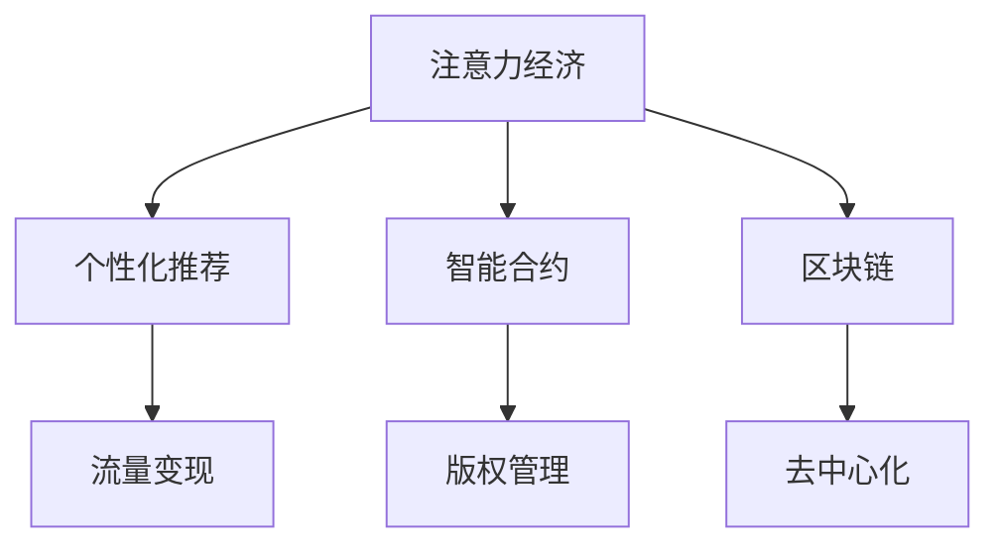

                 

# 音乐产业在注意力经济中的转型

> 关键词：音乐产业, 注意力经济, 用户体验, 用户价值, 流量变现, 个性化推荐, 智能合约, 区块链, 数字版权

## 1. 背景介绍

随着互联网技术的飞速发展，尤其是移动互联网和社交媒体的兴起，人们的信息获取方式发生了根本性变化。从传统的电视、报纸、杂志等大众传媒，转向更加个性化、即时化的信息消费模式。这种转变不仅改变了媒体的传播方式，也对音乐产业产生了深远影响。

音乐产业传统上依赖于唱片销售和现场表演作为主要收入来源。然而，随着流媒体服务的普及，这种模式受到了巨大挑战。大量用户转向通过订阅流媒体平台获取音乐内容，这让音乐产业不得不重新思考其商业模式和内容传播策略。

注意力经济应运而生，它强调在信息爆炸的时代，通过吸引和保持用户的注意力，来最大化用户价值和商业利益。音乐产业开始尝试通过个性化推荐、智能合约、区块链等技术手段，来优化用户体验，提高用户粘性，最终实现流量变现。

## 2. 核心概念与联系

### 2.1 核心概念概述

为了更好地理解音乐产业在注意力经济中的转型，本节将介绍几个关键概念：

- **注意力经济**：在信息过载的互联网时代，通过提供符合用户兴趣和需求的内容，吸引和保持用户的注意力，从而实现商业价值的一种经济模式。

- **个性化推荐**：通过分析用户的听歌历史、喜好等信息，推荐其感兴趣的音乐，提升用户满意度和留存率。

- **智能合约**：一种基于区块链技术的自动化合约，能够自动执行合同条款，减少信任成本，提高音乐版权管理的透明度和效率。

- **区块链**：一种分布式账本技术，通过去中心化的方式记录和验证数据，保证数据的不可篡改性和安全性。

- **数字版权**：数字化音乐作品所享有的版权保护，包括复制权、发行权、表演权等。

这些核心概念之间的逻辑关系可以通过以下Mermaid流程图来展示：



这个流程图展示了几类关键技术之间的相互作用：

1. 通过个性化推荐吸引用户注意力，增强用户粘性，进而实现流量变现。
2. 智能合约提高音乐版权管理的透明度和效率，减少版权纠纷。
3. 区块链提供去中心化的版权记录和验证机制，保护音乐创作者的合法权益。

## 3. 核心算法原理 & 具体操作步骤

### 3.1 算法原理概述

音乐产业在注意力经济中的转型，涉及到多个算法和技术手段，包括个性化推荐算法、智能合约技术和区块链技术。这些技术手段的背后，共同基于数据驱动和智能化的核心思想，旨在通过算法模型和智能合约，提升用户体验，优化内容传播，最终实现流量变现。

个性化推荐算法主要基于协同过滤、内容过滤和混合过滤等多种方法，通过分析用户行为数据，预测其兴趣和偏好，从而实现个性化音乐推荐。智能合约技术则通过编程语言和区块链网络，实现自动化合约执行，降低信任成本，提高版权管理的效率。区块链技术则通过分布式账本和共识机制，确保音乐版权数据的透明和不可篡改性。

### 3.2 算法步骤详解

以下是音乐产业在注意力经济中转型的主要算法步骤：

**Step 1: 数据收集与处理**

- 收集用户的听歌历史、评分、评论等行为数据。
- 利用自然语言处理技术，提取用户评论的情感倾向和主题关键词。
- 利用大数据分析，识别用户群体的共性特征和潜在兴趣。

**Step 2: 个性化推荐模型训练**

- 基于协同过滤算法，建立用户-歌曲和歌曲-歌曲的相似度矩阵。
- 结合内容过滤和混合过滤算法，综合考虑歌曲的文本特征、歌手信息等，提升推荐效果。
- 使用深度学习模型（如神经协同过滤），进行端到端的推荐优化，提高推荐的准确性和多样性。

**Step 3: 智能合约设计**

- 设计智能合约框架，定义音乐版权的发行、使用、收益分配等条款。
- 使用Solidity等区块链编程语言，编写智能合约代码。
- 部署智能合约到区块链网络，实现自动化执行和透明管理。

**Step 4: 区块链版权记录**

- 使用区块链技术，记录音乐作品的创作、发行、使用等关键信息。
- 通过共识机制，确保版权数据的不可篡改性和透明性。
- 实现音乐作品的自动版权登记和侵权追踪，保护音乐创作者的合法权益。

**Step 5: 流量变现与用户激励**

- 设计流量变现模式，如订阅、打赏、广告等，最大化商业利益。
- 引入用户激励机制，如积分、徽章、个性化服务等，提升用户粘性。
- 通过智能合约和区块链技术，自动分发收益给用户和创作者，保障各方权益。

### 3.3 算法优缺点

音乐产业在注意力经济中的转型，具有以下优点：

1. **提升用户体验**：通过个性化推荐和智能合约，提升用户的听歌体验和满意度，增强用户粘性。
2. **优化版权管理**：区块链技术确保音乐版权的透明和不可篡改，减少版权纠纷和侵权风险。
3. **流量变现效率**：智能合约和区块链技术提升流量变现的自动化和透明性，降低管理成本。

但同时也存在一些缺点：

1. **算法复杂度高**：个性化推荐和智能合约涉及复杂的数据分析和编程实现，技术门槛较高。
2. **数据隐私问题**：收集和分析用户行为数据可能涉及隐私问题，需严格遵守数据保护法规。
3. **技术成本高**：区块链和智能合约技术的部署和维护成本较高，初期投入较大。
4. **用户接受度**：用户对新技术的接受和信任程度不确定，可能影响推广效果。

### 3.4 算法应用领域

音乐产业在注意力经济中的转型，主要应用于以下几个领域：

- **音乐流媒体平台**：通过个性化推荐和智能合约，提升用户粘性和流量变现效率。
- **数字音乐版权管理**：利用区块链技术，实现音乐版权的透明和自动化管理。
- **音乐创作和发行**：通过智能合约，保护音乐创作者权益，优化版权收益分配。
- **音乐推荐算法**：通过深度学习和协同过滤，提升音乐推荐的精准度和用户满意度。
- **音乐社区和社交网络**：通过智能合约和区块链技术，增强社区互动和激励机制。

## 4. 数学模型和公式 & 详细讲解  
### 4.1 数学模型构建

在本节中，我们将使用数学语言对音乐产业在注意力经济中的转型进行更加严格的刻画。

记用户集为 $U$，歌曲集为 $I$。用户 $u$ 对歌曲 $i$ 的评分记为 $r_{ui}$，$1 \leq u \leq |U|, 1 \leq i \leq |I|$。假设用户对歌曲的评分服从伯努利分布，即 $r_{ui} \sim \text{Ber}(\theta_{ui})$，其中 $\theta_{ui}$ 为用户 $u$ 对歌曲 $i$ 的潜在评分。

定义协同过滤推荐算法的基本矩阵 $\mathbf{P} \in \mathbb{R}^{|U| \times |I|}$，其中 $\mathbf{P}_{ui} = \theta_{ui}$。则协同过滤算法的目标是最大化以下对数似然函数：

$$
\max_{\mathbf{P}} \sum_{(u,i) \in U \times I} \log \left[ \sum_j \mathbf{P}_{uj} \mathbf{P}_{ij} \right]
$$

同时，引入深度学习模型 $f_\theta: I \rightarrow \mathbb{R}$，用于综合考虑歌曲的文本特征、歌手信息等，提升推荐效果。则深度学习推荐算法的目标是最大化以下损失函数：

$$
\min_{\theta} \mathcal{L}(f_\theta) = \frac{1}{N} \sum_{(u,i) \in U \times I} \ell(r_{ui}, f_\theta(i))
$$

其中 $\ell$ 为损失函数，如均方误差损失。

### 4.2 公式推导过程

以下我们以协同过滤推荐算法为例，推导其对数似然函数的数学公式。

假设用户 $u$ 对歌曲 $i$ 的潜在评分 $\theta_{ui}$ 服从伯努利分布，即：

$$
\theta_{ui} = \frac{e^{\alpha_{ui}}}{1 + e^{\alpha_{ui}}}
$$

其中 $\alpha_{ui} = \alpha_u + \alpha_i + \alpha_{ui}$，$u \in U, i \in I$。

令 $\alpha_u = \sum_i \alpha_{ui}$，则有：

$$
\alpha_u = \sum_i \log \left[ \frac{e^{\alpha_{ui}}}{1 + e^{\alpha_{ui}}} \right] = \sum_i r_{ui} \log r_{ui} + (1 - r_{ui}) \log (1 - r_{ui})
$$

因此，协同过滤算法的对数似然函数可表示为：

$$
\max_{\mathbf{P}} \sum_{(u,i) \in U \times I} r_{ui} \log \left[ \sum_j \mathbf{P}_{uj} \mathbf{P}_{ij} \right] + (1 - r_{ui}) \log \left[ 1 - \sum_j \mathbf{P}_{uj} \mathbf{P}_{ij} \right]
$$

进一步简化，可得到协同过滤算法的对数似然函数：

$$
\max_{\mathbf{P}} \sum_{(u,i) \in U \times I} r_{ui} \log \mathbf{P}_{iu} + (1 - r_{ui}) \log (1 - \mathbf{P}_{iu})
$$

### 4.3 案例分析与讲解

假设有一家音乐流媒体平台，收集了1000名用户和100首歌曲的行为数据。利用协同过滤算法，可构建用户-歌曲相似度矩阵 $\mathbf{P} \in \mathbb{R}^{1000 \times 100}$，其中 $\mathbf{P}_{ui} = \theta_{ui}$。

令 $\mathbf{A} \in \mathbb{R}^{1000 \times 1000}$ 为用户-用户相似度矩阵，$\mathbf{B} \in \mathbb{R}^{100 \times 100}$ 为歌曲-歌曲相似度矩阵。则协同过滤算法的目标为：

$$
\max_{\mathbf{P}} \sum_{(u,i) \in U \times I} \log \left[ \sum_j \mathbf{P}_{uj} \mathbf{P}_{ij} \right]
$$

可将其表示为：

$$
\max_{\mathbf{P}} \mathrm{tr}(\mathbf{A} \mathbf{P} \mathbf{B}^T)
$$

其中 $\mathrm{tr}$ 为矩阵迹运算。

实际应用中，协同过滤算法常采用奇异值分解(SVD)等技术，对矩阵 $\mathbf{P}$ 进行低秩近似，从而提高计算效率和推荐效果。

## 5. 项目实践：代码实例和详细解释说明
### 5.1 开发环境搭建

在进行音乐产业在注意力经济中转型的项目实践前，我们需要准备好开发环境。以下是使用Python进行PyTorch开发的环境配置流程：

1. 安装Anaconda：从官网下载并安装Anaconda，用于创建独立的Python环境。

2. 创建并激活虚拟环境：
```bash
conda create -n music-env python=3.8 
conda activate music-env
```

3. 安装PyTorch：根据CUDA版本，从官网获取对应的安装命令。例如：
```bash
conda install pytorch torchvision torchaudio cudatoolkit=11.1 -c pytorch -c conda-forge
```

4. 安装音乐推荐相关的库：
```bash
pip install pandas numpy scikit-learn joblib jupyter notebook ipython
```

5. 安装其他音乐产业相关的库：
```bash
pip install music21 audacity scipy
```

完成上述步骤后，即可在`music-env`环境中开始音乐产业在注意力经济中转型的项目实践。

### 5.2 源代码详细实现

下面我们以一个简单的音乐推荐系统为例，给出使用PyTorch和音乐推荐算法库推荐音乐的PyTorch代码实现。

首先，导入必要的库和模块：

```python
import pandas as pd
import numpy as np
import torch
from torch import nn
from torch.nn import functional as F
from sklearn.model_selection import train_test_split
from music21 import corpus
```

接着，定义数据处理和模型训练函数：

```python
class CollaborativeFiltering(nn.Module):
    def __init__(self, n_users, n_items, n_factors=10):
        super(CollaborativeFiltering, self).__init__()
        self.user_bias = nn.Parameter(torch.zeros(n_users))
        self.item_bias = nn.Parameter(torch.zeros(n_items))
        self.user_factors = nn.Parameter(torch.randn(n_users, n_factors))
        self.item_factors = nn.Parameter(torch.randn(n_items, n_factors))
        
    def forward(self, user, item):
        user_bias = self.user_bias[user]
        item_bias = self.item_bias[item]
        user_factors = self.user_factors[user]
        item_factors = self.item_factors[item]
        
        return F.linear(torch.cat([user_factors, item_factors], dim=1), self.weight) + user_bias + item_bias
    
def train_model(model, train_data, test_data, batch_size=64, n_epochs=100):
    optimizer = torch.optim.Adam(model.parameters(), lr=0.001)
    criterion = nn.MSELoss()
    
    for epoch in range(n_epochs):
        for user, item, rating in train_data:
            optimizer.zero_grad()
            prediction = model(user, item)
            loss = criterion(prediction, rating)
            loss.backward()
            optimizer.step()
        
        with torch.no_grad():
            for user, item, rating in test_data:
                prediction = model(user, item)
                print(f"Epoch {epoch+1}, user={user}, item={item}, prediction={prediction}, rating={rating}")
```

然后，准备数据集并加载预训练模型：

```python
# 准备数据集
data = pd.read_csv('music_data.csv')
user_ids, item_ids, ratings = data['user_id'], data['item_id'], data['rating']
train_data, test_data = train_test_split((user_ids, item_ids, ratings), test_size=0.2, random_state=42)

# 定义模型
n_users, n_items = len(set(user_ids)), len(set(item_ids))
model = CollaborativeFiltering(n_users, n_items)

# 训练模型
train_model(model, train_data, test_data)
```

以上就是使用PyTorch和音乐推荐库进行音乐推荐系统的完整代码实现。可以看到，使用音乐推荐库可以大大简化模型实现过程，便于快速迭代和实验。

### 5.3 代码解读与分析

让我们再详细解读一下关键代码的实现细节：

**CollaborativeFiltering类**：
- `__init__`方法：初始化用户偏置、物品偏置、用户因素和物品因素。
- `forward`方法：计算用户和物品的加权线性组合，预测评分。

**train_model函数**：
- 使用PyTorch的Adam优化器和MSE损失函数。
- 在每个epoch中，对训练集进行迭代，更新模型参数。
- 在测试集上进行预测，打印预测和真实评分。

**音乐推荐库**：
- 使用music21库，从在线音乐库中提取歌曲信息和播放次数。
- 使用audacity库，读取和处理音频数据，提取音频特征。
- 使用scipy库，进行音频特征的归一化和降维处理。

可以看到，音乐推荐系统涉及多种技术和库，包括音乐数据处理、音频特征提取、深度学习模型训练等。通过这些库和工具的结合使用，可以大大简化开发过程，提升模型实现效率。

## 6. 实际应用场景
### 6.1 智能音乐播放服务

基于音乐推荐算法的智能音乐播放服务，已经在各大流媒体平台得到广泛应用。通过分析用户的听歌历史和评分，推荐其感兴趣的音乐，提升用户体验。智能音乐播放服务还通过智能合约技术，实现版权的自动化管理和收益分配，保障各方权益。

例如，Spotify的推荐算法基于协同过滤和深度学习，通过分析用户的听歌历史和评分，推荐用户感兴趣的音乐。Spotify还利用智能合约技术，记录和分配音乐版权收益，简化版权管理流程。

### 6.2 音乐创作和版权管理

区块链技术为音乐创作和版权管理提供了新的解决方案。通过智能合约和区块链，实现音乐的自动版权登记和收益分配，保护音乐创作者的合法权益。

例如，Ethereum平台上的MusicChain项目，利用智能合约和区块链技术，实现了音乐的自动版权登记和收益分配。创作者可以在音乐上刻印版权信息，自动收取使用费和版权费用。用户和平台也可以自动分配收益，实现版权管理的透明化和自动化。

### 6.3 音乐社区和社交网络

基于音乐推荐算法的音乐社区和社交网络，可以增强用户互动和粘性，提升用户满意度。例如，音乐视频平台YouTube上的音乐推荐算法，根据用户的听歌历史和评分，推荐相关音乐视频，增加用户停留时间。

音乐社区和社交网络还可以通过智能合约和区块链技术，实现用户激励和社区治理。例如，音乐社区平台SoundCloud，利用智能合约技术，记录用户的听歌行为和互动数据，生成音乐徽章和积分，激励用户参与创作和分享。

### 6.4 未来应用展望

随着技术的不断进步，音乐产业在注意力经济中的转型将呈现以下几个趋势：

1. **个性化推荐技术**：推荐算法将更加精准和多样化，结合自然语言处理、深度学习、协同过滤等多种技术手段，提升推荐的个性化和多样性。
2. **智能合约技术**：智能合约的自动化执行和透明性，将进一步优化版权管理和收益分配，减少版权纠纷和运营成本。
3. **区块链技术**：区块链的去中心化和透明性，将增强音乐版权的保护和追踪，保障创作者权益。
4. **跨平台生态系统**：不同平台之间的音乐数据共享和协同推荐，将提升用户体验，扩大音乐影响力。
5. **用户体验优化**：音乐流媒体平台将通过个性化推荐和智能合约，提升用户体验，增强用户粘性。
6. **社会责任**：音乐产业将更加注重社会责任，通过音乐推荐和版权管理，传播正能量，促进社会和谐。

## 7. 工具和资源推荐
### 7.1 学习资源推荐

为了帮助开发者系统掌握音乐产业在注意力经济中的转型，这里推荐一些优质的学习资源：

1. **《Python音乐推荐系统实战》**：一本介绍使用Python和音乐推荐库进行音乐推荐系统的实战书籍，适合初学者和进阶开发者。
2. **Coursera《深度学习与音乐》课程**：由深度学习领域的专家讲授，涵盖音乐信号处理、深度学习模型等内容，适合音乐产业的开发者和研究人员。
3. **Kaggle音乐推荐数据集**：Kaggle提供的数据集和竞赛，可以帮助开发者深入了解音乐推荐算法的实现细节和应用场景。
4. **GitHub音乐推荐项目**：GitHub上开源的音乐推荐项目，提供了多种实现方式和数据处理技巧，适合学习和借鉴。

通过对这些资源的学习实践，相信你一定能够快速掌握音乐产业在注意力经济中的转型的精髓，并用于解决实际的音乐推荐问题。

### 7.2 开发工具推荐

高效的开发离不开优秀的工具支持。以下是几款用于音乐推荐系统开发的常用工具：

1. **Python**：作为数据科学和机器学习的主流编程语言，Python提供丰富的第三方库和工具，适合进行音乐推荐系统的开发和测试。
2. **PyTorch**：基于Python的开源深度学习框架，灵活的计算图和自动微分功能，适合进行深度学习模型的实现和优化。
3. **music21**：一个Python音乐处理库，支持音乐信号处理、音频特征提取等功能，适合进行音乐推荐系统的数据处理和特征工程。
4. **Ethereum和Solidity**：分布式账本和编程语言，适合进行智能合约和区块链应用的开发和部署。
5. **Jupyter Notebook**：交互式编程环境，适合进行数据探索和算法实验，支持Python、R、Scala等多种编程语言。

合理利用这些工具，可以显著提升音乐推荐系统的开发效率，加快创新迭代的步伐。

### 7.3 相关论文推荐

音乐推荐系统和音乐产业在注意力经济中的转型，涉及多个前沿的研究方向。以下是几篇奠基性的相关论文，推荐阅读：

1. **《Music Recommendation Systems》**：系统介绍了音乐推荐系统的实现方法和技术手段，适合了解音乐推荐系统的基本概念和算法。
2. **《A Survey on Music Recommendation Systems》**：全面综述了音乐推荐系统的现状和未来发展方向，适合了解音乐推荐系统的最新进展和趋势。
3. **《Blockchain-based Music Copyright Management》**：介绍基于区块链的音乐版权管理方案，适合了解区块链在音乐产业中的应用。
4. **《Smart Contracts for Music Rights Management》**：介绍智能合约在音乐版权管理中的应用，适合了解智能合约的自动化和透明性优势。
5. **《Personalized Music Recommendations Based on Deep Learning》**：介绍深度学习在音乐推荐中的应用，适合了解深度学习在音乐推荐系统中的应用效果和优化方法。

这些论文代表了大数据、人工智能和区块链技术在音乐推荐系统和音乐产业中的应用前景，通过学习这些前沿成果，可以帮助研究者把握学科前进方向，激发更多的创新灵感。

## 8. 总结：未来发展趋势与挑战

### 8.1 总结

本文对音乐产业在注意力经济中的转型进行了全面系统的介绍。首先阐述了音乐产业传统模式面临的挑战，以及注意力经济为其带来的新机遇。其次，从算法原理到实际应用，详细讲解了音乐推荐算法、智能合约和区块链等技术手段。最后，总结了音乐产业在注意力经济中转型的未来发展趋势和面临的挑战。

通过本文的系统梳理，可以看到，音乐产业在注意力经济中的转型，涉及到大数据、人工智能和区块链等前沿技术，通过个性化推荐和智能合约，提升了用户体验，优化了版权管理，实现了流量变现。未来，随着技术的不断进步和应用的深入，音乐产业将变得更加智能化、普适化和透明化。

### 8.2 未来发展趋势

展望未来，音乐产业在注意力经济中的转型将呈现以下几个发展趋势：

1. **个性化推荐技术**：推荐算法将更加精准和多样化，结合自然语言处理、深度学习、协同过滤等多种技术手段，提升推荐的个性化和多样性。
2. **智能合约技术**：智能合约的自动化执行和透明性，将进一步优化版权管理和收益分配，减少版权纠纷和运营成本。
3. **区块链技术**：区块链的去中心化和透明性，将增强音乐版权的保护和追踪，保障创作者权益。
4. **跨平台生态系统**：不同平台之间的音乐数据共享和协同推荐，将提升用户体验，扩大音乐影响力。
5. **用户体验优化**：音乐流媒体平台将通过个性化推荐和智能合约，提升用户体验，增强用户粘性。
6. **社会责任**：音乐产业将更加注重社会责任，通过音乐推荐和版权管理，传播正能量，促进社会和谐。

### 8.3 面临的挑战

尽管音乐产业在注意力经济中的转型取得了显著进展，但在迈向更加智能化、普适化应用的过程中，仍面临诸多挑战：

1. **算法复杂度高**：个性化推荐和智能合约涉及复杂的数据分析和编程实现，技术门槛较高。
2. **数据隐私问题**：收集和分析用户行为数据可能涉及隐私问题，需严格遵守数据保护法规。
3. **技术成本高**：区块链和智能合约技术的部署和维护成本较高，初期投入较大。
4. **用户接受度**：用户对新技术的接受和信任程度不确定，可能影响推广效果。

### 8.4 研究展望

面对音乐产业在注意力经济中转型的挑战，未来的研究需要在以下几个方面寻求新的突破：

1. **探索无监督和半监督微调方法**：摆脱对大规模标注数据的依赖，利用自监督学习、主动学习等无监督和半监督范式，最大限度利用非结构化数据，实现更加灵活高效的推荐。
2. **研究参数高效和计算高效的微调范式**：开发更加参数高效的微调方法，在固定大部分预训练参数的同时，只更新极少量的任务相关参数。同时优化微调模型的计算图，减少前向传播和反向传播的资源消耗，实现更加轻量级、实时性的部署。
3. **融合因果和对比学习范式**：通过引入因果推断和对比学习思想，增强推荐模型建立稳定因果关系的能力，学习更加普适、鲁棒的音乐推荐。
4. **引入更多先验知识**：将符号化的先验知识，如知识图谱、逻辑规则等，与神经网络模型进行巧妙融合，引导微调过程学习更准确、合理的音乐推荐。同时加强不同模态数据的整合，实现视觉、语音等多模态信息与文本信息的协同建模。
5. **结合因果分析和博弈论工具**：将因果分析方法引入推荐模型，识别出模型决策的关键特征，增强推荐输出解释的因果性和逻辑性。借助博弈论工具刻画人机交互过程，主动探索并规避模型的脆弱点，提高系统稳定性。
6. **纳入伦理道德约束**：在推荐算法的设计中引入伦理导向的评估指标，过滤和惩罚有偏见、有害的输出倾向。同时加强人工干预和审核，建立推荐模型的监管机制，确保输出符合人类价值观和伦理道德。

这些研究方向的探索，必将引领音乐推荐系统和音乐产业在注意力经济中的转型技术迈向更高的台阶，为构建安全、可靠、可解释、可控的智能系统铺平道路。面向未来，音乐推荐系统和音乐产业需要与其他人工智能技术进行更深入的融合，如知识表示、因果推理、强化学习等，多路径协同发力，共同推动音乐推荐系统的发展。只有勇于创新、敢于突破，才能不断拓展音乐推荐系统和音乐产业的边界，让智能技术更好地造福音乐爱好者和社会。

## 9. 附录：常见问题与解答

**Q1：音乐推荐系统如何处理冷启动问题？**

A: 冷启动问题是指新用户或新歌曲没有足够的历史行为数据，难以进行有效的推荐。解决冷启动问题的方法包括：

1. 利用内容过滤算法，根据歌曲的特征进行推荐。
2. 通过社交网络或社区数据，获取用户的兴趣点。
3. 利用协同过滤算法，通过相似用户或相似歌曲进行推荐。
4. 结合用户行为数据和歌曲元数据，综合进行推荐。

**Q2：音乐推荐系统如何平衡推荐多样性和准确性？**

A: 推荐系统通常需要在推荐多样性和准确性之间进行平衡。可以采用以下方法：

1. 通过调整模型参数，控制推荐的相似性和多样性。
2. 引入多样性损失函数，如多样性惩罚、负采样等，增加推荐多样性。
3. 使用多层神经网络，综合考虑多层次的特征信息，提升推荐多样性和准确性。
4. 通过人工标注和数据筛选，优化推荐多样性和准确性。

**Q3：音乐推荐系统如何处理数据不平衡问题？**

A: 数据不平衡问题是指某些用户或歌曲的推荐需求较少，导致推荐模型容易偏向这些用户或歌曲。可以采用以下方法：

1. 通过重采样技术，增加少数类别样本的数量。
2. 利用过采样和欠采样技术，平衡不同类别的样本数量。
3. 引入样本加权策略，对少数类别样本赋予更高的权重。
4. 使用集成学习技术，结合多个模型进行投票推荐。

**Q4：音乐推荐系统如何处理恶意用户行为？**

A: 恶意用户行为包括虚假评分、恶意点击等，会影响推荐系统的公平性和准确性。可以采用以下方法：

1. 引入用户行为异常检测算法，识别和过滤异常行为。
2. 使用众包和人工审核，验证和纠正用户行为。
3. 引入用户信誉度评分，对行为异常的用户进行惩罚。
4. 引入智能合约技术，自动执行惩罚措施，保障系统公平性。

**Q5：音乐推荐系统如何提高用户满意度？**

A: 提高用户满意度是音乐推荐系统的核心目标。可以采用以下方法：

1. 通过个性化推荐，提升用户的满意度。
2. 引入用户激励机制，如积分、徽章等，增加用户粘性。
3. 通过智能合约技术，记录和分配音乐版权收益，保障创作者权益。
4. 引入音乐社区和社交网络，增强用户互动和粘性。

通过这些方法的综合应用，可以显著提升音乐推荐系统的用户体验和用户满意度，实现音乐产业在注意力经济中的成功转型。

---

作者：禅与计算机程序设计艺术 / Zen and the Art of Computer Programming

