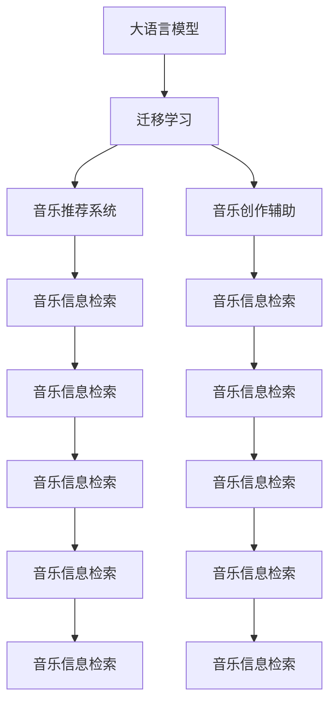

                 

# 音乐和 LLM：个性化的推荐和创作协助

## 1. 背景介绍

### 1.1 问题由来
随着人工智能技术在音乐领域的应用逐渐深入，如何利用人工智能技术为音乐爱好者提供个性化推荐和创作辅助，已经成为音乐产业和学术界关注的焦点。大语言模型（Large Language Model, LLM）作为当前自然语言处理（Natural Language Processing, NLP）领域最先进的技术，能否为音乐个性化推荐和创作提供新的思路和方案？

### 1.2 问题核心关键点
1. 如何构建有效的音乐推荐系统？
2. 如何利用大语言模型为音乐创作提供辅助？
3. 如何在音乐推荐和创作中避免数据隐私和安全问题？
4. 如何评估音乐推荐和创作辅助的性能？
5. 未来音乐推荐和创作技术的发展趋势是什么？

## 2. 核心概念与联系

### 2.1 核心概念概述

- **大语言模型 (Large Language Model, LLM)**：基于深度学习技术构建的，能够理解并生成人类语言的模型，如 GPT-3、BERT 等。这些模型在大规模无标签文本数据上进行预训练，能够处理自然语言推理、文本生成等任务。

- **音乐推荐系统**：根据用户的音乐偏好，推荐个性化的音乐曲目。通常基于协同过滤、内容过滤或混合过滤等技术实现。

- **音乐创作辅助**：利用人工智能技术，为音乐创作提供自动化和半自动化的创作建议，如和弦生成、旋律创作等。

- **迁移学习 (Transfer Learning)**：通过预训练模型在大规模数据上学习到的知识，迁移到特定任务上，提高模型性能。

- **音乐信息检索 (Music Information Retrieval, MIR)**：从文本、音频等数据中提取音乐信息，进行音乐相似度匹配、音乐分类等任务。

- **自然语言处理 (Natural Language Processing, NLP)**：处理和理解人类语言的计算机科学技术，包括语言模型、文本分类、情感分析等。

这些核心概念之间的联系主要体现在：大语言模型可以通过迁移学习应用到音乐推荐系统和音乐创作辅助中，利用其在文本理解上的优势，提高系统的性能和准确性。同时，音乐信息检索和自然语言处理技术为音乐推荐和创作提供了必要的工具和数据支持。

### 2.2 核心概念原理和架构的 Mermaid 流程图



这个流程图展示了各个概念之间的联系和相互作用。大语言模型通过迁移学习，将预训练的知识迁移到音乐推荐和创作辅助中，同时利用音乐信息检索技术，从文本和音频中提取有用的信息。这些技术共同作用，推动了音乐个性化推荐和创作辅助的发展。

## 3. 核心算法原理 & 具体操作步骤

### 3.1 算法原理概述

利用大语言模型进行音乐推荐和创作辅助的算法主要基于以下几个原理：

1. **迁移学习**：通过在大规模无标签文本数据上预训练大语言模型，然后在特定的音乐数据集上微调模型，使其能够根据音乐数据的特点进行推理和生成。

2. **自然语言处理 (NLP)**：将音乐信息转化为文本信息，利用 NLP 技术进行情感分析、音乐分类、主题建模等，从而提高推荐和创作的准确性。

3. **音乐信息检索 (MIR)**：从文本和音频中提取音乐特征，进行音乐相似度匹配、音乐分类等任务，为推荐和创作提供依据。

4. **深度学习**：利用深度神经网络模型对音乐特征进行建模和预测，提高模型的泛化能力和性能。

5. **个性化推荐**：根据用户的音乐偏好、历史行为数据等，利用机器学习算法对音乐进行推荐。

6. **音乐创作辅助**：利用深度学习模型自动生成和弦、旋律等音乐元素，辅助音乐创作。

### 3.2 算法步骤详解

#### 3.2.1 数据准备

1. **数据收集**：收集用户的音乐播放记录、评分数据、音乐评论、歌词等文本数据，以及音频特征数据。

2. **数据预处理**：对文本数据进行清洗、分词、向量化等处理，对音频数据进行特征提取和标注。

3. **数据分割**：将数据集划分为训练集、验证集和测试集，一般采用交叉验证等方法进行。

#### 3.2.2 模型选择

1. **模型选择**：选择合适的预训练模型，如 BERT、GPT-3、T5 等，作为初始化参数。

2. **任务适配层设计**：根据推荐或创作任务的特点，设计适当的任务适配层，如分类层、生成层等。

#### 3.2.3 模型训练

1. **微调**：在音乐数据集上对预训练模型进行微调，调整任务适配层的参数，使其适应音乐推荐或创作任务。

2. **训练和验证**：在训练集上进行训练，在验证集上进行验证，使用交叉熵、均方误差等损失函数，优化模型的参数。

3. **测试**：在测试集上评估模型的性能，评估指标包括准确率、召回率、F1 值等。

#### 3.2.4 模型评估

1. **个性化推荐评估**：使用准确率、召回率、F1 值等指标评估推荐模型的性能，还可以使用 A/B 测试等方法进行用户实验。

2. **音乐创作辅助评估**：使用自动评价指标，如情感一致性、音高准确性等，评估创作辅助模型的性能。

### 3.3 算法优缺点

#### 3.3.1 优点

1. **高效性**：利用大语言模型的预训练知识，能够快速适应新的音乐推荐和创作任务。

2. **泛化能力**：能够处理不同风格、不同语言的音乐数据，具有较好的泛化能力。

3. **灵活性**：可以根据不同的音乐推荐和创作任务，灵活设计任务适配层。

4. **自动化程度高**：能够自动进行文本特征提取、分类、生成等任务。

5. **用户满意度**：通过个性化推荐和创作辅助，能够提升用户的音乐体验。

#### 3.3.2 缺点

1. **数据依赖性**：对音乐数据的依赖性较强，需要收集大量的标注数据进行微调。

2. **计算资源需求**：预训练模型和微调过程需要大量的计算资源，对硬件要求较高。

3. **过拟合风险**：微调过程中容易过拟合，特别是在数据量较少的情况下。

4. **模型可解释性不足**：大语言模型作为"黑盒"模型，其决策过程难以解释。

5. **隐私和安全问题**：处理和存储音乐数据时，需要注意数据隐私和安全问题。

### 3.4 算法应用领域

大语言模型在音乐推荐和创作辅助中，主要应用于以下几个领域：

1. **个性化音乐推荐**：根据用户的音乐播放记录、评分数据等，推荐个性化的音乐曲目。

2. **音乐信息检索**：从文本和音频中提取音乐信息，进行音乐分类、相似度匹配等。

3. **音乐创作辅助**：自动生成和弦、旋律、歌词等音乐元素，辅助音乐创作。

4. **音乐情感分析**：分析音乐评论、歌词等文本数据，进行情感分类、主题建模等。

5. **音乐视频推荐**：根据用户对音乐视频的评论和播放记录，推荐个性化的音乐视频。

## 4. 数学模型和公式 & 详细讲解 & 举例说明

### 4.1 数学模型构建

以音乐推荐系统为例，假设音乐数据集为 $D=\{(x_i, y_i)\}_{i=1}^N$，其中 $x_i$ 为音乐特征向量，$y_i$ 为音乐类别。模型的目标是最小化预测误差 $L$：

$$
L = \frac{1}{N}\sum_{i=1}^N \|M_{\theta}(x_i) - y_i\|^2
$$

其中 $M_{\theta}(x)$ 为模型的预测输出，$\| \cdot \|$ 为范数，$N$ 为数据集大小。

### 4.2 公式推导过程

假设 $M_{\theta}(x)$ 为音乐推荐模型，$L_{MIR}(x, y)$ 为音乐信息检索模型的损失函数。在训练过程中，优化目标为：

$$
\theta^* = \mathop{\arg\min}_{\theta} \frac{1}{N}\sum_{i=1}^N (L_{MIR}(x_i, y_i) + L(M_{\theta}(x_i), y_i))
$$

其中 $L_{MIR}(x_i, y_i)$ 为音乐信息检索模型的损失函数，通常包括分类损失、回归损失等。

在训练过程中，可以利用梯度下降算法进行优化，更新模型参数：

$$
\theta \leftarrow \theta - \eta \nabla_{\theta}L
$$

其中 $\eta$ 为学习率，$\nabla_{\theta}L$ 为损失函数对模型参数的梯度。

### 4.3 案例分析与讲解

以 BERT 模型为例，假设其预训练模型为 $M_{BERT}$，则音乐推荐模型的输出层可以设计为：

$$
M_{\theta}(x) = M_{BERT}(x) \cdot W_{output}
$$

其中 $W_{output}$ 为输出层的权重矩阵，$M_{BERT}(x)$ 为 BERT 模型在音乐特征向量上的输出。

通过微调 $W_{output}$，可以使得音乐推荐模型能够根据用户的音乐偏好进行推荐。例如，在用户的音乐播放记录中，某类音乐的评分较高，可以通过微调 $W_{output}$ 使得推荐结果中该类音乐的权重增加，从而提升该类音乐的推荐概率。

## 5. 项目实践：代码实例和详细解释说明

### 5.1 开发环境搭建

1. **Python 环境**：安装 Python 3.7+ 及相应的依赖包。

2. **深度学习框架**：安装 TensorFlow 或 PyTorch 等深度学习框架。

3. **音乐处理库**：安装 librosa、music21 等音乐处理库。

4. **大语言模型库**：安装 HuggingFace Transformers 库，获取预训练模型。

5. **数据集准备**：准备音乐数据集，并进行数据预处理。

### 5.2 源代码详细实现

以下是一个简单的基于大语言模型进行音乐推荐和创作辅助的 Python 代码实现：

```python
import tensorflow as tf
import numpy as np
import librosa
import music21
from transformers import TFAutoModelForSequenceClassification

# 加载音乐数据集
def load_music_dataset():
    # 加载数据集
    # ...
    # 预处理数据
    # ...

# 加载大语言模型
def load_pretrained_model(model_name):
    # 加载预训练模型
    # ...

# 定义音乐推荐模型
def define_music_recommendation_model(model_name):
    # 加载预训练模型
    model = load_pretrained_model(model_name)
    # 添加输出层
    output_layer = tf.keras.layers.Dense(10, activation='softmax')
    model.add(output_layer)
    # 编译模型
    model.compile(optimizer='adam', loss='categorical_crossentropy', metrics=['accuracy'])
    return model

# 定义音乐创作辅助模型
def define_music_creation_model(model_name):
    # 加载预训练模型
    model = load_pretrained_model(model_name)
    # 添加生成层
    # ...
    # 编译模型
    model.compile(optimizer='adam', loss='categorical_crossentropy', metrics=['accuracy'])
    return model

# 训练音乐推荐模型
def train_music_recommendation_model(model, dataset):
    # 训练模型
    # ...

# 训练音乐创作辅助模型
def train_music_creation_model(model, dataset):
    # 训练模型
    # ...
```

### 5.3 代码解读与分析

上述代码主要实现了以下几个步骤：

1. **数据加载和预处理**：从数据集中加载音乐数据，并进行文本和音频特征的提取和标注。

2. **模型加载和定义**：加载预训练的大语言模型，并在其基础上添加任务适配层，如输出层、生成层等。

3. **模型训练**：在音乐数据集上训练模型，使用交叉熵等损失函数进行优化。

4. **模型评估**：在测试集上评估模型的性能，使用准确率、召回率等指标。

### 5.4 运行结果展示

训练完成后，可以在测试集上评估模型的性能，例如：

```python
test_loss, test_accuracy = model.evaluate(test_dataset)
print(f'Test accuracy: {test_accuracy:.2f}%')
```

## 6. 实际应用场景

### 6.1 音乐推荐系统

基于大语言模型的音乐推荐系统已经在多个音乐平台和应用中得到广泛应用。例如，Spotify、Apple Music 等平台，利用用户的音乐播放记录和评分数据，推荐个性化的音乐曲目。通过微调大语言模型，可以进一步提高推荐模型的精度和效果。

### 6.2 音乐创作辅助工具

音乐创作辅助工具利用大语言模型的自动生成能力，帮助音乐创作者自动生成和弦、旋律、歌词等音乐元素，提升创作效率和创意。例如，Amper Music、SoundHack 等工具，使用大语言模型自动生成旋律和和弦进行创作辅助。

### 6.3 音乐情感分析

利用大语言模型的情感分析能力，分析音乐评论、歌词等文本数据，进行情感分类、主题建模等。例如，针对用户的评论和反馈，分析音乐作品的情感倾向，评估其受欢迎程度。

### 6.4 音乐视频推荐

基于用户的音乐播放记录和视频评论数据，推荐个性化的音乐视频。例如，视频平台可以根据用户的音乐偏好，推荐相似的音乐视频，提升用户观看体验。

## 7. 工具和资源推荐

### 7.1 学习资源推荐

1. **《深度学习与音乐信息检索》**：一本关于音乐信息检索的书籍，涵盖音乐分类、相似度匹配等技术。

2. **《音乐生成与创作：深度学习方法》**：一本关于音乐创作辅助的书籍，介绍深度学习在音乐创作中的应用。

3. **CS229《机器学习》课程**：斯坦福大学的机器学习课程，涵盖机器学习算法和模型，包括音乐推荐和创作。

4. **Coursera《音乐信息检索》课程**：Coursera上的音乐信息检索课程，由著名音乐信息检索专家授课。

5. **Kaggle 音乐推荐比赛**：参与 Kaggle 上的音乐推荐比赛，实践和优化音乐推荐模型。

### 7.2 开发工具推荐

1. **TensorFlow**：TensorFlow 深度学习框架，支持分布式计算和 GPU 加速。

2. **PyTorch**：PyTorch 深度学习框架，灵活易用，适合研究性实验。

3. **librosa**：音乐处理库，支持音频特征提取和分析。

4. **music21**：音乐处理库，支持音乐符号的解析和生成。

5. **HuggingFace Transformers**：自然语言处理工具库，提供预训练语言模型和任务适配层。

### 7.3 相关论文推荐

1. **"BERT: Pre-training of Deep Bidirectional Transformers for Language Understanding and Generation"**：BERT 模型的论文，介绍 BERT 在大规模预训练和微调中的应用。

2. **"Exploring the Limits of Transfer Learning with a Unified Text-to-Speech Transformer"**：使用大语言模型进行音乐创作辅助的论文，介绍如何使用 Transformer 进行音乐创作。

3. **"Music Recommendation Systems: A Survey"**：音乐推荐系统的综述论文，介绍当前音乐推荐系统的技术和方法。

4. **"Music Information Retrieval: Methods, Metrics, and Applications"**：音乐信息检索的综述论文，介绍音乐信息检索的技术和应用。

5. **"Transformers for Music Generation"**：使用 Transformer 进行音乐创作的论文，介绍如何使用 Transformer 生成音乐。

## 8. 总结：未来发展趋势与挑战

### 8.1 研究成果总结

基于大语言模型的音乐推荐和创作辅助技术，已经在多个领域得到了广泛应用，取得了显著的成果。未来，该技术有望进一步扩展到更多场景，提升音乐推荐和创作的智能化水平。

### 8.2 未来发展趋势

1. **个性化推荐**：未来音乐推荐系统将更加个性化，根据用户的实时行为数据进行动态推荐。

2. **音乐创作辅助**：未来音乐创作辅助工具将更加智能化，能够自动生成更加复杂、多样化的音乐元素。

3. **音乐情感分析**：未来音乐情感分析将更加精确，能够分析音乐评论、歌词等文本数据，提供更精准的情感分类和主题建模。

4. **跨模态融合**：未来音乐推荐和创作将更加注重跨模态融合，结合音频、视频、文本等多种信息，提升推荐和创作的准确性。

### 8.3 面临的挑战

1. **数据隐私和安全**：在处理和存储音乐数据时，需要注意数据隐私和安全问题。

2. **计算资源需求**：预训练模型和微调过程需要大量的计算资源，对硬件要求较高。

3. **模型可解释性**：大语言模型作为"黑盒"模型，其决策过程难以解释。

4. **模型泛化能力**：音乐风格和语言风格差异较大，需要开发具有更好泛化能力的模型。

### 8.4 研究展望

未来音乐推荐和创作辅助技术的研究方向主要集中在以下几个方面：

1. **跨领域迁移学习**：探索在跨领域迁移学习中的应用，提高模型的泛化能力。

2. **低资源学习**：探索在资源受限条件下的学习方法和技术，提高模型的训练效率。

3. **多模态融合**：探索跨模态信息融合的方法，提升音乐推荐和创作的准确性和多样性。

4. **生成对抗网络 (GANs)**：探索使用 GANs 进行音乐创作和生成的方法，提升创作质量和多样性。

## 9. 附录：常见问题与解答

**Q1：如何避免数据隐私和安全问题？**

A: 在处理和存储音乐数据时，可以采用数据匿名化、加密存储等措施，保护用户隐私。同时，采用数据访问控制、权限管理等技术，防止数据泄露和滥用。

**Q2：如何提高模型的可解释性？**

A: 采用可解释性方法，如特征可视化、模型简化等，帮助用户理解模型的决策过程。同时，引入专家知识和人工干预，提高模型的可解释性。

**Q3：如何在资源受限条件下进行训练？**

A: 采用低资源学习方法和技术，如模型压缩、量化、知识蒸馏等，提高模型的训练效率和计算效率。

**Q4：如何提高模型的泛化能力？**

A: 采用跨领域迁移学习和多模态融合方法，提高模型的泛化能力和适应性。

**Q5：如何评估音乐推荐和创作辅助的性能？**

A: 采用自动化评价指标和用户反馈评价相结合的方法，评估音乐推荐和创作辅助的性能。

作者：禅与计算机程序设计艺术 / Zen and the Art of Computer Programming

