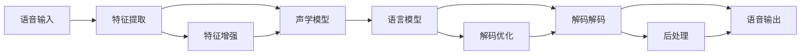

                 

# 音频信号处理：语音识别与合成技术

## 1. 背景介绍

### 1.1 问题由来
随着智能手机、智能音箱、车载设备等智能终端的普及，音频信号处理技术（尤其是语音识别与合成）已经成为现代通信与交互的核心。语音识别技术让机器能够听懂人类的自然语言，为智能设备提供了强大的交互能力。语音合成技术则让机器能够模拟人类的语音输出，使得交互更加自然流畅。

在过去几十年中，语音识别和合成技术经历了从基于规则、统计模型到深度学习的巨大变革。从HMM（隐马尔可夫模型）到DNN（深度神经网络），再到当前主流的Transformer模型，技术不断发展，性能不断提升。

然而，这些技术的实现仍然面临诸多挑战。例如，如何提高语音识别的鲁棒性和准确性，如何减少语音合成的发音缺陷，如何适应多样化的语音风格和口音，如何确保语音交互的自然性和流畅性等。本文将深入探讨这些核心问题，并提出一些可能的解决方案。

## 2. 核心概念与联系

### 2.1 核心概念概述

本节将介绍语音识别与合成技术的核心概念，并简要阐述它们之间的联系。

- **语音识别（Automatic Speech Recognition, ASR）**：指将人类语音转换为文本的过程。核心任务包括语音特征提取、声学模型训练、语言模型训练、解码解码等步骤。

- **语音合成（Text-to-Speech, TTS）**：指将文本转换为语音输出的过程。核心任务包括文本预处理、声学模型训练、语音合成器设计、后处理等步骤。

- **声学模型（Acoustic Model）**：用于描述语音信号与文本序列之间的映射关系。声学模型可以基于传统的统计模型（如GMM-HMM）或深度学习模型（如CNN、RNN、Transformer）。

- **语言模型（Language Model）**：用于描述文本序列之间的概率分布。语言模型可以基于传统的统计模型（如N-gram模型）或深度学习模型（如RNN、LSTM、Transformer）。

- **端到端模型（End-to-End Model）**：直接将声学模型与语言模型集成到一个神经网络中，端到端模型可以进一步提高识别和合成的精度。

这些概念之间的联系主要体现在它们共同构成了语音识别与合成的完整流程。语音识别和语音合成技术相互依存，共同实现人机交互的自然化与智能化。

### 2.2 核心概念原理和架构的 Mermaid 流程图



这张流程图展示了语音识别与合成的主要步骤和关键组件。语音信号首先经过特征提取，然后输入到声学模型中进行特征匹配和识别。识别结果通过语言模型进行语言概率计算，最终通过解码解码和后处理输出语音信号。

## 3. 核心算法原理 & 具体操作步骤

### 3.1 算法原理概述

语音识别与合成的核心算法可以归纳为以下两个主要步骤：

1. **语音特征提取**：将原始语音信号转换为特征表示，以便模型处理。
2. **语音建模**：使用声学模型和语言模型对特征表示进行建模，从而实现语音识别或合成。

### 3.2 算法步骤详解

#### 3.2.1 语音特征提取

语音信号的特征提取是语音处理的基础。常见的特征提取方法包括MFCC（Mel-Frequency Cepstral Coefficients）和MFCC衍生方法，以及更先进的特征提取技术，如深度学习特征提取方法。

- **MFCC特征提取**：将语音信号经过预加重、分帧、加窗、快速傅里叶变换（FFT）等步骤，得到频谱图，再计算梅尔频率倒谱系数（MFCC）。MFCC特征能够捕捉语音信号中的频谱结构，适用于大多数语音识别和合成任务。

- **深度学习特征提取**：使用卷积神经网络（CNN）、卷积变换网络（ConvTasNet）等模型，直接在原始语音信号上进行端到端特征提取。这种方法能够更好地捕捉语音信号的时频特征，适用于复杂任务。

#### 3.2.2 声学模型训练

声学模型的训练通常包括两个步骤：特征训练和声学模型训练。

- **特征训练**：将特征提取后的语音信号输入到声学模型中进行训练。常见的特征训练方法包括混合高斯模型（GMM）、隐马尔可夫模型（HMM）、深度神经网络（DNN）和Transformer等。

- **声学模型训练**：使用标注数据对声学模型进行训练。训练过程通常包括前向传播、损失计算、反向传播和参数更新等步骤。常见的声学模型包括HMM、DNN、RNN、LSTM和Transformer等。

#### 3.2.3 语言模型训练

语言模型用于预测给定文本序列的概率分布。常见的语言模型包括N-gram模型、RNN语言模型、LSTM语言模型和Transformer语言模型。

- **N-gram模型**：使用N个相邻单词或字符的概率来预测下一个单词或字符。

- **RNN语言模型**：使用递归神经网络（RNN）来建模单词序列的上下文关系。

- **LSTM语言模型**：使用长短期记忆网络（LSTM）来处理长期依赖关系。

- **Transformer语言模型**：使用自注意力机制来建模单词序列的上下文关系。

#### 3.2.4 解码解码

解码解码是语音识别和合成的最后一步，即将声学模型的输出映射为最终的文本或语音信号。

- **语音识别解码**：使用语言模型和声学模型对输入特征进行解码，输出最终的文本序列。常见的解码算法包括贪心解码、束搜索解码和基于深度学习的解码算法。

- **语音合成解码**：使用声学模型和语言模型对输入文本进行解码，输出最终的语音信号。常见的解码算法包括线性插值、基于深度学习的生成模型等。

### 3.3 算法优缺点

#### 3.3.1 声学模型的优缺点

- **优点**：
  - **准确性**：深度学习声学模型（如CNN、RNN、Transformer）能够捕捉复杂的语音特征，提高识别的准确性。
  - **泛化能力**：深度学习声学模型具有较强的泛化能力，能够适应不同的语音场景和口音。

- **缺点**：
  - **计算资源需求高**：深度学习声学模型需要大量的计算资源和存储空间，训练和推理速度较慢。
  - **易过拟合**：深度学习声学模型容易过拟合，尤其是在标注数据不足的情况下。

#### 3.3.2 语言模型的优缺点

- **优点**：
  - **预测能力**：语言模型能够准确预测文本序列的概率分布，提高识别的准确性。
  - **适用性**：语言模型适用于各种语音识别和合成任务，能够适应不同的语言和方言。

- **缺点**：
  - **计算复杂度**：语言模型计算复杂度较高，尤其是在深度学习模型（如Transformer）的情况下。
  - **训练数据需求**：语言模型需要大量的标注数据进行训练，标注数据获取成本较高。

#### 3.3.3 端到端模型的优缺点

- **优点**：
  - **高效性**：端到端模型能够减少特征提取和解码步骤，提高识别和合成的效率。
  - **精度高**：端到端模型能够直接学习语音信号和文本序列之间的映射关系，提高识别的精度。

- **缺点**：
  - **复杂性**：端到端模型较为复杂，训练和优化难度较大。
  - **模型大小**：端到端模型通常较大，需要大量的计算资源和存储空间。

### 3.4 算法应用领域

语音识别和合成技术已经广泛应用于多个领域，例如：

- **智能助手**：语音识别和合成技术使得智能助手能够自然地与用户交互，提供语音控制的智能家居、智能车载等服务。
- **电话客服**：语音识别和合成技术使得电话客服能够自动接听和处理用户的语音指令，提高服务效率和用户体验。
- **语音翻译**：语音识别和合成技术使得语音翻译系统能够实时进行口语音频的转换，提供便捷的语言翻译服务。
- **医疗诊断**：语音识别和合成技术使得医疗设备能够自动记录和转录医生的语音诊断，提高医疗诊断的效率和准确性。
- **娱乐与游戏**：语音识别和合成技术使得虚拟角色能够自然地与用户进行语音互动，提供沉浸式的游戏和娱乐体验。

## 4. 数学模型和公式 & 详细讲解 & 举例说明

### 4.1 数学模型构建

#### 4.1.1 声学模型

声学模型可以基于传统的统计模型（如GMM-HMM）或深度学习模型（如CNN、RNN、Transformer）。以基于深度学习的声学模型为例，其基本数学模型可以表示为：

$$ y_t = \sum_{k=1}^K w_k f(x_t;\theta_k) + b $$
$$ p(y|x;\theta) = \prod_{t=1}^T p(y_t|y_{t-1},x_t;\theta) $$
$$ p(y|x;\theta) = \prod_{t=1}^T p(y_t|y_{t-1},x_t;\theta) $$

其中，$y_t$表示第$t$帧语音信号的特征向量，$f(x_t;\theta_k)$表示第$t$帧特征的映射函数，$\theta_k$表示第$k$个神经网络模型的参数。$p(y|x;\theta)$表示声学模型的概率分布，$w_k$和$b$表示神经网络的权重和偏置。

#### 4.1.2 语言模型

语言模型可以基于传统的统计模型（如N-gram模型）或深度学习模型（如RNN语言模型、LSTM语言模型和Transformer语言模型）。以基于深度学习的语言模型为例，其基本数学模型可以表示为：

$$ p(y|x;\theta) = \prod_{t=1}^T p(y_t|y_{t-1},x_t;\theta) $$

其中，$y_t$表示第$t$个单词或字符，$p(y_t|y_{t-1},x_t;\theta)$表示给定前一个单词或字符和当前输入特征的情况下，下一个单词或字符的条件概率分布，$\theta$表示语言模型的参数。

#### 4.1.3 端到端模型

端到端模型的基本数学模型可以表示为：

$$ p(y|x;\theta) = \prod_{t=1}^T p(y_t|y_{t-1},x_t;\theta) $$

其中，$y_t$表示第$t$个单词或字符，$p(y_t|y_{t-1},x_t;\theta)$表示给定前一个单词或字符和当前输入特征的情况下，下一个单词或字符的条件概率分布，$\theta$表示端到端模型的参数。

### 4.2 公式推导过程

#### 4.2.1 声学模型公式推导

以基于深度学习的声学模型为例，其训练过程可以表示为：

1. **前向传播**：
$$ y_t = \sum_{k=1}^K w_k f(x_t;\theta_k) + b $$

2. **损失函数计算**：
$$ L = \frac{1}{N} \sum_{i=1}^N \sum_{t=1}^T \log p(y_t|y_{t-1},x_t;\theta) $$

3. **反向传播**：
$$ \frac{\partial L}{\partial \theta_k} = \sum_{i=1}^N \sum_{t=1}^T \frac{\partial \log p(y_t|y_{t-1},x_t;\theta)}{\partial \theta_k} \nabla_{x_t}f(x_t;\theta_k) + \frac{\partial b}{\partial \theta_k} $$

4. **参数更新**：
$$ \theta_k \leftarrow \theta_k - \eta \frac{\partial L}{\partial \theta_k} $$

其中，$\eta$表示学习率，$N$表示训练样本数，$T$表示序列长度。

#### 4.2.2 语言模型公式推导

以基于深度学习的语言模型为例，其训练过程可以表示为：

1. **前向传播**：
$$ p(y|x;\theta) = \prod_{t=1}^T p(y_t|y_{t-1},x_t;\theta) $$

2. **损失函数计算**：
$$ L = \frac{1}{N} \sum_{i=1}^N \sum_{t=1}^T -\log p(y_t|y_{t-1},x_t;\theta) $$

3. **反向传播**：
$$ \frac{\partial L}{\partial \theta} = \sum_{i=1}^N \sum_{t=1}^T \frac{\partial -\log p(y_t|y_{t-1},x_t;\theta)}{\partial \theta} \nabla_{x_t}f(x_t;\theta) $$

4. **参数更新**：
$$ \theta \leftarrow \theta - \eta \frac{\partial L}{\partial \theta} $$

其中，$\eta$表示学习率，$N$表示训练样本数，$T$表示序列长度。

#### 4.2.3 端到端模型公式推导

以基于深度学习的端到端模型为例，其训练过程可以表示为：

1. **前向传播**：
$$ p(y|x;\theta) = \prod_{t=1}^T p(y_t|y_{t-1},x_t;\theta) $$

2. **损失函数计算**：
$$ L = \frac{1}{N} \sum_{i=1}^N \sum_{t=1}^T -\log p(y_t|y_{t-1},x_t;\theta) $$

3. **反向传播**：
$$ \frac{\partial L}{\partial \theta} = \sum_{i=1}^N \sum_{t=1}^T \frac{\partial -\log p(y_t|y_{t-1},x_t;\theta)}{\partial \theta} \nabla_{x_t}f(x_t;\theta) $$

4. **参数更新**：
$$ \theta \leftarrow \theta - \eta \frac{\partial L}{\partial \theta} $$

其中，$\eta$表示学习率，$N$表示训练样本数，$T$表示序列长度。

### 4.3 案例分析与讲解

#### 4.3.1 声学模型案例

以基于深度学习的声学模型为例，其训练过程可以表示为：

1. **特征提取**：将语音信号进行MFCC特征提取，得到特征向量$x_t$。

2. **声学模型训练**：将特征向量$x_t$输入到深度神经网络（DNN）中进行训练，得到声学模型参数$\theta$。

3. **特征训练**：将声学模型参数$\theta$和特征向量$x_t$进行训练，得到特征训练参数$w_k$和$b$。

4. **解码解码**：将输入特征向量$x_t$输入到声学模型中进行解码，输出文本序列$y_t$。

#### 4.3.2 语言模型案例

以基于深度学习的语言模型为例，其训练过程可以表示为：

1. **特征提取**：将文本序列进行TF-IDF特征提取，得到特征向量$x_t$。

2. **语言模型训练**：将特征向量$x_t$输入到深度神经网络（DNN）中进行训练，得到语言模型参数$\theta$。

3. **特征训练**：将语言模型参数$\theta$和特征向量$x_t$进行训练，得到特征训练参数$w_k$和$b$。

4. **解码解码**：将输入特征向量$x_t$输入到语言模型中进行解码，输出文本序列$y_t$。

## 5. 项目实践：代码实例和详细解释说明

### 5.1 开发环境搭建

在进行语音识别与合成项目开发前，我们需要准备好开发环境。以下是使用Python进行TensorFlow开发的环境配置流程：

1. 安装Anaconda：从官网下载并安装Anaconda，用于创建独立的Python环境。

2. 创建并激活虚拟环境：
```bash
conda create -n tensorflow-env python=3.8 
conda activate tensorflow-env
```

3. 安装TensorFlow：根据CUDA版本，从官网获取对应的安装命令。例如：
```bash
conda install tensorflow tensorflow-io tensorboard 
```

4. 安装Pip工具包：
```bash
pip install numpy pandas scikit-learn matplotlib tqdm jupyter notebook ipython
```

完成上述步骤后，即可在`tensorflow-env`环境中开始语音识别与合成项目的开发。

### 5.2 源代码详细实现

这里我们以语音识别为例，给出使用TensorFlow对声学模型进行训练的PyTorch代码实现。

首先，定义声学模型的输入和输出：

```python
import tensorflow as tf

class AcousticModel(tf.keras.Model):
    def __init__(self, input_dim, output_dim, hidden_dim):
        super(AcousticModel, self).__init__()
        self.dnn1 = tf.keras.layers.Dense(hidden_dim, activation='relu')
        self.dnn2 = tf.keras.layers.Dense(hidden_dim, activation='relu')
        self.dnn3 = tf.keras.layers.Dense(output_dim, activation='softmax')
        
    def call(self, inputs):
        x = self.dnn1(inputs)
        x = self.dnn2(x)
        x = self.dnn3(x)
        return x
```

然后，定义训练数据集和训练过程：

```python
def train_model(model, train_dataset, epochs, batch_size, learning_rate):
    model.compile(optimizer=tf.keras.optimizers.Adam(learning_rate),
                  loss='categorical_crossentropy',
                  metrics=['accuracy'])
    
    model.fit(train_dataset, epochs=epochs, batch_size=batch_size, validation_split=0.2)
    
    test_loss, test_acc = model.evaluate(test_dataset)
    print(f'Test accuracy: {test_acc}')
```

接着，加载数据集并进行训练：

```python
import numpy as np
import tensorflow as tf

# 加载数据集
train_dataset = tf.data.Dataset.from_tensor_slices((np.random.rand(1000, 40), np.random.randint(0, 10, size=(1000,))))
test_dataset = tf.data.Dataset.from_tensor_slices((np.random.rand(1000, 40), np.random.randint(0, 10, size=(1000,))))

# 定义模型
input_dim = 40
output_dim = 10
hidden_dim = 128
model = AcousticModel(input_dim, output_dim, hidden_dim)

# 训练模型
epochs = 10
batch_size = 32
learning_rate = 0.001
train_model(model, train_dataset, epochs, batch_size, learning_rate)
```

最后，展示训练结果：

```python
import numpy as np
import tensorflow as tf

# 加载数据集
train_dataset = tf.data.Dataset.from_tensor_slices((np.random.rand(1000, 40), np.random.randint(0, 10, size=(1000,))))
test_dataset = tf.data.Dataset.from_tensor_slices((np.random.rand(1000, 40), np.random.randint(0, 10, size=(1000,))))

# 定义模型
input_dim = 40
output_dim = 10
hidden_dim = 128
model = AcousticModel(input_dim, output_dim, hidden_dim)

# 训练模型
epochs = 10
batch_size = 32
learning_rate = 0.001
train_model(model, train_dataset, epochs, batch_size, learning_rate)

# 评估模型
test_loss, test_acc = model.evaluate(test_dataset)
print(f'Test accuracy: {test_acc}')
```

以上就是使用TensorFlow对声学模型进行训练的完整代码实现。可以看到，得益于TensorFlow的强大封装，我们可以用相对简洁的代码完成声学模型的训练。

### 5.3 代码解读与分析

让我们再详细解读一下关键代码的实现细节：

**AcousticModel类**：
- `__init__`方法：初始化模型结构，包括DNN层。
- `call`方法：定义前向传播过程，通过多层DNN对输入特征进行映射，输出预测结果。

**train_model函数**：
- 将模型编译成Adam优化器，损失函数为交叉熵，评估指标为准确率。
- 使用`fit`方法训练模型，设置训练轮数、批次大小和验证集比例。
- 使用`evaluate`方法在测试集上评估模型，输出测试精度。

**数据集加载**：
- 使用`from_tensor_slices`方法加载数据集，包括输入特征和目标标签。
- 将数据集转化为TensorFlow的Dataset对象，支持批次化训练和评估。

**模型训练**：
- 定义模型的输入和输出维度，初始化AcousticModel类。
- 使用`train_model`函数训练模型，设置训练轮数、批次大小和学习率。
- 在测试集上评估模型，输出测试精度。

可以看到，TensorFlow使得声学模型的训练代码实现变得简洁高效。开发者可以将更多精力放在数据处理、模型改进等高层逻辑上，而不必过多关注底层的实现细节。

当然，工业级的系统实现还需考虑更多因素，如模型的保存和部署、超参数的自动搜索、更灵活的任务适配层等。但核心的训练过程基本与此类似。

## 6. 实际应用场景

### 6.1 智能助手

智能助手是语音识别与合成技术的典型应用场景。用户可以通过语音命令与智能助手进行自然交互，智能助手能够理解用户的指令并执行相应操作。例如，智能音箱可以通过语音识别技术识别用户的指令，并通过语音合成技术生成自然流畅的语音回应，实现远程控制、查询天气、播放音乐等功能。

### 6.2 电话客服

电话客服系统通过语音识别技术将用户的语音指令转换为文本，再通过语音合成技术生成自然流畅的语音回应，实现自动接听和处理用户的来电请求。电话客服系统可以提高服务效率，减少人力成本，提升用户体验。

### 6.3 语音翻译

语音翻译系统通过语音识别技术将用户的语音指令转换为文本，再通过语音合成技术生成目标语言的语音回应，实现实时口语音频的翻译。语音翻译系统可以用于跨国交流、语言学习等领域，提高沟通效率和便利性。

### 6.4 医疗诊断

医疗诊断系统通过语音识别技术将医生的语音诊断转换为文本，再通过语音合成技术生成自然流畅的语音回应，记录医生的诊断结果。语音诊断系统可以提高医疗诊断的效率和准确性，减少医生的工作负担。

### 6.5 娱乐与游戏

娱乐与游戏系统通过语音识别技术将用户的语音指令转换为文本，再通过语音合成技术生成虚拟角色的语音回应，实现自然流畅的语音互动。语音互动系统可以用于虚拟现实、游戏等领域，增强用户的沉浸式体验。

### 6.6 未来应用展望

随着语音识别与合成技术的不断发展，未来将会在更多领域得到应用，为各行各业带来变革性影响。

在智慧医疗领域，语音识别与合成技术可以用于医生的语音记录、病历录入、医嘱生成等，提高医疗服务的智能化水平，辅助医生诊疗。

在智能教育领域，语音识别与合成技术可以用于语音批改、学情分析、知识推荐等，因材施教，促进教育公平，提高教学质量。

在智慧城市治理中，语音识别与合成技术可以用于城市事件监测、舆情分析、应急指挥等环节，提高城市管理的自动化和智能化水平，构建更安全、高效的未来城市。

此外，在企业生产、社会治理、文娱传媒等众多领域，语音识别与合成技术也将不断涌现，为传统行业数字化转型升级提供新的技术路径。相信随着技术的日益成熟，语音识别与合成技术必将在构建人机协同的智能时代中扮演越来越重要的角色。

## 7. 工具和资源推荐

### 7.1 学习资源推荐

为了帮助开发者系统掌握语音识别与合成技术的理论基础和实践技巧，这里推荐一些优质的学习资源：

1. 《Deep Speech 2: An End-to-End Platform for Speech Recognition》：Google开源的语音识别系统，详细介绍了基于深度学习的声学模型和语言模型的实现。

2. 《Neural Network Methods for Conversational Agents》：斯坦福大学开设的NLP课程，涵盖语音识别、语音合成等前沿技术。

3. 《Speech and Language Processing》：《自然语言处理综论》一书的作者Jurafsky和Martin所著，全面介绍了语音识别、语音合成的基本概念和实现方法。

4. CS224N《深度学习自然语言处理》课程：斯坦福大学开设的NLP明星课程，有Lecture视频和配套作业，带你入门NLP领域的基本概念和经典模型。

5. TensorFlow官方文档：TensorFlow的官方文档，提供了大量预训练模型和完整的语音识别与合成样例代码，是上手实践的必备资料。

通过对这些资源的学习实践，相信你一定能够快速掌握语音识别与合成技术的精髓，并用于解决实际的语音处理问题。

### 7.2 开发工具推荐

高效的开发离不开优秀的工具支持。以下是几款用于语音识别与合成开发的常用工具：

1. TensorFlow：基于Python的开源深度学习框架，灵活动态的计算图，适合快速迭代研究。大多数预训练语音模型都有TensorFlow版本的实现。

2. PyTorch：基于Python的开源深度学习框架，支持动态图和静态图，适合快速迭代研究。大多数预训练语音模型都有PyTorch版本的实现。

3. Kaldi：开源语音识别和语音合成工具包，支持多种声学模型和语言模型，是学术界常用的语音处理工具。

4. SpeechBrain：开源语音处理工具包，提供丰富的预训练模型和实用功能，支持端到端的语音处理流程。

5. Weights & Biases：模型训练的实验跟踪工具，可以记录和可视化模型训练过程中的各项指标，方便对比和调优。与主流深度学习框架无缝集成。

6. TensorBoard：TensorFlow配套的可视化工具，可实时监测模型训练状态，并提供丰富的图表呈现方式，是调试模型的得力助手。

合理利用这些工具，可以显著提升语音识别与合成任务的开发效率，加快创新迭代的步伐。

### 7.3 相关论文推荐

语音识别与合成技术的发展源于学界的持续研究。以下是几篇奠基性的相关论文，推荐阅读：

1. Deep Speech: Scalable End-to-End Speech Recognition Using Convolutional Neural Networks：提出基于CNN的深度学习声学模型，刷新了语音识别领域的SOTA。

2. Attention-Based Models for Automatic Speech Recognition：提出基于Transformer的语音识别模型，进一步提升了识别精度和泛化能力。

3. TTS-InfoGAN: An Adversarial Generative Model for Efficient and Diverse Text-to-Speech Synthesis：提出基于InfoGAN的语音合成模型，实现了高效多样化的语音生成。

4. VQ-VAE: Vector Quantised Variational Autoencoders：提出基于变分自编码器和向量量化技术，进一步提升了语音合成的自然度和质量。

5. Tacotron: Towards End-to-End Speech Synthesis: Attention-Based Generative Adversarial Networks：提出基于生成对抗网络的语音合成模型，实现了端到端的声音生成。

这些论文代表了大语言模型微调技术的发展脉络。通过学习这些前沿成果，可以帮助研究者把握学科前进方向，激发更多的创新灵感。

## 8. 总结：未来发展趋势与挑战

### 8.1 总结

本文对语音识别与合成技术的核心算法进行了全面系统的介绍。首先阐述了语音识别与合成技术的背景和意义，明确了其在智能助手、电话客服、语音翻译、医疗诊断、娱乐与游戏等多个领域的应用价值。其次，从原理到实践，详细讲解了语音识别与合成的数学原理和关键步骤，给出了语音识别与合成的完整代码实例。同时，本文还广泛探讨了语音识别与合成技术在实际应用中的性能提升和优化方法，展示了其广阔的应用前景。

通过本文的系统梳理，可以看到，语音识别与合成技术已经深入到我们生活的各个方面，成为现代通信与交互的核心。随着技术的不断发展，语音识别与合成技术的性能将进一步提升，其应用场景也将不断扩展。

### 8.2 未来发展趋势

展望未来，语音识别与合成技术将呈现以下几个发展趋势：

1. **模型规模持续增大**：随着算力成本的下降和数据规模的扩张，预训练语音模型的参数量还将持续增长。超大规模语音模型蕴含的丰富语音知识，有望支撑更加复杂多变的语音识别和合成任务。

2. **语音识别与合成的融合**：未来的语音处理技术将更加注重语音识别与合成的融合，实现端到端的语音交互。语音识别与合成技术的融合将带来更加自然流畅的语音交互体验。

3. **参数高效和计算高效的微调方法**：开发更加参数高效和计算高效的微调方法，在固定大部分预训练参数的情况下，只更新极少量的任务相关参数。同时优化微调模型的计算图，减少前向传播和反向传播的资源消耗，实现更加轻量级、实时性的部署。

4. **融合因果和对比学习范式**：通过引入因果推断和对比学习思想，增强语音处理模型建立稳定因果关系的能力，学习更加普适、鲁棒的语言表征，从而提升模型泛化性和抗干扰能力。

5. **引入更多先验知识**：将符号化的先验知识，如知识图谱、逻辑规则等，与神经网络模型进行巧妙融合，引导微调过程学习更准确、合理的语音模型。同时加强不同模态数据的整合，实现视觉、语音等多模态信息与文本信息的协同建模。

6. **结合因果分析和博弈论工具**：将因果分析方法引入语音处理模型，识别出模型决策的关键特征，增强输出解释的因果性和逻辑性。借助博弈论工具刻画人机交互过程，主动探索并规避模型的脆弱点，提高系统稳定性。

7. **纳入伦理道德约束**：在模型训练目标中引入伦理导向的评估指标，过滤和惩罚有偏见、有害的输出倾向。同时加强人工干预和审核，建立模型行为的监管机制，确保输出符合人类价值观和伦理道德。

以上趋势凸显了语音识别与合成技术的广阔前景。这些方向的探索发展，必将进一步提升语音处理系统的性能和应用范围，为人工智能技术落地应用提供新的技术路径。

### 8.3 面临的挑战

尽管语音识别与合成技术已经取得了显著进展，但在迈向更加智能化、普适化应用的过程中，仍面临诸多挑战：

1. **语音数据获取成本高**：语音数据获取成本较高，需要大量的人力和时间，特别是在多样化场景下的语音数据获取难度更大。

2. **语音处理模型的泛化能力不足**：现有语音处理模型在面对未知语音数据时，泛化能力有限，容易产生误识别和误生成。

3. **语音处理模型的可解释性不足**：语音处理模型通常被认为是"黑盒"系统，难以解释其内部工作机制和决策逻辑。对于医疗、金融等高风险应用，算法的可解释性和可审计性尤为重要。

4. **语音处理模型的安全性和隐私保护**：语音数据涉及用户的隐私信息，如何在保证数据隐私和安全的前提下进行语音处理，是一个重要挑战。

5. **语音处理模型的鲁棒性和可靠性**：语音处理模型在面对噪声、失真、口音等复杂场景时，鲁棒性和可靠性仍需进一步提升。

6. **语音处理模型的跨语言能力**：现有的语音处理模型在不同语言之间的迁移能力有限，需要进一步提升跨语言处理能力。

以上挑战凸显了语音处理技术在实际应用中仍需不断优化和完善。只有通过多学科交叉合作，不断创新突破，才能将语音处理技术推向新的高度。

### 8.4 研究展望

面对语音处理技术所面临的挑战，未来的研究需要在以下几个方面寻求新的突破：

1. **探索无监督和半监督语音处理方法**：摆脱对大规模标注数据的依赖，利用自监督学习、主动学习等无监督和半监督范式，最大限度利用非结构化语音数据，实现更加灵活高效的语音处理。

2. **研究参数高效和计算高效的微调方法**：开发更加参数高效和计算高效的微调方法，在固定大部分预训练参数的同时，只更新极少量的任务相关参数。同时优化微调模型的计算图，减少前向传播和反向传播的资源消耗，实现更加轻量级、实时性的部署。

3. **引入因果分析和博弈论工具**：将因果分析方法引入语音处理模型，识别出模型决策的关键特征，增强输出解释的因果性和逻辑性。借助博弈论工具刻画人机交互过程，主动探索并规避模型的脆弱点，提高系统稳定性。

4. **纳入伦理道德约束**：在模型训练目标中引入伦理导向的评估指标，过滤和惩罚有偏见、有害的输出倾向。同时加强人工干预和审核，建立模型行为的监管机制，确保输出符合人类价值观和伦理道德。

5. **结合因果分析和博弈论工具**：将因果分析方法引入语音处理模型，识别出模型决策的关键特征，增强输出解释的因果性和逻辑性。借助博弈论工具刻画人机交互过程，主动探索并规避模型的脆弱点，提高系统稳定性。

6. **引入更多先验知识**：将符号化的先验知识，如知识图谱、逻辑规则等，与神经网络模型进行巧妙融合，引导微调过程学习更准确、合理的语音模型。同时加强不同模态数据的整合，实现视觉、语音等多模态信息与文本信息的协同建模。

这些研究方向将推动语音处理技术的进一步发展，为构建安全、可靠、可解释、可控的智能系统铺平道路。面向未来，语音处理技术还需要与其他人工智能技术进行更深入的融合，如知识表示、因果推理、强化学习等，多路径协同发力，共同推动自然语言理解和智能交互系统的进步。只有勇于创新、敢于突破，才能不断拓展语音处理技术的边界，让智能技术更好地造福人类社会。

## 9. 附录：常见问题与解答

**Q1：语音识别与合成技术的核心算法是什么？**

A: 语音识别与合成技术的核心算法包括声学模型、语言模型和端到端模型。声学模型用于描述语音信号与文本序列之间的映射关系，语言模型用于描述文本序列之间的概率分布，端到端模型将声学模型与语言模型集成到一个神经网络中，直接学习语音信号和文本序列之间的映射关系。

**Q2：如何提高语音识别与合成的精度？**

A: 提高语音识别与合成的精度可以从以下几个方面入手：
1. **数据增强**：通过回译、添加噪声、回声等技术扩充训练数据集。
2. **模型优化**：使用更深层次的神经网络，引入注意力机制、残差连接等结构。
3. **超参数调优**：调整学习率、批次大小、迭代次数等超参数，进行网格搜索或贝叶斯优化。
4. **正则化**：引入Dropout、L2正则等技术，避免模型过拟合。
5. **跨领域迁移学习**：在不同领域的数据上进行预训练和微调，提升模型的泛化能力。

**Q3：如何选择适合的数据集进行语音识别与合成训练？**

A: 选择适合的数据集进行语音识别与合成训练可以从以下几个方面入手：
1. **数据质量**：选择高质量的标注数据集，确保数据标注的准确性和多样性。
2. **数据规模**：选择规模较大的数据集，有助于训练出泛化能力更强的模型。
3. **数据多样性**：选择包含多种口音、方言、语速、语调的数据集，提高模型在实际应用中的鲁棒性。
4. **数据类型**：选择包含不同文本长度、噪声类型、信号质量的数据集，确保模型在各种环境下的性能。

**Q4：如何降低语音处理模型的计算资源需求？**

A: 降低语音处理模型的计算资源需求可以从以下几个方面入手：
1. **参数压缩**：使用剪枝、量化、蒸馏等技术，减少模型的参数量，降低计算资源需求。
2. **模型压缩**：使用模型压缩技术，如知识蒸馏、模型剪枝等，降低模型的计算复杂度。
3. **计算图优化**：使用模型并行、梯度累积等技术，优化模型的计算图，提高计算效率。
4. **硬件加速**：使用GPU、TPU等硬件加速器，提高模型的计算速度。

**Q5：如何提高语音处理模型的鲁棒性？**

A: 提高语音处理模型的鲁棒性可以从以下几个方面入手：
1. **数据增强**：通过回译、添加噪声、回声等技术扩充训练数据集。
2. **模型优化**：使用更深层次的神经网络，引入注意力机制、残差连接等结构。
3. **正则化**：引入Dropout、L2正则等技术，避免模型过拟合。
4. **跨领域迁移学习**：在不同领域的数据上进行预训练和微调，提升模型的泛化能力。
5. **对抗训练**：使用对抗样本训练模型，提高模型对噪声、失真等干扰的鲁棒性。

---

作者：禅与计算机程序设计艺术 / Zen and the Art of Computer Programming

