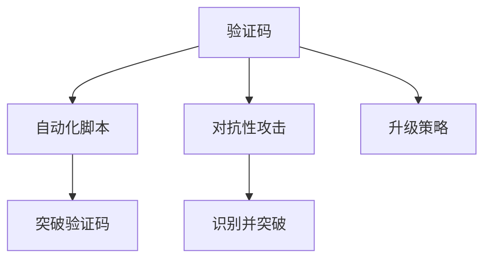

                 

# 验证码：人机交互中的智慧博弈

## 1. 背景介绍

随着数字化、网络化的快速发展，线上服务的普及与深化，越来越多的业务场景要求用户在线上进行身份验证和操作确认。验证码作为一种简单有效的互动方式，成为了保障用户安全、维护系统稳定运行的关键手段。然而，随着人工智能技术的日益进步，自动化脚本、黑产团伙等攻击手段也愈发多样和复杂，验证码的识别和对抗性也变得日趋严峻。本文将深入探讨验证码的原理和应用，介绍其在人机交互中的智慧博弈策略，并展望未来的发展方向。

## 2. 核心概念与联系

### 2.1 核心概念概述

- **验证码(Captcha)**：一种用于区分用户是真实用户还是自动化程序的技术，通常要求用户在提交请求前，通过特定任务（如解密、识别等）证明其合法性。
- **自动化脚本(Bot)**：指可以自动完成网络任务的程序，如自动化注册、自动化抢票等，通常会使用各种算法和工具来识别并绕过验证码。
- **对抗性攻击(Adversarial Attacks)**：指攻击者试图欺骗系统，使其误认为自动化脚本是真实用户的攻击行为，常见方法包括图像处理、深度学习等。
- **智慧博弈**：在验证码识别与对抗中，系统设计师和攻击者之间的博弈过程，需要通过不断升级和优化，提升验证码的安全性。

这些概念紧密相连，共同构成了验证码系统的核心框架。以下Mermaid流程图展示了这些概念之间的关系：



## 3. 核心算法原理 & 具体操作步骤

### 3.1 算法原理概述

验证码的核心原理是基于Turing Test的思想，通过设计一些具有一定难度的任务，使得只有人类用户能够完成这些任务，而自动化脚本难以实现。常见的验证码任务包括但不限于：

- **文本识别**：要求用户在输入框中识别并输入特定的文字。
- **拼图识别**：展示一幅残缺的图像，要求用户填充或匹配缺失部分。
- **数学计算**：提供一系列的算术问题，要求用户计算并输入结果。
- **行为验证**：如鼠标移动、点击等交互行为，要求用户在指定位置操作。

这些任务的共同特点是任务难度适中，具有一定随机性，但同时又具有清晰的标准答案，易于计算机程序进行匹配和验证。

### 3.2 算法步骤详解

设计验证码的具体步骤如下：

1. **任务设计**：选择合适的验证码任务，确保任务难度适中，不容易被自动化脚本识别。
2. **生成样本**：根据任务设计生成大量的训练样本，这些样本需要涵盖各种可能的干扰和攻击手段。
3. **模型训练**：利用机器学习模型对生成的样本进行训练，构建一个高效的验证码识别系统。
4. **部署上线**：将训练好的模型部署到生产环境中，与业务逻辑集成，实现自动化的验证码生成和识别。
5. **持续优化**：定期收集攻击数据，对验证码系统进行优化和升级，防止新的攻击手段对系统造成影响。

### 3.3 算法优缺点

验证码系统的优点在于其简单易行，能够有效防止自动化脚本的攻击。但同时也存在以下缺点：

- **用户体验差**：验证码任务的复杂性增加了用户的操作步骤，导致用户体验下降。
- **误识别率较高**：由于验证码设计的不确定性，有时真实用户也难以正确识别，导致误拒率高。
- **易被破解**：随着攻击手段的升级，验证码系统的安全性受到了威胁，容易遭到破解。

### 3.4 算法应用领域

验证码系统广泛应用于各类互联网服务中，如：

- **用户注册与登录**：防止自动化脚本频繁注册账号。
- **支付与交易**：防止自动化脚本进行恶意交易。
- **评论与互动**：防止自动化脚本进行恶意评论或互动。
- **游戏与娱乐**：防止自动化脚本进行非法游戏行为，如作弊等。

## 4. 数学模型和公式 & 详细讲解 & 举例说明

### 4.1 数学模型构建

考虑一个简单的验证码任务：要求用户在输入框中识别并输入一张图片中显示的文字。设图片上的文字为 $s$，用户输入的文字为 $t$，验证码系统判断两者是否一致。则模型可以表示为：

$$
P(\text{True}|s,t) = P(t|s)P(s)
$$

其中，$P(t|s)$ 表示在图片 $s$ 的条件下，用户输入 $t$ 的概率；$P(s)$ 表示图片中显示 $s$ 的概率。

### 4.2 公式推导过程

对于文本识别任务，可以通过条件概率计算验证码识别的准确率：

$$
P(\text{True}|s,t) = P(t|s)P(s) = \frac{P(t,s)}{P(s)}
$$

其中，$P(t,s)$ 表示在图片 $s$ 的条件下，用户输入 $t$ 的概率。

为了更准确地计算 $P(t,s)$，可以使用贝叶斯定理：

$$
P(t,s) = P(t|s)P(s) = \frac{P(s|t)P(t)}{P(s)}
$$

将上式代入验证码模型的准确率计算公式，得：

$$
P(\text{True}|s,t) = \frac{P(s|t)P(t)}{P(s)}
$$

### 4.3 案例分析与讲解

假设图片 $s$ 中显示的文字为 "apple"，用户输入的文字为 "apple"，则验证码系统的识别准确率为：

$$
P(\text{True}|s,t) = \frac{P(s|t)P(t)}{P(s)}
$$

其中，$P(s|t)$ 表示在图片显示 "apple" 的条件下，用户输入 "apple" 的概率。如果训练集中有大量图片显示 "apple"，并且用户输入 "apple" 的概率很高，那么 $P(s|t)$ 和 $P(t)$ 的值会很大，验证码系统的识别准确率也会很高。

## 5. 项目实践：代码实例和详细解释说明

### 5.1 开发环境搭建

1. 安装Python：从官网下载并安装Python，建议选择最新版本。
2. 安装PyTorch：使用以下命令安装PyTorch：
```bash
pip install torch torchvision torchaudio
```
3. 安装NumPy和Pandas：用于数据处理：
```bash
pip install numpy pandas
```
4. 准备数据集：可以从开源数据集或自己生成数据集，如MNIST手写数字识别数据集。

### 5.2 源代码详细实现

以下是基于PyTorch实现的验证码识别系统的代码示例：

```python
import torch
import torchvision.transforms as transforms
from torchvision.datasets import MNIST
from torch.utils.data import DataLoader
from torch import nn, optim

# 定义模型结构
class CaptchaModel(nn.Module):
    def __init__(self):
        super(CaptchaModel, self).__init__()
        self.conv1 = nn.Conv2d(1, 64, kernel_size=3, stride=1, padding=1)
        self.conv2 = nn.Conv2d(64, 128, kernel_size=3, stride=1, padding=1)
        self.pool = nn.MaxPool2d(kernel_size=2, stride=2)
        self.fc1 = nn.Linear(128*28*28, 512)
        self.fc2 = nn.Linear(512, 10)
        
    def forward(self, x):
        x = self.pool(torch.relu(self.conv1(x)))
        x = self.pool(torch.relu(self.conv2(x)))
        x = x.view(-1, 128*28*28)
        x = torch.relu(self.fc1(x))
        x = self.fc2(x)
        return x

# 加载并处理数据集
transform = transforms.Compose([transforms.ToTensor()])
train_dataset = MNIST(root='./', train=True, transform=transform, download=True)
test_dataset = MNIST(root='./', train=False, transform=transform, download=True)

train_loader = DataLoader(dataset=train_dataset, batch_size=64, shuffle=True)
test_loader = DataLoader(dataset=test_dataset, batch_size=64, shuffle=False)

# 定义模型和优化器
model = CaptchaModel()
criterion = nn.CrossEntropyLoss()
optimizer = optim.Adam(model.parameters(), lr=0.001)

# 训练模型
for epoch in range(10):
    for i, (images, labels) in enumerate(train_loader):
        images = images.reshape(-1, 28, 28).float()
        labels = labels.long()
        optimizer.zero_grad()
        outputs = model(images)
        loss = criterion(outputs, labels)
        loss.backward()
        optimizer.step()
        
        if (i+1) % 100 == 0:
            print('Epoch [{}/{}], Step [{}/{}], Loss: {:.4f}'
                  .format(epoch+1, 10, i+1, len(train_loader), loss.item()))

# 测试模型
correct = 0
total = 0
with torch.no_grad():
    for images, labels in test_loader:
        images = images.reshape(-1, 28, 28).float()
        outputs = model(images)
        _, predicted = torch.max(outputs.data, 1)
        total += labels.size(0)
        correct += (predicted == labels).sum().item()
        
accuracy = correct / total
print('Accuracy of the model on the 10000 test images: {} %'.format(accuracy*100))
```

### 5.3 代码解读与分析

上述代码实现了基于卷积神经网络（CNN）的验证码识别系统。具体步骤如下：

1. **数据集加载**：使用PyTorch的`DataLoader`加载MNIST手写数字数据集，并对图像进行预处理。
2. **模型定义**：定义一个包含两个卷积层和两个全连接层的CNN模型。
3. **损失函数和优化器**：使用交叉熵损失函数和Adam优化器进行模型训练。
4. **模型训练**：在训练集上进行多次迭代，不断更新模型参数，减小损失函数。
5. **模型测试**：在测试集上评估模型性能，计算准确率。

通过上述代码，可以看出，验证码识别系统的实现过程与一般的图像识别任务类似，但需要注意验证码任务的特殊性，如任务难度设计、数据集生成等。

## 6. 实际应用场景

### 6.1 电子邮箱验证

在电子邮箱注册、修改密码等操作中，通过验证码可以防止自动化脚本进行恶意操作。例如，当用户忘记密码时，系统要求输入验证码后才能继续操作，有效防止了机器人自动修改密码。

### 6.2 在线支付

在线支付过程中，要求用户输入验证码可以防止自动化脚本进行恶意支付，保障用户财产安全。例如，在支付宝、微信支付等平台上，支付前需要输入验证码，避免机器人自动支付。

### 6.3 游戏反作弊

在游戏中，通过验证码可以防止自动化脚本进行作弊行为。例如，王者荣耀等游戏中，系统会要求玩家输入验证码才能进行作弊操作，有效防止了机器人刷金币、刷经验等行为。

### 6.4 未来应用展望

随着技术的进步，验证码的应用场景将不断扩展。未来可能的趋势包括：

- **多模态验证码**：将文本、图像、行为等多种形式的信息结合，提高验证码的安全性和实用性。
- **人工智能辅助**：利用深度学习等技术，辅助验证码识别，提高验证码的识别准确率。
- **自适应验证码**：根据用户行为动态调整验证码难度，提高用户体验和系统安全性。

## 7. 工具和资源推荐

### 7.1 学习资源推荐

1. **《Python深度学习》**：介绍PyTorch等深度学习框架，适合初学者入门。
2. **《深度学习入门：基于Python的理论与实现》**：介绍深度学习的基本原理和实现，适合进阶学习。
3. **《机器学习实战》**：介绍机器学习算法和实现，适合理解验证码系统的基本原理。

### 7.2 开发工具推荐

1. **PyTorch**：深度学习框架，适合构建验证码识别系统。
2. **TensorFlow**：另一个深度学习框架，支持大规模分布式训练。
3. **Jupyter Notebook**：开源的交互式编程环境，方便进行数据处理和模型调试。

### 7.3 相关论文推荐

1. **CAPTCHA Breaker: 自动破解验证码的方法**：介绍自动破解验证码的方法和工具。
2. **Designing Human-Centered Anti-Captcha**：讨论验证码设计中的人性化原则。
3. **A Survey on CAPTCHA-Based Anti-Spam Defenses**：对验证码在反垃圾邮件中的应用进行综述。

## 8. 总结：未来发展趋势与挑战

### 8.1 研究成果总结

本文介绍了验证码的原理和应用，讨论了验证码系统在实际场景中的应用，并介绍了验证码的智慧博弈策略。通过上述分析，可以看出，验证码系统在设计时需要在用户体验和安全性之间取得平衡，在实际应用中需要不断优化和升级，以应对日益复杂的自动化脚本和攻击手段。

### 8.2 未来发展趋势

未来，验证码系统可能会在以下几个方面得到进一步发展：

- **多模态验证码**：结合文本、图像、行为等多种信息，提高验证码的鲁棒性。
- **自适应验证码**：根据用户行为动态调整验证码难度，提高用户体验。
- **人工智能辅助**：利用深度学习等技术，提高验证码的识别准确率。

### 8.3 面临的挑战

验证码系统在设计与实现过程中仍面临以下挑战：

- **用户体验差**：验证码任务的复杂性增加了用户的操作步骤，导致用户体验下降。
- **误识别率高**：验证码设计的不确定性可能导致真实用户难以正确识别，导致误拒率高。
- **易被破解**：随着攻击手段的升级，验证码系统的安全性受到威胁，容易遭到破解。

### 8.4 研究展望

未来，验证码系统的研究将朝着以下几个方向进行：

- **深度学习技术**：利用深度学习等技术，提高验证码的识别准确率。
- **多模态融合**：结合文本、图像、行为等多种信息，提高验证码的鲁棒性。
- **人工智能辅助**：利用人工智能技术，辅助验证码识别，提高验证码的安全性。

## 9. 附录：常见问题与解答

### Q1：验证码系统如何防止自动化脚本的攻击？

A: 验证码系统通过设计一些具有一定难度的任务，使得只有人类用户能够完成这些任务，而自动化脚本难以实现。常见任务包括文本识别、拼图识别、数学计算等。

### Q2：验证码系统的实现需要考虑哪些因素？

A: 验证码系统的实现需要考虑以下因素：
1. 任务设计：选择合适的验证码任务，确保任务难度适中。
2. 数据集生成：生成大量的训练样本，涵盖各种可能的干扰和攻击手段。
3. 模型训练：利用机器学习模型对生成的样本进行训练，构建高效的验证码识别系统。
4. 持续优化：定期收集攻击数据，对验证码系统进行优化和升级，防止新的攻击手段对系统造成影响。

### Q3：验证码系统的优点和缺点是什么？

A: 验证码系统的优点在于其简单易行，能够有效防止自动化脚本的攻击。但同时也存在以下缺点：
- 用户体验差：验证码任务的复杂性增加了用户的操作步骤，导致用户体验下降。
- 误识别率高：验证码设计的不确定性可能导致真实用户难以正确识别，导致误拒率高。
- 易被破解：随着攻击手段的升级，验证码系统的安全性受到威胁，容易遭到破解。

### Q4：验证码系统的未来发展方向有哪些？

A: 验证码系统的未来发展方向包括：
- 多模态验证码：结合文本、图像、行为等多种信息，提高验证码的鲁棒性。
- 自适应验证码：根据用户行为动态调整验证码难度，提高用户体验。
- 人工智能辅助：利用深度学习等技术，提高验证码的识别准确率。

---

作者：禅与计算机程序设计艺术 / Zen and the Art of Computer Programming

