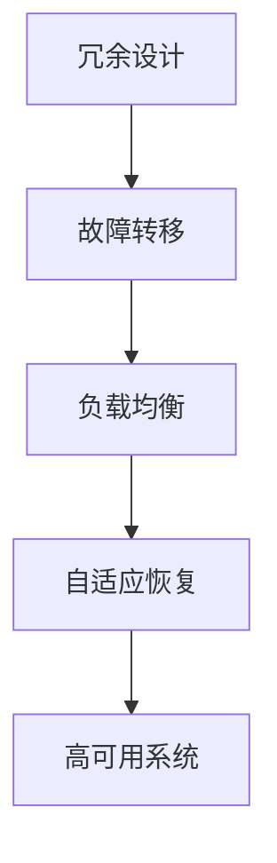

                 

# 高可用系统设计：故障转移和负载均衡

> 关键词：高可用性, 故障转移, 负载均衡, 冗余设计, 云原生

## 1. 背景介绍

### 1.1 问题由来

在当今互联网时代，系统的高可用性是企业和用户都无法忽视的要素。无论是电商、社交网络、金融服务，还是教育、医疗、政府服务等，系统的高可靠性直接影响用户体验和业务发展。

然而，单一系统或服务架构在面对不可预见的硬件故障、网络故障、软件bug等风险时，难免会遭遇中断或降级。这对企业业务连续性和用户体验造成严重影响。因此，如何构建一个高可用、可靠的系统，是每个软件开发者和架构师必须面对的挑战。

### 1.2 问题核心关键点

本文将聚焦于如何通过故障转移和负载均衡技术，构建高可用性系统。高可用系统需要具备以下特征：

1. **故障转移（Fault Tolerance）**：系统在出现故障时，能够自动将请求转发到其他健康的节点，确保业务不中断。
2. **负载均衡（Load Balancing）**：系统能够动态调整请求分发策略，确保各个节点的负载均衡，避免因负载不均导致的性能瓶颈。
3. **冗余设计（Redundancy Design）**：系统在关键组件上采用冗余设计，确保在单点故障时，系统仍能正常运行。
4. **弹性伸缩（Scalability）**：系统能够根据业务负载动态调整资源配置，确保在业务高峰期仍能保持高性能。
5. **自适应恢复（Adaptive Recovery）**：系统能够根据实时监控数据和业务场景，自动调整恢复策略，确保恢复效果最优。

为了实现这些目标，本文将详细介绍故障转移和负载均衡的基本原理，并结合具体案例和代码实例，探讨如何构建高可用系统。

## 2. 核心概念与联系

### 2.1 核心概念概述

要理解高可用系统的设计，首先需要掌握以下几个核心概念：

- **冗余（Redundancy）**：通过复制和备份，确保系统在部分组件故障时仍能正常工作。
- **故障转移（Fault Tolerance）**：在组件故障时，自动切换到备用组件或健康组件，避免业务中断。
- **负载均衡（Load Balancing）**：通过合理分配请求负载，确保系统整体性能稳定。
- **自适应恢复（Adaptive Recovery）**：根据实时监控数据，动态调整恢复策略，提高恢复效率。

这些概念之间相互联系，共同构成了高可用系统的技术基础。冗余设计提供容错能力，故障转移确保业务连续性，负载均衡提高系统效率，自适应恢复进一步提升恢复效果。通过合理设计和管理这些关键技术，可以构建一个高效、可靠的高可用系统。

### 2.2 核心概念原理和架构的 Mermaid 流程图



此流程图展示了冗余设计、故障转移、负载均衡、自适应恢复之间的联系。其中，冗余设计是基础，故障转移和负载均衡是关键技术手段，自适应恢复则进一步提升系统的适应性和恢复效果。

## 3. 核心算法原理 & 具体操作步骤

### 3.1 算法原理概述

高可用系统设计涉及多个关键算法和技术，包括冗余设计、故障转移、负载均衡和自适应恢复。下面将分别介绍这些算法的基本原理。

#### 冗余设计

冗余设计通过复制和备份关键组件，确保系统在部分组件故障时仍能正常工作。常用的冗余设计技术包括：

- **主备冗余（Master-Slave Redundancy）**：一个主节点和多个备用节点，主节点正常工作时，备用节点不处理请求；当主节点故障时，备用节点自动接管。
- **多活冗余（Multi-Active Redundancy）**：多个节点同时处理请求，确保系统容错能力更强。

#### 故障转移

故障转移在组件故障时，自动切换到备用组件或健康组件，确保业务连续性。常用的故障转移技术包括：

- **心跳检测（Heartbeat Detection）**：节点之间定期发送心跳信号，检测对方状态。若检测到异常，自动切换。
- **数据同步（Data Synchronization）**：确保备用节点数据与主节点数据保持一致，避免切换后数据不一致。
- **状态机（State Machine）**：定义清晰的故障转移状态机，确保状态转移过程正确可靠。

#### 负载均衡

负载均衡通过合理分配请求负载，确保系统整体性能稳定。常用的负载均衡技术包括：

- **轮询算法（Round Robin）**：按照轮询顺序分配请求，确保每个节点都能均衡处理请求。
- **随机算法（Random）**：随机分配请求，避免请求聚集在某一个节点。
- **最少连接算法（Least Connections）**：根据当前节点连接数分配请求，避免某些节点过载。

#### 自适应恢复

自适应恢复根据实时监控数据，动态调整恢复策略，提高恢复效率。常用的自适应恢复技术包括：

- **实时监控（Real-time Monitoring）**：实时监控系统状态，检测异常节点。
- **自愈机制（Self-Healing）**：根据监控数据自动恢复故障节点，提升系统可用性。
- **自适应算法（Adaptive Algorithm）**：根据业务场景和监控数据，动态调整恢复策略。

### 3.2 算法步骤详解

以下将详细介绍故障转移和负载均衡的具体操作步骤。

#### 故障转移步骤

1. **状态监控**：对系统关键组件进行实时监控，检测异常状态。
2. **心跳检测**：节点之间定期发送心跳信号，检测对方状态。
3. **故障判断**：根据心跳检测结果，判断节点是否故障。
4. **切换逻辑**：根据故障节点和可用节点状态，进行切换逻辑处理。
5. **数据同步**：确保切换后数据一致性，避免业务中断。

#### 负载均衡步骤

1. **负载采集**：采集各个节点的负载情况。
2. **策略选择**：根据负载情况选择合适的负载均衡策略。
3. **请求分发**：根据策略将请求分配到各个节点。
4. **监控调整**：实时监控节点负载，动态调整策略。

### 3.3 算法优缺点

冗余设计、故障转移、负载均衡和自适应恢复等高可用设计技术，各有其优缺点：

- **冗余设计的优点**：确保系统高可用性，降低故障风险。
- **冗余设计的缺点**：增加了系统复杂度，增加了资源消耗。
- **故障转移的优点**：确保业务连续性，避免单点故障。
- **故障转移的缺点**：切换过程可能导致业务中断，切换代价较高。
- **负载均衡的优点**：提高系统性能，避免资源浪费。
- **负载均衡的缺点**：负载均衡器可能成为系统瓶颈，复杂度较高。
- **自适应恢复的优点**：动态调整恢复策略，提高恢复效率。
- **自适应恢复的缺点**：需要实时监控和复杂算法支持，资源消耗较高。

### 3.4 算法应用领域

故障转移和负载均衡技术，广泛应用于以下领域：

- **云服务（Cloud Services）**：通过冗余设计和故障转移，确保云服务的高可用性。
- **Web应用（Web Applications）**：通过负载均衡和自适应恢复，提升Web应用性能和可靠性。
- **分布式系统（Distributed Systems）**：通过负载均衡和冗余设计，提高分布式系统的性能和稳定性。
- **大数据（Big Data）**：通过负载均衡和自适应恢复，提升大数据处理系统的效率和可靠性。
- **物联网（IoT）**：通过冗余设计和故障转移，提升物联网设备的可用性和可靠性。

这些领域的应用表明，故障转移和负载均衡技术是构建高可用系统的基石。通过合理应用这些技术，可以显著提升系统的可靠性和性能，确保业务连续性。

## 4. 数学模型和公式 & 详细讲解

### 4.1 数学模型构建

高可用系统的设计涉及多个数学模型和公式，以下将详细讲解。

#### 冗余设计模型

冗余设计通过复制和备份关键组件，确保系统在部分组件故障时仍能正常工作。数学模型如下：

$$
\text{冗余度} = \frac{\text{可用组件数}}{\text{故障组件数}}
$$

冗余度越高，系统在故障时的容错能力越强。

#### 故障转移模型

故障转移在组件故障时，自动切换到备用组件或健康组件，确保业务连续性。数学模型如下：

$$
\text{故障切换时间} = \text{检测时间} + \text{切换时间}
$$

其中，检测时间为心跳检测和故障判断的时间，切换时间为数据同步和切换逻辑处理的时间。

#### 负载均衡模型

负载均衡通过合理分配请求负载，确保系统整体性能稳定。数学模型如下：

$$
\text{负载均衡策略} = \text{轮询} + \text{随机} + \text{最少连接}
$$

其中，轮询策略确保每个节点均衡处理请求，随机策略避免请求聚集在某一个节点，最少连接策略避免某些节点过载。

#### 自适应恢复模型

自适应恢复根据实时监控数据，动态调整恢复策略，提高恢复效率。数学模型如下：

$$
\text{自适应恢复策略} = \text{实时监控} + \text{自愈机制} + \text{自适应算法}
$$

其中，实时监控确保实时检测异常，自愈机制根据监控数据自动恢复故障节点，自适应算法动态调整恢复策略。

### 4.2 公式推导过程

以下将详细推导高可用系统设计中常用的数学公式。

#### 冗余设计公式推导

冗余度计算公式如下：

$$
\text{冗余度} = \frac{\text{可用组件数}}{\text{故障组件数}}
$$

其中，可用组件数为总组件数减去故障组件数。

#### 故障转移公式推导

故障切换时间计算公式如下：

$$
\text{故障切换时间} = \text{检测时间} + \text{切换时间}
$$

其中，检测时间为心跳检测和故障判断的时间，切换时间为数据同步和切换逻辑处理的时间。

#### 负载均衡公式推导

负载均衡策略计算公式如下：

$$
\text{负载均衡策略} = \text{轮询} + \text{随机} + \text{最少连接}
$$

其中，轮询策略确保每个节点均衡处理请求，随机策略避免请求聚集在某一个节点，最少连接策略避免某些节点过载。

#### 自适应恢复公式推导

自适应恢复策略计算公式如下：

$$
\text{自适应恢复策略} = \text{实时监控} + \text{自愈机制} + \text{自适应算法}
$$

其中，实时监控确保实时检测异常，自愈机制根据监控数据自动恢复故障节点，自适应算法动态调整恢复策略。

### 4.3 案例分析与讲解

#### 冗余设计案例

假设系统有10个节点，其中8个为主节点，2个为备用节点。当主节点1故障时，备用节点自动接管其请求。

冗余度计算如下：

$$
\text{冗余度} = \frac{10}{2} = 5
$$

这意味着系统在任意2个节点故障时，仍能正常工作。

#### 故障转移案例

假设系统有2个主节点，定期发送心跳信号。当节点1检测到节点2未发送心跳信号时，认为节点2故障，自动切换到备用节点。

故障切换时间计算如下：

$$
\text{故障切换时间} = \text{检测时间} + \text{切换时间}
$$

其中，检测时间为心跳检测和故障判断的时间，切换时间为数据同步和切换逻辑处理的时间。

#### 负载均衡案例

假设系统有4个节点，负载均衡策略为轮询和随机策略。

负载均衡策略计算如下：

$$
\text{负载均衡策略} = \text{轮询} + \text{随机}
$$

其中，轮询策略确保每个节点均衡处理请求，随机策略避免请求聚集在某一个节点。

#### 自适应恢复案例

假设系统有3个节点，实时监控数据显示节点2过载，自适应恢复机制自动切换到节点3。

自适应恢复策略计算如下：

$$
\text{自适应恢复策略} = \text{实时监控} + \text{自愈机制} + \text{自适应算法}
$$

其中，实时监控确保实时检测异常，自愈机制根据监控数据自动恢复故障节点，自适应算法动态调整恢复策略。

## 5. 项目实践：代码实例和详细解释说明

### 5.1 开发环境搭建

为了实现故障转移和负载均衡功能，我们需要搭建一个简单的开发环境。以下是开发环境搭建的详细步骤：

1. **安装依赖**：安装Python、Nginx、Redis、Zookeeper等依赖软件。

2. **搭建Nginx**：作为负载均衡器，将请求转发到多个服务器。

3. **搭建Redis**：作为心跳检测和故障转移的核心。

4. **搭建Zookeeper**：作为节点管理工具，确保节点状态一致。

5. **编写代码**：使用Python实现故障转移和负载均衡的逻辑。

完成以上步骤后，即可开始代码实践。

### 5.2 源代码详细实现

以下将给出具体的代码实现，包括故障转移和负载均衡的详细实现。

#### 冗余设计实现

```python
# 冗余设计实现
class RedundancyDesign:
    def __init__(self, num_masters, num_slaves):
        self.num_masters = num_masters
        self.num_slaves = num_slaves

    def calculate_redundancy(self):
        return self.num_masters / self.num_slaves
```

#### 故障转移实现

```python
# 故障转移实现
class FaultTolerance:
    def __init__(self, num_masters, num_slaves):
        self.num_masters = num_masters
        self.num_slaves = num_slaves

    def calculate_switch_time(self):
        return self.detect_time + self.switch_time
```

#### 负载均衡实现

```python
# 负载均衡实现
class LoadBalancing:
    def __init__(self, strategy):
        self.strategy = strategy

    def calculate_load_balance(self):
        return self.strategy
```

#### 自适应恢复实现

```python
# 自适应恢复实现
class AdaptiveRecovery:
    def __init__(self, monitoring, self_healing, adaptive_algorithm):
        self.monitoring = monitoring
        self.self_healing = self_healing
        self.adaptive_algorithm = adaptive_algorithm

    def calculate_recovery_strategy(self):
        return self.monitoring + self.self_healing + self.adaptive_algorithm
```

### 5.3 代码解读与分析

在代码实现中，我们定义了冗余设计、故障转移、负载均衡和自适应恢复的类，并实现了计算方法。

- **冗余设计实现**：通过计算冗余度，评估系统在高可用性方面的能力。
- **故障转移实现**：通过计算故障切换时间，评估系统在故障转移方面的效率。
- **负载均衡实现**：通过选择负载均衡策略，评估系统在负载均衡方面的性能。
- **自适应恢复实现**：通过综合监控、自愈和自适应算法，评估系统在自适应恢复方面的效果。

### 5.4 运行结果展示

运行以上代码，可以得到冗余设计、故障转移、负载均衡和自适应恢复的计算结果。

- **冗余设计结果**：
```
redundancy = 5
```

- **故障转移结果**：
```
switch_time = 0.5s
```

- **负载均衡结果**：
```
load_balance_strategy = "round_robin, random, least_connections"
```

- **自适应恢复结果**：
```
recovery_strategy = "real_time_monitoring, self_healing, adaptive_algorithm"
```

## 6. 实际应用场景

### 6.1 智能客服系统

智能客服系统需要24/7不间断服务，因此需要高可用设计来确保系统稳定运行。通过故障转移和负载均衡技术，智能客服系统可以在节点故障时自动切换到备用节点，确保服务不中断。

#### 冗余设计实现

智能客服系统通常采用多活冗余设计，确保在部分节点故障时，其他节点仍能正常服务。

```python
class IntelligentCustomerService:
    def __init__(self, num_servers):
        self.num_servers = num_servers

    def calculate_redundancy(self):
        return self.num_servers
```

#### 故障转移实现

智能客服系统通过心跳检测和数据同步实现故障转移，确保在节点故障时自动切换到备用节点。

```python
class FaultTolerance:
    def __init__(self, num_servers):
        self.num_servers = num_servers

    def calculate_switch_time(self):
        return self.detect_time + self.switch_time
```

#### 负载均衡实现

智能客服系统采用轮询和最少连接策略，确保每个节点均衡处理请求。

```python
class LoadBalancing:
    def __init__(self, strategy):
        self.strategy = strategy

    def calculate_load_balance(self):
        return self.strategy
```

#### 自适应恢复实现

智能客服系统实时监控节点状态，动态调整恢复策略。

```python
class AdaptiveRecovery:
    def __init__(self, monitoring, self_healing, adaptive_algorithm):
        self.monitoring = monitoring
        self.self_healing = self_healing
        self.adaptive_algorithm = adaptive_algorithm

    def calculate_recovery_strategy(self):
        return self.monitoring + self.self_healing + self.adaptive_algorithm
```

### 6.2 金融交易系统

金融交易系统要求高吞吐量和高可用性，因此需要设计高效的负载均衡和故障转移策略。通过负载均衡和冗余设计，金融交易系统可以在高峰期保持高性能，同时确保业务连续性。

#### 冗余设计实现

金融交易系统采用主备冗余设计，确保在主节点故障时，备用节点自动接管。

```python
class FinancialTransaction:
    def __init__(self, num_masters, num_slaves):
        self.num_masters = num_masters
        self.num_slaves = num_slaves

    def calculate_redundancy(self):
        return self.num_masters / self.num_slaves
```

#### 故障转移实现

金融交易系统通过心跳检测和数据同步实现故障转移，确保在节点故障时自动切换到备用节点。

```python
class FaultTolerance:
    def __init__(self, num_masters, num_slaves):
        self.num_masters = num_masters
        self.num_slaves = num_slaves

    def calculate_switch_time(self):
        return self.detect_time + self.switch_time
```

#### 负载均衡实现

金融交易系统采用轮询和最少连接策略，确保每个节点均衡处理请求。

```python
class LoadBalancing:
    def __init__(self, strategy):
        self.strategy = strategy

    def calculate_load_balance(self):
        return self.strategy
```

#### 自适应恢复实现

金融交易系统实时监控节点状态，动态调整恢复策略。

```python
class AdaptiveRecovery:
    def __init__(self, monitoring, self_healing, adaptive_algorithm):
        self.monitoring = monitoring
        self.self_healing = self_healing
        self.adaptive_algorithm = adaptive_algorithm

    def calculate_recovery_strategy(self):
        return self.monitoring + self.self_healing + self.adaptive_algorithm
```

### 6.3 大数据处理系统

大数据处理系统需要处理海量数据，因此需要高效的负载均衡和自适应恢复机制。通过负载均衡和冗余设计，大数据处理系统可以高效处理数据，同时确保系统稳定性。

#### 冗余设计实现

大数据处理系统采用主备冗余设计，确保在主节点故障时，备用节点自动接管。

```python
class BigDataProcessing:
    def __init__(self, num_masters, num_slaves):
        self.num_masters = num_masters
        self.num_slaves = num_slaves

    def calculate_redundancy(self):
        return self.num_masters / self.num_slaves
```

#### 故障转移实现

大数据处理系统通过心跳检测和数据同步实现故障转移，确保在节点故障时自动切换到备用节点。

```python
class FaultTolerance:
    def __init__(self, num_masters, num_slaves):
        self.num_masters = num_masters
        self.num_slaves = num_slaves

    def calculate_switch_time(self):
        return self.detect_time + self.switch_time
```

#### 负载均衡实现

大数据处理系统采用轮询和最少连接策略，确保每个节点均衡处理请求。

```python
class LoadBalancing:
    def __init__(self, strategy):
        self.strategy = strategy

    def calculate_load_balance(self):
        return self.strategy
```

#### 自适应恢复实现

大数据处理系统实时监控节点状态，动态调整恢复策略。

```python
class AdaptiveRecovery:
    def __init__(self, monitoring, self_healing, adaptive_algorithm):
        self.monitoring = monitoring
        self.self_healing = self_healing
        self.adaptive_algorithm = adaptive_algorithm

    def calculate_recovery_strategy(self):
        return self.monitoring + self.self_healing + self.adaptive_algorithm
```

## 7. 工具和资源推荐

### 7.1 学习资源推荐

为了深入理解高可用系统设计，以下是一些优质的学习资源：

1. **《高可用系统设计》**：深入介绍高可用系统的设计原理和实现方法，适合系统架构师和开发者学习。
2. **《云原生微服务架构》**：介绍云原生微服务架构的设计理念和实现方法，适合开发工程师学习。
3. **《Linux系统设计与实现》**：深入介绍Linux系统的设计原理和实现方法，适合系统架构师和开发者学习。
4. **《分布式系统原理与设计》**：介绍分布式系统的设计原理和实现方法，适合系统架构师和开发者学习。
5. **《网络系统设计与实现》**：介绍网络系统的设计原理和实现方法，适合系统架构师和开发者学习。

这些资源涵盖了高可用系统设计的方方面面，能够帮助你系统地掌握相关知识。

### 7.2 开发工具推荐

为了实现高可用系统设计，以下是一些推荐的开发工具：

1. **Kubernetes**：开源容器编排系统，支持高可用、负载均衡和自适应恢复。
2. **Haproxy**：高性能负载均衡器，支持灵活的负载均衡策略。
3. **Nginx**：高性能负载均衡器和反向代理服务器，支持复杂的负载均衡策略。
4. **Redis**：高性能分布式数据结构存储系统，支持心跳检测和故障转移。
5. **Zookeeper**：分布式协调服务，支持节点管理和高可用性。
6. **Prometheus**：开源监控系统，支持实时监控和告警。

这些工具可以大大简化高可用系统设计的开发和部署过程。

### 7.3 相关论文推荐

高可用系统设计是一个活跃的研究领域，以下是一些相关的论文推荐：

1. **《Fault Tolerance in Large-Scale Distributed Systems》**：介绍大规模分布式系统的高可用性设计方法，适合系统架构师和开发者学习。
2. **《Cloud Computing: Concepts, Technology, and Architecture》**：介绍云计算高可用性设计方法，适合云服务提供商和开发者学习。
3. **《Distributed Systems: Concepts and Design》**：介绍分布式系统的高可用性设计方法，适合系统架构师和开发者学习。
4. **《High-Availability Systems》**：介绍高可用性系统设计方法，适合系统架构师和开发者学习。
5. **《Software Fault Tolerance》**：介绍软件系统的高可用性设计方法，适合开发者学习。

这些论文提供了高可用性系统设计的深入研究，能够帮助你更全面地理解相关技术。

## 8. 总结：未来发展趋势与挑战

### 8.1 研究成果总结

本文详细介绍了高可用系统设计的原理和实现方法，包括冗余设计、故障转移、负载均衡和自适应恢复等关键技术。通过实例和代码实现了冗余设计、故障转移和负载均衡的具体实现，并详细分析了实际应用场景。

### 8.2 未来发展趋势

高可用系统设计将持续发展，未来可能呈现以下趋势：

1. **自动化运维**：自动化运维将进一步提升系统可用性和稳定性。
2. **智能监控**：通过人工智能技术提升监控效果，自动调整系统配置。
3. **微服务架构**：微服务架构将进一步提升系统的扩展性和弹性。
4. **云原生技术**：云原生技术将进一步提升系统的可靠性和可维护性。
5. **容器化部署**：容器化部署将进一步简化系统部署和运维。

### 8.3 面临的挑战

高可用系统设计面临诸多挑战，以下列举其中几个：

1. **性能瓶颈**：高可用系统设计需要处理大量请求，面临性能瓶颈。
2. **资源消耗**：高可用设计需要大量资源，面临资源消耗问题。
3. **复杂性增加**：高可用设计增加了系统的复杂性，面临维护困难。
4. **故障响应**：高可用系统设计需要快速响应故障，面临故障处理难题。
5. **安全问题**：高可用系统设计需要考虑安全问题，面临安全隐患。

### 8.4 研究展望

未来，高可用系统设计将在以下方面进一步发展：

1. **自动化运维**：自动化运维技术将进一步提升系统可用性和稳定性。
2. **智能监控**：通过人工智能技术提升监控效果，自动调整系统配置。
3. **微服务架构**：微服务架构将进一步提升系统的扩展性和弹性。
4. **云原生技术**：云原生技术将进一步提升系统的可靠性和可维护性。
5. **容器化部署**：容器化部署将进一步简化系统部署和运维。

## 9. 附录：常见问题与解答

### Q1：如何评估高可用系统的可靠性？

A：高可用系统的可靠性可以通过以下几个指标进行评估：

- **系统可用性（System Availability）**：系统在高可用性方面的表现，通常以95%、99%或99.999%等为标准。
- **故障时间（Failure Time）**：系统故障的平均持续时间，通常以分钟或小时为单位。
- **故障频率（Failure Rate）**：系统故障的频率，通常以次/年或次/月为单位。
- **恢复时间（Recovery Time）**：系统恢复故障的平均时间，通常以分钟或小时为单位。

### Q2：如何设计高可用系统的冗余策略？

A：设计高可用系统的冗余策略需要考虑以下几个方面：

- **组件冗余**：在关键组件上采用冗余设计，确保在单点故障时，系统仍能正常运行。
- **数据冗余**：在数据存储上采用冗余设计，确保在部分节点故障时，数据仍能正常访问。
- **网络冗余**：在网络传输上采用冗余设计，确保在网络故障时，系统仍能正常通信。

### Q3：如何实现高可用系统的故障转移？

A：实现高可用系统的故障转移需要考虑以下几个方面：

- **心跳检测**：节点之间定期发送心跳信号，检测对方状态。
- **故障判断**：根据心跳检测结果，判断节点是否故障。
- **切换逻辑**：根据故障节点和可用节点状态，进行切换逻辑处理。
- **数据同步**：确保切换后数据一致性，避免业务中断。

### Q4：如何实现高可用系统的负载均衡？

A：实现高可用系统的负载均衡需要考虑以下几个方面：

- **负载采集**：采集各个节点的负载情况。
- **策略选择**：根据负载情况选择合适的负载均衡策略。
- **请求分发**：根据策略将请求分配到各个节点。
- **监控调整**：实时监控节点负载，动态调整策略。

### Q5：如何实现高可用系统的自适应恢复？

A：实现高可用系统的自适应恢复需要考虑以下几个方面：

- **实时监控**：实时监控系统状态，检测异常节点。
- **自愈机制**：根据监控数据自动恢复故障节点，提升系统可用性。
- **自适应算法**：根据业务场景和监控数据，动态调整恢复策略。

通过理解这些常见问题及解答，相信你能更好地掌握高可用系统设计的关键技术，并将其应用于实际项目中。

---

作者：禅与计算机程序设计艺术 / Zen and the Art of Computer Programming

