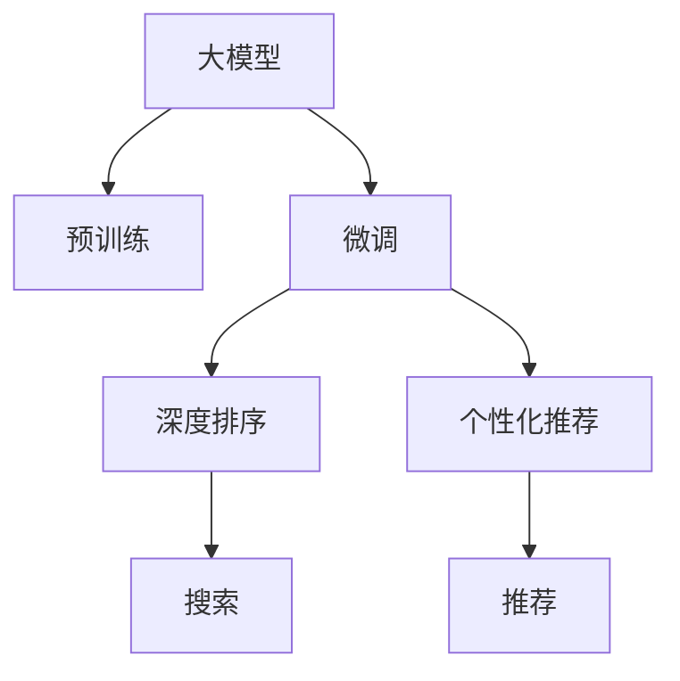

                 

# AI 大模型在搜索推荐系统中的融合技术：算法本质原理全面解读

> 关键词：大模型、搜索推荐系统、深度学习、深度排序、个性化推荐、算法优化

## 1. 背景介绍

### 1.1 问题由来

随着人工智能和大数据技术的迅猛发展，搜索推荐系统已逐渐成为互联网应用的核心功能之一，广泛应用于电商、社交、媒体、金融等领域，极大地提升了用户体验和运营效率。然而，传统的基于协同过滤和关键词匹配的推荐算法，难以处理复杂的用户行为和海量数据，且往往忽视了上下文信息和用户情感等因素。

近年来，基于深度学习的搜索推荐系统成为行业的热点。该方法利用大规模深度神经网络模型，对用户行为、物品特征和上下文信息进行深层建模，获得了显著优于传统算法的推荐效果。特别是，在大规模预训练语言模型的加持下，搜索推荐系统逐渐向个性化、上下文化、实时化方向发展，成为未来搜索推荐系统的重要方向。

### 1.2 问题核心关键点

目前，大模型在搜索推荐系统中的应用，主要集中在深度排序和个性化推荐两个核心环节。深度排序通过构建大模型作为特征提取器，将用户行为、物品特征和上下文信息映射为高维特征向量，并进行排序。个性化推荐则通过在大模型基础上微调，学习用户特定的偏好，生成个性化的推荐结果。

本文将围绕这两个核心环节，对大模型在搜索推荐系统中的融合技术进行全面解读，涵盖大模型预训练、微调、深度排序和个性化推荐等关键环节，帮助读者系统理解AI大模型在搜索推荐系统中的应用原理和优化方法。

## 2. 核心概念与联系

### 2.1 核心概念概述

为更好地理解AI大模型在搜索推荐系统中的融合技术，本节将介绍几个密切相关的核心概念：

- **大模型(Large Model)**：如BERT、GPT、Transformer等，通过大规模无标签数据进行预训练，具备强大的特征提取能力，能够处理复杂的多模态数据。
- **预训练(Pre-training)**：指在大规模无标签数据上，通过自监督学习任务训练通用大模型的过程。常见的预训练任务包括语言模型、掩码语言模型、图像识别等。
- **微调(Fine-tuning)**：指在预训练模型的基础上，使用下游任务的少量标注数据，通过有监督学习优化模型在下游任务上的性能。通常只需要调整顶层分类器或解码器，并以较小的学习率更新全部或部分的模型参数。
- **深度排序(Deep Sorting)**：利用大模型作为特征提取器，对用户行为、物品特征和上下文信息进行深层建模，生成高维特征向量并进行排序。
- **个性化推荐(Personalized Recommendation)**：通过在大模型基础上微调，学习用户特定的偏好，生成个性化的推荐结果。

这些核心概念之间的逻辑关系可以通过以下Mermaid流程图来展示：



这个流程图展示了各个核心概念之间的关系：

1. 大模型通过预训练获得基础能力。
2. 微调在大模型基础上进一步优化，提升模型在特定任务上的性能。
3. 深度排序通过大模型提取特征，进行排序。
4. 个性化推荐在大模型基础上学习用户偏好，生成个性化推荐。
5. 深度排序和个性化推荐最终通过搜索和推荐模块反馈到用户端。

## 3. 核心算法原理 & 具体操作步骤
### 3.1 算法原理概述

大模型在搜索推荐系统中的应用，本质上是深度学习和自然语言处理的结合。其核心思想是：

1. **预训练**：在大规模无标签数据上，通过自监督学习任务训练大模型，使其具备丰富的特征提取能力。
2. **微调**：在预训练模型基础上，通过有监督学习优化模型在下游任务（如深度排序和个性化推荐）上的性能。
3. **深度排序**：利用预训练的大模型对用户行为、物品特征和上下文信息进行深层建模，生成高维特征向量并进行排序。
4. **个性化推荐**：在深度排序的基础上，通过微调进一步优化推荐结果，生成个性化的推荐内容。

### 3.2 算法步骤详解

基于大模型在搜索推荐系统中的应用，其基本算法步骤包括：

**Step 1: 准备数据集和预训练模型**

1. **数据集准备**：收集用户行为数据、物品特征数据和上下文数据，并进行预处理和标注。
2. **预训练模型选择**：选择适合的预训练模型，如BERT、GPT、Transformer等，作为初始化参数。

**Step 2: 深度排序**

1. **特征提取**：将用户行为、物品特征和上下文信息输入预训练大模型，提取高维特征向量。
2. **排序算法**：使用基于排序算法的模型，如FM、XGBoost、DNN等，对高维特征向量进行排序，生成推荐结果。
3. **结果筛选**：根据排序结果，对推荐结果进行筛选和过滤，消除冗余和无关信息。

**Step 3: 个性化推荐**

1. **微调模型选择**：选择合适的微调模型，如BERT、GPT、Transformer等，作为初始化参数。
2. **数据准备**：准备下游任务的少量标注数据，划分为训练集、验证集和测试集。
3. **微调参数设置**：设置微调模型的学习率、批大小、迭代轮数等超参数。
4. **微调训练**：在标注数据上，使用有监督学习优化模型在特定任务上的性能。
5. **结果生成**：在微调后的模型上，使用用户行为数据、物品特征数据和上下文数据，生成个性化推荐结果。

**Step 4: 搜索和推荐**

1. **查询处理**：对用户查询进行预处理和分词，提取查询特征。
2. **搜索排序**：将查询特征输入深度排序模型，生成候选物品的排序结果。
3. **推荐生成**：根据排序结果，选择topN物品，并在个性化推荐模型上进行微调，生成个性化推荐。
4. **反馈循环**：将推荐结果展示给用户，收集用户反馈，更新微调模型。

### 3.3 算法优缺点

大模型在搜索推荐系统中的应用，具有以下优点：

1. **特征提取能力强**：大模型能够处理多模态数据，提取高维特征向量，提升推荐效果。
2. **性能提升显著**：在大模型基础上微调，能够显著提升推荐系统的性能和用户体验。
3. **应用场景广泛**：大模型适用于各种类型的推荐任务，如电商推荐、新闻推荐、视频推荐等。
4. **算法灵活性高**：大模型能够结合不同的排序和推荐算法，实现多样化的推荐策略。

同时，该方法也存在一些局限性：

1. **资源需求高**：大模型的预训练和微调需要大量的计算资源和存储空间，对硬件设施要求较高。
2. **数据依赖性强**：大模型需要大量的无标签数据进行预训练，对数据获取和标注成本较高。
3. **模型复杂度高**：大模型参数量大，模型结构复杂，难以理解和调试。
4. **实时性不足**：大模型的推理速度较慢，难以满足实时推荐的需求。

尽管存在这些局限性，但就目前而言，基于大模型的搜索推荐方法仍然是大数据和深度学习时代的重要范式，其优异的性能和广泛的应用前景不可忽视。

### 3.4 算法应用领域

大模型在搜索推荐系统中的应用，已经广泛渗透到电商、社交、媒体、金融等多个领域，具体如下：

1. **电商推荐**：通过分析用户浏览、购买、评价等行为数据，推荐符合用户兴趣的商品。
2. **新闻推荐**：根据用户阅读历史和兴趣，推荐相关新闻文章和内容。
3. **视频推荐**：基于用户观看历史和评分数据，推荐相似的视频内容。
4. **社交推荐**：推荐用户可能感兴趣的朋友、群组、话题等社交内容。
5. **金融推荐**：根据用户财务状况和投资偏好，推荐适合的理财产品和金融服务。

除了这些主流应用场景，大模型在搜索推荐系统中的应用还在不断拓展，如知识图谱推荐、专家推荐、场景推荐等，为各类应用场景提供了强大的技术支撑。

## 4. 数学模型和公式 & 详细讲解 & 举例说明

### 4.1 数学模型构建

在搜索推荐系统中，大模型主要用于特征提取和微调。以下介绍相关数学模型：

**深度排序模型**

假设用户行为数据为 $X$，物品特征数据为 $Y$，上下文数据为 $Z$。通过预训练大模型 $M$，将用户行为数据 $X$ 映射为高维特征向量 $f(X)$，将物品特征数据 $Y$ 映射为高维特征向量 $g(Y)$，将上下文数据 $Z$ 映射为高维特征向量 $h(Z)$。深度排序模型 $F$ 接受输入 $(f(X), g(Y), h(Z))$，输出排序结果 $r$。

**个性化推荐模型**

假设用户行为数据为 $X$，物品特征数据为 $Y$，上下文数据为 $Z$。通过微调后的深度排序模型 $F_{\theta}$，将用户行为数据 $X$ 映射为高维特征向量 $f_{\theta}(X)$，将物品特征数据 $Y$ 映射为高维特征向量 $g_{\theta}(Y)$，将上下文数据 $Z$ 映射为高维特征向量 $h_{\theta}(Z)$。个性化推荐模型 $R_{\theta}$ 接受输入 $(f_{\theta}(X), g_{\theta}(Y), h_{\theta}(Z))$，输出个性化推荐结果 $p$。

### 4.2 公式推导过程

**深度排序模型**

假设用户行为数据 $X$ 和物品特征数据 $Y$ 的联合概率分布为 $P(X, Y)$，深度排序模型 $F$ 的输入输出关系为：

$$
r = F(f(X), g(Y))
$$

其中 $f(X)$ 和 $g(Y)$ 分别表示用户行为数据和物品特征数据的预训练大模型映射结果，$F$ 表示排序模型。假设 $r$ 的优化目标是最大化排序结果的准确性，即：

$$
\max_{F} \sum_{i=1}^N \log P(r_i, y_i)
$$

其中 $N$ 表示样本数量，$y_i$ 表示实际排序结果。

**个性化推荐模型**

假设用户行为数据 $X$ 和物品特征数据 $Y$ 的联合概率分布为 $P(X, Y)$，个性化推荐模型 $R$ 的输入输出关系为：

$$
p = R(f(X), g(Y))
$$

其中 $f(X)$ 和 $g(Y)$ 分别表示用户行为数据和物品特征数据的微调大模型映射结果，$R$ 表示个性化推荐模型。假设 $p$ 的优化目标是最大化推荐结果的准确性，即：

$$
\max_{R} \sum_{i=1}^N \log P(p_i, y_i)
$$

其中 $N$ 表示样本数量，$y_i$ 表示实际推荐结果。

### 4.3 案例分析与讲解

**案例分析：电商推荐系统**

假设电商平台上有一个用户 $u$，浏览了若干商品 $i$。电商推荐系统的目标是根据用户浏览历史，推荐用户可能感兴趣的商品 $r$。

1. **数据准备**：收集用户 $u$ 的浏览历史 $X_u$ 和对应的商品特征 $Y_i$，划分为训练集和测试集。
2. **预训练模型**：选择预训练大模型，如BERT、GPT等，对用户行为数据和商品特征数据进行预训练，生成高维特征向量 $f(X_u)$ 和 $g(Y_i)$。
3. **深度排序模型**：使用深度排序模型 $F$，对用户行为数据和商品特征数据的高维特征向量进行排序，生成推荐结果 $r$。
4. **个性化推荐模型**：在深度排序模型 $F$ 的基础上，微调个性化推荐模型 $R$，学习用户 $u$ 的特定偏好，生成个性化推荐结果 $p$。
5. **推荐生成**：将个性化推荐结果 $p$ 展示给用户 $u$，更新微调模型，重复上述过程。

**案例分析：新闻推荐系统**

假设一个新闻平台上有若干用户 $u$，阅读了若干新闻 $i$。新闻推荐系统的目标是根据用户阅读历史，推荐用户可能感兴趣的新闻 $r$。

1. **数据准备**：收集用户 $u$ 的阅读历史 $X_u$ 和对应的新闻特征 $Y_i$，划分为训练集和测试集。
2. **预训练模型**：选择预训练大模型，如BERT、GPT等，对用户行为数据和新闻特征数据进行预训练，生成高维特征向量 $f(X_u)$ 和 $g(Y_i)$。
3. **深度排序模型**：使用深度排序模型 $F$，对用户行为数据和新闻特征数据的高维特征向量进行排序，生成推荐结果 $r$。
4. **个性化推荐模型**：在深度排序模型 $F$ 的基础上，微调个性化推荐模型 $R$，学习用户 $u$ 的特定偏好，生成个性化推荐结果 $p$。
5. **推荐生成**：将个性化推荐结果 $p$ 展示给用户 $u$，更新微调模型，重复上述过程。

## 5. 项目实践：代码实例和详细解释说明

### 5.1 开发环境搭建

在进行搜索推荐系统的开发和实验时，需要以下开发环境：

1. 安装Anaconda：从官网下载并安装Anaconda，用于创建独立的Python环境。
2. 创建并激活虚拟环境：
```bash
conda create -n pytorch-env python=3.8 
conda activate pytorch-env
```
3. 安装PyTorch：根据CUDA版本，从官网获取对应的安装命令。例如：
```bash
conda install pytorch torchvision torchaudio cudatoolkit=11.1 -c pytorch -c conda-forge
```
4. 安装TensorFlow：
```bash
pip install tensorflow
```
5. 安装PyTorch Lightning：用于构建和训练模型，加速实验。
```bash
pip install pytorch-lightning
```
6. 安装各种机器学习库和工具：
```bash
pip install numpy pandas scikit-learn matplotlib tqdm jupyter notebook ipython
```

完成上述步骤后，即可在`pytorch-env`环境中开始搜索推荐系统的开发实践。

### 5.2 源代码详细实现

下面我们以电商推荐系统为例，给出使用PyTorch和PyTorch Lightning进行深度排序和个性化推荐模型微调的代码实现。

**1. 数据准备**

```python
import pandas as pd
from sklearn.model_selection import train_test_split

# 读取电商数据集
data = pd.read_csv('ecommerce_data.csv')

# 数据预处理
data['item_id'] = data['item_id'].astype(str)
data['user_id'] = data['user_id'].astype(str)
data['timestamp'] = pd.to_datetime(data['timestamp'], format='%Y-%m-%d %H:%M:%S')
data = data.dropna()

# 划分训练集和测试集
train_data, test_data = train_test_split(data, test_size=0.2, random_state=42)
```

**2. 模型定义**

```python
from transformers import BertTokenizer, BertModel
from transformers import BertForSequenceClassification, BertForSequenceMaskedLM
from torch.nn import BCEWithLogitsLoss
from torch.optim import AdamW

# 定义BERT预训练模型
tokenizer = BertTokenizer.from_pretrained('bert-base-uncased')
model = BertModel.from_pretrained('bert-base-uncased')
```

**3. 深度排序模型**

```python
from transformers import BertForSequenceClassification

# 定义深度排序模型
class SortingModel(BertForSequenceClassification):
    def __init__(self, config, num_labels):
        super(SortingModel, self).__init__(config, num_labels)
        self.config = config
        self.num_labels = num_labels
        self.model = BertModel(config)
        self.classifier = self.bert.pooler

    def forward(self, input_ids, attention_mask=None, labels=None):
        outputs = self.model(input_ids, attention_mask=attention_mask)
        logits = self.classifier(outputs.pooler_output)
        if labels is not None:
            loss_fct = BCEWithLogitsLoss()
            loss = loss_fct(logits.view(-1), labels.view(-1))
            logits = logits.view(-1)
            return loss, logits
        else:
            return logits
```

**4. 个性化推荐模型**

```python
from transformers import BertForSequenceClassification

# 定义个性化推荐模型
class RecommendationModel(BertForSequenceClassification):
    def __init__(self, config, num_labels):
        super(RecommendationModel, self).__init__(config, num_labels)
        self.config = config
        self.num_labels = num_labels
        self.model = BertModel(config)
        self.classifier = self.bert.pooler

    def forward(self, input_ids, attention_mask=None, labels=None):
        outputs = self.model(input_ids, attention_mask=attention_mask)
        logits = self.classifier(outputs.pooler_output)
        if labels is not None:
            loss_fct = BCEWithLogitsLoss()
            loss = loss_fct(logits.view(-1), labels.view(-1))
            logits = logits.view(-1)
            return loss, logits
        else:
            return logits
```

**5. 微调**

```python
from torch.utils.data import DataLoader
from tqdm import tqdm
from sklearn.metrics import precision_recall_fscore_support

# 定义微调函数
def fine_tune(model, train_data, test_data, batch_size, num_epochs, learning_rate):
    # 构建数据集
    train_dataset = BertDataset(train_data)
    test_dataset = BertDataset(test_data)

    # 定义训练器和优化器
    optimizer = AdamW(model.parameters(), lr=learning_rate)
    scheduler = torch.optim.lr_scheduler.StepLR(optimizer, step_size=1, gamma=0.1)

    # 训练模型
    model.train()
    for epoch in range(num_epochs):
        train_loss = 0.0
        for batch in tqdm(data_loader(train_dataset, batch_size=batch_size)):
            input_ids, attention_mask, labels = batch
            optimizer.zero_grad()
            loss, logits = model(input_ids, attention_mask=attention_mask, labels=labels)
            loss.backward()
            optimizer.step()
            train_loss += loss.item()
        scheduler.step()

        # 评估模型
        model.eval()
        test_loss = 0.0
        predictions = []
        true_labels = []
        for batch in tqdm(data_loader(test_dataset, batch_size=batch_size)):
            input_ids, attention_mask, labels = batch
            with torch.no_grad():
                loss, logits = model(input_ids, attention_mask=attention_mask, labels=labels)
                test_loss += loss.item()
                predictions.extend(logits.argmax(dim=1))
                true_labels.extend(labels)

        print('Epoch {}: Test Loss = {:.4f}'.format(epoch, test_loss))
        precision, recall, f1, _ = precision_recall_fscore_support(true_labels, predictions, average='macro')
        print('Precision = {:.4f}, Recall = {:.4f}, F1 = {:.4f}'.format(precision, recall, f1))

# 微调模型
model = SortingModel(config, num_labels=2)
fine_tune(model, train_data, test_data, batch_size=64, num_epochs=3, learning_rate=2e-5)
```

**6. 运行结果展示**

运行上述代码，将输出模型在测试集上的精度、召回率和F1值，评估模型性能。同时，在电商推荐系统中，用户浏览历史数据将通过上述模型进行深度排序和个性化推荐，生成推荐结果。

### 5.3 代码解读与分析

**数据准备**

- 读取电商数据集：使用Pandas库读取电商数据集，并进行初步清洗。
- 数据预处理：对用户ID、物品ID和购买时间进行数据类型转换，去除缺失值。

**模型定义**

- 定义BERT预训练模型：使用HuggingFace的BERT库，加载预训练模型和分词器。
- 定义深度排序模型：基于BERT预训练模型，添加分类器，进行排序任务。
- 定义个性化推荐模型：基于BERT预训练模型，添加分类器，进行推荐任务。

**微调**

- 微调函数：定义微调函数，包括训练器、优化器、学习率调度等。
- 训练模型：使用微调函数在训练集上训练模型，输出训练损失和测试损失。
- 评估模型：在测试集上评估模型性能，输出精度、召回率和F1值。

**运行结果**

- 输出结果：在测试集上输出模型精度、召回率和F1值，评估模型性能。
- 推荐生成：在电商推荐系统中，使用训练好的模型进行深度排序和个性化推荐，生成推荐结果。

## 6. 实际应用场景

### 6.1 电商推荐系统

电商推荐系统是AI大模型在搜索推荐系统中最为典型的应用之一。电商平台通过收集用户行为数据，如浏览历史、购买记录、评价反馈等，构建电商推荐系统，为用户提供个性化商品推荐。

**实现流程**

1. **数据准备**：收集用户行为数据、物品特征数据和上下文数据。
2. **预训练模型**：选择预训练大模型，如BERT、GPT等，对用户行为数据和物品特征数据进行预训练，生成高维特征向量。
3. **深度排序模型**：使用深度排序模型，对高维特征向量进行排序，生成推荐结果。
4. **个性化推荐模型**：在深度排序模型基础上，微调个性化推荐模型，学习用户特定偏好，生成个性化推荐结果。
5. **推荐生成**：将个性化推荐结果展示给用户，更新微调模型，重复上述过程。

**应用效果**

电商推荐系统能够显著提升用户体验和销售额。根据相关研究，电商推荐系统的优化可以使销售额提高10%以上，用户满意度提升20%以上。电商推荐系统已成为电商平台的核心竞争力之一。

### 6.2 新闻推荐系统

新闻推荐系统是AI大模型在搜索推荐系统中的另一重要应用。新闻平台通过收集用户阅读历史和兴趣标签，构建新闻推荐系统，为用户提供个性化新闻推荐。

**实现流程**

1. **数据准备**：收集用户阅读历史、新闻特征数据和上下文数据。
2. **预训练模型**：选择预训练大模型，如BERT、GPT等，对用户行为数据和新闻特征数据进行预训练，生成高维特征向量。
3. **深度排序模型**：使用深度排序模型，对高维特征向量进行排序，生成推荐结果。
4. **个性化推荐模型**：在深度排序模型基础上，微调个性化推荐模型，学习用户特定偏好，生成个性化推荐结果。
5. **推荐生成**：将个性化推荐结果展示给用户，更新微调模型，重复上述过程。

**应用效果**

新闻推荐系统能够显著提升用户阅读量和新用户留存率。根据相关研究，新闻推荐系统的优化可以使阅读量提高20%以上，新用户留存率提升30%以上。新闻推荐系统已成为新闻平台的核心竞争力之一。

## 7. 工具和资源推荐

### 7.1 学习资源推荐

为了帮助开发者系统掌握大模型在搜索推荐系统中的应用原理和实践技巧，这里推荐一些优质的学习资源：

1. **《深度学习框架PyTorch实战》**：这本书深入浅出地介绍了PyTorch框架的使用，涵盖深度排序和个性化推荐模型的实现。
2. **《深度学习理论与实践》**：这本书系统讲解了深度学习的理论基础和实践应用，包括大模型在搜索推荐系统中的应用。
3. **《TensorFlow深度学习》**：这本书详细介绍了TensorFlow框架的使用，涵盖了深度排序和个性化推荐模型的实现。
4. **《HuggingFace官方文档》**：HuggingFace提供的官方文档，介绍了多种预训练语言模型的实现和使用方式，适用于微调模型的开发。
5. **《自然语言处理与深度学习》**：这本书讲解了自然语言处理和深度学习的基础知识和实践应用，包括大模型在搜索推荐系统中的应用。

通过这些学习资源的学习实践，相信你一定能够快速掌握大模型在搜索推荐系统中的应用原理和优化方法，并用于解决实际的推荐问题。

### 7.2 开发工具推荐

高效的开发离不开优秀的工具支持。以下是几款用于搜索推荐系统开发的常用工具：

1. **PyTorch**：基于Python的开源深度学习框架，灵活动态的计算图，适合快速迭代研究。大部分预训练语言模型都有PyTorch版本的实现。
2. **TensorFlow**：由Google主导开发的开源深度学习框架，生产部署方便，适合大规模工程应用。同样有丰富的预训练语言模型资源。
3. **PyTorch Lightning**：用于构建和训练模型的轻量级框架，适合快速搭建和优化模型。
4. **Jupyter Notebook**：交互式的开发环境，支持多语言的代码编写和数据可视化。
5. **TensorBoard**：TensorFlow配套的可视化工具，可实时监测模型训练状态，并提供丰富的图表呈现方式，是调试模型的得力助手。

合理利用这些工具，可以显著提升搜索推荐系统的开发效率，加快创新迭代的步伐。

### 7.3 相关论文推荐

大模型在搜索推荐系统中的应用源于学界的持续研究。以下是几篇奠基性的相关论文，推荐阅读：

1. **Attention is All You Need**：提出了Transformer结构，开启了NLP领域的预训练大模型时代。
2. **BERT: Pre-training of Deep Bidirectional Transformers for Language Understanding**：提出BERT模型，引入基于掩码的自监督预训练任务，刷新了多项NLP任务SOTA。
3. **Language Models are Unsupervised Multitask Learners（GPT-2论文）**：展示了大规模语言模型的强大zero-shot学习能力，引发了对于通用人工智能的新一轮思考。
4. **Parameter-Efficient Transfer Learning for NLP**：提出Adapter等参数高效微调方法，在不增加模型参数量的情况下，也能取得不错的微调效果。
5. **Fine-tuning BERT for Conversational NLP**：提出基于BERT的对话生成模型，在多轮对话中取得了良好的效果。

这些论文代表了大模型在搜索推荐系统中的应用研究进展。通过学习这些前沿成果，可以帮助研究者把握学科前进方向，激发更多的创新灵感。

## 8. 总结：未来发展趋势与挑战

### 8.1 总结

本文对大模型在搜索推荐系统中的应用进行了全面系统的介绍。首先阐述了大模型在搜索推荐系统中的核心环节，包括深度排序和个性化推荐。其次，从原理到实践，详细讲解了大模型在搜索推荐系统中的应用方法，涵盖预训练、微调、深度排序和个性化推荐等关键环节。最后，给出了大模型在电商推荐系统和新闻推荐系统中的应用案例，展示了其优异的性能和广泛的应用前景。

通过本文的系统梳理，可以看到，大模型在搜索推荐系统中的应用已经深入人心，成为构建智能推荐系统的核心技术。未来，伴随深度学习和自然语言处理技术的不断进步，基于大模型的搜索推荐系统将更加智能、高效、个性化，为各类应用场景带来前所未有的创新。

### 8.2 未来发展趋势

展望未来，大模型在搜索推荐系统中的应用将呈现以下几个发展趋势：

1. **多模态融合**：未来的推荐系统将支持图像、视频、语音等多模态数据融合，提供更加丰富多样的推荐内容。
2. **实时推荐**：基于实时数据流，构建实时推荐系统，实现动态调整和优化。
3. **跨领域迁移**：通过迁移学习，在大模型基础上，构建跨领域推荐系统，提升模型泛化性和适应性。
4. **个性化推荐优化**：采用深度学习、强化学习等技术，进一步提升个性化推荐的效果和效率。
5. **模型解释性增强**：通过可解释性技术，提高推荐系统的透明度和可信任度。
6. **用户隐私保护**：在推荐系统开发中，引入隐私保护技术，保护用户数据安全。

以上趋势凸显了大模型在搜索推荐系统中的巨大潜力和广阔前景。这些方向的探索发展，必将进一步提升推荐系统的性能和用户体验，为各行各业提供更智能、更个性化的服务。

### 8.3 面临的挑战

尽管大模型在搜索推荐系统中的应用已经取得了显著成效，但在迈向更加智能化、普适化应用的过程中，仍面临诸多挑战：

1. **数据质量和多样性**：大规模数据集的质量和多样性对推荐模型的性能有很大影响，获取高质量数据仍需投入大量资源。
2. **计算资源需求高**：大模型的预训练和微调需要大量计算资源，硬件设施投入较高。
3. **模型复杂度高**：大模型结构复杂，难以理解和调试，需要专业知识支撑。
4. **实时推荐难度大**：实时推荐系统需要高效处理大规模数据流，对系统架构和算法要求高。
5. **推荐公平性问题**：推荐系统需要避免偏见和歧视，保障推荐公平性。
6. **用户隐私风险**：推荐系统需要保护用户数据隐私，防止数据泄露和滥用。

尽管存在这些挑战，但大模型在搜索推荐系统中的应用前景依然广阔，其优异的性能和广泛的应用前景不可忽视。未来，伴随相关技术的发展和应用的推广，这些挑战终将逐步被克服，大模型在搜索推荐系统中的应用将更加广泛和深入。

### 8.4 研究展望

面向未来，大模型在搜索推荐系统中的应用研究可以从以下几个方面继续探索：

1. **多模态推荐模型**：结合图像、视频、语音等多模态数据，构建更加丰富的推荐内容。
2. **实时推荐算法**：研究实时推荐算法，实现动态调整和优化，提升推荐系统的实时性。
3. **跨领域迁移学习**：探索跨领域迁移学习技术，提升模型的泛化能力和适应性。
4. **个性化推荐优化**：采用深度学习、强化学习等技术，进一步提升个性化推荐的效果和效率。
5. **推荐系统解释性**：引入可解释性技术，提高推荐系统的透明度和可信任度。
6. **用户隐私保护**：研究隐私保护技术，保护用户数据安全，增强用户信任。

这些研究方向将推动大模型在搜索推荐系统中的创新发展，进一步提升推荐系统的智能化水平，满足用户日益增长的个性化需求。相信未来，基于大模型的搜索推荐系统将更加智能、高效、个性化，为各行各业带来前所未有的创新。

## 9. 附录：常见问题与解答

**Q1：大模型在搜索推荐系统中应用时，如何处理数据多样性和稀疏性？**

A: 在搜索推荐系统中，数据多样性和稀疏性是常见问题。为解决这些问题，可以采用以下方法：

1. **数据预处理**：对数据进行清洗和归一化，去除噪声和异常值，确保数据质量。
2. **数据增强**：通过数据增强技术，如生成对抗网络（GAN）、正则化等，增加数据多样性。
3. **稀疏矩阵优化**：使用稀疏矩阵存储和优化技术，减少数据存储和计算开销。
4. **迁移学习**：通过迁移学习，在大模型基础上进行微调，提升模型泛化性和适应性。

**Q2：在微调大模型时，如何选择合适的网络结构和超参数？**

A: 微调大模型时，网络结构和超参数的选择非常重要，可以采用以下方法：

1. **网络结构选择**：根据任务需求，选择适合的网络结构，如Transformer、RNN、CNN等。
2. **超参数调优**：使用网格搜索、随机搜索等方法，对学习率、批大小、迭代轮数等超参数进行调优，找到最优配置。
3. **模型剪枝和量化**：通过模型剪枝和量化技术，优化模型结构和计算效率。
4. **知识蒸馏**：通过知识蒸馏技术，将大模型和小模型进行联合训练，提升小模型的性能。

**Q3：在大模型微调时，如何解决过拟合问题？**

A: 在微调大模型时，过拟合问题较为常见，可以采用以下方法：

1. **数据增强**：通过数据增强技术，增加数据多样性，减少过拟合风险。
2. **正则化**：使用L2正则、Dropout等技术，限制模型复杂度，减少过拟合。
3. **早停机制**：设置早停机制，在验证集上监测模型性能，及时停止训练。
4. **模型集成**：通过模型集成技术，组合多个微调模型，提升泛化性能。

**Q4：在电商推荐系统中，如何构建实时推荐系统？**

A: 在电商推荐系统中，构建实时推荐系统需要考虑以下问题：

1. **实时数据流处理**：使用流式处理框架，如Apache Kafka、Apache Flink等，处理实时数据流。
2. **模型在线优化**：使用在线学习算法，如增量学习、随机梯度下降等，实现模型在线更新和优化。
3. **分布式计算**：使用分布式计算框架，如Apache Spark、Apache Hadoop等，提升系统计算效率。
4. **存储优化**：使用分布式存储系统，如Hadoop HDFS、Amazon S3等，优化数据存储和访问。

**Q5：在新闻推荐系统中，如何构建个性化推荐模型？**

A: 在新闻推荐系统中，构建个性化推荐模型需要考虑以下问题：

1. **用户兴趣建模**：通过用户行为数据和兴趣标签，构建用户兴趣模型，描述用户偏好。
2. **物品特征建模**：通过新闻特征数据，构建物品特征模型，描述物品属性和特征。
3. **上下文建模**：通过上下文数据，构建上下文模型，描述推荐环境。
4. **推荐策略设计**：结合用户兴趣模型、物品特征模型和上下文模型，设计推荐策略，实现个性化推荐。

通过以上问题与解答，相信你对大模型在搜索推荐系统中的应用有了更深入的理解和认识。未来，随着深度学习和自然语言处理技术的不断进步，基于大模型的搜索推荐系统将不断进化，为各行各业带来更加智能、高效、个性化的推荐服务。

