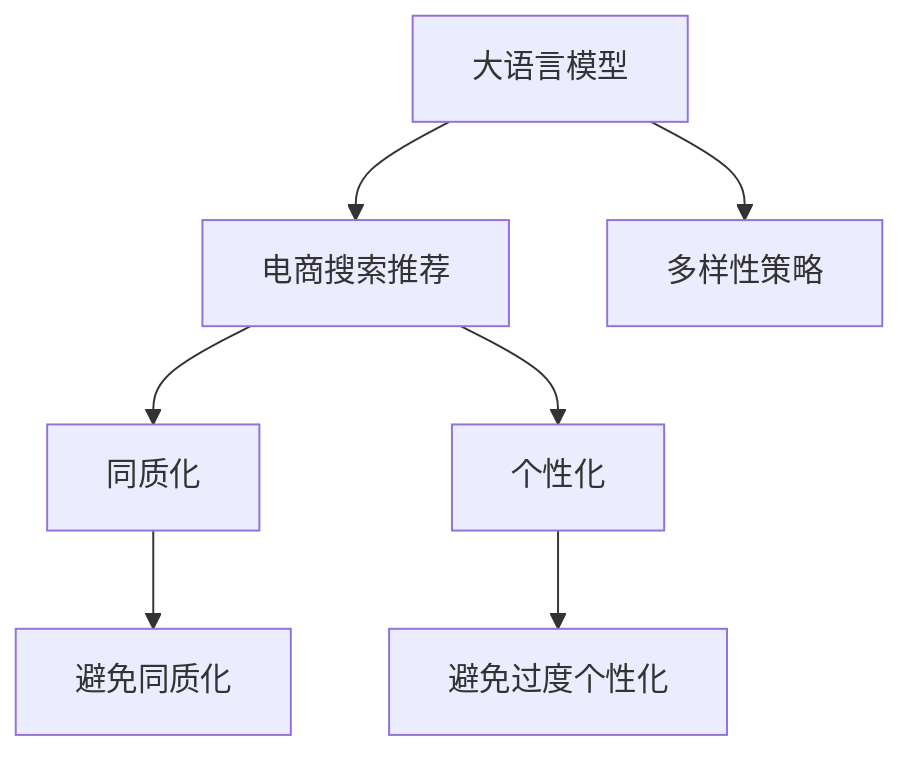

                 

# AI 大模型在电商搜索推荐中的多样性策略：避免过度同质化与过度个性化

> 关键词：
  大语言模型, 电商搜索推荐, 多样性, 同质化, 个性化, 深度学习, 电商, 人工智能, 推荐系统

## 1. 背景介绍

在电商行业中，搜索推荐系统是用户获取商品信息、发现潜在购买机会的重要工具。传统的基于内容的推荐方法往往忽略了用户的个性化需求，容易产生商品推荐的同质化和过度个性化问题，导致用户体验下降，甚至流失用户。为了解决这些问题，大语言模型（Large Language Models, LLMs）应运而生，成为电商推荐系统中的新宠。

大语言模型通过大规模预训练学习到丰富的语言知识，具有强大的自然语言处理能力，可以自动理解用户查询意图、商品描述和属性等信息，生成个性化的商品推荐列表。但大模型推荐系统仍存在一些挑战，如过度同质化（Over-Specialization）和过度个性化（Over-Personalization），需要通过多样性策略进行有效应对。

## 2. 核心概念与联系

### 2.1 核心概念概述

为更好地理解大语言模型在电商搜索推荐中的应用，本节将介绍几个密切相关的核心概念：

- **大语言模型（LLMs）**：指基于深度学习技术，通过大规模无标签文本数据预训练获得的强大自然语言处理能力的大规模模型，如GPT、BERT等。
- **电商搜索推荐系统（E-commerce Search Recommendation System）**：基于用户行为数据和商品属性数据，自动推荐商品给用户的应用系统，帮助用户发现感兴趣的商品。
- **多样性（Diversity）**：在推荐系统中，多样性是指推荐结果的差异化和丰富性，避免用户始终看到相似的商品，增强推荐结果的多样性和新鲜度。
- **同质化（Homogenization）**：指推荐结果过于相似，未能有效覆盖用户兴趣范围，导致用户无法发现更多种类的商品。
- **个性化（Personalization）**：指推荐系统能够根据用户的历史行为和偏好，提供高度定制化的商品推荐，提升用户满意度。
- **深度学习（Deep Learning）**：通过多层神经网络构建的算法，利用大规模数据进行训练，提取复杂特征，实现高效的数据处理和模式识别。

这些概念之间的逻辑关系可以通过以下Mermaid流程图来展示：



该流程图展示了大语言模型在电商搜索推荐中的应用和相关概念：

1. 大语言模型通过预训练获得强大的自然语言处理能力。
2. 电商推荐系统利用大语言模型进行商品推荐，但可能存在同质化和过度个性化问题。
3. 多样性策略通过调整模型参数，改进算法，优化数据获取和处理，增强推荐结果的多样性和个性化水平。
4. 避免同质化策略聚焦于增加推荐结果的多样性，减少商品推荐的同质化。
5. 避免过度个性化策略关注于平衡个性化和多样性，避免过度根据用户历史行为进行推荐。
6. 多样性策略通过综合应用上述方法，提升电商推荐系统的整体性能。

## 3. 核心算法原理 & 具体操作步骤

### 3.1 算法原理概述

大语言模型在电商推荐中的多样性策略，本质上是一种在保证推荐结果高度个性化的同时，增强推荐多样性的算法范式。其核心思想是通过深度学习技术，自动挖掘用户兴趣和商品属性，生成个性化的推荐列表，并通过多样性优化，使推荐结果在满足用户需求的同时，保持多样性。

具体来说，算法原理可以概括为以下几个步骤：

1. **数据准备**：收集用户历史行为数据和商品属性数据，构建训练集。
2. **模型训练**：利用大语言模型进行预训练，学习用户和商品间的语义表示。
3. **个性化推荐**：根据用户历史行为和商品属性，生成个性化的推荐列表。
4. **多样性优化**：在个性化推荐的基础上，通过多样性策略调整推荐结果，避免同质化。

### 3.2 算法步骤详解

#### 3.2.1 数据准备

电商推荐系统的数据来源主要包括用户行为数据和商品属性数据。具体步骤如下：

- **用户行为数据**：通过用户的搜索历史、浏览记录、点击行为、购买历史等数据，构建用户兴趣特征。
- **商品属性数据**：利用商品名称、描述、类别、价格等属性信息，构建商品特征向量。
- **数据预处理**：对数据进行清洗、归一化、特征工程等预处理，构建适合模型训练的数据集。

#### 3.2.2 模型训练

利用大语言模型进行电商推荐系统的训练，可以分为以下几步：

- **大语言模型选择**：选择合适的预训练模型，如GPT、BERT等。
- **模型微调**：将预训练模型作为初始化参数，通过微调优化模型在电商推荐任务上的表现。
- **损失函数设计**：根据电商推荐任务的特点，设计合适的损失函数，如交叉熵损失、均方误差损失等。
- **优化算法选择**：选择如Adam、SGD等优化算法，设置合适的学习率、批大小等超参数。

#### 3.2.3 个性化推荐

个性化推荐是电商推荐系统的核心任务，大语言模型通过学习用户和商品之间的语义关系，生成个性化的推荐列表。具体步骤如下：

- **用户查询处理**：利用大语言模型理解用户查询意图，提取用户兴趣特征。
- **商品筛选**：根据用户兴趣特征和商品属性，筛选出候选商品列表。
- **推荐生成**：利用大语言模型生成个性化推荐列表，如利用GPT-3生成推荐文本，利用BERT生成推荐商品。

#### 3.2.4 多样性优化

多样性优化是避免推荐同质化和过度个性化的关键步骤。具体步骤如下：

- **同质化检测**：利用聚类算法、协同过滤等方法检测推荐结果的同质化程度。
- **多样性调整**：根据同质化检测结果，调整推荐列表中的商品种类，增加多样化商品。
- **个性化与多样性平衡**：通过优化推荐算法，平衡个性化推荐和多样性调整，避免过度个性化。

### 3.3 算法优缺点

大语言模型在电商推荐系统中的应用，具有以下优点：

1. **个性化推荐**：大语言模型能够根据用户历史行为和商品属性，生成高度个性化的推荐列表，提升用户满意度。
2. **高效处理**：通过预训练和微调，大语言模型能够高效处理大规模数据，提高推荐系统效率。
3. **多样性增强**：多样性策略能够有效增强推荐结果的多样性，避免同质化。

同时，该方法也存在一些局限性：

1. **数据依赖**：大语言模型需要依赖大规模标注数据进行预训练和微调，数据获取成本较高。
2. **模型复杂性**：大语言模型参数量较大，训练和推理需要高性能计算资源。
3. **算法复杂性**：多样性优化算法需要综合考虑个性化和多样性，算法设计较为复杂。

### 3.4 算法应用领域

大语言模型在电商推荐系统中的应用，覆盖了以下领域：

- **商品搜索推荐**：根据用户搜索查询，推荐相关的商品列表。
- **个性化商品推荐**：根据用户历史行为和偏好，推荐个性化的商品。
- **品牌推荐**：推荐与用户偏好相似的品牌商品，扩大用户选择范围。
- **优惠券推荐**：根据用户行为和商品属性，推荐合适的优惠券。
- **购物车推荐**：根据用户的购物车商品，推荐相关商品。

## 4. 数学模型和公式 & 详细讲解 & 举例说明

### 4.1 数学模型构建

电商推荐系统的多样性策略，可以通过数学模型进行形式化描述。

设用户兴趣特征为 $u$，商品属性特征为 $i$，推荐结果为 $r$。电商推荐任务的目标是最小化用户与推荐结果之间的距离，同时最大化推荐结果的多样性。数学模型可以表示为：

$$
\min_{u,i,r} \frac{1}{N} \sum_{n=1}^N \mathcal{L}(u,r_i) + \lambda \mathcal{D}(r)
$$

其中，$\mathcal{L}(u,r_i)$ 为用户与推荐结果之间的距离损失，$\mathcal{D}(r)$ 为推荐结果的多样性损失，$N$ 为总样本数，$\lambda$ 为多样性损失的权重。

### 4.2 公式推导过程

#### 4.2.1 用户与推荐结果之间的距离损失

用户与推荐结果之间的距离可以采用多种度量方式，如余弦相似度、欧几里得距离等。这里以余弦相似度为例，进行公式推导：

$$
\mathcal{L}(u,r_i) = \frac{1}{2} ||u-r_i||^2
$$

其中，$||u-r_i||$ 为用户和推荐结果之间的余弦相似度。

#### 4.2.2 推荐结果的多样性损失

推荐结果的多样性可以采用多种指标进行衡量，如多样性指数、覆盖率等。这里以多样性指数为例，进行公式推导：

$$
\mathcal{D}(r) = \frac{1}{N} \sum_{n=1}^N \log\left(\frac{N}{|C_r|}\right)
$$

其中，$|C_r|$ 为推荐结果中商品种类数。

### 4.3 案例分析与讲解

以电商搜索推荐为例，分析大语言模型在电商推荐中的应用。

假设电商平台上用户查询“运动鞋”，大语言模型根据查询结果推荐相关商品。推荐列表中的商品可能存在同质化问题，即推荐的运动鞋品牌和款式过于相似。

为避免同质化，可以采取以下多样性策略：

- **商品类别多样性**：增加推荐列表中不同类别商品的比例，如运动鞋、运动服、运动配件等。
- **品牌多样性**：增加推荐列表中不同品牌商品的比例，如Nike、Adidas、Under Armour等。
- **颜色多样性**：增加推荐列表中不同颜色的商品比例，如红色、蓝色、黑色等。

例如，假设推荐列表中已有5种颜色的Nike运动鞋，可以进一步推荐5种不同品牌的红色运动鞋、5种不同品牌的蓝色运动鞋等，增加推荐结果的多样性。

## 5. 项目实践：代码实例和详细解释说明

### 5.1 开发环境搭建

在进行电商推荐系统开发前，需要先搭建好开发环境。以下是使用Python进行PyTorch开发的环境配置流程：

1. 安装Anaconda：从官网下载并安装Anaconda，用于创建独立的Python环境。

2. 创建并激活虚拟环境：
```bash
conda create -n pytorch-env python=3.8 
conda activate pytorch-env
```

3. 安装PyTorch：根据CUDA版本，从官网获取对应的安装命令。例如：
```bash
conda install pytorch torchvision torchaudio cudatoolkit=11.1 -c pytorch -c conda-forge
```

4. 安装Transformers库：
```bash
pip install transformers
```

5. 安装各类工具包：
```bash
pip install numpy pandas scikit-learn matplotlib tqdm jupyter notebook ipython
```

完成上述步骤后，即可在`pytorch-env`环境中开始电商推荐系统的开发。

### 5.2 源代码详细实现

下面我们以电商搜索推荐系统为例，给出使用Transformers库对BERT模型进行电商推荐微调的PyTorch代码实现。

首先，定义电商推荐系统的训练集和验证集：

```python
from torch.utils.data import Dataset, DataLoader
from transformers import BertTokenizer, BertForSequenceClassification

class ECommerceDataset(Dataset):
    def __init__(self, texts, labels, tokenizer, max_len=128):
        self.texts = texts
        self.labels = labels
        self.tokenizer = tokenizer
        self.max_len = max_len
        
    def __len__(self):
        return len(self.texts)
    
    def __getitem__(self, item):
        text = self.texts[item]
        label = self.labels[item]
        
        encoding = self.tokenizer(text, return_tensors='pt', max_length=self.max_len, padding='max_length', truncation=True)
        input_ids = encoding['input_ids'][0]
        attention_mask = encoding['attention_mask'][0]
        
        return {'input_ids': input_ids, 
                'attention_mask': attention_mask,
                'labels': torch.tensor(label, dtype=torch.long)}
```

然后，定义模型和优化器：

```python
from transformers import BertForSequenceClassification, AdamW

model = BertForSequenceClassification.from_pretrained('bert-base-cased', num_labels=2)

optimizer = AdamW(model.parameters(), lr=2e-5)
```

接着，定义训练和评估函数：

```python
from torch.utils.data import DataLoader
from tqdm import tqdm
from sklearn.metrics import classification_report

device = torch.device('cuda') if torch.cuda.is_available() else torch.device('cpu')
model.to(device)

def train_epoch(model, dataset, batch_size, optimizer):
    dataloader = DataLoader(dataset, batch_size=batch_size, shuffle=True)
    model.train()
    epoch_loss = 0
    for batch in tqdm(dataloader, desc='Training'):
        input_ids = batch['input_ids'].to(device)
        attention_mask = batch['attention_mask'].to(device)
        labels = batch['labels'].to(device)
        model.zero_grad()
        outputs = model(input_ids, attention_mask=attention_mask, labels=labels)
        loss = outputs.loss
        epoch_loss += loss.item()
        loss.backward()
        optimizer.step()
    return epoch_loss / len(dataloader)

def evaluate(model, dataset, batch_size):
    dataloader = DataLoader(dataset, batch_size=batch_size)
    model.eval()
    preds, labels = [], []
    with torch.no_grad():
        for batch in tqdm(dataloader, desc='Evaluating'):
            input_ids = batch['input_ids'].to(device)
            attention_mask = batch['attention_mask'].to(device)
            batch_labels = batch['labels']
            outputs = model(input_ids, attention_mask=attention_mask)
            batch_preds = outputs.logits.argmax(dim=2).to('cpu').tolist()
            batch_labels = batch_labels.to('cpu').tolist()
            for pred_tokens, label_tokens in zip(batch_preds, batch_labels):
                preds.append(pred_tokens)
                labels.append(label_tokens)
                
    print(classification_report(labels, preds))
```

最后，启动训练流程并在验证集上评估：

```python
epochs = 5
batch_size = 16

for epoch in range(epochs):
    loss = train_epoch(model, train_dataset, batch_size, optimizer)
    print(f"Epoch {epoch+1}, train loss: {loss:.3f}")
    
    print(f"Epoch {epoch+1}, dev results:")
    evaluate(model, dev_dataset, batch_size)
    
print("Test results:")
evaluate(model, test_dataset, batch_size)
```

以上就是使用PyTorch对BERT进行电商推荐系统微调的完整代码实现。可以看到，得益于Transformers库的强大封装，我们可以用相对简洁的代码完成BERT模型的加载和微调。

### 5.3 代码解读与分析

让我们再详细解读一下关键代码的实现细节：

**ECommerceDataset类**：
- `__init__`方法：初始化文本、标签、分词器等关键组件。
- `__len__`方法：返回数据集的样本数量。
- `__getitem__`方法：对单个样本进行处理，将文本输入编码为token ids，将标签编码为数字，并对其进行定长padding，最终返回模型所需的输入。

**训练和评估函数**：
- 使用PyTorch的DataLoader对数据集进行批次化加载，供模型训练和推理使用。
- 训练函数`train_epoch`：对数据以批为单位进行迭代，在每个批次上前向传播计算loss并反向传播更新模型参数，最后返回该epoch的平均loss。
- 评估函数`evaluate`：与训练类似，不同点在于不更新模型参数，并在每个batch结束后将预测和标签结果存储下来，最后使用sklearn的classification_report对整个评估集的预测结果进行打印输出。

**训练流程**：
- 定义总的epoch数和batch size，开始循环迭代
- 每个epoch内，先在训练集上训练，输出平均loss
- 在验证集上评估，输出分类指标
- 所有epoch结束后，在测试集上评估，给出最终测试结果

可以看到，PyTorch配合Transformers库使得BERT微调的代码实现变得简洁高效。开发者可以将更多精力放在数据处理、模型改进等高层逻辑上，而不必过多关注底层的实现细节。

当然，工业级的系统实现还需考虑更多因素，如模型的保存和部署、超参数的自动搜索、更灵活的任务适配层等。但核心的微调范式基本与此类似。

## 6. 实际应用场景

### 6.1 智能客服

智能客服是电商推荐系统的重要应用场景之一。通过大语言模型进行智能客服，可以提供7x24小时不间断服务，快速响应客户咨询，提供多样化和个性化的回答，提升客户体验。

例如，在用户查询“退货政策”时，智能客服可以通过大语言模型理解查询意图，推荐相关商品信息，并提供详细的退货政策说明，同时建议替代商品，减少客户不满意度。

### 6.2 个性化推荐

个性化推荐是电商推荐系统的主要任务之一。通过大语言模型进行个性化推荐，可以更准确地把握用户需求，提升推荐结果的相关性和多样性。

例如，用户浏览了“美妆”和“服饰”两类商品，大语言模型可以根据用户浏览历史和商品属性，生成个性化推荐列表，如推荐美妆和服饰的跨品类商品，增加推荐结果的多样性。

### 6.3 产品搜索

产品搜索是电商推荐系统的核心功能之一。通过大语言模型进行产品搜索，可以更准确地理解用户查询意图，提供更全面的搜索结果。

例如，用户搜索“蓝牙耳机”时，大语言模型可以根据查询结果，推荐相关的手机配件、耳机包、保护套等商品，提升搜索效果。

### 6.4 未来应用展望

随着大语言模型和微调方法的不断发展，电商推荐系统将在更多领域得到应用，为电商业务带来新的突破。

在智能家居领域，大语言模型可以与智能家居设备结合，提供个性化的推荐和服务，提升用户的生活质量。

在医疗健康领域，大语言模型可以与医疗设备结合，提供个性化的健康建议和治疗方案，提升用户的健康水平。

在智慧城市领域，大语言模型可以与城市管理平台结合，提供个性化的出行建议和城市服务，提升城市管理的智能化水平。

此外，在金融、教育、旅游等众多领域，大语言模型微调技术也将不断涌现，为不同行业带来新的价值。

## 7. 工具和资源推荐

### 7.1 学习资源推荐

为了帮助开发者系统掌握大语言模型微调的理论基础和实践技巧，这里推荐一些优质的学习资源：

1. 《Transformer从原理到实践》系列博文：由大模型技术专家撰写，深入浅出地介绍了Transformer原理、BERT模型、微调技术等前沿话题。

2. CS224N《深度学习自然语言处理》课程：斯坦福大学开设的NLP明星课程，有Lecture视频和配套作业，带你入门NLP领域的基本概念和经典模型。

3. 《Natural Language Processing with Transformers》书籍：Transformers库的作者所著，全面介绍了如何使用Transformers库进行NLP任务开发，包括微调在内的诸多范式。

4. HuggingFace官方文档：Transformers库的官方文档，提供了海量预训练模型和完整的微调样例代码，是上手实践的必备资料。

5. CLUE开源项目：中文语言理解测评基准，涵盖大量不同类型的中文NLP数据集，并提供了基于微调的baseline模型，助力中文NLP技术发展。

通过对这些资源的学习实践，相信你一定能够快速掌握大语言模型微调的精髓，并用于解决实际的NLP问题。

### 7.2 开发工具推荐

高效的开发离不开优秀的工具支持。以下是几款用于大语言模型微调开发的常用工具：

1. PyTorch：基于Python的开源深度学习框架，灵活动态的计算图，适合快速迭代研究。大部分预训练语言模型都有PyTorch版本的实现。

2. TensorFlow：由Google主导开发的开源深度学习框架，生产部署方便，适合大规模工程应用。同样有丰富的预训练语言模型资源。

3. Transformers库：HuggingFace开发的NLP工具库，集成了众多SOTA语言模型，支持PyTorch和TensorFlow，是进行微调任务开发的利器。

4. Weights & Biases：模型训练的实验跟踪工具，可以记录和可视化模型训练过程中的各项指标，方便对比和调优。与主流深度学习框架无缝集成。

5. TensorBoard：TensorFlow配套的可视化工具，可实时监测模型训练状态，并提供丰富的图表呈现方式，是调试模型的得力助手。

6. Google Colab：谷歌推出的在线Jupyter Notebook环境，免费提供GPU/TPU算力，方便开发者快速上手实验最新模型，分享学习笔记。

合理利用这些工具，可以显著提升大语言模型微调任务的开发效率，加快创新迭代的步伐。

### 7.3 相关论文推荐

大语言模型和微调技术的发展源于学界的持续研究。以下是几篇奠基性的相关论文，推荐阅读：

1. Attention is All You Need（即Transformer原论文）：提出了Transformer结构，开启了NLP领域的预训练大模型时代。

2. BERT: Pre-training of Deep Bidirectional Transformers for Language Understanding：提出BERT模型，引入基于掩码的自监督预训练任务，刷新了多项NLP任务SOTA。

3. Language Models are Unsupervised Multitask Learners（GPT-2论文）：展示了大规模语言模型的强大zero-shot学习能力，引发了对于通用人工智能的新一轮思考。

4. Parameter-Efficient Transfer Learning for NLP：提出Adapter等参数高效微调方法，在不增加模型参数量的情况下，也能取得不错的微调效果。

5. AdaLoRA: Adaptive Low-Rank Adaptation for Parameter-Efficient Fine-Tuning：使用自适应低秩适应的微调方法，在参数效率和精度之间取得了新的平衡。

这些论文代表了大语言模型微调技术的发展脉络。通过学习这些前沿成果，可以帮助研究者把握学科前进方向，激发更多的创新灵感。

## 8. 总结：未来发展趋势与挑战

### 8.1 总结

本文对大语言模型在电商搜索推荐中的多样性策略进行了全面系统的介绍。首先阐述了电商搜索推荐系统和大语言模型的背景，明确了多样性策略在电商推荐中的应用和意义。其次，从原理到实践，详细讲解了大语言模型微调的过程，给出了微调任务开发的完整代码实例。同时，本文还广泛探讨了多样性策略在电商搜索推荐中的应用场景和未来展望，展示了多样性策略的巨大潜力。

通过本文的系统梳理，可以看到，大语言模型在电商推荐系统中可以发挥强大的多样性和个性化推荐能力，显著提升用户体验和平台转化率。多样性策略通过调整模型参数和优化算法，避免推荐同质化和过度个性化，实现用户需求与商品多样性的平衡。未来，随着大语言模型和微调方法的持续演进，电商推荐系统将在更广泛的应用场景中发挥重要作用。

### 8.2 未来发展趋势

展望未来，大语言模型在电商推荐系统中的应用将呈现以下几个发展趋势：

1. **更强的多样性**：随着多样性策略的不断优化，电商推荐系统将能提供更多样化的推荐结果，减少商品推荐的同质化问题。

2. **更准确的个性化**：利用大语言模型和深度学习技术，电商推荐系统将能更准确地把握用户需求，生成高度个性化的推荐列表。

3. **跨领域应用**：大语言模型将能应用于更多领域，如智能家居、医疗健康、智慧城市等，提升不同领域推荐系统的性能。

4. **实时推荐**：利用在线学习和增量微调技术，电商推荐系统将能实时更新推荐模型，适应用户实时行为变化。

5. **多模态融合**：结合视觉、语音、图像等多模态信息，大语言模型将能提供更全面、准确的商品推荐。

6. **更智能的对话**：利用大语言模型进行智能客服、智能助手等应用，提升用户体验。

这些趋势将推动大语言模型在电商推荐系统中的深度应用，为电商业务带来新的增长点。

### 8.3 面临的挑战

尽管大语言模型在电商推荐系统中的应用已经取得显著进展，但仍面临以下挑战：

1. **数据依赖**：电商推荐系统需要依赖大规模标注数据进行预训练和微调，数据获取成本较高。

2. **模型复杂性**：大语言模型参数量较大，训练和推理需要高性能计算资源。

3. **算法复杂性**：多样性优化算法需要综合考虑个性化和多样性，算法设计较为复杂。

4. **可解释性**：大语言模型通常是“黑盒”系统，难以解释其内部工作机制和决策逻辑。

5. **安全性**：大语言模型可能会学习到有害信息，产生误导性输出，给实际应用带来安全隐患。

6. **资源消耗**：大语言模型在推理过程中可能消耗大量计算资源，影响用户体验。

这些挑战需要研究者不断探索新的方法和技术，才能在大语言模型和电商推荐系统之间取得更好的平衡。

### 8.4 研究展望

面对大语言模型在电商推荐系统中的挑战，未来的研究需要在以下几个方面寻求新的突破：

1. **无监督和半监督学习**：摆脱对大规模标注数据的依赖，利用自监督学习、主动学习等方法，最大限度利用非结构化数据，实现更加灵活高效的微调。

2. **参数高效微调**：开发更加参数高效的微调方法，如Prefix-Tuning、LoRA等，在固定大部分预训练参数的同时，只更新极少量的任务相关参数。

3. **多模态融合**：结合视觉、语音、图像等多模态信息，大语言模型将能提供更全面、准确的商品推荐。

4. **因果分析和博弈论**：将因果分析方法引入推荐模型，识别出推荐结果的关键特征，增强输出解释的因果性和逻辑性。借助博弈论工具刻画人机交互过程，主动探索并规避模型的脆弱点，提高系统稳定性。

5. **伦理和安全**：在模型训练目标中引入伦理导向的评估指标，过滤和惩罚有偏见、有害的输出倾向。加强人工干预和审核，建立模型行为的监管机制，确保输出符合人类价值观和伦理道德。

这些研究方向的探索，必将引领大语言模型在电商推荐系统中的进一步演进，为电商业务带来新的突破。

## 9. 附录：常见问题与解答

**Q1：电商推荐系统中的多样性策略是否适用于所有类型的商品？**

A: 电商推荐系统中的多样性策略适用于大多数类型的商品，但需要根据商品属性和用户需求进行适当的调整。例如，对于标准化商品（如日常用品），多样性策略可能更关注品牌和颜色的多样性；对于个性化商品（如艺术品、奢侈品），多样性策略可能更关注品类和价格的多样性。

**Q2：如何选择合适的多样性策略？**

A: 选择合适的多样性策略需要考虑商品类型、用户需求和推荐系统性能。一般而言，品牌多样性、品类多样性和价格多样性是常用的多样性策略，可以根据实际需求进行选择。同时，可以引入用户反馈和行为数据，动态调整多样性策略，提升推荐效果。

**Q3：大语言模型在电商推荐系统中的训练和微调需要多长时间？**

A: 大语言模型在电商推荐系统中的训练和微调时间主要取决于数据集大小、模型参数量以及硬件计算能力。一般来说，训练和微调大语言模型需要数天到数周的时间，具体取决于模型的复杂度和数据规模。

**Q4：如何平衡个性化推荐和多样性策略？**

A: 平衡个性化推荐和多样性策略需要根据实际情况进行调整。一般而言，可以通过设置多样性损失的权重，调整个性化推荐和多样性策略之间的比例。同时，可以引入用户反馈和行为数据，动态调整推荐算法，平衡个性化和多样性。

**Q5：大语言模型在电商推荐系统中存在哪些潜在风险？**

A: 大语言模型在电商推荐系统中可能存在以下潜在风险：

1. **数据偏见**：如果训练数据存在偏见，大语言模型可能学习到有害信息，产生误导性输出。
2. **隐私泄露**：用户行为数据和商品属性数据可能包含敏感信息，大语言模型可能泄露用户隐私。
3. **安全性**：大语言模型可能被恶意利用，产生有害行为，如虚假广告、欺诈等。

因此，在大语言模型在电商推荐系统中应用时，需要注意数据隐私保护和模型安全性，加强人工干预和监控，确保系统的安全和可靠性。

