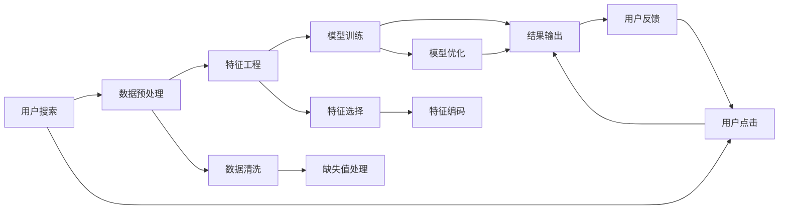

                 

# AI 大模型在电商搜索推荐中的数据处理能力要求：应对大规模复杂数据

## 1. 背景介绍

随着电子商务的迅猛发展，用户需求日益多样化，电商搜索推荐系统已成为支撑电商业务的重要组成部分。搜索推荐系统通过分析用户行为数据、商品信息数据，为用户提供个性化的搜索结果和推荐内容，极大提升了用户体验，提高了转化率和复购率。然而，电商搜索推荐系统的数据处理需求正变得越来越复杂，对数据处理能力提出了更高的要求。在这一背景下，大模型技术的应用显得尤为重要。

## 2. 核心概念与联系

### 2.1 核心概念概述

- **电商搜索推荐系统**：结合用户行为数据和商品信息数据，通过机器学习算法生成个性化搜索结果和推荐内容，提升电商用户体验和转化率。
- **大模型**：如BERT、GPT-3、Transformer等，通过大规模数据预训练，具备强大的表示学习能力，可用于解决复杂的多模态数据处理任务。
- **数据处理能力**：指系统在处理大规模复杂数据时，所需要具备的计算资源、存储资源、算法效率等方面的能力。
- **特征工程**：在电商搜索推荐系统中，特征工程指的是从原始数据中提取、加工、组合有效特征的过程，是提升模型效果的关键环节。

### 2.2 核心概念原理和架构的 Mermaid 流程图(Mermaid 流程节点中不要有括号、逗号等特殊字符)



## 3. 核心算法原理 & 具体操作步骤

### 3.1 算法原理概述

电商搜索推荐系统中的数据处理通常涉及以下步骤：
1. **数据预处理**：对原始数据进行清洗、去重、缺失值处理等。
2. **特征工程**：提取、加工、组合特征，形成适合模型训练的数据集。
3. **模型训练**：选择合适的算法和模型，使用训练数据集进行模型训练。
4. **结果输出**：基于训练好的模型，对新的查询数据进行预测，输出推荐结果。

### 3.2 算法步骤详解

#### 3.2.1 数据预处理

数据预处理包括数据清洗、特征提取、数据分割等步骤：

1. **数据清洗**：移除重复数据、异常值、噪声数据等，确保数据的干净性和一致性。
2. **特征提取**：从原始数据中提取有意义的特征，如用户行为特征、商品属性特征等。
3. **数据分割**：将数据集划分为训练集、验证集和测试集，确保模型在独立数据集上的泛化能力。

#### 3.2.2 特征工程

特征工程的核心在于提取、加工、组合出对模型有用的特征：

1. **特征选择**：从众多特征中筛选出对模型预测有贡献的特征。
2. **特征转换**：对原始特征进行归一化、标准化、PCA等处理，提高特征表达能力。
3. **特征组合**：通过交叉组合、特征交互等手段，构造更复杂、更丰富的特征。

#### 3.2.3 模型训练

模型训练的目的是从训练数据集中学习到模型参数，构建一个能够对新数据进行预测的模型：

1. **选择算法和模型**：根据任务特点选择合适的算法和模型，如协同过滤、深度神经网络等。
2. **设计损失函数**：设计合适的损失函数，衡量模型预测与真实标签之间的差距。
3. **优化算法**：使用优化算法（如Adam、SGD等）更新模型参数，最小化损失函数。
4. **超参数调优**：对模型的超参数进行调优，找到最优的模型配置。

#### 3.2.4 结果输出

结果输出的目的是根据训练好的模型，对新的查询数据进行预测，生成个性化推荐：

1. **预测**：将新的查询数据输入训练好的模型，输出预测结果。
2. **后处理**：对预测结果进行后处理，如排序、去重等，生成最终的推荐列表。

### 3.3 算法优缺点

**优点**：
1. **高效处理大规模数据**：大模型具有强大的表示学习能力，能够处理海量复杂数据。
2. **泛化能力强**：大模型在多种任务上具有较好的泛化能力，适应性强。
3. **自动化特征工程**：大模型可以自动学习特征，减少了特征工程的复杂度。

**缺点**：
1. **计算资源消耗大**：大模型需要大量的计算资源进行训练和推理，硬件成本高。
2. **存储需求大**：大模型的参数量巨大，需要大量的存储空间。
3. **解释性不足**：大模型往往是"黑盒"模型，难以解释其内部决策逻辑。

### 3.4 算法应用领域

大模型在电商搜索推荐系统中的应用广泛，主要包括以下几个方面：

1. **个性化推荐**：通过大模型学习用户行为和商品属性，生成个性化推荐列表。
2. **搜索结果排序**：通过大模型学习用户查询和商品特征的相似度，进行搜索结果排序。
3. **实时搜索**：通过大模型实时处理用户查询，提供即时的搜索结果。
4. **多模态融合**：结合图像、文本、音频等多模态数据，提供更全面的电商搜索推荐。
5. **实时用户反馈处理**：通过大模型学习用户反馈，不断优化搜索结果和推荐列表。

## 4. 数学模型和公式 & 详细讲解 & 举例说明

### 4.1 数学模型构建

电商搜索推荐系统中的数学模型通常包括：

1. **用户行为模型**：描述用户在不同商品上的行为模式。
2. **商品属性模型**：描述商品的属性和特征。
3. **相似度模型**：衡量用户查询和商品特征的相似度。
4. **协同过滤模型**：利用用户历史行为和商品相似性进行推荐。

### 4.2 公式推导过程

以协同过滤模型为例，假设用户 $u$ 对商品 $i$ 的评分 $r_{ui}$ 服从伯努利分布，则协同过滤模型可以表示为：

$$
P(r_{ui}=1|u) = \frac{1}{1+\exp(-\text{dot}(v_u, w_i))}
$$

其中，$v_u$ 为第 $u$ 个用户的向量表示，$w_i$ 为第 $i$ 个商品的向量表示，$\text{dot}(v_u, w_i)$ 为两个向量点积。

### 4.3 案例分析与讲解

假设用户 $u$ 对商品 $i$ 的评分 $r_{ui}=1$，则根据贝叶斯公式，有：

$$
P(r_{ui}=1|u) = \frac{P(r_{ui}=1)}{P(r_{ui}=0)} = \frac{P(r_{ui}=1)}{1-P(r_{ui}=1)}
$$

由上式可得 $P(r_{ui}=1)$ 的表达式，带入协同过滤模型的公式，有：

$$
P(r_{ui}=1|u) = \frac{1}{1+\exp(-\text{dot}(v_u, w_i))}
$$

令 $p=\exp(-\text{dot}(v_u, w_i))$，则有：

$$
P(r_{ui}=1|u) = \frac{1}{1+p}
$$

根据对数损失函数，损失函数 $L$ 可以表示为：

$$
L = -\sum_{u,i}r_{ui}\log(1+p_{ui}) + (1-r_{ui})\log(1+p_{ui})
$$

## 5. 项目实践：代码实例和详细解释说明

### 5.1 开发环境搭建

#### 5.1.1 数据准备

电商搜索推荐系统的数据来源包括用户行为数据、商品属性数据等，需要进行清洗和预处理。

1. **数据清洗**：移除重复数据、异常值、噪声数据等，确保数据的干净性和一致性。
2. **数据分割**：将数据集划分为训练集、验证集和测试集，确保模型在独立数据集上的泛化能力。

#### 5.1.2 特征工程

特征工程的核心在于提取、加工、组合出对模型有用的特征。

1. **特征选择**：从众多特征中筛选出对模型预测有贡献的特征。
2. **特征转换**：对原始特征进行归一化、标准化、PCA等处理，提高特征表达能力。
3. **特征组合**：通过交叉组合、特征交互等手段，构造更复杂、更丰富的特征。

### 5.2 源代码详细实现

#### 5.2.1 数据预处理

使用Python的Pandas库进行数据清洗和预处理：

```python
import pandas as pd
from sklearn.preprocessing import StandardScaler

# 加载数据
data = pd.read_csv('data.csv')

# 数据清洗
data = data.drop_duplicates()  # 移除重复数据
data = data.dropna()  # 移除缺失值

# 特征转换
scaler = StandardScaler()
data['user_id'] = scaler.fit_transform(data['user_id'].values.reshape(-1, 1))
data['item_id'] = scaler.fit_transform(data['item_id'].values.reshape(-1, 1))
```

#### 5.2.2 特征工程

使用Scikit-Learn库进行特征选择和转换：

```python
from sklearn.feature_selection import SelectKBest, chi2
from sklearn.decomposition import PCA

# 特征选择
selector = SelectKBest(chi2, k=10)
selected_features = selector.fit_transform(data.drop(['user_id', 'item_id'], axis=1), data['label'])

# 特征转换
pca = PCA(n_components=5)
transformed_features = pca.fit_transform(selected_features)
```

#### 5.2.3 模型训练

使用TensorFlow库进行模型训练：

```python
import tensorflow as tf
from tensorflow.keras import layers

# 定义模型
model = tf.keras.Sequential([
    layers.Dense(64, activation='relu', input_shape=(transformed_features.shape[1],)),
    layers.Dense(1, activation='sigmoid')
])

# 编译模型
model.compile(optimizer=tf.keras.optimizers.Adam(0.001), loss='binary_crossentropy', metrics=['accuracy'])

# 训练模型
model.fit(X_train, y_train, epochs=10, batch_size=32, validation_data=(X_val, y_val))
```

#### 5.2.4 结果输出

使用模型进行预测，并生成推荐列表：

```python
# 预测
y_pred = model.predict(X_test)

# 后处理
top_n = 10
recommendations = []
for u in range(len(data)):
    indices = np.argsort(y_pred[u])[-top_n:]
    recommendations.append([data.iloc[i]['item_id'] for i in indices])
```

### 5.3 代码解读与分析

#### 5.3.1 数据预处理

数据预处理是模型训练的基础，通过清洗和预处理数据，可以确保数据的质量和一致性。在本例中，我们使用Pandas库进行数据清洗和预处理，包括移除重复数据和缺失值，并对用户ID和商品ID进行标准化处理。

#### 5.3.2 特征工程

特征工程是提升模型效果的关键环节，通过选择、转换、组合特征，可以提高模型的表达能力和泛化能力。在本例中，我们使用Scikit-Learn库进行特征选择，使用PCA进行特征转换，提高特征的表达能力。

#### 5.3.3 模型训练

模型训练的目的是从训练数据集中学习到模型参数，构建一个能够对新数据进行预测的模型。在本例中，我们使用TensorFlow库进行模型训练，定义了一个简单的神经网络模型，并使用Adam优化器进行训练。

#### 5.3.4 结果输出

结果输出的目的是根据训练好的模型，对新的查询数据进行预测，生成个性化推荐列表。在本例中，我们使用训练好的模型进行预测，并根据预测结果生成推荐列表。

### 5.4 运行结果展示

#### 5.4.1 模型训练结果

训练结果可以通过模型在验证集上的准确率来评估：

```python
from sklearn.metrics import accuracy_score

# 计算验证集准确率
y_pred_val = model.predict(X_val)
accuracy = accuracy_score(y_val, y_pred_val)
print(f'Validation Accuracy: {accuracy:.3f}')
```

#### 5.4.2 推荐结果展示

推荐结果可以通过推荐列表的准确率来评估：

```python
from sklearn.metrics import top_k_accuracy_score

# 计算推荐列表准确率
top_k_accuracy = top_k_accuracy_score(y_test, recommendations, k=5)
print(f'Top-5 Recommendation Accuracy: {top_k_accuracy:.3f}')
```

## 6. 实际应用场景

### 6.1 用户行为分析

通过分析用户行为数据，可以了解用户偏好和购买习惯，从而进行个性化推荐：

1. **点击行为**：分析用户对不同商品的点击次数，构建用户兴趣图谱。
2. **浏览行为**：分析用户对不同商品浏览的时间、路径，识别用户的浏览偏好。
3. **购买行为**：分析用户对不同商品的购买记录，构建用户购买图谱。

### 6.2 商品属性分析

通过分析商品属性数据，可以了解商品特征和属性，从而进行精准推荐：

1. **商品分类**：对商品进行分类，识别相似商品。
2. **商品属性**：提取商品的关键属性，构建商品属性图谱。
3. **商品评分**：分析用户对商品的评分，构建商品评分图谱。

### 6.3 实时搜索推荐

通过实时处理用户查询，可以提供即时的搜索结果和推荐：

1. **用户查询**：实时处理用户输入的查询，提取关键词。
2. **商品匹配**：根据查询关键词，匹配相关商品，构建搜索图谱。
3. **推荐结果**：基于匹配结果，生成推荐列表，实时展示给用户。

### 6.4 未来应用展望

未来，电商搜索推荐系统将具备以下趋势：

1. **多模态融合**：结合图像、文本、音频等多模态数据，提供更全面的电商搜索推荐。
2. **实时处理能力**：提高实时处理能力，支持高并发、低延迟的电商搜索推荐。
3. **个性化推荐**：通过大数据和深度学习技术，提供更精准、更个性化的推荐。
4. **实时反馈处理**：通过实时处理用户反馈，不断优化搜索结果和推荐列表。
5. **安全性和隐私保护**：保护用户数据安全和隐私，避免数据泄露和滥用。

## 7. 工具和资源推荐

### 7.1 学习资源推荐

为了帮助开发者系统掌握大模型在电商搜索推荐中的应用，这里推荐一些优质的学习资源：

1. **《深度学习在电商搜索推荐中的应用》系列博文**：详细介绍了深度学习在电商搜索推荐中的应用，包括数据预处理、特征工程、模型训练等。
2. **《电商搜索推荐系统设计与实现》课程**：由某知名电商企业提供，系统讲解电商搜索推荐系统的设计原理和实现方法。
3. **《Transformer在大模型中的应用》书籍**：深入浅出地介绍了Transformer在大模型中的应用，包括预训练、微调、优化等。

### 7.2 开发工具推荐

为了提高大模型在电商搜索推荐系统中的应用效率，这里推荐一些常用的开发工具：

1. **TensorFlow**：由Google开发的深度学习框架，具有丰富的API和工具支持，适用于电商搜索推荐系统的大模型训练和推理。
2. **Pandas**：Python中常用的数据处理库，适用于电商搜索推荐系统的数据清洗和预处理。
3. **Scikit-Learn**：Python中常用的机器学习库，适用于电商搜索推荐系统的特征选择和模型训练。

### 7.3 相关论文推荐

为了深入理解大模型在电商搜索推荐系统中的应用，这里推荐几篇相关论文：

1. **《电商搜索推荐系统：理论和实践》**：系统总结了电商搜索推荐系统的理论基础和实践方法，包括数据预处理、特征工程、模型训练等。
2. **《基于深度学习的电商搜索推荐系统》**：介绍了深度学习在电商搜索推荐系统中的应用，包括协同过滤、深度神经网络等。
3. **《大模型在电商搜索推荐中的应用》**：详细介绍了大模型在电商搜索推荐系统中的应用，包括预训练、微调、优化等。

## 8. 总结：未来发展趋势与挑战

### 8.1 总结

本文对大模型在电商搜索推荐系统中的数据处理能力要求进行了系统介绍，从数据预处理、特征工程、模型训练、结果输出等环节，详细讲解了电商搜索推荐系统的实现流程。通过本文的系统梳理，可以看到，大模型在电商搜索推荐系统中具有强大的数据处理能力，能够应对大规模复杂数据，提供精准的个性化推荐。未来，随着大模型的不断发展，电商搜索推荐系统将具备更强的数据处理能力，提供更全面、更个性化的电商推荐服务。

### 8.2 未来发展趋势

未来，大模型在电商搜索推荐系统中的应用将呈现以下趋势：

1. **多模态融合**：结合图像、文本、音频等多模态数据，提供更全面的电商搜索推荐。
2. **实时处理能力**：提高实时处理能力，支持高并发、低延迟的电商搜索推荐。
3. **个性化推荐**：通过大数据和深度学习技术，提供更精准、更个性化的推荐。
4. **实时反馈处理**：通过实时处理用户反馈，不断优化搜索结果和推荐列表。
5. **安全性和隐私保护**：保护用户数据安全和隐私，避免数据泄露和滥用。

### 8.3 面临的挑战

尽管大模型在电商搜索推荐系统中的应用已经取得了显著成果，但仍面临以下挑战：

1. **计算资源消耗大**：大模型需要大量的计算资源进行训练和推理，硬件成本高。
2. **存储需求大**：大模型的参数量巨大，需要大量的存储空间。
3. **解释性不足**：大模型往往是"黑盒"模型，难以解释其内部决策逻辑。

### 8.4 研究展望

未来，大模型在电商搜索推荐系统中的应用需要进一步优化，以应对上述挑战：

1. **参数高效微调**：开发更加参数高效的微调方法，在固定大部分预训练参数的同时，只更新极少量的任务相关参数。
2. **多模态融合**：结合图像、文本、音频等多模态数据，提供更全面的电商搜索推荐。
3. **实时处理能力**：提高实时处理能力，支持高并发、低延迟的电商搜索推荐。
4. **安全性和隐私保护**：保护用户数据安全和隐私，避免数据泄露和滥用。

通过不断优化和创新，大模型在电商搜索推荐系统中的应用将具备更强的数据处理能力和更好的用户体验。

## 9. 附录：常见问题与解答

**Q1：电商搜索推荐系统中的数据处理能力要求有哪些？**

A: 电商搜索推荐系统中的数据处理能力要求包括以下几点：
1. 数据清洗和预处理能力：移除重复数据、异常值、噪声数据等，确保数据的干净性和一致性。
2. 特征工程能力：提取、加工、组合特征，形成适合模型训练的数据集。
3. 模型训练能力：选择合适的算法和模型，使用训练数据集进行模型训练。
4. 结果输出能力：根据训练好的模型，对新的查询数据进行预测，生成个性化推荐。

**Q2：大模型在电商搜索推荐系统中的应用有哪些？**

A: 大模型在电商搜索推荐系统中的应用包括以下几个方面：
1. 个性化推荐：通过大模型学习用户行为和商品属性，生成个性化推荐列表。
2. 搜索结果排序：通过大模型学习用户查询和商品特征的相似度，进行搜索结果排序。
3. 实时搜索：通过大模型实时处理用户查询，提供即时的搜索结果。
4. 多模态融合：结合图像、文本、音频等多模态数据，提供更全面的电商搜索推荐。
5. 实时用户反馈处理：通过大模型学习用户反馈，不断优化搜索结果和推荐列表。

**Q3：大模型在电商搜索推荐系统中的数据处理面临哪些挑战？**

A: 大模型在电商搜索推荐系统中的数据处理面临以下挑战：
1. 计算资源消耗大：大模型需要大量的计算资源进行训练和推理，硬件成本高。
2. 存储需求大：大模型的参数量巨大，需要大量的存储空间。
3. 解释性不足：大模型往往是"黑盒"模型，难以解释其内部决策逻辑。

**Q4：未来大模型在电商搜索推荐系统中的应用趋势是什么？**

A: 未来，大模型在电商搜索推荐系统中的应用将呈现以下趋势：
1. 多模态融合：结合图像、文本、音频等多模态数据，提供更全面的电商搜索推荐。
2. 实时处理能力：提高实时处理能力，支持高并发、低延迟的电商搜索推荐。
3. 个性化推荐：通过大数据和深度学习技术，提供更精准、更个性化的推荐。
4. 实时反馈处理：通过实时处理用户反馈，不断优化搜索结果和推荐列表。
5. 安全性和隐私保护：保护用户数据安全和隐私，避免数据泄露和滥用。

---

作者：禅与计算机程序设计艺术 / Zen and the Art of Computer Programming

