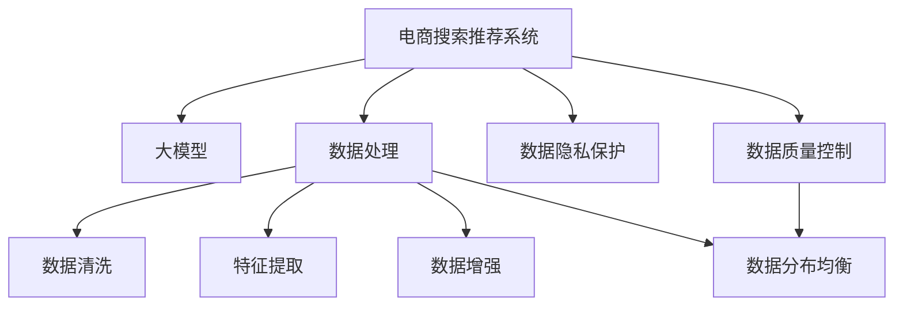

                 

# AI 大模型在电商搜索推荐中的数据处理能力要求：应对大规模复杂数据

> 关键词：电商搜索推荐,大模型,数据处理,复杂数据,大数据,机器学习,深度学习,自然语言处理

## 1. 背景介绍

### 1.1 问题由来

随着电商行业的蓬勃发展，在线搜索和推荐系统已成为用户体验的关键组成部分。高效、精准的搜索推荐系统能够帮助用户快速找到所需商品，提升购物体验和满意度。近年来，大模型技术在电商搜索推荐领域得到了广泛应用，大大提升了搜索推荐系统的性能和效果。

然而，电商领域的搜索推荐系统面临的数据规模和复杂度极高，需要处理海量多维数据，涵盖用户行为、商品属性、交易记录等多个方面。如何有效处理大规模复杂数据，是大模型在电商搜索推荐中需要解决的核心问题。

### 1.2 问题核心关键点

- **数据规模**：电商搜索推荐系统需要处理的用户行为数据、商品属性数据、交易记录等规模巨大，动辄亿级以上。
- **数据多样性**：涉及的文本、数值、时间戳等多种数据类型，数据结构复杂。
- **数据实时性**：电商领域的用户行为数据实时生成，系统需要具备实时处理能力。
- **数据隐私**：用户行为数据包含大量隐私信息，需要采取有效的隐私保护措施。
- **数据质量**：数据的完整性、准确性和一致性问题，直接影响模型的训练和预测效果。
- **数据分布**：用户行为数据分布具有明显的不平衡性，导致模型面临类别不均衡问题。

## 2. 核心概念与联系

### 2.1 核心概念概述

为了更好地理解大模型在电商搜索推荐中的数据处理能力要求，本节将介绍几个关键概念及其相互联系：

- **电商搜索推荐系统**：通过分析用户行为数据，为用户提供商品搜索结果和个性化推荐，提升用户满意度和转化率。
- **大模型**：如BERT、GPT-3等大规模预训练语言模型，具备强大的语言理解和生成能力。
- **数据处理**：包括数据清洗、特征提取、数据增强、数据分布均衡等，是大模型应用的基础。
- **数据隐私保护**：通过差分隐私、数据匿名化等技术，保护用户隐私，满足数据使用合规要求。
- **数据质量控制**：保证数据完整性、准确性和一致性，提高模型训练和预测的可靠性。

这些核心概念之间的逻辑关系可以通过以下Mermaid流程图来展示：



这个流程图展示了电商搜索推荐系统中的关键数据处理流程：

1. 电商搜索推荐系统通过大模型进行用户意图识别和商品推荐。
2. 数据处理是支撑大模型应用的基础，包括数据清洗、特征提取、数据增强、数据分布均衡等。
3. 数据隐私保护和数据质量控制是大模型应用必须考虑的关键因素。

## 3. 核心算法原理 & 具体操作步骤
### 3.1 算法原理概述

大模型在电商搜索推荐中的应用，本质上是基于大数据和复杂数据的机器学习和深度学习任务。其核心思想是：通过大模型学习用户行为数据和商品属性的语义表示，利用语言模型、注意力机制等技术，提升搜索推荐系统的精准度和个性化水平。

形式化地，假设电商搜索推荐系统中的训练数据集为 $D=\{(x_i,y_i)\}_{i=1}^N$，其中 $x_i$ 为包含用户行为和商品属性的文本数据，$y_i$ 为推荐结果标签。假设使用预训练语言模型 $M_{\theta}$，微调后的模型为 $M_{\hat{\theta}}$。

微调的目标是找到最优的模型参数 $\hat{\theta}$，使得模型在验证集 $D_{val}$ 上的预测误差最小化：

$$
\hat{\theta}=\mathop{\arg\min}_{\theta} \mathcal{L}(M_{\theta},D_{val})
$$

其中 $\mathcal{L}$ 为损失函数，衡量模型预测与真实标签之间的差异。常见的损失函数包括交叉熵损失、均方误差损失等。

### 3.2 算法步骤详解

基于大模型在电商搜索推荐中的数据处理流程，主要包括以下几个关键步骤：

**Step 1: 数据收集与预处理**

- **数据收集**：收集用户行为数据、商品属性数据、交易记录等，构建电商搜索推荐系统所需的数据集 $D$。
- **数据清洗**：处理数据中的噪声、缺失值、异常值等，保证数据质量。
- **特征提取**：将文本数据转换为模型可接受的向量表示，如TF-IDF、词嵌入等。

**Step 2: 数据增强与归一化**

- **数据增强**：对训练集进行扩充，如同义词替换、近义词扩展、数据回译等，增强模型泛化能力。
- **数据归一化**：对数值数据进行归一化处理，使模型能够更好地处理不同范围的数据。

**Step 3: 数据分布均衡**

- **类别不均衡处理**：通过过采样、欠采样、SMOTE等方法，解决数据分布不均衡问题。
- **样本权重调整**：为不同类别的样本设置不同的权重，提升模型对少数类别的识别能力。

**Step 4: 数据隐私保护**

- **差分隐私**：在数据处理过程中添加噪声，保护用户隐私。
- **数据匿名化**：将敏感信息替换为泛化信息，减少隐私泄露风险。

**Step 5: 模型微调与优化**

- **模型微调**：在预训练模型 $M_{\theta}$ 的基础上，使用电商搜索推荐数据集 $D$ 进行有监督学习，得到微调后的模型 $M_{\hat{\theta}}$。
- **超参数调优**：选择合适的学习率、批大小、迭代轮数等超参数，优化模型性能。

**Step 6: 模型评估与部署**

- **模型评估**：在验证集 $D_{val}$ 上评估模型性能，选择最佳模型进行部署。
- **模型部署**：将微调后的模型 $M_{\hat{\theta}}$ 集成到电商搜索推荐系统中，实时处理用户查询和生成推荐结果。

### 3.3 算法优缺点

大模型在电商搜索推荐中的数据处理方式具有以下优点：

1. **泛化能力强**：大模型具备强大的语言理解和生成能力，能够处理多种类型的数据，提升模型的泛化能力。
2. **自动化程度高**：自动化的数据清洗、特征提取和模型微调流程，减少了人工干预，提高了数据处理效率。
3. **灵活性高**：能够处理大规模复杂数据，适应电商领域多变的用户需求和市场变化。

同时，该方法也存在一些局限性：

1. **计算资源需求高**：大规模数据处理和模型训练需要强大的计算资源，增加了系统的成本。
2. **隐私保护难度大**：电商领域涉及大量用户隐私信息，保护隐私是数据处理的重要挑战。
3. **数据质量依赖高**：数据质量直接影响模型的训练和预测效果，高质量数据的获取和维护成本较高。
4. **实时性要求高**：电商搜索推荐系统需要实时处理用户查询，对数据处理和模型推理的速度有较高要求。

### 3.4 算法应用领域

大模型在电商搜索推荐中的应用领域非常广泛，包括但不限于：

- **用户意图识别**：通过自然语言理解技术，识别用户的搜索意图，提升搜索结果的相关性。
- **商品相似度计算**：通过文本相似度计算，推荐与用户历史行为相似的商品，增加用户满意度。
- **个性化推荐**：基于用户行为数据，生成个性化推荐列表，提升推荐效果。
- **搜索结果排序**：根据用户行为数据和商品属性，对搜索结果进行排序，优化用户搜索体验。
- **异常检测**：通过分析用户行为数据，检测异常购买行为，防范风险。

## 4. 数学模型和公式 & 详细讲解 & 举例说明
### 4.1 数学模型构建

电商搜索推荐系统中的数据处理过程涉及多个数据类型的处理和融合，以下以文本数据为例，构建基于大模型的数学模型。

假设电商搜索推荐系统中的训练数据集为 $D=\{(x_i,y_i)\}_{i=1}^N$，其中 $x_i$ 为包含用户行为和商品属性的文本数据，$y_i$ 为推荐结果标签。使用预训练语言模型 $M_{\theta}$，微调后的模型为 $M_{\hat{\theta}}$。

**用户行为数据的预处理**：将用户行为数据 $x_i$ 转换为词嵌入向量 $X_i \in \mathbb{R}^{d}$，其中 $d$ 为词嵌入维度。

**商品属性数据的预处理**：将商品属性数据 $z_i$ 转换为词嵌入向量 $Z_i \in \mathbb{R}^{d'}$，其中 $d'$ 为属性嵌入维度。

**标签数据的预处理**：将推荐结果标签 $y_i$ 转换为独热编码向量 $Y_i \in \{0,1\}^{K}$，其中 $K$ 为类别数。

**模型表示**：假设 $M_{\theta}(x_i,z_i) = (X_i, Z_i, \hat{Y}_i)$，其中 $\hat{Y}_i$ 为模型预测的推荐结果标签。

### 4.2 公式推导过程

假设使用交叉熵损失函数，则模型在训练数据集 $D$ 上的损失函数 $\mathcal{L}$ 为：

$$
\mathcal{L}(M_{\theta},D) = -\frac{1}{N} \sum_{i=1}^N \sum_{k=1}^K y_{ik} \log M_{\hat{\theta}}(x_i,z_i,k)
$$

其中 $y_{ik}$ 为标签 $y_i$ 中第 $k$ 个类别的取值。

对于模型参数 $\hat{\theta}$ 的更新，使用梯度下降算法：

$$
\hat{\theta} \leftarrow \hat{\theta} - \eta \nabla_{\hat{\theta}}\mathcal{L}(M_{\hat{\theta}},D)
$$

其中 $\eta$ 为学习率，$\nabla_{\hat{\theta}}\mathcal{L}(M_{\hat{\theta}},D)$ 为损失函数对模型参数 $\hat{\theta}$ 的梯度。

### 4.3 案例分析与讲解

以一个具体的电商搜索推荐案例为例，分析大模型在用户意图识别中的数据处理流程：

假设用户输入搜索关键词 "自动挡"，大模型需要识别用户意图并推荐相关商品。具体步骤如下：

**Step 1: 数据收集与预处理**

- **数据收集**：收集用户搜索关键词、历史搜索记录、商品属性等数据。
- **数据清洗**：处理数据中的噪声、缺失值等，保证数据质量。
- **特征提取**：将用户搜索关键词转换为词嵌入向量 $X$，将商品属性转换为属性嵌入向量 $Z$。

**Step 2: 数据增强与归一化**

- **数据增强**：使用同义词替换、近义词扩展等技术，增强模型泛化能力。
- **数据归一化**：对用户搜索关键词向量 $X$ 进行归一化处理。

**Step 3: 数据分布均衡**

- **类别不均衡处理**：如果搜索结果中自动挡相关商品类别数量较少，可以使用过采样或SMOTE等方法。
- **样本权重调整**：为自动挡相关商品设置更高的权重。

**Step 4: 数据隐私保护**

- **差分隐私**：在处理搜索关键词和商品属性数据时，添加噪声保护用户隐私。
- **数据匿名化**：将用户ID等敏感信息替换为匿名标识符。

**Step 5: 模型微调与优化**

- **模型微调**：使用电商搜索推荐数据集 $D$ 进行有监督学习，得到微调后的模型 $M_{\hat{\theta}}$。
- **超参数调优**：选择合适的学习率、批大小、迭代轮数等超参数，优化模型性能。

**Step 6: 模型评估与部署**

- **模型评估**：在验证集 $D_{val}$ 上评估模型性能，选择最佳模型进行部署。
- **模型部署**：将微调后的模型 $M_{\hat{\theta}}$ 集成到电商搜索推荐系统中，实时处理用户查询并生成推荐结果。

## 5. 项目实践：代码实例和详细解释说明
### 5.1 开发环境搭建

在进行大模型在电商搜索推荐中的数据处理实践前，我们需要准备好开发环境。以下是使用Python进行PyTorch开发的环境配置流程：

1. 安装Anaconda：从官网下载并安装Anaconda，用于创建独立的Python环境。

2. 创建并激活虚拟环境：
```bash
conda create -n pytorch-env python=3.8 
conda activate pytorch-env
```

3. 安装PyTorch：根据CUDA版本，从官网获取对应的安装命令。例如：
```bash
conda install pytorch torchvision torchaudio cudatoolkit=11.1 -c pytorch -c conda-forge
```

4. 安装Transformers库：
```bash
pip install transformers
```

5. 安装各类工具包：
```bash
pip install numpy pandas scikit-learn matplotlib tqdm jupyter notebook ipython
```

完成上述步骤后，即可在`pytorch-env`环境中开始数据处理实践。

### 5.2 源代码详细实现

下面以电商搜索推荐系统中的用户意图识别为例，给出使用Transformers库对BERT模型进行微调的PyTorch代码实现。

首先，定义用户意图识别任务的数据处理函数：

```python
from transformers import BertTokenizer
from torch.utils.data import Dataset
import torch

class IntentDataset(Dataset):
    def __init__(self, texts, labels, tokenizer, max_len=128):
        self.texts = texts
        self.labels = labels
        self.tokenizer = tokenizer
        self.max_len = max_len
        
    def __len__(self):
        return len(self.texts)
    
    def __getitem__(self, item):
        text = self.texts[item]
        label = self.labels[item]
        
        encoding = self.tokenizer(text, return_tensors='pt', max_length=self.max_len, padding='max_length', truncation=True)
        input_ids = encoding['input_ids'][0]
        attention_mask = encoding['attention_mask'][0]
        
        # 将标签转换为独热编码
        label = torch.tensor(label, dtype=torch.long)
        label = label.view(1).expand(-1, -1)
        
        return {'input_ids': input_ids, 
                'attention_mask': attention_mask,
                'labels': label}
```

然后，定义模型和优化器：

```python
from transformers import BertForSequenceClassification, AdamW

model = BertForSequenceClassification.from_pretrained('bert-base-cased', num_labels=3)

optimizer = AdamW(model.parameters(), lr=2e-5)
```

接着，定义训练和评估函数：

```python
from torch.utils.data import DataLoader
from tqdm import tqdm
from sklearn.metrics import accuracy_score, precision_recall_fscore_support

device = torch.device('cuda') if torch.cuda.is_available() else torch.device('cpu')
model.to(device)

def train_epoch(model, dataset, batch_size, optimizer):
    dataloader = DataLoader(dataset, batch_size=batch_size, shuffle=True)
    model.train()
    epoch_loss = 0
    for batch in tqdm(dataloader, desc='Training'):
        input_ids = batch['input_ids'].to(device)
        attention_mask = batch['attention_mask'].to(device)
        labels = batch['labels'].to(device)
        model.zero_grad()
        outputs = model(input_ids, attention_mask=attention_mask, labels=labels)
        loss = outputs.loss
        epoch_loss += loss.item()
        loss.backward()
        optimizer.step()
    return epoch_loss / len(dataloader)

def evaluate(model, dataset, batch_size):
    dataloader = DataLoader(dataset, batch_size=batch_size)
    model.eval()
    preds, labels = [], []
    with torch.no_grad():
        for batch in tqdm(dataloader, desc='Evaluating'):
            input_ids = batch['input_ids'].to(device)
            attention_mask = batch['attention_mask'].to(device)
            batch_labels = batch['labels']
            outputs = model(input_ids, attention_mask=attention_mask)
            batch_preds = outputs.logits.argmax(dim=2).to('cpu').tolist()
            batch_labels = batch_labels.to('cpu').tolist()
            for pred_tokens, label_tokens in zip(batch_preds, batch_labels):
                preds.append(pred_tokens[0])
                labels.append(label_tokens[0])
                
    accuracy = accuracy_score(labels, preds)
    precision, recall, f1, _ = precision_recall_fscore_support(labels, preds, average='binary', zero_division=True)
    print(f"Accuracy: {accuracy:.3f}")
    print(f"Precision: {precision:.3f}")
    print(f"Recall: {recall:.3f}")
    print(f"F1-score: {f1:.3f}")
```

最后，启动训练流程并在测试集上评估：

```python
epochs = 5
batch_size = 16

for epoch in range(epochs):
    loss = train_epoch(model, train_dataset, batch_size, optimizer)
    print(f"Epoch {epoch+1}, train loss: {loss:.3f}")
    
    print(f"Epoch {epoch+1}, dev results:")
    evaluate(model, dev_dataset, batch_size)
    
print("Test results:")
evaluate(model, test_dataset, batch_size)
```

以上就是使用PyTorch对BERT进行用户意图识别任务微调的完整代码实现。可以看到，得益于Transformers库的强大封装，我们可以用相对简洁的代码完成BERT模型的加载和微调。

### 5.3 代码解读与分析

让我们再详细解读一下关键代码的实现细节：

**IntentDataset类**：
- `__init__`方法：初始化文本、标签、分词器等关键组件。
- `__len__`方法：返回数据集的样本数量。
- `__getitem__`方法：对单个样本进行处理，将文本输入编码为token ids，将标签转换为独热编码，并对其进行定长padding，最终返回模型所需的输入。

**训练和评估函数**：
- 使用PyTorch的DataLoader对数据集进行批次化加载，供模型训练和推理使用。
- 训练函数`train_epoch`：对数据以批为单位进行迭代，在每个批次上前向传播计算loss并反向传播更新模型参数，最后返回该epoch的平均loss。
- 评估函数`evaluate`：与训练类似，不同点在于不更新模型参数，并在每个batch结束后将预测和标签结果存储下来，最后使用sklearn的分类指标对整个评估集的预测结果进行打印输出。

**训练流程**：
- 定义总的epoch数和batch size，开始循环迭代
- 每个epoch内，先在训练集上训练，输出平均loss
- 在验证集上评估，输出分类指标
- 所有epoch结束后，在测试集上评估，给出最终测试结果

可以看到，PyTorch配合Transformers库使得BERT微调的用户意图识别代码实现变得简洁高效。开发者可以将更多精力放在数据处理、模型改进等高层逻辑上，而不必过多关注底层的实现细节。

当然，工业级的系统实现还需考虑更多因素，如模型的保存和部署、超参数的自动搜索、更灵活的任务适配层等。但核心的微调范式基本与此类似。

## 6. 实际应用场景
### 6.1 智能客服系统

基于大模型在电商搜索推荐中的数据处理能力，智能客服系统可以构建出更加高效、智能的对话模型。传统的客服系统需要配备大量人力，高峰期响应缓慢，且一致性和专业性难以保证。而使用微调后的对话模型，可以7x24小时不间断服务，快速响应客户咨询，用自然流畅的语言解答各类常见问题。

在技术实现上，可以收集企业内部的历史客服对话记录，将问题和最佳答复构建成监督数据，在此基础上对预训练对话模型进行微调。微调后的对话模型能够自动理解用户意图，匹配最合适的答案模板进行回复。对于客户提出的新问题，还可以接入检索系统实时搜索相关内容，动态组织生成回答。如此构建的智能客服系统，能大幅提升客户咨询体验和问题解决效率。

### 6.2 金融舆情监测

金融机构需要实时监测市场舆论动向，以便及时应对负面信息传播，规避金融风险。传统的人工监测方式成本高、效率低，难以应对网络时代海量信息爆发的挑战。基于大模型在电商搜索推荐中的数据处理能力，文本分类和情感分析技术，为金融舆情监测提供了新的解决方案。

具体而言，可以收集金融领域相关的新闻、报道、评论等文本数据，并对其进行主题标注和情感标注。在此基础上对预训练语言模型进行微调，使其能够自动判断文本属于何种主题，情感倾向是正面、中性还是负面。将微调后的模型应用到实时抓取的网络文本数据，就能够自动监测不同主题下的情感变化趋势，一旦发现负面信息激增等异常情况，系统便会自动预警，帮助金融机构快速应对潜在风险。

### 6.3 个性化推荐系统

当前的推荐系统往往只依赖用户的历史行为数据进行物品推荐，无法深入理解用户的真实兴趣偏好。基于大模型在电商搜索推荐中的数据处理能力，个性化推荐系统可以更好地挖掘用户行为背后的语义信息，从而提供更精准、多样的推荐内容。

在实践中，可以收集用户浏览、点击、评论、分享等行为数据，提取和用户交互的物品标题、描述、标签等文本内容。将文本内容作为模型输入，用户的后续行为（如是否点击、购买等）作为监督信号，在此基础上微调预训练语言模型。微调后的模型能够从文本内容中准确把握用户的兴趣点。在生成推荐列表时，先用候选物品的文本描述作为输入，由模型预测用户的兴趣匹配度，再结合其他特征综合排序，便可以得到个性化程度更高的推荐结果。

### 6.4 未来应用展望

随着大模型和数据处理技术的不断发展，基于微调范式将在更多领域得到应用，为传统行业带来变革性影响。

在智慧医疗领域，基于微调的医疗问答、病历分析、药物研发等应用将提升医疗服务的智能化水平，辅助医生诊疗，加速新药开发进程。

在智能教育领域，微调技术可应用于作业批改、学情分析、知识推荐等方面，因材施教，促进教育公平，提高教学质量。

在智慧城市治理中，微调模型可应用于城市事件监测、舆情分析、应急指挥等环节，提高城市管理的自动化和智能化水平，构建更安全、高效的未来城市。

此外，在企业生产、社会治理、文娱传媒等众多领域，基于大模型微调的人工智能应用也将不断涌现，为经济社会发展注入新的动力。相信随着技术的日益成熟，微调方法将成为人工智能落地应用的重要范式，推动人工智能技术在垂直行业的规模化落地。总之，大模型在电商搜索推荐中的应用，将为人工智能技术在各个领域的发展提供重要的借鉴和启示。

## 7. 工具和资源推荐
### 7.1 学习资源推荐

为了帮助开发者系统掌握大模型在电商搜索推荐中的数据处理能力，这里推荐一些优质的学习资源：

1. 《Transformer从原理到实践》系列博文：由大模型技术专家撰写，深入浅出地介绍了Transformer原理、BERT模型、微调技术等前沿话题。

2. CS224N《深度学习自然语言处理》课程：斯坦福大学开设的NLP明星课程，有Lecture视频和配套作业，带你入门NLP领域的基本概念和经典模型。

3. 《Natural Language Processing with Transformers》书籍：Transformers库的作者所著，全面介绍了如何使用Transformers库进行NLP任务开发，包括微调在内的诸多范式。

4. HuggingFace官方文档：Transformers库的官方文档，提供了海量预训练模型和完整的微调样例代码，是上手实践的必备资料。

5. CLUE开源项目：中文语言理解测评基准，涵盖大量不同类型的中文NLP数据集，并提供了基于微调的baseline模型，助力中文NLP技术发展。

通过对这些资源的学习实践，相信你一定能够快速掌握大模型在电商搜索推荐中的数据处理能力，并用于解决实际的NLP问题。
###  7.2 开发工具推荐

高效的开发离不开优秀的工具支持。以下是几款用于大模型在电商搜索推荐中的数据处理开发的常用工具：

1. PyTorch：基于Python的开源深度学习框架，灵活动态的计算图，适合快速迭代研究。大部分预训练语言模型都有PyTorch版本的实现。

2. TensorFlow：由Google主导开发的开源深度学习框架，生产部署方便，适合大规模工程应用。同样有丰富的预训练语言模型资源。

3. Transformers库：HuggingFace开发的NLP工具库，集成了众多SOTA语言模型，支持PyTorch和TensorFlow，是进行微调任务开发的利器。

4. Weights & Biases：模型训练的实验跟踪工具，可以记录和可视化模型训练过程中的各项指标，方便对比和调优。与主流深度学习框架无缝集成。

5. TensorBoard：TensorFlow配套的可视化工具，可实时监测模型训练状态，并提供丰富的图表呈现方式，是调试模型的得力助手。

6. Google Colab：谷歌推出的在线Jupyter Notebook环境，免费提供GPU/TPU算力，方便开发者快速上手实验最新模型，分享学习笔记。

合理利用这些工具，可以显著提升大模型在电商搜索推荐中的数据处理任务的开发效率，加快创新迭代的步伐。

### 7.3 相关论文推荐

大模型在电商搜索推荐中的应用源于学界的持续研究。以下是几篇奠基性的相关论文，推荐阅读：

1. Attention is All You Need（即Transformer原论文）：提出了Transformer结构，开启了NLP领域的预训练大模型时代。

2. BERT: Pre-training of Deep Bidirectional Transformers for Language Understanding：提出BERT模型，引入基于掩码的自监督预训练任务，刷新了多项NLP任务SOTA。

3. Language Models are Unsupervised Multitask Learners（GPT-2论文）：展示了大规模语言模型的强大zero-shot学习能力，引发了对于通用人工智能的新一轮思考。

4. Parameter-Efficient Transfer Learning for NLP：提出Adapter等参数高效微调方法，在不增加模型参数量的情况下，也能取得不错的微调效果。

5. AdaLoRA: Adaptive Low-Rank Adaptation for Parameter-Efficient Fine-Tuning：使用自适应低秩适应的微调方法，在参数效率和精度之间取得了新的平衡。

这些论文代表了大模型在电商搜索推荐中的应用发展脉络。通过学习这些前沿成果，可以帮助研究者把握学科前进方向，激发更多的创新灵感。

## 8. 总结：未来发展趋势与挑战
### 8.1 总结

本文对大模型在电商搜索推荐中的数据处理能力进行了全面系统的介绍。首先阐述了大模型在电商搜索推荐中的应用背景和价值，明确了数据处理在大模型应用中的核心作用。其次，从原理到实践，详细讲解了大模型在电商搜索推荐中的数据处理流程，包括数据收集、预处理、增强、归一化、隐私保护、分布均衡、模型微调等关键步骤。同时，本文还广泛探讨了大模型在电商搜索推荐中的实际应用场景，展示了数据处理能力的应用潜力。

通过本文的系统梳理，可以看到，大模型在电商搜索推荐中的应用，极大地拓展了预训练语言模型的应用边界，提高了系统的性能和效果。大模型在电商搜索推荐中的数据处理能力，为NLP技术在更多垂直行业的落地提供了重要借鉴。未来，随着大模型和数据处理技术的持续演进，相信基于微调范式将在更多领域得到应用，为传统行业带来变革性影响。

### 8.2 未来发展趋势

展望未来，大模型在电商搜索推荐中的数据处理能力将呈现以下几个发展趋势：

1. **多模态融合**：随着多模态学习技术的不断发展，大模型将能够处理更多类型的数据，如图像、视频、语音等，进一步提升搜索推荐系统的精准度和个性化水平。

2. **自动化程度提升**：数据处理流程将更加自动化、智能化，减少人工干预，提升数据处理效率。

3. **实时性增强**：随着数据处理和模型推理技术的不断优化，大模型在电商搜索推荐中的应用将更加实时、高效，能够快速响应用户查询，提供即时的推荐结果。

4. **隐私保护加强**：随着数据隐私保护技术的不断进步，大模型在电商搜索推荐中的应用将更加注重用户隐私保护，确保用户数据的安全。

5. **知识图谱融合**：将符号化的先验知识，如知识图谱、逻辑规则等，与神经网络模型进行巧妙融合，引导微调过程学习更准确、合理的语言模型，提升推荐效果。

6. **模型压缩与优化**：随着模型压缩、稀疏化等技术的发展，大模型在电商搜索推荐中的应用将更加轻量化，提升推理速度和资源效率。

以上趋势凸显了大模型在电商搜索推荐中的数据处理能力的广阔前景。这些方向的探索发展，必将进一步提升电商搜索推荐系统的性能和应用范围，为电商行业带来更深远的变革。

### 8.3 面临的挑战

尽管大模型在电商搜索推荐中的数据处理能力已经取得了显著成效，但在迈向更加智能化、普适化应用的过程中，它仍面临着诸多挑战：

1. **数据质量问题**：电商领域涉及大量用户隐私信息，数据质量和隐私保护是一大挑战。

2. **计算资源需求高**：大规模数据处理和模型训练需要强大的计算资源，增加了系统的成本。

3. **模型鲁棒性不足**：模型面对域外数据时，泛化性能往往大打折扣，需要进一步提升模型的鲁棒性。

4. **实时性要求高**：电商搜索推荐系统需要实时处理用户查询，对数据处理和模型推理的速度有较高要求。

5. **隐私保护难度大**：电商领域涉及大量用户隐私信息，保护隐私是数据处理的重要挑战。

6. **数据质量依赖高**：数据质量直接影响模型的训练和预测效果，高质量数据的获取和维护成本较高。

正视这些挑战，积极应对并寻求突破，将是大模型在电商搜索推荐中进一步发展的关键。

### 8.4 研究展望

面对大模型在电商搜索推荐中的数据处理能力所面临的挑战，未来的研究需要在以下几个方面寻求新的突破：

1. **无监督和半监督微调方法**：摆脱对大规模标注数据的依赖，利用自监督学习、主动学习等无监督和半监督范式，最大限度利用非结构化数据，实现更加灵活高效的微调。

2. **参数高效和计算高效的微调范式**：开发更加参数高效的微调方法，在固定大部分预训练参数的同时，只更新极少量的任务相关参数。同时优化微调模型的计算图，减少前向传播和反向传播的资源消耗，实现更加轻量级、实时性的部署。

3. **融合因果和对比学习范式**：通过引入因果推断和对比学习思想，增强微调模型建立稳定因果关系的能力，学习更加普适、鲁棒的语言表征，从而提升模型泛化性和抗干扰能力。

4. **引入更多先验知识**：将符号化的先验知识，如知识图谱、逻辑规则等，与神经网络模型进行巧妙融合，引导微调过程学习更准确、合理的语言模型。同时加强不同模态数据的整合，实现视觉、语音等多模态信息与文本信息的协同建模。

5. **结合因果分析和博弈论工具**：将因果分析方法引入微调模型，识别出模型决策的关键特征，增强输出解释的因果性和逻辑性。借助博弈论工具刻画人机交互过程，主动探索并规避模型的脆弱点，提高系统稳定性。

6. **纳入伦理道德约束**：在模型训练目标中引入伦理导向的评估指标，过滤和惩罚有偏见、有害的输出倾向。同时加强人工干预和审核，建立模型行为的监管机制，确保输出符合人类价值观和伦理道德。

这些研究方向的探索，必将引领大模型在电商搜索推荐中的数据处理能力迈向更高的台阶，为构建安全、可靠、可解释、可控的智能系统铺平道路。面向未来，大模型在电商搜索推荐中的应用将面临更多新的挑战和机遇，需要学界和产业界的共同努力，共同推动人工智能技术的不断进步。

## 9. 附录：常见问题与解答

**Q1：大模型在电商搜索推荐中的应用有哪些？**

A: 大模型在电商搜索推荐中的应用非常广泛，包括但不限于：

1. **用户意图识别**：通过自然语言理解技术，识别用户的搜索意图，提升搜索结果的相关性。
2. **商品相似度计算**：通过文本相似度计算，推荐与用户历史行为相似的商品，增加用户满意度。
3. **个性化推荐**：基于用户行为数据，生成个性化推荐列表，提升推荐效果。
4. **搜索结果排序**：根据用户行为数据和商品属性，对搜索结果进行排序，优化用户搜索体验。
5. **异常检测**：通过分析用户行为数据，检测异常购买行为，防范风险。

**Q2：如何选择合适的学习率？**

A: 大模型在电商搜索推荐中的数据处理过程中，学习率的选择非常重要。一般建议从1e-5开始调参，逐步减小学习率，直至收敛。如果需要更快的训练速度，可以适当提高学习率，但需注意过拟合的风险。常用的学习率调度策略包括Warmup、Cosine Annealing等。

**Q3：数据隐私保护有哪些措施？**

A: 电商搜索推荐系统中的数据隐私保护主要依赖以下几种措施：

1. **差分隐私**：在处理用户搜索关键词和商品属性数据时，添加噪声保护用户隐私。
2. **数据匿名化**：将用户ID等敏感信息替换为匿名标识符。
3. **访问控制**：设置严格的访问权限，限制数据的读取和使用范围。
4. **加密存储**：使用加密技术对敏感数据进行存储，防止数据泄露。

**Q4：如何处理电商领域的数据不平衡问题？**

A: 电商领域的数据不平衡问题较为常见，可以通过以下几种方式进行处理：

1. **过采样**：对少数类样本进行复制，增加其在训练集中的数量。
2. **欠采样**：减少多数类样本的数量，平衡训练集。
3. **SMOTE**：通过合成少数类样本，增加其数量。
4. **样本权重调整**：为不同类别的样本设置不同的权重，提升模型对少数类别的识别能力。

**Q5：如何提升大模型在电商搜索推荐中的应用效果？**

A: 提升大模型在电商搜索推荐中的应用效果可以从以下几个方面入手：

1. **数据质量控制**：保证数据的完整性、准确性和一致性，提高模型训练和预测的可靠性。
2. **特征工程**：设计合理的特征提取和融合方法，提升模型的表现。
3. **模型优化**：使用更高效的优化算法和超参数调优技术，提升模型的训练效果。
4. **模型集成**：通过集成多个模型的预测结果，提升系统的鲁棒性和准确性。
5. **在线学习**：持续更新模型参数，适应数据分布的变化。

**Q6：大模型在电商搜索推荐中的数据处理流程有哪些？**

A: 大模型在电商搜索推荐中的数据处理流程主要包括以下几个步骤：

1. **数据收集与预处理**：收集用户行为数据、商品属性数据等，并进行清洗、归一化、特征提取等预处理。
2. **数据增强**：通过同义词替换、近义词扩展、数据回译等技术，增强模型泛化能力。
3. **数据分布均衡**：解决数据不平衡问题，提高模型对少数类别的识别能力。
4. **数据隐私保护**：保护用户隐私，确保数据使用合规。
5. **模型微调与优化**：在预训练模型基础上进行有监督学习，得到微调后的模型，并调优超参数。
6. **模型评估与部署**：在验证集上评估模型性能，选择最佳模型进行部署。

**Q7：如何评估大模型在电商搜索推荐中的性能？**

A: 评估大模型在电商搜索推荐中的性能可以从以下几个指标入手：

1. **准确率**：衡量模型预测结果与真实标签的一致性。
2. **召回率**：衡量模型对正样本的识别能力。
3. **F1-score**：综合考虑准确率和召回率，反映模型的综合性能。
4. **AUC**：衡量模型对不同类别样本的分类能力。
5. **实时性**：衡量模型处理用户查询的响应速度。

综上所述，大模型在电商搜索推荐中的应用前景广阔，但如何在保证性能的同时，应对大规模复杂数据处理的需求，仍需不断探索和优化。通过本文的系统梳理，希望能为你提供更多的启示和灵感，推动大模型在电商搜索推荐中的创新发展。

