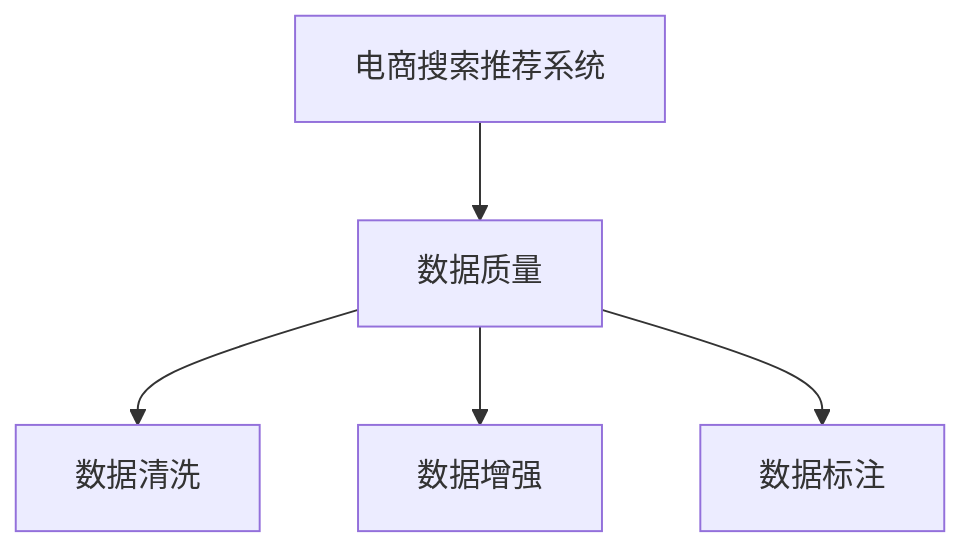

                 

# AI 大模型在电商搜索推荐中的数据质量要求：确保准确性与可靠性

在电商领域，搜索推荐系统通过分析用户行为数据和商品信息，为用户推荐最符合其兴趣的商品，提高用户体验和转化率。随着AI大模型的兴起，基于大模型的搜索推荐系统也逐步成为主流。然而，要充分利用大模型的能力，必须首先确保数据质量，使其具备准确性与可靠性。本文将系统梳理电商搜索推荐中的数据质量要求，提出相应的解决方案，以指导实际应用。

## 1. 背景介绍

### 1.1 问题由来
电商搜索推荐系统直接关联用户体验和转化率，其推荐效果对销售业绩具有重要影响。传统的推荐算法，如协同过滤、内容推荐等，在准确性和多样性方面存在一定局限。近年来，AI大模型在电商推荐中得到广泛应用，基于大模型的推荐系统通过学习用户行为和商品信息，生成个性化的推荐结果，具备强大的表征能力和泛化能力。然而，基于大模型的推荐系统需要高精度、高可靠性的数据支撑，才能发挥其潜力。

### 1.2 问题核心关键点
基于大模型的电商搜索推荐系统依赖于用户行为数据和商品信息。数据质量是决定推荐结果准确性与可靠性的关键因素。数据质量差会导致模型学习到错误的信息模式，生成不合适的推荐，反而降低用户体验和转化率。因此，保证电商推荐系统数据质量，确保其准确性与可靠性，是大模型应用的首要任务。

## 2. 核心概念与联系

### 2.1 核心概念概述

为更好地理解电商搜索推荐系统中的数据质量要求，本节将介绍几个密切相关的核心概念：

- 电商搜索推荐系统：基于用户历史行为数据和商品信息，为用户推荐商品的系统。通过学习用户行为模式和商品特征，生成个性化推荐结果。
- 数据质量：指数据满足需求的程度，包括完整性、一致性、准确性、及时性、适用性等方面。数据质量是模型训练和应用的基础，直接关系到模型的效果。
- 数据清洗：指对原始数据进行预处理，去除噪声和冗余信息，提高数据质量。数据清洗是保证数据质量的重要手段。
- 数据增强：指通过数据生成技术，扩充数据集，增加数据量，提高模型泛化能力。数据增强可有效缓解数据不平衡等问题。
- 数据标注：指给数据添加标签，以便模型进行有监督学习。数据标注是数据预处理的重要步骤，对模型性能有重要影响。

这些核心概念之间的逻辑关系可以通过以下Mermaid流程图来展示：



这个流程图展示了大模型电商搜索推荐系统中的数据质量要求及其关联流程：

1. 电商推荐系统需要高精度的用户行为和商品信息。
2. 数据质量直接影响到推荐系统的准确性与可靠性。
3. 数据清洗、数据增强、数据标注等是保证数据质量的重要手段。

## 3. 核心算法原理 & 具体操作步骤

### 3.1 算法原理概述

基于大模型的电商搜索推荐系统主要基于监督学习和强化学习的原理，通过学习用户行为数据和商品信息，生成推荐结果。数据质量对模型效果具有重要影响，主要体现在以下几个方面：

- 数据完整性：确保用户行为数据和商品信息齐全，不缺失。
- 数据一致性：确保数据格式、时间戳等一致，减少数据偏差。
- 数据准确性：确保用户行为数据和商品信息准确，避免错误信息干扰模型。
- 数据及时性：确保数据更新及时，反映最新用户行为和商品信息。

### 3.2 算法步骤详解

基于大模型的电商搜索推荐系统一般包括以下几个关键步骤：

**Step 1: 数据收集与存储**

- 收集电商网站的用户行为数据，如浏览记录、点击记录、购买记录等。
- 收集商品信息，如商品名称、价格、描述、图片等。
- 将收集到的数据存储在分布式数据库中，以便后续分析和处理。

**Step 2: 数据预处理与清洗**

- 对原始数据进行格式转换、去重、去噪等预处理操作。
- 清洗不合法、异常值数据，确保数据质量。
- 使用数据清洗算法，如DBSCAN、LOF等，去除异常点，提高数据准确性。

**Step 3: 数据增强**

- 对缺失数据进行填充或插值，增加数据量。
- 对类别数据进行过采样或欠采样，平衡数据分布。
- 通过数据生成技术，如数据生成对抗网络(DAGAN)，扩充数据集。

**Step 4: 数据标注**

- 对部分数据进行人工标注，构建有监督数据集。
- 利用自监督学习技术，如生成对抗网络(GAN)，自动生成标注数据。
- 使用半监督学习技术，如图谱学习，融合标注数据和未标注数据，提高标注效率。

**Step 5: 模型训练与评估**

- 使用预处理后的数据训练大模型，生成推荐结果。
- 在验证集上评估推荐模型的性能，如准确率、召回率、覆盖率等。
- 根据评估结果调整模型超参数，优化模型效果。

**Step 6: 部署与监控**

- 将训练好的模型部署到生产环境，提供实时推荐服务。
- 对生产环境中的推荐结果进行实时监控，检测异常情况。
- 根据监控结果调整模型，提高推荐系统的可靠性。

以上是基于大模型的电商搜索推荐系统的一般流程。在实际应用中，还需要针对具体任务特点，对数据预处理、模型训练等环节进行优化设计，以进一步提升推荐效果。

### 3.3 算法优缺点

基于大模型的电商搜索推荐系统具有以下优点：

1. 高效性：大模型能够快速学习复杂的用户行为和商品信息，生成个性化的推荐结果，提升推荐效率。
2. 泛化能力：大模型具有较强的泛化能力，能够适应不同用户和商品的需求，提高推荐的多样性。
3. 用户个性化：大模型能够基于用户历史行为和偏好，生成个性化推荐，提升用户满意度。

同时，该方法也存在一定的局限性：

1. 数据依赖性强：电商推荐系统对数据质量有高要求，数据偏差和噪声会影响模型效果。
2. 数据隐私问题：电商推荐系统需要收集大量用户行为数据，存在隐私泄露的风险。
3. 计算资源消耗大：大模型需要大量的计算资源进行训练和推理，对硬件设施要求高。
4. 模型复杂度高：大模型结构复杂，难以理解和调试，存在黑盒问题。

尽管存在这些局限性，但就目前而言，基于大模型的推荐系统仍是电商领域的重要技术范式。未来相关研究的重点在于如何进一步提升数据质量，降低数据依赖，提高推荐系统的透明度和可信度，同时兼顾隐私保护和计算效率等因素。

### 3.4 算法应用领域

基于大模型的电商搜索推荐系统已经在各大电商平台上得到广泛应用，包括淘宝、京东、Amazon等。这些系统通过收集用户行为数据和商品信息，利用大模型学习用户行为模式和商品特征，生成个性化推荐结果，提高用户满意度和转化率。

除了传统的电商领域，基于大模型的推荐系统也被创新性地应用于更多场景中，如社交媒体、音乐、视频等领域，为各类平台带来了新的用户价值。未来，随着大模型的不断演进和推荐技术的发展，相信其在更多行业中的应用将更加广泛，为经济社会发展注入新的活力。

## 4. 数学模型和公式 & 详细讲解

### 4.1 数学模型构建

电商搜索推荐系统的主要目标是通过学习用户行为数据和商品信息，生成推荐结果。假设用户行为数据集为 $D=\{(x_i, y_i)\}_{i=1}^N$，其中 $x_i$ 表示用户行为，$y_i$ 表示推荐结果。定义推荐模型的损失函数为：

$$
\mathcal{L}(\theta) = \frac{1}{N} \sum_{i=1}^N \ell(x_i, y_i; \theta)
$$

其中 $\theta$ 为模型的参数，$\ell(x_i, y_i; \theta)$ 为模型在输入 $x_i$ 下，输出 $y_i$ 的预测误差。

为了确保模型性能，需要对数据进行预处理，包括数据清洗、数据增强等。假设预处理后的数据集为 $D'$，则模型训练的目标为：

$$
\theta^* = \mathop{\arg\min}_{\theta} \mathcal{L}(D')
$$

### 4.2 公式推导过程

以协同过滤推荐算法为例，其目标是根据用户的历史行为数据，预测其对商品的兴趣。设用户 $u$ 对商品 $i$ 的兴趣为 $r_{ui}$，$x$ 为商品 $i$ 的特征向量，$y$ 为推荐结果。根据协同过滤算法，用户兴趣向量 $r_u$ 可以表示为：

$$
r_u = \sum_{i=1}^M \alpha_i x_i
$$

其中 $\alpha_i$ 为商品 $i$ 对用户 $u$ 的兴趣权重，$M$ 为商品总数。

将用户兴趣向量 $r_u$ 作为推荐结果，则推荐模型的损失函数可以表示为：

$$
\ell(r_u, y) = (r_u - y)^2
$$

在模型训练时，可以通过最小化损失函数，优化模型参数 $\theta$。具体地，假设用户 $u$ 对商品 $i$ 的兴趣为 $r_{ui}$，则模型训练的优化目标为：

$$
\theta^* = \mathop{\arg\min}_{\theta} \sum_{i=1}^M (r_{ui} - y_i)^2
$$

通过求解上述优化问题，可以学习到用户行为模式和商品特征，生成推荐结果。

## 5. 项目实践：代码实例和详细解释说明

### 5.1 开发环境搭建

在进行电商搜索推荐系统的开发前，我们需要准备好开发环境。以下是使用Python进行TensorFlow开发的环境配置流程：

1. 安装Anaconda：从官网下载并安装Anaconda，用于创建独立的Python环境。

2. 创建并激活虚拟环境：
```bash
conda create -n tf-env python=3.8 
conda activate tf-env
```

3. 安装TensorFlow：根据CUDA版本，从官网获取对应的安装命令。例如：
```bash
conda install tensorflow -c tf
```

4. 安装其他相关库：
```bash
pip install numpy pandas scikit-learn matplotlib tensorflow-estimator
```

完成上述步骤后，即可在`tf-env`环境中开始电商推荐系统的开发。

### 5.2 源代码详细实现

下面我们以协同过滤推荐算法为例，给出使用TensorFlow进行电商推荐系统的代码实现。

首先，定义推荐模型的输入和输出：

```python
import tensorflow as tf

# 定义输入
user_input = tf.keras.layers.Input(shape=(num_users, ), name='user')
item_input = tf.keras.layers.Input(shape=(num_items, ), name='item')

# 定义输出
rating_output = tf.keras.layers.Dense(1, activation='linear', name='rating')
rating_output(user_input, item_input)
```

然后，定义协同过滤模型的权重和特征向量：

```python
# 定义权重矩阵
W = tf.keras.layers.Dense(1, activation='linear', name='W')
rating_output(user_input, item_input)
```

接着，定义推荐模型的损失函数：

```python
# 定义损失函数
rating_loss = tf.keras.losses.mean_squared_error(target, rating_output)

# 定义优化器
optimizer = tf.keras.optimizers.Adam(lr=0.001)

# 定义训练过程
model = tf.keras.Model(inputs=[user_input, item_input], outputs=rating_output)
model.compile(loss=rating_loss, optimizer=optimizer)

# 训练模型
model.fit([user_input_train, item_input_train], train_labels, epochs=10, batch_size=32)
```

最后，对训练好的模型进行评估：

```python
# 定义评估指标
evaluation = tf.keras.metrics.Mean()

# 对测试集进行评估
test_preds = model.predict([test_user_input, test_item_input])
test_loss = evaluation(tf.keras.losses.mean_squared_error(test_labels, test_preds))

print('Test loss:', test_loss.numpy())
```

以上就是使用TensorFlow进行电商推荐系统的完整代码实现。可以看到，TensorFlow提供了便捷的API，可以快速构建推荐模型，进行训练和评估。

### 5.3 代码解读与分析

让我们再详细解读一下关键代码的实现细节：

**Input层定义**：
- `tf.keras.layers.Input`：定义输入层的形状，`num_users`和`num_items`分别表示用户和商品的数量。
- `name`参数：指定层的名称。

**Dense层定义**：
- `tf.keras.layers.Dense`：定义全连接层，`num_users`和`num_items`分别为输入层的形状。
- `activation`参数：指定激活函数，`linear`表示线性激活函数。

**模型训练**：
- `tf.keras.Model`：定义模型，输入为`user_input`和`item_input`，输出为`rating_output`。
- `model.compile`：编译模型，指定损失函数和优化器。
- `model.fit`：训练模型，指定输入数据和标签。

**模型评估**：
- `tf.keras.metrics.Mean`：定义平均误差评估指标。
- `model.predict`：对测试集进行预测。
- `tf.keras.losses.mean_squared_error`：计算预测值与标签之间的均方误差。

可以看到，TensorFlow提供了简单易用的API，使得电商推荐系统的开发更加便捷高效。

## 6. 实际应用场景

### 6.1 智能客服系统

基于大模型的电商推荐系统可以应用于智能客服系统。通过收集用户的历史行为数据，学习用户兴趣和偏好，推荐用户感兴趣的商品，提升客服体验和用户满意度。智能客服系统可以7x24小时不间断服务，快速响应用户咨询，用自然流畅的语言解答各类常见问题。

在技术实现上，可以收集用户浏览、点击、购买等行为数据，提取和用户交互的物品标题、描述、标签等文本内容。将文本内容作为模型输入，用户的后续行为（如是否点击、购买等）作为监督信号，在此基础上微调预训练语言模型。微调后的模型能够从文本内容中准确把握用户的兴趣点。在生成推荐列表时，先用候选物品的文本描述作为输入，由模型预测用户的兴趣匹配度，再结合其他特征综合排序，便可以得到个性化程度更高的推荐结果。

### 6.2 金融舆情监测

金融机构需要实时监测市场舆论动向，以便及时应对负面信息传播，规避金融风险。传统的舆情监测方式成本高、效率低，难以应对网络时代海量信息爆发的挑战。基于大模型的电商推荐系统，可以应用于金融舆情监测。

具体而言，可以收集金融领域相关的新闻、报道、评论等文本数据，并对其进行主题标注和情感标注。在此基础上对预训练语言模型进行微调，使其能够自动判断文本属于何种主题，情感倾向是正面、中性还是负面。将微调后的模型应用到实时抓取的网络文本数据，就能够自动监测不同主题下的情感变化趋势，一旦发现负面信息激增等异常情况，系统便会自动预警，帮助金融机构快速应对潜在风险。

### 6.3 个性化推荐系统

当前的推荐系统往往只依赖用户的历史行为数据进行物品推荐，无法深入理解用户的真实兴趣偏好。基于大模型的电商推荐系统可以应用于个性化推荐系统。

在实践中，可以收集用户浏览、点击、评论、分享等行为数据，提取和用户交互的物品标题、描述、标签等文本内容。将文本内容作为模型输入，用户的后续行为（如是否点击、购买等）作为监督信号，在此基础上微调预训练语言模型。微调后的模型能够从文本内容中准确把握用户的兴趣点。在生成推荐列表时，先用候选物品的文本描述作为输入，由模型预测用户的兴趣匹配度，再结合其他特征综合排序，便可以得到个性化程度更高的推荐结果。

### 6.4 未来应用展望

随着大模型和推荐技术的不断发展，基于大模型的推荐系统将在更多领域得到应用，为传统行业带来变革性影响。

在智慧医疗领域，基于大模型的电商推荐系统可以应用于医疗问答、病历分析、药物研发等，提升医疗服务的智能化水平，辅助医生诊疗，加速新药开发进程。

在智能教育领域，微调技术可应用于作业批改、学情分析、知识推荐等方面，因材施教，促进教育公平，提高教学质量。

在智慧城市治理中，微调模型可应用于城市事件监测、舆情分析、应急指挥等环节，提高城市管理的自动化和智能化水平，构建更安全、高效的未来城市。

此外，在企业生产、社会治理、文娱传媒等众多领域，基于大模型的推荐系统也将不断涌现，为经济社会发展注入新的动力。相信随着技术的日益成熟，推荐系统将成为电商领域的重要技术范式，推动电商技术向更广阔的领域加速渗透。

## 7. 工具和资源推荐

### 7.1 学习资源推荐

为了帮助开发者系统掌握电商推荐系统的理论和实践，这里推荐一些优质的学习资源：

1. 《深度学习理论与实践》系列博文：由大模型技术专家撰写，深入浅出地介绍了深度学习理论基础和电商推荐系统。

2. 《机器学习实战》课程：斯坦福大学开设的机器学习课程，有Lecture视频和配套作业，带你入门电商推荐系统领域的基本概念和经典模型。

3. 《推荐系统实战》书籍：详细介绍了推荐系统的原理和算法，包括协同过滤、矩阵分解等经典方法。

4. HuggingFace官方文档：提供了海量预训练模型和完整的电商推荐系统的微调样例代码，是上手实践的必备资料。

5. Coursera《推荐系统》课程：由Coursera平台提供，介绍了推荐系统的基础理论、算法设计和应用实践。

通过对这些资源的学习实践，相信你一定能够快速掌握电商推荐系统的精髓，并用于解决实际的电商问题。

### 7.2 开发工具推荐

高效的开发离不开优秀的工具支持。以下是几款用于电商推荐系统开发的常用工具：

1. TensorFlow：基于Python的开源深度学习框架，生产部署方便，适合大规模工程应用。提供了便捷的API，方便构建和训练电商推荐模型。

2. PyTorch：基于Python的开源深度学习框架，灵活动态的计算图，适合快速迭代研究。提供了丰富的电商推荐系统相关的库和模块，方便构建和调试。

3. HuggingFace Transformers库：提供了众多SOTA语言模型，支持TensorFlow和PyTorch，方便电商推荐系统的微调。

4. Elasticsearch：用于存储和检索电商推荐系统所需的大量文本数据，快速查询和推荐。

5. Redis：用于缓存电商推荐系统所需的大量用户行为数据，提高查询效率。

6. Grafana：用于监控和可视化电商推荐系统的性能指标，及时发现和解决问题。

合理利用这些工具，可以显著提升电商推荐系统的开发效率，加快创新迭代的步伐。

### 7.3 相关论文推荐

电商推荐系统的发展源于学界的持续研究。以下是几篇奠基性的相关论文，推荐阅读：

1. "The BellKor-Ada Collaborative Filtering Recommendation Algorithm"：提出基于用户-商品交互数据的协同过滤算法，成为推荐系统经典算法之一。

2. "Latent Feature Model for Personalized Web Search Recommendation"：提出基于隐式用户行为数据的推荐模型，提升推荐效果。

3. "Deep Interest Evolution Model for Dynamic Recommendation"：提出基于深度学习模型的推荐系统，利用用户兴趣的动态演化，提升推荐效果。

4. "Surrogate Collaborative Filtering for Recommendation"：提出基于协同过滤和深度学习的混合推荐方法，兼顾多样性和精度。

5. "Neural Factorization Machines for Recommendation"：提出基于神经网络的因子分解推荐模型，提高推荐效果。

这些论文代表了大模型推荐系统的研究进展。通过学习这些前沿成果，可以帮助研究者把握电商推荐系统的最新趋势，激发更多的创新灵感。

## 8. 总结：未来发展趋势与挑战

### 8.1 总结

本文对基于大模型的电商搜索推荐系统进行了全面系统的介绍。首先阐述了电商推荐系统数据质量的重要性，详细讲解了电商搜索推荐系统中的数据质量要求，提出相应的解决方案。其次，从原理到实践，详细讲解了电商推荐系统的数学模型和关键步骤，给出了电商推荐系统开发的完整代码实例。同时，本文还广泛探讨了电商推荐系统在智能客服、金融舆情、个性化推荐等多个行业领域的应用前景，展示了电商推荐系统的巨大潜力。最后，精选了电商推荐系统的各类学习资源，力求为读者提供全方位的技术指引。

通过本文的系统梳理，可以看到，基于大模型的电商搜索推荐系统正在成为电商领域的重要技术范式，极大地拓展了电商推荐系统的应用边界，提升了用户体验和转化率。随着大模型的不断演进和推荐技术的发展，相信其在更多行业中的应用将更加广泛，为经济社会发展注入新的活力。

### 8.2 未来发展趋势

展望未来，基于大模型的电商搜索推荐系统将呈现以下几个发展趋势：

1. 数据质量不断提升。随着数据采集技术和处理技术的不断进步，电商推荐系统的数据质量将不断提升，用户行为和商品信息的准确性和完整性将进一步提高。

2. 推荐系统更加个性化。通过深度学习等先进技术，电商推荐系统能够更好地把握用户兴趣和行为模式，生成更精准的推荐结果，提升用户满意度。

3. 推荐模型多样性增加。未来的电商推荐系统将结合协同过滤、内容推荐、深度学习等多种推荐算法，提高推荐效果的多样性和泛化能力。

4. 实时性要求更高。实时推荐系统需要快速响应用户查询，电商推荐系统将采用流式计算、增量学习等技术，实现快速推荐。

5. 数据隐私保护加强。电商平台将更加重视用户数据隐私保护，采用联邦学习等技术，保护用户数据安全。

6. 推荐系统的可解释性增强。未来的电商推荐系统将更加注重模型的可解释性，用户能够清楚了解推荐结果的生成过程和逻辑，提升用户信任度。

这些趋势凸显了基于大模型的电商推荐系统的广阔前景。这些方向的探索发展，必将进一步提升电商推荐系统的性能和应用范围，为电商技术的创新应用带来更多可能。

### 8.3 面临的挑战

尽管基于大模型的电商推荐系统已经取得了瞩目成就，但在迈向更加智能化、普适化应用的过程中，它仍面临着诸多挑战：

1. 数据依赖性强。电商推荐系统对数据质量有高要求，数据偏差和噪声会影响模型效果。如何进一步提升数据质量，降低数据依赖，将是重要的研究方向。

2. 计算资源消耗大。大模型需要大量的计算资源进行训练和推理，对硬件设施要求高。如何优化模型结构，提升计算效率，将是重要的优化方向。

3. 模型复杂度高。电商推荐系统模型结构复杂，难以理解和调试，存在黑盒问题。如何简化模型结构，增强模型的可解释性，将是重要的研究方向。

4. 用户隐私保护问题。电商推荐系统需要收集大量用户行为数据，存在隐私泄露的风险。如何保障用户数据安全，将是重要的研究方向。

5. 实时推荐系统实现难度高。实时推荐系统需要快速响应用户查询，对计算资源和算法优化有较高要求。如何实现高效、稳定的实时推荐系统，将是重要的研究方向。

这些挑战需要电商推荐系统领域的研究者不断探索和创新，才能确保电商推荐系统的稳定性和可靠性，满足用户需求。

### 8.4 研究展望

面对电商推荐系统面临的挑战，未来的研究需要在以下几个方面寻求新的突破：

1. 探索无监督和半监督推荐方法。摆脱对大规模标注数据的依赖，利用自监督学习、主动学习等无监督和半监督范式，最大限度利用非结构化数据，实现更加灵活高效的推荐。

2. 研究参数高效和计算高效的推荐算法。开发更加参数高效的推荐算法，在固定大部分模型参数的同时，只更新极少量的推荐参数。同时优化推荐系统的计算图，减少前向传播和反向传播的资源消耗，实现更加轻量级、实时性的部署。

3. 引入更多先验知识。将符号化的先验知识，如知识图谱、逻辑规则等，与神经网络模型进行巧妙融合，引导推荐过程学习更准确、合理的商品特征。同时加强不同模态数据的整合，实现视觉、语音等多模态信息与文本信息的协同建模。

4. 结合因果分析和博弈论工具。将因果分析方法引入推荐系统，识别出推荐结果的关键特征，增强输出解释的因果性和逻辑性。借助博弈论工具刻画人机交互过程，主动探索并规避推荐系统的脆弱点，提高系统稳定性。

5. 纳入伦理道德约束。在推荐系统训练目标中引入伦理导向的评估指标，过滤和惩罚有偏见、有害的输出倾向。同时加强人工干预和审核，建立推荐系统的监管机制，确保输出符合人类价值观和伦理道德。

这些研究方向将继续推动电商推荐系统的发展，为构建安全、可靠、可解释、可控的推荐系统铺平道路。面向未来，电商推荐系统需要与其他人工智能技术进行更深入的融合，如知识表示、因果推理、强化学习等，多路径协同发力，共同推动推荐系统的进步。只有勇于创新、敢于突破，才能不断拓展电商推荐系统的边界，让智能技术更好地造福电商行业。

## 9. 附录：常见问题与解答

**Q1：电商推荐系统如何处理用户行为数据？**

A: 电商推荐系统通过收集用户的历史行为数据，学习用户兴趣和偏好，生成推荐结果。常见的用户行为数据包括浏览记录、点击记录、购买记录等。

**Q2：电商推荐系统如何应对数据不平衡问题？**

A: 电商推荐系统面临数据不平衡问题时，可以采用数据增强技术，如过采样和欠采样，平衡数据分布。同时利用自监督学习技术，如生成对抗网络(GAN)，自动生成标注数据，增加训练样本量。

**Q3：电商推荐系统如何保证推荐结果的实时性？**

A: 电商推荐系统需要快速响应用户查询，可以采用流式计算、增量学习等技术，实现实时推荐。同时优化模型结构，减少前向传播和反向传播的资源消耗，提升计算效率。

**Q4：电商推荐系统如何保护用户隐私？**

A: 电商推荐系统需要收集大量用户行为数据，存在隐私泄露的风险。可以采用联邦学习等技术，保护用户数据安全，确保用户隐私不被泄露。

**Q5：电商推荐系统如何提高推荐结果的准确性？**

A: 电商推荐系统需要通过数据清洗、数据增强等技术，提高数据质量。同时，选择合适的推荐算法，如协同过滤、内容推荐、深度学习等，结合用户行为和商品信息，生成更准确的推荐结果。

这些问题的解答展示了电商推荐系统在实际应用中的关键技术和方法，有助于理解系统的工作机制和优化策略。

---

作者：禅与计算机程序设计艺术 / Zen and the Art of Computer Programming

