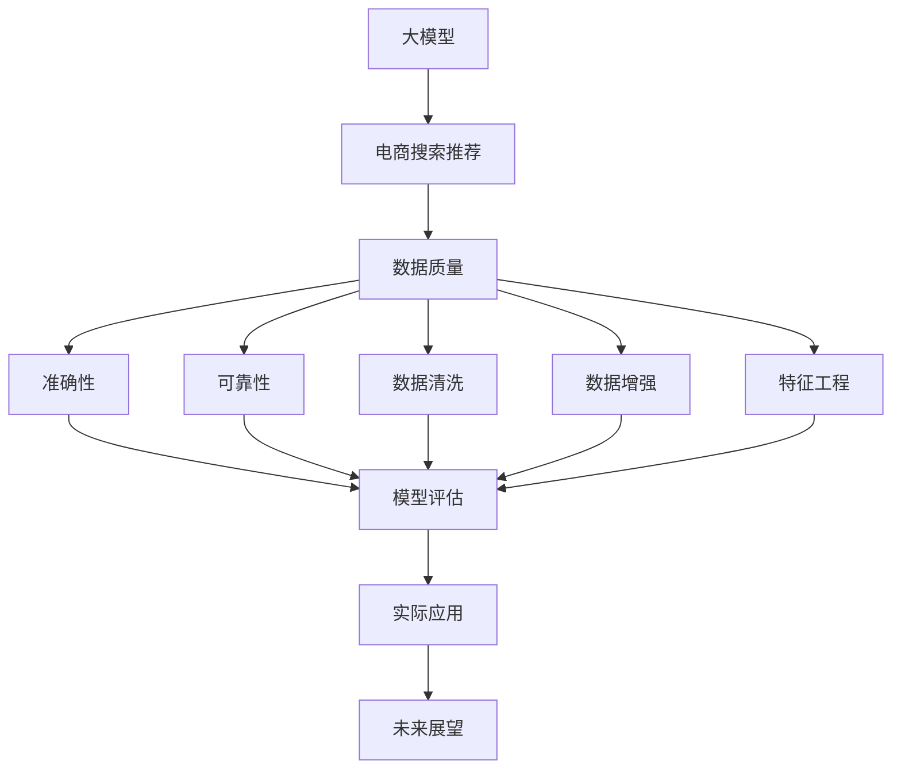

                 

# AI 大模型在电商搜索推荐中的数据质量要求：确保准确性与可靠性

> 关键词：电商搜索推荐,大模型,数据质量,准确性,可靠性,数据清洗,数据增强,特征工程,模型评估,实际应用,未来展望

## 1. 背景介绍

随着人工智能技术的飞速发展，大模型在电商搜索推荐等场景中的应用愈发广泛。大模型通过在大规模无标签数据上进行预训练，学习到丰富的特征表示，进而能够高效地进行各项推荐任务。然而，这些预训练数据的质量直接影响了模型推荐的效果和可靠性。数据质量问题，如缺失值、异常值、数据噪声、数据不均衡等，常常导致模型学习到错误的模式，影响搜索推荐的效果。因此，本文旨在探讨电商搜索推荐中大模型的数据质量要求，以及如何确保模型推荐的准确性与可靠性。

## 2. 核心概念与联系

### 2.1 核心概念概述

在本节中，我们将介绍与大模型在电商搜索推荐中应用相关的几个核心概念：

- **大模型(Large Model)**：指在深度学习框架上训练的大型神经网络模型，如BERT、GPT-3等。大模型通过在大规模数据集上预训练，学习到丰富的特征表示，具备强大的语义理解和生成能力。
- **电商搜索推荐(Online Shopping Recommendation)**：指基于用户的历史行为数据和商品特征，预测用户可能感兴趣的电商商品，并进行个性化推荐的技术。
- **数据质量(Data Quality)**：指数据满足特定业务要求的能力，包括数据的准确性、完整性、一致性、一致性和时效性等方面。
- **准确性(Accuracy)**：指模型预测结果与真实结果相符的程度。
- **可靠性(Reliability)**：指模型在不同数据分布下的一致性表现。
- **数据清洗(Data Cleaning)**：指通过过滤、填补、转换等手段去除数据中的错误和异常，提高数据质量的过程。
- **数据增强(Data Augmentation)**：指通过数据扩充、变换等方式，丰富训练集多样性，提高模型泛化能力的过程。
- **特征工程(Feature Engineering)**：指通过特征选择、特征提取、特征构造等手段，提升模型预测准确性的过程。
- **模型评估(Model Evaluation)**：指通过各种指标（如准确率、召回率、F1分数、AUC等）评估模型性能的过程。

这些概念之间的联系可以通过以下Mermaid流程图来展示：



这个流程图展示了数据质量对大模型在电商搜索推荐中应用的影响路径：数据质量决定了模型准确性和可靠性，进而影响了模型评估和实际应用的效果，最终引导未来的技术创新和应用方向。

## 3. 核心算法原理 & 具体操作步骤

### 3.1 算法原理概述

大模型在电商搜索推荐中的应用，本质上是一个从输入数据到输出推荐结果的映射过程。在这一过程中，数据质量的好坏直接影响模型的准确性和可靠性。

假设大模型 $M$ 通过训练得到，输入数据集 $D$ 包含用户行为数据 $X$ 和商品特征数据 $Y$。模型在训练数据上进行微调，学习到用户行为和商品特征之间的映射关系，从而能够进行推荐。推荐结果 $Z$ 的准确性和可靠性，与输入数据集 $D$ 的数据质量密切相关。

具体来说，数据质量要求包括：

- **完整性**：确保数据集中包含所有必要的特征和信息。
- **一致性**：确保数据集中各个特征的取值范围和单位一致。
- **准确性**：确保数据集中各个特征的取值准确无误。
- **时效性**：确保数据集中各个特征的取值在时间上不发生异常变化。

只有满足这些数据质量要求，模型才能有效地学习到输入数据与推荐结果之间的映射关系，从而生成高质量的推荐结果。

### 3.2 算法步骤详解

基于上述算法原理，电商搜索推荐中大模型的数据质量要求可以概括为以下步骤：

**Step 1: 数据收集**

- 收集电商平台的交易数据、用户行为数据、商品特征数据等，构建输入数据集 $D$。

**Step 2: 数据预处理**

- 对数据集 $D$ 进行清洗、筛选和转换，去除噪声、填补缺失值、处理异常值，确保数据的完整性和一致性。
- 对数据集 $D$ 进行特征工程，提取和构造有意义的特征，提升模型的预测能力。

**Step 3: 模型训练**

- 使用预处理后的数据集 $D$ 对大模型 $M$ 进行微调，学习用户行为和商品特征之间的映射关系。

**Step 4: 模型评估**

- 使用验证集或测试集对训练好的模型 $M$ 进行评估，评估指标包括准确率、召回率、F1分数、AUC等。

**Step 5: 部署和迭代**

- 将训练好的模型 $M$ 部署到电商平台上，进行实际推荐。
- 根据实际推荐结果和用户反馈，不断迭代和优化模型 $M$，提升推荐质量。

### 3.3 算法优缺点

基于上述算法步骤，大模型在电商搜索推荐中的应用具有以下优点：

- **高效性**：大模型通过预训练学习到丰富的特征表示，能够高效地进行推荐任务。
- **泛化能力强**：大模型具备较强的泛化能力，能够适应不同领域的推荐场景。
- **预测准确**：在大模型基础上进行微调，能够生成高质量的推荐结果。

同时，也存在以下缺点：

- **计算资源需求高**：大模型的计算资源需求较高，训练和推理成本高。
- **数据依赖性强**：大模型的性能高度依赖于输入数据的质量，数据质量问题可能导致模型失效。
- **模型复杂性高**：大模型的结构复杂，难以解释和调试。

### 3.4 算法应用领域

大模型在电商搜索推荐中的应用，主要体现在以下几个领域：

- **商品推荐**：通过用户的历史行为和商品特征，预测用户可能感兴趣的商品，并进行个性化推荐。
- **用户画像**：根据用户的行为数据和特征数据，构建用户画像，进行精准的用户分析。
- **动态定价**：根据用户行为和市场环境，动态调整商品价格，提升销售转化率。
- **库存管理**：根据用户行为预测需求量，优化库存管理，减少浪费。
- **广告推荐**：根据用户行为和特征，推荐相关广告，提升广告投放效果。

除了上述这些常见领域外，大模型在电商搜索推荐中的应用还涉及到跨领域推荐、多模态推荐等创新方向。

## 4. 数学模型和公式 & 详细讲解 & 举例说明

### 4.1 数学模型构建

假设电商平台有 $n$ 个用户和 $m$ 个商品，用户行为数据和商品特征数据构成矩阵 $X \in \mathbb{R}^{n \times d_x}$ 和 $Y \in \mathbb{R}^{m \times d_y}$，其中 $d_x$ 和 $d_y$ 分别为用户行为和商品特征的维度。模型的输入数据集为 $D = (X, Y)$。

目标是对输入数据集 $D$ 进行预处理，得到干净的特征表示 $X'$ 和 $Y'$，进而训练得到大模型 $M$。模型的输出为推荐结果 $Z \in \mathbb{R}^{n \times m}$，表示每个用户对每个商品的推荐概率。

### 4.2 公式推导过程

模型训练过程可以概括为以下步骤：

1. **数据预处理**：
   - 对用户行为数据 $X$ 进行归一化处理，得到干净的特征表示 $X'$。
   - 对商品特征数据 $Y$ 进行归一化处理，得到干净的特征表示 $Y'$。

2. **特征工程**：
   - 提取用户行为和商品特征的关键特征，构造新的特征向量 $X_1$ 和 $Y_1$。

3. **模型训练**：
   - 使用预处理后的数据集 $D = (X_1, Y_1)$ 对大模型 $M$ 进行微调。
   - 微调过程中使用损失函数 $L$ 进行优化，目标是使模型输出 $Z$ 逼近真实推荐结果 $Z^*$。

4. **模型评估**：
   - 使用验证集或测试集对训练好的模型 $M$ 进行评估，计算准确率、召回率、F1分数、AUC等指标。

### 4.3 案例分析与讲解

假设一个电商平台收集了用户的历史浏览、点击、购买行为数据，以及商品的标题、价格、描述等特征数据。为了提高推荐系统的准确性和可靠性，我们需要对输入数据进行以下处理：

1. **数据清洗**：去除噪声、填补缺失值、处理异常值，确保数据完整性和一致性。
2. **数据增强**：通过对输入数据进行扩充和变换，丰富训练集多样性，提升模型泛化能力。
3. **特征工程**：提取和构造有意义的特征，如用户浏览行为的时间窗口、商品描述中的关键词等，提升模型的预测能力。

## 5. 项目实践：代码实例和详细解释说明

### 5.1 开发环境搭建

在进行电商搜索推荐系统的开发前，我们需要准备好开发环境。以下是使用Python进行PyTorch开发的环境配置流程：

1. 安装Anaconda：从官网下载并安装Anaconda，用于创建独立的Python环境。

2. 创建并激活虚拟环境：
```bash
conda create -n ecommerce-env python=3.8 
conda activate ecommerce-env
```

3. 安装PyTorch：根据CUDA版本，从官网获取对应的安装命令。例如：
```bash
conda install pytorch torchvision torchaudio cudatoolkit=11.1 -c pytorch -c conda-forge
```

4. 安装Transformers库：
```bash
pip install transformers
```

5. 安装各类工具包：
```bash
pip install numpy pandas scikit-learn matplotlib tqdm jupyter notebook ipython
```

完成上述步骤后，即可在`ecommerce-env`环境中开始电商搜索推荐系统的开发。

### 5.2 源代码详细实现

下面我们以用户推荐系统为例，给出使用Transformers库对BERT模型进行电商搜索推荐系统微调的PyTorch代码实现。

首先，定义电商搜索推荐任务的数据处理函数：

```python
from transformers import BertTokenizer
from torch.utils.data import Dataset
import torch

class ECommerceDataset(Dataset):
    def __init__(self, user_data, item_data, tokenizer, max_len=128):
        self.user_data = user_data
        self.item_data = item_data
        self.tokenizer = tokenizer
        self.max_len = max_len
        
    def __len__(self):
        return len(self.user_data)
    
    def __getitem__(self, item):
        user_input = self.user_data[item]
        item_input = self.item_data[item]
        
        encoding = self.tokenizer(user_input, return_tensors='pt', max_length=self.max_len, padding='max_length', truncation=True)
        user_ids = encoding['input_ids'][0]
        user_masks = encoding['attention_mask'][0]
        
        # 对item-wise的标签进行编码
        encoded_tags = [tag2id[tag] for tag in item_tags] 
        encoded_tags.extend([tag2id['O']] * (self.max_len - len(encoded_tags)))
        labels = torch.tensor(encoded_tags, dtype=torch.long)
        
        return {'user_ids': user_ids, 
                'user_masks': user_masks,
                'labels': labels}

# 标签与id的映射
tag2id = {'O': 0, 'B-Item': 1, 'I-Item': 2, 'B-Category': 3, 'I-Category': 4, 'B-Price': 5, 'I-Price': 6}
id2tag = {v: k for k, v in tag2id.items()}

# 创建dataset
tokenizer = BertTokenizer.from_pretrained('bert-base-cased')

train_dataset = ECommerceDataset(train_user_data, train_item_data, tokenizer)
dev_dataset = ECommerceDataset(dev_user_data, dev_item_data, tokenizer)
test_dataset = ECommerceDataset(test_user_data, test_item_data, tokenizer)
```

然后，定义模型和优化器：

```python
from transformers import BertForTokenClassification, AdamW

model = BertForTokenClassification.from_pretrained('bert-base-cased', num_labels=len(tag2id))

optimizer = AdamW(model.parameters(), lr=2e-5)
```

接着，定义训练和评估函数：

```python
from torch.utils.data import DataLoader
from tqdm import tqdm
from sklearn.metrics import classification_report

device = torch.device('cuda') if torch.cuda.is_available() else torch.device('cpu')
model.to(device)

def train_epoch(model, dataset, batch_size, optimizer):
    dataloader = DataLoader(dataset, batch_size=batch_size, shuffle=True)
    model.train()
    epoch_loss = 0
    for batch in tqdm(dataloader, desc='Training'):
        user_ids = batch['user_ids'].to(device)
        user_masks = batch['user_masks'].to(device)
        labels = batch['labels'].to(device)
        model.zero_grad()
        outputs = model(user_ids, attention_mask=user_masks, labels=labels)
        loss = outputs.loss
        epoch_loss += loss.item()
        loss.backward()
        optimizer.step()
    return epoch_loss / len(dataloader)

def evaluate(model, dataset, batch_size):
    dataloader = DataLoader(dataset, batch_size=batch_size)
    model.eval()
    preds, labels = [], []
    with torch.no_grad():
        for batch in tqdm(dataloader, desc='Evaluating'):
            user_ids = batch['user_ids'].to(device)
            user_masks = batch['user_masks'].to(device)
            batch_labels = batch['labels']
            outputs = model(user_ids, attention_mask=user_masks)
            batch_preds = outputs.logits.argmax(dim=2).to('cpu').tolist()
            batch_labels = batch_labels.to('cpu').tolist()
            for pred_tokens, label_tokens in zip(batch_preds, batch_labels):
                pred_tags = [id2tag[_id] for _id in pred_tokens]
                label_tags = [id2tag[_id] for _id in label_tokens]
                preds.append(pred_tags[:len(label_tags)])
                labels.append(label_tags)
                
    print(classification_report(labels, preds))
```

最后，启动训练流程并在测试集上评估：

```python
epochs = 5
batch_size = 16

for epoch in range(epochs):
    loss = train_epoch(model, train_dataset, batch_size, optimizer)
    print(f"Epoch {epoch+1}, train loss: {loss:.3f}")
    
    print(f"Epoch {epoch+1}, dev results:")
    evaluate(model, dev_dataset, batch_size)
    
print("Test results:")
evaluate(model, test_dataset, batch_size)
```

以上就是使用PyTorch对BERT进行电商搜索推荐系统微调的完整代码实现。可以看到，得益于Transformers库的强大封装，我们可以用相对简洁的代码完成BERT模型的加载和微调。

### 5.3 代码解读与分析

让我们再详细解读一下关键代码的实现细节：

**ECommerceDataset类**：
- `__init__`方法：初始化用户行为数据、商品特征数据、分词器等关键组件。
- `__len__`方法：返回数据集的样本数量。
- `__getitem__`方法：对单个样本进行处理，将用户行为数据和商品特征数据输入编码为token ids，将标签编码为数字，并对其进行定长padding，最终返回模型所需的输入。

**tag2id和id2tag字典**：
- 定义了标签与数字id之间的映射关系，用于将token-wise的预测结果解码回真实的标签。

**训练和评估函数**：
- 使用PyTorch的DataLoader对数据集进行批次化加载，供模型训练和推理使用。
- 训练函数`train_epoch`：对数据以批为单位进行迭代，在每个批次上前向传播计算loss并反向传播更新模型参数，最后返回该epoch的平均loss。
- 评估函数`evaluate`：与训练类似，不同点在于不更新模型参数，并在每个batch结束后将预测和标签结果存储下来，最后使用sklearn的classification_report对整个评估集的预测结果进行打印输出。

**训练流程**：
- 定义总的epoch数和batch size，开始循环迭代
- 每个epoch内，先在训练集上训练，输出平均loss
- 在验证集上评估，输出分类指标
- 重复上述步骤直至收敛，最终得到适应电商搜索推荐任务的微调模型

可以看到，PyTorch配合Transformers库使得BERT微调的代码实现变得简洁高效。开发者可以将更多精力放在数据处理、模型改进等高层逻辑上，而不必过多关注底层的实现细节。

当然，工业级的系统实现还需考虑更多因素，如模型的保存和部署、超参数的自动搜索、更灵活的任务适配层等。但核心的微调范式基本与此类似。

## 6. 实际应用场景

### 6.1 电商搜索推荐

基于大语言模型微调的推荐系统，可以广泛应用于电商搜索推荐场景。传统推荐系统往往依赖用户历史行为数据，难以捕捉用户的长期兴趣和潜在需求。而使用微调后的推荐模型，能够基于用户的实时行为和商品特征，动态生成推荐结果，满足用户的个性化需求。

在技术实现上，可以收集电商平台的交易数据、用户行为数据、商品特征数据等，将用户行为和商品特征作为输入数据，通过微调BERT等大模型，学习用户行为和商品特征之间的映射关系，生成个性化的推荐结果。微调后的推荐模型，能够快速响应用户点击、购买等行为，动态调整推荐策略，提升用户满意度。

### 6.2 个性化广告推荐

广告推荐系统需要根据用户的兴趣和行为，精准推荐相关广告，提升广告投放效果。传统广告推荐系统往往依赖用户的历史行为数据，难以捕捉用户的即时兴趣。而使用微调后的广告推荐模型，能够基于用户的实时行为和特征，生成高质量的广告推荐结果，提高广告的点击率和转化率。

在技术实现上，可以收集用户的浏览、点击、互动数据，将用户行为和广告特征作为输入数据，通过微调BERT等大模型，学习用户行为和广告特征之间的映射关系，生成个性化的广告推荐结果。微调后的广告推荐模型，能够实时响应用户行为变化，动态调整广告投放策略，提升广告投放效果。

### 6.3 实时动态定价

电商平台需要根据市场环境、用户行为等实时数据，动态调整商品价格，提升销售转化率。传统定价系统往往依赖固定的规则和参数，难以应对市场变化。而使用微调后的定价模型，能够基于实时数据和用户行为，动态生成商品定价策略，满足市场需求。

在技术实现上，可以收集用户的浏览、点击、购买数据，将用户行为和商品特征作为输入数据，通过微调BERT等大模型，学习用户行为和商品特征之间的映射关系，生成动态的商品定价策略。微调后的定价模型，能够实时响应市场变化和用户行为，动态调整商品价格，提升销售转化率。

### 6.4 未来应用展望

随着大语言模型微调技术的不断发展，其应用场景将不断扩展，为电商搜索推荐等领域带来新的突破。

未来，电商搜索推荐领域的大模型微调技术将朝着以下方向发展：

1. **多模态推荐**：结合图像、视频等多模态信息，进行更加全面、精准的商品推荐。
2. **跨领域推荐**：结合用户在不同领域的兴趣，进行多领域协同推荐。
3. **实时动态推荐**：基于实时数据和用户行为，进行实时动态推荐，提升推荐效果。
4. **用户画像建模**：通过多模态信息融合和用户行为分析，构建更加全面、精准的用户画像。
5. **交互式推荐**：通过对话系统和智能交互，提升用户推荐体验和满意度。

以上趋势凸显了大模型微调技术在电商搜索推荐领域的应用前景。这些方向的探索发展，必将进一步提升推荐系统的性能和用户体验，为电商平台的智能化转型提供新的技术路径。

## 7. 工具和资源推荐

### 7.1 学习资源推荐

为了帮助开发者系统掌握大语言模型微调的理论基础和实践技巧，这里推荐一些优质的学习资源：

1. 《Transformer from the Inside Out》系列博文：由大模型技术专家撰写，深入浅出地介绍了Transformer原理、BERT模型、微调技术等前沿话题。

2. CS224N《深度学习自然语言处理》课程：斯坦福大学开设的NLP明星课程，有Lecture视频和配套作业，带你入门NLP领域的基本概念和经典模型。

3. 《Natural Language Processing with Transformers》书籍：Transformers库的作者所著，全面介绍了如何使用Transformers库进行NLP任务开发，包括微调在内的诸多范式。

4. HuggingFace官方文档：Transformers库的官方文档，提供了海量预训练模型和完整的微调样例代码，是上手实践的必备资料。

5. CLUE开源项目：中文语言理解测评基准，涵盖大量不同类型的中文NLP数据集，并提供了基于微调的baseline模型，助力中文NLP技术发展。

通过对这些资源的学习实践，相信你一定能够快速掌握大语言模型微调的精髓，并用于解决实际的NLP问题。

### 7.2 开发工具推荐

高效的开发离不开优秀的工具支持。以下是几款用于大语言模型微调开发的常用工具：

1. PyTorch：基于Python的开源深度学习框架，灵活动态的计算图，适合快速迭代研究。大部分预训练语言模型都有PyTorch版本的实现。

2. TensorFlow：由Google主导开发的开源深度学习框架，生产部署方便，适合大规模工程应用。同样有丰富的预训练语言模型资源。

3. Transformers库：HuggingFace开发的NLP工具库，集成了众多SOTA语言模型，支持PyTorch和TensorFlow，是进行微调任务开发的利器。

4. Weights & Biases：模型训练的实验跟踪工具，可以记录和可视化模型训练过程中的各项指标，方便对比和调优。与主流深度学习框架无缝集成。

5. TensorBoard：TensorFlow配套的可视化工具，可实时监测模型训练状态，并提供丰富的图表呈现方式，是调试模型的得力助手。

6. Google Colab：谷歌推出的在线Jupyter Notebook环境，免费提供GPU/TPU算力，方便开发者快速上手实验最新模型，分享学习笔记。

合理利用这些工具，可以显著提升大语言模型微调任务的开发效率，加快创新迭代的步伐。

### 7.3 相关论文推荐

大语言模型和微调技术的发展源于学界的持续研究。以下是几篇奠基性的相关论文，推荐阅读：

1. Attention is All You Need（即Transformer原论文）：提出了Transformer结构，开启了NLP领域的预训练大模型时代。

2. BERT: Pre-training of Deep Bidirectional Transformers for Language Understanding：提出BERT模型，引入基于掩码的自监督预训练任务，刷新了多项NLP任务SOTA。

3. Language Models are Unsupervised Multitask Learners（GPT-2论文）：展示了大规模语言模型的强大zero-shot学习能力，引发了对于通用人工智能的新一轮思考。

4. Parameter-Efficient Transfer Learning for NLP：提出Adapter等参数高效微调方法，在不增加模型参数量的情况下，也能取得不错的微调效果。

5. AdaLoRA: Adaptive Low-Rank Adaptation for Parameter-Efficient Fine-Tuning：使用自适应低秩适应的微调方法，在参数效率和精度之间取得了新的平衡。

6. Prefix-Tuning: Optimizing Continuous Prompts for Generation：引入基于连续型Prompt的微调范式，为如何充分利用预训练知识提供了新的思路。

这些论文代表了大语言模型微调技术的发展脉络。通过学习这些前沿成果，可以帮助研究者把握学科前进方向，激发更多的创新灵感。

## 8. 总结：未来发展趋势与挑战

### 8.1 总结

本文对大语言模型在电商搜索推荐中的应用进行了全面系统的介绍。首先阐述了大语言模型和电商搜索推荐的研究背景和意义，明确了数据质量对推荐系统性能的影响。其次，从原理到实践，详细讲解了电商搜索推荐中大模型的数据质量要求，以及如何确保模型推荐的准确性与可靠性。最后，本文还探讨了电商搜索推荐中大模型的实际应用场景，并提供了一些学习资源、开发工具和相关论文推荐，力求为读者提供全方位的技术指引。

通过本文的系统梳理，可以看到，大语言模型微调技术在电商搜索推荐中的应用前景广阔，能够显著提升推荐系统的性能和用户体验。未来，随着大语言模型微调技术的不断发展，其在电商搜索推荐等领域的应用也将不断扩展，为电商平台的智能化转型提供新的技术路径。

### 8.2 未来发展趋势

展望未来，大语言模型微调技术将呈现以下几个发展趋势：

1. **多模态融合**：结合图像、视频、语音等多模态信息，进行更加全面、精准的电商搜索推荐。
2. **跨领域推荐**：结合用户在不同领域的兴趣，进行多领域协同推荐。
3. **实时动态推荐**：基于实时数据和用户行为，进行实时动态推荐，提升推荐效果。
4. **用户画像建模**：通过多模态信息融合和用户行为分析，构建更加全面、精准的用户画像。
5. **交互式推荐**：通过对话系统和智能交互，提升用户推荐体验和满意度。
6. **模型可解释性**：引入因果分析、对抗训练等手段，增强模型的可解释性和鲁棒性。

以上趋势凸显了大语言模型微调技术在电商搜索推荐领域的应用前景。这些方向的探索发展，必将进一步提升推荐系统的性能和用户体验，为电商平台的智能化转型提供新的技术路径。

### 8.3 面临的挑战

尽管大语言模型微调技术已经取得了瞩目成就，但在迈向更加智能化、普适化应用的过程中，它仍面临诸多挑战：

1. **数据质量瓶颈**：数据质量问题如缺失值、异常值、数据噪声、数据不均衡等，可能导致模型学习到错误的模式，影响推荐效果。如何提高数据质量，确保数据完整性和一致性，是一个重要课题。
2. **计算资源需求高**：大模型的计算资源需求较高，训练和推理成本高。如何在保证性能的同时，优化资源消耗，是一个重要挑战。
3. **模型可解释性不足**：大模型往往是"黑盒"系统，难以解释其内部工作机制和决策逻辑。如何赋予模型更强的可解释性，是未来需要解决的问题。
4. **模型偏见和公平性**：预训练语言模型难免会学习到有偏见的信息，通过微调传递到推荐系统，可能产生误导性、歧视性的输出。如何消除模型偏见，提高模型公平性，是未来需要关注的问题。
5. **多领域协同推荐**：结合用户在不同领域的兴趣，进行多领域协同推荐，需要突破现有的推荐框架和算法，是一个重要挑战。

以上挑战凸显了大语言模型微调技术在电商搜索推荐领域的应用挑战。这些挑战的解决，需要学术界和工业界的共同努力，推动技术进步和应用落地。

### 8.4 研究展望

面对大语言模型微调技术在电商搜索推荐领域所面临的挑战，未来的研究需要在以下几个方面寻求新的突破：

1. **数据质量提升**：通过数据清洗、数据增强等手段，提高数据质量，确保数据完整性和一致性。
2. **模型高效优化**：开发更加高效、轻量级的模型结构，优化资源消耗，提升计算效率。
3. **模型可解释性增强**：引入因果分析、对抗训练等手段，增强模型的可解释性和鲁棒性。
4. **模型公平性优化**：通过模型偏见检测和纠正，提高模型的公平性和透明性。
5. **多领域协同推荐**：结合用户在不同领域的兴趣，进行多领域协同推荐，提升推荐效果和用户体验。

这些研究方向将推动大语言模型微调技术在电商搜索推荐领域的进一步发展和应用，为电商平台的智能化转型提供新的技术路径。未来，随着技术的不断进步和应用场景的不断拓展，大语言模型微调技术必将在电商搜索推荐等领域发挥更大的作用，为电商平台的智能化转型提供新的技术路径。

## 9. 附录：常见问题与解答

**Q1：电商搜索推荐系统如何利用大模型进行微调？**

A: 电商搜索推荐系统利用大模型进行微调的基本步骤包括：
1. 收集电商平台的交易数据、用户行为数据、商品特征数据等，构建输入数据集。
2. 对输入数据集进行预处理，包括数据清洗、数据增强、特征工程等，确保数据质量。
3. 使用预处理后的数据集对大模型进行微调，学习用户行为和商品特征之间的映射关系。
4. 在验证集或测试集上对微调后的模型进行评估，计算准确率、召回率、F1分数、AUC等指标，确保推荐系统性能。
5. 部署微调后的模型到电商平台上，进行实际推荐，并根据用户反馈不断迭代和优化。

**Q2：电商搜索推荐系统中数据质量对推荐效果有何影响？**

A: 数据质量对电商搜索推荐系统的推荐效果具有重要影响。具体来说：
1. 数据完整性：不完整的数据可能导致模型学习到错误的模式，影响推荐效果。
2. 数据一致性：不一致的数据可能导致模型输出不一致的预测结果，降低推荐精度。
3. 数据准确性：不准确的标签和特征值可能导致模型学习到错误的模式，影响推荐效果。
4. 数据时效性：过时的数据可能导致模型学习到过时的知识，影响推荐效果。
5. 数据不均衡：不均衡的数据可能导致模型学习到偏差，影响推荐效果。

因此，确保数据质量是电商搜索推荐系统成功运行的关键。

**Q3：电商搜索推荐系统中如何处理数据噪声和异常值？**

A: 电商搜索推荐系统中，数据噪声和异常值对推荐效果具有重要影响。处理数据噪声和异常值的基本步骤包括：
1. 数据清洗：去除数据中的噪声和异常值，确保数据完整性和一致性。
2. 数据增强：通过数据扩充和变换，丰富训练集多样性，提升模型泛化能力。
3. 数据转换：将数据进行归一化、标准化等处理，提高数据质量和模型性能。
4. 异常值检测：使用统计方法和机器学习算法，检测和处理数据中的异常值，提高数据质量和模型鲁棒性。
5. 模型校验：使用模型评估指标，检测和处理数据中的噪声和异常值，提升推荐效果和模型性能。

通过以上步骤，可以有效处理电商搜索推荐系统中的数据噪声和异常值，提升推荐系统的性能和用户体验。

**Q4：电商搜索推荐系统中如何进行特征工程？**

A: 电商搜索推荐系统中，特征工程对推荐效果具有重要影响。进行特征工程的基本步骤包括：
1. 特征提取：从原始数据中提取有意义的特征，如用户浏览行为、商品描述、价格等。
2. 特征选择：选择对推荐效果有显著影响的特征，如用户点击行为、商品评分等。
3. 特征变换：对特征进行归一化、标准化、离散化等处理，提高特征质量和模型性能。
4. 特征组合：将多个特征进行组合和融合，构建新的特征向量，提升特征表达能力和模型性能。
5. 特征降维：对高维特征进行降维处理，减少特征维度，提高模型训练效率和泛化能力。

通过以上步骤，可以有效提升电商搜索推荐系统中的特征质量，提高推荐系统的性能和用户体验。

**Q5：电商搜索推荐系统中如何设计评价指标？**

A: 电商搜索推荐系统中，评价指标对推荐效果具有重要影响。设计评价指标的基本步骤包括：
1. 准确率：计算推荐结果与真实结果的一致性，评估推荐系统的准确性。
2. 召回率：计算推荐结果中包含真实结果的比例，评估推荐系统的覆盖能力。
3. F1分数：综合准确率和召回率，评估推荐系统的综合性能。
4. AUC：评估推荐系统的排序能力，评估推荐系统的性能和泛化能力。
5. NDCG：评估推荐系统的排序能力和覆盖能力，评估推荐系统的性能和泛化能力。

通过以上步骤，可以有效设计电商搜索推荐系统中的评价指标，评估和优化推荐系统的性能。

总之，大语言模型微调技术在电商搜索推荐领域具有广阔的应用前景，但需要面对诸多数据质量挑战。通过数据清洗、数据增强、特征工程等手段，可以有效提升数据质量，确保推荐系统的准确性和可靠性。未来，随着技术的不断进步和应用场景的不断拓展，大语言模型微调技术必将在电商搜索推荐等领域发挥更大的作用，为电商平台的智能化转型提供新的技术路径。

