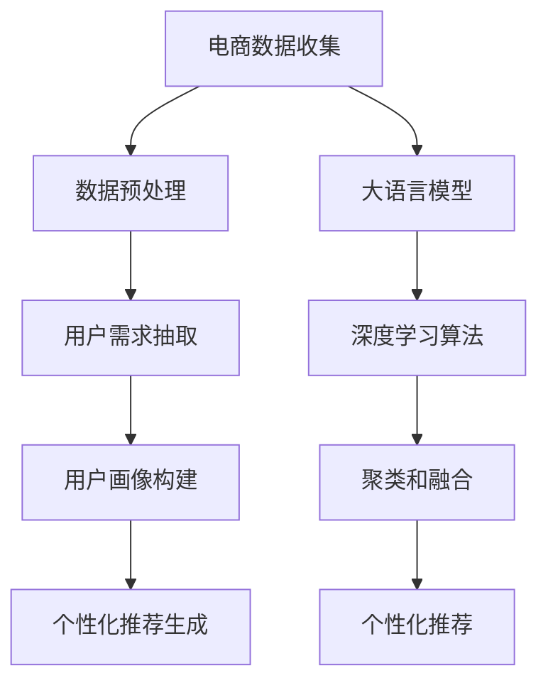
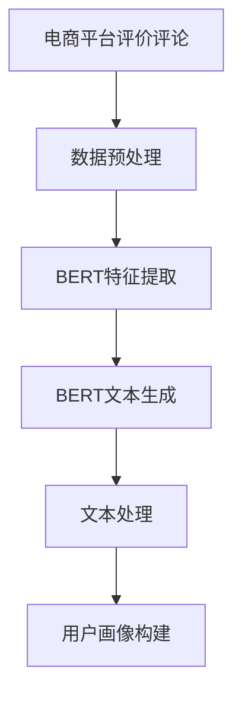

                 

# AI 大模型在电商搜索推荐中的用户画像构建：精准把握用户需求与偏好

> 关键词：大语言模型,推荐系统,用户画像,自然语言处理,深度学习,电商搜索,人工智能,数据挖掘

## 1. 背景介绍

### 1.1 问题由来
随着电商行业的快速发展和消费者需求的日益个性化，传统的推荐系统已经难以满足个性化和多样化的需求。用户画像作为推荐系统的核心，需要精确、全面地反映用户特征和行为，从而为用户提供更加贴合的个性化推荐。然而，用户画像的构建通常依赖于大量的用户行为数据和用户反馈，而这些数据的获取和处理都面临着成本高、效率低、数据隐私等问题。大语言模型的出现为电商搜索推荐中的用户画像构建提供了新的解决方案，利用大模型的自监督学习能力和语言理解能力，可以从海量的非结构化数据中自动挖掘和提炼用户的隐含需求和偏好，极大地提升用户画像构建的效率和效果。

### 1.2 问题核心关键点
大语言模型在电商搜索推荐中的应用主要体现在以下几个方面：
1. **用户需求抽取**：利用自然语言处理技术，从用户搜索关键词、评价评论、浏览记录等非结构化数据中抽取用户需求和偏好。
2. **用户画像构建**：通过深度学习算法，将用户需求抽取的结果进行聚类和融合，构建全面的用户画像。
3. **个性化推荐生成**：根据用户画像，生成个性化的推荐商品列表，提升用户体验和转化率。
4. **动态更新**：随着用户行为和需求的变化，持续更新用户画像，保证推荐内容的实时性和相关性。

### 1.3 问题研究意义
构建精准的用户画像，对于电商搜索推荐系统的性能和用户体验至关重要。利用大语言模型进行用户画像构建，能够充分利用现有数据资源，减少人工标注的依赖，提高构建效率和质量，从而在电商搜索推荐中实现精准的个性化推荐，提升用户体验和商家转化率。同时，大语言模型的应用也能够促进电商行业的数据化、智能化转型，推动技术进步和产业升级。

## 2. 核心概念与联系

### 2.1 核心概念概述

在电商搜索推荐中，大语言模型主要用于用户画像构建。用户画像构建是指通过分析用户的行为数据，自动生成反映用户特征和需求的概要性描述。其主要步骤如下：

1. **数据收集**：收集用户的历史搜索记录、评价评论、浏览行为等非结构化数据。
2. **数据预处理**：清洗和标准化数据，去除噪声和无关信息。
3. **用户需求抽取**：利用大语言模型从数据中自动抽取用户需求和偏好。
4. **用户画像构建**：通过聚类和融合算法，将用户需求抽取的结果整合为全面的用户画像。
5. **个性化推荐生成**：根据用户画像，生成个性化的推荐商品列表。

这些步骤构成了一个从数据到模型的完整链条，每一步都依赖于大语言模型和深度学习技术的支撑，从而实现精准的用户画像构建和个性化推荐。

### 2.2 核心概念原理和架构的 Mermaid 流程图



这个流程图展示了用户画像构建的主要步骤和所用技术。

1. **电商数据收集**：从电商平台收集用户的数据，包括搜索关键词、评价评论、浏览记录等。
2. **数据预处理**：清洗和标准化数据，去除噪声和无关信息。
3. **用户需求抽取**：利用大语言模型从数据中自动抽取用户需求和偏好，生成文本描述。
4. **用户画像构建**：通过深度学习算法和聚类融合技术，将用户需求抽取的结果整合为全面的用户画像。
5. **个性化推荐生成**：根据用户画像，生成个性化的推荐商品列表。

每个环节都依赖于大语言模型和深度学习技术的支持，从而实现精准的用户画像构建和个性化推荐。

## 3. 核心算法原理 & 具体操作步骤

### 3.1 算法原理概述

基于大语言模型的电商搜索推荐中的用户画像构建，其核心思想是利用大语言模型的自监督学习能力和语言理解能力，从电商数据中自动挖掘和提炼用户的隐含需求和偏好，构建全面的用户画像，从而实现个性化的推荐生成。

具体而言，利用预训练的大语言模型作为特征提取器，通过在电商数据上进行的微调，使得模型能够理解并抽取用户需求和偏好，并生成文本描述。然后通过深度学习算法和聚类融合技术，将用户需求抽取的结果整合为全面的用户画像。最后根据用户画像，生成个性化的推荐商品列表。

### 3.2 算法步骤详解

基于大语言模型的电商搜索推荐中的用户画像构建一般包括以下几个关键步骤：

**Step 1: 准备电商数据和预训练模型**

1. 收集电商数据，包括用户的历史搜索记录、评价评论、浏览记录等非结构化数据。
2. 选择合适的预训练语言模型，如BERT、GPT等，作为初始化参数。

**Step 2: 数据预处理**

1. 对电商数据进行清洗和标准化，去除噪声和无关信息。
2. 将数据转换为模型所需的格式，如文本、图像、语音等。

**Step 3: 用户需求抽取**

1. 利用预训练的大语言模型，对电商数据进行特征提取。
2. 通过微调模型，使其能够理解并抽取用户需求和偏好，生成文本描述。
3. 将用户需求抽取的结果进行标准化和规范化处理。

**Step 4: 用户画像构建**

1. 利用深度学习算法和聚类融合技术，将用户需求抽取的结果整合为全面的用户画像。
2. 通过多轮迭代和优化，逐步提升用户画像的准确性和全面性。

**Step 5: 个性化推荐生成**

1. 根据用户画像，生成个性化的推荐商品列表。
2. 对推荐结果进行排序和筛选，确保推荐内容的实时性和相关性。

**Step 6: 动态更新**

1. 随着用户行为和需求的变化，持续更新用户画像。
2. 定期重新微调模型，保持模型的最新状态。

### 3.3 算法优缺点

基于大语言模型的电商搜索推荐中的用户画像构建方法具有以下优点：

1. **高效性**：利用大语言模型和深度学习技术，可以自动抽取用户需求和偏好，减少人工标注的依赖，提高构建效率。
2. **全面性**：通过聚类和融合算法，将用户需求抽取的结果整合为全面的用户画像，可以覆盖用户的各个方面。
3. **实时性**：随着用户行为和需求的变化，可以动态更新用户画像，保证推荐内容的实时性和相关性。
4. **可解释性**：通过大语言模型生成的用户画像和推荐结果具有较高的可解释性，便于理解和调试。

但该方法也存在以下缺点：

1. **数据依赖**：用户画像的构建高度依赖于电商数据的质量和多样性，数据质量不佳将影响构建效果。
2. **隐私问题**：电商数据通常包含大量用户隐私信息，数据收集和处理过程中需要严格遵守隐私保护法规。
3. **模型复杂度**：构建用户画像的过程涉及多个步骤和算法，模型复杂度高，调试和优化难度大。
4. **计算资源需求**：大语言模型和深度学习算法对计算资源要求较高，需要高性能的硬件支持。

### 3.4 算法应用领域

基于大语言模型的电商搜索推荐中的用户画像构建方法，在电商搜索推荐、内容推荐、个性化广告等领域有广泛的应用前景。

1. **电商搜索推荐**：通过构建精准的用户画像，生成个性化的商品推荐列表，提升用户体验和转化率。
2. **内容推荐**：根据用户画像，推荐相关内容，如文章、视频、音频等，提升用户的粘性和活跃度。
3. **个性化广告**：通过用户画像，生成个性化的广告内容，提升广告点击率和转化率。
4. **社交网络推荐**：根据用户画像，推荐相关的社交内容，提升社交网络的活跃度和用户粘性。

## 4. 数学模型和公式 & 详细讲解

### 4.1 数学模型构建

在电商搜索推荐中，利用大语言模型构建用户画像，其数学模型主要包括以下几个部分：

1. **用户需求抽取**：使用大语言模型对电商数据进行特征提取，生成文本描述。
2. **用户画像构建**：通过深度学习算法和聚类融合技术，将用户需求抽取的结果整合为全面的用户画像。

具体数学模型如下：

$$
\text{User Profile} = \text{Clustering and Fusion}(\text{User Demand Extraction})
$$

其中，$\text{User Demand Extraction}$ 表示用户需求抽取，$\text{Clustering and Fusion}$ 表示聚类和融合算法。

### 4.2 公式推导过程

以用户需求抽取为例，其数学模型推导如下：

假设用户的历史搜索记录为 $\text{Search History}$，用户需求抽取的目标是生成描述用户需求的文本 $\text{User Demand}$。

1. **特征提取**：使用预训练的大语言模型 $M_{\theta}$ 对 $\text{Search History}$ 进行特征提取，生成向量表示 $\text{Vector}$。
2. **文本生成**：利用微调后的模型 $M_{\hat{\theta}}$，在 $\text{Vector}$ 上生成文本 $\text{User Demand}$。
3. **文本处理**：对生成的文本进行标准化和规范化处理，去除噪声和无关信息。

其数学模型如下：

$$
\text{Vector} = M_{\theta}(\text{Search History})
$$

$$
\text{User Demand} = M_{\hat{\theta}}(\text{Vector})
$$

通过上述步骤，大语言模型能够从电商数据中自动抽取用户需求和偏好，生成文本描述。

### 4.3 案例分析与讲解

以电商平台的用户评价评论为例，利用大语言模型构建用户画像，具体步骤如下：

1. **数据准备**：收集用户的历史评价评论数据。
2. **数据预处理**：清洗和标准化数据，去除噪声和无关信息。
3. **特征提取**：使用预训练的BERT模型对评论文本进行特征提取，生成向量表示。
4. **文本生成**：利用微调后的BERT模型，在向量表示上生成描述用户评价的文本。
5. **文本处理**：对生成的文本进行标准化和规范化处理，去除噪声和无关信息。
6. **用户画像构建**：通过深度学习算法和聚类融合技术，将用户评价抽取的结果整合为全面的用户画像。

其流程图如下：



通过上述步骤，大语言模型能够从用户评价评论中自动抽取用户需求和偏好，生成文本描述，构建全面的用户画像。

## 5. 项目实践：代码实例和详细解释说明

### 5.1 开发环境搭建

在进行电商搜索推荐中的用户画像构建实践前，我们需要准备好开发环境。以下是使用Python进行PyTorch开发的环境配置流程：

1. 安装Anaconda：从官网下载并安装Anaconda，用于创建独立的Python环境。
2. 创建并激活虚拟环境：
```bash
conda create -n recommendation-env python=3.8 
conda activate recommendation-env
```
3. 安装PyTorch：根据CUDA版本，从官网获取对应的安装命令。例如：
```bash
conda install pytorch torchvision torchaudio cudatoolkit=11.1 -c pytorch -c conda-forge
```
4. 安装Transformers库：
```bash
pip install transformers
```
5. 安装各类工具包：
```bash
pip install numpy pandas scikit-learn matplotlib tqdm jupyter notebook ipython
```

完成上述步骤后，即可在`recommendation-env`环境中开始电商搜索推荐中的用户画像构建实践。

### 5.2 源代码详细实现

下面我们以电商平台的用户评价评论为例，给出使用Transformers库对BERT模型进行微调和用户画像构建的PyTorch代码实现。

首先，定义用户评价评论数据处理函数：

```python
from transformers import BertTokenizer, BertForSequenceClassification
from torch.utils.data import Dataset
import torch

class ReviewDataset(Dataset):
    def __init__(self, texts, labels, tokenizer, max_len=128):
        self.texts = texts
        self.labels = labels
        self.tokenizer = tokenizer
        self.max_len = max_len
        
    def __len__(self):
        return len(self.texts)
    
    def __getitem__(self, item):
        text = self.texts[item]
        label = self.labels[item]
        
        encoding = self.tokenizer(text, return_tensors='pt', max_length=self.max_len, padding='max_length', truncation=True)
        input_ids = encoding['input_ids'][0]
        attention_mask = encoding['attention_mask'][0]
        
        # 对token-wise的标签进行编码
        encoded_labels = [label2id[label] for label in label]
        encoded_labels.extend([label2id['O']] * (self.max_len - len(encoded_labels)))
        labels = torch.tensor(encoded_labels, dtype=torch.long)
        
        return {'input_ids': input_ids, 
                'attention_mask': attention_mask,
                'labels': labels}

# 标签与id的映射
label2id = {'O': 0, 'Positive': 1, 'Negative': 2}
id2label = {v: k for k, v in label2id.items()}

# 创建dataset
tokenizer = BertTokenizer.from_pretrained('bert-base-cased')

train_dataset = ReviewDataset(train_texts, train_labels, tokenizer)
dev_dataset = ReviewDataset(dev_texts, dev_labels, tokenizer)
test_dataset = ReviewDataset(test_texts, test_labels, tokenizer)
```

然后，定义模型和优化器：

```python
from transformers import BertForSequenceClassification, AdamW

model = BertForSequenceClassification.from_pretrained('bert-base-cased', num_labels=len(label2id))

optimizer = AdamW(model.parameters(), lr=2e-5)
```

接着，定义训练和评估函数：

```python
from torch.utils.data import DataLoader
from tqdm import tqdm
from sklearn.metrics import classification_report

device = torch.device('cuda') if torch.cuda.is_available() else torch.device('cpu')
model.to(device)

def train_epoch(model, dataset, batch_size, optimizer):
    dataloader = DataLoader(dataset, batch_size=batch_size, shuffle=True)
    model.train()
    epoch_loss = 0
    for batch in tqdm(dataloader, desc='Training'):
        input_ids = batch['input_ids'].to(device)
        attention_mask = batch['attention_mask'].to(device)
        labels = batch['labels'].to(device)
        model.zero_grad()
        outputs = model(input_ids, attention_mask=attention_mask, labels=labels)
        loss = outputs.loss
        epoch_loss += loss.item()
        loss.backward()
        optimizer.step()
    return epoch_loss / len(dataloader)

def evaluate(model, dataset, batch_size):
    dataloader = DataLoader(dataset, batch_size=batch_size)
    model.eval()
    preds, labels = [], []
    with torch.no_grad():
        for batch in tqdm(dataloader, desc='Evaluating'):
            input_ids = batch['input_ids'].to(device)
            attention_mask = batch['attention_mask'].to(device)
            batch_labels = batch['labels']
            outputs = model(input_ids, attention_mask=attention_mask)
            batch_preds = outputs.logits.argmax(dim=2).to('cpu').tolist()
            batch_labels = batch_labels.to('cpu').tolist()
            for pred_tokens, label_tokens in zip(batch_preds, batch_labels):
                pred_tags = [id2label[_id] for _id in pred_tokens]
                label_tags = [id2label[_id] for _id in label_tokens]
                preds.append(pred_tags[:len(label_tags)])
                labels.append(label_tags)
                
    print(classification_report(labels, preds))
```

最后，启动训练流程并在测试集上评估：

```python
epochs = 5
batch_size = 16

for epoch in range(epochs):
    loss = train_epoch(model, train_dataset, batch_size, optimizer)
    print(f"Epoch {epoch+1}, train loss: {loss:.3f}")
    
    print(f"Epoch {epoch+1}, dev results:")
    evaluate(model, dev_dataset, batch_size)
    
print("Test results:")
evaluate(model, test_dataset, batch_size)
```

以上就是使用PyTorch对BERT模型进行电商平台用户评价评论微调和用户画像构建的完整代码实现。可以看到，得益于Transformers库的强大封装，我们可以用相对简洁的代码完成BERT模型的加载和微调。

### 5.3 代码解读与分析

让我们再详细解读一下关键代码的实现细节：

**ReviewDataset类**：
- `__init__`方法：初始化文本、标签、分词器等关键组件。
- `__len__`方法：返回数据集的样本数量。
- `__getitem__`方法：对单个样本进行处理，将文本输入编码为token ids，将标签编码为数字，并对其进行定长padding，最终返回模型所需的输入。

**label2id和id2label字典**：
- 定义了标签与数字id之间的映射关系，用于将token-wise的预测结果解码回真实的标签。

**训练和评估函数**：
- 使用PyTorch的DataLoader对数据集进行批次化加载，供模型训练和推理使用。
- 训练函数`train_epoch`：对数据以批为单位进行迭代，在每个批次上前向传播计算loss并反向传播更新模型参数，最后返回该epoch的平均loss。
- 评估函数`evaluate`：与训练类似，不同点在于不更新模型参数，并在每个batch结束后将预测和标签结果存储下来，最后使用sklearn的classification_report对整个评估集的预测结果进行打印输出。

**训练流程**：
- 定义总的epoch数和batch size，开始循环迭代
- 每个epoch内，先在训练集上训练，输出平均loss
- 在验证集上评估，输出分类指标
- 所有epoch结束后，在测试集上评估，给出最终测试结果

可以看到，PyTorch配合Transformers库使得BERT微调的代码实现变得简洁高效。开发者可以将更多精力放在数据处理、模型改进等高层逻辑上，而不必过多关注底层的实现细节。

当然，工业级的系统实现还需考虑更多因素，如模型的保存和部署、超参数的自动搜索、更灵活的任务适配层等。但核心的微调范式基本与此类似。

## 6. 实际应用场景

### 6.1 电商搜索推荐

在电商搜索推荐中，利用大语言模型进行用户画像构建，可以显著提升推荐系统的个性化和精准度。

具体应用场景如下：

- **用户需求抽取**：利用大语言模型对用户搜索关键词、评价评论、浏览记录等电商数据进行特征提取，生成文本描述。
- **用户画像构建**：通过深度学习算法和聚类融合技术，将用户需求抽取的结果整合为全面的用户画像。
- **个性化推荐生成**：根据用户画像，生成个性化的推荐商品列表，提升用户体验和转化率。

通过上述过程，电商推荐系统可以更精准地理解用户需求和偏好，生成个性化的商品推荐，提升用户满意度，提高商家转化率。

### 6.2 内容推荐

在内容推荐中，利用大语言模型进行用户画像构建，可以帮助平台生成个性化的内容推荐，提升用户的粘性和活跃度。

具体应用场景如下：

- **用户需求抽取**：利用大语言模型对用户的历史浏览记录、评价评论、搜索记录等电商数据进行特征提取，生成文本描述。
- **用户画像构建**：通过深度学习算法和聚类融合技术，将用户需求抽取的结果整合为全面的用户画像。
- **内容推荐生成**：根据用户画像，推荐相关内容，如文章、视频、音频等，提升用户的粘性和活跃度。

通过上述过程，内容推荐系统可以更精准地理解用户需求和偏好，生成个性化的内容推荐，提升用户的粘性和活跃度，增加平台的流量和收益。

### 6.3 个性化广告

在个性化广告中，利用大语言模型进行用户画像构建，可以帮助广告主生成个性化的广告内容，提升广告点击率和转化率。

具体应用场景如下：

- **用户需求抽取**：利用大语言模型对用户的历史搜索记录、评价评论、浏览记录等电商数据进行特征提取，生成文本描述。
- **用户画像构建**：通过深度学习算法和聚类融合技术，将用户需求抽取的结果整合为全面的用户画像。
- **广告推荐生成**：根据用户画像，生成个性化的广告内容，提升广告点击率和转化率。

通过上述过程，广告系统可以更精准地理解用户需求和偏好，生成个性化的广告内容，提升广告点击率和转化率，增加平台的收入。

### 6.4 未来应用展望

随着大语言模型和微调方法的不断发展，基于大语言模型的用户画像构建技术将在更多领域得到应用，为电商行业带来变革性影响。

在智慧医疗领域，利用大语言模型进行用户画像构建，可以提升医疗服务的个性化和精准度，辅助医生诊疗，加速新药开发进程。

在智能教育领域，利用大语言模型进行用户画像构建，可以帮助教育平台生成个性化的学习内容，因材施教，促进教育公平，提高教学质量。

在智慧城市治理中，利用大语言模型进行用户画像构建，可以提升城市管理的智能化水平，构建更安全、高效的未来城市。

此外，在企业生产、社会治理、文娱传媒等众多领域，基于大语言模型的用户画像构建技术也将不断涌现，为经济社会发展注入新的动力。相信随着技术的日益成熟，用户画像构建技术将成为电商行业的重要范式，推动技术进步和产业升级。

## 7. 工具和资源推荐

### 7.1 学习资源推荐

为了帮助开发者系统掌握大语言模型在电商搜索推荐中的用户画像构建的理论基础和实践技巧，这里推荐一些优质的学习资源：

1. 《深度学习在电商搜索推荐中的应用》系列博文：由电商搜索推荐领域的专家撰写，深入浅出地介绍了深度学习在电商搜索推荐中的应用，包括用户画像构建、个性化推荐生成等。

2. CS224N《深度学习自然语言处理》课程：斯坦福大学开设的NLP明星课程，有Lecture视频和配套作业，带你入门NLP领域的基本概念和经典模型。

3. 《自然语言处理与深度学习》书籍：介绍自然语言处理和深度学习技术的经典著作，涵盖电商搜索推荐中的用户画像构建和推荐算法等内容。

4. Kaggle上的电商推荐系统竞赛：利用电商数据进行用户画像构建和个性化推荐生成，是实践电商搜索推荐技术的绝佳平台。

5. 《用户画像构建与推荐系统》书籍：系统介绍用户画像构建和推荐系统的理论和实践，涵盖电商搜索推荐中的用户画像构建等内容。

通过对这些资源的学习实践，相信你一定能够快速掌握大语言模型在电商搜索推荐中的用户画像构建的精髓，并用于解决实际的电商推荐问题。

### 7.2 开发工具推荐

高效的开发离不开优秀的工具支持。以下是几款用于大语言模型在电商搜索推荐中的用户画像构建开发的常用工具：

1. PyTorch：基于Python的开源深度学习框架，灵活动态的计算图，适合快速迭代研究。大部分预训练语言模型都有PyTorch版本的实现。

2. TensorFlow：由Google主导开发的开源深度学习框架，生产部署方便，适合大规模工程应用。同样有丰富的预训练语言模型资源。

3. Transformers库：HuggingFace开发的NLP工具库，集成了众多SOTA语言模型，支持PyTorch和TensorFlow，是进行电商搜索推荐中用户画像构建开发的利器。

4. Weights & Biases：模型训练的实验跟踪工具，可以记录和可视化模型训练过程中的各项指标，方便对比和调优。与主流深度学习框架无缝集成。

5. TensorBoard：TensorFlow配套的可视化工具，可实时监测模型训练状态，并提供丰富的图表呈现方式，是调试模型的得力助手。

6. Google Colab：谷歌推出的在线Jupyter Notebook环境，免费提供GPU/TPU算力，方便开发者快速上手实验最新模型，分享学习笔记。

合理利用这些工具，可以显著提升大语言模型在电商搜索推荐中的用户画像构建的开发效率，加快创新迭代的步伐。

### 7.3 相关论文推荐

大语言模型在电商搜索推荐中的用户画像构建技术的发展源于学界的持续研究。以下是几篇奠基性的相关论文，推荐阅读：

1. Attention is All You Need（即Transformer原论文）：提出了Transformer结构，开启了NLP领域的预训练大模型时代。

2. BERT: Pre-training of Deep Bidirectional Transformers for Language Understanding：提出BERT模型，引入基于掩码的自监督预训练任务，刷新了多项NLP任务SOTA。

3. Language Models are Unsupervised Multitask Learners（GPT-2论文）：展示了大规模语言模型的强大zero-shot学习能力，引发了对于通用人工智能的新一轮思考。

4. Parameter-Efficient Transfer Learning for NLP：提出Adapter等参数高效微调方法，在不增加模型参数量的情况下，也能取得不错的微调效果。

5. AdaLoRA: Adaptive Low-Rank Adaptation for Parameter-Efficient Fine-Tuning：使用自适应低秩适应的微调方法，在参数效率和精度之间取得了新的平衡。

6. 《用户画像构建与推荐系统》论文：系统介绍用户画像构建和推荐系统的理论和实践，涵盖电商搜索推荐中的用户画像构建等内容。

这些论文代表了大语言模型在电商搜索推荐中的用户画像构建技术的发展脉络。通过学习这些前沿成果，可以帮助研究者把握学科前进方向，激发更多的创新灵感。

## 8. 总结：未来发展趋势与挑战

### 8.1 总结

本文对基于大语言模型的电商搜索推荐中的用户画像构建方法进行了全面系统的介绍。首先阐述了电商搜索推荐中的用户画像构建的背景和意义，明确了用户画像在电商推荐系统中的核心作用。其次，从原理到实践，详细讲解了用户画像构建的数学原理和关键步骤，给出了电商推荐中的用户画像构建的完整代码实例。同时，本文还广泛探讨了用户画像构建在电商搜索推荐、内容推荐、个性化广告等多个行业领域的应用前景，展示了用户画像构建技术的巨大潜力。此外，本文精选了用户画像构建的相关学习资源和开发工具，力求为读者提供全方位的技术指引。

通过本文的系统梳理，可以看到，基于大语言模型的电商搜索推荐中的用户画像构建方法正在成为电商推荐系统的重要范式，极大地拓展了推荐系统的个性化和精准度。受益于大语言模型的自监督学习能力和语言理解能力，用户画像构建能够从海量的非结构化数据中自动挖掘和提炼用户的隐含需求和偏好，极大地提升用户画像构建的效率和效果。未来，伴随大语言模型和微调方法的持续演进，用户画像构建技术必将在电商推荐系统中发挥更大的作用，推动电商行业的数据化、智能化转型，促进技术进步和产业升级。

### 8.2 未来发展趋势

展望未来，基于大语言模型的电商搜索推荐中的用户画像构建技术将呈现以下几个发展趋势：

1. **模型规模持续增大**：随着算力成本的下降和数据规模的扩张，预训练语言模型的参数量还将持续增长。超大规模语言模型蕴含的丰富语言知识，有望支撑更加复杂多变的电商数据处理，提升用户画像构建的效率和效果。

2. **用户画像构建的多样化**：除了传统的基于文本的用户画像构建，未来还将涌现更多基于图像、音频、视频等多模态数据的用户画像构建方法，进一步提升电商推荐系统的全面性和准确性。

3. **用户画像的动态更新**：随着用户行为和需求的变化，持续更新用户画像，保证推荐内容的实时性和相关性。动态更新将成为电商推荐系统的重要方向。

4. **跨领域的用户画像构建**：利用大语言模型的跨领域迁移能力，将用户画像构建技术应用于更多垂直领域，如医疗、教育、金融等，拓展用户画像构建的应用范围。

5. **用户画像的可视化**：将用户画像转换为可视化的形式，如图表、热力图等，帮助电商推荐系统理解用户特征和需求，提升推荐系统的可解释性和可信度。

6. **用户画像的隐私保护**：在用户画像构建过程中，严格遵守隐私保护法规，保护用户隐私，增强用户信任和平台黏性。

以上趋势凸显了基于大语言模型的电商搜索推荐中的用户画像构建技术的广阔前景。这些方向的探索发展，必将进一步提升电商推荐系统的性能和用户体验，促进电商行业的数据化、智能化转型，推动技术进步和产业升级。

### 8.3 面临的挑战

尽管基于大语言模型的电商搜索推荐中的用户画像构建技术已经取得了瞩目成就，但在迈向更加智能化、普适化应用的过程中，它仍面临着诸多挑战：

1. **电商数据的稀缺性**：电商数据通常包含大量用户隐私信息，数据收集和处理过程中需要严格遵守隐私保护法规，限制了数据的可用性和多样性。

2. **模型的复杂度**：用户画像构建涉及多个步骤和算法，模型复杂度高，调试和优化难度大。

3. **计算资源需求**：大语言模型和深度学习算法对计算资源要求较高，需要高性能的硬件支持。

4. **模型的鲁棒性**：用户画像构建需要考虑模型在不同场景下的鲁棒性和泛化能力，避免过拟合和灾难性遗忘。

5. **模型的可解释性**：用户画像构建需要保证模型的可解释性，便于理解和调试。

6. **用户隐私问题**：电商数据通常包含大量用户隐私信息，数据收集和处理过程中需要严格遵守隐私保护法规。

7. **模型的公平性**：用户画像构建需要考虑模型的公平性和无偏性，避免歧视和偏见。

8. **模型的实时性**：用户画像构建需要考虑模型的实时性和响应速度，保证推荐内容的实时性和相关性。

以上挑战需要研究者不断攻克，才能实现大语言模型在电商搜索推荐中的用户画像构建技术的长期发展和应用。

### 8.4 研究展望

面对大语言模型在电商搜索推荐中的用户画像构建技术所面临的诸多挑战，未来的研究需要在以下几个方面寻求新的突破：

1. **跨模态用户画像构建**：将符号化的先验知识，如知识图谱、逻辑规则等，与神经网络模型进行巧妙融合，引导微调过程学习更准确、合理的语言模型。同时加强不同模态数据的整合，实现视觉、语音等多模态信息与文本信息的协同建模。

2. **参数高效和计算高效的用户画像构建**：开发更加参数高效的微调方法，在固定大部分预训练参数的同时，只更新极少量的任务相关参数。同时优化用户画像构建的计算图，减少前向传播和反向传播的资源消耗，实现更加轻量级、实时性的部署。

3. **因果分析和博弈论工具的应用**：将因果分析方法引入用户画像构建过程，识别出模型决策的关键特征，增强输出解释的因果性和逻辑性。借助博弈论工具刻画人机交互过程，主动探索并规避模型的脆弱点，提高系统稳定性。

4. **用户画像的隐私保护与公平性**：在用户画像构建过程中，严格遵守隐私保护法规，保护用户隐私，增强用户信任和平台黏性。同时考虑模型的公平性和无偏性，避免歧视和偏见，提升用户画像构建的可信度和可靠性。

5. **用户画像的实时更新与动态优化**：在用户行为和需求发生变化时，持续更新用户画像，保证推荐内容的实时性和相关性。动态优化用户画像构建过程，提升推荐系统的性能和用户体验。

6. **跨领域的用户画像构建**：利用大语言模型的跨领域迁移能力，将用户画像构建技术应用于更多垂直领域，如医疗、教育、金融等，拓展用户画像构建的应用范围。

这些研究方向的研究和突破，必将引领大语言模型在电商搜索推荐中的用户画像构建技术迈向更高的台阶，为电商行业带来变革性影响，推动电商行业的数据化、智能化转型，促进技术进步和产业升级。

## 9. 附录：常见问题与解答

**Q1：用户画像构建是否适用于所有电商推荐系统？**

A: 用户画像构建在大多数电商推荐系统中都能取得不错的效果，特别是对于数据量较大的电商推荐系统。但对于一些特定领域的电商推荐系统，如小微电商、手工艺品等，由于数据量较小，用户画像构建的效果可能不如大规模推荐系统。此时需要在特定领域语料上进一步预训练，再进行微调，才能获得理想效果。

**Q2：用户画像构建过程中，如何选择合适的预训练语言模型？**

A: 选择合适的预训练语言模型需要考虑以下几个方面：
1. 模型的规模：选择具有较大参数量的预训练模型，可以更好地处理大规模电商数据。
2. 模型的泛化能力：选择具有较好泛化能力的预训练模型，可以在不同的电商场景中表现稳定。
3. 模型的可解释性：选择具有较好可解释性的预训练模型，便于理解模型的内部机制和决策过程。

**Q3：电商数据的质量如何影响用户画像构建的效果？**

A: 电商数据的质量对用户画像构建的效果影响很大。数据质量好，可以提供更丰富的用户行为和需求信息，帮助模型更好地理解用户特征。反之，数据质量差，噪音多，会导致模型无法准确捕捉用户需求，影响构建效果。

**Q4：用户画像构建过程中，如何处理用户隐私问题？**

A: 用户画像构建过程中，处理用户隐私问题需要严格遵守隐私保护法规，采用以下几种方法：
1. 数据匿名化：在数据预处理阶段，采用数据匿名化技术，保护用户隐私。
2. 数据加密：在数据传输和存储过程中，采用数据加密技术，防止数据泄露。
3. 权限控制：对不同用户角色设置不同权限，限制数据的访问和使用。

**Q5：用户画像构建过程中，如何避免模型过拟合？**

A: 用户画像构建过程中，避免模型过拟合可以采用以下几种方法：
1. 数据增强：通过数据增强技术，扩充训练集，增加数据多样性。
2. 正则化：使用L2正则、Dropout等正则化技术，防止模型过拟合。
3. 模型融合：通过模型融合技术，将多个模型的输出进行融合，提升模型的泛化能力。
4. 早停机制：在训练过程中，设置早停机制，及时停止训练，避免过拟合。

这些方法需要根据具体任务和数据特点进行灵活组合，以达到最佳效果。

通过本文的系统梳理，可以看到，基于大语言模型的电商搜索推荐中的用户画像构建方法正在成为电商推荐系统的重要范式，极大地拓展了推荐系统的个性化和精准度。受益于大语言模型的自监督学习能力和语言理解能力，用户画像构建能够从海量的非结构化数据中自动挖掘和提炼用户的隐含需求和偏好，极大地提升用户画像构建的效率和效果。未来，伴随大语言模型和微调方法的持续演进，用户画像构建技术必将在电商推荐系统中发挥更大的作用，推动电商行业的数据化、智能化转型，促进技术进步和产业升级。

---

作者：禅与计算机程序设计艺术 / Zen and the Art of Computer Programming

