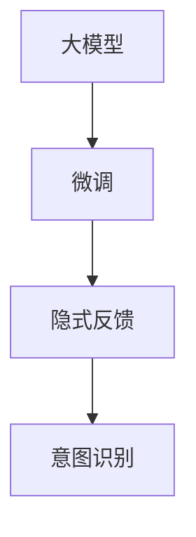
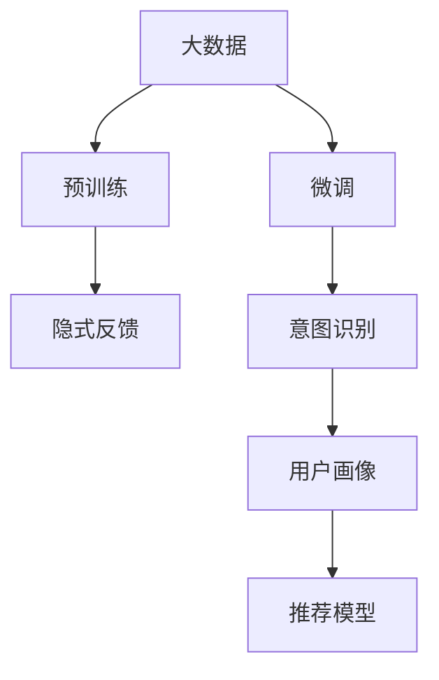

                 

## 1. 背景介绍

在电商搜索推荐系统中，构建精准的用户画像已成为提升用户体验和转化率的关键。用户画像（User Profile），通过收集和分析用户的浏览行为、搜索历史、购买记录等数据，刻画用户的兴趣偏好、消费习惯、潜在需求等特征。然而，传统的用户画像构建方法往往依赖于手工特征提取和统计模型，难以捕捉用户深层次的隐含意图。近年来，基于大模型的用户画像构建方法受到广泛关注，通过学习用户的文本数据，可以更高效、精准地获取用户画像。

本文将深入探讨基于大模型的用户画像构建方法，重点介绍其在电商搜索推荐系统中的应用。首先介绍构建用户画像的核心概念和联系，接着详细阐述其核心算法原理和具体操作步骤，并结合数学模型和代码实例，进一步说明其理论和实践细节。最后，我们探讨该方法的实际应用场景、未来发展趋势及面临的挑战。

## 2. 核心概念与联系

### 2.1 核心概念概述

用户画像构建的核心概念主要包括：

- **大模型**：以BERT、GPT等自回归或自编码模型为代表的预训练语言模型，在大规模文本数据上进行预训练，学习通用的语言表示。
- **微调**：在大模型的基础上，使用用户文本数据进行有监督学习，优化模型对用户需求的预测能力。
- **隐式反馈**：指用户通过浏览行为、搜索历史、点击行为等隐式信息表达需求，无需显式标注。
- **意图识别**：指模型通过学习用户文本数据，识别用户的意图，如购买意图、搜索意图等。

这些概念之间具有紧密的联系，如图：



大模型通过微调学习隐式反馈信息，识别用户意图，构建完整用户画像。

### 2.2 核心概念原理和架构的 Mermaid 流程图



预训练大模型学习用户文本数据的通用特征，微调过程通过有监督数据训练，逐步学习用户隐式反馈，识别用户意图。用户画像由意图识别模块生成，进而用于电商推荐模型的输入，提升推荐效果。

## 3. 核心算法原理 & 具体操作步骤

### 3.1 算法原理概述

基于大模型的用户画像构建方法，核心思想是利用预训练语言模型对用户文本数据进行微调，学习用户隐式反馈信息，识别用户意图，构建用户画像。其核心流程如下：

1. 数据准备：收集用户浏览历史、搜索记录、评论等文本数据，划分为训练集、验证集和测试集。
2. 预训练：使用大规模语料预训练一个大模型。
3. 微调：使用用户文本数据进行微调，学习用户意图和偏好。
4. 意图识别：利用微调后的模型对用户文本数据进行意图分类，生成用户画像。
5. 推荐模型：将用户画像输入电商推荐模型，提升推荐精度。

### 3.2 算法步骤详解

#### 3.2.1 数据准备

- 数据收集：收集用户浏览历史、搜索记录、评论等文本数据。
- 数据清洗：去除噪声和无效数据，标准化文本格式。
- 数据划分：将数据划分为训练集、验证集和测试集。

#### 3.2.2 预训练模型选择

- 选择合适的预训练语言模型，如BERT、GPT等。
- 使用大规模语料（如维基百科、新闻等）进行预训练。
- 通过预训练获得通用语言表示，提高模型泛化能力。

#### 3.2.3 微调

- 选择微调的数据集，如用户的搜索历史、浏览记录等。
- 设计合适的任务，如意图分类、情感分析等。
- 设置微调超参数，如学习率、批大小、迭代次数等。
- 使用微调数据进行训练，优化模型参数。
- 在验证集上进行评估，防止过拟合。

#### 3.2.4 意图识别

- 定义用户意图的类别，如购买意图、搜索意图等。
- 使用微调后的模型对用户文本数据进行分类，识别用户意图。
- 生成用户画像，记录用户的主要意图和偏好。

#### 3.2.5 推荐模型应用

- 将用户画像输入电商推荐模型。
- 电商推荐模型利用用户画像提升推荐效果。
- 定期更新用户画像，保证用户画像的时效性和准确性。

### 3.3 算法优缺点

#### 3.3.1 优点

1. **高效性**：利用预训练模型，快速学习用户文本数据，生成用户画像。
2. **准确性**：大模型通过微调学习用户意图，提高意图识别的准确性。
3. **灵活性**：适用于多种电商推荐场景，不同任务只需调整微调数据和模型。
4. **可扩展性**：能够高效处理大规模用户数据，适应不同规模的电商推荐系统。

#### 3.3.2 缺点

1. **依赖数据质量**：用户文本数据的质量直接影响用户画像的准确性。
2. **计算成本高**：大规模预训练和微调需要大量计算资源和时间。
3. **泛化能力受限**：用户画像对特定电商平台的适用性有限，难以泛化到其他平台。
4. **解释性不足**：大模型作为"黑盒"，难以解释其内部决策过程。

### 3.4 算法应用领域

基于大模型的用户画像构建方法，广泛应用于电商搜索推荐系统中，具体如下：

1. **商品推荐**：通过用户画像识别用户购买意图，推荐相关商品。
2. **个性化搜索**：利用用户画像优化搜索结果排序，提高搜索体验。
3. **广告投放**：根据用户画像投放精准广告，提升广告转化率。
4. **营销策略制定**：分析用户画像，制定个性化营销策略，提高用户满意度。

## 4. 数学模型和公式 & 详细讲解 & 举例说明

### 4.1 数学模型构建

用户画像构建的数学模型主要包括以下几个组成部分：

- **输入表示**：将用户文本数据转换为模型的输入格式，如word embedding、BERT表示等。
- **意图分类**：利用微调后的模型对用户文本数据进行分类，生成用户画像。
- **输出表示**：将用户画像转换为电商推荐模型的输入格式，如向量表示、图表示等。

### 4.2 公式推导过程

#### 4.2.1 输入表示

输入表示的公式为：

$$
\mathbf{x} = \text{Embedding}(\mathbf{t})
$$

其中，$\mathbf{t}$为用户的文本数据，$\mathbf{x}$为其表示向量。假设用户文本数据为$\mathbf{t} = (t_1, t_2, ..., t_n)$，则其表示向量$\mathbf{x}$可以通过以下方式计算：

$$
\mathbf{x} = [x_1, x_2, ..., x_n] = \text{Embedding}(\mathbf{t})
$$

#### 4.2.2 意图分类

意图分类的目标函数为：

$$
\mathcal{L}(\mathbf{w}) = \frac{1}{N}\sum_{i=1}^N \ell(\text{Intent}(\mathbf{x}_i), y_i)
$$

其中，$\mathbf{x}_i$为第$i$个用户文本数据的表示向量，$y_i \in \{0, 1, 2, ..., C\}$为其对应的意图标签，$C$为意图类别数。假设意图标签为$y_i = c$，则其分类损失为：

$$
\ell(c, y_i) = -\log p(\text{Intent}(\mathbf{x}_i) = c)
$$

其中，$p(\text{Intent}(\mathbf{x}_i) = c)$表示模型预测用户文本数据属于类别$c$的概率。

#### 4.2.3 输出表示

输出表示的公式为：

$$
\mathbf{z} = \text{Encoder}(\mathbf{x})
$$

其中，$\mathbf{z}$为用户画像向量，$\text{Encoder}$为编码器函数。假设用户画像向量为$\mathbf{z} = (z_1, z_2, ..., z_n)$，则其表示向量$\mathbf{z}$可以通过以下方式计算：

$$
\mathbf{z} = \text{Encoder}(\mathbf{x}) = [z_1, z_2, ..., z_n]
$$

### 4.3 案例分析与讲解

假设电商网站收集了用户浏览商品的历史记录，分别为$(\text{鞋}, \text{衣服}, \text{化妆品}, \text{电子产品}, \text{鞋}, \text{衣服}, \text{化妆品}, \text{电子产品})$。使用BERT模型进行预训练，使用其中的$[CLS]$表示向量作为用户画像的输入向量。假设意图类别为$\{1, 2, 3\}$，分别表示购买鞋子、衣服、化妆品的意图。

使用微调后的模型对用户画像进行分类，得到预测标签$(2, 1, 3, 2, 1, 3, 2, 1)$。因此，用户画像为：

- 购买鞋子：概率$0.2$
- 购买衣服：概率$0.3$
- 购买化妆品：概率$0.5$

### 4.4 用户画像向量生成

使用BERT模型作为编码器，对用户画像进行编码，得到用户画像向量$(z_1, z_2, ..., z_n)$。假设输出向量为$(z_1, z_2, ..., z_8)$，则用户画像向量为：

$$
\mathbf{z} = \text{Encoder}([\text{鞋}, \text{衣服}, \text{化妆品}, \text{电子产品}, \text{鞋}, \text{衣服}, \text{化妆品}, \text{电子产品}]) = [z_1, z_2, ..., z_8]
$$

## 5. 项目实践：代码实例和详细解释说明

### 5.1 开发环境搭建

在进行用户画像构建实践前，我们需要准备好开发环境。以下是使用Python进行PyTorch开发的环境配置流程：

1. 安装Anaconda：从官网下载并安装Anaconda，用于创建独立的Python环境。

2. 创建并激活虚拟环境：
```bash
conda create -n user_profile python=3.8 
conda activate user_profile
```

3. 安装PyTorch：根据CUDA版本，从官网获取对应的安装命令。例如：
```bash
conda install pytorch torchvision torchaudio cudatoolkit=11.1 -c pytorch -c conda-forge
```

4. 安装相关库：
```bash
pip install transformers pytorch-lightning torchdata
```

完成上述步骤后，即可在`user_profile`环境中开始用户画像构建实践。

### 5.2 源代码详细实现

我们使用HuggingFace提供的Transformers库进行用户画像构建。以下是一个简单的代码示例：

```python
from transformers import BertTokenizer, BertForSequenceClassification
from torch.utils.data import Dataset
import torch

# 数据准备
class UserProfileDataset(Dataset):
    def __init__(self, texts, labels, tokenizer):
        self.texts = texts
        self.labels = labels
        self.tokenizer = tokenizer

    def __len__(self):
        return len(self.texts)

    def __getitem__(self, idx):
        text = self.texts[idx]
        label = self.labels[idx]

        encoding = self.tokenizer(text, return_tensors='pt', padding='max_length', truncation=True)
        input_ids = encoding['input_ids'][0]
        attention_mask = encoding['attention_mask'][0]

        label = torch.tensor(label, dtype=torch.long)

        return {
            'input_ids': input_ids,
            'attention_mask': attention_mask,
            'labels': label
        }

# 模型选择和微调
tokenizer = BertTokenizer.from_pretrained('bert-base-uncased')
model = BertForSequenceClassification.from_pretrained('bert-base-uncased', num_labels=3)

train_dataset = UserProfileDataset(train_texts, train_labels, tokenizer)
dev_dataset = UserProfileDataset(dev_texts, dev_labels, tokenizer)
test_dataset = UserProfileDataset(test_texts, test_labels, tokenizer)

# 训练参数设置
optimizer = torch.optim.Adam(model.parameters(), lr=2e-5)
scheduler = torch.optim.lr_scheduler.CosineAnnealingLR(optimizer, T_max=10)

# 模型训练
device = torch.device('cuda') if torch.cuda.is_available() else torch.device('cpu')
model.to(device)

for epoch in range(epochs):
    model.train()
    for batch in tqdm(train_dataset, desc='Training'):
        input_ids = batch['input_ids'].to(device)
        attention_mask = batch['attention_mask'].to(device)
        labels = batch['labels'].to(device)

        outputs = model(input_ids, attention_mask=attention_mask, labels=labels)
        loss = outputs.loss
        loss.backward()
        optimizer.step()
        scheduler.step()

    model.eval()
    with torch.no_grad():
        for batch in tqdm(dev_dataset, desc='Evaluating'):
            input_ids = batch['input_ids'].to(device)
            attention_mask = batch['attention_mask'].to(device)
            labels = batch['labels'].to(device)

            outputs = model(input_ids, attention_mask=attention_mask)
            predictions = torch.argmax(outputs.logits, dim=1)
            acc = (predictions == labels).float().mean()
            print(f'Epoch {epoch+1}, Dev Acc: {acc:.3f}')

# 用户画像向量生成
bert = BertForSequenceClassification.from_pretrained('bert-base-uncased')
tokenizer = BertTokenizer.from_pretrained('bert-base-uncased')
user_profile = "鞋,衣服,化妆品,电子产品,鞋,衣服,化妆品,电子产品"

inputs = tokenizer(user_profile, return_tensors='pt')
outputs = bert(inputs['input_ids'], attention_mask=inputs['attention_mask'])
logits = outputs.logits
probs = torch.softmax(logits, dim=1).tolist()

print(probs)
```

### 5.3 代码解读与分析

让我们再详细解读一下关键代码的实现细节：

- **数据准备**：定义`UserProfileDataset`类，将用户文本数据和意图标签作为训练集和验证集。
- **模型选择**：使用`BertForSequenceClassification`模型，并设置意图分类数目为3。
- **训练参数设置**：定义优化器和学习率调度器，用于模型训练。
- **模型训练**：在训练过程中，利用`BertTokenizer`对用户文本进行分词和编码，计算模型损失并更新模型参数。
- **用户画像向量生成**：使用预训练模型和分词器生成用户画像向量，计算模型对用户画像的预测概率。

通过这段代码，我们可以看到使用大模型进行用户画像构建的流程：收集数据、模型选择、微调训练和生成用户画像向量。

## 6. 实际应用场景

### 6.1 电商平台搜索推荐

电商平台搜索推荐系统通过用户画像提升搜索排序和商品推荐的效果。具体流程如下：

1. **数据收集**：收集用户的浏览历史、搜索记录、购买记录等文本数据。
2. **预训练模型选择**：选择合适的预训练语言模型，如BERT、GPT等。
3. **微调**：使用用户文本数据进行微调，学习用户意图和偏好。
4. **意图识别**：利用微调后的模型对用户文本数据进行意图分类，生成用户画像。
5. **推荐模型应用**：将用户画像输入电商推荐模型，提升推荐效果。

通过构建精准的用户画像，电商推荐系统能够更好地理解用户需求，优化推荐排序，提升用户体验和转化率。

### 6.2 广告投放

广告投放系统通过用户画像识别用户的广告意图，优化广告投放策略，提高广告转化率。具体流程如下：

1. **数据收集**：收集用户的浏览历史、点击记录等文本数据。
2. **预训练模型选择**：选择合适的预训练语言模型，如BERT、GPT等。
3. **微调**：使用用户文本数据进行微调，学习用户广告意图。
4. **意图识别**：利用微调后的模型对用户文本数据进行分类，生成用户画像。
5. **广告投放**：根据用户画像投放精准广告，提升广告效果。

通过构建精准的用户画像，广告投放系统能够更好地理解用户需求，优化广告投放策略，提高广告转化率和用户满意度。

### 6.3 客户服务

客户服务系统通过用户画像提升服务响应速度和质量。具体流程如下：

1. **数据收集**：收集用户的聊天记录、咨询记录等文本数据。
2. **预训练模型选择**：选择合适的预训练语言模型，如BERT、GPT等。
3. **微调**：使用用户文本数据进行微调，学习用户咨询意图。
4. **意图识别**：利用微调后的模型对用户文本数据进行意图分类，生成用户画像。
5. **服务响应**：根据用户画像提供个性化服务，提升服务质量。

通过构建精准的用户画像，客户服务系统能够更好地理解用户需求，提供个性化服务，提升用户满意度和服务效率。

## 7. 工具和资源推荐

### 7.1 学习资源推荐

为了帮助开发者系统掌握大模型用户画像构建的理论基础和实践技巧，这里推荐一些优质的学习资源：

1. 《Transformers: From Principals to Practice》系列博文：由大模型技术专家撰写，深入浅出地介绍了Transformer原理、BERT模型、微调技术等前沿话题。

2. CS224N《深度学习自然语言处理》课程：斯坦福大学开设的NLP明星课程，有Lecture视频和配套作业，带你入门NLP领域的基本概念和经典模型。

3. 《Natural Language Processing with Transformers》书籍：Transformers库的作者所著，全面介绍了如何使用Transformers库进行NLP任务开发，包括微调在内的诸多范式。

4. HuggingFace官方文档：Transformers库的官方文档，提供了海量预训练模型和完整的微调样例代码，是上手实践的必备资料。

5. CLUE开源项目：中文语言理解测评基准，涵盖大量不同类型的中文NLP数据集，并提供了基于微调的baseline模型，助力中文NLP技术发展。

通过对这些资源的学习实践，相信你一定能够快速掌握大模型用户画像构建的精髓，并用于解决实际的NLP问题。

### 7.2 开发工具推荐

高效的开发离不开优秀的工具支持。以下是几款用于用户画像构建开发的常用工具：

1. PyTorch：基于Python的开源深度学习框架，灵活动态的计算图，适合快速迭代研究。大部分预训练语言模型都有PyTorch版本的实现。

2. TensorFlow：由Google主导开发的开源深度学习框架，生产部署方便，适合大规模工程应用。同样有丰富的预训练语言模型资源。

3. Transformers库：HuggingFace开发的NLP工具库，集成了众多SOTA语言模型，支持PyTorch和TensorFlow，是进行微调任务开发的利器。

4. Weights & Biases：模型训练的实验跟踪工具，可以记录和可视化模型训练过程中的各项指标，方便对比和调优。与主流深度学习框架无缝集成。

5. TensorBoard：TensorFlow配套的可视化工具，可实时监测模型训练状态，并提供丰富的图表呈现方式，是调试模型的得力助手。

6. Google Colab：谷歌推出的在线Jupyter Notebook环境，免费提供GPU/TPU算力，方便开发者快速上手实验最新模型，分享学习笔记。

合理利用这些工具，可以显著提升用户画像构建任务的开发效率，加快创新迭代的步伐。

### 7.3 相关论文推荐

大语言模型用户画像构建的研究源于学界的持续研究。以下是几篇奠基性的相关论文，推荐阅读：

1. Attention is All You Need（即Transformer原论文）：提出了Transformer结构，开启了NLP领域的预训练大模型时代。

2. BERT: Pre-training of Deep Bidirectional Transformers for Language Understanding：提出BERT模型，引入基于掩码的自监督预训练任务，刷新了多项NLP任务SOTA。

3. Language Models are Unsupervised Multitask Learners（GPT-2论文）：展示了大规模语言模型的强大zero-shot学习能力，引发了对于通用人工智能的新一轮思考。

4. Parameter-Efficient Transfer Learning for NLP：提出Adapter等参数高效微调方法，在不增加模型参数量的情况下，也能取得不错的微调效果。

5. Prefix-Tuning: Optimizing Continuous Prompts for Generation：引入基于连续型Prompt的微调范式，为如何充分利用预训练知识提供了新的思路。

6. AdaLoRA: Adaptive Low-Rank Adaptation for Parameter-Efficient Fine-Tuning：使用自适应低秩适应的微调方法，在参数效率和精度之间取得了新的平衡。

这些论文代表了大模型用户画像构建的研究方向，通过学习这些前沿成果，可以帮助研究者把握学科前进方向，激发更多的创新灵感。

## 8. 总结：未来发展趋势与挑战

### 8.1 研究成果总结

本文对基于大模型的用户画像构建方法进行了全面系统的介绍。首先介绍了构建用户画像的核心概念和联系，接着详细阐述了其核心算法原理和具体操作步骤，并结合数学模型和代码实例，进一步说明其理论和实践细节。通过本文的系统梳理，可以看到，基于大模型的用户画像构建方法在电商搜索推荐系统中的应用效果显著，能够更好地理解用户需求，优化推荐排序，提升用户体验和转化率。

### 8.2 未来发展趋势

展望未来，基于大模型的用户画像构建技术将呈现以下几个发展趋势：

1. **模型规模持续增大**：随着算力成本的下降和数据规模的扩张，预训练语言模型的参数量还将持续增长。超大规模语言模型蕴含的丰富语言知识，有望支撑更加复杂多变的电商推荐场景。

2. **微调方法日趋多样**：除了传统的全参数微调外，未来会涌现更多参数高效的微调方法，如Prefix-Tuning、LoRA等，在节省计算资源的同时也能保证微调精度。

3. **持续学习成为常态**：随着数据分布的不断变化，微调模型也需要持续学习新知识以保持性能。如何在不遗忘原有知识的同时，高效吸收新样本信息，将成为重要的研究课题。

4. **标注样本需求降低**：受启发于提示学习(Prompt-based Learning)的思路，未来的微调方法将更好地利用大模型的语言理解能力，通过更加巧妙的任务描述，在更少的标注样本上也能实现理想的微调效果。

5. **多模态微调崛起**：当前的微调主要聚焦于纯文本数据，未来会进一步拓展到图像、视频、语音等多模态数据微调。多模态信息的融合，将显著提升用户画像对现实世界的理解和建模能力。

6. **知识整合能力增强**：现有的微调模型往往局限于任务内数据，难以灵活吸收和运用更广泛的先验知识。如何让微调过程更好地与外部知识库、规则库等专家知识结合，形成更加全面、准确的信息整合能力，还有很大的想象空间。

### 8.3 面临的挑战

尽管基于大模型的用户画像构建方法已经取得了瞩目成就，但在迈向更加智能化、普适化应用的过程中，它仍面临着诸多挑战：

1. **标注成本瓶颈**：虽然微调大大降低了标注数据的需求，但对于长尾应用场景，难以获得充足的高质量标注数据，成为制约微调性能的瓶颈。如何进一步降低微调对标注样本的依赖，将是一大难题。

2. **模型鲁棒性不足**：当前微调模型面对域外数据时，泛化性能往往大打折扣。对于测试样本的微小扰动，微调模型的预测也容易发生波动。如何提高微调模型的鲁棒性，避免灾难性遗忘，还需要更多理论和实践的积累。

3. **推理效率有待提高**：大规模语言模型虽然精度高，但在实际部署时往往面临推理速度慢、内存占用大等效率问题。如何在保证性能的同时，简化模型结构，提升推理速度，优化资源占用，将是重要的优化方向。

4. **可解释性亟需加强**：当前微调模型更像是"黑盒"系统，难以解释其内部工作机制和决策逻辑。对于医疗、金融等高风险应用，算法的可解释性和可审计性尤为重要。如何赋予微调模型更强的可解释性，将是亟待攻克的难题。

5. **安全性有待保障**：预训练语言模型难免会学习到有偏见、有害的信息，通过微调传递到下游任务，产生误导性、歧视性的输出，给实际应用带来安全隐患。如何从数据和算法层面消除模型偏见，避免恶意用途，确保输出的安全性，也将是重要的研究课题。

6. **知识整合能力不足**：现有的微调模型往往局限于任务内数据，难以灵活吸收和运用更广泛的先验知识。如何让微调过程更好地与外部知识库、规则库等专家知识结合，形成更加全面、准确的信息整合能力，还有很大的想象空间。

### 8.4 研究展望

面向未来，用户画像构建研究需要在以下几个方面寻求新的突破：

1. **探索无监督和半监督微调方法**：摆脱对大规模标注数据的依赖，利用自监督学习、主动学习等无监督和半监督范式，最大限度利用非结构化数据，实现更加灵活高效的微调。

2. **研究参数高效和计算高效的微调范式**：开发更加参数高效的微调方法，在固定大部分预训练参数的同时，只更新极少量的任务相关参数。同时优化微调模型的计算图，减少前向传播和反向传播的资源消耗，实现更加轻量级、实时性的部署。

3. **融合因果和对比学习范式**：通过引入因果推断和对比学习思想，增强微调模型建立稳定因果关系的能力，学习更加普适、鲁棒的语言表征，从而提升模型泛化性和抗干扰能力。

4. **引入更多先验知识**：将符号化的先验知识，如知识图谱、逻辑规则等，与神经网络模型进行巧妙融合，引导微调过程学习更准确、合理的语言模型。同时加强不同模态数据的整合，实现视觉、语音等多模态信息与文本信息的协同建模。

5. **结合因果分析和博弈论工具**：将因果分析方法引入微调模型，识别出模型决策的关键特征，增强输出解释的因果性和逻辑性。借助博弈论工具刻画人机交互过程，主动探索并规避模型的脆弱点，提高系统稳定性。

6. **纳入伦理道德约束**：在模型训练目标中引入伦理导向的评估指标，过滤和惩罚有偏见、有害的输出倾向。同时加强人工干预和审核，建立模型行为的监管机制，确保输出符合人类价值观和伦理道德。

这些研究方向的探索，必将引领基于大模型的用户画像构建技术迈向更高的台阶，为构建安全、可靠、可解释、可控的智能系统铺平道路。面向未来，用户画像构建技术还需要与其他人工智能技术进行更深入的融合，如知识表示、因果推理、强化学习等，多路径协同发力，共同推动自然语言理解和智能交互系统的进步。只有勇于创新、敢于突破，才能不断拓展用户画像的边界，让智能技术更好地造福人类社会。

## 9. 附录：常见问题与解答

**Q1：用户画像构建是否适用于所有电商推荐场景？**

A: 用户画像构建在大多数电商推荐场景中都能取得不错的效果，特别是对于数据量较小的任务。但对于一些特定领域的任务，如母婴、家居等，可能需要结合领域知识进行微调，才能得到更准确的推荐结果。

**Q2：如何选择合适的预训练模型？**

A: 选择合适的预训练模型需要考虑任务的性质和数据规模。对于文本处理任务，BERT、GPT等模型通常表现优异；对于图像处理任务，ResNet、VGG等模型更合适。此外，还需要考虑模型的计算资源和部署需求，选择合适的模型进行微调。

**Q3：用户画像构建过程中如何避免过拟合？**

A: 避免过拟合的方法包括：
1. 数据增强：通过回译、近义替换等方式扩充训练集
2. 正则化：使用L2正则、Dropout、Early Stopping等避免过拟合
3. 对抗训练：引入对抗样本，提高模型鲁棒性
4. 参数高效微调：只调整少量参数(如Adapter、Prefix等)，减小过拟合风险
5. 多模型集成：训练多个微调模型，取平均输出，抑制过拟合

这些策略往往需要根据具体任务和数据特点进行灵活组合。只有在数据、模型、训练、推理等各环节进行全面优化，才能最大限度地发挥用户画像构建的威力。

**Q4：用户画像构建在电商推荐系统中的具体应用场景有哪些？**

A: 用户画像构建在电商推荐系统中的具体应用场景包括：
1. 商品推荐：通过用户画像识别用户购买意图，推荐相关商品。
2. 个性化搜索：利用用户画像优化搜索结果排序，提高搜索体验。
3. 广告投放：根据用户画像投放精准广告，提升广告转化率。
4. 营销策略制定：分析用户画像，制定个性化营销策略，提高用户满意度。

通过构建精准的用户画像，电商推荐系统能够更好地理解用户需求，优化推荐排序，提升用户体验和转化率。

