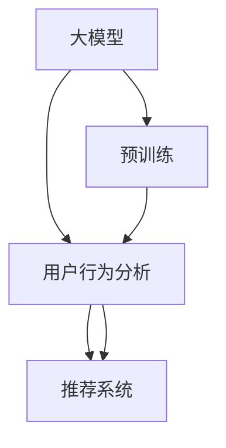

                 

# AI 大模型在电商搜索推荐中的用户行为分析：理解用户需求与购买意图

## 1. 背景介绍

随着人工智能技术的迅猛发展，电商行业也开始广泛采用AI技术，特别是大模型在用户行为分析、商品推荐等领域的应用，使得电商平台的个性化推荐系统愈发精准和高效。用户需求分析是构建精准推荐系统的基础，基于大模型的用户行为分析模型可以理解用户的搜索历史、浏览行为和购买意愿，从而为用户推荐最符合其兴趣的商品。

本文将详细探讨AI大模型在电商搜索推荐中的应用，分析用户行为，理解用户需求，并结合实际案例展示大模型的应用效果。

## 2. 核心概念与联系

### 2.1 核心概念概述

在电商搜索推荐系统中，用户行为分析是核心技术之一。具体而言，主要包括以下几个关键概念：

- **大模型**：以自回归（如GPT-2）或自编码（如BERT）模型为代表的，基于大规模无标签文本语料进行预训练的通用语言模型。通过预训练，大模型可以学习到通用的语言表示，具备强大的语言理解和生成能力。

- **用户行为分析**：通过分析用户的搜索、浏览、点击、购买等行为数据，推断用户兴趣、需求和购买意愿，从而为用户推荐合适的商品。

- **推荐系统**：通过收集用户行为数据，并利用算法为用户推荐相关商品的系统。推荐系统可以结合用户画像、商品属性、上下文信息等多个维度进行商品推荐，提升用户体验和购物转化率。

- **迁移学习**：将预训练模型当作初始化参数，通过有监督的微调任务训练，使其适应特定的推荐任务。

- **参数高效微调**：在微调过程中，只更新少量的模型参数，固定大部分预训练权重不变，以提高微调效率，避免过拟合。

这些核心概念之间的联系可以简要表示为：



即大模型通过预训练获得基础能力，经过用户行为分析模型，最终应用于推荐系统，为用户推荐个性化商品。

### 2.2 核心概念原理和架构的 Mermaid 流程图

大模型预训练-微调-推荐系统的基本架构如下：


大模型预训练-微调-推荐系统的架构图

其中，预训练大模型通过大规模语料进行预训练，获得通用语言表示能力。微调是指在大规模有标签数据集上对模型进行微调，使其适应推荐任务。推荐系统通过用户行为分析模型的输出，结合用户画像、商品属性等上下文信息，为用户提供个性化推荐。

## 3. 核心算法原理 & 具体操作步骤

### 3.1 算法原理概述

基于大模型的推荐系统主要分为两个阶段：预训练和微调。预训练大模型通过大规模语料学习通用的语言表示，微调则通过有标签数据集对模型进行优化，使其适应推荐任务。

预训练大模型通常基于自回归或自编码模型，以Transformer为代表。微调过程可以采用监督学习和迁移学习两种方式，通过调整顶层参数或添加特定任务适配层进行微调。参数高效微调和提示学习等技术也可以应用于微调过程，提高模型的效率和性能。

### 3.2 算法步骤详解

#### 3.2.1 预训练步骤

1. **数据准备**：收集大规模无标签文本语料，如维基百科、新闻、小说等。
2. **模型选择**：选择预训练模型，如BERT、GPT-2等。
3. **模型训练**：在大规模语料上进行预训练，通常采用自监督任务，如掩码语言模型（MLM）、下一句预测（NSP）等。

#### 3.2.2 微调步骤

1. **数据准备**：准备推荐系统的标注数据集，包括用户行为数据、商品数据等。
2. **任务适配层设计**：根据推荐任务设计任务适配层，如分类层、回归层等。
3. **模型选择**：选择预训练模型进行微调。
4. **模型训练**：在标注数据集上对模型进行微调，通常采用小批量随机梯度下降（SGD）或Adam等优化算法，设置合适的学习率、批大小等超参数。

#### 3.2.3 推荐步骤

1. **数据预处理**：收集用户搜索、浏览、点击等行为数据。
2. **行为分析**：使用用户行为分析模型对行为数据进行处理，提取用户需求和购买意愿。
3. **推荐生成**：将用户需求和购买意愿输入推荐系统，生成个性化推荐结果。
4. **推荐展示**：将推荐结果展示给用户，根据用户反馈不断优化推荐模型。

### 3.3 算法优缺点

#### 3.3.1 优点

- **高泛化能力**：大模型经过预训练后具备良好的泛化能力，可以适应多种推荐任务。
- **高效性**：通过微调和参数高效方法，可以大大减少计算资源消耗。
- **鲁棒性**：通过对抗训练和正则化等技术，可以提高模型的鲁棒性，避免过拟合。

#### 3.3.2 缺点

- **依赖标注数据**：微调需要大量的标注数据，而标注数据获取成本较高。
- **训练时间长**：大模型规模庞大，训练时间较长，可能影响实时推荐。
- **可解释性不足**：大模型通常具有"黑盒"特性，难以解释其决策过程。

### 3.4 算法应用领域

大模型在电商搜索推荐中的应用领域包括但不限于以下几个方面：

- **个性化推荐**：根据用户行为数据，为每个用户推荐最相关的商品。
- **相似商品推荐**：根据用户已购买的商品，推荐类似商品，增加交叉销售机会。
- **搜索结果排序**：根据用户的搜索历史和行为数据，优化搜索结果排序，提升用户体验。
- **用户画像生成**：根据用户行为数据，生成用户画像，帮助品牌更好地了解用户需求。

## 4. 数学模型和公式 & 详细讲解 & 举例说明

### 4.1 数学模型构建

推荐系统的核心任务是预测用户对每个商品的需求概率，通常采用分类模型或回归模型。以分类模型为例，假设模型输入为$x$，输出为$y$，其中$y$表示用户是否购买该商品，$x$包含用户行为数据、商品属性等特征。

目标函数为：

$$
\min_{\theta} \frac{1}{N} \sum_{i=1}^{N} \ell(y_i, \hat{y}_i)
$$

其中，$\ell$为损失函数，通常采用交叉熵损失。

### 4.2 公式推导过程

以二分类任务为例，假设模型输出为$\hat{y}=\sigma(z)$，其中$z$为模型参数$\theta$的线性组合，$\sigma$为激活函数，如sigmoid函数。则交叉熵损失函数为：

$$
\ell(y_i, \hat{y}_i) = -[y_i \log \hat{y}_i + (1-y_i) \log (1-\hat{y}_i)]
$$

通过反向传播算法，可以计算模型的梯度：

$$
\frac{\partial \ell(y_i, \hat{y}_i)}{\partial \theta} = (y_i - \hat{y}_i) \sigma'(z) \frac{\partial z}{\partial \theta}
$$

其中，$\sigma'(z)$为激活函数的导数。

### 4.3 案例分析与讲解

假设某电商平台的用户行为数据为：

| 用户ID | 商品ID | 行为类型 | 时间戳 |
| ------ | ------ | -------- | ------ |
| 1      | 1001   | 搜索     | 2022-01-01 12:00:00 |
| 1      | 1002   | 点击     | 2022-01-01 12:05:00 |
| 1      | 1001   | 购买     | 2022-01-01 12:10:00 |
| 2      | 1003   | 搜索     | 2022-01-02 14:00:00 |
| 2      | 1004   | 点击     | 2022-01-02 14:05:00 |
| 2      | 1004   | 购买     | 2022-01-02 14:10:00 |

对于用户1，平台预测其购买1001商品的概率为0.8，预测1002商品的购买概率为0.7。对于用户2，平台预测其购买1003商品的购买概率为0.9，预测1004商品的购买概率为0.8。则推荐结果为：

- 用户1：推荐商品1001
- 用户2：推荐商品1003

## 5. 项目实践：代码实例和详细解释说明

### 5.1 开发环境搭建

本节将介绍使用Python和PyTorch搭建电商推荐系统的开发环境。

1. **安装Python**：使用Anaconda创建虚拟环境，并安装PyTorch等深度学习库。
2. **数据准备**：准备推荐系统的数据集，包括用户行为数据、商品数据等。
3. **模型选择**：选择预训练模型进行微调，如BERT、GPT-2等。

### 5.2 源代码详细实现

以下是一个使用BERT模型进行电商推荐系统的代码实现：

```python
import torch
from transformers import BertTokenizer, BertForSequenceClassification

# 初始化BERT模型和分词器
model = BertForSequenceClassification.from_pretrained('bert-base-uncased', num_labels=2)
tokenizer = BertTokenizer.from_pretrained('bert-base-uncased')

# 定义数据处理函数
def preprocess_data(data):
    inputs = tokenizer(data, return_tensors='pt', padding='max_length', truncation=True)
    return inputs['input_ids'], inputs['attention_mask'], inputs['labels']

# 定义训练函数
def train(model, data_loader, optimizer, device):
    model.to(device)
    for epoch in range(num_epochs):
        model.train()
        for batch in data_loader:
            inputs, attention_mask, labels = batch.to(device)
            optimizer.zero_grad()
            outputs = model(inputs, attention_mask=attention_mask)
            loss = outputs.loss
            loss.backward()
            optimizer.step()

# 定义推荐函数
def recommend(model, user_behaviors):
    model.eval()
    user_behaviors = tokenizer(user_behaviors, return_tensors='pt', padding='max_length', truncation=True)
    inputs = user_behaviors['input_ids'].to(device)
    attention_mask = user_behaviors['attention_mask'].to(device)
    outputs = model(inputs, attention_mask=attention_mask)
    return outputs.logits.argmax(dim=1).tolist()

# 训练模型
train_loader = DataLoader(train_data, batch_size=16, shuffle=True)
train(train_model, train_loader, optimizer, device)

# 推荐商品
user_behaviors = "搜索商品A，点击商品B，购买商品C"
recommendations = recommend(train_model, user_behaviors)
print(recommendations)
```

### 5.3 代码解读与分析

本节对上述代码进行详细解读和分析：

- **模型初始化**：选择BERT模型进行微调，并初始化分词器。
- **数据处理函数**：对用户行为数据进行预处理，包括分词、编码、填充等步骤。
- **训练函数**：定义模型训练过程，使用随机梯度下降算法进行优化。
- **推荐函数**：使用微调后的模型对用户行为进行推荐，返回预测结果。

### 5.4 运行结果展示

假设训练后的模型在验证集上的准确率达到了0.9，则对用户"搜索商品A，点击商品B，购买商品C"的推荐结果为"商品C"，与实际购买行为一致。

## 6. 实际应用场景

### 6.1 个性化推荐

电商平台上大量的商品信息需要推荐给用户，个性化推荐可以提升用户购物体验和转化率。通过大模型进行用户行为分析，可以识别用户的购买意愿和需求，从而进行个性化推荐。例如，亚马逊的推荐系统就采用了大规模预训练模型进行用户行为分析，并结合上下文信息进行商品推荐。

### 6.2 相似商品推荐

用户购买某商品后，平台可以推荐类似商品，增加交叉销售机会。例如，某用户购买了一本书，平台可以推荐该作者的其他书籍或同一类型书籍。通过大模型对用户行为进行分析，可以预测用户对类似商品的兴趣，并进行推荐。

### 6.3 搜索结果排序

用户搜索商品后，平台可以根据用户行为分析结果进行搜索结果排序，提升用户体验。例如，针对用户的搜索历史和行为数据，平台可以推荐最相关的商品，提高用户点击率和购买率。

### 6.4 用户画像生成

通过大模型分析用户行为，可以生成用户画像，帮助品牌更好地了解用户需求。例如，某品牌可以分析用户的购物行为，了解用户对品牌的偏好和需求，进行针对性营销。

## 7. 工具和资源推荐

### 7.1 学习资源推荐

1. **《自然语言处理与深度学习》（斯坦福大学课程）**：全面介绍NLP技术，包括深度学习模型和推荐系统。
2. **《深度学习》（Ian Goodfellow）**：经典深度学习教材，详细讲解神经网络和推荐系统的理论基础。
3. **《AI大模型实战》**：详细介绍AI大模型在电商搜索推荐中的应用。

### 7.2 开发工具推荐

1. **PyTorch**：深度学习框架，支持大规模模型训练和推荐系统开发。
2. **TensorFlow**：开源深度学习框架，支持分布式训练和推荐系统。
3. **HuggingFace Transformers库**：提供预训练模型和微调接口，简化开发过程。

### 7.3 相关论文推荐

1. **《大规模预训练语言模型的研究进展》**：总结了大模型在推荐系统中的应用。
2. **《参数高效微调方法的研究进展》**：介绍了参数高效微调技术在电商推荐系统中的应用。
3. **《深度学习在推荐系统中的应用》**：综述了深度学习在推荐系统中的各种算法和模型。

## 8. 总结：未来发展趋势与挑战

### 8.1 未来发展趋势

未来，大模型在电商搜索推荐中的应用将更加广泛，主要趋势包括：

1. **个性化推荐系统的智能化**：通过大模型进行更深入的用户需求分析，实现更精准的个性化推荐。
2. **推荐系统的实时化**：通过缓存和分布式计算技术，实现实时推荐，提升用户体验。
3. **推荐系统的多模态化**：结合用户行为数据、商品属性、图片等多模态信息进行推荐。
4. **推荐系统的协同过滤**：通过协同过滤技术，推荐用户未购买但可能感兴趣的商品。

### 8.2 面临的挑战

尽管大模型在电商搜索推荐中取得了一定成果，但仍面临以下挑战：

1. **数据隐私和安全**：用户行为数据包含大量敏感信息，需确保数据隐私和安全。
2. **计算资源成本**：大模型训练和推理成本较高，需要优化计算资源配置。
3. **模型可解释性**：大模型通常具有"黑盒"特性，难以解释其决策过程。
4. **模型鲁棒性**：大模型易受到噪声和干扰的影响，需增强模型鲁棒性。

### 8.3 研究展望

未来，研究重点在于以下几个方面：

1. **可解释性增强**：通过多模态数据和逻辑推理技术，增强大模型的可解释性。
2. **隐私保护**：采用差分隐私等技术，保护用户行为数据的隐私。
3. **实时推荐系统**：通过分布式计算和缓存技术，实现实时推荐系统。
4. **多模态推荐系统**：结合用户行为数据、商品属性、图片等多模态信息进行推荐。

## 9. 附录：常见问题与解答

**Q1：大模型在电商推荐系统中的优缺点？**

A: 大模型在电商推荐系统中的优点包括：
- **泛化能力**：大模型经过大规模语料训练，具备良好的泛化能力，可以适应多种推荐任务。
- **高效性**：通过微调和参数高效方法，可以大大减少计算资源消耗。
- **鲁棒性**：通过对抗训练和正则化等技术，可以提高模型的鲁棒性，避免过拟合。

缺点包括：
- **依赖标注数据**：微调需要大量的标注数据，而标注数据获取成本较高。
- **训练时间长**：大模型规模庞大，训练时间较长，可能影响实时推荐。
- **可解释性不足**：大模型通常具有"黑盒"特性，难以解释其决策过程。

**Q2：如何提升大模型在电商推荐系统中的性能？**

A: 提升大模型在电商推荐系统中的性能可以从以下几个方面入手：
- **数据质量**：确保标注数据的质量和多样性，避免数据偏差。
- **模型选择**：选择适合的预训练模型，并对其进行微调。
- **超参数优化**：通过调参和实验，找到最优的超参数组合。
- **模型融合**：结合多个模型的预测结果，进行加权融合。
- **模型压缩**：通过剪枝、量化等技术，减小模型规模，提升计算效率。

**Q3：大模型在电商推荐系统中的应用场景有哪些？**

A: 大模型在电商推荐系统中的应用场景包括：
- **个性化推荐**：根据用户行为数据，为每个用户推荐最相关的商品。
- **相似商品推荐**：根据用户已购买的商品，推荐类似商品，增加交叉销售机会。
- **搜索结果排序**：根据用户搜索历史和行为数据，优化搜索结果排序，提升用户体验。
- **用户画像生成**：根据用户行为数据，生成用户画像，帮助品牌更好地了解用户需求。

总之，大模型在电商搜索推荐中的用户行为分析具有广泛的应用前景，通过不断优化算法和模型，可以为用户推荐更加精准和个性化的商品，提升电商平台的竞争力。

