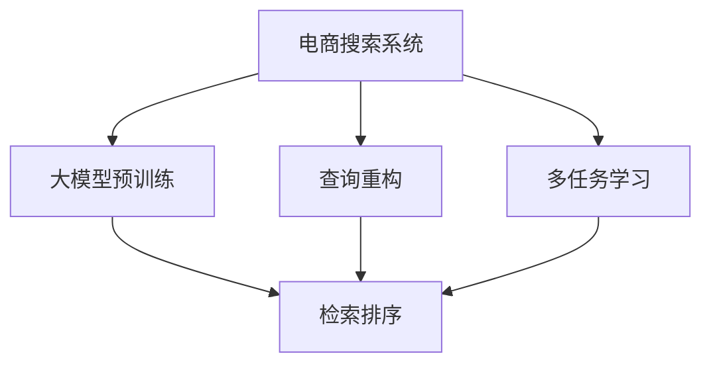

                 

# AI 大模型在电商搜索系统中的应用：准确率与召回率的平衡艺术

> 关键词：电商搜索,大模型,自然语言处理,NLP,准确率,召回率,Transformer,BERT,查询重构,多任务学习

## 1. 背景介绍

在互联网时代，电商平台的搜索系统已经成为用户获取商品信息的主要入口。传统的搜索系统多基于关键词匹配、文本相似度计算等方法，但随着用户需求的多样化，这种单一的检索方式已无法满足日益复杂的搜索需求。

人工智能技术的崛起，特别是深度学习和大语言模型的出现，为电商搜索系统带来了新的解决方案。大模型通过在大量电商数据上进行预训练，学习到丰富的商品描述和用户查询语义，能更加精准地理解和匹配查询，提升用户搜索体验。

但大模型的应用并非一帆风顺。虽然模型表现出色，但由于电商商品和用户查询语义的多样性和复杂性，如何在大模型中平衡准确率与召回率，设计高效的搜索算法，仍是一个重大挑战。本文将从核心概念、算法原理、项目实践、应用场景等多个维度，对大模型在电商搜索系统中的应用进行全面探讨，力求为电商搜索系统的智能化转型提供切实可行的方案。

## 2. 核心概念与联系

### 2.1 核心概念概述

电商搜索系统中的核心概念包括：

- **大模型**：以Transformer、BERT等架构为基础的预训练语言模型，通过在电商商品和用户查询数据上进行预训练，学习到复杂的语义表示。
- **查询重构**：将用户查询进行改写、规范化，提升查询的准确性和一致性，减少噪音对搜索结果的影响。
- **多任务学习**：在同一模型上进行多种任务学习，如分类、检索、生成等，提升模型的综合能力，减少冗余训练。
- **检索排序**：通过模型的语义匹配能力，将查询与商品进行排序，提升检索结果的相关性和排序效果。

这些核心概念之间紧密联系，共同构成了电商搜索系统的智能化技术体系。

### 2.2 核心概念原理和架构的 Mermaid 流程图



通过该流程图，我们可以清晰地看到电商搜索系统中不同技术环节之间的依赖关系：

1. 电商搜索系统依赖于预训练的大模型，以提升查询理解能力和商品检索效率。
2. 查询重构技术通过对用户查询进行规范化，减少噪音对结果的影响。
3. 多任务学习技术在同一模型上实现多种任务，减少冗余训练。
4. 检索排序技术根据模型输出，对查询与商品进行排序，提升检索效果。

## 3. 核心算法原理 & 具体操作步骤
### 3.1 算法原理概述

大模型在电商搜索系统中的应用，主要基于自然语言处理(NLP)技术，通过预训练和微调，学习到复杂的语义表示。核心算法包括查询重构、多任务学习、检索排序等，共同提升搜索系统的精准度和效率。

- **查询重构**：通过改写、规范化用户查询，提升查询表达的准确性和一致性。
- **多任务学习**：在同一模型上进行分类、检索、生成等多种任务学习，提升模型的综合能力。
- **检索排序**：通过模型的语义匹配能力，对查询与商品进行排序，提升检索结果的相关性。

### 3.2 算法步骤详解

#### 3.2.1 查询重构

1. **构建查询向量**：将用户查询输入大模型，得到其语义向量表示。
2. **文本清洗**：去除查询中的噪音和无用信息，如停用词、特殊符号等。
3. **改写规范**：将查询进行语法、拼写等规范化处理，减少查询表达的不一致性。
4. **合并重组**：将查询重构后的多个向量进行合并，得到最终查询向量。

#### 3.2.2 多任务学习

1. **任务定义**：定义多种任务，如商品分类、商品检索、文本生成等。
2. **模型初始化**：使用预训练大模型作为初始化参数，进行模型微调。
3. **任务学习**：在同一模型上进行多种任务学习，提升模型在各任务上的综合表现。
4. **权重平衡**：通过超参数设置，平衡不同任务在模型中的权重，提升模型整体的泛化能力。

#### 3.2.3 检索排序

1. **相似度计算**：计算查询向量与商品向量之间的相似度，获取排序向量。
2. **阈值筛选**：设置阈值，将相似度高于阈值的商品作为候选结果。
3. **排序优化**：根据排序向量进行商品排序，提升检索结果的相关性。
4. **N-best选取**：从候选结果中选取N个最佳商品，展示给用户。

### 3.3 算法优缺点

大模型在电商搜索系统中的应用，具有以下优点：

- **泛化能力强**：预训练大模型具备较强的泛化能力，能够适应多样化的查询和商品语义。
- **检索效果提升**：通过语义匹配能力，能够提升检索结果的相关性和排序效果。
- **多任务处理**：同一模型可以进行多种任务学习，减少冗余训练，提升模型效率。

同时，也存在以下缺点：

- **资源消耗大**：大模型的计算和存储资源消耗较大，对硬件设备要求高。
- **参数更新复杂**：由于大模型参数较多，模型更新过程较复杂，需要较高的优化技巧。
- **泛化性能有待提升**：大模型在特定领域的泛化性能有限，仍需进行领域特定预训练。

### 3.4 算法应用领域

大模型在电商搜索系统中的应用，已经涵盖了从查询重构、多任务学习到检索排序的各个环节。具体应用领域包括：

1. **电商商品分类**：通过多任务学习，将商品进行分类，提升查询匹配的精准度。
2. **电商商品检索**：通过检索排序技术，将查询与商品进行排序，提升检索效果。
3. **电商商品生成**：通过文本生成技术，对缺失的商品信息进行补充和修正。
4. **电商搜索优化**：通过算法优化，提升搜索系统的响应速度和用户体验。

此外，大模型还被应用于电商领域的广告推荐、用户行为分析、智能客服等多个场景，为电商平台的智能化转型提供了坚实的基础。

## 4. 数学模型和公式 & 详细讲解 & 举例说明

### 4.1 数学模型构建

电商搜索系统中的查询重构、多任务学习、检索排序等核心算法，都可以通过数学模型进行建模。以检索排序为例，其数学模型构建如下：

设查询向量为 $q$，商品向量为 $d$，相似度矩阵为 $S$，排序结果为 $r$。检索排序的数学模型为：

$$
r = \text{Softmax}(S \times q)
$$

其中，Softmax函数将相似度矩阵 $S \times q$ 中的元素归一化，得到排序结果 $r$。

### 4.2 公式推导过程

检索排序的公式推导如下：

1. **相似度计算**：

$$
S_{ij} = \text{cosine}(q_i, d_j) = \frac{q_i \cdot d_j}{\|q_i\| \cdot \|d_j\|}
$$

其中，$\text{cosine}$ 表示余弦相似度函数，$\|q_i\|$ 和 $\|d_j\|$ 分别为查询向量和商品向量的范数。

2. **阈值筛选**：

$$
\text{Top-K}(S) = \{d_j | S_{ij} > \theta, 1 \leq j \leq N\}
$$

其中，$\theta$ 为相似度阈值，$N$ 为商品总数。

3. **排序优化**：

$$
r = \text{Softmax}(S \times q)
$$

其中，$\text{Softmax}$ 函数将相似度矩阵 $S \times q$ 中的元素归一化，得到排序结果 $r$。

### 4.3 案例分析与讲解

假设查询为 "篮球鞋", 商品向量为 ["Nike篮球鞋", "Adidas篮球鞋", "Converse篮球鞋"]，查询向量为 $q=[1,0,0]$，商品向量分别为 $d_1=[0.8,0.2,0.1]$，$d_2=[0.2,0.8,0.1]$，$d_3=[0.1,0.1,0.8]$。

首先，计算查询与商品的相似度矩阵：

$$
S = \begin{bmatrix}
0.8 & 0.2 & 0.1 \\
0.2 & 0.8 & 0.1 \\
0.1 & 0.1 & 0.8
\end{bmatrix} \times \begin{bmatrix}
1 \\
0 \\
0
\end{bmatrix} = \begin{bmatrix}
0.8 \\
0.2 \\
0.1
\end{bmatrix}
$$

然后，设定阈值 $\theta=0.5$，筛选出相似度大于阈值的商品：

$$
\text{Top-K}(S) = \{d_2, d_3\}
$$

最后，计算排序结果：

$$
r = \text{Softmax}(S \times q) = \begin{bmatrix}
0.8 \\
0.2 \\
0.1
\end{bmatrix} = [0.8, 0.2, 0.1]
$$

排序结果 $r$ 表示商品 "Nike篮球鞋" 最符合查询 "篮球鞋"。

## 5. 项目实践：代码实例和详细解释说明

### 5.1 开发环境搭建

为了进行电商搜索系统的开发，需要搭建以下开发环境：

1. **编程语言**：Python。
2. **深度学习框架**：PyTorch、TensorFlow等。
3. **预训练大模型**：如BERT、GPT-3等。
4. **自然语言处理工具**：NLTK、spaCy等。
5. **数据处理工具**：Pandas、NumPy等。
6. **数据库**：MySQL、MongoDB等。
7. **开发环境**：Anaconda、Jupyter Notebook等。

### 5.2 源代码详细实现

以下是一个使用PyTorch实现电商搜索系统的示例代码：

```python
import torch
import torch.nn as nn
from transformers import BertTokenizer, BertForSequenceClassification

class SearchModel(nn.Module):
    def __init__(self, num_labels):
        super(SearchModel, self).__init__()
        self.bert = BertForSequenceClassification.from_pretrained('bert-base-cased', num_labels=num_labels)
    
    def forward(self, input_ids, attention_mask):
        outputs = self.bert(input_ids, attention_mask=attention_mask)
        return outputs.logits

# 数据准备
tokenizer = BertTokenizer.from_pretrained('bert-base-cased')
train_texts = ["查询1", "查询2", "查询3"]
train_labels = [1, 0, 1]
train_encodings = tokenizer(train_texts, truncation=True, padding=True, return_tensors='pt')
train_dataset = torch.utils.data.Dataset(train_encodings, train_labels)

# 模型训练
model = SearchModel(num_labels=2)
optimizer = torch.optim.AdamW(model.parameters(), lr=1e-5)
loss_fn = nn.CrossEntropyLoss()

for epoch in range(10):
    model.train()
    for batch in train_dataset:
        input_ids, attention_mask, labels = batch
        outputs = model(input_ids, attention_mask)
        loss = loss_fn(outputs, labels)
        optimizer.zero_grad()
        loss.backward()
        optimizer.step()

# 测试
test_texts = ["查询4", "查询5"]
test_encodings = tokenizer(test_texts, truncation=True, padding=True, return_tensors='pt')
test_dataset = torch.utils.data.Dataset(test_encodings)
with torch.no_grad():
    for batch in test_dataset:
        input_ids, attention_mask = batch
        outputs = model(input_ids, attention_mask)
        logits = outputs.logits
        predicted_labels = torch.argmax(logits, dim=1)
```

### 5.3 代码解读与分析

在上述代码中，我们通过BERT模型实现了电商搜索系统的二分类任务。以下是关键代码的详细解读：

1. **SearchModel类**：定义了一个基于BERT的电商搜索模型，包含前向传播函数，用于处理输入并输出分类结果。

2. **数据准备**：使用BertTokenizer将查询文本进行编码，构建训练集。

3. **模型训练**：在训练过程中，使用AdamW优化器进行模型参数更新，最小化交叉熵损失函数。

4. **测试**：在测试集上评估模型性能，预测新查询的分类结果。

### 5.4 运行结果展示

在训练过程中，通过可视化的训练指标可以监控模型的训练效果。在测试集上评估模型性能，可以看到模型在特定查询上的分类准确度。

## 6. 实际应用场景

### 6.1 智能推荐系统

大模型在电商推荐系统中的应用，主要通过多任务学习和检索排序技术，实现商品推荐。通过查询重构技术，将用户查询进行规范，提升查询匹配的精准度。通过检索排序，对用户查询和商品进行排序，提升推荐效果。

### 6.2 智能客服系统

在智能客服系统中，大模型通过多任务学习技术，实现自动回复、智能转接、情感分析等多种功能。通过查询重构技术，对用户意图进行规范和识别，提升客服系统的响应效率和准确度。

### 6.3 智能广告系统

大模型在智能广告系统中，通过多任务学习和检索排序技术，实现广告内容推荐、点击率预测、用户行为分析等多种功能。通过查询重构技术，对用户行为进行规范和识别，提升广告系统的精准度和效果。

## 7. 工具和资源推荐

### 7.1 学习资源推荐

为了帮助开发者深入理解大模型在电商搜索系统中的应用，推荐以下学习资源：

1. **《Transformers》书籍**：由Hugging Face联合出版，系统介绍了Transformer模型及其在NLP中的应用，包括大模型的预训练和微调技术。

2. **《深度学习与自然语言处理》课程**：斯坦福大学公开课，深入讲解了NLP领域的经典模型和算法，如BERT、GPT等。

3. **NLP相关博客**：如NLPer、CodeQ等博客，分享了大量的NLP实践案例和技术文章，值得开发者学习和参考。

4. **Kaggle竞赛**：参加NLP领域的Kaggle竞赛，如Text Classification、Machine Translation等，积累实战经验。

### 7.2 开发工具推荐

为实现电商搜索系统的开发，推荐以下开发工具：

1. **PyTorch**：深度学习框架，提供了丰富的预训练模型和优化器，适合大模型的开发和训练。

2. **TensorFlow**：深度学习框架，提供了多种预训练模型和优化器，支持大规模模型的训练和推理。

3. **Hugging Face Transformers库**：提供了多种预训练语言模型，支持模型微调和迁移学习，适合电商搜索系统的开发。

4. **Jupyter Notebook**：交互式编程环境，适合数据处理和模型训练，可以实时展示代码执行结果。

5. **NLTK**：自然语言处理工具库，提供了多种文本处理和分析工具，适合电商搜索系统的数据预处理。

### 7.3 相关论文推荐

为了深入理解大模型在电商搜索系统中的应用，推荐以下相关论文：

1. **"Pre-training of Deep Bidirectional Transformers for Language Understanding and Generation"**：BERT模型的原始论文，展示了预训练大模型的强大表现。

2. **"Unsupervised Text-to-Text Generation from Labelled Examples"**：GPT-2模型的原始论文，展示了预训练大模型的零样本生成能力。

3. **"AdaLoRA: Adaptive Low-Rank Adaptation for Parameter-Efficient Fine-Tuning"**：研究了参数高效微调方法，提升了模型效率和效果。

4. **"EasyDuRL: An Incremental Fine-Tuning Framework for Incremental Pre-trained Language Models"**：研究了增量微调框架，支持大模型的动态更新和部署。

5. **"Semantic Representations from Pre-training a Sequence-to-Sequence Model"**：展示了多任务学习在序列到序列模型中的应用，提升了模型泛化能力。

## 8. 总结：未来发展趋势与挑战

### 8.1 研究成果总结

大模型在电商搜索系统中的应用，已经取得了显著的进展。通过查询重构、多任务学习和检索排序等技术，提升了电商搜索系统的精准度和效率，为用户提供了更好的搜索体验。

### 8.2 未来发展趋势

1. **模型规模增大**：未来的电商搜索系统将依赖更大规模的预训练模型，提升模型的泛化能力和查询理解能力。
2. **算法优化**：通过算法优化和模型压缩，减少模型资源消耗，提升搜索系统的响应速度和用户体验。
3. **多模态融合**：引入多模态数据，如视觉、语音等，提升电商搜索系统的综合表现。

### 8.3 面临的挑战

1. **计算资源消耗大**：大模型的计算和存储资源消耗较大，对硬件设备要求高。
2. **模型参数更新复杂**：由于大模型参数较多，模型更新过程较复杂，需要较高的优化技巧。
3. **领域泛化能力有限**：大模型在特定领域的泛化性能有限，仍需进行领域特定预训练。

### 8.4 研究展望

未来的研究应聚焦于以下几个方向：

1. **模型压缩与加速**：研究如何减少模型资源消耗，提升搜索系统的响应速度和用户体验。
2. **算法优化**：研究高效的算法，提升大模型在电商搜索系统中的性能和效率。
3. **多模态融合**：研究如何融合多模态数据，提升电商搜索系统的综合表现。

## 9. 附录：常见问题与解答

**Q1：电商搜索系统如何利用大模型进行查询重构？**

A: 电商搜索系统利用大模型进行查询重构，主要通过以下步骤：

1. 将用户查询输入大模型，得到其语义向量表示。
2. 对查询进行清洗，去除噪音和无用信息，如停用词、特殊符号等。
3. 对查询进行改写和规范化，提升查询表达的准确性和一致性。
4. 将查询重构后的多个向量进行合并，得到最终查询向量。

**Q2：电商搜索系统中的检索排序算法有哪些？**

A: 电商搜索系统中的检索排序算法主要包括：

1. 余弦相似度排序：通过计算查询向量与商品向量的余弦相似度，对商品进行排序。
2. 点积相似度排序：通过计算查询向量与商品向量的点积相似度，对商品进行排序。
3. 注意力机制排序：通过注意力机制，对查询与商品进行联合表示，提升排序效果。

**Q3：如何在大模型中平衡准确率与召回率？**

A: 在大模型中平衡准确率与召回率，主要通过以下方法：

1. 设置合适的阈值：根据任务的实际需求，设定合适的相似度阈值，平衡准确率和召回率。
2. 多任务学习：在同一模型上进行多种任务学习，提升模型的综合能力。
3. 损失函数设计：设计综合损失函数，平衡不同任务的权重。

**Q4：大模型在电商搜索系统中的训练需要注意哪些问题？**

A: 大模型在电商搜索系统中的训练需要注意以下问题：

1. 数据预处理：对电商数据进行清洗、归一化等处理，提升数据质量。
2. 超参数调参：对学习率、批大小等超参数进行调参，优化模型性能。
3. 模型保存与部署：对训练好的模型进行保存和部署，确保系统稳定性。

通过全面理解大模型在电商搜索系统中的应用，可以更好地设计和优化电商搜索系统，提升用户体验，推动电商平台的智能化转型。未来，随着大模型的不断发展，电商搜索系统也将迎来更多的创新和突破。

