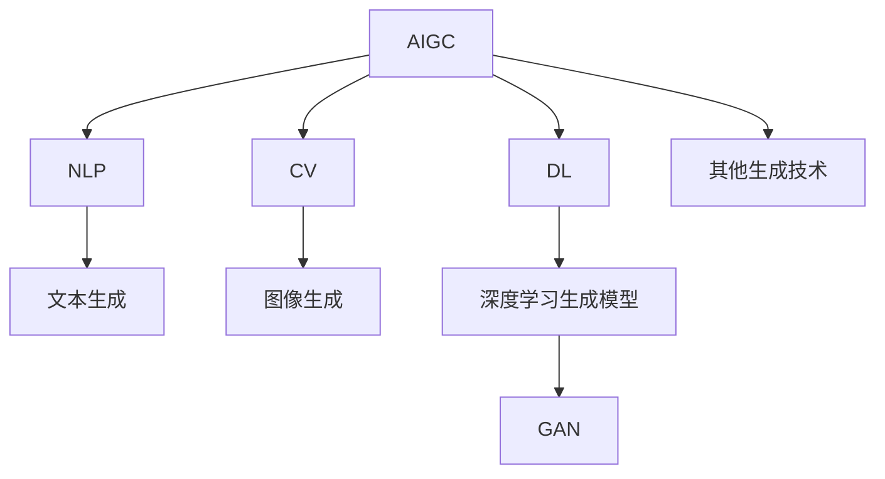

                 

## 1. 背景介绍

### 1.1 问题由来

在过去的十年里，零售行业经历了深刻变革。从实体店向线上线下融合的转变，到消费者购物习惯的改变，再到供应链管理的数字化转型，每一项变化都带来了新的挑战和机遇。特别是在当前疫情常态化的背景下，零售行业更加迫切需要技术革新来提升效率、降低成本、增强用户体验。

人工智能生成内容（AI Generated Content，简称AIGC）技术的兴起，为零售行业带来了全新的可能性。AIGC融合了自然语言处理（NLP）、计算机视觉（CV）、音频生成等多项前沿技术，能够自动生成高质量的内容，包括商品描述、营销文案、个性化推荐等，极大地提升了零售商的运营效率和市场竞争力。

### 1.2 问题核心关键点

AIGC在零售行业的应用主要集中在以下几个方面：

- **商品描述和营销文案生成**：自动生成商品详情页、商品标签、促销文案等内容，帮助零售商提升商品展示效果，吸引顾客注意力。
- **个性化推荐系统**：基于用户历史行为和商品属性，自动生成个性化推荐，提高用户满意度和购物转化率。
- **虚拟试衣间和AR体验**：利用计算机视觉技术，让消费者通过手机或电脑体验虚拟试衣间、虚拟试穿等功能，提升购物体验。
- **智能客服与智能语音助手**：通过NLP和语音生成技术，提供24/7的智能客服服务，提升客户服务质量。

这些应用场景体现了AIGC技术在提升零售行业运营效率、优化用户体验方面的巨大潜力。然而，如何高效、安全地生成高质量的AIGC内容，是零售行业应用AIGC技术时面临的核心挑战。

## 2. 核心概念与联系

### 2.1 核心概念概述

为了更好地理解AIGC在零售行业的应用，本节将介绍几个关键概念：

- **人工智能生成内容（AIGC）**：通过机器学习和深度学习技术，自动生成高质量的内容，包括文本、图像、音频等。
- **自然语言处理（NLP）**：专注于让机器理解、解释和生成人类语言的技术，广泛应用于文本生成、情感分析、问答系统等。
- **计算机视觉（CV）**：研究如何让计算机“看”的技术，包括图像识别、物体检测、图像生成等，广泛应用于商品展示、虚拟试穿等场景。
- **深度学习（DL）**：通过神经网络模型，让机器从数据中学习复杂的特征表示，广泛应用于AIGC内容的生成和优化。
- **生成对抗网络（GAN）**：一种能够生成逼真、高质量图像、音频等内容的技术，通过生成器和判别器之间的对抗学习，提升生成内容的真实性和多样性。

这些概念之间的关系可以通过以下Mermaid流程图来展示：



该流程图展示了AIGC技术的核心概念及其之间的关系：

1. AIGC技术融合了NLP、CV、DL等多种技术，生成多类型的输出内容。
2. NLP主要负责文本生成，包括商品描述、营销文案、智能客服对话等。
3. CV主要用于图像生成，如虚拟试穿、商品展示等。
4. DL技术提供了深度学习生成模型，是AIGC内容生成的主要技术手段。
5. GAN技术为深度学习生成模型提供了强有力的支持，使得生成内容更加逼真和多样化。

## 3. 核心算法原理 & 具体操作步骤

### 3.1 算法原理概述

AIGC在零售行业的应用主要基于以下三个核心算法原理：

1. **生成对抗网络（GAN）**：通过生成器和判别器之间的对抗学习，生成高质量的商品图片、虚拟试衣效果等视觉内容。
2. **自然语言处理（NLP）**：利用Transformer模型等NLP技术，自动生成商品描述、营销文案、客户对话等内容。
3. **深度学习（DL）**：通过神经网络模型，对大量标注数据进行训练，学习生成高质量的内容。

这些算法原理为AIGC在零售行业的应用提供了坚实的基础。下面将详细介绍这些算法原理的具体实现。

### 3.2 算法步骤详解

#### 3.2.1 GAN算法步骤详解

生成对抗网络（GAN）主要由生成器（Generator）和判别器（Discriminator）两部分组成。具体步骤包括：

1. **数据准备**：收集大量高质量的商品图片、用户评价、商品属性等数据，用于训练生成器和判别器。
2. **模型构建**：设计生成器和判别器的神经网络结构，通常使用卷积神经网络（CNN）和全连接神经网络（FNN）。
3. **训练过程**：交替进行生成器和判别器的训练，生成器尝试生成逼真的假样本，判别器尝试区分真样本和假样本。
4. **模型优化**：通过对抗学习过程，不断优化生成器和判别器的参数，使得生成器生成的样本越来越逼真，判别器对真样本的判别率越来越高。
5. **生成内容**：训练完成后，生成器可以生成高质量的商品图片、虚拟试衣效果等视觉内容，用于增强用户购物体验。

#### 3.2.2 NLP算法步骤详解

自然语言处理（NLP）在零售行业的应用主要基于以下步骤：

1. **数据准备**：收集大量的商品描述、用户评论、问答记录等文本数据。
2. **模型训练**：使用Transformer模型等NLP技术，在大规模语料库上进行预训练，学习语言的通用表示。
3. **任务适配**：根据具体的零售任务，如商品描述生成、营销文案生成等，设计合适的输出层和损失函数。
4. **微调**：使用任务相关的标注数据，对预训练模型进行微调，使其能够生成高质量的任务输出。
5. **内容生成**：训练完成后，模型可以生成高质量的商品描述、营销文案、客户对话等内容，用于提升零售商的运营效率和用户体验。

#### 3.2.3 DL算法步骤详解

深度学习（DL）在零售行业的应用主要基于以下步骤：

1. **数据准备**：收集大量的标注数据，如商品图片、用户评价、商品属性等。
2. **模型构建**：设计深度神经网络模型，如卷积神经网络（CNN）、循环神经网络（RNN）、Transformer等，用于生成高质量的内容。
3. **模型训练**：使用标注数据对模型进行训练，学习生成高质量的输出内容。
4. **模型优化**：通过交叉验证、正则化、Dropout等技术，防止模型过拟合，提高模型泛化能力。
5. **内容生成**：训练完成后，模型可以生成高质量的商品图片、营销文案、客户对话等内容，用于提升零售商的运营效率和用户体验。

### 3.3 算法优缺点

AIGC在零售行业的应用具有以下优点：

1. **提升运营效率**：自动生成高质量的商品描述、营销文案、客户对话等内容，极大地降低了人工劳动强度，提升了运营效率。
2. **增强用户体验**：通过虚拟试衣间、个性化推荐等功能，提升用户的购物体验，增加用户粘性。
3. **优化商品展示**：自动生成高质量的商品图片、营销文案等，提升商品展示效果，吸引顾客注意力。
4. **降低成本**：通过自动化生成内容，降低了人工成本和运营成本。

同时，AIGC在零售行业的应用也存在一些局限性：

1. **内容质量不稳定**：生成的内容质量受训练数据的影响较大，如果训练数据质量不高，可能导致生成的内容质量不稳定。
2. **模型泛化能力有限**：生成的内容可能只适用于特定的领域或任务，泛化能力有限。
3. **安全性问题**：生成的内容可能包含虚假信息或有害内容，给零售商带来法律和安全风险。
4. **数据隐私问题**：生成内容时可能涉及用户隐私数据，需要确保数据隐私保护。

尽管存在这些局限性，但就目前而言，AIGC技术在零售行业的应用前景仍然十分广阔，尤其是通过不断的技术迭代和优化，这些问题有望逐步得到解决。

### 3.4 算法应用领域

AIGC技术在零售行业的应用领域主要包括以下几个方面：

1. **商品描述生成**：自动生成商品详情页、商品标签、促销文案等内容，帮助零售商提升商品展示效果，吸引顾客注意力。
2. **营销文案生成**：根据商品属性和用户偏好，自动生成个性化营销文案，提升营销效果。
3. **个性化推荐系统**：基于用户历史行为和商品属性，自动生成个性化推荐，提高用户满意度和购物转化率。
4. **虚拟试衣间和AR体验**：利用计算机视觉技术，让消费者通过手机或电脑体验虚拟试衣间、虚拟试穿等功能，提升购物体验。
5. **智能客服与智能语音助手**：通过NLP和语音生成技术，提供24/7的智能客服服务，提升客户服务质量。

这些应用场景体现了AIGC技术在提升零售行业运营效率、优化用户体验方面的巨大潜力。

## 4. 数学模型和公式 & 详细讲解  
### 4.1 数学模型构建

AIGC在零售行业的应用涉及多个数学模型，下面以文本生成模型和图像生成模型为例，介绍相关数学模型构建。

#### 4.1.1 文本生成模型

文本生成模型通常使用Transformer模型等NLP技术，其数学模型构建包括：

- **输入编码**：将输入文本转换为向量表示，通常使用单词嵌入（Word Embedding）技术。
- **自注意力机制**：使用Transformer的自注意力机制，学习输入文本中各部分之间的关系。
- **解码器**：使用多头注意力机制（Multi-Head Attention）和前馈神经网络（Feed-Forward Network），生成预测文本。
- **损失函数**：使用交叉熵损失函数（Cross-Entropy Loss），衡量预测文本与真实文本之间的差异。

#### 4.1.2 图像生成模型

图像生成模型通常使用GAN技术，其数学模型构建包括：

- **生成器（Generator）**：将随机噪声向量转换为高质量的图像。
- **判别器（Discriminator）**：判断输入图像是真实图像还是生成图像。
- **对抗损失函数**：使用交叉熵损失函数和Wasserstein距离损失函数，衡量生成器生成的图像与真实图像之间的差异。

### 4.2 公式推导过程

#### 4.2.1 文本生成模型公式推导

假设输入文本为 $\{x_1, x_2, ..., x_n\}$，每个单词 $x_i$ 对应一个嵌入向量 $e_i$。使用Transformer模型进行文本生成，其数学公式推导如下：

1. **输入编码**：将输入文本转换为向量表示，计算每个单词的嵌入向量 $e_i$。
2. **自注意力机制**：计算输入文本中各部分之间的关系，得到注意力权重 $a_i$。
3. **多头注意力机制**：使用多个注意力头并行计算，得到多头注意力向量 $A_i$。
4. **前馈神经网络**：对多头注意力向量进行前馈神经网络计算，得到生成文本的隐藏状态 $h_i$。
5. **解码器**：使用交叉熵损失函数，计算生成文本与真实文本之间的差异。

#### 4.2.2 图像生成模型公式推导

假设输入噪声向量为 $z$，生成器生成的高质量图像为 $G(z)$，判别器对输入图像的真实性进行判断，得到判别结果 $D(G(z))$。使用GAN技术进行图像生成，其数学公式推导如下：

1. **生成器（Generator）**：将随机噪声向量 $z$ 转换为高质量的图像 $G(z)$。
2. **判别器（Discriminator）**：判断输入图像 $G(z)$ 的真实性，得到判别结果 $D(G(z))$。
3. **对抗损失函数**：使用交叉熵损失函数和Wasserstein距离损失函数，计算生成器生成的图像与真实图像之间的差异。

### 4.3 案例分析与讲解

#### 4.3.1 商品描述生成案例

假设某零售商需要自动生成商品描述，可以采用预训练的Transformer模型，通过微调的方式适应具体任务。具体步骤包括：

1. **数据准备**：收集大量的商品描述和属性数据。
2. **模型训练**：使用Transformer模型在大规模语料库上进行预训练，学习语言的通用表示。
3. **任务适配**：设计合适的输出层和损失函数，用于商品描述生成任务。
4. **微调**：使用任务相关的标注数据，对预训练模型进行微调，使其能够生成高质量的商品描述。
5. **内容生成**：训练完成后，模型可以自动生成高质量的商品描述，用于提升商品展示效果。

#### 4.3.2 虚拟试衣间案例

假设某零售商需要自动生成虚拟试衣间，可以采用GAN技术，通过生成器和判别器的对抗学习过程，生成高质量的虚拟试衣效果。具体步骤包括：

1. **数据准备**：收集大量的真实商品图片和虚拟试衣图片。
2. **模型构建**：设计生成器和判别器的神经网络结构，通常使用卷积神经网络（CNN）和全连接神经网络（FNN）。
3. **训练过程**：交替进行生成器和判别器的训练，生成器尝试生成逼真的虚拟试衣效果，判别器尝试区分真试衣效果和虚拟试衣效果。
4. **模型优化**：通过对抗学习过程，不断优化生成器和判别器的参数，使得生成器生成的虚拟试衣效果越来越逼真，判别器对真试衣效果的判别率越来越高。
5. **内容生成**：训练完成后，生成器可以生成高质量的虚拟试衣效果，用于提升用户体验。

## 5. 项目实践：代码实例和详细解释说明

### 5.1 开发环境搭建

在进行AIGC实践前，我们需要准备好开发环境。以下是使用Python进行TensorFlow开发的环境配置流程：

1. 安装Anaconda：从官网下载并安装Anaconda，用于创建独立的Python环境。

2. 创建并激活虚拟环境：
```bash
conda create -n tf-env python=3.8 
conda activate tf-env
```

3. 安装TensorFlow：根据CUDA版本，从官网获取对应的安装命令。例如：
```bash
conda install tensorflow==2.6 -c tf
```

4. 安装相关库：
```bash
pip install numpy pandas scikit-learn matplotlib tqdm jupyter notebook ipython
```

完成上述步骤后，即可在`tf-env`环境中开始AIGC实践。

### 5.2 源代码详细实现

这里我们以文本生成模型为例，给出使用TensorFlow对Transformer模型进行商品描述生成的PyTorch代码实现。

首先，定义文本生成模型：

```python
import tensorflow as tf
from tensorflow.keras.layers import Input, Embedding, MultiHeadAttention, Dense

def build_text_generator(input_size, hidden_size, output_size):
    inputs = Input(shape=(None,))
    x = Embedding(input_size, hidden_size)(inputs)
    x = MultiHeadAttention(num_heads=4, key_dim=hidden_size)(x, x)
    x = Dense(hidden_size, activation='relu')(x)
    outputs = Dense(output_size, activation='softmax')(x)
    return tf.keras.Model(inputs=inputs, outputs=outputs)

# 模型构建
input_size = 10000  # 单词嵌入向量维度
hidden_size = 256   # 模型隐藏层维度
output_size = 10000  # 输出词汇表大小

model = build_text_generator(input_size, hidden_size, output_size)
```

然后，定义训练函数：

```python
from tensorflow.keras.optimizers import Adam
from tensorflow.keras.losses import sparse_categorical_crossentropy

# 定义优化器和损失函数
optimizer = Adam(learning_rate=0.001)
loss = sparse_categorical_crossentropy

# 定义训练过程
def train(model, dataset, batch_size):
    model.compile(optimizer=optimizer, loss=loss)
    model.fit(dataset, epochs=10, batch_size=batch_size)
```

接着，定义数据集处理函数：

```python
from tensorflow.keras.preprocessing.text import Tokenizer
from tensorflow.keras.preprocessing.sequence import pad_sequences

def preprocess_dataset(texts, max_length):
    tokenizer = Tokenizer(num_words=input_size)
    tokenizer.fit_on_texts(texts)
    sequences = tokenizer.texts_to_sequences(texts)
    padded_sequences = pad_sequences(sequences, maxlen=max_length, padding='post')
    labels = tokenizer.texts_to_sequences(texts)
    padded_labels = pad_sequences(labels, maxlen=max_length, padding='post')
    return padded_sequences, padded_labels
```

最后，启动训练流程：

```python
# 定义数据集
texts = ['商品A', '商品B', '商品C']
max_length = 10

# 数据预处理
sequences, labels = preprocess_dataset(texts, max_length)

# 训练模型
train(model, sequences, batch_size=1)
```

以上就是使用TensorFlow对Transformer模型进行商品描述生成的完整代码实现。可以看到，TensorFlow提供了强大的计算图机制，方便进行复杂的模型定义和训练。

### 5.3 代码解读与分析

让我们再详细解读一下关键代码的实现细节：

**build_text_generator函数**：
- 定义了Transformer模型的结构，包括输入编码、自注意力机制、前馈神经网络和输出层。

**train函数**：
- 定义了优化器和损失函数，并使用编译方法将模型与优化器和损失函数关联起来。
- 定义了训练过程，使用fit方法对模型进行训练，指定训练轮数和批次大小。

**preprocess_dataset函数**：
- 定义了数据预处理函数，包括分词、序列填充、标签转换等步骤。

**train流程**：
- 定义数据集
- 进行数据预处理
- 调用train函数训练模型

可以看到，TensorFlow使得AIGC的代码实现变得简洁高效。开发者可以将更多精力放在模型改进、数据处理等高层逻辑上，而不必过多关注底层的实现细节。

当然，工业级的系统实现还需考虑更多因素，如模型的保存和部署、超参数的自动搜索、更灵活的任务适配层等。但核心的生成范式基本与此类似。

## 6. 实际应用场景

### 6.1 智能客服系统

基于AIGC技术的智能客服系统，能够通过自动生成对话内容，提供24/7不间断的智能客服服务。具体应用场景包括：

1. **常见问题回答**：自动生成常见问题的回答，帮助用户快速解决问题。
2. **个性化推荐**：根据用户的历史行为和偏好，自动生成个性化的推荐信息。
3. **智能语音助手**：通过语音生成技术，提供语音客服服务，提升用户体验。

在技术实现上，可以收集企业内部的客服对话记录，将问题-答案对作为监督数据，在此基础上对预训练模型进行微调。微调后的模型能够自动理解用户意图，匹配最合适的答案模板进行回复。对于新问题，还可以接入检索系统实时搜索相关内容，动态组织生成回答。

### 6.2 金融舆情监测

金融机构需要实时监测市场舆论动向，以便及时应对负面信息传播，规避金融风险。基于AIGC技术的文本分类和情感分析技术，为金融舆情监测提供了新的解决方案。

具体而言，可以收集金融领域相关的新闻、报道、评论等文本数据，并对其进行主题标注和情感标注。在此基础上对预训练语言模型进行微调，使其能够自动判断文本属于何种主题，情感倾向是正面、中性还是负面。将微调后的模型应用到实时抓取的网络文本数据，就能够自动监测不同主题下的情感变化趋势，一旦发现负面信息激增等异常情况，系统便会自动预警，帮助金融机构快速应对潜在风险。

### 6.3 个性化推荐系统

当前的推荐系统往往只依赖用户的历史行为数据进行物品推荐，无法深入理解用户的真实兴趣偏好。基于AIGC技术的个性化推荐系统，可以更好地挖掘用户行为背后的语义信息，从而提供更精准、多样的推荐内容。

在实践中，可以收集用户浏览、点击、评论、分享等行为数据，提取和用户交互的物品标题、描述、标签等文本内容。将文本内容作为模型输入，用户的后续行为（如是否点击、购买等）作为监督信号，在此基础上微调预训练语言模型。微调后的模型能够从文本内容中准确把握用户的兴趣点。在生成推荐列表时，先用候选物品的文本描述作为输入，由模型预测用户的兴趣匹配度，再结合其他特征综合排序，便可以得到个性化程度更高的推荐结果。

### 6.4 未来应用展望

随着AIGC技术的不断进步，其应用场景将更加广泛，为零售行业带来更多的变革性影响。

1. **增强现实购物体验**：通过自动生成高质量的商品展示内容，如3D模型、虚拟试衣等，增强用户的购物体验。
2. **多模态融合**：结合计算机视觉和语音生成技术，提供更全面的用户交互方式，提升用户体验。
3. **智能运维**：利用自动生成的故障诊断和维护建议，提升零售商的运营效率和故障响应速度。
4. **内容聚合与编辑**：通过自动生成高质量的新闻摘要、商品评测等内容，提升内容生产效率，降低人力成本。
5. **智能制造**：结合AIGC技术与工业互联网，实现智能制造的自动化、智能化转型。

这些应用场景展示了AIGC技术在零售行业的广阔前景，为构建智慧零售、智能制造等新型产业模式提供了可能。随着技术的不断发展和应用场景的不断拓展，AIGC技术必将在零售行业带来更多的变革性影响。

## 7. 工具和资源推荐

### 7.1 学习资源推荐

为了帮助开发者系统掌握AIGC的理论基础和实践技巧，这里推荐一些优质的学习资源：

1. 《深度学习基础》系列博文：由深度学习专家撰写，深入浅出地介绍了深度学习的基本概念和核心技术，包括AIGC内容的生成和优化。
2. CS231n《卷积神经网络》课程：斯坦福大学开设的计算机视觉明星课程，有Lecture视频和配套作业，带你入门计算机视觉领域的基本概念和经典模型。
3. 《自然语言处理基础》书籍：全面介绍了自然语言处理的基本概念和技术，包括文本生成、情感分析、问答系统等。
4. HuggingFace官方文档：提供了海量预训练模型和完整的代码样例，是上手实践AIGC内容的生成和优化的好资料。
5. Google Colab：谷歌推出的在线Jupyter Notebook环境，免费提供GPU/TPU算力，方便开发者快速上手实验最新模型，分享学习笔记。

通过对这些资源的学习实践，相信你一定能够快速掌握AIGC技术的精髓，并用于解决实际的零售问题。

### 7.2 开发工具推荐

高效的开发离不开优秀的工具支持。以下是几款用于AIGC开发的常用工具：

1. TensorFlow：基于Python的开源深度学习框架，灵活动态的计算图，适合快速迭代研究。大部分预训练语言模型都有TensorFlow版本的实现。
2. PyTorch：基于Python的开源深度学习框架，适合动态图计算，易于模型调试和优化。
3. Weights & Biases：模型训练的实验跟踪工具，可以记录和可视化模型训练过程中的各项指标，方便对比和调优。与主流深度学习框架无缝集成。
4. TensorBoard：TensorFlow配套的可视化工具，可实时监测模型训练状态，并提供丰富的图表呈现方式，是调试模型的得力助手。
5. PyTorch Lightning：轻量级深度学习框架，提供了简单易用的API，方便开发者快速搭建和训练模型。
6. Keras：基于TensorFlow的高级API，提供了丰富的模型和数据处理工具，适合初学者快速上手。

合理利用这些工具，可以显著提升AIGC内容的生成和优化的开发效率，加快创新迭代的步伐。

### 7.3 相关论文推荐

AIGC技术的发展源于学界的持续研究。以下是几篇奠基性的相关论文，推荐阅读：

1. Attention is All You Need（即Transformer原论文）：提出了Transformer结构，开启了AIGC内容的生成和优化时代。
2. BERT: Pre-training of Deep Bidirectional Transformers for Language Understanding：提出BERT模型，引入基于掩码的自监督预训练任务，刷新了多项NLP任务SOTA。
3. Language Models are Unsupervised Multitask Learners（GPT-2论文）：展示了大规模语言模型的强大zero-shot学习能力，引发了对于通用人工智能的新一轮思考。
4. GANs Trained by a Two Time-Scale Update Rule Converge to a Local Nash Equilibrium：提出两步梯度更新规则，提高了GAN的训练稳定性。
5. Attention is All You Need in Audio：将Transformer结构扩展到音频生成任务，展示了其在语音合成中的应用潜力。
6. StyleGAN：提出一种高保真度的GAN生成模型，使得生成的图像更加逼真和多样化。

这些论文代表了大规模生成内容技术的发展脉络。通过学习这些前沿成果，可以帮助研究者把握学科前进方向，激发更多的创新灵感。

## 8. 总结：未来发展趋势与挑战

### 8.1 总结

本文对AIGC在零售行业的应用进行了全面系统的介绍。首先阐述了AIGC技术的背景和意义，明确了其在提升零售行业运营效率、优化用户体验方面的巨大潜力。其次，从原理到实践，详细讲解了AIGC技术的具体实现步骤，包括文本生成、图像生成、多模态融合等。同时，本文还探讨了AIGC技术在智能客服、金融舆情、个性化推荐等多个行业领域的应用前景，展示了其在零售行业的应用价值。

通过本文的系统梳理，可以看到，AIGC技术在零售行业的广阔前景，通过自动生成高质量的商品描述、营销文案、虚拟试衣效果等内容，提升了零售商的运营效率和用户体验，降低了运营成本，带来了显著的经济效益。相信随着AIGC技术的不断发展和应用，AIGC将在零售行业带来更多的变革性影响。

### 8.2 未来发展趋势

展望未来，AIGC技术在零售行业的应用将呈现以下几个发展趋势：

1. **智能化程度提升**：AIGC技术将与AI技术深度融合，实现更加智能化的推荐、客服、营销等功能，提升用户体验。
2. **多模态融合**：结合计算机视觉和语音生成技术，提供更全面的用户交互方式，提升用户体验。
3. **跨行业应用**：AIGC技术将与其他AI技术结合，应用于智慧城市、智能制造、医疗健康等更多领域，带来跨行业的变革性影响。
4. **大规模数据利用**：AIGC技术将利用大规模数据进行训练，提升生成内容的逼真度和多样性，推动内容生产的自动化和智能化。
5. **融合式创新**：AIGC技术将与物联网、工业互联网等技术结合，推动智能制造、智能运维等创新应用，带来更多的商业价值。
6. **伦理和安全性保障**：AIGC技术将结合伦理和安全性研究，保障内容生成过程中的隐私和安全性，避免有害信息的传播。

以上趋势凸显了AIGC技术在零售行业的广阔前景。这些方向的探索发展，必将进一步提升AIGC内容的生成和优化，为零售行业带来更多的变革性影响。

### 8.3 面临的挑战

尽管AIGC技术在零售行业的应用前景广阔，但在迈向更加智能化、普适化应用的过程中，它仍面临诸多挑战：

1. **数据质量问题**：生成的内容质量受训练数据的影响较大，如果训练数据质量不高，可能导致生成的内容质量不稳定。
2. **生成内容的可控性**：生成的内容可能包含虚假信息或有害内容，给零售商带来法律和安全风险。
3. **模型训练的资源需求**：大规模模型训练需要大量的计算资源和时间，增加了运营成本。
4. **模型的可解释性**：AIGC模型缺乏可解释性，难以解释其内部工作机制和决策逻辑，给决策者带来困难。
5. **跨领域迁移能力**：AIGC技术在不同领域之间的迁移能力有限，需要针对具体任务进行重新训练和适配。

尽管存在这些挑战，但通过不断优化模型、数据和算法，AIGC技术在零售行业的应用前景仍然十分广阔。

### 8.4 研究展望

面对AIGC技术在零售行业应用时面临的诸多挑战，未来的研究需要在以下几个方面寻求新的突破：

1. **数据质量优化**：利用数据清洗、增强等技术，提升训练数据的质量，保证生成内容的质量稳定。
2. **内容可控性提升**：引入伦理和安全性的约束，限制生成内容的范围和类型，保障内容的合法性和安全性。
3. **计算资源优化**：采用分布式计算、混合精度训练等技术，优化模型训练的资源需求，降低运营成本。
4. **模型可解释性增强**：引入可解释性技术，如可解释性生成模型、因果推断等，提升模型的可解释性和可理解性。
5. **跨领域迁移能力**：探索跨领域迁移的通用方法，提升AIGC技术在不同领域之间的迁移能力。
6. **融合式创新**：结合跨学科研究，推动AIGC技术与物联网、工业互联网等技术的深度融合，带来更多的商业价值。

这些研究方向将引领AIGC技术在零售行业的持续进步，为构建智慧零售、智能制造等新型产业模式提供更多可能。

## 9. 附录：常见问题与解答

**Q1：AIGC在零售行业的应用是否适用于所有类型的零售商？**

A: AIGC技术在零售行业的应用主要依赖于大规模的数据和先进的深度学习模型，对中小型零售商可能存在一定的技术门槛。但对于大型零售商和电子商务平台，AIGC技术的应用前景仍然十分广阔。可以通过合作或购买预训练模型的方式，降低技术投入，提升运营效率和用户体验。

**Q2：AIGC技术的训练过程是否需要大量的标注数据？**

A: AIGC技术的训练过程通常需要大量的标注数据，特别是对于文本生成和图像生成等任务。对于零售行业中的个性化推荐、智能客服等任务，可以采用半监督学习、主动学习等技术，利用未标注数据进行训练，减少对标注数据的依赖。

**Q3：AIGC技术的生成内容是否具有版权问题？**

A: 自动生成的AIGC内容可能涉及版权问题，特别是对于图片、视频等高价值内容。零售商需要在使用AIGC技术生成内容时，注意版权保护和合法合规，避免潜在的法律风险。

**Q4：AIGC技术的生成内容是否具有可控性？**

A: AIGC技术的生成内容可能包含虚假信息或有害内容，特别是在训练数据中存在偏差的情况下。零售商需要在训练数据和模型训练过程中引入伦理和安全性约束，避免有害信息的生成和传播。

**Q5：AIGC技术是否能够处理多模态数据？**

A: AIGC技术可以处理多模态数据，包括文本、图像、音频等多种形式的数据。通过多模态融合技术，AIGC技术可以生成更加丰富、多样化的内容，提升用户体验。

总之，AIGC技术在零售行业的应用前景广阔，但需要在数据质量、内容可控性、资源需求、模型可解释性等方面进行深入研究，确保技术的稳定性和安全性。相信随着AIGC技术的不断发展和优化，其在零售行业的应用将带来更多的变革性影响，推动智慧零售、智能制造等新型产业模式的构建。

---

作者：禅与计算机程序设计艺术 / Zen and the Art of Computer Programming

