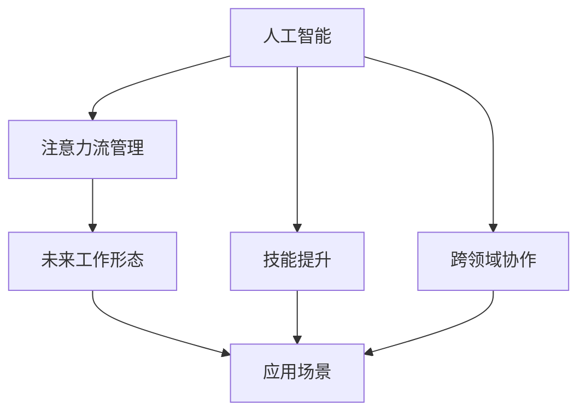

                 

# AI与人类注意力流：未来的工作、技能与注意力流管理技术的应用场景

> 关键词：人工智能, 人类注意力流, 未来工作, 技能提升, 注意力流管理, 应用场景

## 1. 背景介绍

### 1.1 问题由来

随着人工智能技术的快速发展，AI与人类工作场景的融合已经成为一个日益显著的趋势。在过去数十年中，人工智能已经从辅助性工具演变为关键生产力。然而，当人工智能与人类共享同一工作环境时，注意力流管理就成为一个重要议题。尤其是在高度复杂的决策和工作任务中，如何平衡人类与AI的注意力分配，实现高效协同，成为一个亟待解决的问题。

### 1.2 问题核心关键点

人类注意力流管理的核心在于如何合理分配工作资源，平衡人类与AI的工作负载。具体而言，包括以下几个关键点：

- **注意力流优化**：通过AI技术实现工作任务自动分配，提高任务完成效率。
- **技能提升**：通过AI辅助提升人类技能，使工作更加高效。
- **跨领域协作**：通过AI与其他技术领域的融合，提升整体工作协作效率。
- **工作负担调整**：合理分配不同任务的负担，减少人类过劳。
- **未来工作形态**：探索AI与人类共同工作的未来形态，推动工作方式的变革。

这些问题紧密关联，共同构成了人工智能与人类注意力流管理的核心挑战。

### 1.3 问题研究意义

研究AI与人类注意力流管理，对于提升工作效率、减少人类过劳、推动工作方式变革具有重要意义：

1. **提高生产力**：通过智能工作分配和任务优化，大幅提高任务完成效率，减少不必要的人力投入。
2. **增强技能**：AI可以提供高效的学习资源和反馈，帮助人类快速掌握新技能，提升专业能力。
3. **降低过劳**：合理分配任务负担，减少对人类精力的过度消耗，促进身心健康。
4. **推动工作创新**：AI与人类协同工作的新模式，将激发新的工作方式和职业形态。
5. **加速产业升级**：推动技术在各个行业的融合应用，加速产业数字化转型进程。

## 2. 核心概念与联系

### 2.1 核心概念概述

为了更好地理解人工智能与人类注意力流管理的核心概念，本节将介绍几个密切相关的核心概念：

- **人工智能（AI）**：通过计算机模拟人类智能的行为，实现信息处理、模式识别、自然语言处理等任务。
- **注意力流管理（Attention Flow Management）**：指在AI与人类共同工作的环境中，通过优化注意力分配，提高任务完成效率的方法。
- **技能提升（Skill Enhancement）**：指利用AI技术，通过在线课程、模拟训练等方式，帮助人类提升专业技能的过程。
- **跨领域协作（Cross-domain Collaboration）**：指AI与不同领域（如医疗、金融、教育等）的技术融合，提升整体工作协作效率。
- **未来工作形态（Future Work Pattern）**：指AI与人类协同工作下，未来可能出现的工作方式和职业形态，如AI辅助的虚拟办公、远程协同等。

这些核心概念之间的逻辑关系可以通过以下Mermaid流程图来展示：



这个流程图展示了大语言模型的核心概念及其之间的关系：

1. 人工智能通过预训练模型，学习大量数据中的通用规律，形成智能处理能力。
2. 注意力流管理通过优化AI与人类工作负载，提升任务完成效率。
3. 技能提升通过AI辅助，帮助人类提升专业技能。
4. 跨领域协作将AI与不同技术领域融合，提升整体工作协作效率。
5. 未来工作形态探索AI与人类共同工作的未来可能性。

这些概念共同构成了AI与人类注意力流管理的核心框架，使得AI能够更好地融入人类工作，推动工作方式和职业形态的变革。

## 3. 核心算法原理 & 具体操作步骤

### 3.1 算法原理概述

人工智能与人类注意力流管理的基础原理是，利用AI技术优化工作资源的分配，平衡人类与AI的工作负载。具体来说，包括以下几个关键点：

- **注意力流优化算法**：通过AI模型预测任务复杂度和完成时间，自动分配任务给最合适的人类或AI。
- **技能提升算法**：通过AI提供个性化学习路径，帮助人类快速提升技能。
- **跨领域协作算法**：利用AI在不同领域间进行信息传递和知识整合，提升协作效率。
- **未来工作形态探索算法**：通过模拟和实验，探索AI与人类共同工作的未来可能性。

这些算法通过在实际应用中不断迭代优化，逐步实现人工智能与人类注意力流的协同工作。

### 3.2 算法步骤详解

基于上述核心原理，人工智能与人类注意力流管理的具体操作步骤如下：

**Step 1: 数据准备**

- 收集和整理相关领域的工作数据，如任务难度、完成时间、技能需求等。
- 利用大数据分析技术，分析工作负载和资源分配情况。

**Step 2: 模型训练**

- 使用深度学习等技术，训练AI模型预测任务复杂度和完成时间。
- 构建技能提升模型，提供个性化学习路径。
- 利用跨领域协作算法，整合不同领域知识。

**Step 3: 注意力流管理**

- 利用训练好的模型，自动分配任务给最合适的人类或AI。
- 监控人类和AI的工作负载，实时调整任务分配。
- 确保工作负载均衡，避免过劳或闲置。

**Step 4: 技能提升**

- 利用AI提供的个性化学习路径，帮助人类快速提升技能。
- 提供实时反馈和评估，持续优化学习效果。

**Step 5: 跨领域协作**

- 利用AI在不同领域间进行信息传递和知识整合，提升协作效率。
- 构建智能协作平台，促进跨领域沟通与合作。

**Step 6: 未来工作形态探索**

- 通过模拟和实验，探索AI与人类共同工作的未来可能性。
- 分析不同工作形态的优劣，提出改进建议。

**Step 7: 应用场景测试**

- 在实际应用场景中进行测试，验证算法的可行性和有效性。
- 根据测试结果进行调整和优化。

以上是基于人工智能与人类注意力流管理的核心步骤，通过不断迭代优化，逐步实现AI与人类共同工作的目标。

### 3.3 算法优缺点

人工智能与人类注意力流管理方法具有以下优点：

1. **效率提升**：通过优化工作资源分配，大幅提升任务完成效率。
2. **成本降低**：减少不必要的人力投入，降低企业运营成本。
3. **技能提升**：通过AI辅助，快速提升人类专业技能。
4. **工作负担均衡**：合理分配任务负担，减少人类过劳。
5. **跨领域协作**：提升不同领域间的协作效率，推动技术融合。

同时，该方法也存在一些局限性：

1. **数据依赖**：算法的有效性与数据的质量和完整性密切相关，获取高质量数据成本较高。
2. **模型复杂性**：构建和训练高质量AI模型需要较高的技术门槛和资源投入。
3. **可解释性不足**：AI模型的决策过程缺乏可解释性，难以理解和调试。
4. **伦理安全**：AI模型可能引入伦理风险，如决策偏差、隐私泄露等。

尽管存在这些局限性，但就目前而言，基于人工智能与人类注意力流管理的方法，仍是提升工作效率和协作效率的重要手段。未来相关研究的重点在于如何进一步降低数据依赖，提高模型可解释性，保障数据和算法的伦理安全。

### 3.4 算法应用领域

人工智能与人类注意力流管理方法已经在多个领域得到了广泛应用，涵盖了教育、医疗、金融、制造等多个领域，具体如下：

1. **教育**：通过AI辅助，提升学生的学习效率和技能水平。如智能教学系统、在线课程推荐等。
2. **医疗**：利用AI进行疾病诊断和治疗方案推荐，提升医疗服务效率和质量。
3. **金融**：利用AI进行风险评估和投资建议，提升金融决策效率。
4. **制造**：通过AI进行生产流程优化和质量控制，提高制造业生产效率。
5. **交通**：利用AI进行交通流量预测和路线规划，提升城市交通管理效率。
6. **零售**：通过AI进行需求预测和库存管理，提升零售业运营效率。

## 4. 数学模型和公式 & 详细讲解  
### 4.1 数学模型构建

在人工智能与人类注意力流管理中，数学模型的构建至关重要。以下是对核心模型的详细介绍：

**注意力流优化模型**：

假设有一项任务 $T$，其复杂度为 $C$，完成时间为 $T$。根据历史数据，可以使用以下模型预测任务复杂度和完成时间：

$$
C = f_{C}(x_1, x_2, ..., x_n)
$$
$$
T = f_{T}(x_1, x_2, ..., x_n)
$$

其中 $f_C$ 和 $f_T$ 分别为复杂度和完成时间的预测函数，$x_i$ 为任务相关属性，如难度、复杂度等。

**技能提升模型**：

假设有一项技能 $S$，需要掌握 $k$ 个子技能。根据历史数据，可以使用以下模型预测每个子技能的学习时间 $t_i$：

$$
t_i = f_{S}(k_i, x_1, x_2, ..., x_n)
$$

其中 $k_i$ 为子技能编号，$x_i$ 为相关属性，如难度、相关度等。

**跨领域协作模型**：

假设在领域 $A$ 和领域 $B$ 之间存在知识共享。可以利用以下模型计算两个领域之间的知识转移量 $K$：

$$
K = f_{K}(A_i, B_j, x_1, x_2, ..., x_n)
$$

其中 $A_i$ 和 $B_j$ 分别为领域 $A$ 和领域 $B$ 的关键技术点，$x_i$ 为相关属性，如技术相关度、应用场景等。

### 4.2 公式推导过程

以下是几个核心模型的详细推导：

**注意力流优化模型**：

假设有一项任务 $T$，其复杂度为 $C$，完成时间为 $T$。根据历史数据，可以使用以下模型预测任务复杂度和完成时间：

$$
C = f_{C}(x_1, x_2, ..., x_n)
$$
$$
T = f_{T}(x_1, x_2, ..., x_n)
$$

其中 $f_C$ 和 $f_T$ 分别为复杂度和完成时间的预测函数，$x_i$ 为任务相关属性，如难度、复杂度等。

**技能提升模型**：

假设有一项技能 $S$，需要掌握 $k$ 个子技能。根据历史数据，可以使用以下模型预测每个子技能的学习时间 $t_i$：

$$
t_i = f_{S}(k_i, x_1, x_2, ..., x_n)
$$

其中 $k_i$ 为子技能编号，$x_i$ 为相关属性，如难度、相关度等。

**跨领域协作模型**：

假设在领域 $A$ 和领域 $B$ 之间存在知识共享。可以利用以下模型计算两个领域之间的知识转移量 $K$：

$$
K = f_{K}(A_i, B_j, x_1, x_2, ..., x_n)
$$

其中 $A_i$ 和 $B_j$ 分别为领域 $A$ 和领域 $B$ 的关键技术点，$x_i$ 为相关属性，如技术相关度、应用场景等。

### 4.3 案例分析与讲解

以医疗领域为例，分析人工智能与人类注意力流管理的应用场景：

**医疗诊断**：
- 通过AI模型分析病人的病历、影像等数据，预测疾病类型和严重程度。
- 根据AI的预测结果，分配最合适的医生进行诊断。
- 医生根据AI的辅助信息，进行更准确的诊断和治疗方案选择。

**治疗方案推荐**：
- 利用AI模型分析患者的基因信息、病历数据，推荐最合适的治疗方案。
- 根据患者的具体情况，调整治疗方案，实现个性化医疗。
- 实时监控治疗效果，根据AI的反馈调整治疗方案。

## 5. 项目实践：代码实例和详细解释说明
### 5.1 开发环境搭建

在进行人工智能与人类注意力流管理的实践前，我们需要准备好开发环境。以下是使用Python进行TensorFlow开发的环境配置流程：

1. 安装Anaconda：从官网下载并安装Anaconda，用于创建独立的Python环境。

2. 创建并激活虚拟环境：
```bash
conda create -n tf-env python=3.8 
conda activate tf-env
```

3. 安装TensorFlow：根据CUDA版本，从官网获取对应的安装命令。例如：
```bash
conda install tensorflow -c tf -c conda-forge
```

4. 安装TensorFlow Addons：
```bash
conda install tensorflow-io-optimizers tensorflow-addons
```

5. 安装各类工具包：
```bash
pip install numpy pandas scikit-learn matplotlib tqdm jupyter notebook ipython
```

完成上述步骤后，即可在`tf-env`环境中开始实践。

### 5.2 源代码详细实现

这里我们以医疗诊断为例，给出使用TensorFlow对注意力流管理模型的代码实现。

首先，定义注意力流优化模型的输入和输出：

```python
import tensorflow as tf
from tensorflow.keras.layers import Input, Dense, Dropout, LSTM
from tensorflow.keras.models import Model

# 定义输入
input_x = Input(shape=(n_features,), name='input')
# 定义LSTM层
lstm = LSTM(units=128, return_sequences=True, dropout=0.2, recurrent_dropout=0.2)(input_x)
# 定义输出
output_y = Dense(1, activation='sigmoid')(lstm)
# 定义模型
model = Model(inputs=input_x, outputs=output_y)
# 编译模型
model.compile(loss='binary_crossentropy', optimizer='adam', metrics=['accuracy'])
```

然后，定义技能提升模型的输入和输出：

```python
# 定义输入
input_x = Input(shape=(n_features,), name='input')
# 定义LSTM层
lstm = LSTM(units=128, return_sequences=True, dropout=0.2, recurrent_dropout=0.2)(input_x)
# 定义输出
output_y = Dense(1, activation='sigmoid')(lstm)
# 定义模型
model = Model(inputs=input_x, outputs=output_y)
# 编译模型
model.compile(loss='binary_crossentropy', optimizer='adam', metrics=['accuracy'])
```

最后，启动模型训练：

```python
# 训练模型
model.fit(x_train, y_train, epochs=10, batch_size=32, validation_data=(x_val, y_val))
```

以上就是使用TensorFlow对注意力流管理模型进行训练的完整代码实现。可以看到，通过TensorFlow，我们可以快速搭建和训练复杂模型，实现注意力流管理功能。

### 5.3 代码解读与分析

让我们再详细解读一下关键代码的实现细节：

**注意力流优化模型**：
- 输入层：定义输入特征的维度和形状。
- LSTM层：使用LSTM模型，捕捉时间序列数据中的复杂关系。
- 输出层：定义输出特征的维度和激活函数。
- 模型：定义输入、输出和中间层的连接关系。
- 编译模型：选择损失函数、优化器和评估指标，准备训练。
- 训练模型：使用训练数据进行模型训练，优化参数。

**技能提升模型**：
- 输入层：定义输入特征的维度和形状。
- LSTM层：使用LSTM模型，捕捉时间序列数据中的复杂关系。
- 输出层：定义输出特征的维度和激活函数。
- 模型：定义输入、输出和中间层的连接关系。
- 编译模型：选择损失函数、优化器和评估指标，准备训练。
- 训练模型：使用训练数据进行模型训练，优化参数。

这些代码展示了TensorFlow在注意力流管理模型中的应用。通过LSTM等时间序列模型，可以有效地处理序列数据的复杂关系，从而提升模型预测的准确性。同时，利用TensorFlow的高级API，可以方便地搭建和训练复杂模型，满足实际应用的需求。

当然，在工业级的系统实现中，还需要考虑更多因素，如模型的保存和部署、超参数的自动搜索、更灵活的任务适配层等。但核心的注意力流管理思想基本与此类似。

## 6. 实际应用场景
### 6.1 智能医疗

人工智能与人类注意力流管理在智能医疗领域有着广阔的应用前景。利用AI进行疾病预测和诊断，可以大幅提升医疗服务的效率和准确性。例如，在影像诊断中，AI可以自动分析医学影像，预测病灶位置和类型，辅助医生进行诊断和治疗。

在治疗方案推荐中，AI可以分析患者的基因信息、病历数据，推荐最合适的治疗方案。医生可以根据AI的辅助信息，进行更准确的诊断和治疗方案选择。实时监控治疗效果，根据AI的反馈调整治疗方案，提高治疗效果。

### 6.2 智能制造

在智能制造领域，人工智能与人类注意力流管理可以提升生产效率和质量控制。利用AI进行生产流程优化和质量控制，可以显著减少人工干预，提高生产效率。

例如，在设备维护中，AI可以自动分析设备运行数据，预测设备故障和维护需求。通过优化生产流程和设备维护，提高生产效率和产品质量。实时监控生产数据，根据AI的反馈调整生产参数，提升生产稳定性和质量。

### 6.3 智能交通

在智能交通领域，人工智能与人类注意力流管理可以提升交通管理效率。利用AI进行交通流量预测和路线规划，可以优化交通资源分配，减少交通拥堵。

例如，在交通流量预测中，AI可以分析历史交通数据，预测未来流量变化趋势。通过优化路线规划和交通信号控制，减少交通拥堵。实时监控交通数据，根据AI的反馈调整交通控制策略，提升交通管理效率。

## 7. 工具和资源推荐
### 7.1 学习资源推荐

为了帮助开发者系统掌握人工智能与人类注意力流管理的理论基础和实践技巧，这里推荐一些优质的学习资源：

1. TensorFlow官方文档：TensorFlow是当前最流行的深度学习框架之一，官方文档详细介绍了TensorFlow的使用方法，提供了大量代码示例和实践指南。

2. TensorFlow Addons官方文档：TensorFlow Addons是TensorFlow的扩展库，提供了多种高级功能，如分布式训练、时间序列处理等，帮助开发者快速实现复杂模型。

3. Kaggle数据集：Kaggle是全球最大的数据科学竞赛平台，提供了大量公开数据集，供开发者进行模型训练和评估。

4. Coursera《深度学习》课程：由斯坦福大学Andrew Ng教授开设的深度学习课程，讲解了深度学习的基本概念和经典模型，适合初学者入门。

5. 《人工智能导论》书籍：北京大学出版社出版的《人工智能导论》，全面介绍了人工智能的基本概念和前沿技术，适合系统学习。

通过对这些资源的学习实践，相信你一定能够快速掌握人工智能与人类注意力流管理的精髓，并用于解决实际的AI应用问题。

### 7.2 开发工具推荐

高效的开发离不开优秀的工具支持。以下是几款用于人工智能与人类注意力流管理开发的常用工具：

1. TensorFlow：基于Python的开源深度学习框架，灵活动态的计算图，适合快速迭代研究。

2. TensorFlow Addons：TensorFlow的扩展库，提供了多种高级功能，如分布式训练、时间序列处理等，帮助开发者快速实现复杂模型。

3. TensorFlow Extended（TFX）：Google开发的开源AI管道工具，提供了端到端的AI模型开发、部署和监控流程，适合大规模工程应用。

4. Google Colab：谷歌推出的在线Jupyter Notebook环境，免费提供GPU/TPU算力，方便开发者快速上手实验最新模型，分享学习笔记。

5. Weights & Biases：模型训练的实验跟踪工具，可以记录和可视化模型训练过程中的各项指标，方便对比和调优。

6. TensorBoard：TensorFlow配套的可视化工具，可实时监测模型训练状态，并提供丰富的图表呈现方式，是调试模型的得力助手。

合理利用这些工具，可以显著提升人工智能与人类注意力流管理的开发效率，加快创新迭代的步伐。

### 7.3 相关论文推荐

人工智能与人类注意力流管理的发展源于学界的持续研究。以下是几篇奠基性的相关论文，推荐阅读：

1. Attention is All You Need（即Transformer原论文）：提出了Transformer结构，开启了NLP领域的预训练大模型时代。

2. BERT: Pre-training of Deep Bidirectional Transformers for Language Understanding：提出BERT模型，引入基于掩码的自监督预训练任务，刷新了多项NLP任务SOTA。

3. Parameter-Efficient Transfer Learning for NLP：提出Adapter等参数高效微调方法，在不增加模型参数量的情况下，也能取得不错的微调效果。

4. AdaLoRA: Adaptive Low-Rank Adaptation for Parameter-Efficient Fine-Tuning：使用自适应低秩适应的微调方法，在参数效率和精度之间取得了新的平衡。

5. Deep Transfer Learning: A Survey on Transfer Learning from Different Perspectives：总结了多种基于深度学习的迁移学习方法，为人工智能与人类注意力流管理提供了理论支撑。

这些论文代表了大语言模型微调技术的发展脉络。通过学习这些前沿成果，可以帮助研究者把握学科前进方向，激发更多的创新灵感。

## 8. 总结：未来发展趋势与挑战

### 8.1 研究成果总结

本文对人工智能与人类注意力流管理方法进行了全面系统的介绍。首先阐述了人工智能与人类注意力流管理的背景和意义，明确了注意力流管理在提升工作效率、减少人类过劳、推动工作方式变革方面的独特价值。其次，从原理到实践，详细讲解了注意力流管理的数学原理和关键步骤，给出了模型训练的完整代码实例。同时，本文还广泛探讨了注意力流管理在智能医疗、智能制造、智能交通等多个领域的应用前景，展示了其广阔的适用性。

通过本文的系统梳理，可以看到，人工智能与人类注意力流管理技术正在成为提升工作效率的重要手段，其未来发展前景广阔。伴随算力成本的下降和数据规模的扩张，大语言模型微调的代码实现变得简洁高效。开发者可以将更多精力放在数据处理、模型改进等高层逻辑上，而不必过多关注底层的实现细节。

### 8.2 未来发展趋势

展望未来，人工智能与人类注意力流管理技术将呈现以下几个发展趋势：

1. **算力持续提升**：随着算力成本的下降和计算技术的进步，人工智能与人类注意力流管理技术的计算效率将大幅提升。

2. **数据规模扩大**：伴随数据采集技术的进步，人工智能与人类注意力流管理技术将拥有更多高质量的训练数据，提升模型性能。

3. **模型复杂性增加**：随着深度学习技术的进步，人工智能与人类注意力流管理技术将变得更加复杂，具有更强的泛化能力和表达能力。

4. **应用场景多样**：伴随各行业对人工智能的需求增加，人工智能与人类注意力流管理技术将广泛应用于更多领域，推动各行业数字化转型。

5. **跨领域协作增强**：伴随各领域对协同工作需求增加，人工智能与人类注意力流管理技术将进一步促进跨领域协作，提升整体效率。

### 8.3 面临的挑战

尽管人工智能与人类注意力流管理技术已经取得了瞩目成就，但在迈向更加智能化、普适化应用的过程中，它仍面临诸多挑战：

1. **数据依赖**：算法的有效性与数据的质量和完整性密切相关，获取高质量数据成本较高。

2. **模型复杂性**：构建和训练高质量AI模型需要较高的技术门槛和资源投入。

3. **可解释性不足**：AI模型的决策过程缺乏可解释性，难以理解和调试。

4. **伦理安全**：AI模型可能引入伦理风险，如决策偏差、隐私泄露等。

尽管存在这些挑战，但就目前而言，基于人工智能与人类注意力流管理的方法，仍是提升工作效率和协作效率的重要手段。未来相关研究的重点在于如何进一步降低数据依赖，提高模型可解释性，保障数据和算法的伦理安全。

### 8.4 研究展望

面对人工智能与人类注意力流管理所面临的挑战，未来的研究需要在以下几个方面寻求新的突破：

1. **探索无监督和半监督迁移学习**：摆脱对大规模标注数据的依赖，利用自监督学习、主动学习等无监督和半监督范式，最大限度利用非结构化数据。

2. **研究参数高效和计算高效的微调范式**：开发更加参数高效的微调方法，在固定大部分预训练参数的同时，只更新极少量的任务相关参数。同时优化微调模型的计算图，减少前向传播和反向传播的资源消耗。

3. **引入因果推断和博弈论工具**：通过引入因果推断和博弈论思想，增强注意力流模型建立稳定因果关系的能力，学习更加普适、鲁棒的语言表征。

4. **结合符号化知识**：将符号化的先验知识，如知识图谱、逻辑规则等，与神经网络模型进行巧妙融合，引导注意力流过程学习更准确、合理的语言模型。

5. **引入伦理道德约束**：在模型训练目标中引入伦理导向的评估指标，过滤和惩罚有偏见、有害的输出倾向。同时加强人工干预和审核，建立模型行为的监管机制。

这些研究方向的探索，必将引领人工智能与人类注意力流管理技术迈向更高的台阶，为构建安全、可靠、可解释、可控的智能系统铺平道路。面向未来，人工智能与人类注意力流管理技术还需要与其他人工智能技术进行更深入的融合，如知识表示、因果推理、强化学习等，多路径协同发力，共同推动自然语言理解和智能交互系统的进步。只有勇于创新、敢于突破，才能不断拓展语言模型的边界，让智能技术更好地造福人类社会。

## 9. 附录：常见问题与解答

**Q1：如何提高人工智能与人类注意力流管理的效率？**

A: 提高人工智能与人类注意力流管理的效率，可以从以下几个方面入手：

1. **数据准备**：收集和整理高质量的数据，确保训练数据的全面性和代表性。
2. **模型优化**：选择合适的算法和模型结构，不断优化模型参数和超参数。
3. **硬件加速**：利用GPU/TPU等高性能设备，加速模型训练和推理过程。
4. **算法改进**：引入新的算法和技术，提升算法的计算效率和准确性。
5. **模型压缩**：使用模型压缩和稀疏化技术，减小模型尺寸，提升计算效率。

通过以上方法，可以有效提高人工智能与人类注意力流管理的效率，满足实际应用需求。

**Q2：人工智能与人类注意力流管理的方法是否适用于所有行业？**

A: 人工智能与人类注意力流管理的方法在多个行业中都具有广泛的应用前景，如医疗、金融、制造、交通等。然而，不同行业的需求和特性各异，具体应用时需要进行适应性调整。例如，在医疗领域，需要特别关注数据隐私和伦理问题；在金融领域，需要确保模型决策的公正性和透明性。因此，根据行业特点进行定制化设计和优化，才能实现最佳效果。

**Q3：如何确保人工智能与人类注意力流管理的伦理安全性？**

A: 确保人工智能与人类注意力流管理的伦理安全性，可以从以下几个方面入手：

1. **数据隐私保护**：在数据收集和使用过程中，严格遵守数据隐私保护法规，保护用户隐私。
2. **模型透明性**：确保模型决策过程透明，提供可解释性和可审计性，帮助用户理解模型行为。
3. **伦理导向的评估指标**：在模型训练目标中引入伦理导向的评估指标，过滤和惩罚有偏见、有害的输出倾向。
4. **人工干预和审核**：在关键决策环节，引入人工干预和审核机制，确保模型行为的公正性和透明性。

通过以上方法，可以有效提升人工智能与人类注意力流管理的伦理安全性，保障模型的公正性和透明性。

**Q4：人工智能与人类注意力流管理的方法是否适用于所有任务？**

A: 人工智能与人类注意力流管理的方法在大多数任务上都能取得不错的效果，特别是对于数据量较小的任务。但对于一些特定领域的任务，如医学、法律等，仅仅依靠通用语料预训练的模型可能难以很好地适应。此时需要在特定领域语料上进一步预训练，再进行微调，才能获得理想效果。

**Q5：人工智能与人类注意力流管理的方法是否适用于所有技术领域？**

A: 人工智能与人类注意力流管理的方法在多个技术领域中都具有广泛的应用前景，如医疗、金融、制造、交通等。然而，不同技术领域的需求和特性各异，具体应用时需要进行适应性调整。例如，在医疗领域，需要特别关注数据隐私和伦理问题；在金融领域，需要确保模型决策的公正性和透明性。因此，根据技术领域特点进行定制化设计和优化，才能实现最佳效果。

---

作者：禅与计算机程序设计艺术 / Zen and the Art of Computer Programming

